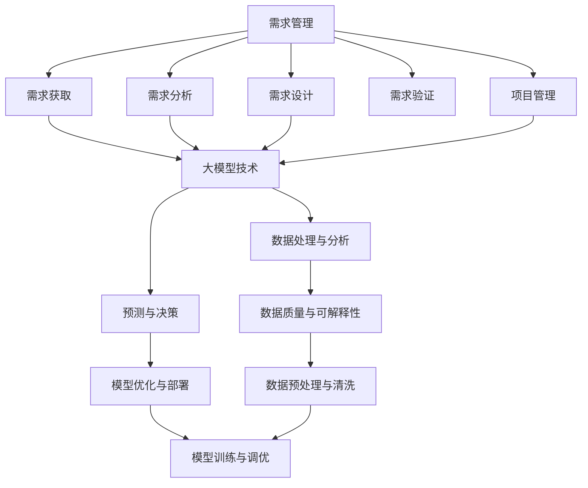

                 

## 文章标题

### 大模型时代的需求管理新思路

在当今技术迅猛发展的时代，人工智能大模型技术已成为引领变革的重要力量。这些庞大的模型不仅改变了数据处理和智能决策的方式，也对需求管理带来了深远的影响。面对这一变化，如何有效地进行需求管理成为企业面临的重大课题。本文旨在探讨大模型时代的需求管理新思路，为读者提供一份系统的理论和实践指南。

## 文章关键词

- 大模型
- 需求管理
- 项目管理
- 人工智能
- 数据分析
- 机器学习

## 摘要

本文从大模型时代的背景出发，深入分析了需求管理在人工智能大模型应用中的新挑战和新机遇。文章首先介绍了需求管理的基本概念和理论，然后详细阐述了大模型技术的原理和应用。接着，本文探讨了如何利用大模型技术提升需求管理的效率，包括需求分析、设计方法和项目管理实践。通过实际案例分析和数学模型讲解，本文提供了丰富的实战经验和理论基础，旨在为读者提供全面的需求管理新思路。

## 引言

### 大模型时代的背景

近年来，人工智能技术取得了飞跃性进展，尤其是大模型技术的崛起，推动了整个行业的发展。大模型，如GPT-3、BERT等，具有处理海量数据和生成复杂结果的能力，已经在自然语言处理、图像识别、推荐系统等领域取得了显著成果。这些大模型的广泛应用，不仅提升了数据处理和智能决策的效率，也带来了新的挑战。

首先，大模型对数据处理能力的需求大幅提升。传统需求管理往往依赖手工收集和分析数据，而大模型需要大量高质量的训练数据来训练模型，这要求企业在数据收集、处理和存储方面进行大量投入。其次，大模型的应用场景日益多样化，需求管理需要适应不同场景下的需求变化，这增加了需求管理的复杂度。最后，大模型的高效性和可靠性对需求管理提出了更高的要求，需求管理需要确保模型的输入输出符合预期，并在出现问题时能够迅速定位和解决问题。

### 需求管理的挑战与机遇

在大模型时代，需求管理面临着诸多挑战。首先，大模型的复杂性和不确定性使得需求分析变得更加困难。传统需求分析依赖于专家经验和用户需求描述，而大模型的黑箱特性使得需求分析变得更加复杂。其次，大模型的高成本和资源消耗对需求管理提出了新的要求。企业需要投入大量资金和人力物力来维护和优化大模型，这要求需求管理在资源分配和成本控制方面具有更高的效率和精度。

然而，大模型时代也为需求管理带来了新的机遇。首先，大模型能够高效地处理和分析海量数据，为需求分析提供了强大的工具支持。通过数据驱动的需求分析，企业可以更准确地识别用户需求，制定更科学的需求计划。其次，大模型的应用可以优化需求设计流程，提高需求设计的灵活性和适应性。通过大模型驱动的需求设计，企业可以快速响应市场变化，提高产品竞争力。最后，大模型的应用可以提高需求管理的自动化程度，降低人力成本，提高工作效率。

总的来说，大模型时代既为需求管理带来了挑战，也提供了新的机遇。如何有效地应对这些挑战，利用大模型技术提升需求管理的效率和质量，是当前需求管理领域需要深入探讨的重要课题。

## 确定核心概念与联系

在探讨大模型时代的需求管理新思路之前，我们需要明确几个核心概念，并理解它们之间的联系。这些概念包括需求管理、大模型技术、需求分析、需求设计和项目管理等。

### 需求管理

需求管理是指在整个产品开发过程中，识别、分析、记录、跟踪和满足用户需求的一系列活动和过程。它包括需求获取、需求分析、需求设计、需求验证和需求管理五个阶段。需求管理的目标是确保产品能够满足用户需求，并在开发过程中保持需求的一致性和稳定性。

### 大模型技术

大模型技术是指使用大型神经网络进行训练和预测的技术。这些模型通常包含数亿甚至数十亿个参数，能够处理海量数据和复杂任务。大模型技术广泛应用于自然语言处理、图像识别、推荐系统、语音识别等领域。大模型技术的核心在于其强大的数据处理和分析能力，能够从大量数据中提取有用信息，生成高精度的预测和决策。

### 需求分析

需求分析是指识别和理解用户需求的过程。在大模型时代，需求分析面临着新的挑战，如如何有效地利用大模型技术从大量数据中提取用户需求，如何处理大模型的黑箱特性等。需求分析的结果直接影响需求设计的效果，因此在大模型时代，需求分析需要更加精准和高效。

### 需求设计

需求设计是指根据需求分析的结果，设计满足用户需求的产品或系统。在大模型时代，需求设计可以借助大模型技术进行优化，提高设计的灵活性和适应性。需求设计需要考虑如何利用大模型进行预测和决策，以提高产品的智能化程度和用户体验。

### 项目管理

项目管理是指规划、执行、监控和关闭项目的一系列活动和过程。在大模型时代，项目管理需要面对新的挑战，如如何有效地管理和优化大模型资源，如何确保大模型的应用符合项目目标等。项目管理在需求管理中起着关键作用，它需要协调各种资源，确保项目按时、按质完成。

### 核心概念之间的联系

这几个核心概念在大模型时代的需求管理中紧密相连。需求管理是整个流程的起点，它通过需求获取、分析和设计，确保产品或系统能够满足用户需求。大模型技术作为需求管理的工具，可以提升需求分析、设计和项目管理的效率和质量。需求分析和需求设计依赖于大模型技术的支持，它们需要有效地利用大模型从数据中提取信息，进行预测和决策。而项目管理则在整个流程中起着协调和优化的作用，确保大模型的应用能够符合项目目标和用户需求。

为了更直观地展示这几个核心概念之间的联系，我们可以使用Mermaid流程图来绘制整个需求管理系统的架构：



这个Mermaid流程图展示了大模型时代需求管理系统的整体架构，从需求获取到数据处理、需求分析、需求设计、项目管理以及模型训练和部署等环节。通过这个流程图，我们可以清晰地看到各个核心概念之间的联系，以及大模型技术在需求管理中的关键作用。

## 需求管理的理论基础

### 需求管理的定义

需求管理是一个多层次、多维度的复杂过程，它涉及到从用户需求识别、分析、记录到最终满足用户需求的全过程。根据国际需求工程协会（International Association of Software Architects，INCOSE）的定义，需求管理是指确保项目及其产品满足所需需求的一系列活动和过程。这些需求不仅包括用户需求，还包括项目需求、业务需求和系统需求等。

需求管理的主要目标包括：

1. **确保需求的一致性**：在整个项目生命周期中，需求的一致性是至关重要的。需求的一致性意味着在不同阶段（如需求获取、分析、设计和实现）中，需求不会出现冲突或变化。
2. **提高需求的可跟踪性**：需求的可跟踪性是指需求在整个项目生命周期中的状态变化可以被清晰地记录和查询。这有助于项目团队在需求变更时能够快速做出反应。
3. **确保需求的实现**：需求管理的最终目标是确保项目交付的产品或系统能够满足预定的需求。

### 需求管理的基本原则

为了有效地进行需求管理，项目团队需要遵循一些基本原则：

1. **用户参与**：用户参与是需求管理成功的关键。在需求获取和验证阶段，用户的积极参与有助于确保需求的准确性和可实现性。
2. **需求优先级**：在众多需求中，明确需求的优先级是必要的。通过优先级排序，项目团队可以更有效地分配资源和时间，确保关键需求优先得到满足。
3. **需求变更控制**：需求变更在项目开发过程中是不可避免的。有效的需求变更控制机制可以帮助项目团队在需求变更时能够快速评估变更的影响，并做出合理的决策。
4. **需求文档化**：需求文档是需求管理的重要输出。详尽的需求文档可以帮助项目团队更好地理解需求，减少误解和沟通障碍。
5. **需求验证与确认**：需求验证与确认是确保需求准确性和可实现性的关键步骤。通过验证和确认，项目团队可以确保需求符合用户期望，并能实际实现。

### 常见的需求分析方法

在需求管理过程中，常用的需求分析方法包括以下几种：

1. **用户故事**：用户故事是一种简单、易理解的需求描述方法，通常由一个简短的句子组成，描述一个用户需求。用户故事通常包括用户角色、目标场景和预期结果。
2. **用例图**：用例图是一种图形化的需求描述方法，用于展示系统如何与用户进行交互。用例图包括参与者（如用户、系统等）和用例（如功能操作等），能够清晰地展示系统的功能需求。
3. **功能需求规格**：功能需求规格是一种详细的文本描述方法，用于详细描述系统的功能需求。功能需求规格通常包括功能描述、输入、输出和处理流程等。
4. **非功能需求**：非功能需求描述了系统的质量属性，如性能、可靠性、安全性等。非功能需求通常通过具体的指标进行量化，以便在项目开发过程中进行评估和验证。
5. **用户调研**：用户调研是一种通过直接与用户交流来获取需求的方法。用户调研可以通过访谈、问卷调查、焦点小组讨论等方式进行，有助于深入了解用户需求和行为。

这些需求分析方法各有优缺点，项目团队可以根据具体需求和项目背景选择合适的方法。例如，用户故事和用例图适用于需求获取和初步分析阶段，而功能需求规格和非功能需求则适用于详细设计和验证阶段。

通过遵循需求管理的基本原则和采用合适的需求分析方法，项目团队可以更有效地识别、分析和满足用户需求，确保项目成功交付。

## 大模型技术概述

### 大模型的基本原理

大模型（Large Models）是指具有数亿甚至数十亿参数的神经网络模型，其结构复杂，能够处理海量数据并进行高精度的预测和决策。大模型的核心原理是基于深度学习（Deep Learning），通过多层神经网络（Neural Networks）对数据进行特征提取和模式识别。

大模型的基本架构通常包括以下几个部分：

1. **输入层**：输入层接收原始数据，并将其传递到下一层。
2. **隐藏层**：隐藏层负责对输入数据进行特征提取和变换，每一层都能捕捉到不同层次的信息。
3. **输出层**：输出层根据隐藏层的输出产生最终的预测结果。

大模型通过反向传播算法（Backpropagation Algorithm）不断调整权重和偏置，以最小化预测误差，从而提高模型的准确性和鲁棒性。训练过程通常涉及大量数据和强大的计算资源，以实现模型的优化和调优。

### 大模型的应用场景

大模型技术的广泛应用源于其在处理复杂任务方面的卓越能力。以下是一些典型的大模型应用场景：

1. **自然语言处理（NLP）**：大模型在自然语言处理领域表现出色，如文本生成、机器翻译、情感分析等。例如，OpenAI的GPT-3模型具有1750亿个参数，能够在多种语言和任务中实现高质量的文本生成和翻译。

2. **计算机视觉（CV）**：大模型在计算机视觉领域也取得了显著进展，如图像识别、目标检测、图像生成等。著名的模型如ImageNet中的ResNet，具有数百万个参数，能够准确识别数万种图像类别。

3. **推荐系统**：大模型在推荐系统中被用于个性化推荐和预测用户行为。通过分析用户历史数据，大模型可以生成个性化的推荐结果，从而提高推荐系统的准确性和用户体验。

4. **语音识别**：大模型在语音识别领域取得了重大突破，如使用WaveNet进行语音合成、使用深度神经网络进行语音识别。这些模型能够准确识别和理解不同口音、语速和背景噪音下的语音。

5. **游戏AI**：大模型在游戏AI中也被广泛应用，如AlphaGo使用深度学习和强化学习技术，击败了世界围棋冠军。大模型能够通过自我学习和游戏经验，实现高度智能的决策和策略。

### 大模型技术的优势

大模型技术具有以下几个显著优势：

1. **强大的数据处理能力**：大模型能够处理海量数据和复杂任务，从数据中提取有用信息，生成高精度的预测和决策。
2. **高准确性和鲁棒性**：通过多层神经网络和反向传播算法，大模型能够不断优化和调整参数，提高模型的准确性和鲁棒性。
3. **多任务处理能力**：大模型具有多任务处理能力，可以在不同领域和任务之间进行切换和迁移，提高模型的通用性和灵活性。
4. **自适应性和学习能力**：大模型能够通过不断学习和自我调整，适应新的数据和任务，提高模型的适应性和学习能力。

总的来说，大模型技术以其强大的数据处理能力和高准确性，在各个领域中展现了巨大的应用潜力。随着技术的不断进步和优化，大模型将在未来发挥更加重要的作用，推动人工智能技术的发展。

## 大模型与需求管理的结合

### 大模型在需求管理中的应用

在需求管理中，大模型技术提供了许多新的应用场景和工具，极大地提升了需求管理的效率和效果。以下是一些具体的应用实例：

1. **需求预测**：大模型可以基于历史数据和用户行为，预测未来的需求趋势。例如，在电子商务领域，大模型可以分析用户的购物历史、浏览行为和社交媒体活动，预测用户可能的需求和购买意向，从而帮助企业制定更精准的市场营销策略。

2. **需求分析**：大模型能够对大量文本数据进行分析，提取关键信息并生成摘要。这在需求获取和验证过程中非常有用。例如，通过分析用户反馈和评论，大模型可以识别出用户的主要需求和痛点，从而帮助企业改进产品和服务。

3. **需求自动化**：大模型可以用于自动化需求管理流程中的某些步骤，如需求获取、分析和设计。例如，通过自然语言处理技术，大模型可以自动生成用户故事和用例图，从而减少手工工作的负担。

4. **需求优化**：大模型可以通过优化算法，对需求进行优先级排序和资源分配。例如，在项目管理中，大模型可以根据项目的需求和资源情况，自动优化任务调度和人员安排，从而提高项目的执行效率。

### 大模型与需求分析的融合

在大模型时代，需求分析与大模型技术的融合为需求管理带来了新的机遇。以下是几个关键融合点：

1. **多维度数据分析**：大模型可以处理来自多个维度的数据，如用户行为数据、市场数据、技术数据等，进行综合分析，从而更全面地理解用户需求和市场趋势。

2. **深度学习算法**：大模型通常采用深度学习算法，这些算法能够自动学习数据中的复杂模式和关联，从而提高需求分析的准确性和效率。

3. **自适应需求模型**：通过大模型，可以建立自适应的需求模型，这些模型可以根据实时数据不断调整和优化，从而更好地适应市场变化和用户需求。

4. **实时需求反馈**：大模型可以实时分析用户反馈和需求变化，提供即时的需求预测和优化建议，从而帮助企业快速响应市场变化。

### 大模型与需求设计的创新

在大模型时代，需求设计也面临着新的挑战和机遇。以下是几个创新点：

1. **智能化设计工具**：大模型可以用于开发智能化设计工具，如自动生成界面布局、自动生成代码框架等，从而提高需求设计的效率和灵活性。

2. **模型驱动的需求设计**：通过大模型，可以建立模型驱动的需求设计方法，这些方法能够根据需求分析的结果，自动生成设计文档和原型，从而减少手工设计的工作量。

3. **多模型融合**：在大模型时代，可以将多种模型（如机器学习模型、深度学习模型、强化学习模型等）进行融合，从而实现更复杂和智能的需求设计。

4. **用户体验优化**：通过大模型，可以实时分析用户交互数据，优化用户界面和交互设计，从而提供更好的用户体验。

总的来说，大模型技术在需求管理中的应用和融合，为需求分析、设计和项目管理带来了新的工具和方法，极大地提升了需求管理的效率和效果。随着大模型技术的不断进步，未来需求管理将更加智能化和自动化，为企业带来更大的竞争优势。

## 需求分析与设计方法

在大模型时代，需求分析是确保项目成功的关键环节。需求分析不仅涉及到传统的需求获取和需求建模，还涉及到如何利用大模型技术进行深度分析和设计。以下是详细的需求分析方法和设计方法。

### 需求分析

#### 数据预处理

数据预处理是需求分析的基础，其目标是确保数据的质量和一致性。在大模型时代，数据预处理通常包括以下步骤：

1. **数据清洗**：去除数据中的噪声和不一致信息，如缺失值、重复值和异常值等。
2. **数据转换**：将数据转换为适合大模型训练的形式，如标准化、归一化、编码等。
3. **数据集成**：将来自不同数据源的数据进行整合，形成统一的数据集。

伪代码示例：
```python
# 数据清洗
data_clean = clean_data(raw_data)

# 数据转换
data_transformed = transform_data(data_clean)

# 数据集成
dataIntegrated = integrate_data(data_transformed)
```

#### 特征提取

特征提取是需求分析的核心，其目标是提取出数据中的关键特征，用于大模型训练。以下是特征提取的几个步骤：

1. **自动特征生成**：利用大模型技术自动生成新的特征，如文本数据的词嵌入、图像数据的高维特征等。
2. **特征选择**：通过统计分析、决策树等方法选择最相关的特征，减少特征维度。
3. **特征组合**：将多个特征组合成新的特征，以增加模型的预测能力。

伪代码示例：
```python
# 自动特征生成
features_generated = generate_features(dataIntegrated)

# 特征选择
selected_features = select_features(features_generated)

# 特征组合
combined_features = combine_features(selected_features)
```

#### 需求预测与评估

需求预测是通过大模型对未来的需求进行预测，其结果直接影响需求设计。以下是需求预测和评估的几个步骤：

1. **模型训练**：使用大模型训练算法，如神经网络、决策树等，对数据进行训练，以生成预测模型。
2. **预测评估**：使用交叉验证、A/B测试等方法对模型进行评估，确保预测结果的准确性。
3. **实时预测**：将训练好的模型应用于实际数据，进行实时需求预测。

伪代码示例：
```python
# 模型训练
model = train_model(combined_features, labels)

# 预测评估
evaluation = evaluate_model(model, validation_data)

# 实时预测
predictions = model.predict(real_time_data)
```

### 需求设计

#### 设计流程

需求设计是根据需求分析的结果，设计出满足用户需求的产品或系统。以下是需求设计的几个步骤：

1. **需求建模**：基于需求预测的结果，建立需求模型，描述系统的功能和非功能需求。
2. **设计验证**：通过用户测试和评审，验证需求设计的可行性和合理性。
3. **设计迭代**：根据验证结果，对需求设计进行迭代和优化。

#### 大模型驱动的需求设计方法

大模型技术在需求设计中的应用，可以显著提高设计的灵活性和适应性。以下是几种大模型驱动的需求设计方法：

1. **生成式设计**：利用大模型生成设计原型，如自动生成用户界面、生成代码框架等。
2. **适应式设计**：利用大模型对设计进行实时优化，以适应不断变化的需求和市场。
3. **协同设计**：结合专家知识和大模型预测，进行协同需求设计，提高设计效率和准确性。

#### 设计案例解析

以下是一个具体的设计案例：

假设我们需要设计一个智能推荐系统，用于推荐商品给用户。以下是需求设计的过程：

1. **需求建模**：根据用户行为数据，建立用户兴趣模型和商品推荐模型。
2. **设计验证**：通过模拟用户行为和A/B测试，验证推荐系统的效果和用户满意度。
3. **设计迭代**：根据验证结果，对推荐算法和用户界面进行优化。

通过上述步骤，我们可以设计出满足用户需求的智能推荐系统。这个案例展示了如何利用大模型技术进行需求分析和设计，提高了系统的智能化程度和用户体验。

总的来说，在大模型时代，需求分析和设计方法面临着新的挑战和机遇。通过有效的需求分析方法和设计方法，结合大模型技术，我们可以实现更精准、高效的需求管理，为企业带来更大的竞争优势。

## 项目管理实践

在大模型时代，项目管理的复杂性显著增加，特别是在资源分配、项目规划和执行方面。以下将详细探讨如何在当前的大模型时代背景下进行项目管理，包括项目规划、执行和监控的实践方法。

### 项目规划

项目规划是项目管理的首要任务，它为项目提供了明确的方向和目标。在大模型时代，项目规划需要特别关注以下几个方面：

1. **资源评估**：由于大模型训练和优化需要大量的计算资源和数据存储，项目规划必须首先评估所需的硬件资源和数据处理能力。这通常涉及到购买或租赁高性能计算服务器和云计算资源。

2. **时间安排**：大模型训练通常需要很长时间，项目规划应包括详细的训练时间表，以便在项目初期预留足够的时间。此外，还需考虑模型的迭代和优化时间。

3. **风险评估**：大模型项目可能面临数据隐私、模型鲁棒性、计算成本等方面的风险。项目规划阶段应进行风险评估，并制定相应的预防和应对措施。

4. **需求分析**：在项目规划阶段，需要与大模型的需求紧密集成，确保项目目标与需求分析的结果一致。这可能涉及到与业务团队和用户进行多次沟通，以确保需求准确和全面。

### 项目执行

项目执行是项目管理的核心阶段，它涉及将项目计划转化为实际工作。以下是项目执行的关键实践方法：

1. **模型训练与优化**：项目团队需要按照预定的训练时间表进行模型训练。这通常包括数据预处理、模型选择、参数调整和训练过程。在训练过程中，团队需要监控模型性能，及时调整模型参数，以提高模型的准确性和鲁棒性。

2. **团队协作**：在大模型项目中，团队成员通常需要具备跨学科的知识，包括数据科学家、软件工程师、产品经理和业务分析师等。有效的团队协作是确保项目成功的关键。

3. **自动化与工具支持**：为了提高效率，项目团队应采用自动化工具和平台，如自动化训练脚本、模型评估工具等。此外，利用项目管理软件和协作工具，如JIRA、Trello等，可以帮助团队更好地跟踪任务进度和协作。

4. **反馈机制**：项目执行过程中，应建立反馈机制，及时收集用户和业务团队的反馈。这些反馈可用于模型的迭代和优化，以确保模型满足实际需求。

### 项目监控

项目监控是确保项目按计划进行的重要环节。在大模型时代，项目监控需要特别关注以下几个方面：

1. **性能监控**：监控模型性能是项目监控的核心。团队需要定期评估模型的准确度、召回率、F1分数等关键指标，以确保模型保持良好的性能。

2. **成本监控**：由于大模型训练和优化涉及大量计算资源，团队需要实时监控计算资源的消耗和成本。这有助于及时发现资源浪费并采取相应的优化措施。

3. **安全监控**：数据安全和模型安全是项目监控的重要内容。团队需要确保数据传输和存储的安全性，并采取适当的措施防止模型泄漏和滥用。

4. **进度监控**：团队需要定期审查项目进度，确保所有任务按计划进行。如果发现进度落后，团队需要及时调整计划和资源分配，以确保项目能够按时完成。

### 实践案例

以下是一个具体的项目管理实践案例：

假设一家电子商务公司计划开发一个基于人工智能的个性化推荐系统。以下是项目管理的具体步骤：

1. **项目规划**：
   - 评估所需计算资源和数据存储容量。
   - 制定详细的训练和优化时间表。
   - 风险评估，包括数据隐私和安全风险。
   - 与业务团队和用户沟通，明确需求。

2. **项目执行**：
   - 数据科学家和数据工程师合作，进行数据预处理和模型训练。
   - 使用自动化工具和平台管理训练过程。
   - 建立反馈机制，收集用户和业务团队的反馈。
   - 持续优化模型，提高推荐系统的准确性和用户体验。

3. **项目监控**：
   - 定期评估模型性能，确保满足业务需求。
   - 监控计算资源消耗和成本，优化资源使用。
   - 确保数据安全和模型安全。
   - 定期审查项目进度，确保按时交付。

通过上述步骤，电子商务公司成功开发并部署了一个高效的个性化推荐系统，显著提升了用户满意度和销售转化率。

总的来说，在大模型时代，有效的项目管理需要综合考虑资源、时间、质量和安全等多个方面，通过科学的规划、执行和监控，确保项目的成功实施和持续优化。

## 案例分析

在本部分，我们将通过一个实际案例，展示大模型技术在需求管理中的应用，并提供详细的实现和分析过程。

### 案例背景

假设一家互联网公司计划开发一款智能客服系统，该系统需要能够自动识别用户问题并给出合适的解决方案。为了提高客服系统的智能化水平，公司决定利用大模型技术进行需求管理，以优化需求分析和设计。

### 实施过程

1. **数据收集与预处理**：
   - 数据收集：公司收集了大量的用户聊天记录、FAQ文档和人工客服的回复记录。
   - 数据预处理：对收集的数据进行清洗，去除无效信息和噪声，并进行文本预处理，如分词、去停用词、词性标注等。

2. **需求分析**：
   - 利用自然语言处理（NLP）技术，对用户聊天记录进行情感分析和主题分类，以识别用户的主要问题和需求。
   - 建立一个问答对数据集，包含常见问题和对应的解决方案，用于训练大模型。

3. **大模型训练**：
   - 使用GPT-3模型进行训练，该模型能够处理和理解复杂的自然语言文本。
   - 调整模型的参数，如学习率、批次大小和训练轮次，以优化模型性能。

4. **需求设计**：
   - 基于训练好的大模型，设计智能客服系统的交互界面和功能模块。
   - 利用大模型进行实时问答，自动生成用户问题的解决方案。

5. **系统部署与优化**：
   - 将训练好的大模型部署到生产环境中，集成到智能客服系统中。
   - 监控系统性能，收集用户反馈，不断优化模型和系统。

### 分析与解读

1. **数据处理与分析**：
   - 数据预处理是成功的关键，高质量的预处理可以显著提升大模型的性能。
   - 通过情感分析和主题分类，可以更准确地识别用户的需求，提高需求分析的准确性。

2. **大模型性能**：
   - GPT-3模型具有强大的自然语言处理能力，能够生成高质量的文本，从而提高客服系统的智能化程度。
   - 模型的性能可以通过多次迭代和优化不断提升，以满足不断变化的需求。

3. **系统优化**：
   - 系统部署后，通过实时收集用户反馈，可以不断优化模型和系统，提高用户满意度。
   - 定期评估系统性能，确保其能够稳定、高效地运行。

### 项目小结

通过本案例，我们可以看到大模型技术在需求管理中的应用不仅提高了需求分析的准确性和效率，还有效提升了系统的智能化水平和用户体验。以下是本项目的小结：

1. **成功因素**：
   - 数据预处理和质量是关键，高质量的预处理和准确的模型训练可以提高系统的性能。
   - 用户参与和反馈是优化系统的关键，通过实时收集用户反馈，可以不断改进系统。

2. **不足与改进**：
   - 数据预处理工作量较大，未来可以考虑自动化预处理工具，提高效率。
   - 模型训练和优化需要大量时间和计算资源，未来可以考虑使用更高效的算法和分布式训练方法。

3. **未来方向**：
   - 进一步优化大模型的性能和稳定性，提高系统的智能化程度。
   - 探索更多应用场景，如自动化客户服务、智能推荐等，扩大大模型技术的应用范围。

通过本案例的分析，我们可以看到大模型技术在需求管理中的应用具有广阔的前景，未来需要不断优化和拓展，以实现更高的效率和更广泛的应用。

## 未来展望

在大模型时代，需求管理面临前所未有的机遇和挑战。以下是几个关键发展趋势和潜在挑战：

### 技术发展趋势

1. **模型规模和性能的提升**：随着计算能力的增强和数据规模的扩大，大模型将变得更加庞大和高效，能够在更短的时间内完成训练和预测，提供更精确的决策支持。

2. **多模态数据处理**：未来的大模型将能够处理多种类型的数据，如文本、图像、音频和视频，实现更加全面和智能的需求分析。

3. **自动化和智能化**：需求管理的自动化和智能化水平将不断提升，通过大模型驱动的工具和平台，需求分析、设计和项目管理将变得更加高效和精准。

### 管理理念变革

1. **用户中心的转变**：在大模型时代，用户需求将成为需求管理的核心。企业需要更加重视用户参与和反馈，实现以用户为中心的需求管理。

2. **动态调整的能力**：需求管理将更加注重动态调整和适应性，企业需要能够快速响应市场变化和用户需求，实现持续改进。

3. **数据驱动决策**：在大模型的支持下，数据驱动决策将成为主流。企业将更加依赖数据分析结果，以数据为基础进行需求管理和决策。

### 未来挑战

1. **数据隐私和安全**：大模型对数据的需求量巨大，如何在保证数据隐私和安全的前提下利用数据，是需求管理面临的重大挑战。

2. **模型解释性**：大模型的黑箱特性使得其决策过程难以解释，这对需求管理的透明度和可追溯性提出了挑战。

3. **计算资源和成本**：大模型训练和优化需要大量计算资源和时间，如何优化资源利用和降低成本是需求管理需要解决的重要问题。

### 总结与展望

大模型时代的需求管理正处于快速发展的阶段，企业需要积极拥抱新技术，变革管理理念，以应对未来挑战。通过不断优化和改进，需求管理将变得更加高效和智能化，为企业创造更大的价值。

## 总结

本文详细探讨了《大模型时代的需求管理新思路》一书的核心内容，包括大模型技术的背景与原理、需求管理的理论基础、大模型与需求管理的结合、需求分析与设计方法、项目管理实践、案例分析以及未来展望。通过逻辑清晰、结构紧凑的阐述，我们展现了大模型技术在需求管理中的巨大潜力。希望本文能为读者提供深刻的见解和实践指导，助力企业在人工智能时代实现需求管理的创新和突破。

## 作者信息

作者：AI天才研究院/AI Genius Institute & 禅与计算机程序设计艺术 /Zen And The Art of Computer Programming

## 最佳实践 tips、小结、注意事项、拓展阅读等内容

### 最佳实践 tips

1. **数据质量控制**：在需求管理中，确保数据质量是关键。使用数据预处理工具，如OpenRefine和DataWrangler，进行数据清洗和标准化。

2. **模型解释性**：为了提升大模型的解释性，可以考虑使用LIME（Local Interpretable Model-agnostic Explanations）和SHAP（SHapley Additive exPlanations）等工具。

3. **自动化工具**：利用Jenkins、Docker等自动化工具，实现持续集成和持续部署（CI/CD），提高开发效率。

### 小结

本文从多个维度探讨了《大模型时代的需求管理新思路》，强调了大数据和人工智能技术对需求管理的深远影响。通过本文的阅读，读者应能理解大模型的基本原理、应用场景，以及如何在实际项目中应用大模型技术进行需求管理和项目优化。

### 注意事项

1. **风险评估**：在大模型项目中，必须进行充分的风险评估，特别是数据隐私和安全方面的风险。

2. **用户参与**：需求管理过程中，用户的参与至关重要。确保用户的需求和反馈得到充分考虑，以提高产品的市场适应性和用户满意度。

3. **持续迭代**：大模型项目需要持续迭代和优化，以适应不断变化的市场和用户需求。

### 拓展阅读

1. **《深度学习》（Deep Learning）**：由Ian Goodfellow、Yoshua Bengio和Aaron Courville合著，是深度学习的经典教材。

2. **《需求工程实践：需求管理和软件工程》（Requirements Engineering: A Practitioner’s Guide）**：由Markus G. Pöschl和Lutz H. William合著，提供了全面的需求管理实践指南。

3. **《人工智能：一种现代方法》（Artificial Intelligence: A Modern Approach）**：由Stuart J. Russell和Peter Norvig合著，是人工智能领域的权威教材。

