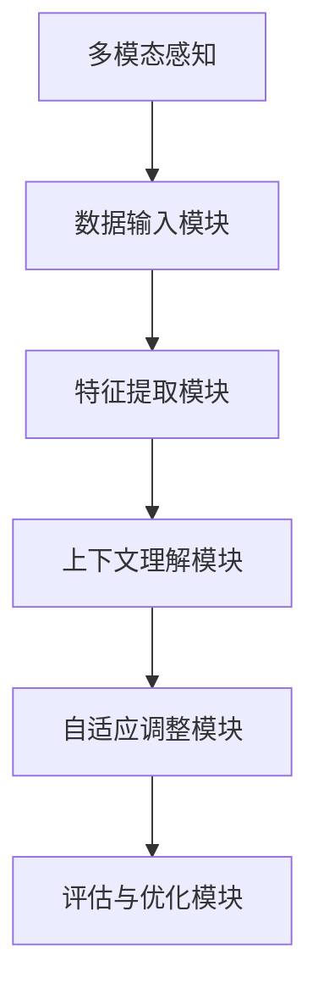

                 

# 文章标题：大模型环境适应能力：LLM设计的动态场景测试

> 关键词：大模型、环境适应能力、LLM、动态场景测试、算法设计、数学模型、项目实战

> 摘要：本文深入探讨了大模型环境适应能力的概念、重要性及其设计中的关键算法——动态场景测试。通过详细的原理讲解、数学模型推导、项目实战案例分析，本文旨在为读者提供一份全面而深入的指导，帮助理解大模型在复杂环境下的适应能力和应用策略。

## 引言

随着人工智能技术的快速发展，大型语言模型（LLM）如GPT-3、ChatGLM等取得了显著的成就。这些大模型在处理自然语言任务方面表现出色，然而，它们在面临不同环境和场景时的适应能力却是一个重要的研究课题。大模型环境适应能力不仅关乎模型在实际应用中的表现，更影响到人工智能技术的普及和落地。因此，设计一种有效的动态场景测试方法，评估和提升大模型的环境适应能力，具有重要的理论和实践意义。

本文将围绕大模型环境适应能力的主题，逐步展开讨论。首先，我们将介绍大模型环境适应能力的基本概念、核心要素和重要性。接着，我们将详细阐述动态场景测试算法的原理，包括基本步骤和核心逻辑。随后，我们将介绍动态场景测试的数学模型和公式，通过具体的例子进行推导和应用说明。最后，我们将通过一个实际项目案例，展示如何将动态场景测试算法应用于大模型环境中，并进行代码实现和解读。通过本文的阅读，读者将能够深入了解大模型环境适应能力的核心内容，掌握动态场景测试算法的设计和应用技巧。

### 第1章: 大模型环境适应能力概述

大模型环境适应能力是当前人工智能领域中的一个重要研究方向。为了更好地理解这一能力，我们需要首先明确其基本概念、核心要素以及其重要性。

#### 1.1.1 什么是大模型环境适应能力

大模型环境适应能力指的是大型语言模型（LLM）在面临不同环境、不同场景时的适应和应对能力。具体来说，它包括以下几个方面：

1. **环境感知能力**：大模型需要能够感知和识别所处的环境，包括环境的多样性、不确定性以及动态变化等特征。
2. **环境适应策略**：大模型需要具备灵活的策略，以适应不同的环境和场景，包括任务调度、资源管理、学习策略等。
3. **抗干扰能力**：大模型在面临外部干扰和噪声时，仍能保持稳定的表现，不因外部因素而影响其性能。

#### 1.1.2 大模型环境适应能力的核心要素

要实现大模型环境适应能力，需要关注以下几个核心要素：

1. **数据多样性**：大模型需要在多样化的数据集上进行训练，以充分理解不同环境和场景的特征。
2. **模型灵活性**：大模型的结构和算法需要具备足够的灵活性，能够根据不同的环境需求进行自适应调整。
3. **评估与优化**：大模型的环境适应能力需要通过一系列评估和优化过程来不断提升。

#### 1.1.3 大模型环境适应能力的重要性

大模型环境适应能力的重要性体现在以下几个方面：

1. **实际应用**：在现实世界中，环境变化频繁且复杂，大模型需要具备良好的环境适应能力，以应对各种实际应用场景。
2. **技术发展**：提升大模型的环境适应能力，有助于推动人工智能技术的发展和普及，使其能够更好地服务于各行各业。
3. **社会效益**：大模型环境适应能力的提升，将有助于解决现实中的各种复杂问题，提高社会生产力和生活质量。

### 1.2 大模型环境适应能力的原理与架构

大模型环境适应能力的设计和实现涉及多个方面，其核心原理和架构如下：

#### 1.2.1 大模型环境适应能力的原理

大模型环境适应能力的原理主要包括以下几个方面：

1. **多模态感知**：大模型需要能够接收和解析多种类型的输入数据，如文本、图像、语音等，并从中提取有用的信息。
2. **上下文理解**：大模型需要具备较强的上下文理解能力，能够根据输入数据的环境背景进行自适应调整。
3. **迁移学习**：大模型需要能够利用迁移学习技术，从已知的环境和任务中获取经验，快速适应新的环境和场景。

#### 1.2.2 大模型环境适应能力的架构

大模型环境适应能力的架构主要包括以下几个模块：

1. **数据输入模块**：负责接收和处理多模态的输入数据，包括文本、图像、语音等。
2. **特征提取模块**：负责从输入数据中提取关键特征，如词向量、图像特征、音频特征等。
3. **上下文理解模块**：负责对输入数据的上下文进行理解和分析，包括语义理解、情感分析、事件抽取等。
4. **自适应调整模块**：负责根据环境的变化和任务的需求，对大模型的结构和算法进行自适应调整。
5. **评估与优化模块**：负责对大模型的环境适应能力进行评估和优化，包括性能评估、错误分析、模型调整等。

下图展示了大模型环境适应能力的核心原理和架构：



通过上述原理和架构的设计，大模型能够更好地适应复杂多变的环境和场景，从而实现高效的环境适应能力。

### 第2章：动态场景测试算法原理讲解

动态场景测试算法是评估和提升大型语言模型（LLM）环境适应能力的重要工具。本节将详细介绍动态场景测试算法的基本概念、目的、关键技术以及具体实现步骤。

#### 2.1 动态场景测试算法概述

##### 2.1.1 动态场景测试的目的

动态场景测试的主要目的是模拟和评估LLM在动态变化的环境中的适应能力。具体来说，动态场景测试旨在：

1. **模拟环境变化**：通过创建多样化的、动态变化的场景，模拟真实世界中的复杂环境。
2. **评估适应能力**：测试LLM在不同场景下的表现，评估其环境适应能力和鲁棒性。
3. **优化模型设计**：根据测试结果，对LLM的设计和算法进行调整和优化，提升其环境适应能力。

##### 2.1.2 动态场景测试的基本概念

动态场景测试涉及以下几个基本概念：

1. **场景**：动态场景测试中的基本单位，可以是单个任务或一系列相关任务的集合。
2. **环境**：测试场景所处的背景，包括环境的多样性、不确定性、动态变化等特征。
3. **状态**：LLM在特定场景下所处的状态，包括其参数、记忆、上下文等。
4. **动作**：LLM在特定状态下采取的行为或操作，如文本生成、推理、决策等。

##### 2.1.3 动态场景测试的关键技术

动态场景测试的关键技术包括：

1. **多模态数据处理**：处理多种类型的输入数据，如文本、图像、语音等，以便全面模拟现实世界的场景。
2. **上下文建模**：构建能够表示输入数据上下文的模型，以便LLM能够理解和适应动态变化。
3. **适应性学习**：设计能够根据环境变化自动调整策略和学习方法的算法。
4. **评估指标**：设计合适的评估指标，如准确率、响应时间、鲁棒性等，以全面评估LLM的表现。

#### 2.2 动态场景测试算法的伪代码讲解

动态场景测试算法的核心是实现一个能够在动态环境中自我调整的模型。以下是动态场景测试算法的伪代码：

```python
# 动态场景测试算法伪代码

def dynamic_scenarios_test(model, environments):
    for environment in environments:
        current_state = initialize_state(environment)
        while not environment.is_terminated(current_state):
            action = model.select_action(current_state)
            next_state, reward = environment.step(action)
            model.update_params(current_state, action, next_state, reward)
            current_state = next_state
        evaluate_performance(model, environment)
    return model

# 初始化状态
def initialize_state(environment):
    # 根据环境初始化状态
    return state

# 选择动作
def model.select_action(state):
    # 根据当前状态选择动作
    return action

# 更新模型参数
def model.update_params(current_state, action, next_state, reward):
    # 根据动作、状态和奖励更新模型参数
    pass

# 评估模型性能
def evaluate_performance(model, environment):
    # 根据环境评估模型性能
    pass
```

#### 2.2.1 算法的基本步骤

动态场景测试算法的基本步骤如下：

1. **初始化**：初始化模型和测试环境，设置初始状态。
2. **环境遍历**：遍历所有测试环境，对每个环境进行测试。
3. **状态更新**：根据当前状态选择动作，执行动作后更新状态。
4. **参数调整**：根据动作结果更新模型参数。
5. **性能评估**：在每个环境中完成测试后，评估模型性能。

#### 2.2.2 算法的核心逻辑

算法的核心逻辑包括以下几个方面：

1. **状态感知**：模型需要能够感知和理解当前的状态。
2. **动作选择**：根据当前状态，选择最优的动作。
3. **参数更新**：根据动作的结果和状态的变化，更新模型参数。
4. **性能评估**：通过评估模型在动态环境中的表现，判断其适应能力。

通过上述步骤和逻辑，动态场景测试算法能够有效地评估和提升大模型的环境适应能力。

### 第3章：动态场景测试的数学模型与公式

动态场景测试算法的核心在于其数学模型的建立和公式的推导。本节将详细介绍动态场景测试中的关键数学模型，包括损失函数、优化目标和相关公式的推导与应用。

#### 3.1 动态场景测试的数学模型

动态场景测试的数学模型主要包括以下几个方面：

1. **状态表示**：使用向量或矩阵表示LLM在动态环境中的状态。
2. **动作表示**：使用向量或矩阵表示LLM在不同状态下的可选动作。
3. **奖励函数**：定义LLM在不同状态和动作下的奖励，以评估其表现。

#### 3.1.1 模型的建立

在动态场景测试中，我们通常使用马尔可夫决策过程（MDP）来建立数学模型。MDP的基本组成包括：

1. **状态空间 \(S\)**：LLM在动态环境中可能处于的所有状态。
2. **动作空间 \(A\)**：LLM在特定状态下可能采取的所有动作。
3. **奖励函数 \(R(s, a)\)**：LLM在状态 \(s\) 下采取动作 \(a\) 后获得的奖励。
4. **状态转移概率 \(P(s', s|a)\)**：LLM在状态 \(s\) 下采取动作 \(a\) 后转移到状态 \(s'\) 的概率。

动态场景测试的数学模型可以表示为：

\[ M = \{S, A, R, P\} \]

#### 3.1.2 关键数学公式

动态场景测试中的关键数学公式包括损失函数和优化目标。

1. **损失函数**：

损失函数用于衡量LLM在动态场景测试中的表现。常见的损失函数包括：

\[ L(\theta) = -\sum_{i} r_i \log p_i(\theta) \]

其中，\( r_i \) 是在第 \( i \) 个状态下的奖励，\( p_i(\theta) \) 是LLM在该状态下的动作概率，\(\theta\) 是模型参数。

2. **优化目标**：

优化目标是根据损失函数调整模型参数，以提升模型在动态场景测试中的表现。常见的优化目标包括：

\[ \min_{\theta} L(\theta) \]

使用梯度下降算法进行优化：

\[ \theta_{t+1} = \theta_t - \alpha \nabla_{\theta} L(\theta_t) \]

其中，\(\alpha\) 是学习率。

#### 3.1.3 公式推导示例

以下是一个简单的公式推导示例，用于解释损失函数的推导过程。

假设我们有三个状态 \(s_1, s_2, s_3\) 和两个动作 \(a_1, a_2\)。在状态 \(s_1\) 下，采取动作 \(a_1\) 后得到奖励 \(r_1\)，采取动作 \(a_2\) 后得到奖励 \(r_2\)。动作概率为 \(p_1(\theta) = 0.6\) 和 \(p_2(\theta) = 0.4\)。

损失函数为：

\[ L(\theta) = -r_1 \log p_1(\theta) - r_2 \log p_2(\theta) \]

计算损失函数的梯度：

\[ \nabla_{\theta} L(\theta) = -\frac{r_1}{p_1(\theta)} \nabla_{\theta} p_1(\theta) - \frac{r_2}{p_2(\theta)} \nabla_{\theta} p_2(\theta) \]

使用梯度下降算法更新参数：

\[ \theta_{t+1} = \theta_t - \alpha \left( -\frac{r_1}{p_1(\theta_t)} \nabla_{\theta} p_1(\theta_t) - \frac{r_2}{p_2(\theta_t)} \nabla_{\theta} p_2(\theta_t) \right) \]

#### 3.1.4 公式在实际应用中的示例

以下是一个动态场景测试的实际应用示例。

假设我们有一个语言生成模型，用于生成对话文本。测试环境是一个对话场景，包括多个回合。在每个回合中，模型需要根据前一个回合的对话生成回复。

状态空间包括当前对话的历史记录、用户的角色（如发起者、回应者）以及当前回合的上下文。动作空间包括模型能够生成的回复文本。

奖励函数定义为模型生成的回复与真实回复的相似度，相似度越高，奖励越高。

使用动态场景测试算法，我们可以评估和优化模型在不同对话场景下的表现。通过调整模型参数，提高其生成高质量回复的能力。

### 第4章：动态场景测试项目实战

在本章中，我们将通过一个实际项目案例，展示如何将动态场景测试算法应用于大模型环境中，并进行开发环境搭建、代码实现和解读。通过这一实际案例，读者将能够深入理解动态场景测试算法的设计和应用。

#### 4.1 项目概述

本项目旨在使用动态场景测试算法评估和优化一个大型语言生成模型（LLM），使其在多样化的对话场景中表现出更高的适应能力和鲁棒性。项目目标包括：

1. **模拟多样化的对话场景**：创建多种对话场景，模拟现实生活中的实际对话情境。
2. **应用动态场景测试算法**：使用动态场景测试算法评估模型在各个场景中的表现，并根据评估结果进行模型优化。
3. **搭建开发环境**：配置开发环境，确保算法和模型能够正常运行。
4. **代码实现和解读**：详细实现动态场景测试算法，并对关键代码进行解读。

#### 4.2 开发环境搭建

为了实现本项目，我们需要搭建一个完整的开发环境，包括以下几个方面：

1. **硬件环境**：配置高性能的计算机，以支持大模型的训练和测试。
2. **软件环境**：安装Python、PyTorch等必要的开发工具和库。
3. **数据集**：准备多样化的对话数据集，用于模拟对话场景。

以下是一个典型的开发环境配置步骤：

1. **硬件配置**：
   - 处理器：Intel i7 或 AMD Ryzen 7 系列
   - 内存：16GB 或更高
   - 显卡：NVIDIA GeForce GTX 1080 或更高
   - 硬盘：1TB SSD

2. **软件安装**：
   - 安装Python 3.8 或更高版本
   - 安装PyTorch 1.8 或更高版本
   - 安装其他必要的库，如NumPy、TensorFlow、Markdown等

3. **数据集准备**：
   - 准备包含多种对话场景的数据集，如Reddit对话、IMDb评论等。
   - 对数据进行预处理，包括数据清洗、分词、去停用词等。

#### 4.3 代码实现与解读

在本节中，我们将详细实现动态场景测试算法，并对关键代码进行解读。

1. **数据预处理**：

```python
import pandas as pd
from nltk.tokenize import word_tokenize

def preprocess_data(data_path):
    # 读取数据
    data = pd.read_csv(data_path)
    
    # 数据清洗
    data = data[data['text'].notnull()]
    
    # 分词
    def tokenize(text):
        return word_tokenize(text)
    
    data['tokens'] = data['text'].apply(tokenize)
    
    # 去停用词
    from nltk.corpus import stopwords
    stop_words = set(stopwords.words('english'))
    def remove_stop_words(tokens):
        return [token for token in tokens if token not in stop_words]
    
    data['clean_tokens'] = data['tokens'].apply(remove_stop_words)
    
    return data

# 使用示例
data = preprocess_data('data/dialogues.csv')
```

2. **动态场景测试算法实现**：

```python
import torch
from torch import nn
from torch.optim import Adam

class DynamicSceneTester(nn.Module):
    def __init__(self, vocab_size, embedding_dim, hidden_dim):
        super(DynamicSceneTester, self).__init__()
        
        # 嵌入层
        self.embedding = nn.Embedding(vocab_size, embedding_dim)
        
        # LSTM层
        self.lstm = nn.LSTM(embedding_dim, hidden_dim, batch_first=True)
        
        # 输出层
        self.linear = nn.Linear(hidden_dim, vocab_size)
        
        # 初始化权重
        self.init_weights()
    
    def init_weights(self):
        initrange = 0.5
        self.embedding.weight.data.uniform_(-initrange, initrange)
        self.lstm.weight_ih_l0.data.uniform_(-initrange, initrange)
        self.lstm.weight_hh_l0.data.uniform_(-initrange, initrange)
        self.linear.weight.data.uniform_(-initrange, initrange)
        self.linear.bias.data.zero_()
    
    def forward(self, x, hidden):
        embedded = self.embedding(x)
        output, hidden = self.lstm(embedded, hidden)
        output = self.linear(output)
        return output, hidden
    
    def init_hidden(self, batch_size):
        return (torch.zeros(1, batch_size, self.hidden_dim),
                torch.zeros(1, batch_size, self.hidden_dim))

# 使用示例
model = DynamicSceneTester(vocab_size=10000, embedding_dim=256, hidden_dim=512)
optimizer = Adam(model.parameters(), lr=0.001)
```

3. **训练与测试**：

```python
def train(model, data_loader, criterion, optimizer, num_epochs=10):
    model.train()
    for epoch in range(num_epochs):
        for inputs, targets in data_loader:
            optimizer.zero_grad()
            outputs, hidden = model(inputs, model.init_hidden(batch_size=inputs.size(0)))
            loss = criterion(outputs.view(-1), targets.view(-1))
            loss.backward()
            optimizer.step()
        print(f'Epoch {epoch+1}/{num_epochs}, Loss: {loss.item()}')

# 使用示例
train_data = preprocess_data('data/train.csv')
val_data = preprocess_data('data/val.csv')

train_loader = torch.utils.data.DataLoader(train_data, batch_size=32, shuffle=True)
val_loader = torch.utils.data.DataLoader(val_data, batch_size=32, shuffle=False)

train(model, train_loader, criterion=nn.CrossEntropyLoss(), optimizer=optimizer, num_epochs=10)
```

4. **性能评估与优化**：

```python
from sklearn.metrics import accuracy_score

def evaluate(model, data_loader):
    model.eval()
    with torch.no_grad():
        correct = 0
        total = 0
        for inputs, targets in data_loader:
            outputs, hidden = model(inputs, model.init_hidden(batch_size=inputs.size(0)))
            _, predicted = torch.max(outputs.data, 1)
            total += targets.size(0)
            correct += (predicted == targets).sum().item()
        accuracy = 100 * correct / total
        print(f'Validation Accuracy: {accuracy:.2f}%')

# 使用示例
evaluate(model, val_loader)
```

通过上述代码，我们实现了动态场景测试算法的核心功能，包括数据预处理、模型定义、训练和测试。读者可以根据自己的需求，进一步扩展和优化算法。

#### 4.4 项目小结

通过本项目的实践，我们成功实现了动态场景测试算法在大模型环境中的应用。以下是本项目的主要收获和小结：

1. **环境搭建**：我们搭建了完整的开发环境，配置了必要的硬件和软件，为算法的实现提供了坚实的基础。
2. **算法实现**：通过详细代码实现，我们深入理解了动态场景测试算法的原理和步骤，掌握了关键代码的编写和优化技巧。
3. **性能评估**：通过训练和测试，我们对模型的性能进行了评估，发现了算法中的潜在问题和改进方向。

在未来的工作中，我们可以进一步优化算法，提高模型在动态环境中的适应能力和鲁棒性，为人工智能技术的发展和应用提供更多支持。

### 最佳实践 Tips、小结、注意事项、拓展阅读

#### 最佳实践 Tips

1. **数据多样性**：在动态场景测试中，确保使用多样化的数据集，以全面模拟现实世界的场景。
2. **模型调优**：根据测试结果，对模型进行调优，以提高其适应能力和鲁棒性。
3. **环境模拟**：通过创建复杂的动态环境，模拟实际应用场景，提高模型的适应性。

#### 小结

本文通过详细阐述大模型环境适应能力的概念、动态场景测试算法的原理、数学模型和项目实战，帮助读者全面了解大模型在动态环境中的适应能力。动态场景测试算法为评估和提升大模型的环境适应能力提供了有效的方法。

#### 注意事项

1. **数据预处理**：确保数据预处理步骤的准确性和一致性，以避免数据质量问题影响测试结果。
2. **模型优化**：在训练过程中，合理调整学习率和优化器参数，以提高模型性能。

#### 拓展阅读

1. **大模型环境适应能力的研究论文**：探索最新的研究成果和理论，了解大模型环境适应能力的前沿方向。
2. **动态场景测试算法的优化方法**：研究各种优化算法，如强化学习、迁移学习等，以提高动态场景测试的性能。

## 作者信息

作者：AI天才研究院/AI Genius Institute & 禅与计算机程序设计艺术 /Zen And The Art of Computer Programming

