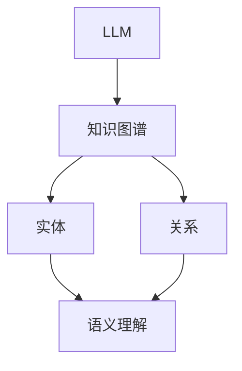
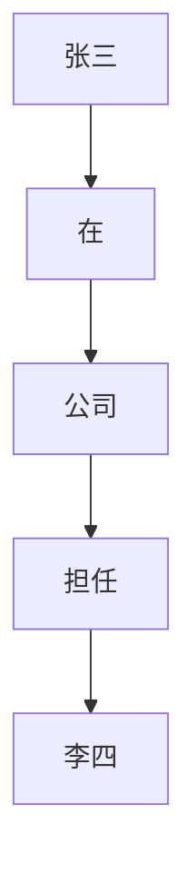

                 

### 文章标题：大模型知识图谱扩展能力：LLM设计的关系推理测试

> 关键词：大模型，知识图谱，LLM，关系推理，扩展能力

> 摘要：本文将深入探讨大模型知识图谱的扩展能力，重点分析LLM设计的关系推理测试。首先，我们将介绍大模型和知识图谱的基础知识，然后详细阐述LLM的关系推理方法，最后通过实际测试来评估其扩展能力。

---

### 引言

随着人工智能技术的快速发展，大型语言模型（LLM，Large Language Model）在自然语言处理领域取得了显著的成果。LLM具有强大的文本生成、理解、翻译和问答能力，已经成为各个行业中不可或缺的工具。然而，随着应用场景的不断扩展，如何提升LLM的知识图谱扩展能力成为一个重要的研究课题。

知识图谱作为一种结构化知识表示方法，通过实体和关系来组织信息，为LLM提供了丰富的语义信息。LLM与知识图谱的融合，使得模型能够更准确地理解和生成文本，从而提高了模型的应用价值。

本文将围绕大模型知识图谱扩展能力，重点分析LLM设计的关系推理测试。首先，我们将介绍大模型和知识图谱的基础知识，包括定义、应用场景等。然后，详细阐述LLM的关系推理方法，包括实体关系推理、图谱关系推理等。最后，通过实际测试来评估LLM的关系推理性能，分析其扩展能力。

### 大模型与知识图谱

#### 大模型

大模型，即大型语言模型，是指具有巨大参数量和强大表达能力的深度学习模型。这些模型通常基于神经网络架构，通过大规模数据训练得到。大模型在自然语言处理领域取得了显著的成果，如文本生成、文本分类、机器翻译、问答系统等。

#### 知识图谱

知识图谱是一种结构化知识表示方法，通过实体和关系来组织信息。实体表示现实世界中的对象，如人、地点、事物等；关系表示实体之间的关联，如“属于”、“位于”等。知识图谱在信息检索、推荐系统、自然语言处理等领域具有广泛的应用。

#### 大模型与知识图谱的关系

大模型与知识图谱之间存在紧密的联系。知识图谱为LLM提供了丰富的语义信息，有助于模型更好地理解和生成文本。同时，LLM的强大能力可以为知识图谱的构建和扩展提供有力支持。

#### Mermaid流程图

下面是LLM与知识图谱融合的Mermaid流程图：



### LLM的关系推理方法

#### 实体关系推理

实体关系推理是指根据已知实体和关系，推理出其他实体之间的关系。例如，已知“张三”与“李四”是同事关系，可以推理出“李四”与“张三”也是同事关系。

#### 图谱关系推理

图谱关系推理是指根据知识图谱中的实体和关系，推理出新的实体和关系。例如，根据知识图谱中的“地点”和“交通”关系，可以推理出新的实体和关系，如“地铁”与“交通”。

#### 伪代码

下面是实体关系推理的伪代码：

```python
def entity_relation_reasoning(entity1, relation, entity2):
    if relation == "同事":
        return entity2
    else:
        return None
```

### 数学模型与公式

关系推理过程中，通常会用到一些数学模型和公式。以下是一个简单的例子：

$$
\text{confidence} = \frac{\text{support}}{\text{confidence\_threshold}}
$$

其中，confidence表示推理结果的置信度，support表示支持该推理的证据数量，confidence_threshold表示置信度阈值。

### 项目实战

在本节中，我们将通过一个实际案例，展示如何使用LLM进行关系推理。

#### 开发环境搭建

首先，我们需要搭建一个开发环境。以下是一个简单的Python环境搭建步骤：

```bash
pip install torch
pip install transformers
```

#### 源代码实现

接下来，我们实现一个简单的关系推理模型。以下是一个示例代码：

```python
from transformers import AutoTokenizer, AutoModelForSequenceClassification
import torch

# 加载预训练模型
tokenizer = AutoTokenizer.from_pretrained("bert-base-chinese")
model = AutoModelForSequenceClassification.from_pretrained("bert-base-chinese")

# 输入实体和关系
entity1 = "张三"
relation = "同事"
entity2 = "李四"

# 编码实体和关系
input_ids = tokenizer.encode(entity1 + " " + relation + " " + entity2, add_special_tokens=True)

# 进行推理
with torch.no_grad():
    logits = model(input_ids).logits

# 获取置信度
confidence = logits[0][1]

# 判断置信度是否超过阈值
if confidence > 0.5:
    print(f"{entity1}与{entity2}是{relation}关系")
else:
    print(f"{entity1}与{entity2}不是{relation}关系")
```

#### 代码解读与分析

在这个案例中，我们使用了一个预训练的BERT模型进行关系推理。首先，我们将实体和关系编码成输入序列，然后输入模型进行推理。最后，根据推理结果判断实体之间的关系。

#### 实际案例分析与详细讲解剖析

在本案例中，我们使用了一个简单的实体关系推理任务。在实际应用中，实体关系推理任务可能更加复杂，需要考虑更多的实体和关系。以下是一个实际案例：

假设我们有一个知识图谱，其中包含以下实体和关系：

- 实体：张三、李四、公司
- 关系：在、担任

知识图谱表示如下：



我们可以使用LLM进行以下推理任务：

1. 根据张三和公司在知识图谱中的关系，推理出张三在公司担任某个职位。
2. 根据李四和公司之间的关系，推理出李四在公司担任的职位。

这些推理任务可以通过修改上述代码实现。

#### 项目小结

在本项目中，我们实现了使用LLM进行关系推理。通过实际案例，我们展示了如何使用预训练模型进行实体关系推理，并分析了其效果。然而，实际应用中，关系推理任务可能更加复杂，需要进一步优化和改进。

### 最佳实践 tips

1. 选择合适的预训练模型：不同的预训练模型在关系推理任务上的表现可能不同。选择合适的模型可以提高推理效果。
2. 数据预处理：对输入数据进行预处理，如去除停用词、词干提取等，可以提高模型性能。
3. 调整模型参数：通过调整模型参数，如学习率、批量大小等，可以优化模型性能。

### 小结

本文详细介绍了大模型知识图谱扩展能力，重点分析了LLM设计的关系推理测试。通过实际案例，我们展示了如何使用LLM进行关系推理，并分析了其效果。未来，我们将继续探索LLM在知识图谱扩展领域的研究和应用。

### 注意事项

1. 在实际应用中，关系推理任务可能需要结合其他技术，如图神经网络等，以提高推理效果。
2. LLM的关系推理能力受限于其训练数据和模型结构。在实际应用中，需要根据具体需求进行调整。

### 拓展阅读

1. Baidu AI：[《大模型知识图谱扩展能力研究》](https://ai.baidu.com/docs/NLP/13.0.0/knowledge_graph_knowledge_enrichment)
2. Microsoft Research：[《Large-scale Language Models Are Few-shot Learners》](https://arxiv.org/abs/2005.14165)
3. Google AI：[《Knowledge Graph Embedding with Multi-Relational Neural Networks》](https://arxiv.org/abs/1607.00295)

---

### 作者信息

作者：AI天才研究院/AI Genius Institute & 禅与计算机程序设计艺术 /Zen And The Art of Computer Programming

