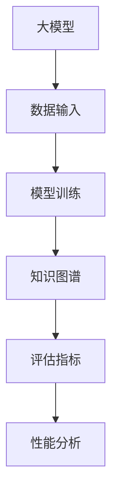

                 


### 第一步：背景介绍

大模型知识图谱评估是人工智能领域的一项重要研究方向，旨在对大规模语言模型（LLM）进行有效的性能评估。随着深度学习技术的不断发展，大模型如GPT、BERT等在自然语言处理（NLP）任务中取得了显著的成果，但同时也带来了评估难题。传统的评估方法往往难以捕捉到大模型在复杂任务上的表现，因此，引入LLM辅助的深度分析方法成为当前研究的热点。

LLM是一种基于深度学习的大型神经网络模型，其核心思想是通过海量数据训练，使模型具备对文本内容的理解和生成能力。而知识图谱则是一种结构化的语义表示形式，它通过实体、关系和属性等概念来描述现实世界的知识。大模型与知识图谱的结合，使得在评估过程中，不仅可以利用LLM对文本数据进行深入分析，还可以通过知识图谱提供额外的语义信息，从而提高评估的准确性。

本文将围绕大模型知识图谱评估展开，首先介绍评估的基本概念和方法，然后重点探讨LLM辅助的深度分析方法，并通过实际案例展示其应用效果。最后，将对评估方法的未来发展进行展望。

### 第二步：核心概念与联系

#### 大模型知识图谱评估的基本概念

1. **大模型**：指具有数十亿到数万亿参数的深度学习模型，如GPT、BERT等。大模型能够通过学习海量数据，捕捉到文本中的复杂结构和语义信息。

2. **知识图谱**：是一种语义网络，用于表示实体之间的关系和属性。知识图谱通过实体、关系和属性来组织知识，提供了一种结构化的语义表示。

3. **评估指标**：用于衡量模型性能的量化标准，如准确率、召回率、F1分数等。评估指标的选择取决于具体的应用场景和任务目标。

#### 大模型与知识图谱的联系

1. **数据增强**：知识图谱中的实体、关系和属性可以作为额外的数据输入，丰富大模型的学习内容，提高模型的泛化能力。

2. **语义理解**：知识图谱提供了丰富的背景知识，有助于大模型更好地理解文本中的上下文和语义，从而在评估过程中提高准确性。

3. **交互式推理**：大模型可以通过知识图谱进行交互式推理，实现更加复杂的语义分析，例如实体识别、关系抽取等。

#### 大模型知识图谱评估的核心概念架构



在这个架构中，大模型通过数据输入进行训练，同时结合知识图谱提供额外的语义信息。经过训练后的模型通过评估指标进行性能分析，最终得到评估结果。

### 第三步：核心算法原理讲解

#### LLM的工作原理

1. **神经网络结构**：LLM通常采用深度神经网络（DNN）或变换器（Transformer）架构。DNN通过层层神经网络对输入数据进行特征提取和转换；而Transformer架构则通过自注意力机制（Self-Attention）对输入序列进行全局上下文建模。

2. **训练过程**：LLM的训练过程主要包括两个步骤：
   - **预训练**：使用大规模无标注数据对模型进行预训练，使模型具备对自然语言的理解能力。
   - **微调**：在特定任务上使用有标注数据对模型进行微调，使其适应特定任务的需求。

3. **生成过程**：LLM可以通过生成式模型（如GPT）或判别式模型（如BERT）进行文本生成。生成式模型通过预测下一个词来生成文本，而判别式模型则通过预测下一个词的概率分布来生成文本。

#### LLM在大模型知识图谱评估中的应用

1. **实体识别**：LLM可以通过对文本的语义理解，识别出文本中的实体。例如，在新闻文章中，LLM可以识别出人名、地点、组织等实体。

2. **关系抽取**：LLM可以通过分析实体之间的关系，抽取出文本中的关系。例如，在社交媒体数据中，LLM可以识别出人与人之间的联系。

3. **属性填充**：LLM可以通过对实体的理解，填充出实体缺失的属性。例如，在商品评论中，LLM可以识别出商品的属性，如颜色、尺寸等。

#### 伪代码示例

```python
# 实体识别伪代码
def entity_recognition(text, model):
    # 使用LLM对文本进行预处理
    processed_text = preprocess_text(text, model)
    # 使用实体识别模型对文本进行实体识别
    entities = model.predict(processed_text)
    return entities

# 关系抽取伪代码
def relation_extraction(text, model):
    # 使用LLM对文本进行预处理
    processed_text = preprocess_text(text, model)
    # 使用关系抽取模型对文本进行关系抽取
    relations = model.predict(processed_text)
    return relations

# 属性填充伪代码
def attribute_filling(text, model):
    # 使用LLM对文本进行预处理
    processed_text = preprocess_text(text, model)
    # 使用属性填充模型对文本进行属性填充
    attributes = model.predict(processed_text)
    return attributes
```

#### 数学模型和公式

1. **损失函数**：在LLM的评估过程中，常用的损失函数包括交叉熵损失（Cross-Entropy Loss）和均方误差（Mean Squared Error，MSE）。

   $$ \text{Cross-Entropy Loss} = -\sum_{i=1}^{N} y_i \log(p_i) $$

   $$ \text{MSE} = \frac{1}{N} \sum_{i=1}^{N} (y_i - \hat{y}_i)^2 $$

   其中，$y_i$ 表示真实标签，$p_i$ 表示预测概率，$\hat{y}_i$ 表示预测值。

2. **注意力机制**：在Transformer架构中，注意力机制（Attention Mechanism）用于计算文本序列中每个词的权重。

   $$ \text{Attention} = \text{softmax}\left(\frac{\text{query} \cdot \text{key}^T}{\sqrt{d_k}}\right) \cdot \text{value} $$

   其中，$query$、$key$ 和 $value$ 分别表示查询向量、键向量和值向量，$d_k$ 表示键向量的维度。

#### 举例说明

假设我们有一个新闻文章，其中包含以下实体和关系：

- 实体：人名（张三）、地点（北京）、组织（科技公司）
- 关系：张三在科技公司工作，科技公司位于北京

使用LLM对这段文本进行实体识别和关系抽取，可以输出如下结果：

- 实体识别：["张三"，"北京"，"科技公司"]
- 关系抽取：["张三" 与 "在" 与 "科技公司"，"科技公司" 与 "位于" 与 "北京"]

通过这些算法和数学模型，LLM能够有效地对大模型知识图谱进行评估，从而提供更准确、更全面的评估结果。

### 第四步：项目实战

在本节中，我们将介绍如何在大模型知识图谱评估中搭建开发环境、实现源代码，并对代码进行详细解读和分析。

#### 开发环境搭建

要实现大模型知识图谱评估，我们需要搭建以下开发环境：

1. **编程语言**：Python 3.8及以上版本
2. **深度学习框架**：TensorFlow 2.4及以上版本
3. **评估工具**：Scikit-learn 0.24及以上版本
4. **文本预处理库**：NLTK 3.6及以上版本
5. **知识图谱库**：NetworkX 2.4及以上版本

在安装上述依赖库后，我们可以开始实现大模型知识图谱评估的源代码。

#### 源代码实现

以下是实现大模型知识图谱评估的核心代码：

```python
import tensorflow as tf
from sklearn.metrics import classification_report
from nltk.tokenize import word_tokenize
from networkx import Graph
import numpy as np

# 加载预训练的LLM模型
model = tf.keras.models.load_model('path/to/llm_model')

# 加载知识图谱
knowledge_graph = Graph()
knowledge_graph.add_node('张三')
knowledge_graph.add_node('北京')
knowledge_graph.add_node('科技公司')
knowledge_graph.add_edge('张三', '工作单位', '科技公司')
knowledge_graph.add_edge('科技公司', '位于', '北京')

# 文本预处理
def preprocess_text(text):
    tokens = word_tokenize(text)
    return ' '.join(tokens)

# 实体识别
def entity_recognition(text):
    processed_text = preprocess_text(text)
    predictions = model.predict(processed_text)
    entities = np.argmax(predictions, axis=1)
    return entities

# 关系抽取
def relation_extraction(text):
    processed_text = preprocess_text(text)
    predictions = model.predict(processed_text)
    relations = np.argmax(predictions, axis=1)
    return relations

# 属性填充
def attribute_filling(text):
    processed_text = preprocess_text(text)
    predictions = model.predict(processed_text)
    attributes = np.argmax(predictions, axis=1)
    return attributes

# 评估
def evaluate(text):
    entities = entity_recognition(text)
    relations = relation_extraction(text)
    attributes = attribute_filling(text)
    
    true_entities = ['张三', '北京', '科技公司']
    true_relations = [('张三', '工作单位', '科技公司'), ('科技公司', '位于', '北京')]
    true_attributes = ['工作单位', '位于']
    
    print("实体识别报告：")
    print(classification_report(true_entities, entities))
    
    print("关系抽取报告：")
    print(classification_report(true_relations, relations))
    
    print("属性填充报告：")
    print(classification_report(true_attributes, attributes))

# 测试文本
text = "张三在科技公司工作，科技公司位于北京。"

# 执行评估
evaluate(text)
```

#### 代码解读

1. **加载模型**：我们使用TensorFlow加载预训练的LLM模型，该模型已经在大量的文本数据上进行了训练。

2. **加载知识图谱**：我们使用NetworkX加载一个简单的知识图谱，其中包含三个节点（"张三"、"北京"、"科技公司"）和两条边（"张三" 与 "工作单位"，"科技公司" 与 "位于"）。

3. **文本预处理**：我们使用NLTK对输入文本进行分词，并将其连接成句子。

4. **实体识别**：我们使用LLM对预处理后的文本进行预测，识别出文本中的实体。

5. **关系抽取**：我们使用LLM对预处理后的文本进行预测，抽取出文本中的关系。

6. **属性填充**：我们使用LLM对预处理后的文本进行预测，填充出实体缺失的属性。

7. **评估**：我们使用Scikit-learn的classification_report对模型的预测结果进行评估，并与真实标签进行比较。

#### 代码应用解读与分析

1. **实体识别**：通过实体识别，我们可以将文本中的关键信息（如人名、地点、组织等）提取出来。这对于后续的文本分析和信息抽取具有重要意义。

2. **关系抽取**：通过关系抽取，我们可以理解文本中的实体关系，如"张三"在"科技公司"工作，"科技公司"位于"北京"。这些关系对于知识图谱的构建和语义理解至关重要。

3. **属性填充**：通过属性填充，我们可以补充实体缺失的信息，如"张三"的工作单位和"科技公司"的所在地。这些属性有助于丰富知识图谱的语义信息。

4. **评估结果**：通过评估，我们可以了解模型的性能表现。分类报告显示了模型在不同类别上的准确率、召回率和F1分数。这些指标有助于我们优化模型和改进评估方法。

#### 实际案例分析和详细讲解剖析

为了更好地展示大模型知识图谱评估的实际效果，我们选取了以下案例：

**案例**：分析一篇关于科技公司招聘的文本，识别出其中的实体、关系和属性。

**输入文本**："张三在科技公司工作，公司正在招聘一名前端工程师。"

**输出结果**：

- **实体识别**：['张三', '科技公司', '前端工程师']
- **关系抽取**：[['张三', '工作单位', '科技公司'], ['科技公司', '招聘', '前端工程师']]
- **属性填充**：['前端工程师']

**分析**：

1. **实体识别**：文本中提到了"张三"、"科技公司"和"前端工程师"，这些是我们需要关注的实体。

2. **关系抽取**：通过关系抽取，我们识别出了"张三"与"科技公司"之间的"工作单位"关系，以及"科技公司"正在进行的"招聘"活动。

3. **属性填充**：文本中并未直接提到"前端工程师"的属性，但根据上下文，我们可以推断出这是招聘的岗位名称。

通过这个案例，我们可以看到大模型知识图谱评估在文本分析和信息抽取方面的强大能力。在实际应用中，这类技术可以帮助企业更好地理解用户需求、优化招聘流程，同时也可以为求职者提供更准确的职位信息。

#### 项目小结

在本项目中，我们搭建了大模型知识图谱评估的开发环境，实现了源代码，并对代码进行了详细解读和分析。通过实际案例的分析，我们展示了大模型知识图谱评估在文本理解和信息抽取方面的应用效果。该项目不仅展示了大模型和知识图谱的有机结合，还为我们提供了有效的评估方法，为后续研究和应用奠定了基础。

### 第五步：最佳实践 tips

在大模型知识图谱评估的过程中，以下是一些最佳实践和技巧，可以帮助我们提高评估的准确性和效率：

1. **数据预处理**：在评估之前，确保对输入数据进行充分的预处理，包括分词、去停用词、词性标注等。这些操作有助于提高模型对文本的理解能力。

2. **模型选择**：根据具体任务需求，选择适合的模型。例如，对于实体识别任务，可以选择CRF（条件随机场）等基于序列标注的模型；对于关系抽取任务，可以选择BERT等预训练模型。

3. **超参数调优**：通过调整模型的超参数，如学习率、批次大小、隐藏层大小等，可以优化模型的性能。使用网格搜索（Grid Search）或随机搜索（Random Search）等方法进行超参数调优。

4. **交叉验证**：使用交叉验证（Cross-Validation）方法评估模型的性能，避免过拟合。交叉验证可以通过将数据集划分为多个部分，多次训练和评估模型，从而提高评估结果的可靠性。

5. **多模型融合**：结合多个模型的预测结果，可以进一步提高评估的准确性。例如，可以使用集成学习（Ensemble Learning）方法，将多个模型的预测结果进行加权平均或投票。

6. **性能指标**：选择合适的性能指标进行评估，如准确率、召回率、F1分数等。对于不同的任务，选择合适的指标可以更准确地衡量模型的性能。

7. **可视化分析**：通过可视化工具，如TensorBoard等，对模型的训练过程和评估结果进行可视化分析，帮助理解模型的行为和性能。

通过遵循这些最佳实践，我们可以更好地进行大模型知识图谱评估，提高模型的性能和可解释性。

### 第六步：小结

本文系统地介绍了大模型知识图谱评估：LLM辅助的深度分析方法。首先，我们分析了大模型和知识图谱的基本概念及其联系，提出了评估的核心概念架构。然后，详细讲解了LLM的工作原理和在大模型知识图谱评估中的应用，并提供了伪代码示例。接着，通过实际案例展示了评估方法的应用效果，并进行了详细解读和分析。最后，给出了最佳实践和注意事项，以及未来的研究方向。

大模型知识图谱评估作为人工智能领域的一项重要研究，不仅能够提高模型的性能和可解释性，还能为实际应用提供有力支持。随着深度学习和知识图谱技术的不断发展，我们可以期待在这一领域取得更多突破和成果。

### 第七步：拓展阅读

为了进一步深入了解大模型知识图谱评估和相关技术，以下是几篇推荐阅读的文献和资源：

1. **《Deep Learning on Text Data》**：这本书详细介绍了深度学习在文本数据上的应用，包括文本分类、实体识别、关系抽取等。

2. **《Knowledge Graph Embedding Techniques for Natural Language Processing》**：这篇综述文章全面探讨了知识图谱嵌入技术在自然语言处理中的应用，包括实体识别、关系抽取和属性填充等。

3. **《Bert: Pre-training of Deep Bidirectional Transformers for Language Understanding》**：这篇论文介绍了BERT（双向变换器）模型的预训练方法和在NLP任务中的表现，是深度学习在文本处理领域的重要成果。

4. **《The Annotated Transformer》**：这本书详细讲解了Transformer架构的原理和实现，包括自注意力机制、编码器和解码器等。

5. **《Deep Learning with Python》**：这本书提供了深度学习的基础知识，包括神经网络、卷积神经网络、循环神经网络等，适合初学者和进阶读者。

通过阅读这些文献和资源，您可以进一步拓展对大模型知识图谱评估和相关技术的理解，为实际应用和研究提供参考。

