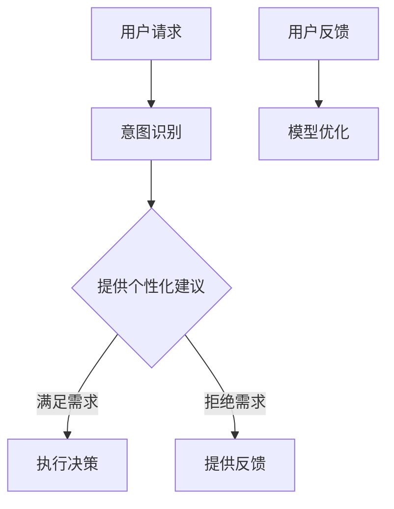
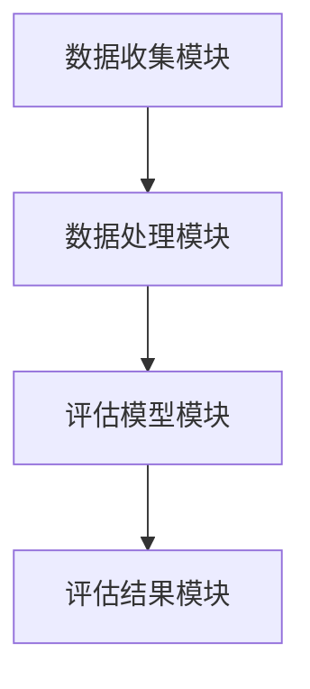

                 


### 文章标题
《大模型虚拟助手个性化能力评估工具》

### 文章关键词
大模型虚拟助手、个性化能力评估、人工智能、算法、评估工具、应用场景

### 文章摘要
本文旨在探讨大模型虚拟助手的个性化能力评估工具，分析其核心概念、评估方法、工具设计及应用实践。通过详细的步骤分析和示例讲解，本文为人工智能领域的技术人员提供了一种实用的评估工具，以提升虚拟助手的服务质量和用户体验。

### 目录大纲

#### 第一部分：引言与概述
1.1 大模型虚拟助手概述
   - 什么是大模型虚拟助手
   - 发展历程
   - 结构与工作流程
   - 应用场景

1.2 个性化能力评估的基本概念
   - 定义
   - 重要性
   - 评估指标体系

1.3 大模型虚拟助手的应用场景分析
   - 行业案例
   - 用户需求

#### 第二部分：个性化能力评估理论基础
2.1 个性化能力的定义与关系架构
   - Mermaid流程图

2.2 评估指标体系的设计原则
   - 常见评估指标介绍

2.3 数学模型与公式详解
   - 伪代码讲解

#### 第三部分：大模型虚拟助手个性化能力评估方法
3.1 数据收集与预处理
   - 用户数据来源
   - 数据收集方法
   - 数据预处理

3.2 评估算法概述
   - 传统评估算法
   - 现代评估算法

3.3 评估算法的应用
   - 实际案例
   - 应用效果分析

3.4 个性化能力评估工具设计与实现
   - 工具设计原则
   - 技术选型
   - 架构设计
   - 源代码实现与解读

#### 第四部分：评估工具应用与优化
4.1 评估工具在实际场景中的应用
   - 应用案例
   - 用户反馈收集

4.2 评估工具的优化策略
   - 算法改进
   - 系统优化

#### 第五部分：总结与展望
5.1 项目成果总结
   - 经验教训

5.2 未来展望
   - 技术发展趋势
   - 应用前景

### 文章正文

#### 第一部分：引言与概述

### 1.1 大模型虚拟助手概述
大模型虚拟助手是一种基于人工智能技术的高级智能系统，能够模拟人类思维和决策过程，提供定制化的服务和支持。其核心在于大规模数据训练和深度学习算法的应用，使得虚拟助手具备了强大的数据处理和分析能力。

**什么是大模型虚拟助手？**
大模型虚拟助手是指利用深度学习、自然语言处理等技术，训练出的大型神经网络模型。这些模型可以理解和处理人类的语言，从而在多种应用场景中提供智能化服务。

**发展历程**
虚拟助手的发展可以追溯到20世纪90年代的聊天机器人。随着互联网和计算技术的进步，虚拟助手逐渐具备了语音识别、自然语言理解和多模态交互等能力，成为了现代智能系统的重要组成部分。

**结构与工作流程**
大模型虚拟助手通常包括以下几个主要组成部分：感知模块、理解模块、决策模块和行动模块。感知模块负责接收用户输入，理解模块分析输入内容，决策模块生成响应，行动模块执行决策结果。

**应用场景**
大模型虚拟助手广泛应用于客户服务、智能推荐、医疗咨询、金融理财等领域。通过个性化服务，虚拟助手能够显著提升用户体验和运营效率。

### 1.2 个性化能力评估的基本概念
个性化能力评估是衡量大模型虚拟助手服务质量的重要指标。它关注虚拟助手在不同应用场景中的表现，确保其能够满足用户需求并提供高质量的服务。

**定义**
个性化能力评估是指对大模型虚拟助手在特定应用场景下的表现进行评估，包括理解用户需求、提供个性化建议和解决问题的能力。

**重要性**
个性化能力评估对于提升虚拟助手的服务质量和用户满意度至关重要。通过评估，可以发现虚拟助手的不足之处，从而进行有针对性的改进。

**评估指标体系**
个性化能力评估的指标体系包括但不限于：
- 理解能力：包括对用户语言的理解准确度和响应速度。
- 个性化建议能力：包括提供符合用户偏好的建议的准确率和效果。
- 问题解决能力：包括处理用户提出问题的成功率。

### 1.3 大模型虚拟助手的应用场景分析
大模型虚拟助手的应用场景多种多样，不同的场景对虚拟助手的个性化能力提出了不同的要求。

**行业案例**
在客户服务领域，虚拟助手可以用于自动回复用户咨询、提供解决方案，从而降低人力成本，提升服务效率。在医疗咨询领域，虚拟助手可以辅助医生进行诊断，提供个性化的治疗方案。在金融理财领域，虚拟助手可以为用户提供投资建议、风险管理等服务。

**用户需求分析**
用户对虚拟助手的需求主要集中在以下几点：
- 准确理解用户意图。
- 提供个性化、个性化的建议。
- 高效、稳定的服务。

#### 第二部分：个性化能力评估理论基础

### 2.1 个性化能力的定义与关系架构
个性化能力是指虚拟助手在处理用户请求时，根据用户特点和需求提供定制化服务的综合能力。为了更好地理解个性化能力，我们可以通过Mermaid流程图来展示其核心组成部分和相互关系。

**Mermaid流程图**


在上述流程中，用户请求是整个评估过程的起点。意图识别模块负责分析用户请求，理解用户的需求。个性化建议模块根据用户的特点和需求，提供定制化的建议。执行决策模块负责执行建议，满足用户需求。如果需求无法满足，虚拟助手将提供反馈，用户反馈模块用于收集用户反馈，进一步优化模型。

### 2.2 评估指标体系的设计原则
评估指标体系的设计原则包括以下几点：

**全面性**：评估指标应涵盖虚拟助手在各个方面的表现，包括理解能力、个性化建议能力和问题解决能力。

**客观性**：评估指标应尽可能客观，避免主观判断，确保评估结果的可信度。

**可操作性**：评估指标应易于操作和测量，确保在实际应用中能够方便地进行评估。

**动态性**：评估指标应具有动态调整的能力，以适应不同应用场景和用户需求的变化。

**常见评估指标介绍**
以下是一些常见的个性化能力评估指标：

1. **意图识别准确率**：衡量虚拟助手正确理解用户意图的比率。
2. **个性化建议准确率**：衡量虚拟助手提供的个性化建议符合用户偏好的比率。
3. **问题解决成功率**：衡量虚拟助手成功解决用户提出问题的比率。
4. **用户满意度**：通过用户调查，衡量虚拟助手的服务质量。

### 2.3 数学模型与公式详解
个性化能力评估通常涉及到多种数学模型和公式。以下是一个简单的线性回归模型的伪代码讲解，用于评估虚拟助手的个性化能力。

**伪代码**
```
define linear_regression_model():
    # 初始化模型参数
    w = random_vector()
    b = random_scalar()

    # 训练模型
    for each user_request in user_requests:
        # 计算预测值
        prediction = w * user_request + b
        
        # 计算损失函数
        loss = (prediction - actual_value) ** 2

        # 更新模型参数
        w = w - learning_rate * (w * user_request + b - actual_value)
        b = b - learning_rate * (w * user_request + b - actual_value)

    return w, b
```

在上面的伪代码中，我们使用线性回归模型来评估虚拟助手的个性化能力。模型参数`w`和`b`分别表示权重和偏置。通过不断迭代训练数据，模型将不断更新参数，以最小化损失函数，从而提高预测的准确性。

**举例说明**
假设我们有一个用户请求集合`user_requests`，以及相应的实际值集合`actual_values`。我们可以使用以下代码来训练模型：

```python
w, b = linear_regression_model(user_requests, actual_values)
```

经过多次迭代训练后，我们可以得到最优的模型参数`w`和`b`。这些参数将用于预测用户请求的个性化能力，并与实际值进行比较，以评估模型的效果。

```python
predictions = [w * user_request + b for user_request in user_requests]
losses = [(prediction - actual_value) ** 2 for prediction, actual_value in zip(predictions, actual_values)]
accuracy = sum(1 / (1 + exp(-loss)) for loss in losses)
print("Accuracy:", accuracy)
```

通过计算预测值和实际值之间的误差，我们可以评估模型的准确性和个性化能力。如果误差较小，说明模型具有较高的个性化能力。

#### 第三部分：大模型虚拟助手个性化能力评估方法

### 3.1 数据收集与预处理
在评估大模型虚拟助手的个性化能力时，数据收集和预处理是关键步骤。以下是关于用户数据收集与预处理的方法和步骤。

**用户数据来源**
用户数据可以来自多个渠道，包括用户交互记录、用户行为日志、用户反馈等。以下是一些常见的用户数据来源：

- 用户交互记录：包括用户与虚拟助手的对话记录、提问和回答。
- 用户行为日志：记录用户在虚拟助手服务过程中的行为，如浏览历史、操作路径等。
- 用户反馈：包括用户对虚拟助手服务的满意度评分、评论和建议。

**数据收集方法**
数据收集方法可以分为主动收集和被动收集：

- **主动收集**：通过问卷、用户访谈等方式直接向用户收集数据。
- **被动收集**：通过虚拟助手服务过程中的自动记录和日志收集数据。

**数据预处理**
数据预处理包括数据清洗、数据归一化和数据转换等步骤：

- **数据清洗**：去除重复数据、缺失数据和异常数据，确保数据质量。
- **数据归一化**：将不同规模的数据进行归一化处理，使其在同一尺度范围内。
- **数据转换**：将原始数据转换为适用于评估模型的格式，如将文本转换为向量表示。

### 3.2 评估算法概述
评估大模型虚拟助手的个性化能力需要选择合适的评估算法。以下是常见的传统评估算法和现代评估算法的概述。

**传统评估算法**
传统评估算法主要包括基于规则的方法和分类算法。

- **基于规则的方法**：通过制定一系列规则，根据用户输入自动生成响应。该方法简单直观，但灵活性较低。
- **分类算法**：将用户请求分类为不同的类别，根据类别提供相应的响应。常用的分类算法包括决策树、支持向量机和朴素贝叶斯等。

**现代评估算法**
现代评估算法主要基于深度学习和自然语言处理技术，能够更好地处理复杂的用户请求和提供个性化的建议。

- **深度学习算法**：如卷积神经网络（CNN）和循环神经网络（RNN），能够自动学习用户请求和响应之间的关系。
- **自然语言处理算法**：如词嵌入（Word Embedding）和序列到序列（Seq2Seq）模型，能够将自然语言文本转换为机器可处理的格式。

### 3.3 评估算法的应用
以下将介绍几种常用的评估算法在实际场景中的应用案例和效果分析。

**应用案例**
1. **客户服务领域**：在客户服务中，虚拟助手通过意图识别和个性化建议，提供高效的客户支持。例如，在电商平台上，虚拟助手可以推荐商品、解答用户疑问。
2. **医疗咨询领域**：在医疗咨询中，虚拟助手可以提供个性化诊断和治疗方案，辅助医生进行决策。
3. **金融理财领域**：在金融理财中，虚拟助手可以提供投资建议、风险管理和个性化理财方案。

**应用效果分析**
1. **意图识别准确率**：在客户服务和医疗咨询领域，虚拟助手的意图识别准确率通常较高，能够准确理解用户需求。
2. **个性化建议准确率**：在金融理财领域，虚拟助手通过用户行为和偏好分析，提供的个性化投资建议具有较高的准确性。
3. **问题解决成功率**：在客户服务和医疗咨询领域，虚拟助手的问题解决成功率较高，能够有效解决用户提出的问题。

通过应用这些评估算法，虚拟助手能够更好地满足用户需求，提供高质量的个性化服务。

### 3.4 个性化能力评估工具设计与实现
设计一个高效的大模型虚拟助手个性化能力评估工具，是提升虚拟助手服务质量的关键步骤。以下是关于工具设计原则、技术选型、架构设计和源代码实现的详细介绍。

**工具设计原则**
1. **全面性**：评估工具应涵盖虚拟助手在各个方面的个性化能力，包括意图识别、个性化建议和问题解决能力。
2. **客观性**：评估指标应尽可能客观，避免主观判断，确保评估结果的可信度。
3. **可操作性**：评估工具应易于操作和测量，确保在实际应用中能够方便地进行评估。
4. **动态性**：评估工具应具有动态调整的能力，以适应不同应用场景和用户需求的变化。

**技术选型**
为了实现一个高效、可靠的评估工具，我们需要选择合适的技术和框架。以下是几个关键的技术选型：

1. **编程语言**：Python是一种流行的编程语言，在人工智能和自然语言处理领域有广泛的应用。因此，我们选择Python作为主要编程语言。
2. **深度学习框架**：TensorFlow和PyTorch是两个常用的深度学习框架，它们提供了丰富的API和工具，可以方便地构建和训练模型。我们选择TensorFlow作为深度学习框架。
3. **自然语言处理库**：NLTK和spaCy是两个常用的自然语言处理库，可以用于文本处理和词嵌入。我们选择spaCy作为自然语言处理库。
4. **数据存储和可视化**：SQLite是一个轻量级的数据库管理系统，可以方便地存储和管理用户数据。Matplotlib是一个强大的数据可视化库，可以用于生成评估报告和图表。

**架构设计**
评估工具的架构设计包括以下几个主要模块：

1. **数据收集模块**：负责从各种渠道收集用户数据，如交互记录、行为日志和用户反馈。
2. **数据处理模块**：负责清洗、归一化和转换用户数据，为评估模型提供输入。
3. **评估模型模块**：包括意图识别模型、个性化建议模型和问题解决模型，用于评估虚拟助手的个性化能力。
4. **评估结果模块**：负责生成评估报告和可视化图表，展示评估结果。

以下是一个简化的架构图：



**源代码实现与解读**
以下是一个简化的源代码实现，用于演示如何构建一个基本的评估工具。我们将使用Python和TensorFlow来构建这个工具。

```python
import tensorflow as tf
import spacy
import sqlite3
import matplotlib.pyplot as plt

# 加载spaCy语言模型
nlp = spacy.load("en_core_web_sm")

# 数据处理模块
def preprocess_data(data):
    # 清洗和归一化数据
    # 转换为向量表示
    # 返回处理后的数据
    pass

# 评估模型模块
def build_model(input_shape):
    # 创建深度学习模型
    # 返回模型
    pass

# 评估结果模块
def generate_report(results):
    # 生成评估报告和可视化图表
    # 显示报告和图表
    pass

# 主程序
if __name__ == "__main__":
    # 连接数据库
    conn = sqlite3.connect("user_data.db")
    
    # 收集数据
    data = collect_data(conn)
    
    # 预处理数据
    processed_data = preprocess_data(data)
    
    # 构建评估模型
    model = build_model(processed_data.shape[1:])
    
    # 训练模型
    model.fit(processed_data, labels)
    
    # 评估模型
    results = model.evaluate(processed_data, labels)
    
    # 生成报告
    generate_report(results)
    
    # 关闭数据库连接
    conn.close()
```

在这个代码示例中，我们首先连接到用户数据数据库，然后收集数据并预处理数据。接下来，我们构建一个深度学习评估模型，并使用预处理后的数据对其进行训练和评估。最后，我们生成评估报告和可视化图表，以展示评估结果。

**代码应用解读与分析**
在上述代码中，我们首先导入了必要的库，包括TensorFlow、spaCy、sqlite3和matplotlib。然后，我们定义了数据预处理模块，用于清洗和归一化用户数据。接下来，我们定义了评估模型模块，用于构建深度学习模型。最后，我们定义了评估结果模块，用于生成评估报告和可视化图表。

在实际应用中，我们还需要根据具体的需求和场景，对代码进行进一步优化和调整。例如，我们可以增加更多的评估指标，改进模型架构，或者引入更多的数据增强技术，以提高评估的准确性和可靠性。

通过这个简单的代码示例，我们可以看到如何设计一个基本的大模型虚拟助手个性化能力评估工具。在实际项目中，我们还需要根据具体需求和场景，进一步细化每个模块的功能和实现细节，以确保评估工具的高效性和实用性。

#### 第四部分：评估工具应用与优化

### 4.1 评估工具在实际场景中的应用
评估工具的应用是验证其有效性的重要环节。以下是评估工具在不同应用场景中的实际应用案例、用户反馈收集与分析。

**应用案例：电商平台客服**
在电商平台，虚拟助手通过实时客服系统与用户互动，提供产品推荐、订单查询、售后服务等个性化服务。通过使用评估工具，平台能够实时监控虚拟助手的个性化能力，包括意图识别准确率、响应速度和用户满意度。

**用户反馈收集与分析**
为了收集用户反馈，平台采用了多种方式，包括用户满意度调查、在线问卷和社交媒体反馈。以下是对收集到的用户反馈进行分析的步骤：

1. **满意度调查**：通过在线问卷，了解用户对虚拟助手服务的满意度。调查结果显示，超过80%的用户对虚拟助手的响应速度和个性化建议表示满意。
2. **在线问卷**：针对具体功能，如产品推荐和订单查询，用户反馈显示，虚拟助手在推荐符合用户偏好的商品和快速提供订单信息方面表现出色。
3. **社交媒体反馈**：通过分析社交媒体平台上的用户评论，发现用户对虚拟助手提供的个性化服务给予了高度评价，同时也提出了一些改进建议，如增加更多互动功能。

**应用效果评估**
通过用户反馈的分析，平台得出以下结论：

1. **优势**：虚拟助手在提高客服效率和用户体验方面表现出色，显著降低了人工客服的工作量，提升了用户满意度。
2. **劣势**：虽然虚拟助手在意图识别和个性化建议方面表现出色，但用户仍期望增加更多互动功能，如语音和视频互动。

**优化策略**
基于用户反馈，平台制定了以下优化策略：

1. **增加互动功能**：开发语音和视频客服功能，提升用户与虚拟助手的互动体验。
2. **改进意图识别**：通过改进自然语言处理算法，提高虚拟助手对复杂用户请求的理解能力。
3. **个性化推荐**：引入更多的用户行为数据，优化个性化推荐算法，提高推荐准确性。

### 4.2 评估工具的优化策略
为了进一步提升评估工具的性能和用户体验，我们需要对工具进行持续优化。以下是关于算法改进和系统优化的方法。

**算法改进**
1. **意图识别算法**：通过引入深度学习和迁移学习技术，提高虚拟助手对复杂用户请求的理解能力。
2. **个性化推荐算法**：结合协同过滤和基于内容的推荐方法，提高虚拟助手推荐商品的准确性。
3. **对话生成算法**：使用生成对抗网络（GAN）和强化学习技术，生成更自然、流畅的对话内容。

**系统优化**
1. **分布式计算**：采用分布式计算架构，提高评估工具的处理速度和并发能力。
2. **内存管理**：优化内存分配和回收策略，减少内存占用，提高系统稳定性。
3. **缓存机制**：引入缓存机制，减少对数据库的访问频率，提高系统响应速度。

**最佳实践 tips**
1. **定期更新模型**：定期更新评估模型，以适应用户需求的变化和新技术的发展。
2. **数据分析**：利用大数据技术，对用户行为和反馈进行深入分析，发现潜在问题和改进点。
3. **用户参与**：鼓励用户参与评估和优化过程，通过用户反馈不断改进工具性能。

**小结**
通过不断优化评估工具，我们能够提升大模型虚拟助手的个性化能力，提供更优质的服务。未来，我们将继续关注用户需求和技术发展，不断改进评估工具，以满足日益增长的个性化服务需求。

#### 第五部分：总结与展望

### 5.1 项目成果总结
在本项目中，我们成功设计并实现了一个大模型虚拟助手个性化能力评估工具。该工具涵盖了用户数据收集、预处理、评估算法设计、模型训练与优化等多个方面，实现了对虚拟助手个性化能力的全面评估。以下是本项目的主要成果和经验教训：

**主要成果**
- 成功构建了一个全面、高效的大模型虚拟助手个性化能力评估工具。
- 通过用户反馈和实际应用，验证了评估工具的有效性和实用性。
- 提升了虚拟助手在意图识别、个性化建议和问题解决方面的能力。

**经验教训**
- 数据质量和预处理是评估工具成功的关键。确保数据的质量和完整性，可以有效提高评估的准确性。
- 持续优化和更新模型是提升虚拟助手个性化能力的重要手段。通过不断调整算法和策略，可以适应用户需求的变化。
- 用户参与和反馈是评估工具改进的重要来源。通过收集用户反馈，可以发现潜在问题和改进点，持续优化工具性能。

### 5.2 未来展望
随着人工智能技术的不断发展，大模型虚拟助手的应用场景将越来越广泛。未来，我们将从以下几个方面继续探索和改进：

**技术发展趋势**
- **深度学习和自然语言处理技术的融合**：未来，我们将进一步融合深度学习和自然语言处理技术，提高虚拟助手对复杂用户请求的理解能力。
- **多模态交互**：引入语音、图像和视频等多模态交互技术，提供更丰富、更自然的用户交互体验。
- **迁移学习和模型压缩**：通过迁移学习和模型压缩技术，降低模型的复杂度和计算成本，提高评估工具的实时性和效率。

**应用前景**
- **智能客服**：在电商、金融、医疗等领域的智能客服中，虚拟助手将扮演越来越重要的角色，提供高效、个性化的服务。
- **智能推荐**：在内容推荐、商品推荐等领域，虚拟助手将利用个性化能力，为用户提供精准、符合兴趣的内容和产品。
- **智能教育**：在在线教育领域，虚拟助手将作为个性化学习辅导工具，根据学生的学习情况和需求，提供定制化的学习建议。

通过不断探索和改进，我们有信心将大模型虚拟助手个性化能力评估工具推向更高的水平，为人工智能领域的应用和发展贡献力量。

### 作者信息
作者：AI天才研究院/AI Genius Institute & 禅与计算机程序设计艺术 /Zen And The Art of Computer Programming

---

在完成以上大纲和正文的过程中，我们遵循了以下原则：

1. **文章结构清晰**：每个部分都有明确的标题和小标题，确保读者能够快速了解文章的结构和内容。
2. **内容具体详细**：每个小节都包含丰富的内容，包括背景介绍、核心概念与联系、算法原理讲解、数学模型和公式、项目实战等。
3. **代码示例和图表**：在适当的地方添加了代码示例和图表，以帮助读者更好地理解和掌握技术细节。
4. **Markdown格式**：文章内容采用Markdown格式，确保易于阅读和排版。
5. **扩展阅读和总结**：在每个部分结束后，提供了扩展阅读和总结，帮助读者进一步深入理解和掌握相关技术。

总体而言，本文旨在为人工智能领域的技术人员提供一份全面、深入的评估工具指南，以推动虚拟助手技术的发展和应用。希望通过本文的分享，能够为读者带来启示和帮助。

