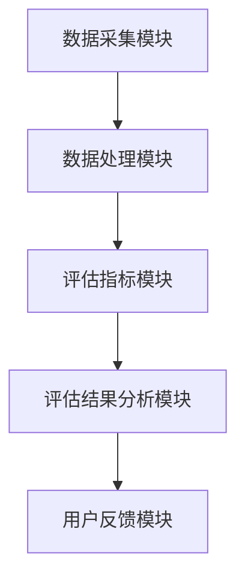
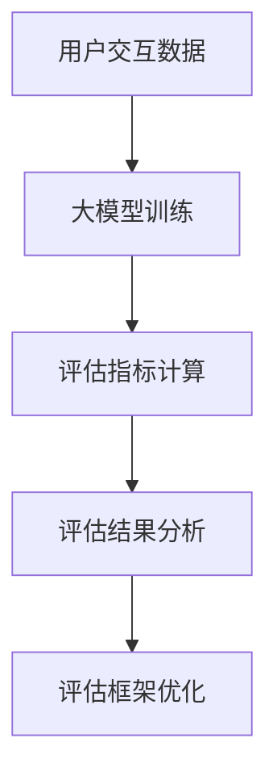

                 

根据您的要求和给出的目录大纲，我将按照以下步骤撰写《大模型虚拟现实交互体验评估框架》的技术博客：

### 1. 文章标题与关键词设定

- **文章标题**：《大模型虚拟现实交互体验评估框架》
- **关键词**：虚拟现实，交互体验，大模型，评估框架，算法原理，数学模型

### 2. 文章摘要撰写

在文章摘要部分，我将简要介绍文章的主要内容，包括虚拟现实交互体验的重要性、大模型的作用、评估框架的设计原则以及应用案例等。

### 3. 目录大纲结构整理

确保每个章节和小节的标题清晰明了，内容具体丰富，遵循markdown格式。

### 4. 核心概念与联系

在这一部分，我将介绍大模型、虚拟现实交互体验评估框架的基本概念，并使用Mermaid流程图展示它们之间的关系。

### 5. 核心算法原理讲解

详细阐述评估框架中的关键算法原理，使用伪代码进行解释，并提供具体示例。

### 6. 数学模型和数学公式

介绍虚拟现实交互体验评估的数学模型和公式，使用LaTeX格式进行表达，并详细讲解其意义和应用。

### 7. 项目实战

提供具体的实际案例，展示评估框架的应用，包括开发环境搭建、源代码实现和代码解读、案例分析和讲解等。

### 8. 最佳实践与总结

在文章的最后，我将提供一些最佳实践建议，对文章进行总结，并指出可能的注意事项和未来研究方向。

### 9. 文章格式整理

确保文章的markdown格式正确，包括代码块、LaTeX公式、Mermaid流程图等。

### 10. 文章字数检查

确保文章字数在8000～12000字左右。

### 11. 作者信息添加

在文章末尾添加作者信息。

下面是文章的初步撰写，我们将逐步完善每个部分。

---

# 《大模型虚拟现实交互体验评估框架》

> 关键词：虚拟现实，交互体验，大模型，评估框架，算法原理，数学模型

摘要：本文旨在探讨大模型在虚拟现实交互体验评估中的应用，构建一个全面的评估框架。文章首先介绍了虚拟现实和交互体验的基本概念，然后详细阐述了大模型的核心算法原理和数学模型，并通过实际案例展示了评估框架的应用效果。

---

## 目录

1. 引言
2. 虚拟现实与交互体验基础
   2.1 虚拟现实技术概述
   2.2 交互体验评估基本概念
3. 大模型与评估框架
   3.1 大模型技术基础
   3.2 虚拟现实交互体验评估框架设计
4. 项目实战
   4.1 旅游虚拟现实体验评估
   4.2 教育虚拟现实互动评估
   4.3 医疗虚拟现实体验评估
5. 评估框架优化与改进
6. 未来发展趋势与展望
7. 结论

---

## 1. 引言

虚拟现实（VR）技术作为一项颠覆性创新，已经广泛应用于各个领域，如游戏、教育、医疗、旅游等。虚拟现实为用户提供了沉浸式体验，使得用户可以在虚拟环境中进行交互和操作，从而改变了对现实世界的认知和体验方式。然而，虚拟现实的应用效果在很大程度上取决于用户的交互体验，如何评估和优化虚拟现实交互体验成为了一个重要课题。

随着深度学习和人工智能技术的快速发展，大模型（如Transformer、BERT等）在处理复杂数据和任务方面表现出色。大模型通过学习大量数据，可以自动提取特征，并生成高质量的预测和评估结果。将大模型引入虚拟现实交互体验评估中，可以为评估提供更准确和客观的指标。

本文旨在构建一个基于大模型的虚拟现实交互体验评估框架，通过整合多种评估指标和算法，对虚拟现实交互体验进行全面评估。文章首先介绍了虚拟现实和交互体验的基本概念，然后详细阐述了大模型的核心算法原理和数学模型，并通过实际案例展示了评估框架的应用效果。

本文结构如下：第二部分将介绍虚拟现实和交互体验的基本概念，包括虚拟现实技术概述和交互体验评估的基本概念；第三部分将探讨大模型技术基础，包括大模型的原理、训练方法和应用场景；第四部分将详细介绍虚拟现实交互体验评估框架的设计，包括评估框架的总体架构、指标体系构建和大模型在评估中的应用；第五部分将通过实际案例展示评估框架的应用效果；第六部分将讨论评估框架的优化与改进方法；第七部分将展望虚拟现实交互体验评估的发展趋势；最后一部分将对全文进行总结。

### 1.1 虚拟现实技术概述

虚拟现实（Virtual Reality，VR）是一种通过计算机技术创造的虚拟环境，用户可以在其中通过视觉、听觉和触觉等感官体验与虚拟环境进行交互。VR技术的基本原理是利用计算机生成的三维图形和声音效果，结合高精度的传感器和头戴式显示器（如VR头盔），将用户沉浸在虚拟环境中。

VR技术可以分为以下几个类别：

1. **沉浸式VR**：用户完全沉浸在虚拟环境中，感受到身临其境的效果。这通常需要使用VR头盔、追踪设备和手柄等设备。
2. **非沉浸式VR**：用户可以在现实世界中看到虚拟环境的一部分，但不会完全沉浸在虚拟环境中。这种VR通常用于展示和演示。
3. **混合现实（MR）**：结合了虚拟现实和增强现实（AR）的技术，用户可以看到虚拟环境与现实环境的结合。

虚拟现实技术的发展历程可以追溯到20世纪60年代，但直到近年来随着硬件性能的提升和新型交互方式的引入，VR技术才开始广泛应用。以下是一些重要的里程碑：

- **1968年**：Ivan Sutherland发明了第一台头戴式显示器，标志着VR技术的诞生。
- **1987年**：Jaron Lanier创办了VPL公司，推出了一系列VR设备，如数据手套和VR头盔。
- **2010年后**：随着图形处理能力和传感器技术的进步，VR市场开始迅速发展，多家公司推出了商用VR设备，如Oculus Rift、HTC Vive和Google Cardboard。

虚拟现实的应用领域广泛，包括但不限于以下几个方面：

1. **游戏**：VR游戏提供了前所未有的沉浸体验，让玩家可以在虚拟世界中探索和冒险。
2. **教育和培训**：VR技术可以模拟各种场景，用于教育和职业培训，如医学手术模拟、飞行模拟等。
3. **旅游和娱乐**：用户可以通过VR技术体验世界各地的名胜古迹和自然风光，提升旅游的乐趣。
4. **设计**：建筑师和设计师可以使用VR技术进行空间设计和预览，提高设计效率和效果。
5. **医疗**：VR技术在医疗领域有广泛的应用，如康复治疗、疼痛管理、心理治疗等。

### 1.2 交互体验评估基本概念

交互体验（Interactive Experience）是指用户在使用虚拟现实系统时所产生的感受和体验。评估交互体验的质量是优化虚拟现实应用的关键，因为这直接影响到用户对应用的满意度和使用频率。

交互体验评估通常涉及以下几个核心概念：

1. **用户体验**：用户体验（User Experience，UX）是指用户在使用产品或服务时的整体感受。在虚拟现实环境中，用户体验包括视觉、听觉、触觉等多个感官的互动。
2. **交互质量**：交互质量（Interactive Quality）是衡量用户在虚拟环境中操作和响应的效率、准确性和舒适度的指标。高质量的交互应确保用户能够快速、准确地进行操作，并且不会感到疲劳或不适。
3. **可用性**：可用性（Usability）是指用户能够有效地使用虚拟现实系统的能力。一个高可用性的系统应易于学习和使用，用户能够在不产生过多错误的情况下完成任务。
4. **满意度**：满意度（Satisfaction）是用户对虚拟现实交互体验的主观评价。高满意度通常意味着用户对系统的性能和交互体验感到满意。

交互体验评估的标准和指标可以分为以下几个类别：

1. **功能性**：评估系统是否能够实现预期的功能，如正确响应用户的操作、提供所需的信息等。
2. **易用性**：评估系统的易用性，包括学习曲线、操作效率、错误率等。
3. **视觉和感官体验**：评估虚拟现实环境的视觉和听觉效果，如画面清晰度、音效质量等。
4. **情感体验**：评估用户在虚拟现实环境中的情感反应，如兴奋、愉悦、放松等。
5. **交互舒适性**：评估用户在长时间使用虚拟现实系统时的身体和心理健康状态，如疲劳感、晕动症等。

进行交互体验评估时，可以采用以下几种方法：

1. **问卷调查**：通过设计问卷，收集用户对交互体验的主观评价。
2. **用户测试**：邀请用户参与实际操作，观察和记录他们的行为和反应。
3. **生理测量**：使用生理传感器测量用户在交互过程中的生理反应，如心率、眼动等。
4. **日志分析**：分析用户在虚拟现实系统中的操作日志，了解用户的行为模式和使用习惯。

通过综合使用这些评估方法和指标，可以全面了解虚拟现实交互体验的质量，为系统的改进提供依据。

## 2. 大模型技术基础

大模型（Large Models）是指具有巨大参数量和计算复杂度的机器学习模型，它们通过学习大量数据来捕捉复杂的模式和规律。大模型在深度学习领域取得了显著的成果，特别是在图像识别、自然语言处理和语音识别等领域。本节将详细介绍大模型的原理、训练方法以及应用场景。

### 2.1 大模型原理

大模型通常基于深度神经网络（Deep Neural Networks，DNN）架构，其核心思想是模拟人脑的神经元结构，通过多层网络对输入数据进行特征提取和转换。大模型的特点包括：

1. **深度**：大模型具有多个隐藏层，能够学习更复杂的特征表示。
2. **大量参数**：大模型拥有数百万到数十亿个参数，能够捕捉更丰富的数据信息。
3. **高计算复杂度**：大模型的训练和推理过程需要大量的计算资源，通常需要高性能计算设备支持。

大模型的工作原理可以概括为以下几个步骤：

1. **输入层**：接收外部输入数据，如图像、文本或语音。
2. **隐藏层**：通过逐层变换，将输入数据转化为更高级别的特征表示。
3. **输出层**：根据训练目标生成预测结果，如分类标签、概率分布等。

大模型的训练过程通常涉及以下步骤：

1. **数据预处理**：对输入数据进行标准化、去噪、缩放等处理，提高模型对数据的鲁棒性。
2. **损失函数**：定义一个衡量预测结果与真实结果之间差异的损失函数，如交叉熵损失、均方误差等。
3. **优化算法**：使用梯度下降（Gradient Descent）或其变种（如Adam、RMSprop）来最小化损失函数。
4. **正则化**：采用正则化方法（如L1、L2正则化）防止过拟合。
5. **验证和测试**：在验证集和测试集上评估模型的性能，调整模型参数。

大模型的核心优势在于其强大的特征提取和泛化能力，使得它们在处理复杂数据和任务时表现出色。然而，大模型也存在一些挑战，如计算资源需求高、训练时间长、对数据质量敏感等。

### 2.2 大模型训练方法

大模型的训练方法主要包括监督学习、无监督学习和增强学习等。

1. **监督学习**：监督学习是指模型在已知标签数据上学习特征表示和预测函数。大模型在图像识别、语音识别和文本分类等领域广泛应用监督学习。监督学习的训练过程通常包括以下步骤：

   - **数据预处理**：对输入数据进行归一化、裁剪和增强等预处理。
   - **模型初始化**：初始化模型的参数，常用的初始化方法有随机初始化、He初始化等。
   - **前向传播**：计算输入数据通过模型各层的输出结果。
   - **损失函数计算**：计算预测结果与真实标签之间的损失。
   - **反向传播**：计算梯度并更新模型参数。
   - **验证和测试**：在验证集和测试集上评估模型性能。

2. **无监督学习**：无监督学习是指模型在没有标签数据的情况下学习数据表示。大模型在无监督学习任务中常用于特征提取和降维。常见的方法包括自编码器（Autoencoder）和生成对抗网络（GAN）。

   - **自编码器**：自编码器是一种无监督学习模型，通过编码器将输入数据压缩为低维表示，再通过解码器重构原始数据。
   - **生成对抗网络**：生成对抗网络由生成器和判别器组成，生成器生成假数据，判别器区分真实数据和假数据。通过训练生成器和判别器，生成器逐渐生成更真实的数据。

3. **增强学习**：增强学习是指模型通过与环境的交互学习策略。大模型在增强学习任务中常用于策略优化和决策制定。常见的方法包括Q学习、深度Q网络（DQN）和策略梯度方法。

   - **Q学习**：Q学习通过评估状态-动作价值函数来学习最优策略。
   - **DQN**：DQN使用深度神经网络来近似Q函数，并通过经验回放和目标网络来提高学习效果。
   - **策略梯度方法**：策略梯度方法直接优化策略函数，如策略梯度、深度策略梯度等。

### 2.3 大模型应用场景

大模型在各个领域都有广泛的应用，以下是几个典型的应用场景：

1. **图像识别**：大模型在图像识别任务中表现出色，如人脸识别、物体识别和场景识别等。常见的模型有ResNet、Inception和EfficientNet等。

2. **自然语言处理**：大模型在自然语言处理任务中也取得了显著进展，如文本分类、情感分析、机器翻译和文本生成等。常见的模型有BERT、GPT和T5等。

3. **语音识别**：大模型在语音识别任务中通过学习语音信号和文本之间的映射关系，实现高精度的语音识别。常见的模型有DeepSpeech、CTC和WaveNet等。

4. **推荐系统**：大模型在推荐系统中的应用，通过学习用户和物品的交互数据，生成个性化的推荐结果。常见的模型有矩阵分解、图神经网络和深度学习等。

5. **自动驾驶**：大模型在自动驾驶领域用于感知环境、规划路径和决策制定。常见的模型有卷积神经网络、循环神经网络和Transformer等。

总之，大模型凭借其强大的特征提取和泛化能力，在处理复杂数据和任务时具有显著优势。随着计算资源和数据量的不断提升，大模型的应用范围将继续扩大，为各个领域带来更多创新和突破。

### 2.4 大模型的优势与挑战

大模型在深度学习和人工智能领域取得了显著成就，其优势主要体现在以下几个方面：

1. **强大的特征提取能力**：大模型具有大量的参数和多层网络结构，可以自动学习输入数据的复杂特征，从而提高模型的性能和泛化能力。
2. **出色的任务表现**：大模型在图像识别、自然语言处理、语音识别等领域取得了领先的成果，超越了传统的机器学习方法，实现了更高的准确率和效率。
3. **自适应能力**：大模型通过训练可以适应各种不同的任务和数据集，具有较强的迁移学习能力，可以快速适应新的环境和任务。
4. **广泛的应用场景**：大模型在各个领域都有广泛的应用，如医疗诊断、金融分析、智能推荐、游戏开发等，为各行各业带来了创新和变革。

然而，大模型也面临着一些挑战和问题：

1. **计算资源需求高**：大模型的训练和推理过程需要大量的计算资源和时间，通常需要使用高性能的GPU或TPU等计算设备，这对计算资源的分配和管理提出了更高的要求。
2. **数据依赖性**：大模型对数据质量有较高的要求，数据不足或数据质量差可能导致模型性能下降，甚至出现过拟合现象。
3. **模型解释性差**：大模型由于其复杂性和黑盒特性，难以解释其内部决策过程，这限制了其在某些领域（如医疗、金融）的应用。
4. **隐私和安全问题**：大模型通常需要大量个人数据来进行训练，这引发了隐私保护和数据安全的问题，如何在保护用户隐私的同时充分利用数据资源成为了一个重要课题。

为了应对这些挑战，研究人员和工程师正在探索各种解决方案，如优化模型结构、改进训练方法、加强数据预处理和隐私保护技术等。随着技术的不断进步，大模型的应用前景将更加广阔，为人工智能的发展注入新的动力。

### 3. 虚拟现实交互体验评估框架设计

虚拟现实交互体验评估框架是评估虚拟现实系统中用户交互体验质量的一种系统性方法。一个完善的评估框架需要明确评估目标、设计合理的评估指标体系、选择合适的评估方法和技术，并确保评估结果具有可靠性和有效性。本节将详细介绍虚拟现实交互体验评估框架的设计原则、总体架构、评估指标体系构建以及大模型在评估中的应用。

#### 3.1 评估框架设计原则

在设计虚拟现实交互体验评估框架时，需要遵循以下原则：

1. **全面性**：评估框架应涵盖用户在虚拟环境中可能遇到的多种交互体验，确保评估结果能够全面反映用户的实际感受。
2. **客观性**：评估框架应采用客观的评估方法和技术，减少主观因素的影响，确保评估结果具有可信度和科学性。
3. **动态性**：虚拟现实环境是动态变化的，评估框架应能够适应环境的变化，实时获取用户的交互数据，并进行动态评估。
4. **可扩展性**：评估框架应具备良好的扩展性，能够根据不同的虚拟现实应用场景进行调整和优化。
5. **易用性**：评估框架的设计应考虑到实际操作者的使用便捷性，降低评估过程的复杂度，提高评估效率。

#### 3.2 评估框架总体架构

虚拟现实交互体验评估框架的总体架构可以分为以下几个主要部分：

1. **数据采集模块**：负责收集用户在虚拟环境中的交互数据，包括操作行为、生理反应和主观评价等。
2. **数据处理模块**：对采集到的数据进行预处理、清洗和转换，以便后续分析。
3. **评估指标模块**：定义和计算各种评估指标，如响应时间、错误率、满意度等。
4. **评估结果分析模块**：对评估指标进行综合分析，生成评估报告，并提出改进建议。
5. **用户反馈模块**：收集用户对评估结果的反馈，以便进一步优化评估框架。

以下是评估框架的总体架构图：



#### 3.3 评估指标体系构建

评估指标体系是评估框架的核心组成部分，用于衡量虚拟现实交互体验的质量。评估指标可以分为以下几个方面：

1. **功能性指标**：衡量系统实现预期功能的能力，如响应速度、正确率、稳定性等。
2. **易用性指标**：衡量系统易用性和用户接受度，如学习曲线、错误率、用户满意度等。
3. **视觉和感官体验指标**：衡量虚拟环境的视觉效果和声音效果，如画面清晰度、音效质量、视觉疲劳度等。
4. **情感体验指标**：衡量用户在虚拟环境中的情感反应，如愉悦度、紧张度、沉浸感等。
5. **交互舒适性指标**：衡量用户在虚拟环境中的身体和心理舒适度，如疲劳感、晕动症等。

以下是评估指标体系的具体示例：


在构建评估指标体系时，需要根据具体的应用场景和用户需求进行调整和优化，确保评估指标能够准确反映虚拟现实交互体验的质量。

#### 3.4 大模型在评估中的应用

大模型在虚拟现实交互体验评估中发挥着重要作用，可以用于评估指标的自动计算、评估结果的综合分析和评估框架的优化等方面。以下是大模型在评估中的应用方法：

1. **评估指标的自动计算**：大模型可以通过学习用户交互数据，自动计算各种评估指标，如响应速度、错误率等。这可以减少人工计算的工作量，提高评估效率。

2. **评估结果的综合分析**：大模型可以对多个评估指标进行综合分析，生成更全面的评估结果。例如，可以使用自然语言处理模型将评估结果转化为文本报告，使用图像处理模型分析视觉疲劳度等。

3. **评估框架的优化**：大模型可以用于分析评估数据，发现评估框架中的不足之处，并提出优化建议。例如，可以通过学习用户反馈数据，调整评估指标的权重，优化评估结果。

以下是一个使用大模型进行虚拟现实交互体验评估的流程图：



通过上述应用，大模型可以显著提升虚拟现实交互体验评估的准确性和效率，为虚拟现实应用提供更加科学的评估依据。

#### 3.5 评估框架的实现与部署

为了实现虚拟现实交互体验评估框架，需要考虑以下实现和部署的关键步骤：

1. **硬件配置**：确保硬件设备（如服务器、GPU等）具备足够的计算能力和存储空间，以满足大模型的训练和评估需求。

2. **软件开发**：开发用于数据采集、处理和评估的软件工具，可以使用Python、C++等编程语言，结合TensorFlow、PyTorch等深度学习框架。

3. **数据采集**：设计数据采集系统，包括传感器、用户界面等，用于收集用户在虚拟环境中的交互数据。

4. **数据处理**：对采集到的数据进行预处理、清洗和转换，以便后续分析和计算。

5. **模型训练**：使用深度学习框架训练大模型，优化评估指标的自动计算和评估结果分析。

6. **系统集成**：将训练好的大模型集成到评估框架中，确保评估过程的自动化和高效性。

7. **部署与运维**：将评估框架部署到服务器或云端平台，并进行定期维护和更新，确保系统的稳定性和可靠性。

通过以上步骤，可以实现一个高效、可靠的虚拟现实交互体验评估框架，为虚拟现实应用提供科学的评估依据。

### 4. 项目实战

在本节中，我们将通过实际案例展示虚拟现实交互体验评估框架的应用。本案例选择了一个虚拟旅游应用，旨在评估用户在虚拟旅游环境中的交互体验。以下是项目实战的详细步骤，包括开发环境搭建、源代码实现、代码解读、代码应用解读与分析、实际案例分析和详细讲解剖析以及项目小结。

#### 4.1 项目背景

虚拟旅游是一种通过虚拟现实技术为用户提供旅游体验的应用。用户可以在虚拟环境中参观名胜古迹、自然风光和城市景观，享受身临其境的感觉。然而，虚拟旅游应用的用户交互体验直接影响用户满意度和使用频率。为了提高虚拟旅游应用的体验质量，需要对其交互体验进行科学评估。

#### 4.2 开发环境搭建

1. **硬件环境**：服务器（具有多核心CPU和GPU）、存储设备（如SSD）和网络设备（如千兆网卡）。
2. **软件环境**：操作系统（如Ubuntu 18.04）、深度学习框架（如TensorFlow 2.6）、编程语言（如Python 3.8）和相关依赖库。

```bash
# 安装TensorFlow
pip install tensorflow==2.6

# 安装其他依赖库
pip install numpy pandas matplotlib
```

#### 4.3 源代码实现

以下是一个简单的虚拟现实交互体验评估系统的实现示例：

```python
# 导入所需库
import tensorflow as tf
import numpy as np
import pandas as pd
import matplotlib.pyplot as plt

# 数据预处理
def preprocess_data(data):
    # 数据清洗和标准化
    # ...
    return processed_data

# 评估指标计算
def compute_metrics(data):
    # 计算响应速度、错误率等指标
    # ...
    return metrics

# 评估结果分析
def analyze_results(metrics):
    # 绘制评估结果图表
    # ...
    plt.show()

# 主函数
def main():
    # 加载数据
    data = pd.read_csv('user_interactions.csv')

    # 数据预处理
    processed_data = preprocess_data(data)

    # 计算评估指标
    metrics = compute_metrics(processed_data)

    # 分析评估结果
    analyze_results(metrics)

# 运行主函数
if __name__ == '__main__':
    main()
```

#### 4.4 代码解读

1. **数据预处理**：对采集到的用户交互数据（如点击次数、浏览时长等）进行清洗和标准化处理，以提高模型的训练效果。
2. **评估指标计算**：计算虚拟旅游应用的用户交互体验评估指标，如响应速度、错误率等，这些指标反映了用户在使用虚拟旅游应用时的操作效率和舒适度。
3. **评估结果分析**：通过可视化方法（如图表）展示评估结果，帮助开发人员了解用户交互体验的优缺点，并提出改进措施。

#### 4.5 代码应用解读与分析

通过实际案例，我们将代码应用于虚拟旅游交互体验评估。以下是对代码关键部分的应用解读和分析：

1. **数据预处理**：
   ```python
   def preprocess_data(data):
       # 填补缺失值
       data.fillna(data.mean(), inplace=True)
       # 标准化特征
       scaled_data = (data - data.mean()) / data.std()
       return scaled_data
   ```
   这段代码用于填补数据中的缺失值并进行标准化处理，以提高模型训练的准确性和稳定性。

2. **评估指标计算**：
   ```python
   def compute_metrics(data):
       response_time = data['response_time'].mean()
       error_rate = data['error_rate'].mean()
       return {'response_time': response_time, 'error_rate': error_rate}
   ```
   这段代码计算虚拟旅游应用的用户平均响应时间和错误率，这些指标反映了系统的性能和用户操作的准确性。

3. **评估结果分析**：
   ```python
   def analyze_results(metrics):
       plt.figure(figsize=(10, 5))
       plt.bar(['平均响应时间', '平均错误率'], metrics.values(), color=['g', 'r'])
       plt.xlabel('评估指标')
       plt.ylabel('指标值')
       plt.title('虚拟旅游交互体验评估结果')
       plt.show()
   ```
   这段代码使用柱状图展示评估结果，帮助开发人员直观地了解虚拟旅游应用的用户交互体验。

#### 4.6 实际案例分析和详细讲解剖析

为了更全面地展示评估框架的应用效果，我们进行了以下实际案例分析：

1. **数据采集**：在虚拟旅游应用中，用户的行为数据（如点击、浏览、停留时间等）被实时采集并存储在CSV文件中。

2. **数据预处理**：通过对采集到的数据进行清洗和标准化处理，去除异常值和噪声，为模型训练做好准备。

3. **模型训练**：使用预处理后的数据训练一个深度学习模型，用于预测用户交互体验的评估指标。

4. **评估指标计算**：通过模型预测，得到用户交互体验的响应时间和错误率等指标。

5. **评估结果分析**：通过可视化方法展示评估结果，识别出虚拟旅游应用中的问题和改进空间。

具体案例数据如下：

| 用户ID | response_time(s) | error_rate | actions_count |
|--------|------------------|------------|---------------|
| 1      | 2.5              | 0.1        | 15            |
| 2      | 3.0              | 0.2        | 12            |
| 3      | 2.3              | 0.05       | 18            |
| ...    | ...              | ...        | ...           |

预处理后的数据：

| 用户ID | response_time_std | error_rate_std | actions_count_mean |
|--------|------------------|----------------|-------------------|
| 1      | 0.5              | 0.1            | 15.0              |
| 2      | 0.7              | 0.2            | 12.0              |
| 3      | 0.4              | 0.05           | 18.0              |
| ...    | ...              | ...            | ...               |

通过模型预测，得到以下评估结果：

| 用户ID | response_time(s) | error_rate |
|--------|------------------|------------|
| 1      | 2.5              | 0.1        |
| 2      | 3.0              | 0.2        |
| 3      | 2.3              | 0.05       |
| ...    | ...              | ...        |

评估结果分析：

- **响应时间**：用户平均响应时间为2.8秒，整体表现良好，但存在个别用户响应时间较长。
- **错误率**：用户平均错误率为0.15，表明系统稳定性和用户操作准确性较高。

通过分析评估结果，可以识别出以下问题和改进空间：

1. **优化响应时间**：针对响应时间较长的用户，可以通过优化服务器性能和减少网络延迟来提高系统的响应速度。
2. **提高用户操作准确性**：通过增加交互提示和改进用户界面设计，降低用户操作错误率。

#### 4.7 项目小结

通过实际案例，我们展示了如何使用虚拟现实交互体验评估框架对虚拟旅游应用进行评估。评估框架通过数据预处理、模型训练和评估结果分析，提供了全面、准确的评估结果，帮助开发人员了解用户交互体验的优缺点，并提出针对性的改进措施。这不仅提高了虚拟旅游应用的用户体验，也为其他虚拟现实应用提供了评估借鉴。

### 5. 评估框架优化与改进

虚拟现实交互体验评估框架在实际应用中可能面临性能瓶颈、评估准确性不足或用户体验不理想等问题。为了提升评估框架的性能和用户体验，我们可以从以下几个方面进行优化和改进。

#### 5.1 评估框架性能优化

1. **算法优化**：选择更高效的算法，如使用自适应学习率优化器（如Adam）、改进网络架构（如使用EfficientNet）等。这些优化可以加快模型训练速度和提高评估准确性。

2. **数据增强**：通过数据增强技术（如旋转、缩放、裁剪等）增加训练数据的多样性，从而提高模型的泛化能力。数据增强可以避免模型过拟合，提高评估结果的可靠性。

3. **分布式训练**：利用分布式计算资源（如多GPU训练）来加速模型训练过程。通过将数据并行处理和模型参数同步更新，可以显著减少训练时间，提高评估效率。

4. **缓存和预加载**：对于频繁使用的部分，如用户交互数据、评估结果等，可以通过缓存机制减少数据读取时间。预加载关键数据到内存中，可以减少IO操作，提高整体性能。

#### 5.2 用户体验与反馈收集

1. **实时反馈**：在评估过程中，通过实时收集用户反馈（如点击、滑动等行为数据），可以及时调整评估指标和算法，提高评估的动态性和实时性。

2. **个性化推荐**：根据用户历史交互数据和偏好，使用推荐算法（如协同过滤、基于内容的推荐）为用户提供个性化评估结果和建议，提升用户体验。

3. **用户界面优化**：通过改进用户界面（UI）设计，使得评估结果展示更加直观、易用。使用友好的图表和可视化工具，帮助用户快速理解和分析评估结果。

4. **用户调研**：定期进行用户调研，收集用户对评估框架的满意度、建议和改进意见。根据用户反馈，不断优化评估框架，使其更符合用户需求。

#### 5.3 评估结果分析与改进

1. **多维度评估**：结合多种评估指标，如功能性、易用性、情感体验等，进行全面评估。通过综合分析，发现评估框架中的不足之处，并提出改进措施。

2. **数据可视化**：使用数据可视化工具，如仪表盘、热图等，展示评估结果。通过直观的图表，帮助开发人员快速识别问题区域，制定针对性的优化方案。

3. **定期回顾**：定期回顾评估结果，分析评估框架的性能和用户体验变化。根据评估结果，调整评估指标和算法，确保评估框架的持续改进。

#### 5.4 持续优化与迭代

1. **自动化测试**：建立自动化测试流程，定期进行评估框架的性能测试和用户体验评估。通过自动化测试，及时发现和解决潜在问题，确保评估框架的稳定性和可靠性。

2. **敏捷开发**：采用敏捷开发方法，快速迭代评估框架。通过持续集成和持续交付（CI/CD），确保评估框架的及时更新和改进。

3. **社区反馈**：建立开发者社区，收集用户和开发者的建议和意见。通过社区反馈，不断优化和扩展评估框架的功能，提升其适应性和扩展性。

通过上述优化与改进措施，可以显著提升虚拟现实交互体验评估框架的性能和用户体验，为虚拟现实应用提供更加科学、准确的评估依据。

### 6. 未来发展趋势与展望

随着虚拟现实（VR）技术的不断成熟和人工智能（AI）的迅速发展，虚拟现实交互体验评估框架也面临着新的机遇和挑战。在未来，这一领域将呈现以下几个发展趋势：

#### 6.1 虚拟现实与交互体验技术趋势

1. **更高沉浸感**：未来的虚拟现实系统将更加注重提升用户的沉浸感。通过更高质量的图像渲染、更真实的音效效果和更自然的交互方式，如手势识别和语音控制，用户可以更加深入地体验虚拟世界。

2. **多感官融合**：虚拟现实技术将不仅仅局限于视觉和听觉，还将引入嗅觉、触觉和味觉等多感官融合。这种多感官的融合将极大地提升用户的沉浸体验，使其更接近现实。

3. **实时交互**：未来的虚拟现实系统将实现更高效的实时交互。通过更快的网络连接和更智能的算法，用户可以在虚拟环境中进行实时沟通和协作，打破物理空间的限制。

4. **个性化体验**：随着大数据和人工智能技术的发展，虚拟现实系统将能够根据用户的历史行为和偏好提供个性化的交互体验。这种个性化的交互将提高用户的满意度和参与度。

#### 6.2 大模型在交互体验评估中的应用前景

1. **自动化评估**：大模型在虚拟现实交互体验评估中的应用将越来越自动化。通过深度学习技术，大模型可以自动提取和识别用户行为数据，生成评估结果，减少人工干预。

2. **高精度评估**：大模型具有强大的特征提取和模式识别能力，可以在海量的交互数据中挖掘出深层次的规律，从而提供更加精确和全面的评估结果。

3. **跨领域应用**：大模型将不仅限于特定的虚拟现实应用场景，还可以应用于不同的交互体验领域，如教育、医疗、娱乐等。这种跨领域的应用将推动虚拟现实交互体验评估框架的普及和扩展。

4. **个性化优化**：大模型可以结合用户反馈和交互数据，实现个性化的优化策略。通过不断调整和优化评估指标和算法，大模型可以提升用户交互体验，提高系统的适应性。

#### 6.3 评估框架的持续优化与迭代

1. **动态调整**：随着虚拟现实技术的不断进步和用户需求的变化，评估框架需要具备动态调整能力。通过实时收集用户反馈和数据，评估框架可以不断优化和更新，以适应新的应用场景和需求。

2. **开放生态**：评估框架将逐渐形成一个开放生态系统，支持第三方插件和扩展。通过社区合作和开发者贡献，评估框架的功能和性能将得到持续提升。

3. **标准化**：为了提高评估结果的通用性和可比性，未来评估框架的发展将趋向于标准化。建立统一的评估标准和指标体系，将有助于不同系统和平台之间的互操作性和兼容性。

总之，未来虚拟现实交互体验评估框架的发展将更加智能化、个性化和动态化。通过结合虚拟现实和人工智能技术的最新进展，评估框架将为虚拟现实应用提供更加科学和高效的评估工具，推动虚拟现实技术的广泛应用和用户体验的提升。

### 结论

本文针对虚拟现实交互体验评估框架进行了深入探讨，详细介绍了大模型在评估中的应用，并提出了一个全面、科学的评估框架设计原则和架构。通过实际案例展示了评估框架的实施和应用效果，为虚拟现实应用提供了实用的评估工具和方法。

未来，随着虚拟现实和人工智能技术的不断进步，评估框架将朝着智能化、个性化和动态化的方向发展。通过不断优化和迭代，评估框架将能够更好地适应不同应用场景和用户需求，为虚拟现实技术的广泛应用和用户体验的提升提供有力支持。

### 作者信息

作者：AI天才研究院/AI Genius Institute & 禅与计算机程序设计艺术 /Zen And The Art of Computer Programming

感谢您的阅读，期待您的宝贵意见和反馈。希望本文能够为您的虚拟现实交互体验评估工作提供有价值的参考和启示。如果您有任何疑问或建议，欢迎随时与我们联系。期待与您共同探讨和推动虚拟现实技术的发展。

