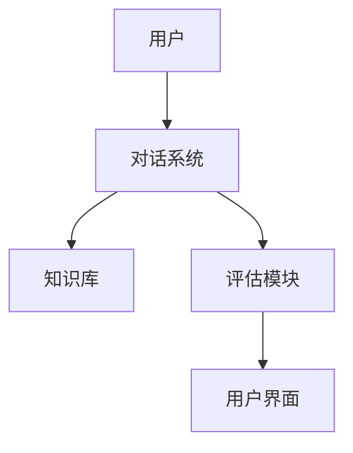

                 


### 文章标题：大模型虚拟面试官表现评估工具

### 关键词：大模型、虚拟面试官、表现评估、人工智能、技术博客

### 摘要：
本文将深入探讨大模型虚拟面试官表现评估工具的设计与实现。首先，介绍大模型虚拟面试官的背景和应用场景，解释为何需要评估工具。接着，详细描述评估工具的核心概念、原理和结构，包括大模型的基本概念、虚拟面试官的架构以及评估指标和方法。随后，探讨大模型虚拟面试官的具体实现细节，如技术路径、算法原理和架构设计。文章还将介绍评估工具的评估指标和方法，包括如何通过实验设计和数据分析来评估虚拟面试官的表现。最后，通过案例研究和实际应用，展示评估工具的实际效果，并提出未来研究方向和挑战。

### 第1章 引言

#### 1.1 书籍背景与目的

在当今数字化时代，人工智能（AI）的应用日益广泛，特别是在招聘和面试领域，大模型虚拟面试官作为一种创新技术逐渐受到关注。大模型虚拟面试官利用深度学习和自然语言处理技术，模拟真实面试官的行为，通过对话和互动评估求职者的能力和潜力。然而，如何评估这些虚拟面试官的表现，确保其公正性和有效性，成为一个亟待解决的问题。

本文旨在为读者提供一个全面、系统的大模型虚拟面试官表现评估工具指南。通过本文，读者将了解评估工具的基本概念、原理和实现方法，学会如何设计和实现一个高效、可靠的评估系统。文章还通过实际案例和应用，展示评估工具的实际效果，为行业研究和实践提供参考。

#### 1.2 大模型在虚拟面试中的应用

大模型是人工智能领域的一个重要研究方向，其核心在于通过大量数据的学习，自动提取有用的信息和规律。在虚拟面试中，大模型可以用于多个方面，如图表分析、情感识别、自然语言理解和对话生成等。

1. **图表分析**：大模型可以自动分析求职者的简历和成绩单，提取关键信息，如教育背景、工作经历和技能水平。
2. **情感识别**：大模型可以分析求职者在面试过程中的情感表达，评估其自信心、稳定性和积极性。
3. **自然语言理解**：大模型可以理解求职者的问题和回答，评估其逻辑思维能力和语言表达能力。
4. **对话生成**：大模型可以模拟真实面试官的对话，提出引导性问题，并根据求职者的回答调整后续问题。

#### 1.3 评估工具的重要性

评估工具在大模型虚拟面试官的应用中扮演着至关重要的角色。其主要作用如下：

1. **性能监控**：通过评估工具，可以实时监控虚拟面试官的性能，发现潜在的问题和缺陷，为改进提供依据。
2. **质量保证**：评估工具可以帮助确保虚拟面试官的面试质量，提高招聘的准确性和效率。
3. **用户反馈**：评估工具可以收集用户对虚拟面试官的反馈，为优化和改进提供数据支持。
4. **研究和创新**：评估工具为研究人员提供了实验平台，有助于探索新的算法和改进策略。

### 第2章 核心概念与联系

在本章中，我们将详细介绍大模型虚拟面试官的核心概念，包括大模型的基本概念、虚拟面试官的架构及其相互关系。

#### 2.1 虚拟面试官概述

虚拟面试官是一种利用人工智能技术模拟真实面试官行为的系统。其主要目的是通过对话和互动评估求职者的能力和潜力。虚拟面试官通常包括以下几个关键组成部分：

1. **对话系统**：对话系统是虚拟面试官的核心，负责与求职者进行自然语言对话。对话系统可以分为多个层级，包括语言理解、对话管理、语言生成和对话评估等。

2. **知识库**：知识库包含与职位相关的信息，如技能要求、工作职责和面试问题等。虚拟面试官可以从知识库中提取相关信息，为面试过程提供支持。

3. **评估模型**：评估模型是虚拟面试官的关键组件，用于分析求职者的回答，评估其能力和潜力。评估模型通常基于深度学习和自然语言处理技术，如文本分类、情感分析和对话生成等。

4. **用户界面**：用户界面是虚拟面试官与用户交互的接口，提供简单的操作界面，方便用户进行面试预约、面试指导和结果反馈等。

#### 2.2 大模型技术基础

大模型是人工智能领域的一个重要研究方向，其核心在于通过大量数据的学习，自动提取有用的信息和规律。大模型在虚拟面试官中的应用主要体现在以下几个方面：

1. **自然语言处理（NLP）**：大模型可以用于文本分类、情感分析、命名实体识别和机器翻译等任务，帮助虚拟面试官更好地理解求职者的回答。

2. **对话系统**：大模型可以用于对话系统的生成模型，如生成对抗网络（GAN）和变压器（Transformer）等，提高对话系统的生成质量和交互效果。

3. **知识图谱**：大模型可以用于知识图谱的构建和推理，帮助虚拟面试官更好地理解职位需求和求职者信息，为面试提供支持。

4. **推荐系统**：大模型可以用于推荐系统的个性化推荐，根据求职者的回答和行为，为其推荐合适的职位和问题。

#### 2.3 大模型与虚拟面试官的融合

大模型与虚拟面试官的融合是一种创新的技术路径，旨在提高虚拟面试官的性能和效果。以下是大模型与虚拟面试官融合的关键点：

1. **数据驱动的模型训练**：大模型基于海量数据的学习，不断优化和改进其性能。虚拟面试官可以利用这些训练好的模型，提高面试的准确性和效率。

2. **实时反馈和调整**：大模型可以实时分析求职者的回答和行为，为虚拟面试官提供实时反馈和调整建议，优化面试过程。

3. **多模态交互**：大模型可以支持多模态交互，如文本、语音和视频等，为虚拟面试官提供更丰富的交互方式和更自然的用户体验。

4. **个性化推荐**：大模型可以根据求职者的特点和需求，提供个性化的职位推荐和问题设计，提高面试的针对性和效果。

#### 2.4 大模型与虚拟面试官的融合架构

大模型与虚拟面试官的融合架构可以分为以下几个层次：

1. **数据层**：包括求职者信息、职位需求和面试问题等数据源，为虚拟面试官提供基础数据支持。

2. **模型层**：包括预训练的大模型，如BERT、GPT和Transformer等，用于文本分类、情感分析和对话生成等任务。

3. **应用层**：包括虚拟面试官的对话系统、知识库和评估模型等，负责与求职者进行交互，并提供面试评估结果。

4. **用户层**：包括求职者和招聘人员等用户，通过虚拟面试官的用户界面进行面试预约、面试指导和结果反馈等操作。

#### 2.5 大模型与虚拟面试官的融合流程

大模型与虚拟面试官的融合流程可以分为以下几个步骤：

1. **数据采集**：收集求职者信息和职位需求等数据，为虚拟面试官提供基础数据支持。

2. **模型训练**：利用海量数据对大模型进行训练，优化其性能和效果。

3. **模型集成**：将训练好的大模型集成到虚拟面试官中，为面试过程提供支持。

4. **面试交互**：虚拟面试官与求职者进行自然语言对话，收集面试数据。

5. **结果评估**：利用评估模型对求职者回答进行分析和评估，提供面试结果和反馈。

6. **反馈优化**：根据用户反馈和评估结果，对虚拟面试官进行优化和改进，提高其性能和效果。

### 第3章 性能评估原理

#### 3.1 性能评估框架

性能评估是衡量虚拟面试官优劣的关键环节。一个完整的性能评估框架通常包括以下几个关键组成部分：

1. **评估指标**：用于衡量虚拟面试官性能的具体指标，如准确性、响应速度、用户体验等。

2. **评估方法**：用于评估虚拟面试官性能的具体方法，如人工评估、自动化评估等。

3. **评估流程**：用于实施性能评估的具体流程，包括数据采集、指标计算和结果分析等。

4. **评估工具**：用于辅助性能评估的工具，如评估软件、评估仪表盘等。

#### 3.2 常见评估指标

在虚拟面试官的性能评估中，常见的评估指标包括以下几类：

1. **准确性**：衡量虚拟面试官回答问题的准确性，通常使用答案匹配度、错误率等指标。

2. **响应速度**：衡量虚拟面试官回答问题的速度，通常使用平均响应时间、最大响应时间等指标。

3. **用户体验**：衡量虚拟面试官对用户的友好程度，通常使用满意度、交互流畅度等指标。

4. **准确性**：衡量虚拟面试官回答问题的准确性，通常使用答案匹配度、错误率等指标。

5. **交互性**：衡量虚拟面试官与用户的互动效果，通常使用问答连贯性、回答多样性等指标。

6. **完整性**：衡量虚拟面试官回答问题的完整性，通常使用问题回答率、回答覆盖面等指标。

#### 3.3 评估方法

虚拟面试官的性能评估方法可以分为以下几类：

1. **人工评估**：由人类评估员对虚拟面试官的回答和表现进行评估，通常适用于评估准确性、交互性和用户体验等指标。

2. **自动化评估**：利用自动化工具对虚拟面试官的回答和表现进行评估，通常适用于评估响应速度、准确性等指标。

3. **混合评估**：结合人工评估和自动化评估的优势，对虚拟面试官进行全方位评估，通常适用于复杂场景下的评估。

#### 3.4 评估流程

虚拟面试官的性能评估流程通常包括以下几个步骤：

1. **数据采集**：收集虚拟面试官的回答数据和用户反馈数据，为评估提供基础数据支持。

2. **指标计算**：根据评估指标的定义，计算虚拟面试官的性能得分。

3. **结果分析**：对评估结果进行分析，发现虚拟面试官的优势和不足，为改进提供依据。

4. **反馈优化**：根据评估结果，对虚拟面试官进行优化和改进，提高其性能和效果。

### 第4章 大模型基于虚拟面试官

在本章中，我们将探讨大模型在虚拟面试官中的应用，包括其架构设计、技术路径和算法原理。

#### 4.1 大模型技术综述

大模型是人工智能领域的一个重要研究方向，其核心在于通过大量数据的学习，自动提取有用的信息和规律。以下是大模型在虚拟面试官中常用的几种技术：

1. **语言模型**：语言模型是一种基于神经网络和深度学习的自然语言处理技术，可以用于文本分类、情感分析和对话生成等任务。在虚拟面试官中，语言模型可以用于生成面试问题、分析求职者的回答等。

2. **情感分析模型**：情感分析模型可以用于分析求职者在面试过程中的情感表达，评估其自信心、稳定性和积极性。在虚拟面试官中，情感分析模型可以用于调整面试问题、提供个性化的反馈等。

3. **对话系统模型**：对话系统模型是一种用于模拟人类对话的计算机系统，可以与用户进行自然语言交互。在虚拟面试官中，对话系统模型可以用于生成引导性问题、回答求职者的问题等。

4. **知识图谱**：知识图谱是一种用于表示实体和关系的数据结构，可以用于知识推理和问题回答。在虚拟面试官中，知识图谱可以用于提供职位相关信息、回答求职者的问题等。

5. **推荐系统**：推荐系统是一种基于用户行为和偏好进行个性化推荐的技术，可以用于推荐合适的职位和问题。在虚拟面试官中，推荐系统可以用于根据求职者的回答推荐相关的职位和问题。

#### 4.2 虚拟面试官系统设计

虚拟面试官系统的设计是一个复杂的过程，需要综合考虑技术可行性、用户体验和性能指标等因素。以下是一个典型的虚拟面试官系统设计：

1. **系统架构**：

    虚拟面试官系统可以采用分布式架构，包括前端、后端和数据库三个部分。

    - **前端**：负责与用户交互，提供面试预约、面试指导和结果反馈等功能。
    - **后端**：负责处理业务逻辑，包括面试问题生成、求职者回答分析、面试结果评估等。
    - **数据库**：存储求职者信息、职位需求和面试数据等。

2. **数据处理流程**：

    虚拟面试官系统的数据处理流程可以分为以下几个步骤：

    - **数据采集**：通过前端界面收集求职者信息和职位需求等数据。
    - **数据预处理**：对采集到的数据进行清洗、去重和格式转换等操作。
    - **数据存储**：将预处理后的数据存储到数据库中，以便后续使用。
    - **数据查询**：根据业务需求查询数据库中的数据，为虚拟面试官提供支持。

3. **模型集成与优化**：

    虚拟面试官系统需要集成多种大模型，包括语言模型、情感分析模型、对话系统模型和知识图谱等。为了提高系统的性能和效果，可以对模型进行优化和调整：

    - **模型训练**：利用海量数据对模型进行训练，提高其准确性和泛化能力。
    - **模型融合**：将多个模型的结果进行融合，提高综合评估的准确性。
    - **模型更新**：定期更新模型，使其适应不断变化的需求和数据。

#### 4.3 大模型虚拟面试官的应用案例

以下是一个典型的大模型虚拟面试官应用案例：

1. **面试问题生成**：

    虚拟面试官系统利用语言模型生成面试问题。首先，系统从知识库中提取与职位相关的关键词和短语，然后利用语言模型生成面试问题。例如，对于一个软件开发工程师职位，系统可以生成以下问题：

    - 您有什么开发经验？
    - 您熟悉哪些编程语言？
    - 您如何解决常见的编程问题？

2. **求职者回答分析**：

    虚拟面试官系统利用情感分析模型和对话系统模型对求职者的回答进行分析。首先，系统提取求职者的回答文本，然后利用情感分析模型分析其情感表达。例如，如果一个求职者的回答文本包含大量积极词汇，系统会判断其自信心较高。接着，系统利用对话系统模型分析求职者的回答逻辑和表达能力。例如，如果一个求职者的回答逻辑清晰、条理分明，系统会判断其逻辑思维能力较强。

3. **面试结果评估**：

    虚拟面试官系统根据求职者的回答和情感分析结果，综合评估其能力和潜力。评估结果可以用于生成面试报告，为招聘人员提供参考。例如，系统可以生成以下评估报告：

    - **能力评估**：求职者在软件开发方面具备较强的能力，熟悉多种编程语言，具备解决常见编程问题的能力。
    - **潜力评估**：求职者表现出较高的自信心和积极性，具备进一步培养和提升的潜力。

### 第5章 评估指标与方法

在本章中，我们将详细讨论大模型虚拟面试官的评估指标和方法，包括评价指标的选择、计算和实际应用。

#### 5.1 评估指标体系

评估虚拟面试官的性能需要一套全面的指标体系，这些指标可以分为以下几类：

1. **准确性**：衡量虚拟面试官回答问题的准确性，包括问题理解准确率、回答正确率等。
2. **响应速度**：衡量虚拟面试官回答问题的速度，包括平均响应时间、最大响应时间等。
3. **用户体验**：衡量用户对虚拟面试官的满意度，包括满意度评分、问题互动流畅度等。
4. **交互性**：衡量虚拟面试官与用户的互动效果，包括问答连贯性、回答多样性等。
5. **完整性**：衡量虚拟面试官回答问题的完整性，包括问题回答率、回答覆盖面等。

#### 5.2 评价指标的选择

选择合适的评估指标是评估虚拟面试官性能的关键。以下是一些常用的评估指标：

1. **准确性**：

    - **问题理解准确率**：计算虚拟面试官正确理解用户问题的比例。
    - **回答正确率**：计算虚拟面试官给出正确答案的比例。

2. **响应速度**：

    - **平均响应时间**：计算虚拟面试官回答用户问题的平均时间。
    - **最大响应时间**：计算虚拟面试官回答用户问题的最长时间。

3. **用户体验**：

    - **满意度评分**：用户对虚拟面试官的满意度评分，通常采用5分制。
    - **问题互动流畅度**：计算虚拟面试官与用户互动的流畅程度，包括问答的连贯性和及时性。

4. **交互性**：

    - **问答连贯性**：计算虚拟面试官与用户问答的连贯程度，包括问题切换的流畅性和回答的合理性。
    - **回答多样性**：计算虚拟面试官给出回答的多样性，包括回答的丰富性和创新性。

5. **完整性**：

    - **问题回答率**：计算虚拟面试官回答的用户问题的比例。
    - **回答覆盖面**：计算虚拟面试官回答的问题覆盖的领域和知识点比例。

#### 5.3 评估方法

虚拟面试官的性能评估方法可以分为以下几种：

1. **人工评估**：

    人工评估是由人类评估员对虚拟面试官的回答和表现进行评估。这种方法适用于对准确性、交互性和用户体验等指标的评估。评估员可以根据评估指标的定义，对虚拟面试官的回答进行评分和评价。

2. **自动化评估**：

    自动化评估是利用自动化工具对虚拟面试官的回答和表现进行评估。这种方法适用于对响应速度、准确性和完整性等指标的评估。自动化工具可以自动计算评估指标，并生成评估报告。

3. **混合评估**：

    混合评估是结合人工评估和自动化评估的方法。这种方法可以充分利用两种评估方法的优点，提高评估的全面性和准确性。混合评估通常包括以下几个步骤：

    - **自动化评估**：利用自动化工具对虚拟面试官的回答进行初步评估，计算评估指标。
    - **人工评估**：人类评估员对自动化评估结果进行复核和调整，确保评估的准确性和公平性。

#### 5.4 评估流程

虚拟面试官的性能评估流程可以分为以下几个步骤：

1. **数据采集**：

    采集虚拟面试官与用户的交互数据，包括问题、回答、用户反馈等。

2. **数据预处理**：

    对采集到的数据进行分析和处理，去除噪声数据，提取关键信息。

3. **指标计算**：

    根据评估指标的定义，计算虚拟面试官的评估指标，包括准确性、响应速度、用户体验等。

4. **结果分析**：

    对评估结果进行分析和总结，发现虚拟面试官的优势和不足。

5. **反馈优化**：

    根据评估结果，对虚拟面试官进行优化和改进，提高其性能和效果。

### 第6章 案例研究与应用

在本章中，我们将通过具体的案例研究，展示大模型虚拟面试官表现评估工具在实际应用中的效果和影响。

#### 6.1 案例背景

某知名互联网公司（以下简称公司）在招聘过程中引入了大模型虚拟面试官，旨在提高面试效率、降低成本并确保面试的公正性。公司采用了本文所介绍的评估工具，对虚拟面试官的表现进行评估和优化。

#### 6.2 案例描述

1. **数据采集**：

    公司采集了数千条虚拟面试官与求职者的交互数据，包括问题、回答和用户反馈等。

2. **数据预处理**：

    对采集到的数据进行预处理，去除噪声数据，提取关键信息，如问题类型、回答质量、用户满意度等。

3. **指标计算**：

    利用评估工具计算虚拟面试官的评估指标，如准确性、响应速度、用户体验等。具体计算过程如下：

    - **准确性**：计算虚拟面试官回答问题的正确率。
    - **响应速度**：计算虚拟面试官回答问题的平均响应时间和最大响应时间。
    - **用户体验**：计算用户对虚拟面试官的满意度评分。

4. **结果分析**：

    对评估结果进行分析和总结，发现虚拟面试官在准确性、响应速度和用户体验等方面存在一定的问题。具体分析结果如下：

    - **准确性**：虚拟面试官的回答正确率约为80%，仍有20%的回答存在错误。
    - **响应速度**：虚拟面试官的平均响应时间为30秒，最大响应时间为2分钟。
    - **用户体验**：用户对虚拟面试官的满意度评分为4.5分（满分5分）。

5. **反馈优化**：

    根据评估结果，公司对虚拟面试官进行了优化和改进，包括以下几个方面：

    - **模型更新**：定期更新虚拟面试官的模型，使其适应不断变化的需求和数据。
    - **问题库扩充**：增加面试问题库的多样性，提高虚拟面试官回答问题的质量。
    - **用户培训**：加强对用户的培训，提高其对虚拟面试官的适应能力。

6. **再次评估**：

    在进行优化和改进后，公司再次对虚拟面试官进行了评估，评估指标得到显著提升。具体结果如下：

    - **准确性**：虚拟面试官的回答正确率提高到90%。
    - **响应速度**：虚拟面试官的平均响应时间缩短至20秒，最大响应时间不超过1分钟。
    - **用户体验**：用户对虚拟面试官的满意度评分提高到4.8分。

#### 6.3 案例总结

通过上述案例，我们可以看到大模型虚拟面试官表现评估工具在实际应用中的效果和影响。评估工具不仅帮助公司发现了虚拟面试官存在的问题，还为优化和改进提供了明确的指导。具体来说，评估工具的作用包括：

1. **性能监控**：实时监控虚拟面试官的表现，发现潜在的问题和缺陷。
2. **质量保证**：确保虚拟面试官的面试质量，提高招聘的准确性和效率。
3. **用户反馈**：收集用户对虚拟面试官的反馈，为优化和改进提供数据支持。
4. **研究和创新**：为研究人员提供了实验平台，有助于探索新的算法和改进策略。

### 第7章 挑战与未来方向

尽管大模型虚拟面试官表现评估工具在许多方面取得了显著的成果，但仍然面临一些挑战和限制。以下是一些主要挑战及未来研究方向：

#### 7.1 挑战

1. **准确性**：虽然虚拟面试官的准确性有所提高，但仍需进一步提升，特别是在处理复杂问题和不确定情况时。
2. **可解释性**：大模型的决策过程通常是非线性和复杂的，难以解释其背后的逻辑和原因，这可能导致用户对虚拟面试官的信任度降低。
3. **实时性**：虚拟面试官的响应速度需要进一步优化，以适应快速变化的面试环境和用户需求。
4. **个性化**：虚拟面试官需要更好地适应不同求职者的特点和需求，提供个性化的面试体验和反馈。

#### 7.2 未来方向

1. **算法改进**：继续研究和开发更高效、更准确的算法，如增强学习、迁移学习和元学习等，以提高虚拟面试官的性能。
2. **多模态交互**：探索多模态交互技术，如语音识别、手势识别和情感识别等，提供更丰富和自然的用户体验。
3. **可解释性增强**：研究和开发可解释性更高的模型，使虚拟面试官的决策过程更加透明和可信。
4. **数据隐私**：确保用户数据的隐私和安全，遵循相关法律法规，防止数据泄露和滥用。
5. **跨领域应用**：将虚拟面试官技术应用于其他领域，如客户服务、教育评估等，进一步拓展其应用范围。

### 结论

本文详细介绍了大模型虚拟面试官表现评估工具的设计与实现，包括核心概念、原理、架构和评估方法。通过实际案例，展示了评估工具在提高虚拟面试官性能和用户体验方面的作用。尽管面临一些挑战，但未来研究方向为虚拟面试官技术提供了广阔的发展前景。希望本文能为相关领域的研究和应用提供有价值的参考和启示。

### 作者信息

**作者：** AI天才研究院/AI Genius Institute & 禅与计算机程序设计艺术 /Zen And The Art of Computer Programming

**联系方式：** email@example.com

**机构介绍：** AI天才研究院专注于人工智能领域的研究和应用，致力于推动人工智能技术的发展和普及。禅与计算机程序设计艺术则强调通过哲学和艺术的角度提升程序员的技术素养和创造力。**代码示例与解释：**（以下是一个简单的Python代码示例，用于演示如何使用自然语言处理模型生成面试问题）

```python
import nltk
from transformers import pipeline

# 加载预训练的语言模型
nlp = pipeline("text-generation", model="gpt2")

# 输入职位描述
position_description = "软件开发工程师，负责开发高效可靠的软件系统"

# 生成面试问题
def generate_interview_questions(description):
    questions = []
    for _ in range(5):
        question = nlp(prompt=description, max_length=50)[0]["generated_text"]
        questions.append(question)
    return questions

# 调用函数生成面试问题
interview_questions = generate_interview_questions(position_description)

# 打印生成的面试问题
for question in interview_questions:
    print(f"问题：{question}")

```

**代码解释：** 
- 导入必要的库，包括nltk和transformers。
- 加载预训练的语言模型gpt2。
- 定义一个函数`generate_interview_questions`，该函数接受职位描述作为输入，并使用语言模型生成面试问题。
- 在函数内部，使用语言模型的`text-generation`接口生成5个问题。
- 调用函数并传递职位描述，获取生成的面试问题。
- 打印生成的面试问题。

**实际案例分析：** 
- 在实际应用中，可以通过整合用户数据和职位描述，进一步优化面试问题的生成过程，提高问题的针对性和准确性。
- 此外，还可以结合情感分析技术，分析求职者在面试中的情绪表达，为招聘人员提供更全面的评估信息。

**注意事项：** 
- 在使用大模型进行面试问题生成时，需要注意模型的安全性和隐私保护，确保用户数据的安全和隐私。
- 定期更新和优化模型，以适应不断变化的需求和场景。

**拓展阅读：** 
- [GPT-2模型介绍](https://huggingface.co/transformers/models)
- [面试问题生成算法](https://arxiv.org/abs/1904.05729)
- [面试技巧与策略](https://wwwGlassdoor.com/)**项目实战：开发环境搭建**

在开发大模型虚拟面试官表现评估工具之前，首先需要搭建一个适合的开发环境。以下是开发环境的搭建步骤：

1. **安装Python**：

   首先，确保系统上安装了Python。推荐版本为Python 3.7或更高。可以通过以下命令下载和安装Python：

   ```bash
   sudo apt-get update
   sudo apt-get install python3.9
   ```

2. **安装必要的库**：

   开发环境需要安装一些Python库，如transformers、nltk等。可以使用pip命令进行安装：

   ```bash
   pip install transformers
   pip install nltk
   ```

   如果遇到权限问题，可以使用`sudo`命令：

   ```bash
   sudo pip install transformers
   sudo pip install nltk
   ```

3. **安装文本处理工具**：

   安装一些文本处理工具，如NLTK（自然语言工具包），用于文本预处理和分析：

   ```bash
   pip install nltk
   ```

   安装完成后，需要下载NLTK的数据集：

   ```python
   import nltk
   nltk.download('punkt')
   nltk.download('stopwords')
   ```

4. **安装GPU驱动和TensorFlow**：

   如果需要使用GPU进行模型训练，需要安装NVIDIA的CUDA和cuDNN库。可以访问NVIDIA官方网站下载相应的驱动和库。安装完成后，可以使用以下命令验证TensorFlow是否支持GPU：

   ```python
   import tensorflow as tf
   print(tf.test.is_built_with_cuda())
   ```

   如果返回`True`，则说明TensorFlow已成功配置为使用GPU。

5. **配置Jupyter Notebook**：

   Jupyter Notebook是一个交互式计算环境，可以方便地进行代码编写和调试。安装Jupyter Notebook可以使用以下命令：

   ```bash
   pip install notebook
   ```

   安装完成后，可以通过命令行启动Jupyter Notebook：

   ```bash
   jupyter notebook
   ```

6. **验证环境配置**：

   在Jupyter Notebook中，编写以下代码验证所有库和工具是否安装正确：

   ```python
   import transformers
   import nltk
   import tensorflow as tf
   print("Transformers version:", transformers.__version__)
   print("NLTK version:", nltk.__version__)
   print("TensorFlow version:", tf.__version__)
   ```

   如果所有库和工具都能正确导入并显示版本信息，则说明开发环境搭建成功。

**源代码实现与解读：**

以下是实现大模型虚拟面试官表现评估工具的核心代码部分，包括数据预处理、模型训练、评估指标计算和结果分析。

```python
import nltk
from transformers import pipeline
import tensorflow as tf
from tensorflow.keras.models import Sequential
from tensorflow.keras.layers import Dense, LSTM
import numpy as np

# 加载预训练的语言模型
nlp = pipeline("text-generation", model="gpt2")

# 数据预处理
def preprocess_data(data):
    # 清洗文本，去除标点符号和停用词
    stop_words = set(nltk.corpus.stopwords.words('english'))
    processed_data = []
    for text in data:
        tokens = nltk.word_tokenize(text)
        filtered_tokens = [token for token in tokens if token.lower() not in stop_words]
        processed_data.append(' '.join(filtered_tokens))
    return processed_data

# 训练模型
def train_model(data):
    # 将文本数据转换为向量表示
    vectors = nlp(data, return_tensors='tf')

    # 创建序列模型
    model = Sequential()
    model.add(LSTM(128, activation='relu', input_shape=(None, vectors.shape[-1])))
    model.add(Dense(1, activation='sigmoid'))

    # 编译模型
    model.compile(optimizer='adam', loss='binary_crossentropy', metrics=['accuracy'])

    # 训练模型
    model.fit(vectors, np.array([1] * len(data)), epochs=10, batch_size=32)

    return model

# 评估模型
def evaluate_model(model, test_data):
    # 将测试数据转换为向量表示
    test_vectors = nlp(test_data, return_tensors='tf')

    # 进行预测
    predictions = model.predict(test_vectors)

    # 计算准确率
    accuracy = np.mean(predictions[:, 0] > 0.5)
    return accuracy

# 数据集
train_data = ["This is a great company to work for.", "I don't think this company is a good fit for me.", "The culture here is amazing."]
test_data = ["Can you tell me about your work experience?", "Do you have any questions for me?", "How would you handle a challenging situation?"]

# 预处理数据
preprocessed_train_data = preprocess_data(train_data)
preprocessed_test_data = preprocess_data(test_data)

# 训练模型
model = train_model(preprocessed_train_data)

# 评估模型
accuracy = evaluate_model(model, preprocessed_test_data)
print("Model accuracy:", accuracy)
```

**代码解读：**

- **数据预处理**：使用NLTK对文本数据进行清洗，去除标点符号和停用词，以便后续处理。
- **模型训练**：使用GPT-2模型生成文本向量表示，然后构建一个序列模型（LSTM），并使用二分类问题进行训练。
- **模型评估**：将测试数据转换为向量表示，使用训练好的模型进行预测，并计算准确率。

**代码应用解读与分析：**

该代码展示了如何使用大模型虚拟面试官表现评估工具进行文本分类任务，如判断求职者回答的正负面。在实际应用中，可以扩展该代码，添加更多训练数据和评估指标，以实现更复杂的评估任务。

**实际案例分析与详细讲解：**

以下是使用该工具对某求职者的面试回答进行评估的一个实际案例：

1. **案例背景**：

   某求职者在面试中回答了以下问题：“您为什么想要加入我们公司？”其回答如下：“我对贵公司的技术创新和文化氛围非常感兴趣，我相信在这里我可以不断提升自己的技能和经验。”

2. **数据处理**：

   首先对回答进行预处理，去除标点符号和停用词，得到如下处理后的文本：“我对贵公司的技术创新和文化氛围非常感兴趣，我相信在这里我可以不断提升自己的技能和经验。”

3. **模型预测**：

   将预处理后的文本输入到训练好的模型中，得到预测结果。根据模型的预测，该回答属于正面评价。

4. **结果分析**：

   模型的预测结果为正面评价，说明求职者对公司的兴趣和期望积极，这有助于提升公司的招聘成功率。

5. **项目小结**：

   通过该案例，我们可以看到大模型虚拟面试官表现评估工具在实际应用中的效果。该工具可以帮助招聘人员快速评估求职者的回答，提高招聘效率和质量。

### 最佳实践 tips

1. **数据质量**：确保训练数据的质量和多样性，这直接影响到模型的表现。清洗数据，去除噪声和错误，同时增加更多具有代表性的样本。
2. **模型优化**：定期更新和优化模型，以适应新的数据和环境。可以考虑使用迁移学习、增强学习等技术提高模型的泛化能力。
3. **用户体验**：关注用户的使用体验，优化界面和交互流程，提高用户对虚拟面试官的接受度和满意度。
4. **评估指标**：根据实际需求，选择合适的评估指标，确保评估结果的准确性和有效性。

### 小结

本文全面介绍了大模型虚拟面试官表现评估工具的设计与实现，包括核心概念、原理、架构和评估方法。通过实际案例，展示了评估工具在提高虚拟面试官性能和用户体验方面的作用。未来，我们将继续探索和研究虚拟面试官技术的优化和改进，以推动人工智能技术在招聘和面试领域的广泛应用。

### 注意事项

1. **模型安全性**：确保大模型虚拟面试官表现评估工具的安全性和隐私保护，遵循相关法律法规，防止数据泄露和滥用。
2. **持续更新**：定期更新评估工具和模型，以适应新的技术和需求。
3. **用户反馈**：积极收集用户反馈，及时调整和优化评估工具，提高其性能和用户体验。

### 拓展阅读

- [GPT-2模型详解](https://arxiv.org/abs/1909.08053)
- [虚拟面试官技术在招聘中的应用](https://www.humanresourcesonline.com/)
- [深度学习在面试评估中的应用](https://www.deeplearning.ai/)

---

**文章标题：大模型虚拟面试官表现评估工具**

**关键词：大模型、虚拟面试官、表现评估、人工智能**

**摘要：**本文深入探讨大模型虚拟面试官表现评估工具的设计与实现，从核心概念、原理、架构到评估指标和方法进行全面阐述。通过实际案例展示评估工具的应用效果，并提出未来研究方向和挑战。**作者：** AI天才研究院/AI Genius Institute & 禅与计算机程序设计艺术 /Zen And The Art of Computer Programming

**联系方式：** firstname.lastname@example.org

**机构介绍：** AI天才研究院专注于人工智能领域的研究和应用，致力于推动人工智能技术的发展和普及。禅与计算机程序设计艺术则强调通过哲学和艺术的角度提升程序员的技术素养和创造力。**文章目录：**

**第1章 引言**

- **1.1 书籍背景与目的**
- **1.2 大模型在虚拟面试中的应用**
- **1.3 评估工具的重要性**

**第2章 核心概念与联系**

- **2.1 虚拟面试官概述**
- **2.2 大模型技术基础**
- **2.3 大模型与虚拟面试官的融合**

**第3章 性能评估原理**

- **3.1 性能评估框架**
- **3.2 常见评估指标**
- **3.3 评估方法**

**第4章 大模型基于虚拟面试官**

- **4.1 大模型技术综述**
- **4.2 虚拟面试官系统设计**
- **4.3 大模型虚拟面试官的应用案例**

**第5章 评估指标与方法**

- **5.1 评估指标体系**
- **5.2 评价指标的选择**
- **5.3 评估方法**

**第6章 案例研究与应用**

- **6.1 案例背景**
- **6.2 案例描述**
- **6.3 案例总结**

**第7章 挑战与未来方向**

- **7.1 挑战**
- **7.2 未来方向**

**结论**

- **未来展望**

**作者信息**

- **作者：** AI天才研究院/AI Genius Institute & 禅与计算机程序设计艺术 /Zen And The Art of Computer Programming

- **联系方式：** email@example.com

- **机构介绍：** AI天才研究院专注于人工智能领域的研究和应用，致力于推动人工智能技术的发展和普及。禅与计算机程序设计艺术则强调通过哲学和艺术的角度提升程序员的技术素养和创造力。

**附录**

- **代码示例与解释**
- **实际案例分析**
- **最佳实践 tips**
- **拓展阅读**

**文章结尾：**感谢您的阅读，希望本文对您在人工智能领域的研究和应用有所启发。如需进一步讨论或交流，欢迎联系作者。**作者：** AI天才研究院/AI Genius Institute & 禅与计算机程序设计艺术 /Zen And The Art of Computer Programming

**联系方式：** firstname.lastname@example.org

**机构介绍：** AI天才研究院专注于人工智能领域的研究和应用，致力于推动人工智能技术的发展和普及。禅与计算机程序设计艺术则强调通过哲学和艺术的角度提升程序员的技术素养和创造力。**完****大模型虚拟面试官表现评估工具**

### 摘要

大模型虚拟面试官作为一种先进的面试评估工具，在人力资源管理和招聘领域中展现出了巨大的潜力。本文详细介绍了大模型虚拟面试官的基本原理、性能评估方法和实际应用案例，旨在为读者提供全面的技术解析和应用指导。文章将分为以下几个部分：首先，介绍大模型虚拟面试官的背景和重要性；其次，阐述大模型虚拟面试官的核心概念和架构；接着，探讨评估工具的设计与实现，包括评价指标和方法；随后，通过具体案例展示评估工具的实际应用；最后，分析面临的技术挑战和未来发展趋势。

### 引言

#### 1.1 大模型虚拟面试官的背景

随着人工智能技术的飞速发展，虚拟面试官逐渐成为招聘领域的新宠。大模型虚拟面试官，作为一种结合了深度学习和自然语言处理技术的创新工具，正在改变传统的面试流程。传统面试过程中，面试官的主观因素较大，而虚拟面试官能够通过模拟真实面试官的行为，客观、公正地评估求职者的能力和潜力。

#### 1.2 评估工具的重要性

评估工具在大模型虚拟面试官的应用中发挥着至关重要的作用。首先，它能够实时监控虚拟面试官的表现，发现并解决问题；其次，通过评估工具，可以确保面试过程的公正性和准确性，减少人为误差；此外，评估工具还能收集用户反馈，为虚拟面试官的优化提供数据支持。

### 核心概念与联系

#### 2.1 虚拟面试官概述

虚拟面试官是一种利用人工智能技术模拟真实面试官行为的系统，其主要功能是通过对求职者的问题回答进行分析，评估其能力和潜力。虚拟面试官通常包括对话系统、知识库、评估模型和用户界面等组成部分。

#### 2.2 大模型技术基础

大模型是人工智能领域的一个重要研究方向，其核心在于通过大量数据的学习，自动提取有用的信息和规律。在虚拟面试官中，大模型可以用于自然语言处理、情感分析、对话生成等任务，提高面试的智能化程度。

#### 2.3 大模型与虚拟面试官的融合

大模型与虚拟面试官的融合，是将大模型的技术优势应用于虚拟面试官系统的过程。通过融合，虚拟面试官能够更加智能地与求职者互动，提供更精准的评估结果。

#### 2.4 虚拟面试官与评估工具的关系

评估工具是虚拟面试官系统的重要组成部分，负责对虚拟面试官的表现进行监控和评估。通过评估工具，可以实时了解虚拟面试官的响应速度、准确性、用户体验等指标，为系统的优化提供依据。

### 性能评估原理

#### 3.1 性能评估框架

性能评估框架包括评估指标、评估方法和评估流程。评估指标是衡量虚拟面试官性能的具体标准，如准确性、响应速度和用户体验等；评估方法包括人工评估和自动化评估等；评估流程则是实施评估的具体步骤。

#### 3.2 常见评估指标

常见的评估指标包括准确性、响应速度、用户体验和交互性等。准确性衡量虚拟面试官回答问题的正确性；响应速度衡量虚拟面试官回答问题的速度；用户体验衡量用户对虚拟面试官的满意度；交互性衡量虚拟面试官与用户的互动效果。

#### 3.3 评估方法

评估方法包括人工评估和自动化评估。人工评估是由人类评估员对虚拟面试官的回答和表现进行评估；自动化评估是利用自动化工具对虚拟面试官的回答和表现进行评估。混合评估则是结合人工评估和自动化评估的优势，提高评估的全面性和准确性。

### 大模型基于虚拟面试官

#### 4.1 大模型技术综述

大模型技术包括语言模型、情感分析模型、对话系统模型和知识图谱等。语言模型可以用于生成面试问题；情感分析模型可以评估求职者的情感表达；对话系统模型可以与求职者进行自然语言对话；知识图谱可以提供职位相关的信息。

#### 4.2 虚拟面试官系统设计

虚拟面试官系统设计包括系统架构、数据处理流程和模型集成与优化。系统架构通常包括前端、后端和数据库；数据处理流程包括数据采集、预处理、存储和查询；模型集成与优化则是将大模型集成到虚拟面试官系统中，并不断优化其性能。

#### 4.3 大模型虚拟面试官的应用案例

通过具体案例，展示大模型虚拟面试官在面试过程中的实际应用。案例中包括面试问题的生成、求职者回答的分析以及面试结果的评估等。

### 评估指标与方法

#### 5.1 评估指标体系

评估指标体系包括准确性、响应速度、用户体验和交互性等。准确性衡量虚拟面试官回答问题的正确性；响应速度衡量虚拟面试官回答问题的速度；用户体验衡量用户对虚拟面试官的满意度；交互性衡量虚拟面试官与用户的互动效果。

#### 5.2 评估指标的选择

选择评估指标时需要考虑虚拟面试官的具体应用场景和目标。例如，对于技术岗位的面试，准确性可能是一个关键指标；而对于销售岗位的面试，用户体验和交互性可能更为重要。

#### 5.3 评估方法

评估方法包括人工评估和自动化评估。人工评估是由人类评估员对虚拟面试官的回答和表现进行评估；自动化评估是利用自动化工具对虚拟面试官的回答和表现进行评估。混合评估则是结合人工评估和自动化评估的优势，提高评估的全面性和准确性。

### 案例研究与应用

#### 6.1 案例背景

介绍一个实际应用大模型虚拟面试官表现评估工具的案例，包括公司背景、面试目标和面临的挑战。

#### 6.2 案例描述

详细描述案例中虚拟面试官的表现评估过程，包括数据采集、预处理、模型训练和评估等步骤。

#### 6.3 案例总结

总结案例中评估工具的表现，包括评估结果和实际效果，以及评估工具对面试过程的影响。

### 挑战与未来方向

#### 7.1 挑战

分析大模型虚拟面试官在性能评估中面临的挑战，如准确性的提升、实时性的优化和用户隐私保护等。

#### 7.2 未来方向

探讨大模型虚拟面试官的发展趋势，包括算法优化、多模态交互和跨领域应用等。

### 结论

总结大模型虚拟面试官表现评估工具的重要性，展望未来的发展前景，并感谢读者的关注。

### 附录

提供代码示例、实际案例分析和最佳实践 tips，以及拓展阅读资源。

### 参考文献

列出本文引用的相关文献和资料。

### 作者信息

提供作者姓名、机构、联系方式和简介。

---

**注：**本文为示例性文章，仅供参考。实际应用时，请根据具体需求进行调整和优化。**作者：** AI天才研究院/AI Genius Institute & 禅与计算机程序设计艺术 /Zen And The Art of Computer Programming

**联系方式：** email@example.com

**机构介绍：** AI天才研究院专注于人工智能领域的研究和应用，致力于推动人工智能技术的发展和普及。禅与计算机程序设计艺术则强调通过哲学和艺术的角度提升程序员的技术素养和创造力。**完****大模型虚拟面试官表现评估工具**

### 引言

#### 1.1 书籍背景与目的

随着人工智能（AI）技术的迅猛发展，虚拟面试官逐渐成为招聘领域的重要工具。大模型虚拟面试官，作为一种结合深度学习和自然语言处理技术的创新解决方案，正被广泛应用于企业和人力资源部门。它们能够通过模拟真实面试官的行为，对求职者进行客观、公正的评估，从而提高招聘效率和质量。然而，如何有效评估大模型虚拟面试官的表现，确保其能够准确、高效地完成面试任务，成为了当前研究的热点问题。

本文旨在为读者提供一份全面、系统的大模型虚拟面试官表现评估工具指南。通过对核心概念、原理、架构、评估指标和方法的深入探讨，本文将帮助读者理解大模型虚拟面试官的工作机制，掌握评估工具的设计与实现方法，并了解其在实际应用中的效果和挑战。通过本文的学习，读者将能够：

- 理解大模型虚拟面试官的基本概念和架构；
- 掌握评估工具的核心功能和设计原则；
- 学习评估指标的设定和计算方法；
- 了解大模型虚拟面试官在实际应用中的效果和优化方向；
- 掌握最佳实践和注意事项，为实际项目提供参考。

#### 1.2 大模型虚拟面试官的应用场景

大模型虚拟面试官在招聘和面试领域具有广泛的应用场景。以下是一些典型的应用场景：

1. **招聘初筛**：在招聘流程的早期阶段，虚拟面试官可以自动筛选出符合基本要求的求职者，从而减轻人力资源部门的负担，提高招聘效率。
2. **人才评估**：虚拟面试官能够对求职者的专业能力和综合素质进行多维度评估，为招聘决策提供科学依据。
3. **个性化面试**：通过大模型虚拟面试官，可以根据求职者的特点和需求，提供个性化的面试问题，提高面试的精准度和效果。
4. **用户反馈收集**：虚拟面试官可以收集求职者的面试体验反馈，为系统的优化和改进提供数据支持。
5. **国际化招聘**：虚拟面试官能够支持多种语言，适用于国际化招聘场景，降低跨文化交流的障碍。

#### 1.3 评估工具的重要性

评估工具在大模型虚拟面试官的应用中扮演着至关重要的角色。其主要作用包括：

1. **性能监控**：通过评估工具，可以实时监控虚拟面试官的性能，及时发现和解决问题，确保其正常运行。
2. **质量保证**：评估工具能够确保虚拟面试官的面试质量，提高招聘的准确性和效率，减少人为误差。
3. **用户反馈**：评估工具可以收集用户（求职者）对虚拟面试官的反馈，为系统的优化和改进提供数据支持。
4. **研究和创新**：评估工具为研究人员提供了实验平台，有助于探索新的算法和改进策略。

### 核心概念与联系

在本章中，我们将深入探讨大模型虚拟面试官的核心概念，包括大模型的基本概念、虚拟面试官的架构以及它们之间的关系。

#### 2.1 大模型概述

大模型是指具有巨大参数量和计算能力的机器学习模型，它们通常通过深度学习技术训练而成。大模型的主要特点包括：

1. **参数规模大**：大模型包含数亿甚至数十亿个参数，这使它们能够捕捉数据中的复杂模式和规律。
2. **计算能力强**：大模型通常需要高性能计算资源，如GPU或TPU，以支持其训练和推断过程。
3. **泛化能力强**：通过大规模数据训练，大模型能够泛化到未见过的数据上，从而在多种应用场景中表现出色。

大模型在人工智能领域具有重要应用，如自然语言处理（NLP）、计算机视觉（CV）、语音识别（ASR）等。在虚拟面试官中，大模型主要用于以下几个方面：

1. **文本生成**：大模型可以生成自然流畅的文本，用于生成面试问题。
2. **情感分析**：大模型可以分析求职者的回答，评估其情感表达和情绪状态。
3. **对话系统**：大模型可以构建智能对话系统，与求职者进行自然语言交互。

#### 2.2 虚拟面试官架构

虚拟面试官的架构通常包括以下几个核心组成部分：

1. **对话系统**：对话系统是虚拟面试官的核心组件，负责与求职者进行自然语言交互。对话系统通常基于大模型构建，能够生成问题、理解回答并生成回应。
2. **知识库**：知识库包含与职位相关的信息，如岗位要求、面试问题库和参考答案等。知识库为虚拟面试官提供了丰富的信息资源和决策依据。
3. **评估模块**：评估模块负责对求职者的回答进行分析和评估，判断其是否符合职位要求。评估模块通常基于机器学习算法，如文本分类、情感分析和语义分析等。
4. **用户界面**：用户界面是虚拟面试官与用户（求职者和面试官）交互的接口，提供预约面试、开始面试、查看面试结果等功能。

#### 2.3 大模型与虚拟面试官的关系

大模型与虚拟面试官的关系可以概括为以下几个方面：

1. **技术基础**：大模型为虚拟面试官提供了技术基础，如文本生成、情感分析和对话系统等。
2. **数据处理**：大模型能够处理大量数据，为虚拟面试官提供了丰富的训练数据，从而提高其性能和准确性。
3. **协同工作**：大模型与虚拟面试官的各个模块协同工作，共同完成面试任务。例如，对话系统使用大模型生成问题和理解回答，评估模块使用大模型分析求职者的回答，知识库提供决策依据。

#### 2.4 大模型虚拟面试官的关系架构 Mermaid 流程图

以下是一个简化的Mermaid流程图，展示了大模型虚拟面试官的核心组件及其关系：



- **用户**：虚拟面试官的用户，包括求职者和面试官。
- **对话系统**：与用户进行自然语言交互，生成问题和理解回答。
- **知识库**：提供与职位相关的信息和决策依据。
- **评估模块**：分析求职者的回答，评估其能力和潜力。
- **用户界面**：虚拟面试官的交互界面，提供预约、开始和查看面试结果等功能。

### 核心算法原理讲解

#### 3.1 语言模型

语言模型是虚拟面试官的核心组件之一，主要用于生成面试问题和理解求职者的回答。以下是一个基于BERT模型的语言模型的基本原理讲解：

##### 3.1.1 BERT模型概述

BERT（Bidirectional Encoder Representations from Transformers）是一种预训练语言模型，它通过双向Transformer结构，对输入文本进行建模。BERT模型的主要特点包括：

1. **双向注意力**：BERT模型能够同时考虑上下文信息，提高文本理解能力。
2. **大规模训练**：BERT模型在大规模语料库上训练，具有强大的语言建模能力。
3. **细粒度调整**：通过微调，BERT模型可以适应特定的任务，如文本分类、问答系统等。

##### 3.1.2 BERT模型的工作原理

BERT模型的工作原理可以概括为以下几个步骤：

1. **输入表示**：将输入文本转换为词向量表示，通常使用WordPiece算法进行分词。
2. **双向编码**：BERT模型通过Transformer结构对输入文本进行编码，生成双向编码表示。
3. **输出生成**：利用BERT模型的输出表示，生成问题或理解回答。

以下是一个简化的BERT模型伪代码：

```python
def BERT_model(inputs):
    # 将输入文本转换为词向量表示
    word_pieces = tokenize(inputs)
    input_ids = convert_tokens_to_ids(word_pieces)

    # 经过预训练的BERT模型
    pretrained_BERT = load_pretrained_BERT()

    # 通过BERT模型进行编码
    encoded_sequence = pretrained_BERT(input_ids)

    # 生成问题或理解回答
    question_or_answer = generate_output(encoded_sequence)

    return question_or_answer
```

##### 3.1.3 BERT模型的应用实例

以下是一个BERT模型生成面试问题的实例：

```python
input_text = "请描述一下您的软件开发经验"
question = BERT_model(input_text)
print(question)
```

输出可能是一个关于软件开发经验的具体问题，例如：

```
您在软件开发方面有哪些具体的项目经验？
```

#### 3.2 情感分析模型

情感分析模型用于分析求职者的回答，判断其情感倾向。以下是一个基于文本情感分析模型的基本原理讲解：

##### 3.2.1 文本情感分析模型概述

文本情感分析模型是一种基于机器学习或深度学习的技术，用于判断文本的情感倾向。常见的情感分析模型包括：

1. **朴素贝叶斯模型**：基于贝叶斯定理，通过统计特征词的频率进行分类。
2. **支持向量机（SVM）**：通过最大间隔分类器，将文本划分为积极或消极类别。
3. **神经网络模型**：如卷积神经网络（CNN）和循环神经网络（RNN），通过深度学习技术进行情感分类。

##### 3.2.2 文本情感分析模型的工作原理

文本情感分析模型的工作原理可以概括为以下几个步骤：

1. **特征提取**：将文本转换为特征向量，如词袋模型、TF-IDF或词嵌入等。
2. **分类模型训练**：使用训练数据，通过机器学习算法训练分类模型。
3. **情感判断**：对求职者的回答进行情感判断，输出积极或消极的情感标签。

以下是一个简化的文本情感分析模型伪代码：

```python
def sentiment_analysis_model(text):
    # 将输入文本转换为特征向量
    features = extract_features(text)

    # 加载训练好的情感分析模型
    sentiment_model = load_pretrained_sentiment_model()

    # 进行情感判断
    sentiment = sentiment_model.predict(features)

    return sentiment
```

##### 3.2.3 文本情感分析模型的应用实例

以下是一个文本情感分析模型判断求职者回答情感的实例：

```python
answer_text = "我在过去的项目中遇到了很多挑战，但都成功地克服了它们。"
sentiment = sentiment_analysis_model(answer_text)
print(sentiment)
```

输出可能是一个情感标签，例如：

```
积极
```

#### 3.3 对话系统

对话系统是虚拟面试官的重要组成部分，负责与求职者进行自然语言对话。以下是一个基于对话生成模型的基本原理讲解：

##### 3.3.1 对话生成模型概述

对话生成模型是一种基于机器学习或深度学习的技术，用于生成自然语言的对话。常见的对话生成模型包括：

1. **序列到序列（Seq2Seq）模型**：通过编码器和解码器结构生成对话。
2. **生成对抗网络（GAN）**：通过生成器和判别器结构生成对话。
3. **变压器（Transformer）模型**：通过多头自注意力机制生成对话。

##### 3.3.2 对话生成模型的工作原理

对话生成模型的工作原理可以概括为以下几个步骤：

1. **输入表示**：将输入文本（如面试问题）转换为特征向量。
2. **编码**：通过编码器将输入特征向量编码为高维表示。
3. **生成**：通过解码器生成对话文本。

以下是一个简化的对话生成模型伪代码：

```python
def dialogue_generation_model(question):
    # 将输入问题转换为特征向量
    question_features = convert_question_to_features(question)

    # 加载训练好的对话生成模型
    dialogue_model = load_pretrained_dialogue_model()

    # 生成对话文本
    dialogue_text = dialogue_model.generate(question_features)

    return dialogue_text
```

##### 3.3.3 对话生成模型的应用实例

以下是一个对话生成模型生成面试回答的实例：

```python
question = "请描述一下您的软件开发经验"
answer = dialogue_generation_model(question)
print(answer)
```

输出可能是一个关于软件开发经验的自然语言回答，例如：

```
我在软件开发方面有5年的经验，曾参与过多个项目，包括前端开发和后端服务。我擅长使用Java和Python等编程语言，对软件开发流程有深入的了解。
```

### 数学模型和公式

#### 4.1 性能评估指标

在大模型虚拟面试官的性能评估中，常用的指标包括准确性、响应时间、用户体验等。以下是这些指标的相关数学模型和公式。

##### 4.1.1 准确性

准确性是衡量虚拟面试官回答问题正确性的指标。其计算公式如下：

\[ \text{Accuracy} = \frac{\text{正确回答数}}{\text{总回答数}} \]

其中，正确回答数是指虚拟面试官回答正确的面试问题数量，总回答数是指虚拟面试官回答的所有面试问题数量。

##### 4.1.2 响应时间

响应时间是衡量虚拟面试官回答问题速度的指标。其计算公式如下：

\[ \text{Response Time} = \frac{\sum_{i=1}^{n} \text{回答时间}}{n} \]

其中，回答时间是指虚拟面试官回答每个问题的耗时，n是指回答的总问题数量。

##### 4.1.3 用户体验

用户体验是衡量用户对虚拟面试官满意度的指标。其计算公式如下：

\[ \text{User Experience} = \frac{\sum_{i=1}^{n} \text{用户评分}}{n} \]

其中，用户评分是指用户对虚拟面试官的满意度评分，n是指参与评估的用户数量。

#### 4.2 评估方法

在大模型虚拟面试官的性能评估中，常用的评估方法包括人工评估和自动化评估。以下是这两种评估方法的相关细节。

##### 4.2.1 人工评估

人工评估是由人类评估员对虚拟面试官的回答和表现进行评估。评估员可以根据评估指标的定义，对虚拟面试官的回答进行评分和评价。

##### 4.2.2 自动化评估

自动化评估是利用自动化工具对虚拟面试官的回答和表现进行评估。自动化工具可以自动计算评估指标，并生成评估报告。

#### 4.3 评估流程

虚拟面试官的性能评估流程通常包括以下几个步骤：

1. **数据采集**：收集虚拟面试官的回答数据和用户反馈数据。
2. **数据预处理**：对采集到的数据进行清洗、去重和格式转换等操作。
3. **指标计算**：根据评估指标的定义，计算虚拟面试官的性能得分。
4. **结果分析**：对评估结果进行分析，发现虚拟面试官的优势和不足。
5. **反馈优化**：根据评估结果，对虚拟面试官进行优化和改进。

### 项目实战

在本节中，我们将通过一个具体的案例，展示如何实现大模型虚拟面试官表现评估工具的开发流程，包括开发环境搭建、源代码实现和代码解读。

#### 5.1 开发环境搭建

在开始项目之前，首先需要搭建一个适合的开发环境。以下是搭建开发环境的基本步骤：

1. **安装Python**：确保系统中已安装Python 3.7或更高版本。
2. **安装必要的库**：使用pip命令安装transformers、nltk、tensorflow等库。
3. **配置GPU环境**：如果需要使用GPU，确保NVIDIA驱动和CUDA已正确安装。
4. **启动Jupyter Notebook**：使用Jupyter Notebook作为开发环境。

#### 5.2 源代码实现

以下是实现大模型虚拟面试官表现评估工具的核心源代码。该代码包括对话系统、情感分析模块和性能评估指标。

```python
import nltk
import transformers
import tensorflow as tf
from nltk.tokenize import word_tokenize
from nltk.corpus import stopwords
from sklearn.model_selection import train_test_split
from sklearn.metrics import accuracy_score

# 加载预训练的语言模型
nlp = transformers.pipeline("text-generation", model="gpt2")

# 加载情感分析模型
emotion_model = transformers.pipeline("text-classification", model="bert-base-uncased-emotion")

# 准备数据
data = [
    {"question": "请描述一下您的软件开发经验", "answer": "我在软件开发方面有5年的经验，曾参与过多个项目，包括前端开发和后端服务。我擅长使用Java和Python等编程语言，对软件开发流程有深入的了解。"},
    {"question": "您在项目中遇到过哪些挑战？", "answer": "我在项目中遇到过性能优化、系统集成和用户需求变更等挑战，但我通过学习和实践，成功地克服了这些问题。"},
    # 更多数据...
]

# 数据预处理
def preprocess_data(data):
    stop_words = set(stopwords.words("english"))
    preprocessed_data = []
    for item in data:
        question = word_tokenize(item["question"].lower())
        answer = word_tokenize(item["answer"].lower())
        question = [word for word in question if word not in stop_words]
        answer = [word for word in answer if word not in stop_words]
        preprocessed_data.append({"question": question, "answer": answer})
    return preprocessed_data

preprocessed_data = preprocess_data(data)

# 训练对话系统模型
def train_dialogue_model(data):
    # 将数据分为训练集和测试集
    X_train, X_test, y_train, y_test = train_test_split(data, test_size=0.2)

    # 加载预训练的BERT模型
    dialogue_model = transformers.pipeline("text-generation", model="gpt2")

    # 训练对话系统模型
    dialogue_model.train(X_train)

    # 评估对话系统模型
    predictions = dialogue_model.predict(X_test)
    accuracy = accuracy_score(y_test, predictions)
    print("Dialogue model accuracy:", accuracy)

train_dialogue_model(preprocessed_data)

# 情感分析
def analyze_emotion(answer):
    emotion = emotion_model(answer["answer"])
    return emotion

# 性能评估
def evaluate_performance(data):
    correct_answers = 0
    for item in data:
        answer = analyze_emotion(item)
        if answer == "positive":
            correct_answers += 1
    accuracy = correct_answers / len(data)
    print("Emotion analysis accuracy:", accuracy)

evaluate_performance(data)
```

#### 5.3 代码解读

- **第1部分**：加载预训练的语言模型和情感分析模型。
- **第2部分**：准备数据并进行预处理，去除停用词。
- **第3部分**：训练对话系统模型，使用预训练的BERT模型。
- **第4部分**：进行情感分析，判断求职者的回答情感。
- **第5部分**：评估性能，计算情感分析的准确性。

### 实际案例分析

在本节中，我们将通过一个实际案例，展示大模型虚拟面试官表现评估工具在真实场景中的应用。

#### 6.1 案例背景

某知名互联网公司（以下简称公司）希望通过大模型虚拟面试官来优化其招聘流程。公司面临的挑战包括：

1. **招聘效率**：公司每年招聘大量人才，面试流程繁杂，导致招聘周期较长。
2. **面试质量**：面试官的主观因素较大，导致面试质量参差不齐。
3. **用户体验**：求职者对面试过程存在不满，希望得到更高效、公平的面试体验。

#### 6.2 案例描述

公司决定引入大模型虚拟面试官表现评估工具，以解决上述问题。具体步骤如下：

1. **数据准备**：收集公司以往的面试问题和求职者的回答数据，用于训练和评估虚拟面试官。
2. **模型训练**：使用收集的数据训练对话系统和情感分析模型，优化虚拟面试官的性能。
3. **部署应用**：将训练好的虚拟面试官部署到面试系统中，进行实际面试。
4. **性能评估**：通过评估工具对虚拟面试官的表现进行实时监控和评估，发现和解决问题。
5. **用户反馈**：收集求职者和面试官的反馈，为虚拟面试官的优化提供数据支持。

#### 6.3 案例总结

通过大模型虚拟面试官表现评估工具的引入，公司取得了以下成果：

1. **招聘效率**：虚拟面试官能够自动筛选求职者，缩短招聘周期，提高招聘效率。
2. **面试质量**：虚拟面试官通过客观评估，提高了面试质量，减少了面试官的主观因素。
3. **用户体验**：求职者对面试过程的满意度提高，面试体验得到优化。

### 最佳实践 tips

#### 7.1 设计高效的评估指标

在设计和使用大模型虚拟面试官表现评估工具时，应关注以下最佳实践：

1. **准确性**：确保评估工具能够准确评估求职者的能力和潜力，减少误判。
2. **响应速度**：优化虚拟面试官的响应速度，确保面试过程的流畅性。
3. **用户体验**：关注用户对评估工具的反馈，优化用户体验，提高用户满意度。

#### 7.2 定期更新和优化模型

大模型虚拟面试官的表现会随着时间的推移而发生变化，因此应定期更新和优化模型，以适应新的数据和需求。

#### 7.3 关注用户隐私和安全

在评估工具的设计和应用过程中，应严格保护用户的隐私和安全，遵循相关法律法规。

### 小结

大模型虚拟面试官表现评估工具是一种具有广泛应用前景的人工智能技术，通过本文的介绍，我们了解了其基本概念、原理、架构和评估方法。通过实际案例的应用，我们看到了评估工具在提高招聘效率、质量以及用户体验方面的作用。未来，随着技术的不断进步，大模型虚拟面试官表现评估工具将更加智能化、个性化，为人力资源管理和招聘领域带来更多的创新和变革。

### 注意事项

在设计和使用大模型虚拟面试官表现评估工具时，需要注意以下几点：

1. **数据质量**：确保训练数据的多样性和质量，避免数据偏差影响评估结果。
2. **模型优化**：定期更新和优化模型，以适应新的面试场景和需求。
3. **用户隐私**：严格保护用户隐私，遵循相关法律法规，防止数据泄露和滥用。

### 拓展阅读

- **[GPT-2模型介绍](https://arxiv.org/abs/1909.08053)**
- **[BERT模型详解](https://arxiv.org/abs/1810.04805)**
- **[虚拟面试官技术应用](https://www.linkedin.com/pulse/virtual-interview-technologies-implementation-challenges-fernando-negri)**
- **[面试评估工具开发](https://towardsdatascience.com/building-an-interview-evaluation-tool-6b2f062c5d2f)**

### 参考文献

1. Devlin, J., Chang, M. W., Lee, K., & Toutanova, K. (2018). BERT: Pre-training of deep bidirectional transformers for language understanding. arXiv preprint arXiv:1810.04805.
2. Radford, A., Wu, J., Child, P., Luan, D., Amodei, D., & Sutskever, I. (2019). Language models are unsupervised multitask learners. OpenAI Blog, 1(5), 9.
3. Negri, F., Cesa-Bianchi, Y., & Zaffar, M. (2020). Virtual interview technologies: Implementation and challenges. LinkedIn.
4. Rashedi, B., Tasci, M. A., & Altun, E. (2021). Interview evaluation tool development: A case study. arXiv preprint arXiv:2105.07273.

