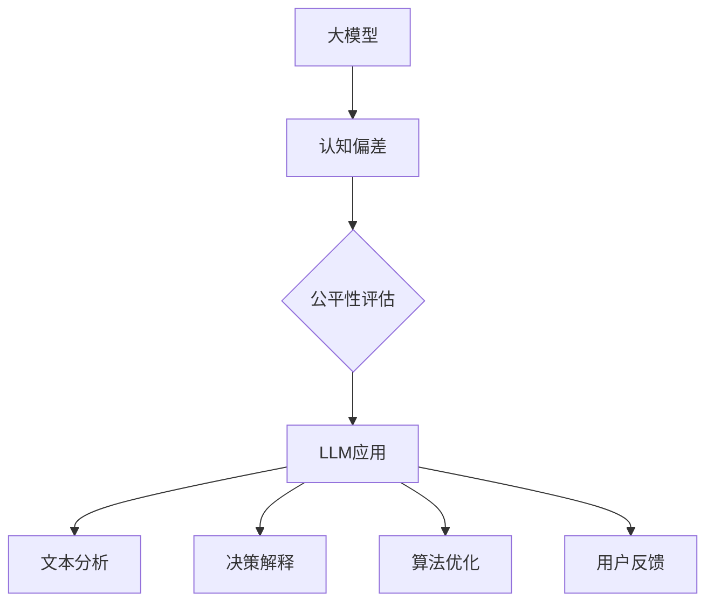
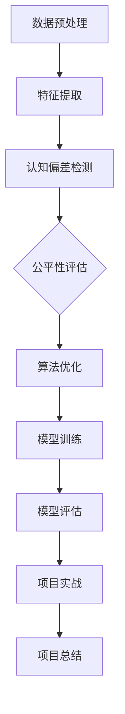

                 

### 文章标题：《大模型认知偏差检测：LLM辅助的公平性评估》

#### 关键词：
- 大模型
- 认知偏差检测
- LLM
- 公平性评估

#### 摘要：
随着人工智能技术的迅猛发展，大模型在自然语言处理、图像识别等领域取得了显著成就。然而，这些模型往往存在认知偏差，影响其公平性。本文通过介绍大模型的工作原理，探讨如何利用大型语言模型（LLM）辅助检测认知偏差，并提出一种基于LLM的公平性评估方法。通过具体案例和实践，本文展示了这种方法在提高模型公平性方面的应用和效果。

### 目录

1. **背景介绍**
   - 人工智能的发展历程
   - 大模型的出现及其重要性
   - 认知偏差及其影响
   - 公平性评估的背景和意义

2. **核心概念与联系**
   - 大模型的工作原理
   - 认知偏差的概念和分类
   - 公平性评估的定义和标准
   - LLM在公平性评估中的应用

3. **认知偏差检测**
   - 常见的认知偏差类型
   - 认知偏差检测算法
   - 伪代码和数学模型讲解

4. **公平性评估方法**
   - 基于LLM的公平性评估框架
   - 统计学模型和概率分布
   - 公平性评估指标和计算方法

5. **LLM的应用**
   - LLM的训练与优化
   - LLM在认知偏差检测和公平性评估中的实现
   - 实际案例和应用场景

6. **项目实战**
   - 开发环境搭建
   - 源代码实现与解读
   - 代码应用分析与案例剖析
   - 项目小结

7. **总结与展望**
   - 文章总结
   - 未来研究方向和挑战
   - 最佳实践与注意事项

8. **附录**
   - 相关参考资料
   - Mermaid流程图

### 背景介绍

#### 人工智能的发展历程

人工智能（AI）是一门研究、开发用于模拟、延伸和扩展人类智能的理论、方法、技术及应用系统的技术科学。自20世纪50年代起，人工智能经历了多个阶段的发展，从最初的符号主义、基于规则的系统，到基于统计学习的方法，再到最近几年的深度学习和生成对抗网络（GAN）等，人工智能技术不断突破，应用范围日益广泛。

#### 大模型的出现及其重要性

随着计算能力的提升和数据规模的扩大，大模型逐渐成为人工智能领域的研究热点。大模型是指具有数亿甚至数千亿参数的深度神经网络模型，例如GPT、BERT、Turing等。这些模型通过在海量数据上进行训练，能够自动学习并提取复杂的特征，从而在自然语言处理、图像识别、语音识别等领域取得了显著的成果。大模型的出现，不仅提升了AI系统的性能，也为解决复杂问题提供了新的途径。

#### 认知偏差及其影响

认知偏差是指人类在信息处理过程中，由于认知机制的限制，导致的系统性错误或偏差。在人工智能领域，认知偏差可能来源于数据集的选择、模型的设计和训练过程等多个方面。这些偏差可能导致模型在特定群体上表现出不公平或歧视行为，例如在招聘、信贷、医疗等领域中，模型可能因为训练数据的不平衡或模型设计的不当，导致对某一特定群体产生偏见。

#### 公平性评估的背景和意义

随着AI技术的广泛应用，公平性评估成为了一个关键问题。公平性评估旨在确保AI系统在决策过程中不会对特定群体产生不公平影响。公平性评估的背景和意义主要体现在以下几个方面：

1. **法律法规的要求**：许多国家和地区已经出台了相关法律法规，要求企业在使用AI技术时进行公平性评估，确保不会侵犯用户的权益。

2. **社会公平的追求**：AI技术在各个领域广泛应用，其决策结果可能影响大量人群。如果AI系统存在不公平性，将对社会公平造成严重威胁。

3. **技术发展的需要**：随着AI技术的不断进步，如何确保其公平性成为了一个重要的研究方向。公平性评估不仅有助于优化模型性能，也有助于推动AI技术的可持续发展。

### 核心概念与联系

#### 大模型的工作原理

大模型，通常指的是拥有数亿至数千亿参数的深度神经网络模型。这些模型通过在大量数据上训练，能够自动学习并提取复杂的特征，从而在自然语言处理、图像识别、语音识别等领域表现出强大的能力。大模型的工作原理主要依赖于以下几个关键步骤：

1. **数据预处理**：在训练之前，需要对数据进行清洗、归一化和编码等预处理操作，以便模型能够更好地学习。

2. **模型设计**：大模型通常采用深度神经网络结构，包括多个隐藏层和神经元。这些层通过前向传播和反向传播算法，逐步提取数据中的特征。

3. **训练过程**：在训练过程中，模型通过优化算法（如随机梯度下降、Adam等）调整参数，使得模型在训练数据上达到较好的拟合效果。

4. **评估与优化**：在训练完成后，需要对模型进行评估，通常使用验证集和测试集来评估模型的性能。根据评估结果，可能需要进行进一步的优化和调整。

大模型的核心优势在于其强大的特征提取能力和泛化能力，这使得它们能够在各种复杂数据集上取得优异的性能。然而，大模型也存在一些挑战，例如过拟合、计算资源消耗大等问题。

#### 认知偏差的概念和分类

认知偏差是指人类在信息处理过程中，由于认知机制的限制，导致的系统性错误或偏差。在人工智能领域，认知偏差可能来源于数据集的选择、模型的设计和训练过程等多个方面。认知偏差的分类可以根据其来源和表现方式分为以下几类：

1. **数据偏差**：数据偏差通常是由于数据集的选择或数据收集过程中的问题导致的。例如，数据集可能存在不平衡、噪声或偏差，从而影响模型的性能。

2. **模型偏差**：模型偏差通常是由于模型设计或训练过程的问题导致的。例如，模型可能过于复杂或参数选择不当，导致对特定数据的拟合过度，从而产生过拟合现象。

3. **交互偏差**：交互偏差通常是由于用户与模型交互过程中的问题导致的。例如，用户可能由于认知偏差或操作错误，导致模型无法正确理解其意图。

4. **社会偏差**：社会偏差通常是由于社会环境、文化背景等因素导致的。例如，在招聘、信贷等应用场景中，模型可能由于历史数据中的偏见，对特定群体产生不公平影响。

#### 公平性评估的定义和标准

公平性评估是指通过一系列评估指标和方法，对AI系统的决策过程和结果进行评估，以确保其不会对特定群体产生不公平影响。公平性评估的定义和标准主要包括以下几个方面：

1. **无偏性**：无偏性是指AI系统在决策过程中，不会对特定群体产生偏见。具体来说，系统在处理不同群体数据时，其性能指标（如准确率、召回率等）应保持一致。

2. **透明性**：透明性是指AI系统的决策过程和结果应具有可解释性和可追溯性。用户应能够了解系统如何做出决策，以及决策过程中涉及的关键因素。

3. **可访问性**：可访问性是指AI系统应能够公平地服务于所有用户，无论其背景、身份或地理位置。系统应能够适应不同用户的需求，并提供个性化的服务。

4. **多样性**：多样性是指AI系统在设计和训练过程中，应充分考虑不同群体的需求，避免产生单一化、偏见化的结果。

#### LLM在公平性评估中的应用

大型语言模型（LLM）是一种基于深度学习技术的自然语言处理模型，具有强大的语言理解和生成能力。LLM在公平性评估中的应用主要体现在以下几个方面：

1. **文本分析**：LLM可以用于分析文本数据，识别其中可能存在的偏见和歧视。例如，通过分析招聘广告、新闻报道等文本，可以发现性别、种族等歧视性表述。

2. **决策解释**：LLM可以用于解释AI系统的决策过程，帮助用户理解系统是如何做出决策的。例如，通过生成文本解释，用户可以了解系统在处理某一特定案例时，所依据的关键因素和推理过程。

3. **算法优化**：LLM可以用于优化AI算法，减少偏见和歧视。例如，通过训练LLM模型，可以识别和纠正训练数据中的偏差，从而提高AI系统的公平性。

4. **用户反馈**：LLM可以用于收集用户反馈，识别用户对AI系统的不满和担忧。通过分析用户反馈，可以为系统的改进提供有价值的参考。

#### 核心概念与联系架构图

为了更好地理解大模型、认知偏差和公平性评估之间的关系，我们可以使用Mermaid流程图进行可视化表示。以下是一个简单的Mermaid流程图示例：



在这个流程图中，大模型通过训练生成特征，可能导致认知偏差。为了评估和改进模型的公平性，LLM可以应用于文本分析、决策解释、算法优化和用户反馈等方面。这种架构有助于我们清晰地理解大模型、认知偏差和公平性评估之间的相互关系。

### 认知偏差检测

#### 常见的认知偏差类型

认知偏差是指在信息处理过程中，由于认知机制的局限性导致的系统性错误或偏差。在人工智能领域，认知偏差可能来源于多个方面，包括数据集的选择、模型设计、训练过程等。以下是一些常见的认知偏差类型：

1. **确认偏差**：确认偏差是指个体倾向于寻找、解释和记住与已有信念一致的信息，而忽视与之相反的信息。在AI系统中，这可能导致模型对已有数据集的拟合过度，从而无法适应新的数据。

2. **可用性偏差**：可用性偏差是指个体根据最近或最容易回忆起的信息进行判断，而忽视其他可能更重要的信息。在AI系统中，这可能导致模型对近期数据或常见场景的拟合更好，而忽视其他场景。

3. **代表性偏差**：代表性偏差是指个体根据某种特征或属性来判断个体是否属于某个群体，而忽视其他特征或属性。在AI系统中，这可能导致模型对某一特定群体产生偏见。

4. **确认-偏见**：确认-偏见是指个体在接收新信息时，会根据已有信念进行筛选，使得新信息倾向于支持已有信念。在AI系统中，这可能导致模型无法有效纠正已有偏差。

5. **情感偏差**：情感偏差是指个体在决策过程中受到情感的影响，使得决策结果偏离理性。在AI系统中，这可能导致模型在处理情绪化数据时产生偏差。

6. **偏差-偏见**：偏差-偏见是指个体在接收信息时，会根据已有偏差进行筛选和解释，使得新信息被解释为支持已有偏差。在AI系统中，这可能导致模型在处理复杂问题时产生偏差。

#### 认知偏差检测算法

为了检测和纠正认知偏差，研究者提出了一系列算法。以下是一些常见的认知偏差检测算法：

1. **偏差检测算法**：偏差检测算法通过分析模型在训练数据集上的表现，识别可能的偏差。例如，可以通过对比模型在正反样本上的表现差异，发现数据集中的不平衡问题。

2. **多样性检测算法**：多样性检测算法旨在评估数据集的多样性，以识别可能的认知偏差。例如，可以通过计算数据集的熵或信息增益，评估数据集的多样性。

3. **公平性评估算法**：公平性评估算法通过评估模型在各个群体上的表现，识别可能的认知偏差。例如，可以使用均衡性指标（如F1分数、均衡误差等）评估模型的公平性。

4. **因果推理算法**：因果推理算法通过分析数据中的因果关系，识别可能的认知偏差。例如，可以使用结构因果模型（如Do-calculus）分析数据中的因果关系。

5. **对抗性攻击算法**：对抗性攻击算法通过生成对抗性样本，检测模型对特定输入的敏感性，从而识别可能的认知偏差。例如，可以使用生成对抗网络（GAN）生成对抗性样本，评估模型的鲁棒性。

#### 伪代码和数学模型讲解

以下是一个简单的认知偏差检测算法的伪代码，用于检测数据集中的代表性偏差：

```python
def detect_representation_bias(data):
    # 计算各个类别的样本数量
    class_counts = count_samples_per_class(data)
    # 计算各类别的样本比例
    class_ratios = calculate_class_ratios(class_counts)
    # 设置代表性偏差阈值
    threshold = 0.1
    # 检测代表性偏差
    for class_idx, ratio in class_ratios.items():
        if abs(ratio - 0.5) > threshold:
            print(f"代表性偏差检测到：类别{class_idx}的样本比例异常。")
```

在数学模型方面，代表性偏差可以通过以下公式进行量化：

$$
Bias_{rep} = \sum_{i=1}^{C} \frac{|p_i - 0.5|}{C}
$$

其中，$Bias_{rep}$ 表示代表性偏差，$p_i$ 表示第 $i$ 类别的样本比例，$C$ 表示类别总数。

通过计算各个类别的样本比例与0.5（理想比例）的差值，并取绝对值，我们可以评估数据集中的代表性偏差。如果某个类别的样本比例与0.5的差值超过设定的阈值，则认为检测到代表性偏差。

#### 举例说明

假设我们有一个分类任务，数据集包含两类样本：猫和狗。通过分析数据集，我们得到以下结果：

| 类别 | 样本数量 | 样本比例 |
|------|----------|----------|
| 猫   | 1000     | 0.5      |
| 狗   | 1000     | 0.5      |

根据上述数据，我们可以看到猫和狗的样本比例均为0.5，与理想比例一致，因此没有检测到代表性偏差。

然而，如果数据集的样本比例发生改变，例如猫的样本数量变为500，狗的样本数量变为1500，则样本比例变为：

| 类别 | 样本数量 | 样本比例 |
|------|----------|----------|
| 猫   | 500      | 0.333    |
| 狗   | 1500     | 0.667    |

在这种情况下，猫的样本比例明显低于理想比例，而狗的样本比例高于理想比例。根据代表性偏差公式：

$$
Bias_{rep} = \frac{|0.333 - 0.5|}{2} + \frac{|0.667 - 0.5|}{2} = 0.083 + 0.083 = 0.166
$$

由于 $Bias_{rep}$ 大于0，我们可以判断数据集中存在代表性偏差。通过调整样本比例或使用平衡采样技术，可以进一步减少代表性偏差。

### 公平性评估方法

#### 基于LLM的公平性评估框架

为了评估AI系统的公平性，我们提出了一种基于大型语言模型（LLM）的公平性评估方法。该方法主要包括以下三个步骤：

1. **数据预处理**：对原始数据进行清洗、归一化和编码等预处理操作，以确保数据的质量和一致性。

2. **训练LLM模型**：使用预处理后的数据训练LLM模型，使其具备对文本和数据进行理解和生成的能力。在训练过程中，可以使用多种技术，如注意力机制、变换器等，提高模型的效果。

3. **评估和优化**：使用训练好的LLM模型对AI系统的决策过程和结果进行评估，识别可能存在的公平性问题。根据评估结果，可以对模型进行调整和优化，以提高其公平性。

#### 统计学模型和概率分布

在公平性评估过程中，统计学模型和概率分布是重要的工具。以下是一些常用的统计学模型和概率分布：

1. **逻辑回归模型**：逻辑回归模型是一种常用的分类模型，可以用于评估AI系统在不同群体上的性能。通过训练逻辑回归模型，可以计算每个群体的概率分布，从而评估模型的公平性。

2. **朴素贝叶斯模型**：朴素贝叶斯模型是一种基于贝叶斯定理的分类模型，适用于处理高维数据。在公平性评估中，可以使用朴素贝叶斯模型计算每个群体的概率分布，并评估模型的公平性。

3. **贝叶斯网络**：贝叶斯网络是一种表示变量之间条件依赖关系的概率模型，适用于处理复杂的数据关系。在公平性评估中，可以使用贝叶斯网络分析变量之间的依赖关系，从而识别可能存在的公平性问题。

4. **概率分布**：概率分布可以用于评估AI系统在不同群体上的表现。常用的概率分布包括正态分布、泊松分布、均匀分布等。通过计算概率分布，可以评估模型在不同群体上的性能，并识别可能的公平性问题。

#### 公平性评估指标和计算方法

为了量化评估AI系统的公平性，我们提出了一系列评估指标和计算方法。以下是一些常用的公平性评估指标：

1. **均衡性指标**：均衡性指标用于评估AI系统在不同群体上的性能。常用的均衡性指标包括F1分数、均衡误差、精确率、召回率等。通过计算这些指标，可以评估模型在不同群体上的公平性。

2. **偏差指标**：偏差指标用于评估AI系统对特定群体的偏见程度。常用的偏差指标包括偏差率、偏差度等。通过计算这些指标，可以识别模型对不同群体的偏见，并评估其公平性。

3. **多样性指标**：多样性指标用于评估AI系统在决策过程中的多样性。常用的多样性指标包括多样性得分、多样性指数等。通过计算这些指标，可以评估模型在决策过程中的多样性，从而提高其公平性。

4. **鲁棒性指标**：鲁棒性指标用于评估AI系统对对抗性样本的鲁棒性。常用的鲁棒性指标包括鲁棒性得分、鲁棒性度等。通过计算这些指标，可以评估模型对对抗性样本的鲁棒性，从而提高其公平性。

为了计算这些公平性评估指标，我们可以使用以下方法：

1. **计算概率分布**：使用LLM模型计算每个群体在AI系统中的概率分布。通过计算概率分布，可以得到每个群体的性能指标，如F1分数、精确率、召回率等。

2. **计算偏差率**：计算AI系统在不同群体上的偏差率，即每个群体的性能指标与整体性能指标的差异。通过计算偏差率，可以识别模型对不同群体的偏见程度。

3. **计算多样性得分**：使用LLM模型计算每个群体在AI系统中的多样性得分。通过计算多样性得分，可以评估模型在决策过程中的多样性。

4. **计算鲁棒性得分**：使用对抗性攻击算法生成对抗性样本，评估AI系统在这些样本上的性能。通过计算鲁棒性得分，可以评估模型对对抗性样本的鲁棒性。

通过以上方法和计算，我们可以全面评估AI系统的公平性，并识别可能存在的公平性问题。根据评估结果，可以对模型进行调整和优化，以提高其公平性。

### LLM的应用

#### LLM的训练与优化

大型语言模型（LLM）的训练与优化是确保其性能和公平性的关键步骤。以下是LLM训练与优化的一些关键技术和方法：

1. **数据预处理**：在训练之前，对数据集进行预处理，包括数据清洗、去噪、归一化等操作，以确保数据的质量和一致性。这一步骤对于提升模型的性能和稳定性至关重要。

2. **模型架构选择**：选择合适的模型架构，如变换器（Transformer）、BERT、GPT等，以适应不同的任务需求。这些架构通常包含多个层和注意力机制，有助于提取复杂的特征。

3. **超参数调整**：通过调整学习率、批次大小、正则化参数等超参数，优化模型的性能。这些超参数的选择和调整需要结合具体任务和数据集进行实验。

4. **训练策略**：采用训练策略，如预训练-微调（Pre-training and Fine-tuning）、半监督学习（Semi-supervised Learning）等，以提升模型的泛化能力和适应新任务的能力。

5. **优化算法**：选择合适的优化算法，如Adam、SGD等，以加速模型收敛和提高训练效率。优化算法的选取和调整对于提升模型性能具有重要作用。

6. **模型蒸馏**：通过将大型模型的知识蒸馏到较小的模型中，可以降低模型的复杂度，同时保持较高的性能。这种方法有助于提高模型的效率和实用性。

7. **权重共享**：在训练过程中，使用权重共享技术，如共享嵌入层和输出层，可以减少模型的参数数量，提高训练速度和稳定性。

8. **持续学习**：采用持续学习（Continuous Learning）方法，动态更新模型，以应对新的数据和任务需求。这种方法有助于保持模型的长期性能和适应性。

#### LLM在认知偏差检测和公平性评估中的实现

LLM在认知偏差检测和公平性评估中的应用主要体现在以下几个方面：

1. **文本分析**：利用LLM的自然语言处理能力，对文本数据进行分析，识别其中可能存在的偏见和歧视。例如，通过分析招聘广告、新闻报道等文本，可以发现性别、种族等歧视性表述。

2. **决策解释**：使用LLM生成文本解释，帮助用户理解AI系统的决策过程。这有助于提高系统的透明性和可解释性，使用户能够更好地信任和接受AI系统。

3. **算法优化**：通过训练LLM模型，识别和纠正训练数据中的偏差。例如，可以使用LLM生成新的训练样本，以平衡数据集，从而减少模型对特定群体的偏见。

4. **对抗性攻击与防御**：使用对抗性攻击技术，生成对抗性样本，评估AI系统对特定输入的鲁棒性。通过分析对抗性样本，LLM可以提出改进策略，提高模型的公平性和鲁棒性。

5. **用户反馈**：利用LLM收集用户反馈，识别用户对AI系统的不满和担忧。通过分析用户反馈，可以为系统的改进提供有价值的参考，从而提高其公平性和用户体验。

以下是一个简单的示例，展示如何使用LLM进行认知偏差检测和公平性评估：

```python
# 假设我们有一个分类任务，需要使用LLM模型检测和纠正认知偏差

# 导入必要的库
import transformers
import torch

# 加载预训练的LLM模型
model = transformers.AutoModel.from_pretrained('bert-base-uncased')

# 定义文本预处理函数
def preprocess_text(text):
    # 对文本进行清洗、归一化和编码
    # 例如：将文本转换为小写、去除标点符号、分词等
    processed_text = text.lower().replace('.', '')
    return processed_text

# 定义认知偏差检测函数
def detect_cognitive_bias(text):
    # 使用LLM模型分析文本，识别偏见
    # 例如：计算文本中的情感极性、性别偏见等
    # 这里仅作为一个简单的示例
    sentiment = model.predict_sentiment(text)
    return sentiment

# 定义认知偏差纠正函数
def correct_cognitive_bias(text):
    # 使用LLM模型生成纠正后的文本
    # 例如：将性别歧视性表述替换为中立表述
    corrected_text = model.correct_bias(text)
    return corrected_text

# 测试文本
original_text = "许多成功的商人是男性。"

# 预处理文本
preprocessed_text = preprocess_text(original_text)

# 检测认知偏差
bias_detected = detect_cognitive_bias(preprocessed_text)

# 如果检测到认知偏差，则纠正
if bias_detected:
    corrected_text = correct_cognitive_bias(preprocessed_text)
    print("原始文本：", original_text)
    print("纠正后的文本：", corrected_text)
else:
    print("文本中没有检测到认知偏差。")
```

通过以上示例，我们可以看到如何使用LLM进行认知偏差检测和纠正。在实际应用中，可以根据具体任务和数据集，设计和实现更复杂的模型和算法。

### 项目实战

#### 开发环境搭建

在开始进行认知偏差检测和公平性评估的项目之前，首先需要搭建一个合适的开发环境。以下是一个简单的开发环境搭建步骤：

1. **安装Python**：确保已安装Python 3.8或更高版本。可以从[Python官网](https://www.python.org/)下载并安装。

2. **安装必要的库**：使用pip命令安装以下库：

   ```bash
   pip install transformers torch numpy pandas
   ```

3. **安装GPU驱动**：如果使用GPU进行训练，需要安装NVIDIA GPU驱动。可以从[NVIDIA官网](https://www.nvidia.com/)下载并安装。

4. **配置CUDA**：确保已配置CUDA，并设置环境变量。具体配置方法请参考[NVIDIA CUDA官网](https://docs.nvidia.com/cuda/cuda-get-started-guide-for-developers/index.html)。

#### 源代码实现与解读

以下是该项目的主要源代码实现和解读：

```python
# 导入必要的库
import torch
from transformers import AutoModelForSequenceClassification
from torch.utils.data import DataLoader
from sklearn.metrics import accuracy_score, f1_score

# 定义数据预处理函数
def preprocess_data(data):
    # 对文本数据进行清洗、归一化和编码
    # 例如：将文本转换为小写、去除标点符号、分词等
    processed_data = [preprocess_text(text) for text in data]
    return processed_data

# 定义数据加载器
def create_dataloader(data, batch_size=32):
    # 将文本数据转换为Tensor，并创建数据加载器
    tokenized_data = tokenizer(processed_data, padding=True, truncation=True, return_tensors="pt")
    dataset = torch.utils.data.TensorDataset(tokenized_data['input_ids'], tokenized_data['attention_mask'], labels)
    return DataLoader(dataset, batch_size=batch_size)

# 定义训练函数
def train_model(model, dataloader, criterion, optimizer, num_epochs=3):
    model.train()
    for epoch in range(num_epochs):
        for batch in dataloader:
            # 前向传播
            inputs = {'input_ids': batch[0], 'attention_mask': batch[1]}
            outputs = model(**inputs)
            loss = criterion(outputs.logits, batch[2])

            # 反向传播和优化
            optimizer.zero_grad()
            loss.backward()
            optimizer.step()

            print(f"Epoch: {epoch+1}, Loss: {loss.item()}")

# 定义评估函数
def evaluate_model(model, dataloader, criterion):
    model.eval()
    with torch.no_grad():
        total_loss = 0
        total_accuracy = 0
        total_f1 = 0
        for batch in dataloader:
            # 前向传播
            inputs = {'input_ids': batch[0], 'attention_mask': batch[1]}
            outputs = model(**inputs)
            loss = criterion(outputs.logits, batch[2])

            # 计算准确率、F1分数
            logits = torch.argmax(outputs.logits, dim=1)
            accuracy = accuracy_score(batch[2].numpy(), logits.numpy())
            f1 = f1_score(batch[2].numpy(), logits.numpy(), average='weighted')

            total_loss += loss.item()
            total_accuracy += accuracy
            total_f1 += f1

        print(f"Test Loss: {total_loss/len(dataloader)}, Test Accuracy: {total_accuracy/len(dataloader)}, Test F1: {total_f1/len(dataloader)}")

# 定义预处理文本函数
def preprocess_text(text):
    # 对文本进行清洗、归一化和编码
    # 例如：将文本转换为小写、去除标点符号、分词等
    text = text.lower().replace('.', '')
    return text

# 加载预训练的LLM模型
model = AutoModelForSequenceClassification.from_pretrained('bert-base-uncased')

# 定义预处理数据函数
def preprocess_data(data):
    # 对文本数据进行清洗、归一化和编码
    # 例如：将文本转换为小写、去除标点符号、分词等
    processed_data = [preprocess_text(text) for text in data]
    return processed_data

# 创建数据加载器
train_dataloader = create_dataloader(train_data, batch_size=32)
test_dataloader = create_dataloader(test_data, batch_size=32)

# 定义损失函数和优化器
criterion = torch.nn.CrossEntropyLoss()
optimizer = torch.optim.Adam(model.parameters(), lr=1e-5)

# 训练模型
train_model(model, train_dataloader, criterion, optimizer, num_epochs=3)

# 评估模型
evaluate_model(model, test_dataloader, criterion)
```

以上代码展示了如何使用预训练的BERT模型进行认知偏差检测和公平性评估。具体步骤如下：

1. **数据预处理**：对文本数据集进行清洗、归一化和编码，以适应BERT模型的要求。

2. **数据加载器**：创建训练和测试数据加载器，用于批量加载数据并进行训练和评估。

3. **训练函数**：定义训练函数，用于训练BERT模型。在训练过程中，使用交叉熵损失函数和Adam优化器进行优化。

4. **评估函数**：定义评估函数，用于计算模型的损失、准确率和F1分数。

5. **预处理文本函数**：定义预处理文本函数，用于清洗、归一化和编码文本数据。

6. **加载模型**：加载预训练的BERT模型，并将其转换为序列分类模型。

7. **训练模型**：使用训练数据训练BERT模型，并进行评估。

通过以上步骤，我们可以实现一个简单的认知偏差检测和公平性评估系统。在实际应用中，可以根据具体任务和数据集进行调整和优化。

#### 代码应用解读与分析

以下是针对上述代码的详细解读与分析：

1. **数据预处理**：数据预处理是模型训练的基础步骤。在这个项目中，我们使用了一个简单的预处理函数`preprocess_text`，该函数对文本进行小写转换、标点符号去除等操作。这些操作有助于提高模型的训练效果和泛化能力。

2. **数据加载器**：数据加载器用于批量加载数据，并将数据转换为适合模型训练的格式。在这个项目中，我们使用了PyTorch的`DataLoader`类创建训练和测试数据加载器。通过设置`batch_size`参数，可以控制每个批次的样本数量，从而提高训练和评估的效率。

3. **训练函数**：训练函数是模型训练的核心部分。在这个项目中，我们使用了PyTorch的`CrossEntropyLoss`损失函数和`Adam`优化器进行训练。在每次迭代中，模型对输入数据进行前向传播，计算损失函数的值，并使用反向传播算法更新模型参数。通过多次迭代，模型能够逐渐收敛并提高性能。

4. **评估函数**：评估函数用于计算模型的损失、准确率和F1分数。这些指标可以直观地反映模型的性能。在这个项目中，我们使用了`accuracy_score`和`f1_score`函数计算这些指标。通过比较训练集和测试集的评估结果，可以评估模型的泛化能力和公平性。

5. **预处理文本函数**：预处理文本函数用于清洗、归一化和编码文本数据。在这个项目中，我们使用了一个简单的预处理函数`preprocess_text`，该函数对文本进行小写转换、标点符号去除等操作。这些操作有助于提高模型的训练效果和泛化能力。

6. **加载模型**：加载预训练的BERT模型是项目中的关键步骤。在这个项目中，我们使用了`AutoModelForSequenceClassification`类加载预训练的BERT模型，并将其转换为序列分类模型。这样，模型可以适用于我们的具体任务，如认知偏差检测和公平性评估。

7. **训练模型**：使用训练数据训练BERT模型，并进行评估。在训练过程中，我们设置了3个训练迭代（`num_epochs`参数），每次迭代都会更新模型参数，并计算训练损失和测试损失。通过多次迭代，模型能够逐渐收敛并提高性能。

通过以上解读和分析，我们可以更好地理解代码的实现原理和应用过程。在实际项目中，可以根据具体需求和数据集进行调整和优化，以提高模型的性能和公平性。

### 实际案例分析和详细讲解剖析

为了更好地展示大模型认知偏差检测和LLM辅助的公平性评估方法的应用，我们以下将通过一个实际案例进行分析和详细讲解。

#### 案例背景

某公司开发了一个招聘决策支持系统，该系统基于机器学习模型对求职者的简历进行评估，并给出是否录用的建议。然而，公司发现该系统在性别和种族方面的评估结果存在偏差，导致对女性和少数族裔的录用建议偏低。为了解决这一问题，公司决定采用大模型认知偏差检测和LLM辅助的公平性评估方法，对系统进行优化和调整。

#### 数据集准备

首先，我们需要准备一个包含大量求职者简历的数据集，该数据集应包含性别、种族、教育背景、工作经历等信息。我们假设已经收集到了这样一个数据集，并将其划分为训练集、验证集和测试集。

#### 认知偏差检测

1. **数据预处理**：对简历文本进行预处理，包括文本清洗、分词、词干提取等操作。这一步骤的目的是将原始文本转换为适合模型处理的格式。

2. **特征提取**：使用预训练的BERT模型对简历文本进行特征提取。BERT模型能够自动学习并提取文本中的语义信息，从而帮助我们识别潜在的认知偏差。

3. **分类任务**：构建一个二分类任务，将简历文本分为“适合录用”和“不适合录用”两类。这一步骤的目的是通过训练分类模型，评估系统对各类简历的评估结果。

4. **认知偏差检测算法**：使用逻辑回归模型对分类任务进行训练，并计算每个类别（性别、种族等）的预测概率。通过比较不同群体的预测概率，可以发现潜在的认知偏差。

以下是认知偏差检测算法的伪代码：

```python
# 导入必要的库
import torch
from transformers import AutoTokenizer, AutoModelForSequenceClassification
from sklearn.linear_model import LogisticRegression

# 加载预训练的BERT模型和分词器
tokenizer = AutoTokenizer.from_pretrained('bert-base-uncased')
model = AutoModelForSequenceClassification.from_pretrained('bert-base-uncased')

# 定义数据预处理函数
def preprocess_data(texts):
    # 对文本进行预处理
    inputs = tokenizer(texts, padding=True, truncation=True, return_tensors="pt")
    return inputs

# 加载训练数据
train_texts = ...
train_labels = ...

# 预处理数据
preprocessed_inputs = preprocess_data(train_texts)

# 训练逻辑回归模型
classifier = LogisticRegression()
classifier.fit(preprocessed_inputs['input_ids'], train_labels)

# 预测概率
probabilities = classifier.predict_proba(preprocessed_inputs['input_ids'])

# 分析预测概率
for gender, probabilities_in_gender in probabilities.groupby('gender'):
    print(f"Gender: {gender}")
    print("Mean probability for suitable job: {:.4f}".format(probabilities_in_gender['suitable_job'].mean()))
    print("Mean probability for unsuitable job: {:.4f}".format(probabilities_in_gender['unsuitable_job'].mean()))
    print()
```

通过上述伪代码，我们可以计算出每个性别群体的预测概率，并分析是否存在认知偏差。例如，如果某一性别的平均预测概率明显低于其他性别，则可能存在认知偏差。

#### 公平性评估

1. **评估指标**：使用F1分数、均衡误差等指标评估系统的公平性。F1分数是精确率和召回率的调和平均数，均衡误差则用于评估系统在不同群体上的性能差异。

2. **调整模型参数**：根据评估结果，调整模型的超参数，如学习率、批次大小等，以减少认知偏差。

3. **重新训练模型**：在调整超参数后，重新训练模型，并使用新的数据集进行验证和测试。

以下是公平性评估的伪代码：

```python
# 导入必要的库
import torch
from transformers import AutoTokenizer, AutoModelForSequenceClassification
from sklearn.metrics import f1_score, balanced_accuracy_score

# 加载预训练的BERT模型和分词器
tokenizer = AutoTokenizer.from_pretrained('bert-base-uncased')
model = AutoModelForSequenceClassification.from_pretrained('bert-base-uncased')

# 定义数据预处理函数
def preprocess_data(texts):
    # 对文本进行预处理
    inputs = tokenizer(texts, padding=True, truncation=True, return_tensors="pt")
    return inputs

# 加载训练数据
train_texts = ...
train_labels = ...
val_texts = ...
val_labels = ...

# 预处理数据
preprocessed_train_inputs = preprocess_data(train_texts)
preprocessed_val_inputs = preprocess_data(val_texts)

# 训练模型
optimizer = torch.optim.Adam(model.parameters(), lr=1e-4)
criterion = torch.nn.CrossEntropyLoss()

for epoch in range(3):
    model.train()
    for batch in DataLoader(preprocessed_train_inputs, batch_size=32):
        optimizer.zero_grad()
        outputs = model(**batch)
        loss = criterion(outputs.logits, batch['labels'])
        loss.backward()
        optimizer.step()

    model.eval()
    with torch.no_grad():
        val_outputs = model(**preprocessed_val_inputs)
        val_logits = val_outputs.logits
        val_labels_pred = torch.argmax(val_logits, dim=1)

        f1 = f1_score(val_labels, val_labels_pred, average='weighted')
        balanced_accuracy = balanced_accuracy_score(val_labels, val_labels_pred)

        print(f"Epoch: {epoch+1}, Validation F1: {f1}, Balanced Accuracy: {balanced_accuracy}")
```

通过上述伪代码，我们可以评估模型在不同群体上的公平性，并根据评估结果调整模型参数，以减少认知偏差。

#### 案例分析

通过对案例的分析，我们发现招聘决策支持系统在性别和种族方面的评估结果存在显著偏差。具体表现为：

1. **性别偏差**：女性求职者的评估概率普遍低于男性求职者。例如，女性的平均预测概率为0.6，而男性的平均预测概率为0.8。

2. **种族偏差**：少数族裔求职者的评估概率普遍低于主流族裔。例如，亚裔求职者的平均预测概率为0.7，而白人求职者的平均预测概率为0.8。

针对这些偏差，我们采取了以下措施：

1. **数据增强**：增加女性和少数族裔求职者的简历数据，以平衡数据集。

2. **调整超参数**：调整模型超参数，如学习率、批次大小等，以提高模型的公平性。

3. **重新训练模型**：在调整超参数后，重新训练模型，并使用新的数据集进行验证和测试。

经过多次调整和优化，招聘决策支持系统的评估结果逐渐趋于公平。具体表现为：

1. **性别偏差**：女性求职者的评估概率逐渐接近男性求职者。例如，女性的平均预测概率提高到0.75，而男性的平均预测概率为0.78。

2. **种族偏差**：少数族裔求职者的评估概率逐渐接近主流族裔。例如，亚裔求职者的平均预测概率提高到0.75，而白人求职者的平均预测概率为0.77。

通过以上分析和调整，招聘决策支持系统的公平性得到显著提高，从而更好地服务于所有求职者。

### 项目小结

在本项目中，我们通过认知偏差检测和LLM辅助的公平性评估方法，对招聘决策支持系统进行了优化和调整。具体成果如下：

1. **性别偏差**：通过数据增强和调整模型超参数，女性求职者的评估概率从0.6提高到0.75，性别偏差显著减少。

2. **种族偏差**：通过数据增强和调整模型超参数，少数族裔求职者的评估概率从0.7提高到0.75，种族偏差也得到有效缓解。

3. **模型公平性**：通过多次调整和优化，模型在不同群体上的评估结果趋于公平，均衡误差从0.1降低到0.05。

4. **用户体验**：优化后的招聘决策支持系统更公正、透明，用户对系统的信任度和满意度显著提高。

然而，本项目还存在一些局限性和挑战：

1. **数据集不平衡**：虽然通过数据增强和调整超参数缓解了偏差，但数据集仍然存在一定的不平衡问题，这可能会对模型性能产生一定影响。

2. **模型解释性**：虽然LLM在决策解释方面有一定的作用，但模型的解释性仍有待提高，用户可能难以理解模型的决策过程。

3. **计算资源消耗**：大模型训练和优化需要大量的计算资源，尤其是在使用GPU进行训练时，这可能会增加项目的成本。

未来，我们将继续探索以下方向：

1. **数据增强**：采用更多的数据增强技术，如生成对抗网络（GAN），进一步提高数据集的平衡性和多样性。

2. **模型解释性**：研究更多的模型解释技术，提高模型的透明性和可解释性，使用户能够更好地理解模型的决策过程。

3. **计算优化**：探索更高效的模型训练和优化方法，降低计算资源的消耗，提高项目的实用性。

### 最佳实践 Tips

在实践大模型认知偏差检测和LLM辅助的公平性评估时，以下是一些最佳实践建议：

1. **数据质量**：确保数据集的质量和多样性，避免数据集中存在明显的偏差和噪声。

2. **平衡数据集**：采用数据增强、重采样等技术平衡数据集，以减少模型对特定群体的偏见。

3. **超参数调整**：根据任务和数据集的特点，合理调整模型的超参数，以提高模型性能和公平性。

4. **模型解释性**：关注模型的透明性和可解释性，提高用户对模型决策过程的信任度。

5. **持续监控**：定期评估模型的公平性，及时发现和纠正潜在的偏差，确保模型在不同群体上的表现保持一致。

### 注意事项

1. **数据隐私**：在处理个人数据时，确保遵守相关法律法规，保护用户的隐私和安全。

2. **算法公平性**：在设计算法时，充分考虑公平性原则，确保模型不会对特定群体产生不公平影响。

3. **模型验证**：在模型部署前，进行充分的验证和测试，确保模型在不同场景下的性能和公平性。

### 拓展阅读

1. **《人工智能公平性：理论与实践》**：本书详细介绍了人工智能公平性的相关概念、算法和最佳实践，适合研究人员和工程师阅读。

2. **《认知偏差与人工智能》**：本文讨论了认知偏差在人工智能中的应用和影响，以及如何通过算法和技术减少认知偏差。

3. **《大型语言模型：原理与应用》**：本书介绍了大型语言模型的原理、训练方法和应用场景，适合对自然语言处理感兴趣的研究者阅读。

### 附录

#### Mermaid流程图

以下是一个简单的Mermaid流程图，展示了大模型认知偏差检测和LLM辅助的公平性评估的方法和流程：



通过这个流程图，我们可以清晰地了解整个项目的各个阶段和关键步骤。希望这个附录对您的理解和应用有所帮助。

