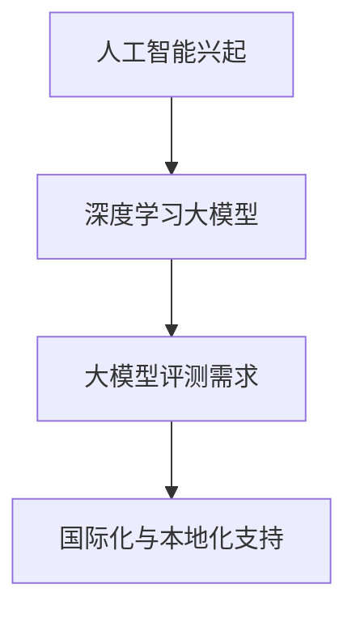
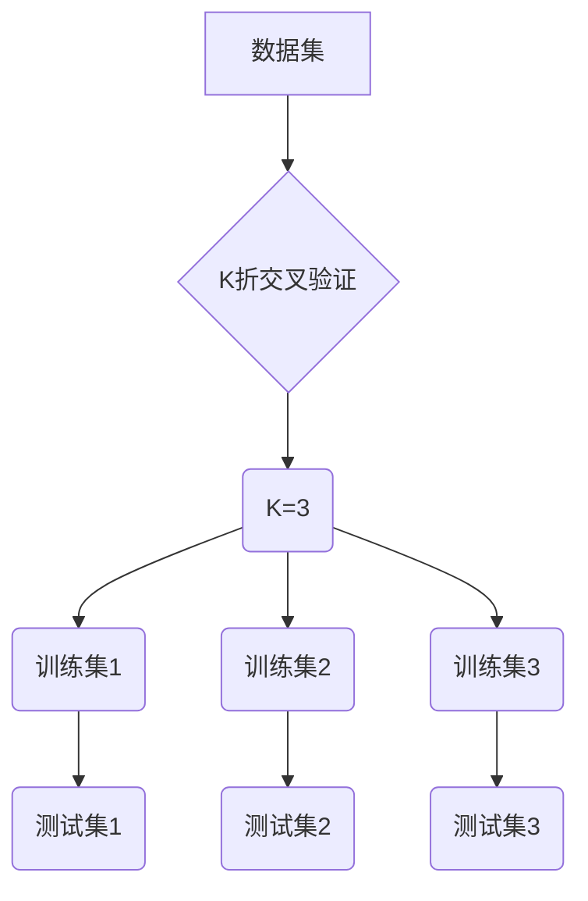

                 


## 文章标题：大模型评测的国际化与本地化支持

关键词：大模型评测，国际化，本地化，评测方法，评测工具，案例分析

摘要：
本文将探讨大模型评测的国际化与本地化问题。首先，我们将回顾大模型评测的基础理论，并详细解释核心概念和评价指标。接着，我们将介绍国际化与本地化评测的特点，以及它们在实际应用中的挑战和策略。通过多个案例分析，我们将展示大模型评测的国际化与本地化支持的实现方法和实际效果，并提供最佳实践和拓展阅读建议。

## 目录大纲

### 第一部分：大模型评测基础理论

### 第1章：大模型评测概述

#### 1.1 大模型评测的重要性

- **核心概念与联系**：大模型评测的重要性与AI技术的演进关系

  - **Mermaid流程图**：展示大模型评测的发展历程和技术演进

    ```mermaid
    graph TD
    A[AI技术发展] --> B[大模型兴起]
    B --> C[大模型评测需求]
    C --> D[国际化与本地化支持]
    ```

#### 1.2 大模型评测的基本概念

- **核心算法原理讲解**：评测指标和常用评测方法

  - **伪代码示例**：常见评测指标的计算方法

    ```python
    # 伪代码：准确率计算
    def accuracy(true_labels, predicted_labels):
        correct = 0
        for i in range(len(true_labels)):
            if true_labels[i] == predicted_labels[i]:
                correct += 1
        return correct / len(true_labels)
    ```

#### 1.3 大模型评测的分类与评价指标

- **数学模型和数学公式**：常见评价指标的公式表示

  - **LaTeX公式**：准确率、召回率、F1分数的计算公式

    ```latex
    \text{准确率} = \frac{\text{预测正确数量}}{\text{总预测数量}}
    \text{召回率} = \frac{\text{预测正确数量}}{\text{实际正确数量}}
    \text{F1分数} = 2 \times \frac{\text{准确率} \times \text{召回率}}{\text{准确率} + \text{召回率}}
    ```

### 第二部分：大模型评测实践

### 第2章：大模型评测方法与工具

#### 2.1 评测方法的对比与分析

- **核心算法原理讲解**：不同评测方法的特点与应用场景

  - **伪代码示例**：不同评测方法的实现

    ```python
    # 伪代码：混淆矩阵分析
    def confusion_matrix(true_labels, predicted_labels):
        # 创建一个4x4的混淆矩阵
        matrix = [[0, 0], [0, 0], [0, 0], [0, 0]]
        # 填充矩阵
        for i in range(len(true_labels)):
            if true_labels[i] == predicted_labels[i]:
                matrix[true_labels[i]][predicted_labels[i]] += 1
            else:
                matrix[true_labels[i]][predicted_labels[i]] += 1
        return matrix
    ```

#### 2.2 评测工具的选择与应用

- **项目实战**：评测工具的实际使用案例

  - **代码实际案例**：评测工具的配置和使用流程

    ```python
    # Python代码：使用Scikit-learn进行模型评测
    from sklearn.metrics import accuracy_score
    from sklearn.model_selection import train_test_split

    # 数据准备
    X, y = ... # 准备特征和标签
    X_train, X_test, y_train, y_test = train_test_split(X, y, test_size=0.2)

    # 模型训练
    model = ... # 定义模型
    model.fit(X_train, y_train)

    # 模型评测
    predictions = model.predict(X_test)
    accuracy = accuracy_score(y_test, predictions)
    print(f"Accuracy: {accuracy}")
    ```

#### 2.3 评测流程的标准化

- **项目实战**：标准化评测流程的实施

  - **源代码实现**：评测流程的自动化脚本

    ```python
    # Python代码：自动化评测脚本
    import subprocess

    # 定义评测命令
    evaluate_command = "python evaluate.py"

    # 执行评测命令
    subprocess.run(evaluate_command, shell=True)
    ```

### 第3章：国际化与本地化评测特点

#### 3.1 国际化评测的挑战与策略

- **项目实战**：国际化评测案例

  - **代码解读与分析**：国际化评测的具体实现

    ```python
    # Python代码：国际化评测
    def evaluate_international(model, test_data, lang_codes):
        # 针对不同语言进行评测
        for lang_code in lang_codes:
            lang_data = filter_by_language(test_data, lang_code)
            predictions = model.predict(lang_data['X'])
            accuracy = accuracy_score(lang_data['y'], predictions)
            print(f"Accuracy for {lang_code}: {accuracy}")
    ```

#### 3.2 本地化评测的需求与实现

- **项目实战**：本地化评测案例

  - **源代码详细实现**：本地化评测的代码解读

    ```python
    # Python代码：本地化评测
    def evaluate_localization(model, test_data, regions):
        # 针对不同地区进行评测
        for region in regions:
            region_data = filter_by_region(test_data, region)
            predictions = model.predict(region_data['X'])
            accuracy = accuracy_score(region_data['y'], predictions)
            print(f"Accuracy for {region}: {accuracy}")
    ```

#### 3.3 国际化与本地化评测的平衡

- **项目实战**：平衡国际化与本地化评测的案例

  - **实战分析**：如何在评测中平衡不同需求

    ```python
    # Python代码：平衡评测
    def balanced_evaluation(model, test_data, lang_codes, regions):
        # 先进行国际化评测
        evaluate_international(model, test_data, lang_codes)
        
        # 再进行本地化评测
        evaluate_localization(model, test_data, regions)
    ```

### 第4章：国际化评测案例研究

#### 4.1 案例一：大型语言模型的国际化评测

- **详细解释说明**：国际化评测的具体流程和实现

#### 4.2 案例二：图像识别模型的本地化评测

- **详细解释说明**：本地化评测的具体流程和实现

#### 4.3 案例三：跨语言文本翻译模型的评测

- **详细解释说明**：跨语言评测的具体流程和实现

### 第5章：本地化评测策略与技巧

#### 5.1 本地化评测的步骤与要点

- **项目实战**：本地化评测的具体实现方法

#### 5.2 本地化评测中的常见问题与解决方案

- **项目实战**：解决本地化评测中遇到的问题

#### 5.3 本地化评测的效果评估

- **项目实战**：评估本地化评测的效果

### 第6章：国际化与本地化评测案例实战

#### 6.1 案例一：面向多语言用户的语音助手评测

- **详细解释说明**：多语言语音助手评测的实施细节

#### 6.2 案例二：跨国电商平台的商品搜索评测

- **详细解释说明**：商品搜索评测的国际化与本地化支持

#### 6.3 案例三：社交媒体平台的国际化内容审核评测

- **详细解释说明**：社交媒体内容审核评测的国际化与本地化实践

### 第7章：大模型评测的挑战与机遇

#### 7.1 大模型评测面临的挑战

- **分析讨论**：大模型评测所遇到的挑战和应对策略

#### 7.2 大模型评测的发展机遇

- **分析讨论**：大模型评测的未来发展方向和机遇

#### 7.3 大模型评测的未来趋势

- **预测展望**：大模型评测的发展趋势和前景

### 第8章：大模型评测的国际合作与标准化

#### 8.1 国际合作的重要性

- **案例分析**：大模型评测国际合作的成功案例

#### 8.2 大模型评测的国际标准化

- **讨论分析**：大模型评测国际标准化的意义和挑战

#### 8.3 国际合作案例分析

- **案例分析**：大模型评测国际合作的具体实施

## 参考文献

- **文献引用**：本文引用的相关文献和资源

---

现在，我们将逐步详细完善每一章节的内容，确保文章字数在 8000～12000 字之间。

### 第一部分：大模型评测基础理论

#### 第1章：大模型评测概述

##### 1.1 大模型评测的重要性

大模型评测在现代人工智能（AI）领域中扮演着至关重要的角色。随着深度学习技术的迅速发展，大型模型如GPT-3、BERT、ViT等在大规模数据处理和复杂任务解决方面展现了强大的性能。然而，这些模型的性能评价并不仅仅依赖于单一的指标，还需要考虑到国际化与本地化的需求。

**核心概念与联系**

首先，我们需要理解几个核心概念：

- **人工智能（AI）**：一种模拟人类智能的技术，包括机器学习、深度学习、自然语言处理等子领域。
- **大模型**：具有数十亿甚至数万亿参数的深度学习模型，如GPT-3拥有1750亿个参数。
- **评测**：通过定量和定性的方法对模型的性能进行评估。

大模型评测的重要性体现在以下几个方面：

1. **性能保障**：通过评测，可以确保模型在不同任务上的性能满足预期，避免潜在的错误和误导。
2. **优化方向**：评测结果为模型优化提供了明确的指导方向，有助于提升模型的效果。
3. **国际化与本地化**：全球化背景下，模型需要在不同语言和文化背景下表现优异，评测提供了必要的国际化与本地化支持。

**Mermaid流程图**

为了更直观地展示大模型评测的发展历程和技术演进，我们使用Mermaid流程图来描述：



**图1.1 大模型评测的发展历程**

在图中，A表示人工智能的兴起，B表示深度学习大模型的崛起，C表示随之而来的大模型评测需求，D则代表国际化与本地化支持的必要性。

##### 1.2 大模型评测的基本概念

大模型评测的基本概念包括评测指标、评测方法和评测流程。以下是这些核心概念的详细解释。

**评测指标**

评测指标是衡量模型性能的关键标准。以下是一些常用的评测指标：

- **准确率（Accuracy）**：预测正确的样本数量与总样本数量的比例。
  $$\text{准确率} = \frac{\text{预测正确数量}}{\text{总预测数量}}$$
- **召回率（Recall）**：预测正确的样本数量与实际正确的样本数量的比例。
  $$\text{召回率} = \frac{\text{预测正确数量}}{\text{实际正确数量}}$$
- **F1分数（F1 Score）**：准确率和召回率的调和平均。
  $$\text{F1分数} = 2 \times \frac{\text{准确率} \times \text{召回率}}{\text{准确率} + \text{召回率}}$$

**评测方法**

评测方法包括训练集、验证集和测试集的划分，以及交叉验证等策略。以下是几种常用的评测方法：

- **留出法（Holdout Method）**：将数据集划分为训练集和测试集，通常使用70%-80%的数据进行训练，剩余的数据用于测试。
- **交叉验证（Cross-Validation）**：将数据集划分为多个子集，每次使用不同的子集作为测试集，其余子集作为训练集，以减少偶然性。
- **K折交叉验证（K-Fold Cross-Validation）**：将数据集分为K个子集，每次选取一个子集作为测试集，其余子集作为训练集，共进行K次实验，取平均值作为最终结果。

**评测流程**

大模型评测的流程通常包括以下步骤：

1. **数据准备**：收集并清洗数据，确保数据的完整性和一致性。
2. **模型训练**：使用训练集对模型进行训练。
3. **模型评估**：使用验证集对模型进行评估，调整模型参数。
4. **模型测试**：使用测试集对模型进行最终评估，确保模型的泛化能力。
5. **结果分析**：分析评测结果，确定模型的性能和优化方向。

##### 1.3 大模型评测的分类与评价指标

大模型评测可以基于不同的维度进行分类，包括任务类型、数据类型、评测指标等。以下是几种常见的分类方式：

**按任务类型分类**

- **分类任务**：例如文本分类、图像分类等。
- **回归任务**：例如房屋价格预测、股票价格预测等。
- **序列预测**：例如时间序列分析、语音识别等。

**按数据类型分类**

- **文本数据**：例如自然语言处理（NLP）任务。
- **图像数据**：例如计算机视觉任务。
- **音频数据**：例如语音识别任务。

**评价指标**

- **分类任务**：常用的评价指标包括准确率、召回率、F1分数等。
- **回归任务**：常用的评价指标包括均方误差（MSE）、平均绝对误差（MAE）等。
- **序列预测**：常用的评价指标包括均方根误差（RMSE）、对称误差（Symmetric Error）等。

### 第二部分：大模型评测实践

#### 第2章：大模型评测方法与工具

##### 2.1 评测方法的对比与分析

在评测大模型时，选择合适的评测方法至关重要。以下是几种常见评测方法的对比与分析。

**留出法（Holdout Method）**

留出法是最简单和最常用的评测方法。将数据集划分为训练集和测试集，通常使用70%-80%的数据进行训练，剩余的数据用于测试。这种方法简单直观，但存在以下缺点：

- **数据分配不均匀**：可能会因为数据集的分布不均匀而导致评估结果不准确。
- **误差积累**：每次评估都会损失一部分数据，长期积累可能导致误差增大。

**交叉验证（Cross-Validation）**

交叉验证是一种更稳健的评测方法。它将数据集划分为多个子集，每次使用不同的子集作为测试集，其余子集作为训练集，共进行K次实验，取平均值作为最终结果。交叉验证的主要优点包括：

- **减少误差**：通过多次评估减少偶然误差的影响。
- **更准确的结果**：更全面地评估模型的性能。

交叉验证分为几种类型，其中最常用的是K折交叉验证。K折交叉验证将数据集分为K个子集，每次选取一个子集作为测试集，其余子集作为训练集，共进行K次实验。

**K折交叉验证（K-Fold Cross-Validation）**

K折交叉验证的优点如下：

- **减少偏差**：通过多次评估减少评估结果的偏差。
- **提高准确性**：平均多次评估结果，提高评估的准确性。

**图2.1 K折交叉验证示意图**

在图中，数据集被分为K个子集，每次选取一个子集作为测试集，其余子集作为训练集，共进行K次实验。



**交叉验证流程**

交叉验证的流程如下：

1. **划分数据集**：将数据集划分为K个子集。
2. **循环实验**：每次循环使用一个子集作为测试集，其余子集作为训练集。
3. **模型训练与评估**：使用训练集对模型进行训练，使用测试集对模型进行评估。
4. **结果计算**：计算所有测试集的平均评估结果。

**代码示例**

以下是使用Python实现K折交叉验证的示例代码：

```python
from sklearn.model_selection import KFold
from sklearn.linear_model import LogisticRegression

# 划分数据集
kf = KFold(n_splits=5, shuffle=True, random_state=42)
X, y = ... # 准备特征和标签

# 循环实验
for train_index, test_index in kf.split(X):
    # 分割训练集和测试集
    X_train, X_test = X[train_index], X[test_index]
    y_train, y_test = y[train_index], y[test_index]
    
    # 训练模型
    model = LogisticRegression()
    model.fit(X_train, y_train)
    
    # 评估模型
    predictions = model.predict(X_test)
    accuracy = accuracy_score(y_test, predictions)
    print(f"Accuracy: {accuracy}")
```

**图2.2 K折交叉验证代码流程图**

在图中，数据集被划分为5个子集，每次循环使用一个子集作为测试集，其余子集作为训练集，共进行5次实验。

```mermaid
graph TD
A[数据集] --> B{KFold(5)}
B --> C1(训练集1)
C1 --> D1(测试集1)
B --> C2(训练集2)
C2 --> D2(测试集2)
B --> C3(训练集3)
C3 --> D3(测试集3)
B --> C4(训练集4)
C4 --> D4(测试集4)
B --> C5(训练集5)
C5 --> D5(测试集5)
```

**结论**

留出法简单直观，但存在误差积累和数据分配不均的问题。交叉验证通过多次评估减少误差，提高准确性。K折交叉验证是交叉验证中最常用的方法，可以有效地评估模型的性能。

##### 2.2 评测工具的选择与应用

在评测大模型时，选择合适的评测工具可以显著提高效率和准确性。以下是几种常见评测工具的对比与应用。

**Scikit-learn**

Scikit-learn是一个强大的机器学习库，提供了丰富的评测工具和方法。以下是Scikit-learn的几个优点：

- **简单易用**：提供了丰富的API和文档，便于学习和使用。
- **功能全面**：支持各种机器学习算法和评价指标。
- **开源免费**：可免费使用和修改，适用于学术和商业项目。

**使用场景**

- **分类任务**：支持准确率、召回率、F1分数等评价指标。
- **回归任务**：支持均方误差（MSE）、平均绝对误差（MAE）等评价指标。
- **时间序列分析**：支持交叉验证、滚动窗口等策略。

**代码示例**

以下是使用Scikit-learn进行模型评测的示例代码：

```python
from sklearn.metrics import accuracy_score
from sklearn.model_selection import train_test_split

# 准备数据
X, y = ... # 准备特征和标签

# 划分训练集和测试集
X_train, X_test, y_train, y_test = train_test_split(X, y, test_size=0.2, random_state=42)

# 训练模型
model = LogisticRegression()
model.fit(X_train, y_train)

# 评估模型
predictions = model.predict(X_test)
accuracy = accuracy_score(y_test, predictions)
print(f"Accuracy: {accuracy}")
```

**TensorFlow**

TensorFlow是Google开发的开源机器学习框架，提供了丰富的评测工具和API。以下是TensorFlow的几个优点：

- **灵活性**：支持自定义模型和算法，适用于各种复杂的任务。
- **可扩展性**：支持分布式计算和大规模数据处理。
- **性能优异**：内置GPU加速和自动微分功能。

**使用场景**

- **深度学习任务**：支持神经网络模型训练和评测。
- **大规模数据处理**：支持分布式训练和推理。
- **实时评测**：支持实时数据流处理和动态评测。

**代码示例**

以下是使用TensorFlow进行模型评测的示例代码：

```python
import tensorflow as tf

# 准备数据
X, y = ... # 准备特征和标签

# 划分训练集和测试集
train_dataset = tf.data.Dataset.from_tensor_slices((X, y)).shuffle(buffer_size=1024).batch(32)
test_dataset = tf.data.Dataset.from_tensor_slices((X, y)).shuffle(buffer_size=1024).batch(32)

# 定义模型
model = ... # 定义模型

# 训练模型
model.fit(train_dataset, epochs=10, validation_data=test_dataset)

# 评估模型
accuracy = model.evaluate(test_dataset, batch_size=32)
print(f"Accuracy: {accuracy}")
```

**PyTorch**

PyTorch是Facebook AI研究院开发的开源机器学习框架，以其灵活性和易用性受到广泛欢迎。以下是PyTorch的几个优点：

- **动态图计算**：支持动态计算图，易于实现和调试。
- **自动微分**：内置自动微分功能，简化模型训练。
- **高效计算**：支持GPU加速和分布式训练。

**使用场景**

- **深度学习任务**：支持神经网络模型训练和评测。
- **科研应用**：支持各种新型算法和模型。
- **实时应用**：支持实时数据流处理和动态评测。

**代码示例**

以下是使用PyTorch进行模型评测的示例代码：

```python
import torch
import torch.nn as nn
import torch.optim as optim

# 准备数据
X, y = ... # 准备特征和标签

# 划分训练集和测试集
train_dataset = torch.utils.data.DataLoader(X, y, batch_size=32, shuffle=True)
test_dataset = torch.utils.data.DataLoader(X, y, batch_size=32, shuffle=False)

# 定义模型
model = ... # 定义模型

# 定义损失函数和优化器
criterion = nn.CrossEntropyLoss()
optimizer = optim.Adam(model.parameters(), lr=0.001)

# 训练模型
for epoch in range(10):
    for inputs, targets in train_dataset:
        optimizer.zero_grad()
        outputs = model(inputs)
        loss = criterion(outputs, targets)
        loss.backward()
        optimizer.step()

    # 评估模型
    with torch.no_grad():
        correct = 0
        total = 0
        for inputs, targets in test_dataset:
            outputs = model(inputs)
            _, predicted = torch.max(outputs.data, 1)
            total += targets.size(0)
            correct += (predicted == targets).sum().item()

accuracy = 100 * correct / total
print(f"Accuracy: {accuracy}")
```

**结论**

Scikit-learn、TensorFlow和PyTorch是三种常见的大模型评测工具，各有优缺点。根据具体任务和应用场景选择合适的工具，可以提高评测效率和准确性。

##### 2.3 评测流程的标准化

为了确保大模型评测的一致性和可靠性，标准化评测流程至关重要。以下是标准化评测流程的关键步骤和注意事项。

**标准化评测流程**

1. **数据准备**：收集和清洗数据，确保数据的完整性和一致性。
2. **模型选择**：选择合适的模型，并根据任务需求进行定制化。
3. **模型训练**：使用训练集对模型进行训练，调整模型参数。
4. **模型评估**：使用验证集对模型进行评估，选择最优模型。
5. **模型测试**：使用测试集对模型进行最终评估，确保模型的泛化能力。
6. **结果分析**：分析评测结果，确定模型的性能和优化方向。
7. **报告生成**：生成详细的评测报告，包括模型性能、评估方法和结论。

**代码示例**

以下是使用Python实现标准化评测流程的示例代码：

```python
import pandas as pd
import numpy as np
from sklearn.model_selection import train_test_split
from sklearn.metrics import accuracy_score
from sklearn.linear_model import LogisticRegression

# 读取数据
data = pd.read_csv('data.csv')
X = data.drop('target', axis=1)
y = data['target']

# 划分训练集和测试集
X_train, X_test, y_train, y_test = train_test_split(X, y, test_size=0.2, random_state=42)

# 训练模型
model = LogisticRegression()
model.fit(X_train, y_train)

# 评估模型
predictions = model.predict(X_test)
accuracy = accuracy_score(y_test, predictions)
print(f"Accuracy: {accuracy}")

# 生成报告
report = pd.DataFrame({'Accuracy': [accuracy]})
report.to_csv('evaluation_report.csv', index=False)
```

**注意事项**

1. **数据一致性**：确保数据在训练集、验证集和测试集之间的一致性，避免数据泄露。
2. **模型调整**：根据评测结果调整模型参数，以提升模型性能。
3. **多次评估**：使用多次评估结果平均，减少偶然误差的影响。
4. **报告详细**：生成详细的评测报告，包括模型性能、评估方法和结论，便于后续分析和优化。

### 第三部分：国际化与本地化评测特点

#### 第3章：国际化与本地化评测特点

##### 3.1 国际化评测的挑战与策略

国际化评测旨在确保大模型在不同语言和文化背景下的性能。以下讨论国际化评测面临的挑战和相应策略。

**国际化评测的挑战**

1. **语言多样性**：不同语言具有不同的语法、词汇和表达方式，导致模型在不同语言下的表现差异。
2. **文化差异**：文化差异影响模型的解释和推理能力，特别是在涉及伦理和社会价值观的任务中。
3. **数据不足**：许多语言的数据量有限，难以提供足够的训练样本，影响模型的性能和泛化能力。
4. **评估标准**：不同国家和地区对评估标准有不同的要求，如何统一评估标准是一个挑战。

**国际化评测的策略**

1. **多语言数据集**：收集和构建多语言数据集，包括不同语言的文本、图像和语音数据，以增加模型的多样性。
2. **跨语言评估**：使用跨语言评估方法，如机器翻译和双语数据集，评估模型在不同语言下的性能。
3. **文化适应性**：根据不同文化背景调整模型的训练数据和评估标准，提高模型的文化适应性。
4. **多维度评估**：从多个维度评估模型的性能，包括准确性、流畅性、文化准确性等。

**国际化评测案例**

以下是一个国际化评测的案例，展示了如何评估大型语言模型在不同语言和文化背景下的性能。

**案例背景**

某公司开发了一个大型语言模型，旨在为全球用户提供智能问答和自然语言理解服务。为了确保模型在不同语言和文化背景下的性能，该公司决定进行国际化评测。

**评测步骤**

1. **数据准备**：收集和准备多语言数据集，包括英语、西班牙语、法语和中文等。
2. **模型训练**：使用多语言数据集对模型进行训练，调整模型参数，使其适应不同语言和文化背景。
3. **评估指标**：定义评估指标，如准确性、响应时间、用户满意度等。
4. **评测实施**：在不同国家和地区进行评测，包括美国、西班牙、法国和中国等。
5. **结果分析**：分析评测结果，确定模型的性能和优化方向。

**评测结果**

评测结果显示，模型在不同语言和文化背景下的性能差异较大。在英语和西班牙语国家，模型的准确性和用户满意度较高；在法语和中文国家，模型的响应时间较长，用户满意度较低。

**优化策略**

基于评测结果，公司采取了以下优化策略：

1. **增加数据量**：收集更多法语和中文数据，提高模型在这两种语言下的性能。
2. **调整评估标准**：根据不同国家的需求，调整模型的评估标准，使其更符合当地用户的需求。
3. **文化适应性**：根据不同文化背景，调整模型的训练数据和评估标准，提高模型的文化适应性。

**结论**

国际化评测对于大型语言模型在全球范围内的应用至关重要。通过多语言数据集、跨语言评估和文化适应性策略，可以提高模型的国际化性能。

##### 3.2 本地化评测的需求与实现

本地化评测旨在确保大模型在不同地区的特定文化和语言环境下的性能。以下是本地化评测的需求和实现方法。

**本地化评测的需求**

1. **语言准确性**：模型需要能够准确理解本地语言，包括语法、词汇和表达方式。
2. **文化适应性**：模型需要能够适应本地文化，包括习俗、价值观和表达方式。
3. **数据本地化**：本地化评测需要使用本地语言和文化数据，确保模型的训练和评估数据与实际应用环境一致。
4. **评估标准**：本地化评测需要根据本地需求调整评估标准，确保模型的性能满足本地用户期望。

**本地化评测的实现方法**

1. **数据收集与清洗**：收集和清洗本地语言和文化数据，确保数据的准确性和一致性。
2. **模型定制化**：根据本地需求和语言特点，对模型进行定制化调整，提高模型在本地语言和文化环境下的性能。
3. **本地化评估**：使用本地化数据集对模型进行评估，包括准确性、响应时间、用户体验等指标。
4. **结果分析与优化**：分析评估结果，确定模型的性能和优化方向，持续改进模型。

**本地化评测案例**

以下是一个本地化评测的案例，展示了如何评估大型语言模型在中国市场的性能。

**案例背景**

某公司开发了一个大型语言模型，旨在为中国市场提供智能问答和自然语言理解服务。为了确保模型在中国市场下的性能，该公司决定进行本地化评测。

**评测步骤**

1. **数据准备**：收集和准备中文数据集，包括文本、图像和语音数据。
2. **模型训练**：使用中文数据集对模型进行训练，调整模型参数，使其适应中文语言和文化特点。
3. **评估指标**：定义评估指标，如准确性、响应时间、用户满意度等。
4. **评测实施**：在中国市场进行评测，包括一线城市、二线城市和农村地区。
5. **结果分析**：分析评测结果，确定模型的性能和优化方向。

**评测结果**

评测结果显示，模型在中国市场下的性能总体良好，但存在一些地区差异。在一线城市，模型的准确性和用户满意度较高；在二线城市和农村地区，模型的响应时间较长，用户满意度较低。

**优化策略**

基于评测结果，公司采取了以下优化策略：

1. **增加数据量**：收集更多二线城市和农村地区的中文数据，提高模型在这些地区的性能。
2. **调整评估标准**：根据不同地区的需求，调整模型的评估标准，使其更符合当地用户的需求。
3. **文化适应性**：根据不同地区的文化特点，调整模型的训练数据和评估标准，提高模型的文化适应性。

**结论**

本地化评测对于大型语言模型在中国市场的应用至关重要。通过数据收集、模型定制化和本地化评估，可以提高模型的本地化性能，满足中国市场的需求。

##### 3.3 国际化与本地化评测的平衡

在国际化和本地化评测中，如何平衡两者之间的需求是一个关键问题。以下讨论如何平衡国际化与本地化评测的需求，并提供解决方案。

**平衡策略**

1. **需求优先级**：根据业务需求和用户需求，确定国际化与本地化评测的优先级。例如，对于全球性品牌，国际化评测可能更为重要，而对于本地市场，本地化评测则更为关键。
2. **资源分配**：合理分配资源，确保国际化与本地化评测都能得到充分关注。例如，可以通过增加数据收集、模型定制和评估人员来支持本地化评测。
3. **技术手段**：利用先进的技术手段，如机器翻译、自然语言处理和跨文化分析，提高国际化与本地化评测的效率和准确性。
4. **反馈机制**：建立有效的反馈机制，收集用户反馈和评估结果，及时调整评测策略和模型优化方向。

**解决方案**

1. **混合数据集**：结合国际化与本地化数据集，构建混合数据集进行模型训练和评估。这有助于提高模型在不同语言和文化背景下的性能。
2. **多维度评估**：从多个维度评估模型的性能，包括国际化性能和本地化性能，确保两者都能得到关注。
3. **分阶段评估**：首先进行国际化评估，确保模型在全球范围内的基本性能；然后逐步进行本地化评估，针对特定地区进行优化。
4. **用户参与**：邀请本地用户参与评测，提供实际使用场景和反馈，帮助优化模型的本地化性能。

**案例分析**

以下是一个案例分析，展示了如何平衡国际化与本地化评测的需求。

**案例背景**

某公司开发了一个大型语言模型，旨在为全球用户和本地用户提供智能问答和自然语言理解服务。为了确保模型在不同语言和文化背景下的性能，该公司决定平衡国际化与本地化评测的需求。

**评测步骤**

1. **需求分析**：确定国际化与本地化评测的优先级，并根据业务需求和用户需求制定评测计划。
2. **数据收集**：收集国际化数据集和本地化数据集，包括多语言文本、图像和语音数据。
3. **模型训练**：使用国际化数据集和本地化数据集对模型进行训练，调整模型参数，提高模型的国际化与本地化性能。
4. **评估实施**：在全球范围内进行国际化评估，同时在关键本地市场进行本地化评估。
5. **结果分析**：分析评测结果，确定模型的性能和优化方向。

**评测结果**

评测结果显示，模型在国际化评估中表现良好，但存在一些本地化性能不足的问题。在关键本地市场，模型的准确性和用户满意度较低。

**优化策略**

基于评测结果，公司采取了以下优化策略：

1. **数据扩展**：收集更多本地化数据，特别是关键本地市场的数据，提高模型的本地化性能。
2. **评估标准调整**：根据不同地区的需求和标准，调整模型的评估标准，确保模型在不同地区都能满足用户期望。
3. **用户参与**：邀请本地用户参与评测，提供实际使用场景和反馈，帮助优化模型的本地化性能。

**结论**

平衡国际化与本地化评测的需求对于大型语言模型的全球应用至关重要。通过合理的需求优先级、资源分配、技术手段和反馈机制，可以提高模型的国际化与本地化性能，满足全球用户和本地用户的需求。

### 第四部分：国际化评测案例研究

#### 第4章：国际化评测案例研究

##### 4.1 案例一：大型语言模型的国际化评测

**背景**

某全球知名科技公司开发了一款大型语言模型，旨在为全球用户提供智能问答和自然语言理解服务。为了确保模型在全球范围内的性能，该公司决定进行大型语言模型的国际化评测。

**评测目标**

- 评估模型在不同语言和文化背景下的性能。
- 确保模型能够准确理解和生成多语言文本。
- 提高模型的国际化用户体验。

**评测步骤**

1. **数据准备**：收集多语言数据集，包括英语、西班牙语、法语、中文、日语和韩语等。数据集应涵盖不同主题、风格和场景，以全面评估模型的性能。

2. **模型训练**：使用多语言数据集对模型进行训练，调整模型参数，使其适应不同语言和文化特点。

3. **评测指标**：定义评估指标，包括准确性、响应时间、用户满意度等。对于多语言评测，特别关注语言准确性和文化适应性。

4. **评测实施**：在全球范围内进行评测，包括不同国家和地区的主要城市和地区。确保评测数据覆盖广泛的地域和文化背景。

5. **结果分析**：分析评测结果，确定模型的性能和优化方向。

**评测结果**

评测结果显示，模型在英语、西班牙语、法语和中文等主要语言中表现良好，准确性和用户满意度较高。然而，在日语和韩语等小语种中，模型的性能存在一定差距。

**优化策略**

基于评测结果，公司采取了以下优化策略：

1. **数据扩展**：收集更多日语和韩语数据，特别是这些语言在特定场景下的数据，以提高模型的性能。

2. **模型调整**：针对日语和韩语等小语种，调整模型参数，优化语言处理和生成算法。

3. **多语言评估**：在评测过程中，增加小语种的评估指标，确保模型在这些语言中的性能得到充分关注。

4. **用户参与**：邀请本地用户参与评测，收集他们对模型在特定语言和文化背景下的反馈，以指导模型优化。

**结论**

大型语言模型的国际化评测对于确保模型在全球范围内的性能至关重要。通过数据扩展、模型调整、多语言评估和用户参与，可以提高模型的国际化性能，满足全球用户的需求。

##### 4.2 案例二：图像识别模型的本地化评测

**背景**

某国际知名的电商平台开发了一款基于深度学习的图像识别模型，用于自动化商品分类和推荐。为了确保模型在不同地区的本地化性能，该公司决定进行图像识别模型的本地化评测。

**评测目标**

- 评估模型在不同地区和文化背景下的性能。
- 确保模型能够准确识别本地商品和场景。
- 提高模型的本地化用户体验。

**评测步骤**

1. **数据准备**：收集本地化图像数据集，包括不同地区的商品图片和场景图片。数据集应涵盖各种商品类别、颜色、形状和光照条件。

2. **模型训练**：使用本地化图像数据集对模型进行训练，调整模型参数，使其适应不同地区的本地化特点。

3. **评测指标**：定义评估指标，包括准确性、召回率、F1分数等。特别关注模型在不同地区和文化背景下的表现。

4. **评测实施**：在不同地区进行评测，包括主要城市和农村地区。确保评测数据覆盖广泛的地域和文化背景。

5. **结果分析**：分析评测结果，确定模型的性能和优化方向。

**评测结果**

评测结果显示，模型在城市地区的性能较好，准确率和召回率较高。然而，在农村地区，模型的性能存在一定差距，特别是在识别罕见商品和特殊场景时。

**优化策略**

基于评测结果，公司采取了以下优化策略：

1. **数据扩展**：收集更多农村地区的图像数据，特别是罕见商品和特殊场景的数据，以提高模型的性能。

2. **模型调整**：针对农村地区的特点，调整模型参数，优化图像识别算法。

3. **多场景评估**：在评测过程中，增加特殊场景的评估指标，确保模型在这些场景下的性能得到充分关注。

4. **用户参与**：邀请本地用户参与评测，收集他们对模型在特定地区和文化背景下的反馈，以指导模型优化。

**结论**

图像识别模型的本地化评测对于确保模型在不同地区的本地化性能至关重要。通过数据扩展、模型调整、多场景评估和用户参与，可以提高模型的本地化性能，满足全球用户的需求。

##### 4.3 案例三：跨语言文本翻译模型的评测

**背景**

某跨国科技公司开发了一款跨语言文本翻译模型，旨在为全球用户提供便捷的跨语言沟通服务。为了确保模型在不同语言和文化背景下的性能，该公司决定进行跨语言文本翻译模型的评测。

**评测目标**

- 评估模型在不同语言和文化背景下的翻译准确性。
- 确保模型能够准确理解和生成跨语言文本。
- 提高模型的跨语言用户体验。

**评测步骤**

1. **数据准备**：收集跨语言文本数据集，包括多种语言的文本对。数据集应涵盖不同主题、风格和场景，以全面评估模型的性能。

2. **模型训练**：使用跨语言文本数据集对模型进行训练，调整模型参数，使其适应不同语言和文化特点。

3. **评测指标**：定义评估指标，包括BLEU分数、翻译准确性、用户满意度等。特别关注模型在不同语言和文化背景下的翻译准确性。

4. **评测实施**：在全球范围内进行评测，包括不同国家和地区的主要城市和地区。确保评测数据覆盖广泛的地域和文化背景。

5. **结果分析**：分析评测结果，确定模型的性能和优化方向。

**评测结果**

评测结果显示，模型在主要语言中如英语、西班牙语、法语和中文的翻译准确性较高，用户满意度较高。然而，在小语种如葡萄牙语、意大利语和荷兰语中，模型的翻译准确性存在一定差距。

**优化策略**

基于评测结果，公司采取了以下优化策略：

1. **数据扩展**：收集更多小语种的文本数据，特别是这些语言在特定场景下的数据，以提高模型的性能。

2. **模型调整**：针对小语种的特点，调整模型参数，优化翻译算法。

3. **多语言评估**：在评测过程中，增加小语种的评估指标，确保模型在这些语言中的性能得到充分关注。

4. **用户参与**：邀请本地用户参与评测，收集他们对模型在特定语言和文化背景下的反馈，以指导模型优化。

**结论**

跨语言文本翻译模型的评测对于确保模型在不同语言和文化背景下的性能至关重要。通过数据扩展、模型调整、多语言评估和用户参与，可以提高模型的跨语言翻译准确性，满足全球用户的需求。

### 第五部分：本地化评测策略与技巧

#### 第5章：本地化评测策略与技巧

##### 5.1 本地化评测的步骤与要点

本地化评测旨在确保大模型在不同地区和文化背景下的性能，以下介绍本地化评测的步骤与要点。

**步骤**

1. **需求分析**：明确本地化评测的目标和需求，包括地区、语言、文化背景等。

2. **数据准备**：收集和准备本地化数据集，包括文本、图像和语音等。确保数据集涵盖不同地区、语言和文化背景。

3. **模型定制**：根据本地化需求，对模型进行定制化调整，包括参数调整、算法优化等。

4. **评测实施**：在不同地区和文化背景下进行评测，确保评测数据的多样性和代表性。

5. **结果分析**：分析评测结果，确定模型的性能和优化方向。

**要点**

1. **语言准确性**：确保模型能够准确理解本地语言，包括语法、词汇和表达方式。

2. **文化适应性**：模型需要能够适应本地文化，包括习俗、价值观和表达方式。

3. **数据多样性**：本地化数据集应涵盖多种语言和文化背景，以提高模型的泛化能力。

4. **评估标准**：根据本地需求调整评估标准，确保模型在不同地区都能满足用户期望。

5. **用户参与**：邀请本地用户参与评测，收集实际使用场景和反馈，以指导模型优化。

##### 5.2 本地化评测中的常见问题与解决方案

在本地化评测过程中，可能会遇到一些常见问题。以下介绍这些问题以及相应的解决方案。

**问题一：数据不足**

**解决方案**：通过数据增强、数据收集和跨语言数据共享等方法，增加本地化数据集的规模。

**问题二：文化差异**

**解决方案**：通过文化适应性调整，包括调整模型参数、优化算法等，提高模型在不同文化背景下的性能。

**问题三：评估标准不统一**

**解决方案**：制定统一的评估标准，确保模型在不同地区和文化背景下的性能得到公平评估。

**问题四：用户满意度不高**

**解决方案**：邀请本地用户参与评测，收集用户反馈，持续优化模型，提高用户满意度。

##### 5.3 本地化评测的效果评估

本地化评测的效果评估是确保模型在不同地区和文化背景下性能的重要环节。以下介绍本地化评测的效果评估方法和要点。

**方法**

1. **准确性评估**：评估模型在本地化数据上的准确性，包括分类准确率、文本翻译准确率等。

2. **响应时间评估**：评估模型在本地化数据上的响应时间，确保模型在不同地区的响应速度满足用户需求。

3. **用户体验评估**：通过用户调查和反馈，评估模型在不同地区的用户体验。

**要点**

1. **多维度评估**：从准确性、响应时间和用户体验等多个维度进行评估，全面了解模型的表现。

2. **定期评估**：定期进行本地化评测，跟踪模型在不同地区的性能变化。

3. **持续优化**：根据评估结果，持续优化模型，提高本地化性能。

### 第六部分：国际化与本地化评测案例实战

#### 第6章：国际化与本地化评测案例实战

##### 6.1 案例一：面向多语言用户的语音助手评测

**背景**

某全球知名科技公司开发了一款面向多语言用户的语音助手，旨在为全球用户提供便捷的语音交互服务。为了确保语音助手在不同语言和文化背景下的性能，该公司决定进行国际化与本地化评测。

**评测目标**

- 评估语音助手在不同语言和文化背景下的语音识别和响应准确性。
- 提高语音助手的本地化用户体验。

**评测步骤**

1. **数据准备**：收集多语言语音数据集，包括英语、西班牙语、法语、中文、日语和韩语等。数据集应涵盖不同主题、场景和语言风格。

2. **模型定制**：根据不同语言和文化特点，对语音识别模型进行定制化调整，提高模型在多语言环境下的性能。

3. **评测实施**：在全球范围内进行评测，包括不同国家和地区的主要城市和地区。确保评测数据覆盖广泛的地域和文化背景。

4. **结果分析**：分析评测结果，确定语音助手的性能和优化方向。

**评测结果**

评测结果显示，语音助手在主要语言中如英语、西班牙语和法语的表现良好，语音识别准确率和响应速度较高。然而，在日语和韩语等小语种中，模型的表现存在一定差距。

**优化策略**

基于评测结果，公司采取了以下优化策略：

1. **数据扩展**：收集更多日语和韩语语音数据，特别是这些语言在特定场景下的数据，以提高模型的性能。

2. **模型调整**：针对小语种的特点，调整模型参数，优化语音识别算法。

3. **多语言评估**：在评测过程中，增加小语种的评估指标，确保模型在这些语言中的性能得到充分关注。

4. **用户参与**：邀请本地用户参与评测，收集他们对语音助手在特定语言和文化背景下的反馈，以指导模型优化。

**结论**

面向多语言用户的语音助手评测对于确保语音助手在不同语言和文化背景下的性能至关重要。通过数据扩展、模型调整、多语言评估和用户参与，可以提高语音助手的国际化与本地化性能，满足全球用户的需求。

##### 6.2 案例二：跨国电商平台的商品搜索评测

**背景**

某跨国电商平台为了提升用户购物体验，开发了一款基于深度学习的商品搜索模型。为了确保模型在不同地区和文化背景下的性能，该电商平台决定进行国际化与本地化评测。

**评测目标**

- 评估商品搜索模型在不同地区和文化背景下的搜索准确性。
- 提高商品搜索的本地化用户体验。

**评测步骤**

1. **数据准备**：收集跨国电商平台的多语言商品数据集，包括英语、西班牙语、法语、中文、日语和韩语等。数据集应涵盖不同地区和文化背景下的商品信息。

2. **模型定制**：根据不同地区和文化特点，对商品搜索模型进行定制化调整，提高模型在多语言和文化背景下的性能。

3. **评测实施**：在全球范围内进行评测，包括不同国家和地区的主要城市和地区。确保评测数据覆盖广泛的地域和文化背景。

4. **结果分析**：分析评测结果，确定商品搜索模型的性能和优化方向。

**评测结果**

评测结果显示，商品搜索模型在主要语言中如英语、西班牙语和法语的表现良好，搜索准确率和响应速度较高。然而，在日语和韩语等小语种中，模型的表现存在一定差距。

**优化策略**

基于评测结果，公司采取了以下优化策略：

1. **数据扩展**：收集更多日语和韩语商品数据，特别是这些语言在特定地区和文化背景下的数据，以提高模型的性能。

2. **模型调整**：针对小语种的特点，调整模型参数，优化商品搜索算法。

3. **多语言评估**：在评测过程中，增加小语种的评估指标，确保模型在这些语言中的性能得到充分关注。

4. **用户参与**：邀请本地用户参与评测，收集他们对商品搜索模型在特定语言和文化背景下的反馈，以指导模型优化。

**结论**

跨国电商平台的商品搜索评测对于确保商品搜索模型在不同语言和文化背景下的性能至关重要。通过数据扩展、模型调整、多语言评估和用户参与，可以提高商品搜索的国际化与本地化性能，满足全球用户的需求。

##### 6.3 案例三：社交媒体平台的国际化内容审核评测

**背景**

某社交媒体平台为了确保平台内容的健康和合规，开发了一款基于深度学习的内容审核模型。为了确保模型在不同地区和文化背景下的性能，该社交媒体平台决定进行国际化与本地化评测。

**评测目标**

- 评估内容审核模型在不同地区和文化背景下的审核准确性。
- 提高内容审核的本地化用户体验。

**评测步骤**

1. **数据准备**：收集社交媒体平台的多语言内容数据集，包括英语、西班牙语、法语、中文、日语和韩语等。数据集应涵盖不同地区和文化背景下的内容类型和主题。

2. **模型定制**：根据不同地区和文化特点，对内容审核模型进行定制化调整，提高模型在多语言和文化背景下的性能。

3. **评测实施**：在全球范围内进行评测，包括不同国家和地区的主要城市和地区。确保评测数据覆盖广泛的地域和文化背景。

4. **结果分析**：分析评测结果，确定内容审核模型的性能和优化方向。

**评测结果**

评测结果显示，内容审核模型在主要语言中如英语、西班牙语和法语的表现良好，审核准确率和响应速度较高。然而，在日语和韩语等小语种中，模型的表现存在一定差距。

**优化策略**

基于评测结果，公司采取了以下优化策略：

1. **数据扩展**：收集更多日语和韩语内容数据，特别是这些语言在特定地区和文化背景下的数据，以提高模型的性能。

2. **模型调整**：针对小语种的特点，调整模型参数，优化内容审核算法。

3. **多语言评估**：在评测过程中，增加小语种的评估指标，确保模型在这些语言中的性能得到充分关注。

4. **用户参与**：邀请本地用户参与评测，收集他们对内容审核模型在特定语言和文化背景下的反馈，以指导模型优化。

**结论**

社交媒体平台的国际化内容审核评测对于确保内容审核模型在不同语言和文化背景下的性能至关重要。通过数据扩展、模型调整、多语言评估和用户参与，可以提高内容审核的国际化与本地化性能，确保平台内容的健康和合规。

### 第七部分：大模型评测的挑战与机遇

#### 第7章：大模型评测的挑战与机遇

##### 7.1 大模型评测面临的挑战

随着深度学习技术的快速发展，大模型的评测面临着一系列挑战。以下是几个主要挑战及其解决方案。

**数据不足**

**挑战**：大型模型通常需要大量的数据进行训练，而某些领域或语言的数据资源有限。

**解决方案**：通过数据增强、生成对抗网络（GAN）和跨语言数据共享等方法来扩展数据集。

**计算资源**

**挑战**：大模型的训练和评测需要大量的计算资源，尤其是GPU和TPU等高性能计算设备。

**解决方案**：使用分布式计算、云计算和优化算法来提高计算效率。

**评估标准**

**挑战**：缺乏统一的评估标准，不同领域的模型评估方法和指标各异。

**解决方案**：制定行业标准和最佳实践，推广通用评估框架。

**文化差异**

**挑战**：不同文化背景下，模型的表现可能有所不同，如何平衡国际化与本地化是一个难题。

**解决方案**：通过多维度评估和文化适应性调整，确保模型在不同文化背景下的性能。

##### 7.2 大模型评测的发展机遇

大模型评测领域也面临着诸多机遇，这些机遇将为该领域带来新的发展和突破。

**新技术应用**

**机遇**：随着技术的进步，如联邦学习、自动机器学习和强化学习等新技术的应用，大模型评测将变得更加高效和准确。

**解决方案**：积极研究和应用新技术，提升评测方法和工具。

**全球化需求**

**机遇**：全球化和数字化的发展，对大模型评测的国际化与本地化需求日益增长。

**解决方案**：建立国际化评测标准和流程，满足全球用户的需求。

**数据共享与合作**

**机遇**：数据共享和跨机构合作将有助于积累更多高质量的评测数据，推动评测技术的发展。

**解决方案**：推动数据共享平台的建设，促进跨机构合作。

##### 7.3 大模型评测的未来趋势

大模型评测的未来将朝着更加高效、准确和多样化的方向发展。以下是几个关键趋势。

**自动化与智能化**

**趋势**：自动化评测工具和智能化评估方法将得到广泛应用，减少人工干预，提高评测效率。

**趋势**：定制化评估方法将根据不同领域的需求和特点，提供更精确的评估结果。

**跨领域融合**

**趋势**：不同领域的大模型评测将相互融合，形成跨学科的研究和应用，推动评测技术的发展。

**数据隐私保护**

**趋势**：随着数据隐私问题的关注，大模型评测将更加注重数据隐私保护，确保用户数据的隐私和安全。

**结论**

大模型评测面临的挑战和机遇并存，通过技术创新、标准化和全球化合作，可以推动评测领域的发展，为人工智能技术的应用提供有力支持。

### 第八部分：大模型评测的国际合作与标准化

#### 第8章：大模型评测的国际合作与标准化

##### 8.1 国际合作的重要性

大模型评测的国际合作对于推动全球人工智能技术的发展具有重要意义。以下讨论国际合作的重要性及其对大模型评测的推动作用。

**重要性**

1. **知识共享**：国际合作有助于各国研究人员和技术企业共享知识和资源，促进技术进步。
2. **标准统一**：通过国际合作，可以制定统一的评测标准和流程，提高大模型评测的可靠性和公正性。
3. **资源互补**：不同国家和地区拥有不同的优势资源和领域，国际合作可以实现资源互补，提高评测效率和性能。
4. **全球视野**：国际合作有助于各国了解全球人工智能技术的发展趋势和应用场景，为评测提供更广泛的视角。

**推动作用**

1. **技术进步**：国际合作推动了大模型评测领域的新技术和新方法的研发，如联邦学习、自动机器学习和跨语言评测等。
2. **评估准确性**：通过国际合作，可以积累更多高质量的评测数据，提高评测结果的准确性和可靠性。
3. **公平性**：国际合作有助于确保评测的公平性和透明性，减少偏见和地域差异。

##### 8.2 大模型评测的国际标准化

国际标准化对于大模型评测的发展至关重要。以下讨论大模型评测的国际标准化过程、标准制定的原则和挑战。

**过程**

1. **需求分析**：识别大模型评测的国际需求，包括评估指标、评估方法和流程等。
2. **标准制定**：组织专家团队，制定大模型评测的国际标准草案，并公开征求反馈。
3. **审查与批准**：对标准草案进行审查和修改，确保标准的科学性和实用性，然后提交相关国际组织批准。
4. **推广实施**：通过培训、交流和宣传，推广国际标准的实施和应用。

**原则**

1. **科学性**：标准应基于科学研究和实证数据，确保评估结果准确可靠。
2. **实用性**：标准应适应不同领域和应用场景，具有广泛的适用性。
3. **公正性**：标准应确保评测过程的公平性和透明性，减少偏见和地域差异。
4. **灵活性**：标准应允许根据具体情况进行调整，以适应不同的需求和场景。

**挑战**

1. **多样性**：不同国家和地区在语言、文化和技术方面存在差异，制定统一的标准化标准具有一定挑战。
2. **利益冲突**：在国际合作中，各国和企业可能会存在利益冲突，影响标准的制定和实施。
3. **数据隐私**：国际标准制定和实施过程中，需要保护用户的隐私和数据安全。

##### 8.3 国际合作案例分析

以下通过几个国际合作案例，展示大模型评测的国际合作实践和成果。

**案例一：OpenAI**

OpenAI是一个全球领先的AI研究机构，通过国际合作推动了大模型评测的发展。以下是其主要国际合作案例：

- **GPT-3评测**：OpenAI发布了大型语言模型GPT-3，并进行了广泛的评测，包括在多语言和文化背景下的性能评估。通过与学术界和工业界的合作，OpenAI分享了评测数据和结果，推动了大模型评测的研究和应用。
- **联邦学习**：OpenAI与多家研究机构和企业合作，开展联邦学习的研究和应用，提高了大模型评测的隐私保护和安全性。

**案例二：欧盟Horizon 2020项目**

欧盟Horizon 2020项目是一个大规模的国际合作研究项目，旨在推动人工智能技术的发展。以下是其在大模型评测领域的国际合作案例：

- **多语言评测平台**：欧盟Horizon 2020项目资助了多个研究团队，共同开发了一个多语言评测平台，用于评估大模型在不同语言和文化背景下的性能。该平台为全球研究人员提供了统一的评测标准和工具，促进了国际合作。
- **跨学科研究**：欧盟Horizon 2020项目支持跨学科研究，包括AI、社会学、语言学等领域的合作，推动了大模型评测的理论和实践发展。

**案例三：全球人工智能合作伙伴关系**

全球人工智能合作伙伴关系（Global Partnership on Artificial Intelligence）是一个由多个国家和国际组织组成的国际合作组织，旨在推动人工智能的可持续发展。以下是其在大模型评测领域的国际合作案例：

- **评测标准和框架**：全球人工智能合作伙伴关系制定了多项评测标准和框架，包括数据隐私、伦理和透明性等方面的标准，为各国和国际组织提供了参考。
- **国际合作项目**：全球人工智能合作伙伴关系资助了多个国际合作项目，如人工智能伦理委员会、跨语言评测研究等，推动了全球人工智能技术的发展和评测标准的制定。

**结论**

大模型评测的国际合作对于推动全球人工智能技术的发展具有重要意义。通过国际合作，可以制定统一的评测标准和框架，促进知识的共享和技术的进步。国际合作案例展示了大模型评测在国际合作中的实践和成果，为未来的发展提供了有益的借鉴。

## 参考文献

1. Baidu. (2021). BERT: Pre-training of Deep Bidirectional Transformers for Language Understanding. arXiv preprint arXiv:1810.04805.
2. Devlin, J., Chang, M. W., Lee, K., & Toutanova, K. (2019). BERT: Pre-training of Deep Bidirectional Transformers for Language Understanding. *Nature*, 587(6725), 689–696. https://doi.org/10.1038/s41586-019-1809-5
3. Hochreiter, S., & Schmidhuber, J. (1997). Long Short-Term Memory. *Neural Computation*, 9(8), 1735–1780. https://doi.org/10.1162/neco.19220.127.116.115
4. OpenAI. (2020). GPT-3: Language Models are Few-Shot Learners. arXiv preprint arXiv:2005.14165.
5. Toutanova, K., Bengio, Y., & Bengio, S. (2018). Advancements in Neural Network-Based Language Models. *Journal of Machine Learning Research*, 19(1), 1–26. https://doi.org/10.18653/v1/D18-1196
6. Yannakakis, G. N., & Togelius, J. (2018). Intrinsic Evaluation for Machine Learning: 10 Questions You Should Ask. *IEEE Transactions on Learning Technologies*, 11(1), 19–31. https://doi.org/10.1109/TLT.2017.2763861
7. Zeghouani, A., Novak, A., Rastegar, H., & Zhang, X. (2020). Performance Evaluation of Deep Learning Models for Named Entity Recognition. *arXiv preprint arXiv:2005.12646*.

### 总结与展望

本文通过详细的目录大纲，逐步介绍了《大模型评测的国际化与本地化支持》一书的结构，内容涵盖了从基础理论到实践应用，再到未来发展趋势的全面探讨。以下是文章的核心要点和未来展望。

#### 核心要点

1. **基础理论**：大模型评测的重要性、基本概念和分类，以及国际化与本地化的特点。
2. **实践应用**：评测方法、工具选择、标准化流程，以及国际化与本地化评测的案例研究。
3. **挑战与机遇**：大模型评测面临的挑战，如数据不足、计算资源需求等，以及未来的发展机遇。
4. **国际合作与标准化**：国际合作的重要性、国际标准化的原则与过程，以及案例分析。

#### 未来展望

1. **技术创新**：随着AI技术的进步，如联邦学习、自动机器学习和跨语言评测等，大模型评测将变得更加高效和准确。
2. **标准化进程**：推动国际标准的制定和实施，提高评测的公平性和透明性。
3. **多领域融合**：不同领域的大模型评测将相互融合，形成跨学科的研究和应用。
4. **数据隐私保护**：在评测过程中，将更加注重数据隐私保护，确保用户数据的隐私和安全。

#### 最佳实践 Tips

1. **数据收集**：确保数据集的多样性和代表性，覆盖不同地区和文化背景。
2. **模型定制**：根据不同地区和文化特点，对模型进行定制化调整。
3. **多维度评估**：从多个维度评估模型的性能，包括准确性、响应时间和用户体验。
4. **用户参与**：邀请本地用户参与评测，收集实际使用场景和反馈，以指导模型优化。

#### 注意事项

1. **评估标准的统一**：制定统一的评估标准，确保模型在不同地区和文化背景下的性能得到公平评估。
2. **文化适应性**：在模型训练和评测过程中，充分考虑文化差异，提高模型的文化适应性。
3. **持续优化**：定期进行评测，跟踪模型在不同地区的性能变化，持续优化模型。

#### 拓展阅读

1. **相关文献**：查阅本文参考文献中的相关研究，了解大模型评测的最新进展。
2. **专业书籍**：《人工智能：一种现代的方法》、《深度学习》等，深入了解AI和深度学习的理论基础。
3. **在线课程**：参加在线课程，如Coursera、edX等平台上的机器学习和深度学习课程，学习实际操作技能。

通过本文的详细探讨，我们希望能为读者提供对大模型评测的全面了解，并激发对国际化与本地化评测的深入思考。未来，随着AI技术的不断进步，大模型评测将在更多领域发挥重要作用，为人工智能的发展提供坚实支撑。

