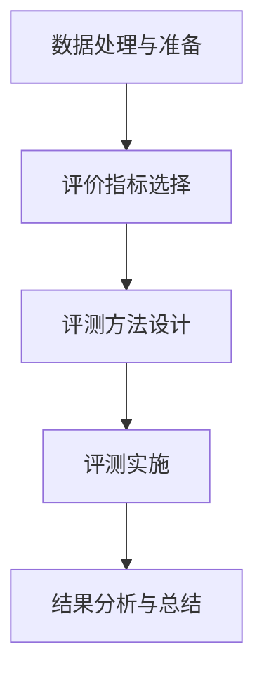

                 

### 文章标题：大模型评测的多角度思考能力测试

> 关键词：大模型评测、数据处理、评价指标、评测方法、案例分析、未来趋势

> 摘要：本文旨在通过多角度的分析，探讨大模型评测的关键要素和方法。从理论基础到实战应用，我们将逐步解析评测过程中的数据处理、评价指标、评测方法，并结合实际案例，总结评测中的挑战与未来发展趋势。本文适用于对大模型评测有深入理解需求的技术人员和研究学者。

### 引言

#### 大模型评测的概念与背景

大模型评测是指对大规模人工智能模型进行系统性、全面性的评估和测试。随着深度学习和人工智能技术的快速发展，大模型（如GPT-3、BERT等）的应用日益广泛，如何对这些模型进行科学、公正的评测成为一个亟待解决的问题。大模型评测不仅有助于评估模型性能，还能指导模型优化和未来发展方向。

#### 大模型评测的重要性

大模型评测的重要性体现在以下几个方面：

1. **性能评估**：通过评测，可以客观、公正地评估大模型在不同任务上的性能，为模型优化提供依据。
2. **比较与选择**：评测结果可以帮助研究者、企业等在不同模型之间进行比较和选择，从而选择最适合自身需求的模型。
3. **标准化**：大模型评测有助于制定统一的评测标准，提高评测的规范性和科学性。
4. **推广应用**：评测结果可以为模型的推广应用提供参考，推动人工智能技术在各个领域的应用。

#### 大模型评测的流程与核心环节

大模型评测的流程主要包括以下环节：

1. **数据处理与准备**：收集、预处理和清洗数据，为评测提供可靠的基础。
2. **评价指标选择**：根据任务特点，选择合适的评价指标。
3. **评测方法设计**：设计评测方法，包括基准测试、模型对比等。
4. **评测实施**：根据设计的方法，对模型进行评测。
5. **结果分析与总结**：分析评测结果，总结评测过程中的经验和问题。

图1-1展示了大模型评测的核心概念与联系：



#### 评测核心算法原理与伪代码

大模型评测的核心算法通常包括以下几个方面：

1. **数据处理**：包括数据清洗、归一化、特征提取等。
2. **评价指标计算**：如准确率、召回率、F1值等。
3. **模型对比**：通过交叉验证、A/B测试等方法，比较不同模型的性能。

以下是一个简单的伪代码示例，展示了数据处理和评价指标计算的基本流程：

```python
def evaluate_model(model, data):
    # 数据预处理
    processed_data = preprocess_data(data)
    
    # 模型预测
    predictions = model.predict(processed_data)
    
    # 计算评价指标
    accuracy = calculate_accuracy(predictions, data.labels)
    precision = calculate_precision(predictions, data.labels)
    recall = calculate_recall(predictions, data.labels)
    
    # 输出评测结果
    return accuracy, precision, recall
```

#### 大模型评测的数学模型与公式

在大模型评测中，常用的数学模型和公式包括：

1. **准确率（Accuracy）**：准确率是预测正确的样本数占总样本数的比例，公式如下：

   $$ Accuracy = \frac{TP + TN}{TP + TN + FP + FN} $$

   其中，TP为真阳性，TN为真阴性，FP为假阳性，FN为假阴性。

2. **召回率（Recall）**：召回率是预测正确的阳性样本数占总阳性样本数的比例，公式如下：

   $$ Recall = \frac{TP}{TP + FN} $$

3. **F1值（F1-score）**：F1值是精确率和召回率的调和平均，公式如下：

   $$ F1 = \frac{2 \times Precision \times Recall}{Precision + Recall} $$

   通过以上公式，可以量化模型在分类任务中的性能。

### 总结

本文从多个角度介绍了大模型评测的概念、背景、重要性、流程以及核心算法原理和数学模型。通过对这些内容的深入理解，读者可以更好地把握大模型评测的方法和技巧，为实际应用提供理论支持。接下来，我们将进一步探讨数据处理与准备、评价指标选择、评测方法设计等关键环节。

