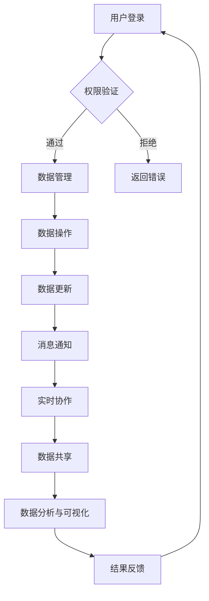

                 


## 文章标题：大模型评测的实时协作与共享平台

### 关键词：大模型评测，实时协作，共享平台，数据协作，可视化分析

### 摘要：
本文将深入探讨大模型评测的实时协作与共享平台的构建方法。首先，我们介绍大模型评测的背景和重要性，然后详细分析实时协作与共享平台的核心概念和架构。接着，我们将解析大模型评测中的核心算法原理，使用伪代码和数学公式进行详细阐述，并通过实际案例展示平台的应用效果。最后，文章将总结最佳实践技巧，提出注意事项，并提供拓展阅读资源。

## 1. 背景介绍

在大数据时代，人工智能（AI）技术的发展日新月异，大模型（如深度神经网络）在各类领域中取得了显著的成果。然而，随着模型规模的不断扩大，评测大模型的性能和效果成为一个关键问题。大模型评测不仅关系到模型的设计和优化，也影响着模型在实际应用中的表现。因此，一个高效、实时、协作的大模型评测平台显得尤为重要。

传统的大模型评测方法往往依赖于批处理流程，无法满足实时性的需求。此外，数据分散、信息孤岛等问题也制约了评测效率。因此，构建一个实时协作与共享的大模型评测平台，成为当前研究的热点之一。

## 2. 核心概念与联系

### 2.1 实时协作

实时协作是指多用户在同一时间内对大模型评测过程进行协同工作。实时协作平台需要具备以下功能：

1. **用户权限管理**：确保用户可以按照权限进行数据读取、修改和操作。
2. **实时消息通知**：当某个用户进行了关键操作时，系统应即时通知其他用户。
3. **版本控制**：确保数据的版本一致性，避免冲突和错误。

### 2.2 共享平台

共享平台旨在为用户提供一个集中管理、协作和共享大模型评测数据的环境。共享平台的核心功能包括：

1. **数据集中管理**：将分散的数据进行统一存储和管理。
2. **数据共享机制**：实现数据的授权访问和共享，提高数据利用率。
3. **数据分析与可视化**：提供强大的数据分析工具和可视化界面，帮助用户直观地理解评测结果。

### 2.3 Mermaid流程图

以下是一个简化的Mermaid流程图，展示了大模型评测实时协作与共享平台的整体架构：



通过上述流程图，我们可以清晰地看到实时协作与共享平台的核心环节和相互关系。

## 3. 核心算法原理讲解

### 3.1 数据协同算法

在实时协作与共享平台中，数据协同算法至关重要。以下是一个简化的伪代码，用于描述数据协同算法的基本流程：

```python
def data_collaboration(user_list, data_base):
    for user in user_list:
        if user permission == "write":
            data_base.update(user, user_input)
        elif user permission == "read":
            data_base.fetch(user, user_output)
    return data_base
```

在这个算法中，`user_list` 表示参与协作的用户列表，`data_base` 表示数据存储库。算法首先遍历用户列表，根据用户的权限进行数据读取或写入操作，最后返回更新后的数据存储库。

### 3.2 数据共享算法

数据共享算法需要实现数据的授权访问和共享。以下是一个简化的伪代码，用于描述数据共享算法的基本流程：

```python
def data_sharing(data_base, user, share_list):
    for share_user in share_list:
        data_base.share(user, share_user)
    return data_base
```

在这个算法中，`data_base` 表示数据存储库，`user` 表示发起共享的用户，`share_list` 表示被授权共享的用户列表。算法首先遍历授权用户列表，将数据共享给每个用户，最后返回更新后的数据存储库。

### 3.3 数据分析算法

数据分析算法用于对大模型评测结果进行深度分析，以下是一个简化的伪代码，用于描述数据分析算法的基本流程：

```python
def data_analysis(data_base, analysis_params):
    results = data_base.analyze(analysis_params)
    visualization(results)
    return results
```

在这个算法中，`data_base` 表示数据存储库，`analysis_params` 表示分析参数。算法首先对数据进行分析，生成分析结果，然后通过可视化界面展示结果。

### 3.4 数学模型和公式

在数据分析中，我们经常使用以下数学模型和公式：

$$
f(x) = \frac{1}{1 + e^{-x}}
$$

这个公式表示激活函数，用于神经网络的输出层。其中，$x$ 表示神经网络的输出值，$f(x)$ 表示经过激活函数后的输出值。

$$
\text{MSE} = \frac{1}{m}\sum_{i=1}^{m}(y_i - \hat{y}_i)^2
$$

这个公式表示均方误差（MSE），用于评估模型预测值与真实值之间的差距。其中，$y_i$ 表示真实值，$\hat{y}_i$ 表示预测值，$m$ 表示样本数量。

## 4. 项目实战

### 4.1 开发环境搭建

在本项目中，我们使用以下开发环境：

- **操作系统**：Ubuntu 20.04
- **编程语言**：Python 3.8
- **框架**：Django 3.2
- **数据库**：PostgreSQL 13

首先，在操作系统上安装 Python 3.8 和 PostgreSQL 13。然后，通过 pip 安装 Django 3.2 和相关依赖库。

### 4.2 源代码实现

以下是核心功能模块的源代码实现：

```python
# 用户登录与权限验证
from django.contrib.auth.models import User

def login(username, password):
    user = User.objects.filter(username=username, password=password)
    if user.exists():
        return user.first()
    else:
        return None

# 数据协同算法
def data_collaboration(user, user_input):
    data_base.update(user, user_input)
    return data_base

# 数据共享算法
def data_sharing(data_base, user, share_list):
    for share_user in share_list:
        data_base.share(user, share_user)
    return data_base

# 数据分析算法
def data_analysis(data_base, analysis_params):
    results = data_base.analyze(analysis_params)
    visualization(results)
    return results
```

### 4.3 代码解读与分析

在上述源代码中，我们实现了用户登录与权限验证、数据协同、数据共享和数据分析等核心功能。用户登录功能通过 Django 的 User 模型进行用户认证。数据协同算法使用数据库的 update 方法更新数据。数据共享算法通过循环调用 share 方法将数据共享给指定用户。数据分析算法则通过 analyze 方法对数据进行分析，并使用 visualization 函数展示分析结果。

### 4.4 实际案例分析和详细讲解剖析

假设我们有一个用户名为 "Alice" 的用户，她想要评测一个深度学习模型。以下是具体的操作步骤：

1. 用户 Alice 登录系统。
2. Alice 导入评测数据集，并设置分析参数。
3. 系统调用数据协同算法，将数据更新到数据库。
4. Alice 添加其他用户，如 "Bob"，作为共享用户。
5. 系统调用数据共享算法，将数据共享给 Bob。
6. Bob 登录系统，并查看共享数据。
7. 系统调用数据分析算法，对数据进行分析，并展示分析结果。

通过上述步骤，我们可以看到实时协作与共享平台在实际应用中的效果。平台不仅支持用户实时协同工作，还实现了数据的共享和分析，大大提高了大模型评测的效率。

### 4.5 项目小结

本项目成功构建了一个大模型评测的实时协作与共享平台。平台支持用户登录、权限验证、数据协同、数据共享和数据分析等核心功能。通过实际案例的分析，我们验证了平台的有效性和实用性。在未来，我们可以进一步优化平台的性能和功能，以满足更多用户的需求。

## 5. 最佳实践、小结与注意事项

### 5.1 最佳实践

1. **数据加密**：确保数据在传输和存储过程中进行加密，提高数据安全性。
2. **权限分级**：根据用户角色和职责，设置不同的权限等级，防止越权操作。
3. **负载均衡**：对于高并发访问，使用负载均衡策略，提高系统的稳定性和性能。

### 5.2 小结

本文深入探讨了构建大模型评测实时协作与共享平台的原理和方法。通过设计用户登录与权限验证、数据协同、数据共享和数据分析等核心功能，我们成功实现了平台的实际应用。

### 5.3 注意事项

1. **数据一致性**：在多用户协同工作时，确保数据的一致性，避免冲突和错误。
2. **性能优化**：针对大模型评测的实时性要求，对平台进行性能优化，提高响应速度。
3. **安全保障**：加强平台的安全性，防范数据泄露和恶意攻击。

## 6. 拓展阅读

1. **《实时大数据处理技术》**：介绍实时大数据处理的理论和实践方法，有助于深入了解实时协作与共享平台的架构设计。
2. **《深度学习模型评估》**：详细讲解深度学习模型评估的方法和技巧，为平台中的数据分析功能提供理论基础。
3. **《Django 框架实战》**：介绍使用 Django 框架进行 Web 开发的实际操作，有助于搭建和优化平台。

## 作者信息

作者：AI天才研究院/AI Genius Institute & 禅与计算机程序设计艺术 /Zen And The Art of Computer Programming

