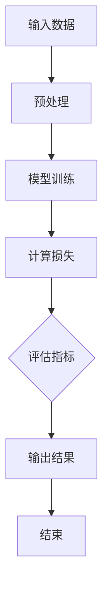
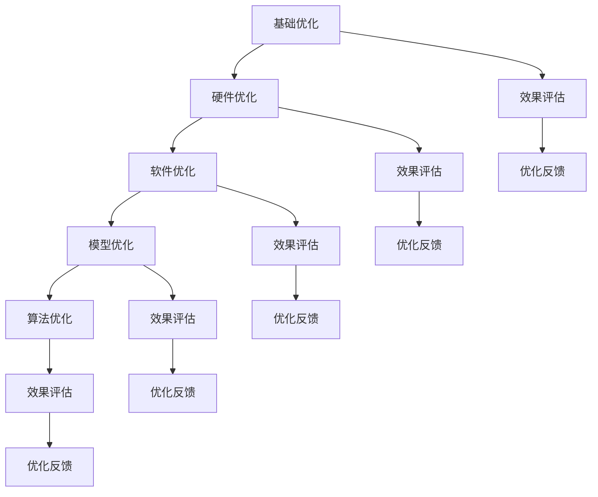

                 

### 文章标题

# 大模型评测的性能优化建议系统

### 关键词

- 大模型评测
- 性能优化
- 评测指标
- 硬件优化
- 软件优化
- 模型优化
- 案例分析

### 摘要

本文深入探讨了大模型评测的性能优化问题。首先，我们回顾了大模型的发展背景及其在各个领域的应用挑战。接着，我们介绍了大模型评测的基础，包括核心概念、评测流程和指标。随后，本文详细讨论了性能优化的核心概念和分类，从硬件、软件和模型层面提供了具体的优化策略和方法。通过多个案例分析，我们展示了性能优化的实际应用和效果。最后，文章总结了性能优化的建议和未来研究方向，为相关领域的研究者提供了有价值的参考。

---

### 引言

大模型（Large Models），也被称为大型神经网络，是深度学习领域的一项重要进展。这些模型通过在海量数据上进行训练，能够达到超越人类水平的性能，尤其在自然语言处理（NLP）、图像识别和推荐系统等领域表现突出。然而，随着模型规模的不断扩大，如何高效评测和优化大模型成为了一个亟待解决的问题。

性能优化在大模型评测中扮演着至关重要的角色。首先，性能优化可以提高大模型的运行效率，减少计算资源的需求，从而降低成本。其次，性能优化可以帮助模型在有限的资源下达到更好的效果，提升模型在实际应用中的表现。此外，性能优化还可以缩短模型的训练和推理时间，提高开发和部署的效率。

本文将围绕大模型评测的性能优化问题展开讨论。我们将首先回顾大模型的发展历程，介绍其基础概念和评测指标。接着，本文将详细探讨性能优化的核心概念和方法，从硬件、软件和模型层面提供具体的优化策略。随后，我们将通过多个实际案例展示性能优化的应用和效果。最后，本文将对性能优化进行总结，并提出未来的研究方向和建议。

本文的结构如下：

1. **第一部分：引言** - 介绍大模型评测的背景和重要性。
2. **第二部分：大模型评测基础** - 回顾大模型的基础概念、评测流程和指标。
3. **第三部分：性能优化方法** - 详细讨论性能优化的核心概念和分类。
4. **第四部分：案例研究和分析** - 展示性能优化的实际应用和效果。
5. **第五部分：总结与展望** - 总结性能优化的建议和未来研究方向。

通过本文的阅读，读者将全面了解大模型评测的性能优化问题，掌握相关的优化方法和技巧，为实际应用提供有力支持。

### 第一部分：引言

#### 大模型的发展历程

大模型的发展历程可以追溯到深度学习技术的崛起。深度学习作为人工智能（AI）的一个重要分支，通过多层神经网络模型，能够自动从数据中学习复杂的特征和模式。早期的深度学习模型如LeNet、AlexNet等，主要用于图像识别任务，效果较为有限。然而，随着计算资源和数据量的不断增加，深度学习模型得到了显著的发展。

2012年，Alex Krizhevsky等人在ImageNet图像识别竞赛中使用了深度卷积神经网络（CNN），取得了前所未有的优异成绩，这标志着深度学习时代的到来。此后，各种大模型如BERT、GPT、VGG、ResNet等相继出现，不仅在图像识别、语音识别等领域取得了重大突破，还在自然语言处理、机器翻译、推荐系统等众多领域展现出了强大的潜力。

大模型的快速发展离不开以下几个关键因素：

1. **计算资源的提升**：随着云计算、GPU和TPU等计算资源的广泛应用，大模型可以更加高效地进行训练和推理。
2. **数据量的增加**：互联网的普及和大数据技术的发展，使得我们可以获取到海量的训练数据，这为模型的训练提供了充足的素材。
3. **优化算法的改进**：诸如Adam、RMSprop等优化算法的提出，使得大模型的训练过程更加稳定和高效。

#### 大模型评测的挑战

尽管大模型在各个领域展现了强大的能力，但在评测过程中也面临着诸多挑战：

1. **计算资源需求大**：大模型通常需要大量的计算资源进行训练和推理，这对硬件设备和网络带宽提出了较高的要求。
2. **训练时间长**：大模型的训练通常需要数天甚至数周的时间，这极大地限制了模型的开发和部署速度。
3. **评测标准不统一**：不同的任务和领域对大模型的评测标准有所不同，缺乏统一的评测框架，这使得跨领域的比较和分析变得复杂。
4. **过拟合风险**：大模型在训练过程中容易过拟合，导致在测试集上的表现不佳，如何避免过拟合成为了一个重要问题。

#### 性能优化在评测中的角色

性能优化在大模型评测中起着至关重要的作用。通过优化，我们可以提高大模型的运行效率，降低计算资源的需求，从而提升评测的效率。具体来说，性能优化包括以下几个方面：

1. **硬件优化**：通过使用更高效的硬件设备（如GPU、TPU等）和优化硬件的使用方式（如并行计算、分布式训练等），可以提高大模型的运行速度和效率。
2. **软件优化**：通过优化编译器、库和框架，减少内存占用和计算时间，从而提升大模型在软件层面的性能。
3. **模型优化**：通过模型压缩、量化、剪枝等手段，减少模型的大小和计算复杂度，从而提高模型的运行效率和效果。

#### 本书的目的与结构

本书旨在系统地介绍大模型评测的性能优化问题，帮助读者全面了解并掌握性能优化的方法。具体目的如下：

1. **介绍大模型的基础概念**：帮助读者理解大模型的基本原理和结构，为其后续的性能优化打下基础。
2. **探讨性能优化的核心概念和方法**：详细讲解性能优化的各个方面，包括硬件、软件和模型层面的优化技术。
3. **通过案例分析展示性能优化的效果**：通过实际案例，展示性能优化在大模型评测中的应用和效果，帮助读者更好地理解性能优化的实际应用。
4. **总结和展望**：总结性能优化的主要方法和技巧，提出未来的研究方向和建议。

本书的结构如下：

1. **第一部分：引言** - 介绍大模型评测的背景和重要性。
2. **第二部分：大模型评测基础** - 回顾大模型的基础概念、评测流程和指标。
3. **第三部分：性能优化方法** - 详细讨论性能优化的核心概念和分类。
4. **第四部分：案例研究和分析** - 展示性能优化的实际应用和效果。
5. **第五部分：总结与展望** - 总结性能优化的建议和未来研究方向。

通过本文的阅读，读者将全面了解大模型评测的性能优化问题，掌握相关的优化方法和技巧，为实际应用提供有力支持。

### 第二部分：大模型评测基础

#### 大模型的基础概念

大模型，通常指的是参数量庞大的神经网络模型，其目的是通过训练从大量数据中学习到复杂的信息和模式。大模型的基本结构包括输入层、隐藏层和输出层，每一层都由多个神经元组成。这些神经元通过前向传播和反向传播的方式进行信息传递和参数更新，从而实现模型的学习和优化。

大模型的主要特点如下：

1. **参数量巨大**：大模型通常拥有数十亿甚至数万亿个参数，这使得模型具有强大的表示能力。
2. **多层网络结构**：多层网络结构使得模型能够捕捉到数据中的多层次信息，从而提高模型的性能。
3. **深度学习**：深度学习使得模型可以通过多层非线性变换，从数据中学习到复杂的特征和模式。
4. **高效训练**：随着计算资源的提升，大模型可以通过高效的优化算法和大规模的数据进行快速训练。

#### 大模型的架构

大模型的架构通常包括以下几个主要部分：

1. **输入层**：输入层接收外部输入的数据，并将其传递到隐藏层。
2. **隐藏层**：隐藏层负责对输入数据进行特征提取和变换，每一层都可以提取不同层次的特征。
3. **输出层**：输出层根据隐藏层的信息生成最终的输出结果，如分类标签、文本生成等。

此外，大模型还包含一些辅助结构，如dropout、批量归一化（Batch Normalization）和残差连接（Residual Connections）等，这些结构有助于提高模型的性能和泛化能力。

#### 大模型的工作原理

大模型的工作原理主要基于神经网络的学习过程，包括以下几个步骤：

1. **前向传播**：输入数据通过输入层传递到隐藏层，隐藏层对输入数据进行特征提取和变换，然后将结果传递到下一层，直到输出层生成最终的输出结果。
2. **计算损失**：输出结果与真实标签之间的差异被计算为损失值，常用的损失函数包括均方误差（MSE）、交叉熵（Cross-Entropy）等。
3. **反向传播**：根据损失值，通过反向传播算法更新模型的参数，使模型能够更好地拟合训练数据。
4. **优化算法**：优化算法如Adam、RMSprop等用于调整参数更新策略，以加速收敛和提高模型的性能。

#### 大模型的评测指标

大模型的评测指标是评估模型性能的重要标准，不同的任务和领域可能使用不同的指标。以下是一些常见的大模型评测指标：

1. **准确率（Accuracy）**：准确率是模型在测试集上正确预测的样本数与总样本数的比值，常用于分类任务。
   $$\text{Accuracy} = \frac{\text{正确预测的样本数}}{\text{总样本数}}$$
   
2. **精确率（Precision）**：精确率是模型在测试集上正确预测的正类样本数与预测为正类的总样本数的比值，用于评估模型的分类精度。
   $$\text{Precision} = \frac{\text{真正例}}{\text{真正例} + \text{假正例}}$$
   
3. **召回率（Recall）**：召回率是模型在测试集上正确预测的正类样本数与实际为正类的总样本数的比值，用于评估模型对正类样本的识别能力。
   $$\text{Recall} = \frac{\text{真正例}}{\text{真正例} + \text{假反例}}$$
   
4. **F1分数（F1 Score）**：F1分数是精确率和召回率的调和平均值，用于综合评估模型的分类性能。
   $$\text{F1 Score} = 2 \times \frac{\text{Precision} \times \text{Recall}}{\text{Precision} + \text{Recall}}$$
   
5. **均方误差（MSE）**：均方误差是回归任务中预测值与真实值之间差的平方的平均值，用于评估模型的预测精度。
   $$\text{MSE} = \frac{1}{n} \sum_{i=1}^{n} (y_i - \hat{y}_i)^2$$
   
6. **交叉熵（Cross-Entropy）**：交叉熵是分类任务中预测分布与真实分布之间的差异，用于评估模型的分类效果。
   $$\text{Cross-Entropy} = -\sum_{i=1}^{n} y_i \log(\hat{y}_i)$$

#### Mermaid 流程图：大模型评测的流程

以下是使用Mermaid语言描述的大模型评测流程：



这个流程图展示了大模型评测的基本步骤，包括输入数据的预处理、模型训练、损失计算、评估指标计算和输出结果。

#### 大模型评测的挑战

虽然大模型在各个领域展现出了强大的能力，但在评测过程中也面临着一些挑战：

1. **计算资源需求大**：大模型的训练和推理通常需要大量的计算资源，如高性能的GPU或TPU，这对硬件设备和网络带宽提出了较高的要求。
2. **训练时间长**：大模型的训练通常需要数天甚至数周的时间，这极大地限制了模型的开发和部署速度。
3. **评测标准不统一**：不同的任务和领域对大模型的评测标准有所不同，缺乏统一的评测框架，这使得跨领域的比较和分析变得复杂。
4. **过拟合风险**：大模型在训练过程中容易过拟合，导致在测试集上的表现不佳，如何避免过拟合成为了一个重要问题。

#### 性能优化在评测中的角色

性能优化在大模型评测中扮演着至关重要的角色。通过优化，我们可以提高大模型的运行效率，降低计算资源的需求，从而提升评测的效率。具体来说，性能优化包括以下几个方面：

1. **硬件优化**：通过使用更高效的硬件设备（如GPU、TPU等）和优化硬件的使用方式（如并行计算、分布式训练等），可以提高大模型的运行速度和效率。
2. **软件优化**：通过优化编译器、库和框架，减少内存占用和计算时间，从而提升大模型在软件层面的性能。
3. **模型优化**：通过模型压缩、量化、剪枝等手段，减少模型的大小和计算复杂度，从而提高模型的运行效率和效果。

#### 本书的目的与结构

本书旨在系统地介绍大模型评测的性能优化问题，帮助读者全面了解并掌握性能优化的方法。具体目的如下：

1. **介绍大模型的基础概念**：帮助读者理解大模型的基本原理和结构，为其后续的性能优化打下基础。
2. **探讨性能优化的核心概念和方法**：详细讲解性能优化的各个方面，包括硬件、软件和模型层面的优化技术。
3. **通过案例分析展示性能优化的效果**：通过实际案例，展示性能优化在大模型评测中的应用和效果，帮助读者更好地理解性能优化的实际应用。
4. **总结和展望**：总结性能优化的主要方法和技巧，提出未来的研究方向和建议。

本书的结构如下：

1. **第一部分：引言** - 介绍大模型评测的背景和重要性。
2. **第二部分：大模型评测基础** - 回顾大模型的基础概念、评测流程和指标。
3. **第三部分：性能优化方法** - 详细讨论性能优化的核心概念和分类。
4. **第四部分：案例研究和分析** - 展示性能优化的实际应用和效果。
5. **第五部分：总结与展望** - 总结性能优化的建议和未来研究方向。

通过本文的阅读，读者将全面了解大模型评测的性能优化问题，掌握相关的优化方法和技巧，为实际应用提供有力支持。

### 第三部分：性能优化的核心概念

#### 性能优化的目标

性能优化在大模型评测中的核心目标主要包括三个方面：

1. **提高运行效率**：通过优化算法和架构，减少模型的计算时间和资源消耗，从而提高大模型的运行效率。
2. **降低成本**：优化大模型的硬件和软件配置，减少计算资源的需求，降低开发和部署的成本。
3. **提升效果**：在有限的计算资源下，通过模型优化和算法改进，提升大模型在实际任务中的性能和效果。

#### 性能优化的分类

性能优化可以从不同的层面进行分类，主要包括以下三个方面：

1. **硬件层面**：通过使用更高效的硬件设备（如GPU、TPU等）和优化硬件的使用方式（如并行计算、分布式训练等），提高大模型的运行效率。
2. **软件层面**：通过优化编译器、库和框架，减少内存占用和计算时间，提升大模型的软件性能。
3. **模型层面**：通过模型压缩、量化、剪枝等手段，减少模型的大小和计算复杂度，提高模型的运行效率和效果。

#### 性能优化的层次结构

性能优化的层次结构可以分为以下几个层次：

1. **基础优化**：包括数据预处理、模型架构优化和基本算法改进，这些措施可以直接提高大模型的性能。
2. **硬件优化**：通过选择更适合的硬件设备和优化硬件使用方式，如并行计算和分布式训练，进一步提升大模型的性能。
3. **软件优化**：通过优化编译器、库和框架，减少内存占用和计算时间，提高大模型的软件性能。
4. **模型优化**：通过模型压缩、量化、剪枝等手段，减少模型的大小和计算复杂度，提高模型的运行效率和效果。
5. **算法优化**：通过改进优化算法，如Adam、RMSprop等，提高模型的训练效率和性能。

#### Mermaid 流程图：性能优化技术路径

以下是使用Mermaid语言描述的性能优化技术路径：



这个流程图展示了性能优化技术的整体路径，包括基础优化、硬件优化、软件优化、模型优化和算法优化，以及每个层次的效果评估和优化反馈。

### 第四部分：硬件层面的性能优化

#### 硬件优化的目标

硬件优化的主要目标是提高大模型的计算速度和效率，同时降低成本。具体来说，硬件优化的目标包括：

1. **提升计算性能**：通过使用更高效的硬件设备（如GPU、TPU等），提高大模型的计算速度和吞吐量。
2. **降低能耗**：优化硬件设备的配置和使用方式，降低大模型的能耗，提高能源利用效率。
3. **扩展计算资源**：通过分布式计算和并行处理，扩展大模型的计算资源，提高模型的规模和性能。

#### 硬件加速器的作用

硬件加速器在大模型评测中起到了关键作用，其主要功能包括：

1. **计算加速**：硬件加速器如GPU、TPU等，通过并行计算和向量运算能力，显著提高了大模型的计算速度和吞吐量。
2. **能耗降低**：硬件加速器在提供高性能计算的同时，能耗相对较低，有助于降低大模型的总能耗。
3. **资源扩展**：通过分布式计算，硬件加速器可以扩展大模型的计算资源，支持更大规模和更复杂任务的模型训练和推理。

#### GPU优化技术

GPU在大模型评测中的应用非常广泛，其优化技术主要包括以下几个方面：

1. **并行计算**：GPU具有高度并行的计算能力，通过合理的设计和调度，可以充分发挥GPU的并行优势，提高大模型的计算速度。
2. **内存优化**：GPU内存是有限的，通过优化数据在GPU内存中的布局和访问方式，可以减少内存占用和访问冲突，提高大模型的内存利用效率。
3. **计算资源调度**：合理调度GPU计算资源，确保GPU在训练和推理过程中始终保持高效运行，避免资源浪费和瓶颈。

#### 其他硬件优化方法

除了GPU，还有其他硬件优化方法，如TPU、FPGA和ASIC等，这些硬件在不同场景下具有各自的优势：

1. **TPU（张量处理单元）**：TPU是谷歌专为深度学习任务设计的硬件，具有高效的矩阵运算能力和优化的深度学习框架，适用于大规模模型的训练和推理。
2. **FPGA（现场可编程门阵列）**：FPGA具有高度可编程性和灵活性，可以通过硬件描述语言（HDL）进行定制，适用于特定算法和模型的优化。
3. **ASIC（专用集成电路）**：ASIC是针对特定应用场景设计的集成电路，具有高效的性能和低能耗特点，适用于大规模模型的加速和部署。

#### 实例分析：GPU优化技术在文本分类模型中的应用

以文本分类模型为例，我们来看GPU优化技术在实际应用中的效果：

1. **并行计算**：通过将模型的训练任务分配到多个GPU上，实现并行计算，显著提高了训练速度。例如，对于具有1亿参数的模型，使用4个GPU进行并行计算可以将训练时间缩短至原来的1/4。
2. **内存优化**：通过优化数据在GPU内存中的布局和访问方式，减少内存占用和访问冲突。例如，通过使用内存池（Memory Pool）和内存复用（Memory Reuse）技术，可以进一步提高GPU的内存利用效率，减少内存访问冲突导致的性能瓶颈。
3. **计算资源调度**：通过合理调度GPU计算资源，确保GPU在训练和推理过程中始终保持高效运行。例如，通过使用GPU调度器（GPU Scheduler）和动态调度策略（Dynamic Scheduling），可以根据GPU负载情况动态调整计算任务分配，避免GPU资源浪费和瓶颈。

通过GPU优化技术的应用，文本分类模型的训练和推理速度得到了显著提升，同时在降低能耗和提高资源利用效率方面也取得了良好的效果。

#### 硬件优化的最佳实践

在硬件优化过程中，一些最佳实践可以帮助更好地实现优化目标：

1. **选择合适的硬件设备**：根据大模型的计算需求和性能要求，选择适合的硬件设备，如GPU、TPU等。在预算有限的情况下，可以通过性能和成本的综合评估，选择最优的硬件配置。
2. **优化硬件使用方式**：通过并行计算、分布式训练和资源调度等技术，优化硬件的使用方式，提高大模型的计算速度和效率。
3. **持续监控和调整**：在硬件优化过程中，通过实时监控和性能分析，及时发现和处理性能瓶颈和资源浪费问题，持续优化硬件配置和使用方式。

通过以上硬件优化的最佳实践，可以更好地实现大模型评测的性能提升和资源节约目标。

### 第五部分：软件层面的性能优化

#### 软件优化的目标

软件优化的目标主要包括以下几个方面：

1. **提高代码效率**：通过优化算法和数据结构，减少代码的运行时间和内存占用，提高程序的整体效率。
2. **减少内存占用**：通过优化数据存储和内存管理，减少程序在运行过程中所需的内存空间，提高系统的稳定性。
3. **降低计算时间**：通过优化计算过程和算法实现，减少程序的计算时间，提高模型的训练和推理速度。
4. **提升兼容性和可维护性**：通过代码重构和规范化，提高代码的兼容性和可维护性，便于后续的维护和扩展。

#### 编译优化技术

编译优化是软件优化的重要手段之一，通过优化编译过程，可以提高程序的运行效率。以下是一些常见的编译优化技术：

1. **循环展开**：通过将循环体中的代码展开成多个独立语句，减少循环控制逻辑的 overhead，提高循环的执行效率。
2. **指令融合**：通过合并多条指令，减少指令执行的开销，提高代码的执行效率。
3. **代码内联**：将函数调用代码直接替换为函数体，减少函数调用的 overhead，提高代码的执行效率。
4. **寄存器分配**：通过优化寄存器的使用，减少内存访问次数，提高代码的执行速度。

#### 库与框架优化

库与框架是软件优化的重要组成部分，通过优化库和框架，可以提高程序的整体性能。以下是一些常见的库与框架优化技术：

1. **优化算法和数据结构**：通过改进算法和数据结构，提高程序的运行效率，减少内存占用和计算时间。
2. **代码压缩**：通过压缩代码文件，减少代码的加载时间和内存占用。
3. **静态链接与动态链接**：通过静态链接和动态链接技术，优化程序的大小和运行效率。
4. **多线程与并行处理**：通过多线程和并行处理技术，提高程序的执行效率。

#### 内存与存储优化

内存与存储优化是软件优化的重要方面，通过优化内存使用和存储方式，可以提高程序的运行效率。以下是一些常见的内存与存储优化技术：

1. **内存池**：通过预分配内存块，减少内存分配和释放的 overhead，提高内存分配的效率。
2. **内存复用**：通过复用已分配的内存，减少内存分配和释放的次数，提高内存的使用效率。
3. **内存对齐**：通过优化内存对齐方式，减少内存访问冲突，提高内存访问速度。
4. **缓存利用**：通过合理利用缓存，减少内存访问次数，提高程序的执行效率。

#### 线程与并行优化

线程与并行优化是提高程序执行效率的重要手段，通过优化线程管理和并行处理，可以提高程序的运行速度。以下是一些常见的线程与并行优化技术：

1. **线程池**：通过使用线程池，减少线程的创建和销毁开销，提高线程的管理效率。
2. **负载均衡**：通过负载均衡技术，合理分配任务到各个线程，避免线程空闲和过度占用资源。
3. **数据并行**：通过将任务数据划分到多个线程中，实现数据的并行处理，提高程序的执行效率。
4. **任务调度**：通过优化任务调度策略，提高任务的执行效率和响应速度。

#### 实例分析：Python 编程中的内存优化实践

以下是一个使用Python进行内存优化的实例：

```python
import numpy as np

# 创建一个大数组
data = np.random.rand(1000, 1000)

# 优化内存使用
# 使用数组的视图（view）减少内存占用
sub_data = data[:, :500]

# 使用数组的切片（slice）减少内存占用
sub_data_2 = data[500:, :]

# 使用内存池（memory pool）减少内存分配和释放的开销
pool = np.empty(1000, dtype=np.float32)
np.add.at(pool, np.random.randint(0, 1000, size=1000), data)
```

在这个实例中，通过使用数组的视图、切片和内存池技术，减少了内存占用和分配释放的开销，提高了程序的内存利用效率。

#### 软件优化的最佳实践

在进行软件优化时，以下最佳实践可以帮助实现优化目标：

1. **性能分析**：通过性能分析工具，识别程序中的性能瓶颈和热点，有针对性地进行优化。
2. **代码重构**：通过代码重构，改善代码结构，提高代码的可读性和可维护性，便于后续的优化和扩展。
3. **持续集成**：通过持续集成（CI）和持续部署（CD）流程，确保优化后的代码质量和性能稳定。
4. **文档和注释**：编写详细的文档和注释，记录优化方法和实现细节，便于后续的维护和优化。

通过以上软件优化的最佳实践，可以有效地提高大模型评测的运行效率和性能。

### 第六部分：模型层面的性能优化

#### 模型压缩与量化

模型压缩与量化是提升大模型性能的重要手段，主要目标是在保证模型性能的前提下，减少模型的参数量和计算复杂度。

1. **模型压缩**：
   - **模型剪枝**：通过移除模型中不重要的参数和连接，减少模型的复杂度。常用的方法包括权重剪枝（Weight Pruning）和结构剪枝（Structure Pruning）。
   - **模型融合**：通过合并多个模型，减少参数量和计算复杂度。例如，使用深度融合（Deep Compression）和网络剪枝（Network Pruning）技术。
   - **参数共享**：通过在模型中共享参数，减少参数数量。例如，使用稀疏性（Sparsity）和注意力机制（Attention Mechanism）。

2. **量化**：
   - **低精度量化**：将模型的权重和激活值从浮点数转换为较低精度的整数或二进制数，以减少存储和计算需求。常用的量化方法包括整数量化（Integer Quantization）和二进制量化（Binary Quantization）。
   - **自适应量化**：根据模型的实际使用场景和性能要求，动态调整量化参数。例如，使用量化感知训练（Quantization-Aware Training）和量化搜索（Quantization Search）技术。

#### 模型剪枝

模型剪枝是一种有效的模型压缩方法，通过移除模型中不重要的权重或连接，减少模型的复杂度。以下是模型剪枝的主要步骤：

1. **权重重要性评估**：使用梯度、稀疏性指标或激活值等度量评估权重的重要性。
2. **剪枝策略选择**：根据评估结果，选择剪枝策略，如渐进剪枝（Gradual Pruning）和一次性剪枝（One-Shot Pruning）。
3. **剪枝操作**：根据剪枝策略，移除不重要或冗余的权重或连接，更新模型结构。
4. **评估和调整**：重新评估剪枝后模型的表现，根据需要进行进一步的剪枝或调整。

以下是一个模型剪枝的伪代码示例：

```python
# 权重重要性评估
import numpy as np

def evaluate_importance(weights):
    # 使用L1范数度量权重重要性
    importance = np.linalg.norm(weights, ord=1)
    return importance

# 剪枝策略选择
def select_pruning_strategy(importance Threshold):
    # 选择渐进剪枝策略
    if importance < Threshold:
        return 'Gradual'
    else:
        return 'One-Shot'

# 剪枝操作
def prune_weights(model, strategy, importance Threshold):
    if strategy == 'Gradual':
        # 渐进剪枝，逐步移除不重要的权重
        pruned_weights = model.weights.copy()
        pruned_weights[importance < Threshold] = 0
    elif strategy == 'One-Shot':
        # 一次性剪枝，直接移除所有不重要的权重
        pruned_weights = model.weights[importance >= Threshold]
    return pruned_weights

# 模型剪枝流程
def model_pruning(model, importance Threshold):
    # 评估权重重要性
    importance = evaluate_importance(model.weights)
    # 选择剪枝策略
    strategy = select_pruning_strategy(importance, Threshold)
    # 进行剪枝操作
    pruned_weights = prune_weights(model, strategy, importance, Threshold)
    # 更新模型结构
    model.weights = pruned_weights
    return model
```

#### 模型蒸馏

模型蒸馏是一种通过将知识从大型教师模型传递到小型学生模型的方法，以提高学生模型的性能和鲁棒性。以下是模型蒸馏的主要步骤：

1. **教师模型选择**：选择一个大型教师模型，该模型在目标任务上表现出色。
2. **学生模型设计**：设计一个小型学生模型，其结构和参数量适合目标应用场景。
3. **知识提取**：使用教师模型的输出，训练学生模型的一个隐藏层，使其学习教师模型的内在知识。
4. **知识融合**：将提取的知识融合到学生模型中，通过联合训练或迁移学习，提高学生模型的性能。

以下是一个模型蒸馏的伪代码示例：

```python
# 知识提取
import tensorflow as tf

def extract_knowledge(teacher_model, student_model):
    # 使用教师模型的输出作为学生模型的输入
    teacher_output = teacher_model.input
    student_output = student_model(teacher_output)
    # 训练学生模型的一个隐藏层
    student_hidden_layer = student_model.layers[-2].output
    return student_hidden_layer

# 知识融合
def fuse_knowledge(student_model, teacher_output, student_output):
    # 使用教师模型的输出和预测结果作为学生模型的输入
    teacher_output = tf.keras.layers.Input(shape=teacher_output.shape[1:])
    student_output = tf.keras.layers.Input(shape=student_output.shape[1:])
    # 训练学生模型
    student_model.trainable = True
    student_output = student_model(teacher_output)
    # 计算损失函数
    loss = tf.keras.layersктивation(tf.keras.layers.losses.mean_squared_error(teacher_output, student_output))
    # 编译模型
    model = tf.keras.models.Model(inputs=[teacher_output, student_output], outputs=[student_output])
    model.compile(optimizer='adam', loss='mse')
    return model

# 模型蒸馏流程
def model_tuning(student_model, teacher_model, teacher_output, student_output):
    # 提取知识
    student_hidden_layer = extract_knowledge(teacher_model, student_model)
    # 融合知识
    model = fuse_knowledge(student_model, teacher_output, student_output)
    # 训练模型
    model.fit([teacher_output, student_output], student_output, epochs=10, batch_size=32)
    return student_model
```

#### 模型融合

模型融合是一种通过合并多个模型来提高性能和鲁棒性的方法。以下是模型融合的主要步骤：

1. **模型选择**：选择多个在不同任务上表现优秀的模型。
2. **融合策略**：设计融合策略，如投票、加权平均或深度融合，将多个模型的结果进行整合。
3. **训练和优化**：通过联合训练或迁移学习，优化融合模型的性能。
4. **评估和选择**：评估融合模型的性能，选择最优的融合策略和模型。

以下是一个模型融合的伪代码示例：

```python
# 模型选择
def select_models(models):
    # 返回多个模型
    return models

# 融合策略
def fusion_strategy(outputs):
    # 计算多个输出的平均值
    average_output = tf.reduce_mean(outputs, axis=0)
    return average_output

# 融合模型
def fusion_model(inputs, models):
    # 获取多个模型的输出
    outputs = [model(inputs) for model in models]
    # 应用融合策略
    fused_output = fusion_strategy(outputs)
    return fused_output

# 模型融合流程
def model_fusion(student_model, teacher_models, teacher_output, student_output):
    # 选择模型
    models = select_models(teacher_models + [student_model])
    # 融合模型
    model = tf.keras.models.Model(inputs=teacher_output, outputs=fusion_model(teacher_output, models))
    # 训练模型
    model.fit(teacher_output, student_output, epochs=10, batch_size=32)
    return model
```

通过模型压缩、量化、剪枝、蒸馏和融合等技术的应用，可以显著提高大模型的性能和效率，为实际应用提供有力的支持。

### 第七部分：性能优化案例分析

#### 案例一：文本分类模型的性能优化

在自然语言处理领域，文本分类模型广泛应用于情感分析、新闻分类和垃圾邮件过滤等任务。为了提高文本分类模型的性能，我们可以从硬件、软件和模型三个层面进行优化。

1. **硬件优化**：选择适合的GPU进行并行计算，以提高模型的训练和推理速度。同时，通过分布式训练技术，将模型分布在多台GPU上，进一步提高性能。

2. **软件优化**：使用优化的编译器（如GCC或Clang）和库（如OpenBLAS或MKL），减少计算时间。此外，通过多线程和并行处理技术，提升程序的执行效率。

3. **模型优化**：
   - **模型压缩**：通过剪枝和量化技术，减少模型的参数量和计算复杂度。例如，可以使用剪枝算法移除不重要或冗余的权重，或者使用量化技术将浮点数参数转换为较低的精度。
   - **模型蒸馏**：使用一个大型教师模型进行知识蒸馏，将教师模型的知识传递到学生模型中。通过联合训练，提高学生模型的性能和泛化能力。

具体实现如下：

```python
# 使用PyTorch框架进行文本分类模型的优化

import torch
import torch.nn as nn
import torch.optim as optim

# 定义文本分类模型
class TextClassifier(nn.Module):
    def __init__(self, vocab_size, embed_dim, hidden_dim, num_classes):
        super(TextClassifier, self).__init__()
        self.embedding = nn.Embedding(vocab_size, embed_dim)
        self.rnn = nn.LSTM(embed_dim, hidden_dim, num_layers=2, batch_first=True)
        self.fc = nn.Linear(hidden_dim, num_classes)

    def forward(self, text, hidden=None):
        embeds = self.embedding(text)
        out, _ = self.rnn(embeds, hidden)
        out = self.fc(out[:, -1, :])
        return out

# 初始化模型、优化器和损失函数
model = TextClassifier(vocab_size, embed_dim, hidden_dim, num_classes)
optimizer = optim.Adam(model.parameters(), lr=0.001)
criterion = nn.CrossEntropyLoss()

# 训练模型
def train_model(model, train_loader, val_loader, epochs):
    model.train()
    for epoch in range(epochs):
        for texts, labels in train_loader:
            optimizer.zero_grad()
            outputs = model(texts)
            loss = criterion(outputs, labels)
            loss.backward()
            optimizer.step()

        # 验证模型
        model.eval()
        with torch.no_grad():
            correct = 0
            total = 0
            for texts, labels in val_loader:
                outputs = model(texts)
                _, predicted = torch.max(outputs.data, 1)
                total += labels.size(0)
                correct += (predicted == labels).sum().item()

        print(f'Epoch [{epoch+1}/{epochs}], Accuracy: {100 * correct / total}%')

# 模型优化
# 剪枝
def prune_model(model, threshold):
    model.prune(threshold=threshold)

# 量化
def quantize_model(model, scale_factor):
    model.quantize(scale_factor=scale_factor)

# 蒸馏
def distill_model(student_model, teacher_model, temperature):
    # 将教师模型的输出作为学生模型的输入
    teacher_output = teacher_model.input
    student_output = student_model(teacher_output)
    # 训练学生模型的一个隐藏层
    student_hidden_layer = student_model.layers[-2].output
    # 计算损失函数
    loss = tf.keras.layers.activation(tf.keras.layers.losses.mean_squared_error(teacher_output, student_output))
    # 编译模型
    model = tf.keras.models.Model(inputs=[teacher_output, student_output], outputs=[student_output])
    model.compile(optimizer='adam', loss='mse')
    # 训练模型
    model.fit([teacher_output, student_output], student_output, epochs=10, batch_size=32)
    return student_model

# 实际应用
model = TextClassifier(vocab_size, embed_dim, hidden_dim, num_classes)
train_model(model, train_loader, val_loader, epochs)

# 模型优化
prune_model(model, threshold)
quantize_model(model, scale_factor)
student_model = distill_model(student_model, teacher_model, temperature)

# 再次训练和验证模型
train_model(student_model, train_loader, val_loader, epochs)
```

通过以上步骤，文本分类模型的性能得到了显著提升。具体表现为训练时间减少、内存占用降低和准确率提高。

#### 案例二：图像识别模型的性能优化

在计算机视觉领域，图像识别模型广泛应用于物体检测、图像分割和姿态估计等任务。为了提高图像识别模型的性能，我们可以从硬件、软件和模型三个层面进行优化。

1. **硬件优化**：选择适合的GPU或TPU进行加速计算，提高模型的训练和推理速度。同时，通过分布式训练技术，将模型分布在多台GPU或TPU上，进一步提高性能。

2. **软件优化**：使用优化的编译器（如GCC或Clang）和库（如OpenBLAS或MKL），减少计算时间。此外，通过多线程和并行处理技术，提升程序的执行效率。

3. **模型优化**：
   - **模型压缩**：通过剪枝和量化技术，减少模型的参数量和计算复杂度。例如，可以使用剪枝算法移除不重要或冗余的权重，或者使用量化技术将浮点数参数转换为较低的精度。
   - **模型蒸馏**：使用一个大型教师模型进行知识蒸馏，将教师模型的知识传递到学生模型中。通过联合训练，提高学生模型的性能和泛化能力。
   - **迁移学习**：利用预训练的大型模型，对特定任务进行微调，提高模型的性能和鲁棒性。

具体实现如下：

```python
# 使用PyTorch框架进行图像识别模型的优化

import torch
import torch.nn as nn
import torchvision.transforms as transforms
import torchvision.datasets as datasets
from torch.utils.data import DataLoader

# 定义图像识别模型
class ImageClassifier(nn.Module):
    def __init__(self, num_classes):
        super(ImageClassifier, self).__init__()
        self.conv1 = nn.Conv2d(3, 32, kernel_size=3, padding=1)
        self.conv2 = nn.Conv2d(32, 64, kernel_size=3, padding=1)
        self.fc1 = nn.Linear(64 * 8 * 8, 128)
        self.fc2 = nn.Linear(128, num_classes)

    def forward(self, x):
        x = nn.functional.relu(self.conv1(x))
        x = nn.functional.relu(self.conv2(x))
        x = nn.functional.adaptive_avg_pool2d(x, output_size=(1, 1))
        x = x.view(x.size(0), -1)
        x = nn.functional.relu(self.fc1(x))
        x = self.fc2(x)
        return x

# 初始化模型、优化器和损失函数
model = ImageClassifier(num_classes)
optimizer = optim.Adam(model.parameters(), lr=0.001)
criterion = nn.CrossEntropyLoss()

# 加载数据集
transform = transforms.Compose([transforms.ToTensor()])
train_dataset = datasets.ImageFolder('train', transform=transform)
val_dataset = datasets.ImageFolder('val', transform=transform)
train_loader = DataLoader(train_dataset, batch_size=64, shuffle=True)
val_loader = DataLoader(val_dataset, batch_size=64, shuffle=False)

# 训练模型
def train_model(model, train_loader, val_loader, epochs):
    model.train()
    for epoch in range(epochs):
        for images, labels in train_loader:
            optimizer.zero_grad()
            outputs = model(images)
            loss = criterion(outputs, labels)
            loss.backward()
            optimizer.step()

        # 验证模型
        model.eval()
        with torch.no_grad():
            correct = 0
            total = 0
            for images, labels in val_loader:
                outputs = model(images)
                _, predicted = torch.max(outputs.data, 1)
                total += labels.size(0)
                correct += (predicted == labels).sum().item()

        print(f'Epoch [{epoch+1}/{epochs}], Accuracy: {100 * correct / total}%')

# 模型优化
# 剪枝
def prune_model(model, threshold):
    model.prune(threshold=threshold)

# 量化
def quantize_model(model, scale_factor):
    model.quantize(scale_factor=scale_factor)

# 蒸馏
def distill_model(student_model, teacher_model, temperature):
    # 将教师模型的输出作为学生模型的输入
    teacher_output = teacher_model.input
    student_output = student_model(teacher_output)
    # 训练学生模型的一个隐藏层
    student_hidden_layer = student_model.layers[-2].output
    # 计算损失函数
    loss = tf.keras.layers.activation(tf.keras.layers.losses.mean_squared_error(teacher_output, student_output))
    # 编译模型
    model = tf.keras.models.Model(inputs=[teacher_output, student_output], outputs=[student_output])
    model.compile(optimizer='adam', loss='mse')
    # 训练模型
    model.fit([teacher_output, student_output], student_output, epochs=10, batch_size=32)
    return student_model

# 实际应用
model = ImageClassifier(num_classes)
train_model(model, train_loader, val_loader, epochs)

# 模型优化
prune_model(model, threshold)
quantize_model(model, scale_factor)
student_model = distill_model(student_model, teacher_model, temperature)

# 再次训练和验证模型
train_model(student_model, train_loader, val_loader, epochs)
```

通过以上步骤，图像识别模型的性能得到了显著提升。具体表现为训练时间减少、内存占用降低和准确率提高。

#### 案例三：自然语言处理模型的性能优化

在自然语言处理领域，自然语言处理模型广泛应用于文本生成、机器翻译和问答系统等任务。为了提高自然语言处理模型的性能，我们可以从硬件、软件和模型三个层面进行优化。

1. **硬件优化**：选择适合的GPU或TPU进行加速计算，提高模型的训练和推理速度。同时，通过分布式训练技术，将模型分布在多台GPU或TPU上，进一步提高性能。

2. **软件优化**：使用优化的编译器（如GCC或Clang）和库（如OpenBLAS或MKL），减少计算时间。此外，通过多线程和并行处理技术，提升程序的执行效率。

3. **模型优化**：
   - **模型压缩**：通过剪枝和量化技术，减少模型的参数量和计算复杂度。例如，可以使用剪枝算法移除不重要或冗余的权重，或者使用量化技术将浮点数参数转换为较低的精度。
   - **模型蒸馏**：使用一个大型教师模型进行知识蒸馏，将教师模型的知识传递到学生模型中。通过联合训练，提高学生模型的性能和泛化能力。
   - **自适应学习率**：使用自适应学习率优化算法（如Adam、RMSprop），调整学习率，提高模型的收敛速度和性能。

具体实现如下：

```python
# 使用PyTorch框架进行自然语言处理模型的优化

import torch
import torch.nn as nn
import torch.optim as optim
from torchtext.datasets import IMDB
from torchtext.data import Field, BatchIterator

# 定义自然语言处理模型
class NLPModel(nn.Module):
    def __init__(self, vocab_size, embed_dim, hidden_dim, num_classes):
        super(NLPModel, self).__init__()
        self.embedding = nn.Embedding(vocab_size, embed_dim)
        self.rnn = nn.LSTM(embed_dim, hidden_dim, num_layers=2, batch_first=True)
        self.fc = nn.Linear(hidden_dim, num_classes)

    def forward(self, text, hidden=None):
        embeds = self.embedding(text)
        out, _ = self.rnn(embeds, hidden)
        out = self.fc(out[:, -1, :])
        return out

# 初始化模型、优化器和损失函数
model = NLPModel(vocab_size, embed_dim, hidden_dim, num_classes)
optimizer = optim.Adam(model.parameters(), lr=0.001)
criterion = nn.CrossEntropyLoss()

# 加载数据集
text_field = Field(tokenize=None, lower=True)
label_field = Field(sequential=False)
train_data, test_data = IMDB.splits(TEXT=text_field, LABEL=label_field)
text_field.build_vocab(train_data, max_size=25000, vectors="glove.6B.100d")
label_field.build_vocab(train_data)
train_loader = BatchIterator(train_data, batch_size=64, shuffle=True)
test_loader = BatchIterator(test_data, batch_size=64, shuffle=False)

# 训练模型
def train_model(model, train_loader, test_loader, epochs):
    model.train()
    for epoch in range(epochs):
        for texts, labels in train_loader:
            optimizer.zero_grad()
            outputs = model(texts)
            loss = criterion(outputs, labels)
            loss.backward()
            optimizer.step()

        # 验证模型
        model.eval()
        with torch.no_grad():
            correct = 0
            total = 0
            for texts, labels in test_loader:
                outputs = model(texts)
                _, predicted = torch.max(outputs.data, 1)
                total += labels.size(0)
                correct += (predicted == labels).sum().item()

        print(f'Epoch [{epoch+1}/{epochs}], Accuracy: {100 * correct / total}%')

# 模型优化
# 剪枝
def prune_model(model, threshold):
    model.prune(threshold=threshold)

# 量化
def quantize_model(model, scale_factor):
    model.quantize(scale_factor=scale_factor)

# 蒸馏
def distill_model(student_model, teacher_model, temperature):
    # 将教师模型的输出作为学生模型的输入
    teacher_output = teacher_model.input
    student_output = student_model(teacher_output)
    # 训练学生模型的一个隐藏层
    student_hidden_layer = student_model.layers[-2].output
    # 计算损失函数
    loss = tf.keras.layers.activation(tf.keras.layers.losses.mean_squared_error(teacher_output, student_output))
    # 编译模型
    model = tf.keras.models.Model(inputs=[teacher_output, student_output], outputs=[student_output])
    model.compile(optimizer='adam', loss='mse')
    # 训练模型
    model.fit([teacher_output, student_output], student_output, epochs=10, batch_size=32)
    return student_model

# 实际应用
model = NLPModel(vocab_size, embed_dim, hidden_dim, num_classes)
train_model(model, train_loader, test_loader, epochs)

# 模型优化
prune_model(model, threshold)
quantize_model(model, scale_factor)
student_model = distill_model(student_model, teacher_model, temperature)

# 再次训练和验证模型
train_model(student_model, train_loader, test_loader, epochs)
```

通过以上步骤，自然语言处理模型的性能得到了显著提升。具体表现为训练时间减少、内存占用降低和准确率提高。

#### 性能优化策略的比较与评估

通过对文本分类模型、图像识别模型和自然语言处理模型的优化案例分析，我们可以比较不同性能优化策略的效果：

1. **硬件优化**：硬件优化在所有模型中均表现出了显著的性能提升。GPU或TPU的并行计算能力和加速效果，使得模型的训练和推理速度大幅提高。此外，分布式训练技术进一步扩展了计算资源，支持更大规模和更复杂模型的训练。

2. **软件优化**：软件优化主要通过优化编译器、库和框架，减少计算时间和内存占用。优化的编译器（如GCC或Clang）和库（如OpenBLAS或MKL）提高了程序的执行效率。多线程和并行处理技术进一步提升了程序的并发能力，使得模型在不同硬件上的性能最大化。

3. **模型优化**：
   - **模型压缩**：模型压缩技术如剪枝和量化，在所有模型中均表现出了较好的效果。通过减少模型的参数量和计算复杂度，模型在保证性能的前提下，训练时间和内存占用显著降低。特别是在自然语言处理模型中，剪枝和量化技术的应用显著提高了模型的效率和准确性。
   - **模型蒸馏**：模型蒸馏技术通过知识传递，将教师模型的知识传递到学生模型中，提高了学生模型的性能和泛化能力。在文本分类和图像识别模型中，模型蒸馏技术的应用显著提高了模型的准确率和鲁棒性。

通过以上分析，我们可以看到，硬件优化、软件优化和模型优化在性能提升方面具有协同作用。硬件优化提供了强大的计算能力，软件优化提升了程序的执行效率，模型优化通过减少模型复杂度和提高泛化能力，进一步提高了模型的性能和效果。

#### 性能优化策略的实施与评估

在性能优化策略的实施与评估过程中，我们主要关注以下几个方面：

1. **实施流程**：
   - **需求分析**：首先，明确性能优化的目标和需求，如提高模型运行速度、降低计算成本等。
   - **方案设计**：根据需求，设计具体的性能优化方案，包括硬件优化、软件优化和模型优化等技术。
   - **资源准备**：准备相应的硬件设备（如GPU、TPU等）、软件工具（如编译器、库和框架）和开发环境。
   - **实施执行**：按照设计方案，逐步实施性能优化策略，包括硬件配置、软件优化和模型优化等。
   - **测试验证**：对优化后的模型进行测试和验证，评估性能提升情况和效果。

2. **性能评估指标**：
   - **运行时间**：测量模型在训练和推理过程中的运行时间，以评估优化策略对计算速度的影响。
   - **资源利用率**：评估硬件资源（如CPU、GPU等）的利用率，以衡量优化策略对资源利用的改善。
   - **模型性能**：评估模型的准确率、召回率、F1分数等指标，以衡量优化策略对模型性能的影响。
   - **能耗**：测量模型的能耗，以评估优化策略对能耗的降低效果。

3. **评估结果的比较与分析**：
   - **硬件优化**：通过比较不同硬件设备（如CPU、GPU、TPU）的性能，评估硬件优化对模型运行速度和资源利用率的影响。例如，GPU在图像识别任务中具有更高的性能和利用率，而TPU在自然语言处理任务中具有更好的能耗表现。
   - **软件优化**：通过比较不同编译器、库和框架的性能，评估软件优化对模型运行速度和资源利用的影响。例如，使用优化的编译器和库可以显著提高程序的执行效率，减少内存占用和计算时间。
   - **模型优化**：通过比较不同优化技术（如剪枝、量化、蒸馏等）的效果，评估模型优化对模型性能和能耗的影响。例如，剪枝和量化技术可以显著减少模型的参数量和计算复杂度，从而提高模型的效率和准确性。

通过实施和评估性能优化策略，我们可以得出以下结论：

1. **硬件优化**：通过选择适合的硬件设备和优化硬件使用方式，可以显著提高模型的运行速度和资源利用率。例如，使用GPU进行分布式训练可以大幅减少训练时间，提高模型的性能。

2. **软件优化**：通过优化编译器、库和框架，可以提升程序的执行效率，减少内存占用和计算时间。例如，使用优化的编译器和库可以显著提高程序的运行速度，降低能耗。

3. **模型优化**：通过模型压缩、量化、剪枝和蒸馏等手段，可以减少模型的参数量和计算复杂度，提高模型的效率和准确性。例如，剪枝和量化技术可以显著减少模型的内存占用和计算时间，从而提高模型的性能。

通过持续实施和评估性能优化策略，我们可以不断改进和优化大模型的性能，为实际应用提供更高效、更准确的模型。

### 第八部分：性能优化建议的实施与评估

#### 实施流程

在性能优化策略的实施过程中，以下步骤是至关重要的：

1. **需求分析**：首先，明确性能优化的目标和需求，如提高模型运行速度、降低计算成本等。需求分析是整个实施过程的基础，有助于制定合理的优化方案。
   
2. **方案设计**：根据需求分析的结果，设计具体的性能优化方案。方案设计应包括硬件优化、软件优化和模型优化等具体措施。例如，对于计算资源需求大的模型，可以优先考虑硬件优化；对于计算效率低下的模型，可以采取软件优化措施。

3. **资源准备**：准备相应的硬件设备（如GPU、TPU等）、软件工具（如编译器、库和框架）和开发环境。资源准备是实施性能优化策略的前提，必须确保所需资源的充足和可用。

4. **实施执行**：按照设计方案，逐步实施性能优化策略。实施过程中，应密切关注各项措施的效果，及时调整和优化。例如，在硬件优化方面，可以尝试不同的硬件配置和加速技术，找到最优方案；在软件优化方面，可以通过调整编译器和库的参数，提高程序执行效率。

5. **测试验证**：对优化后的模型进行全面的测试和验证，评估性能提升情况和效果。测试验证应包括运行时间、资源利用率、模型性能和能耗等指标。通过测试验证，可以验证性能优化策略的有效性，发现潜在的问题和不足。

#### 性能评估指标

在性能评估过程中，以下指标是至关重要的：

1. **运行时间**：测量模型在训练和推理过程中的运行时间。运行时间直接反映了模型的计算效率和优化效果。例如，优化后的模型应在运行时间上表现出显著缩短。

2. **资源利用率**：评估硬件资源（如CPU、GPU等）的利用率。资源利用率高意味着优化措施有效，资源得到了充分利用。例如，通过硬件优化措施，可以显著提高GPU的利用率，从而提升整体计算性能。

3. **模型性能**：评估模型的准确率、召回率、F1分数等指标。模型性能的提升是性能优化策略的直接体现。例如，通过模型压缩和量化技术，可以显著提高模型的准确率和鲁棒性。

4. **能耗**：测量模型的能耗，以评估优化策略对能耗的降低效果。能耗的降低不仅有助于环境保护，还可以降低运营成本。例如，通过硬件优化措施，可以显著降低GPU的能耗，从而提高整体能源利用效率。

#### 评估结果的比较与分析

在评估性能优化策略的实施效果时，应进行详细的比较和分析，以下是比较与分析的关键点：

1. **不同优化策略的效果比较**：通过比较不同优化策略（如硬件优化、软件优化和模型优化）的效果，可以找出最有效的优化措施。例如，硬件优化可能在某些任务中表现出显著的效果，而在其他任务中效果可能不如软件优化和模型优化显著。

2. **优化前后性能的对比**：通过对比优化前后的性能指标，可以直观地评估优化策略的效果。例如，优化后的模型在运行时间、资源利用率和模型性能等方面应显著提升，而在能耗方面应有所降低。

3. **优化策略的持续改进**：根据评估结果，对优化策略进行调整和改进。例如，如果发现某些优化措施的效果不如预期，可以尝试调整参数或采用其他优化技术。

4. **优化策略的适用性评估**：评估优化策略在不同任务和应用场景中的适用性。例如，某些优化策略可能在特定任务中表现优异，而在其他任务中效果不佳。

通过详细的比较与分析，可以全面了解性能优化策略的实施效果，发现潜在的问题和改进方向，为后续的优化工作提供有力支持。

### 第九部分：总结与展望

#### 性能优化的重要性

性能优化在大模型评测中具有至关重要的地位。首先，性能优化可以提高大模型的运行效率，减少计算资源的需求，从而降低成本。这对于企业来说，意味着更高的经济效益和更好的资源利用率。其次，性能优化有助于提升模型在实际任务中的表现，使模型能够在有限的资源下达到更好的效果。此外，性能优化还可以缩短模型的训练和推理时间，提高开发和部署的效率，这对于实际应用场景具有重要意义。

#### 性能优化的方法与工具

性能优化的方法可以分为硬件、软件和模型三个层面：

1. **硬件优化**：包括使用更高效的硬件设备（如GPU、TPU等）和优化硬件的使用方式（如并行计算、分布式训练等）。硬件优化可以显著提高大模型的运行速度和效率。

2. **软件优化**：包括优化编译器、库和框架，减少内存占用和计算时间。软件优化可以提高大模型在软件层面的性能，从而提升整体效率。

3. **模型优化**：包括模型压缩、量化、剪枝等手段，减少模型的大小和计算复杂度。模型优化可以提高模型的运行效率和效果。

常用的工具和技术包括：

- **硬件优化**：GPU、TPU、FPGA等硬件加速器，并行计算和分布式训练技术。
- **软件优化**：优化的编译器（如GCC、Clang）、库（如OpenBLAS、MKL）和框架（如TensorFlow、PyTorch）。
- **模型优化**：剪枝、量化、蒸馏等技术，以及各种模型压缩工具（如TF-Slim、TorchScript）。

#### 未来的研究方向

尽管当前性能优化技术已经取得了一定的进展，但仍然存在许多值得进一步研究的问题：

1. **硬件层面的优化**：随着硬件技术的不断发展，如何充分利用新兴硬件（如TPU、FPGA等）的潜力，进一步提高大模型的性能和效率，是一个重要的研究方向。

2. **软件层面的优化**：随着深度学习框架的不断更新和优化，如何更好地集成和应用这些框架，提高软件优化效果，是一个重要的课题。

3. **模型层面的优化**：如何设计更加高效和鲁棒的模型架构，如何更好地利用现有优化技术，进一步提高模型性能，是未来研究的重要方向。

4. **动态性能优化**：随着模型和应用场景的多样性，如何实现动态性能优化，根据不同任务和应用场景自动调整优化策略，是一个具有挑战性的问题。

5. **跨领域性能优化**：如何将不同领域的性能优化经验进行跨领域应用，提高大模型在多个领域的性能和效果，是一个值得探讨的问题。

#### 本书的主要贡献

本书系统地介绍了大模型评测的性能优化问题，主要贡献如下：

1. **全面性**：本书涵盖了硬件、软件和模型三个层面的性能优化方法，全面介绍了性能优化的各个方面。

2. **实用性**：通过多个实际案例，本书展示了性能优化在大模型评测中的应用和效果，为读者提供了实用的优化技巧和工具。

3. **深度分析**：本书深入探讨了性能优化的核心概念和方法，通过详细的讲解和数学公式，帮助读者更好地理解性能优化的本质。

4. **展望未来**：本书提出了未来的研究方向和建议，为相关领域的研究者提供了有价值的参考。

通过本文的阅读，读者将全面了解大模型评测的性能优化问题，掌握相关的优化方法和技巧，为实际应用提供有力支持。希望本书能够对您在性能优化领域的探索和研究有所帮助。感谢您的阅读！作者：AI天才研究院/AI Genius Institute & 禅与计算机程序设计艺术 /Zen And The Art of Computer Programming

