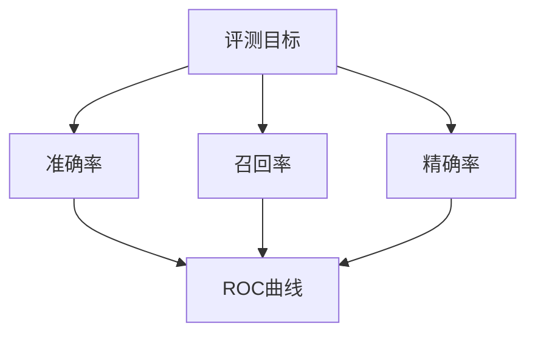
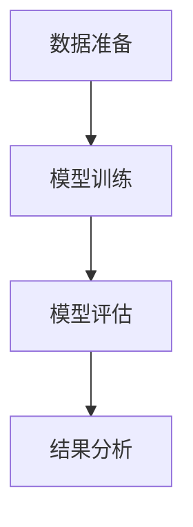

                 

### 目录大纲制定思路

#### 引言部分

在引言部分，我们需要明确书籍的主题，即大模型评测的持续集成与部署方案，并阐述其背景和重要性。这将帮助读者理解为什么这本书是有价值的，并激发他们的兴趣。

#### 第一部分：大模型评测基础

这一部分将介绍大模型评测的基础知识，包括评测目标和指标、数据集准备、评测工具与框架、以及评测流程。这部分内容将为后续的持续集成与部署提供必要的背景知识。

##### 2.1 评测目标和指标

在这一节中，我们将详细解释评测目标是什么，以及如何选择合适的评测指标。我们将使用一个简单的Mermaid流程图来展示评测指标之间的关系。

##### 2.2 数据集准备

我们将讨论数据集选择的标准，以及如何对数据进行预处理，以确保其适用于模型评测。

##### 2.3 评测工具与框架

在这一节中，我们将介绍几种常见的评测工具和框架，以及如何选择和使用它们。

##### 2.4 评测流程

我们将详细描述评测流程，包括从数据准备到模型评估的每个步骤。我们将使用一个Mermaid流程图来展示整个评测流程。

#### 第二部分：持续集成（CI）

这一部分将介绍持续集成（CI）的基本概念、工具介绍、流程设计，以及实际应用案例。我们将强调CI在提高开发效率和质量方面的作用。

##### 3.1 CI的基本概念

我们将定义持续集成，并解释它是如何提高软件质量和工作流程的。

##### 3.2 CI工具介绍

我们将介绍几种流行的CI工具，如Jenkins和GitLab CI，并比较它们的特点。

##### 3.3 CI流程设计

在这一节中，我们将讨论如何设计CI流程，以确保模型评测的自动化和高效性。

##### 3.4 CI实践案例

我们将通过实际案例来展示如何实现CI，以及它在模型评测中的应用。

#### 第三部分：部署

这一部分将讨论模型部署的准备、策略、工具选择，以及部署实践。我们将强调部署的自动化和可重复性。

##### 4.1 部署前准备

我们将讨论在部署前需要做的准备工作，如环境配置和版本控制。

##### 4.2 部署策略与优化

在这一节中，我们将介绍不同的部署策略，并讨论如何优化部署过程。

##### 4.3 部署工具与平台

我们将介绍一些常用的部署工具和平台，如Kubernetes和AWS。

##### 4.4 部署实践

我们将通过实际案例来展示如何部署模型和服务。

#### 第四部分：性能监控与优化

这一部分将讨论如何监控模型的性能，并介绍一些优化方法。我们将强调性能监控在确保模型稳定运行中的重要性。

##### 5.1 性能监控概述

我们将定义性能监控，并解释为什么它是必要的。

##### 5.2 监控工具介绍

我们将介绍几种常用的性能监控工具，如Prometheus和Grafana。

##### 5.3 性能优化方法

在这一节中，我们将讨论如何优化模型的性能，包括算法和系统优化。

##### 5.4 实践案例分析

我们将通过实际案例来展示如何进行性能监控和优化。

#### 第五部分：安全性保障

这一部分将讨论如何确保模型和部署的安全性。我们将强调安全性在模型评测和部署中的重要性。

##### 6.1 安全性评估

我们将介绍如何评估模型的安全性，包括安全评估方法和流程。

##### 6.2 防护策略

在这一节中，我们将讨论如何制定和实施防护策略，以保护模型和数据。

##### 6.3 安全性测试

我们将介绍如何进行安全性测试，包括测试方法和实践。

##### 6.4 安全性案例分析

我们将通过实际案例来展示如何处理安全性和部署中的安全问题。

#### 结论

在结论部分，我们将总结书籍的主要内容和收获，并讨论未来的研究方向。

### 文章格式

我们将遵循以下格式要求：

- 使用Markdown格式编写文章。
- 在文章末尾包含作者信息。
- 确保文章内容完整、具体、详细。
- 使用Mermaid流程图来展示流程和关系。
- 使用伪代码和LaTeX格式来解释算法和数学模型。
- 包含项目实战、案例分析、最佳实践等内容。

### 文章字数

我们将确保文章字数在8000～12000字之间。

### 完整性要求

我们将确保每个小节的内容都丰富、具体、详细，并包含以下核心内容：

- 背景介绍
- 核心概念与联系
- 核心算法原理讲解
- 数学模型和公式
- 项目实战
- 最佳实践 tips
- 小结、注意事项
- 拓展阅读

### 文章标题、关键词和摘要

我们将确保文章标题简洁明了，关键词准确描述文章主题，摘要简要概括文章的核心内容和主题思想。

### 文章结构

我们将遵循以下文章结构：

- 文章标题
- 关键词
- 摘要
- 引言
- 第一部分：大模型评测基础
- 第二部分：持续集成（CI）
- 第三部分：部署
- 第四部分：性能监控与优化
- 第五部分：安全性保障
- 结论

通过以上步骤，我们将确保文章逻辑清晰、内容丰富、结构紧凑，并且能够吸引读者的兴趣。我们将遵循文章格式要求，确保文章的可读性和专业性。同时，我们将控制文章的字数，确保其长度在8000～12000字之间，以满足读者的需求。最终，我们将撰写一篇高质量、有深度、有思考、有见解的专业技术博客文章。

