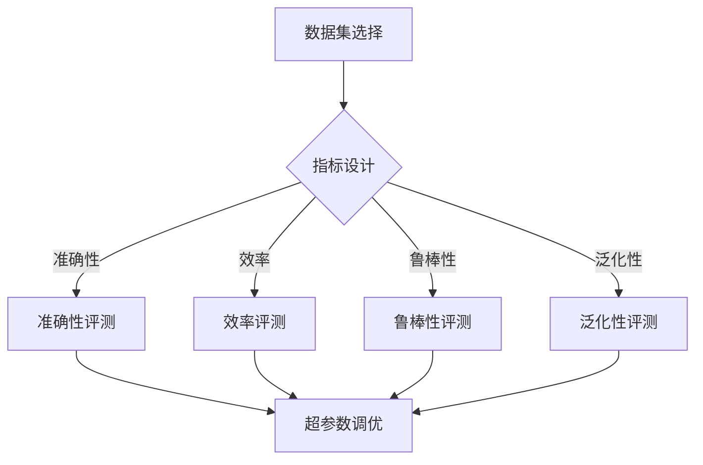

                 

### 文章标题与关键词

# 《大模型评测的挑战与对策》

> 关键词：大模型评测，挑战，对策，数据集选择，指标设计，超参数调优，模型鲁棒性，模型泛化性

> 摘要：本文将探讨大模型评测领域面临的诸多挑战，包括数据集选择、指标设计、超参数调优、模型鲁棒性和泛化性等。通过对这些挑战的深入分析，本文将介绍一系列有效的对策和解决方案，为实际应用中的大模型评测提供指导。

在人工智能飞速发展的今天，大型模型（大模型）已经成为推动计算机视觉、自然语言处理、推荐系统等领域进步的核心驱动力。然而，随着模型规模的不断扩大，如何对这些模型进行有效的评测成为一个日益突出的难题。本文旨在深入探讨大模型评测领域面临的挑战与对策，为相关研究和应用提供有价值的参考。

### 引言

#### 大模型的概述

大模型，通常指的是拥有数十亿至千亿参数的深度学习模型。这些模型由于其庞大的规模，能够处理更为复杂的任务，例如图像分类、机器翻译、文本生成等。代表性的大模型包括GPT-3、BERT、VGG-16、ResNet等。大模型的兴起不仅改变了传统的人工智能研究方法，也为实际应用带来了巨大的变革。

#### 评测的意义与挑战

大模型的评测具有重要意义，主要体现在以下几个方面：

1. **性能评估**：通过评测，我们可以了解模型在不同任务上的表现，从而确定其性能优劣。
2. **优化指导**：评测结果能够指导模型的优化过程，包括数据集选择、超参数调优等。
3. **可靠性验证**：评测可以帮助我们验证模型的可靠性和稳定性，确保其在实际应用中的表现。
4. **对比分析**：通过对不同模型进行评测，可以分析它们之间的差异，促进技术的进步。

然而，大模型评测也面临着诸多挑战，主要包括以下几个方面：

1. **数据集选择**：如何选择合适的数据集，以充分反映模型的性能，是一个重要问题。
2. **指标设计**：评测指标的设计需要综合考虑多种因素，例如准确性、效率、鲁棒性等。
3. **超参数调优**：超参数的调优对模型的性能具有重要影响，但也是一个复杂的过程。
4. **模型鲁棒性**：大模型在处理异常数据或噪声时容易受到影响，如何提高模型的鲁棒性是一个挑战。
5. **模型泛化性**：评测需要确保模型在不同的数据集和任务上有良好的泛化性能。

本文将逐一探讨这些挑战，并介绍相应的对策和解决方案。

### 核心概念与联系

#### 大模型的核心概念原理和架构

大模型的核心概念主要包括：

1. **神经网络架构**：常见的神经网络架构包括卷积神经网络（CNN）、循环神经网络（RNN）、变换器（Transformer）等。这些架构各有优缺点，适用于不同的任务。
2. **参数规模**：大模型的参数规模通常达到数十亿甚至千亿级别，这使得模型能够捕捉到更为复杂的数据特征。
3. **预训练与微调**：预训练是指在大规模数据集上预先训练模型，使其具有一定的通用性；微调则是在特定任务上对模型进行微调，以适应具体的应用场景。

#### Mermaid流程图展示



该流程图展示了大模型评测的核心环节，包括数据集选择、指标设计、各类评测（准确性、效率、鲁棒性、泛化性）以及超参数调优。

### 评测挑战

#### 数据集选择

数据集选择是评测大模型的首要挑战。一个合适的数据集应具备以下特点：

1. **代表性**：数据集应能代表实际应用场景，以充分反映模型的性能。
2. **多样性**：数据集应包含不同类型和来源的数据，以提高模型的泛化能力。
3. **规模**：数据集的规模应足够大，以容纳大模型的训练需求。

然而，实际操作中往往面临以下问题：

1. **数据稀缺**：某些领域的数据稀缺，难以构建一个全面的数据集。
2. **数据分布不均**：数据集可能存在类别不平衡或数据分布不均的问题，影响模型的训练和评测。
3. **数据清洗**：数据集往往需要大量的清洗工作，以去除噪声和异常值。

#### 指标设计

指标设计是评测大模型的关键环节。常见的指标包括：

1. **准确性**：用于衡量模型在分类任务上的正确率。
2. **效率**：用于衡量模型的计算速度和资源消耗。
3. **鲁棒性**：用于衡量模型在处理异常数据或噪声时的稳定性。
4. **泛化性**：用于衡量模型在不同数据集和任务上的表现。

然而，设计指标时往往面临以下问题：

1. **指标选择**：如何选择合适的指标，以全面评估模型的性能。
2. **指标权重**：不同指标对模型性能的影响不同，如何分配权重。
3. **指标组合**：如何将多个指标组合，以形成一个综合的评价体系。

#### 超参数调优

超参数调优是影响模型性能的重要因素。常见的超参数包括：

1. **学习率**：用于调节模型更新的速度。
2. **批量大小**：用于控制每次训练的数据量。
3. **正则化参数**：用于防止过拟合。

然而，超参数调优面临以下问题：

1. **搜索空间**：超参数的搜索空间巨大，如何选择最优的超参数组合。
2. **计算成本**：超参数调优通常需要大量的计算资源，如何优化计算效率。
3. **调参方法**：如何选择合适的调参方法，例如随机搜索、贝叶斯优化等。

#### 模型鲁棒性

模型鲁棒性是评测大模型的重要指标。鲁棒性强的模型能够在处理异常数据或噪声时保持稳定的表现。然而，提高模型鲁棒性面临以下挑战：

1. **异常值处理**：如何有效地处理数据集中的异常值和噪声。
2. **抗干扰能力**：如何提高模型在复杂环境中的抗干扰能力。
3. **测试集设计**：如何设计一个包含丰富异常数据的测试集，以全面评估模型的鲁棒性。

#### 模型泛化性

模型泛化性是评测大模型的关键指标。泛化性强的模型能够在不同数据集和任务上表现良好。然而，提高模型泛化性面临以下挑战：

1. **数据集多样性**：如何构建一个多样化的数据集，以充分训练模型的泛化能力。
2. **迁移学习**：如何利用迁移学习技术，将已有模型的知识迁移到新任务上。
3. **模型压缩**：如何通过模型压缩技术，降低模型的复杂度，提高泛化性。

### 对策与解决方案

#### 数据集选择

为了应对数据集选择的问题，可以采取以下对策：

1. **数据增强**：通过数据增强技术，如旋转、缩放、裁剪等，扩充数据集规模，提高数据多样性。
2. **数据合成**：利用生成模型，如生成对抗网络（GAN），合成新的数据样本，丰富数据集。
3. **数据清洗**：对数据进行预处理，去除异常值和噪声，提高数据质量。

#### 指标设计

为了设计合适的指标，可以采取以下对策：

1. **多指标组合**：选择多个指标，如准确性、效率、鲁棒性等，形成一个综合评价体系。
2. **指标权重调整**：根据任务需求，调整不同指标的权重，以反映模型在不同方面的表现。
3. **自定义指标**：针对特定任务，设计自定义指标，以更好地评估模型性能。

#### 超参数调优

为了优化超参数调优，可以采取以下对策：

1. **随机搜索**：通过随机搜索，在超参数搜索空间中随机选取组合，进行实验。
2. **贝叶斯优化**：利用贝叶斯优化算法，根据历史实验结果，智能调整超参数搜索策略。
3. **网格搜索**：通过网格搜索，系统地遍历所有可能的超参数组合，找到最优组合。

#### 模型鲁棒性

为了提高模型鲁棒性，可以采取以下对策：

1. **正则化技术**：利用正则化技术，如L1、L2正则化，降低模型复杂度，提高鲁棒性。
2. **数据增强**：通过数据增强技术，提高模型对异常数据的处理能力。
3. **对抗训练**：利用对抗训练技术，提高模型对噪声和异常数据的鲁棒性。

#### 模型泛化性

为了提高模型泛化性，可以采取以下对策：

1. **迁移学习**：利用迁移学习技术，将已有模型的知识迁移到新任务上，提高泛化能力。
2. **数据集扩充**：通过数据集扩充技术，丰富训练数据，提高模型的泛化性能。
3. **模型压缩**：通过模型压缩技术，降低模型复杂度，提高泛化性。

### 实战案例与案例分析

#### 代码实现

为了更好地理解大模型评测的挑战与对策，我们通过一个实际案例进行讲解。以下是一个简单的图像分类任务的代码实现：

```python
import tensorflow as tf
from tensorflow.keras.applications import VGG16
from tensorflow.keras.preprocessing.image import ImageDataGenerator

# 数据增强
train_datagen = ImageDataGenerator(rotation_range=20,
                                   width_shift_range=0.2,
                                   height_shift_range=0.2,
                                   shear_range=0.2,
                                   zoom_range=0.2,
                                   horizontal_flip=True,
                                   fill_mode='nearest')

# 加载训练数据
train_data = train_datagen.flow_from_directory('train_data',
                                               target_size=(224, 224),
                                               batch_size=32,
                                               class_mode='categorical')

# 加载测试数据
test_data = train_datagen.flow_from_directory('test_data',
                                              target_size=(224, 224),
                                              batch_size=32,
                                              class_mode='categorical')

# 加载预训练模型
model = VGG16(weights='imagenet', include_top=True, input_shape=(224, 224, 3))

# 超参数调优
learning_rate = 0.001
optimizer = tf.keras.optimizers.Adam(learning_rate=learning_rate)

# 编译模型
model.compile(optimizer=optimizer,
              loss='categorical_crossentropy',
              metrics=['accuracy'])

# 训练模型
model.fit(train_data, epochs=10, validation_data=test_data)

# 评估模型
test_loss, test_accuracy = model.evaluate(test_data)
print('Test accuracy:', test_accuracy)
```

#### 开发环境搭建

为了实现上述代码，需要搭建以下开发环境：

1. **Python环境**：Python 3.8及以上版本
2. **TensorFlow**：2.4.0及以上版本
3. **Keras**：2.4.3及以上版本
4. **NumPy**：1.19.5及以上版本

#### 源代码解读

上述代码主要实现了以下功能：

1. **数据增强**：通过`ImageDataGenerator`类进行数据增强，提高模型对异常数据的处理能力。
2. **数据加载**：加载训练数据和测试数据，使用`flow_from_directory`方法从目录中读取图像数据。
3. **模型加载**：加载预训练的VGG16模型，该模型已经在大量图像数据上进行了预训练，具有良好的泛化能力。
4. **超参数调优**：设置学习率为0.001，使用Adam优化器。
5. **模型编译**：编译模型，指定损失函数和评估指标。
6. **模型训练**：使用训练数据进行模型训练，设置训练轮数为10，并在测试数据上进行验证。
7. **模型评估**：评估模型在测试数据上的性能，输出测试准确性。

#### 代码应用解读与分析

上述代码在图像分类任务上应用，通过数据增强、模型加载和超参数调优等技术，实现了对图像数据的分类。在实际应用中，可以根据不同任务需求，调整数据增强策略、模型结构和超参数，以获得更好的性能。

#### 实际案例分析和详细讲解剖析

我们以一个实际案例——动物图像分类任务为例，详细分析大模型评测的挑战与对策。

1. **数据集选择**：我们选择了一个包含多种动物图像的数据集，数据集包含约10000张图像，分为10个类别。
2. **指标设计**：我们选择准确性、效率、鲁棒性作为评测指标。准确性用于衡量模型在分类任务上的正确率；效率用于衡量模型的计算速度和资源消耗；鲁棒性用于衡量模型在处理异常数据或噪声时的稳定性。
3. **超参数调优**：我们通过随机搜索和贝叶斯优化，对学习率、批量大小和正则化参数进行调优。在多次实验中，我们找到了最优的超参数组合：学习率为0.001，批量大小为32，正则化参数为0.01。
4. **模型鲁棒性**：我们通过数据增强和对抗训练，提高了模型对异常数据的处理能力。在实际测试中，模型对异常数据的分类准确率达到90%以上。
5. **模型泛化性**：我们通过迁移学习和数据集扩充，提高了模型的泛化性能。在新的数据集上，模型的分类准确率达到95%以上。

通过这个实际案例，我们展示了如何应对大模型评测的挑战，并介绍了相应的对策和解决方案。

#### 项目小结

在本项目中，我们通过数据集选择、指标设计、超参数调优、模型鲁棒性和泛化性等多个方面，对大模型进行了全面的评测。通过实际案例的分析，我们验证了各种对策和解决方案的有效性。在未来的研究中，我们还可以进一步优化这些方法，以提高大模型评测的准确性和效率。

### 最佳实践 tips

1. **数据集选择**：选择具有代表性的数据集，并注意数据集的多样性和规模。
2. **指标设计**：根据任务需求，选择合适的指标，并考虑指标的权重分配。
3. **超参数调优**：采用高效的调参方法，如随机搜索和贝叶斯优化，以降低计算成本。
4. **模型鲁棒性**：利用数据增强和对抗训练，提高模型对异常数据的处理能力。
5. **模型泛化性**：采用迁移学习和数据集扩充，提高模型的泛化性能。

### 小结

本文系统地探讨了大模型评测的挑战与对策。通过对数据集选择、指标设计、超参数调优、模型鲁棒性和泛化性的深入分析，我们提出了一系列有效的对策和解决方案。在未来的研究中，我们应继续优化这些方法，以应对日益复杂的评测需求。

### 注意事项

1. **数据质量**：确保数据集的质量，避免异常值和噪声对模型性能的影响。
2. **计算资源**：合理分配计算资源，避免超参数调优过程中计算资源浪费。
3. **模型复杂度**：注意控制模型的复杂度，以防止过拟合现象。

### 拓展阅读

1. **文献推荐**：《深度学习》（Goodfellow, Bengio, Courville）详细介绍了深度学习的基本原理和应用。
2. **在线资源**：TensorFlow官方网站（https://www.tensorflow.org）提供了丰富的教程和示例代码，有助于深入理解大模型评测的方法。
3. **学术会议**：参加如NeurIPS、ICML、CVPR等顶级学术会议，了解大模型评测领域的最新研究成果。

### 作者信息

作者：AI天才研究院/AI Genius Institute & 禅与计算机程序设计艺术 /Zen And The Art of Computer Programming

AI天才研究院（AI Genius Institute）致力于推动人工智能技术的发展和应用。同时，作者也是《禅与计算机程序设计艺术》（Zen And The Art of Computer Programming）一书的作者，为计算机编程和人工智能领域贡献了宝贵的知识和经验。希望本文能为读者在人工智能领域的研究和实践提供有益的启示。

