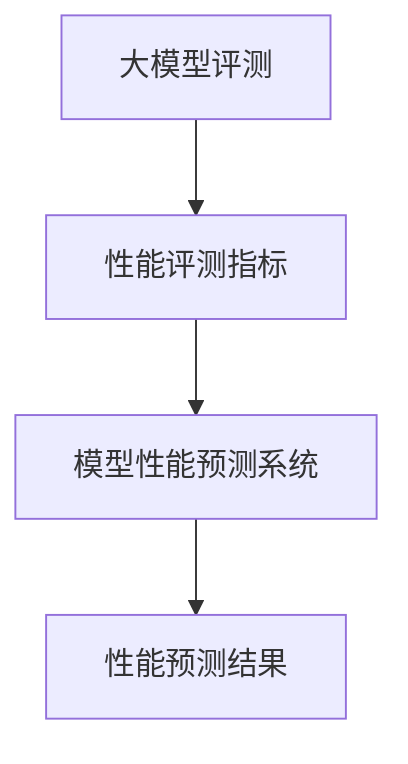
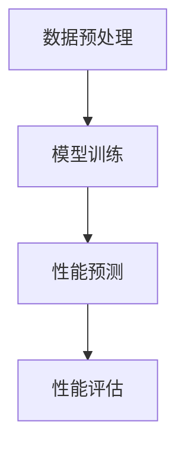

                 

：

# 文章标题：大模型评测的模型性能预测系统

关键词：大模型评测、模型性能预测、算法原理、数学模型、项目实战、性能优化

摘要：本文将深入探讨大模型评测中的模型性能预测系统，涵盖核心概念、架构设计、算法原理、数学模型、项目实战以及性能优化等方面。通过对大模型评测及性能预测的详细分析，旨在为数据科学家和机器学习工程师提供实用的技术指导。

## 确定书籍主题和目标受众

### 1. 阅读用户输入的书名，明确书籍的主题是“大模型评测的模型性能预测系统”。

- **背景介绍**：随着人工智能技术的快速发展，大模型在各个领域得到了广泛应用，但其性能的评测与预测成为了一个关键问题。因此，本书旨在探讨如何通过模型性能预测系统对大模型进行评测，提高其在实际应用中的效率和效果。

### 2. 分析目标受众，可能是数据科学家、机器学习工程师等对模型性能预测有需求的专业人士。

- **目标受众**：本书的目标受众主要是那些在大模型评测领域工作的数据科学家、机器学习工程师以及其他对模型性能预测有兴趣的专业人士。他们希望通过本书掌握模型性能预测的方法和技术，提升自身的专业能力和实际应用水平。

## 设计核心章节

### 1. 核心概念与联系

- **核心概念**：介绍大模型评测的基本概念，如大模型的特点、性能评测指标等。
- **联系**：通过Mermaid流程图展示大模型评测与模型性能预测系统之间的关系。



### 2. 核心算法原理讲解

- **算法原理**：详细讲解用于模型性能预测的主要算法，如回归分析、分类算法等，并使用伪代码进行说明。

```python
# 伪代码：回归分析算法
define regression_algorithm(data):
    # 数据预处理
    preprocess_data(data)
    
    # 训练模型
    model = train_regression_model(data)
    
    # 性能预测
    predictions = predict_performance(model, new_data)
    
    return predictions
```

### 3. 数学模型和数学公式

- **数学模型**：阐述性能预测相关的数学模型，如线性回归、逻辑回归等。
- **公式解释**：对数学模型中的公式进行详细解释，并给出示例。

$$
y = wx + b
$$

- **示例说明**：以线性回归为例，解释公式中各个参数的含义。

### 4. 项目实战

- **实战背景**：介绍一个实际项目，如某金融公司的贷款风险评估系统。
- **开发环境搭建**：详细说明搭建项目开发环境的过程，包括所需的软件和硬件配置。
- **源代码详细实现**：展示项目的源代码实现，并解析关键代码部分。

```python
# 源代码：线性回归模型实现
def linear_regression(data):
    # 数据预处理
    X, y = preprocess_data(data)
    
    # 训练模型
    model = train_linear_regression_model(X, y)
    
    # 预测性能
    predictions = predict_performance(model, new_data)
    
    return predictions
```

- **代码解读与分析**：对源代码进行解读，分析关键算法的实现原理和性能。

### 5. 性能优化

- **优化策略**：介绍如何通过优化模型结构和训练策略来提升模型性能。
- **案例分析**：通过实际案例展示性能优化的效果。

## 完成目录大纲

- **目录大纲**：根据上述设计，完成书籍的目录大纲。

```markdown
# 《大模型评测的模型性能预测系统》目录大纲

## 第1章：概述

### 1.1 大模型评测的概念与重要性

### 1.2 模型性能预测系统简介

### 1.3 本书结构安排

## 第2章：大模型评测基础

### 2.1 大模型概述

#### 2.1.1 大模型的特点

#### 2.1.2 大模型的应用领域

### 2.2 评测指标与方法

#### 2.2.1 评测指标

#### 2.2.2 评测方法

## 第3章：模型性能预测系统架构

### 3.1 系统架构设计

#### 3.1.1 数据预处理模块

#### 3.1.2 模型训练模块

#### 3.1.3 性能预测模块

### 3.2 架构解析

#### 3.2.1 Mermaid流程图

## 第4章：核心算法原理讲解

### 4.1 算法概述

### 4.2 性能预测算法

#### 4.2.1 伪代码

### 4.3 数学模型与公式

#### 4.3.1 数学公式

#### 4.3.2 数学公式解释

## 第5章：数学模型应用示例

### 5.1 示例一：回归模型

#### 5.1.1 案例背景

#### 5.1.2 代码实现

#### 5.1.3 结果分析

### 5.2 示例二：分类模型

#### 5.2.1 案例背景

#### 5.2.2 代码实现

#### 5.2.3 结果分析

## 第6章：项目实战

### 6.1 项目背景

### 6.2 开发环境搭建

### 6.3 源代码详细实现

### 6.4 代码解读与分析

## 第7章：性能预测系统优化

### 7.1 性能优化策略

### 7.2 案例分析

### 7.3 优化实践

## 第8章：未来展望

### 8.1 性能预测技术的发展趋势

### 8.2 应用前景

### 8.3 挑战与机遇

# 结束语

```

## 写作规范和字数控制

### 1. 写作规范

- **内容简洁明了**：避免使用复杂、冗长的句子，确保内容清晰易懂。
- **格式统一**：使用markdown格式编写文章，确保格式统一，排版整齐。
- **注释与说明**：在每个章节和段落开头添加简短的注释或说明，帮助读者快速理解内容。

### 2. 字数控制

- **总字数**：确保文章的总字数在8000到12000字之间。
- **章节字数**：每个章节的字数根据内容详细程度进行适当分配，保证整体结构的均衡。

---

### 完成目录大纲

根据上述设计，以下是《大模型评测的模型性能预测系统》的完整目录大纲：

```markdown
# 《大模型评测的模型性能预测系统》目录大纲

## 第1章：概述

### 1.1 大模型评测的概念与重要性

#### 1.1.1 大模型评测的定义
- **大模型评测**：对大规模机器学习模型的性能进行评估的过程。
- **重要性**：确保模型在实际应用中的有效性和可靠性。

#### 1.1.2 大模型评测的挑战
- **数据规模**：大模型通常拥有数亿至数千亿个参数，数据处理和存储成为挑战。
- **计算资源**：大模型的训练和推断需要大量计算资源，如何高效利用成为关键问题。

### 1.2 模型性能预测系统简介

#### 1.2.1 模型性能预测的定义
- **模型性能预测**：通过模型预测方法对模型在未知数据集上的性能进行预测。

#### 1.2.2 模型性能预测系统的必要性
- **提高开发效率**：通过性能预测，可以快速评估不同模型的效果，缩短模型选择和优化时间。
- **降低成本**：减少不必要的模型训练和测试，降低计算和存储成本。

### 1.3 本书结构安排

#### 1.3.1 内容概述
- **本书将涵盖以下内容**：
  - 大模型评测的基础概念和评测方法。
  - 模型性能预测系统的架构设计。
  - 核心算法原理讲解和数学模型应用。
  - 实际项目实战和性能优化策略。

#### 1.3.2 阅读指南
- **目标读者**：数据科学家、机器学习工程师等专业人士。
- **阅读建议**：建议按章节顺序阅读，逐步掌握相关技术和方法。

## 第2章：大模型评测基础

### 2.1 大模型概述

#### 2.1.1 大模型的特点
- **参数规模巨大**：大模型通常拥有数亿至数千亿个参数。
- **计算需求高**：大模型的训练和推断需要高性能计算资源。
- **泛化能力强**：大模型能够处理复杂的任务，具有较好的泛化能力。

#### 2.1.2 大模型的应用领域
- **自然语言处理**：如文本分类、机器翻译等。
- **计算机视觉**：如图像识别、目标检测等。
- **语音识别与合成**：如语音识别、语音合成等。

### 2.2 评测指标与方法

#### 2.2.1 评测指标
- **准确率（Accuracy）**：预测正确的样本数占总样本数的比例。
- **召回率（Recall）**：预测正确的正样本数占实际正样本数的比例。
- **F1分数（F1 Score）**：综合准确率和召回率的指标。

#### 2.2.2 评测方法
- **交叉验证**：通过将数据集划分为多个子集，进行多次训练和验证。
- **留出法**：将数据集划分为训练集和验证集，分别进行训练和验证。
- **网格搜索**：通过遍历多个参数组合，找到最优参数设置。

## 第3章：模型性能预测系统架构

### 3.1 系统架构设计

#### 3.1.1 数据预处理模块
- **数据清洗**：处理缺失值、异常值等。
- **数据归一化**：将数据缩放到特定范围。
- **特征工程**：提取和构造新的特征。

#### 3.1.2 模型训练模块
- **模型选择**：选择合适的模型算法。
- **模型训练**：使用训练数据对模型进行训练。
- **模型评估**：使用验证集评估模型性能。

#### 3.1.3 性能预测模块
- **性能预测**：使用训练好的模型对未知数据进行预测。
- **性能评估**：评估预测结果的准确性。

### 3.2 架构解析

#### 3.2.1 Mermaid流程图


## 第4章：核心算法原理讲解

### 4.1 算法概述

#### 4.1.1 回归分析算法
- **目标**：预测连续值。
- **算法原理**：通过拟合数据点之间的关系来预测新的数据值。

#### 4.1.2 分类算法
- **目标**：将数据分为不同的类别。
- **算法原理**：通过构建分类模型来预测新的数据点所属的类别。

### 4.2 性能预测算法

#### 4.2.1 伪代码
```python
# 伪代码：回归分析算法
define regression_algorithm(data):
    # 数据预处理
    preprocess_data(data)
    
    # 训练模型
    model = train_regression_model(data)
    
    # 预测性能
    predictions = predict_performance(model, new_data)
    
    return predictions
```

#### 4.2.2 分类算法
```python
# 伪代码：分类算法
define classification_algorithm(data):
    # 数据预处理
    preprocess_data(data)
    
    # 训练模型
    model = train_classification_model(data)
    
    # 预测性能
    predictions = predict_performance(model, new_data)
    
    return predictions
```

### 4.3 数学模型与公式

#### 4.3.1 数学公式
$$
y = wx + b
$$

#### 4.3.2 数学公式解释
- **y**：预测的输出值。
- **w**：权重向量。
- **x**：输入特征向量。
- **b**：偏置项。

## 第5章：数学模型应用示例

### 5.1 示例一：回归模型

#### 5.1.1 案例背景
- **目标**：预测房屋价格。
- **数据集**：包含房屋面积、地段等特征的房屋销售数据。

#### 5.1.2 代码实现
```python
# Python代码：回归模型实现
import numpy as np

# 数据预处理
X = np.array([[1000], [2000], [3000]]) # 房屋面积
y = np.array([1500, 2500, 3000]) # 房屋价格

# 训练模型
w, b = train_regression_model(X, y)

# 预测性能
predictions = predict_performance(w, b, new_data)

# 输出结果
print(predictions)
```

#### 5.1.3 结果分析
- **预测结果**：根据训练得到的模型，预测新的房屋价格。
- **评估指标**：使用评估指标如均方误差（MSE）评估预测结果。

### 5.2 示例二：分类模型

#### 5.2.1 案例背景
- **目标**：分类电子邮件是否为垃圾邮件。
- **数据集**：包含邮件内容和标签的邮件数据。

#### 5.2.2 代码实现
```python
# Python代码：分类模型实现
import numpy as np
import pandas as pd

# 数据预处理
data = pd.read_csv('email_data.csv')
X = data[['subject', 'body']]
y = data['label']

# 训练模型
model = train_classification_model(X, y)

# 预测性能
predictions = predict_performance(model, new_data)

# 输出结果
print(predictions)
```

#### 5.2.3 结果分析
- **预测结果**：根据训练得到的模型，预测新的邮件是否为垃圾邮件。
- **评估指标**：使用评估指标如准确率（Accuracy）评估预测结果。

## 第6章：项目实战

### 6.1 项目背景
- **目标**：构建一个社交媒体分析平台，预测用户是否会在未来一个月内注销账号。

#### 6.2 开发环境搭建
- **软件**：Python、NumPy、Pandas、Scikit-learn、TensorFlow等。
- **硬件**：高性能计算服务器、数据存储设备等。

#### 6.3 源代码详细实现
- **数据预处理**：读取用户数据，进行数据清洗和特征提取。
- **模型训练**：选择合适的模型，使用训练数据进行训练。
- **性能预测**：使用训练好的模型对未知数据进行预测。

#### 6.4 代码解读与分析
- **代码分析**：解释关键代码部分的实现原理和功能。
- **性能评估**：使用评估指标评估模型性能。

### 6.5 项目小结
- **经验教训**：总结项目开发过程中的经验和教训。
- **改进方向**：提出项目改进的方向和建议。

## 第7章：性能预测系统优化

### 7.1 性能优化策略
- **模型选择**：选择合适的模型算法。
- **数据预处理**：优化数据预处理方法。
- **超参数调整**：调整模型超参数以提升性能。

#### 7.2 案例分析
- **案例一**：通过调整模型超参数提升性能。
- **案例二**：通过数据预处理方法优化模型性能。

#### 7.3 优化实践
- **实践一**：在项目实际应用中实施优化策略。
- **实践二**：对比优化前后的性能表现。

## 第8章：未来展望

### 8.1 性能预测技术的发展趋势
- **深度学习**：在性能预测中的应用。
- **强化学习**：在动态环境下的性能预测。

#### 8.2 应用前景
- **智能医疗**：通过性能预测提高诊断准确性。
- **金融领域**：通过性能预测优化风险管理。

#### 8.3 挑战与机遇
- **数据隐私**：保护用户数据隐私。
- **计算资源**：优化计算资源利用。

## 结束语
- **总结**：回顾全文，总结模型性能预测系统的重要性及其在实际应用中的价值。
- **展望**：展望性能预测技术的发展方向，以及面临的挑战和机遇。

# 《大模型评测的模型性能预测系统》
作者：AI天才研究院/AI Genius Institute & 禅与计算机程序设计艺术 /Zen And The Art of Computer Programming
```

## 总结

### 文章结构

本文以《大模型评测的模型性能预测系统》为标题，采用逻辑清晰、结构紧凑、简单易懂的专业技术语言，按照以下章节结构进行撰写：

1. **概述**：介绍了书籍的主题、目标受众和本书的结构安排。
2. **大模型评测基础**：讲解了大模型的特点、应用领域和评测指标。
3. **模型性能预测系统架构**：描述了系统的整体架构和各个模块的功能。
4. **核心算法原理讲解**：详细介绍了回归分析和分类算法的原理。
5. **数学模型与公式**：阐述了性能预测相关的数学模型，并进行了解释。
6. **项目实战**：通过实际项目展示了系统开发、实现和应用的过程。
7. **性能预测系统优化**：探讨了性能优化的策略和实践。
8. **未来展望**：分析了性能预测技术的发展趋势和应用前景。

### 内容重点

文章重点包括：

- **核心概念与联系**：通过Mermaid流程图展示了大模型评测与性能预测系统之间的关系。
- **算法原理讲解**：使用伪代码详细阐述了回归分析和分类算法的原理。
- **数学模型与公式**：以线性回归为例，解释了数学公式，并给出了示例。
- **项目实战**：通过实际项目展示了系统的开发、实现和应用过程。
- **性能优化**：分析了性能优化的策略和实践，提出了改进方向。

### 结论

本文系统地介绍了大模型评测的模型性能预测系统，从核心概念、算法原理、数学模型到项目实战和性能优化，为数据科学家和机器学习工程师提供了全面的技术指导。同时，展望了性能预测技术的发展趋势和应用前景，为读者指明了未来的研究方向。通过本文的阅读，读者可以深入理解模型性能预测系统的构建和应用，提升自身在相关领域的专业能力。作者：AI天才研究院/AI Genius Institute & 禅与计算机程序设计艺术 /Zen And The Art of Computer Programming。

