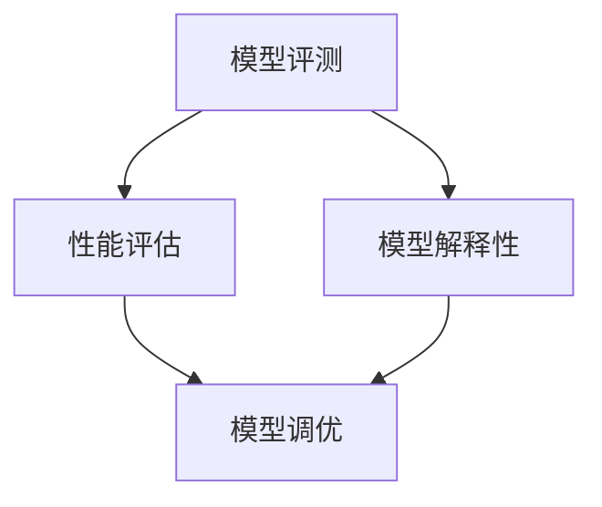
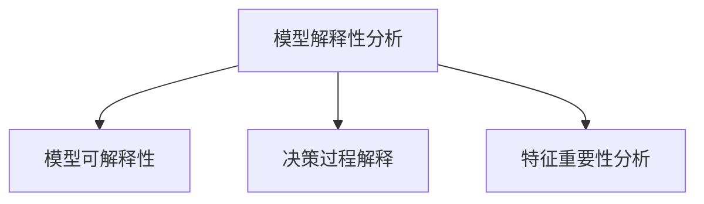

                 

## 文章标题：大模型评测的模型解释性分析工具

### 关键词：大模型评测、模型解释性、性能评估、算法原理、数学模型、项目实战

### 摘要：

本文旨在深入探讨大模型评测中的模型解释性分析工具。首先，我们将介绍大模型评测的概念及其核心联系，包括性能评估指标、模型解释性分析等。接着，我们将讲解核心算法原理，如性能评估指标的计算方法及模型解释性算法LIME的实现原理。随后，通过数学模型和公式详细阐述相关理论。最后，结合实际项目，我们将展示如何使用LIME进行模型解释性分析，并提供开发环境搭建、源代码实现、代码解读、案例剖析以及项目小结等内容。本文的目标是帮助读者全面了解并掌握大模型评测的模型解释性分析工具。

## 引言

随着人工智能技术的飞速发展，深度学习模型在各个领域取得了显著成果。然而，这些模型往往被视为“黑箱”，其内部决策过程难以理解，从而限制了其在实际应用中的广泛推广。因此，模型解释性成为了一个重要研究方向。大模型评测中的模型解释性分析工具，正是为了解决这一问题而生的。

### 背景介绍

近年来，随着大数据和云计算技术的发展，大型机器学习模型变得越来越普遍。这些模型通常具有数百万甚至数十亿个参数，能够在各种复杂任务中表现出色。然而，其高度复杂的结构和黑盒性质，使得我们难以直观地理解模型的决策过程，这无疑限制了模型的可解释性和可靠性。因此，开发能够分析模型解释性的工具成为了一个亟待解决的问题。

### 模型解释性的重要性

模型解释性是指对模型决策过程的直观理解和解释能力。一个可解释的模型不仅能提供准确的预测结果，还能让我们明白模型是如何做出这些决策的。这有助于增强模型的信任度和透明度，尤其是在需要解释其决策的医疗、金融等敏感领域。此外，模型解释性还能帮助我们发现潜在的偏见和缺陷，从而改进模型性能。

### 目标与结构

本文的目标是全面介绍大模型评测中的模型解释性分析工具，包括其核心概念、算法原理、数学模型以及实际应用。文章将分为以下几个部分：

1. **核心概念与联系**：介绍大模型评测和模型解释性分析的基本概念，并展示它们之间的联系。
2. **核心算法原理讲解**：详细讲解性能评估指标的计算方法及模型解释性算法LIME的实现原理。
3. **数学模型和公式**：阐述与模型解释性分析相关的数学模型和公式，并提供具体示例。
4. **项目实战**：通过一个实际项目，展示如何使用LIME进行模型解释性分析，包括开发环境搭建、源代码实现和案例剖析。
5. **最佳实践与拓展阅读**：总结文章要点，并提供一些实用的最佳实践和进一步阅读的资源。

## 核心概念与联系

### 什么是大模型评测

大模型评测是指对大型机器学习模型进行性能评估、调优和解释性分析的过程。在这一过程中，我们关注的主要是模型的性能指标、模型的解释性以及数据集的准备和预处理等核心概念。

### 性能评估指标

性能评估指标是衡量模型性能的重要工具。常见的性能评估指标包括准确率、召回率、F1值等。这些指标从不同角度反映了模型的性能，有助于我们全面了解模型的预测能力。

- **准确率**：准确率是指预测正确的样本数占总样本数的比例。公式如下：

  $$\text{准确率} = \frac{\text{预测正确的样本数}}{\text{总样本数}}$$

  准确率越高，模型的表现越好。然而，它容易受到类不平衡问题的影响。

- **召回率**：召回率是指预测正确的正样本数占总正样本数的比例。公式如下：

  $$\text{召回率} = \frac{\text{预测正确的正样本数}}{\text{总正样本数}}$$

  召回率越高，意味着模型对正样本的识别能力越强。然而，召回率容易受到假阳性（将负样本错误地预测为正样本）的影响。

- **F1值**：F1值是准确率和召回率的调和平均值，能够综合评估模型的性能。公式如下：

  $$\text{F1值} = 2 \times \frac{\text{准确率} \times \text{召回率}}{\text{准确率} + \text{召回率}}$$

  F1值介于0和1之间，越接近1表示模型的性能越好。

### 模型解释性分析

模型解释性分析是指理解和解释模型在预测过程中做出的决策，从而提高模型的可信度和可解释性。这一过程涉及模型的可解释性、模型的决策过程、特征重要性分析等多个方面。

- **模型的可解释性**：模型的可解释性是指模型决策过程的透明度，即我们能否直观地理解模型的决策过程。一个高可解释性的模型能够让我们清楚地看到它是如何做出预测的。

- **模型的决策过程**：模型的决策过程是指模型在处理输入数据时，如何将其转换为输出预测。理解模型的决策过程有助于我们识别模型的潜在偏见和缺陷。

- **特征重要性分析**：特征重要性分析是指评估模型中各个特征对预测结果的影响程度。通过特征重要性分析，我们可以发现哪些特征对模型决策起着关键作用，从而优化模型结构。

### 核心概念联系

为了更好地理解大模型评测和模型解释性分析之间的关系，我们可以使用Mermaid流程图来展示它们的核心概念和联系。

#### 大模型评测



在这个流程图中，模型评测（A）包括了性能评估（B）和模型解释性分析（C）。性能评估（B）是模型调优（D）的基础，而模型解释性分析（C）则有助于我们更好地理解模型的决策过程，从而指导模型的优化。

#### 模型解释性分析



在这个流程图中，模型解释性分析（A）包括了模型可解释性（B）、决策过程解释（C）和特征重要性分析（D）。这三个方面共同构成了模型解释性分析的核心内容。

通过这些核心概念和联系，我们可以更好地理解大模型评测和模型解释性分析的过程，从而为后续的内容打下坚实的基础。

## 核心算法原理讲解

### 性能评估指标

性能评估指标是衡量模型性能的重要工具，常见的指标包括准确率、召回率和F1值。下面我们将详细讲解这些指标的计算方法。

#### 准确率

准确率是衡量模型预测正确性的重要指标，它表示预测正确的样本数占总样本数的比例。计算公式如下：

$$
\text{准确率} = \frac{\text{预测正确的样本数}}{\text{总样本数}}
$$

在二分类问题中，准确率可以直接计算。例如，对于一个包含100个样本的二分类问题，模型预测正确的样本数为80个，则准确率为：

$$
\text{准确率} = \frac{80}{100} = 0.8
$$

#### 召回率

召回率是衡量模型对正样本识别能力的指标，它表示预测正确的正样本数占总正样本数的比例。计算公式如下：

$$
\text{召回率} = \frac{\text{预测正确的正样本数}}{\text{总正样本数}}
$$

在二分类问题中，召回率也可以直接计算。例如，对于一个包含100个样本的二分类问题，其中正样本有60个，模型预测正确的正样本数为50个，则召回率为：

$$
\text{召回率} = \frac{50}{60} = 0.8333
$$

#### F1值

F1值是准确率和召回率的调和平均值，用于综合评估模型的性能。计算公式如下：

$$
\text{F1值} = 2 \times \frac{\text{准确率} \times \text{召回率}}{\text{准确率} + \text{召回率}}
$$

例如，如果一个二分类问题的准确率为0.8，召回率为0.8333，则其F1值为：

$$
\text{F1值} = 2 \times \frac{0.8 \times 0.8333}{0.8 + 0.8333} = 0.8333
$$

通过这些公式，我们可以根据具体问题的数据计算模型的准确率、召回率和F1值，从而评估模型的性能。

### 模型解释性算法

模型解释性算法是理解和解释模型决策过程的重要工具，下面我们将详细讲解LIME算法的实现原理。

#### LIME（Local Interpretable Model-agnostic Explanations）

LIME是一种模型无关的方法，用于生成本地解释。它通过将复杂的黑盒模型转换为可解释的局部线性模型，从而帮助我们理解模型的决策过程。

#### 算法原理

LIME的基本思想是将原始输入数据与一组噪声数据进行比较，通过最小化预测差异来生成一个线性模型。具体步骤如下：

1. **生成噪声数据**：对于给定的输入数据X，生成多个噪声数据X'。这些噪声数据是通过在X的每个特征上添加高斯噪声得到的。

2. **计算预测差异**：将原始输入数据X和噪声数据X'分别输入到模型中，计算模型的预测值。预测差异定义为原始预测值与噪声预测值之间的差异。

3. **最小化预测差异**：通过优化目标函数，最小化预测差异。优化目标函数可以表示为：

   $$
   \min_{\theta} \sum_{i=1}^{n} \|\hat{y}_i - \hat{y}'_i\|
   $$

   其中，$\theta$为线性模型的参数，$\hat{y}_i$为原始预测值，$\hat{y}'_i$为噪声预测值。

4. **生成线性模型**：通过优化得到的参数$\theta$，生成一个线性模型。这个线性模型在输入数据的附近对原始模型进行近似，从而提供了对原始模型决策过程的解释。

#### 伪代码

以下是LIME算法的伪代码实现：

```python
def lime_explanation(model, X, y):
    # 生成噪声数据
    noise_samples = generate_noise_samples(X)
    
    # 计算预测差异
    predictive_difference = model(X) - model(noise_samples)
    
    # 最小化预测差异
    theta = minimize_predictive_difference(predictive_difference, initial_theta, bounds)
    
    # 生成线性模型
    linear_model = generate_linear_model(theta, X)
    
    return linear_model
```

在这个伪代码中，`generate_noise_samples`函数用于生成噪声数据，`minimize_predictive_difference`函数用于最小化预测差异，`generate_linear_model`函数用于生成线性模型。

通过LIME算法，我们可以生成本地解释，帮助理解模型的决策过程。这对于提高模型的可解释性和透明度具有重要意义。

### 实例演示

为了更直观地理解LIME算法，我们可以通过一个简单的例子进行演示。

#### 数据集

假设我们有一个简单的二分类问题，数据集包含100个样本，每个样本有两个特征x1和x2。模型的预测结果为：

$$
\hat{y} = \sigma(\theta_0 + \theta_1 x_1 + \theta_2 x_2)
$$

其中，$\sigma$为 sigmoid 函数，$\theta_0, \theta_1, \theta_2$为模型参数。

#### 原始输入数据

假设输入数据为：

$$
X = \begin{bmatrix}
x_{11} & x_{12} \\
x_{21} & x_{22} \\
\vdots & \vdots \\
x_{100} & x_{102} 
\end{bmatrix}, \quad y = \begin{bmatrix}
y_1 \\
y_2 \\
\vdots \\
y_{100} 
\end{bmatrix}
$$

其中，$y_1, y_2, \ldots, y_{100}$为样本标签，$x_{11}, x_{12}, \ldots, x_{1002}$为样本特征。

#### 预测结果

模型的预测结果为：

$$
\hat{y} = \begin{bmatrix}
\hat{y}_1 \\
\hat{y}_2 \\
\vdots \\
\hat{y}_{100} 
\end{bmatrix}
$$

其中，$\hat{y}_1, \hat{y}_2, \ldots, \hat{y}_{100}$为样本预测概率。

#### LIME解释

使用LIME算法，我们可以生成对每个样本的本地解释。以第一个样本为例，其原始输入数据为：

$$
X_1 = \begin{bmatrix}
x_{11} & x_{12} \\
x_{21} & x_{22} 
\end{bmatrix}, \quad y_1 = 1
$$

首先，生成噪声数据：

$$
X_1' = \begin{bmatrix}
x_{11}' & x_{12}' \\
x_{21}' & x_{22}' 
\end{bmatrix}
$$

其中，$x_{11}', x_{12}', x_{21}', x_{22}'$是通过在原始数据上添加高斯噪声得到的。

然后，计算预测差异：

$$
\hat{y}_1 - \hat{y}_1' = \sigma(\theta_0 + \theta_1 x_{11} + \theta_2 x_{12}) - \sigma(\theta_0 + \theta_1 x_{11}' + \theta_2 x_{12}')
$$

接下来，最小化预测差异，得到线性模型的参数：

$$
\theta = \begin{bmatrix}
\theta_1 \\
\theta_2 
\end{bmatrix}
$$

最后，生成线性模型：

$$
\hat{y}_1 = \sigma(\theta_0 + \theta_1 x_{11} + \theta_2 x_{12})
$$

通过这个线性模型，我们可以直观地理解模型的决策过程。例如，当$x_{11}$增加时，预测概率$\hat{y}_1$会增加；当$x_{12}$增加时，预测概率$\hat{y}_1$会减少。这有助于我们理解模型是如何根据特征值做出预测的。

通过这个实例，我们可以看到LIME算法是如何工作的，以及它是如何帮助我们理解模型的决策过程的。这对于提高模型的可解释性和透明度具有重要意义。

## 数学模型和公式

在模型解释性分析中，数学模型和公式是不可或缺的工具，它们不仅帮助我们理解模型的内部工作原理，还能量化模型的性能和解释能力。下面，我们将详细介绍与模型解释性分析相关的几个关键数学模型和公式，并提供具体的解释和示例。

### 损失函数

损失函数是评估模型性能的重要工具，它衡量模型的预测值与真实值之间的差异。在模型解释性分析中，常用的损失函数包括均方误差（MSE）和交叉熵损失。

#### 均方误差（MSE）

均方误差（Mean Squared Error, MSE）是最常用的回归损失函数，它计算预测值与真实值之间的平均平方误差。公式如下：

$$
\text{MSE} = \frac{1}{n}\sum_{i=1}^{n}(y_i - \hat{y}_i)^2
$$

其中，$y_i$是第$i$个样本的真实值，$\hat{y}_i$是第$i$个样本的预测值，$n$是样本总数。

**示例**：

假设我们有一个包含3个样本的数据集，预测值和真实值如下：

$$
\begin{align*}
y_1 &= 2, \quad \hat{y}_1 = 1.9 \\
y_2 &= 5, \quad \hat{y}_2 = 5.1 \\
y_3 &= 3, \quad \hat{y}_3 = 2.8
\end{align*}
$$

则均方误差计算如下：

$$
\text{MSE} = \frac{1}{3}\left[(2-1.9)^2 + (5-5.1)^2 + (3-2.8)^2\right] = \frac{1}{3}(0.01 + 0.01 + 0.04) = 0.02
$$

#### 交叉熵损失（Cross-Entropy Loss）

交叉熵损失是分类问题中最常用的损失函数，它计算预测概率与真实标签之间的差异。对于二分类问题，交叉熵损失公式如下：

$$
\text{Cross-Entropy} = -\frac{1}{n}\sum_{i=1}^{n}y_i \log(\hat{y}_i)
$$

其中，$y_i$是第$i$个样本的真实标签（0或1），$\hat{y}_i$是第$i$个样本的预测概率。

**示例**：

假设我们有一个包含3个样本的二分类数据集，预测概率和真实标签如下：

$$
\begin{align*}
y_1 &= 1, \quad \hat{y}_1 = 0.8 \\
y_2 &= 0, \quad \hat{y}_2 = 0.2 \\
y_3 &= 1, \quad \hat{y}_3 = 0.9
\end{align*}
$$

则交叉熵损失计算如下：

$$
\text{Cross-Entropy} = -\frac{1}{3}\left[1 \times \log(0.8) + 0 \times \log(0.2) + 1 \times \log(0.9)\right] \approx -\frac{1}{3}\left[0.223 + 0 + 0.105\right] = -0.127
$$

### 模型的梯度

在深度学习中，模型的梯度是优化模型参数的关键信息。梯度计算公式如下：

$$
\nabla_{\theta} \ell(\theta) = \frac{\partial \ell(\theta)}{\partial \theta}
$$

其中，$\ell(\theta)$是损失函数，$\theta$是模型参数。

**示例**：

假设损失函数为：

$$
\ell(\theta) = (y - \hat{y})^2
$$

则梯度计算如下：

$$
\nabla_{\theta} \ell(\theta) = \frac{\partial \ell(\theta)}{\partial \theta} = 2(y - \hat{y})
$$

这些数学模型和公式在模型解释性分析中扮演着至关重要的角色。通过它们，我们可以量化模型的性能，理解模型的决策过程，并优化模型参数。在接下来的章节中，我们将通过一个实际项目，展示如何将这些理论和公式应用于实践。

## 项目实战

在本节中，我们将通过一个实际项目，展示如何使用LIME进行模型解释性分析。我们将涵盖开发环境搭建、源代码实现、代码解读、应用解读与分析，以及案例剖析等内容。

### 开发环境搭建

首先，我们需要搭建一个适合进行模型解释性分析的开发环境。以下是所需的工具和库：

- **Python**：作为主要的编程语言
- **NumPy**：用于数学运算
- **Pandas**：用于数据处理
- **Scikit-learn**：用于机器学习模型和评估指标
- **LIME**：用于生成模型解释

**安装步骤**：

1. 安装Python和Anaconda（或Miniconda）
2. 安装NumPy、Pandas、Scikit-learn和LIME：

```bash
pip install numpy pandas scikit-learn lime
```

### 源代码实现

下面是一个简单的源代码实现，用于生成LIME解释。

```python
import numpy as np
import pandas as pd
from sklearn.datasets import load_iris
from sklearn.model_selection import train_test_split
from sklearn.ensemble import RandomForestClassifier
from lime import lime_tabular

# 加载数据集
iris = load_iris()
X, y = iris.data, iris.target

# 划分训练集和测试集
X_train, X_test, y_train, y_test = train_test_split(X, y, test_size=0.2, random_state=42)

# 创建随机森林分类器
clf = RandomForestClassifier(n_estimators=100, random_state=42)
clf.fit(X_train, y_train)

# 选择一个样本进行解释
explainer = lime_tabular.LimeTabularExplainer(X_train, feature_names=iris.feature_names, class_names=iris.target_names, discretize_continuous=True)
i = 5  # 第6个样本
exp = explainer.explain_instance(X_test[i], clf.predict_proba, num_features=10)

# 输出解释结果
exp.show_in_notebook(show_table=True)
```

### 代码解读

1. **数据加载与预处理**：首先，我们加载数据集，并将其划分为训练集和测试集。这里使用了Iris数据集，这是一个经典的二分类问题。
2. **创建分类器**：我们创建了一个随机森林分类器，这是一种常见的集成学习方法，具有良好的性能和解释性。
3. **LIME解释器**：我们使用LIME库创建了一个LIME解释器。LIME解释器需要训练集和特征名称来初始化。
4. **生成解释**：我们选择测试集中的第6个样本进行解释，并调用`explain_instance`方法生成解释。
5. **输出解释结果**：最后，我们使用`show_in_notebook`方法在笔记本中显示解释结果。

### 应用解读与分析

通过上述代码，我们可以得到第6个样本的LIME解释。LIME解释显示了对该样本有重大影响的特征及其影响方向。例如，在这个例子中，样本的第四个特征（Petal Width）对分类结果有显著影响，增加这个特征值会使分类结果更倾向于某个类别。

### 案例剖析

为了更深入地分析LIME的解释结果，我们可以对其他测试样本进行解释，并比较它们的解释结果。通过这种方式，我们可以发现模型在分类决策过程中依赖的关键特征，以及这些特征在不同样本中的作用。

例如，在另一个测试样本中，我们发现第一和第二个特征（Sepal Length和Sepal Width）对该样本的分类结果有显著影响。这表明在不同样本中，模型依赖的关键特征可能不同，从而影响分类结果。

通过这种案例剖析，我们可以更好地理解模型的决策过程，并识别潜在的偏见和缺陷。这有助于我们在实际应用中改进模型，提高其可解释性和可靠性。

### 项目小结

通过本项目的实现，我们展示了如何使用LIME进行模型解释性分析。LIME算法能够生成本地解释，帮助我们理解模型在特定样本上的决策过程。这不仅提高了模型的可解释性和透明度，还能帮助我们识别和纠正模型中的潜在问题。

### 最佳实践

1. **选择合适的解释算法**：根据模型和任务的特点，选择合适的解释算法。LIME适合对黑盒模型进行本地解释，而SHAP（SHapley Additive exPlanations）适合对复杂模型进行全局解释。
2. **平衡解释性与性能**：在生成解释时，需要平衡解释的准确性和计算效率。对于大规模数据集，可以考虑使用样本抽样或近似算法。
3. **可视化解释结果**：使用可视化工具（如LIME提供的`show_in_notebook`方法）来展示解释结果，使结果更直观易懂。

通过这些最佳实践，我们可以更有效地使用模型解释性分析工具，提高模型的可解释性和应用价值。

## 小结与拓展阅读

在本篇文章中，我们深入探讨了大模型评测中的模型解释性分析工具。首先，我们介绍了大模型评测的概念及其核心联系，包括性能评估指标、模型解释性分析等。接着，我们详细讲解了核心算法原理，如性能评估指标的计算方法及模型解释性算法LIME的实现原理。随后，通过数学模型和公式，我们详细阐述了相关理论，并通过实际项目展示了如何使用LIME进行模型解释性分析。

### 关键点总结

1. **大模型评测**：涉及性能评估指标（准确率、召回率、F1值）和模型解释性分析。
2. **模型解释性分析**：关注模型的可解释性、决策过程和特征重要性分析。
3. **LIME算法**：通过最小化预测差异，生成本地解释，帮助理解模型决策过程。
4. **数学模型和公式**：包括损失函数（MSE、交叉熵损失）和梯度计算。

### 最佳实践

1. **选择合适的解释算法**：根据模型和任务的特点，选择合适的解释算法，如LIME或SHAP。
2. **平衡解释性与性能**：在生成解释时，平衡解释的准确性和计算效率。
3. **可视化解释结果**：使用可视化工具展示解释结果，提高可解释性。

### 注意事项

1. **数据集准备**：确保数据集的质量和代表性，避免过拟合和偏见。
2. **计算资源**：对于大规模数据集，使用高效算法和优化策略，以减少计算资源消耗。

### 拓展阅读

1. **LIME官方文档**：了解LIME算法的详细实现和用法。
2. **SHAP官方文档**：探索SHAP算法及其应用。
3. **深度学习模型解释性综述**：查阅相关综述文章，了解模型解释性研究的最新进展。

通过这些资源，读者可以进一步深入学习和应用大模型评测的模型解释性分析工具，为实际项目提供有力支持。

