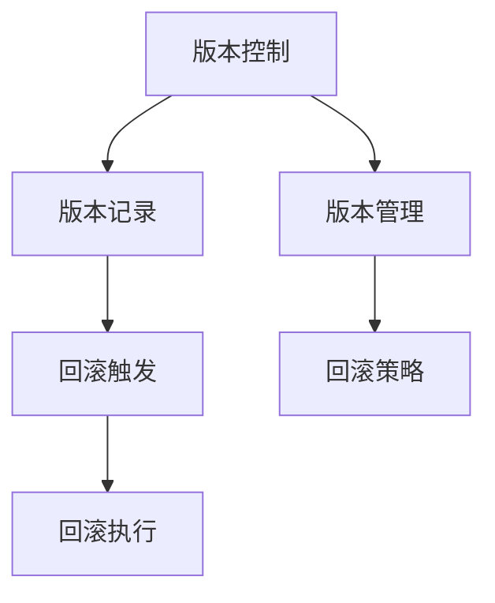

                 

### 文章标题：大模型评测的版本控制与回滚机制

> 关键词：大模型、版本控制、回滚机制、评测、架构设计、稳定性、效率

> 摘要：
本文旨在深入探讨大模型评测中的版本控制与回滚机制，分析其在确保模型评测过程稳定性和效率方面的作用。通过阐述版本控制的核心概念、流程及工具，以及回滚机制的核心概念、流程和工具，本文提供了大模型评测的版本控制与回滚机制的整体架构，并结合实际应用案例进行了详细分析。最后，文章提出了优化策略及未来研究方向，为行业实践提供参考。

## 第1章 整体架构

### 1.1 核心概念与联系

版本控制（Version Control）：版本控制是一种记录和管理文件或数据变更的方法，它确保开发过程中对代码或数据的变化有完整的追踪和历史记录。在模型评测中，版本控制用于跟踪模型的不同版本，以便在需要时能够回滚到之前的版本。

回滚机制（Rollback Mechanism）：回滚机制是一种在模型评测过程中，当检测到性能问题或错误时，能够将模型状态恢复到之前状态的机制。回滚机制通过执行一系列操作，将模型的状态回滚到指定的时间点，从而确保评测过程的稳定性和准确性。

#### 版本控制与回滚机制的关系架构

为了更好地理解版本控制与回滚机制的关系，我们可以通过以下Mermaid流程图来展示它们之间的联系：

### 1.2 架构设计

#### 版本控制模块

版本控制模块是版本控制的核心部分，主要包括以下功能：

1. **版本记录**：记录模型的不同版本信息，包括版本号、创建者、创建时间、修改记录等。
2. **版本管理**：实现对版本的管理操作，如版本备份、恢复、删除等。
3. **版本切换**：在模型评测过程中，可以根据需求切换到不同的版本进行评测。

#### 回滚机制模块

回滚机制模块是确保模型评测稳定性的关键部分，主要包括以下功能：

1. **问题检测**：在模型评测过程中，实时监测模型性能，一旦检测到异常，立即触发回滚机制。
2. **回滚策略**：根据问题的严重程度和类型，选择合适的回滚策略。
3. **回滚执行**：执行回滚操作，将模型状态回滚到指定版本，确保评测的准确性。

### 第2章 大模型评测的版本控制

#### 2.1 版本控制核心概念

1. **版本标识**：版本标识是用于区分不同版本的唯一标识符，如版本号或标签。
2. **版本记录**：版本记录包括模型参数、架构、数据集等关键信息，以及每次修改的详细记录。

#### 2.2 版本控制流程

1. **版本创建**：在模型训练或更新后，创建新版本，并将版本信息记录在版本控制系统中。
2. **版本提交**：开发人员将新版本提交到版本控制系统，供其他团队成员查看和评测。
3. **版本管理**：管理员可以对版本进行备份、恢复、删除等操作，确保版本信息的安全和完整。

#### 2.3 版本控制工具

1. **Git**：Git是一种分布式版本控制系统，适合大型项目和团队合作。
2. **SVN**：SVN是一种集中式版本控制系统，适合小型项目和单用户使用。

### 第3章 大模型评测的回滚机制

#### 3.1 回滚机制核心概念

1. **回滚触发条件**：如模型性能下降、数据泄露等。
2. **回滚策略**：根据问题类型和严重程度，选择合适的回滚策略，如完全回滚、部分回滚等。
3. **回滚执行**：执行回滚操作，将模型状态恢复到指定版本。

#### 3.2 回滚机制流程

1. **问题检测**：通过监控工具实时监测模型性能，一旦发现异常，立即触发回滚机制。
2. **回滚策略选择**：根据问题类型和严重程度，选择合适的回滚策略。
3. **回滚执行**：执行回滚操作，将模型状态恢复到指定版本。

#### 3.3 回滚机制工具

1. **Git**：通过Git的`git revert`和`git reset`命令实现回滚功能。
2. **Shell脚本**：编写Shell脚本自动化执行回滚操作，提高效率。

### 第4章 大模型评测的版本控制与回滚机制应用实例

#### 4.1 实例一：模型性能下降

问题描述：在一次模型评测过程中，发现模型性能显著下降。

解决方案：通过回滚机制，将模型回滚到上一个稳定版本，恢复性能。

#### 4.2 实例二：模型数据泄露

问题描述：在一次模型评测过程中，发现模型存在数据泄露问题。

解决方案：通过回滚机制，将模型回滚到上一个安全版本，避免数据泄露。

### 第5章 大模型评测的版本控制与回滚机制优化

#### 5.1 优化目标

1. 提高版本控制与回滚机制的稳定性与效率。
2. 提升大模型评测过程的可靠性。

#### 5.2 优化策略

1. 使用更先进的版本控制工具，如Git。
2. 优化回滚策略，提高回滚速度和准确性。
3. 引入自动化回滚机制，降低人工干预。

#### 5.3 优化案例

1. 案例一：使用Git进行版本控制与回滚。
2. 案例二：引入自动化回滚脚本提升效率。

### 第6章 总结

#### 6.1 大模型评测的版本控制与回滚机制的重要性

1. 保证模型评测过程的稳定性和可靠性。
2. 提高模型开发和维护的效率。

#### 6.2 未来研究方向

1. 探索更先进的版本控制与回滚技术。
2. 结合大数据和机器学习优化版本控制与回滚机制。

### 附录

#### 附录 A：参考文献

1. ...（列出参考文献）

#### 附录 B：作者介绍

作者：AI天才研究院/AI Genius Institute & 禅与计算机程序设计艺术 /Zen And The Art of Computer Programming

#### 附录 C：致谢

感谢所有参与本文讨论和提供宝贵意见的同行和读者。

