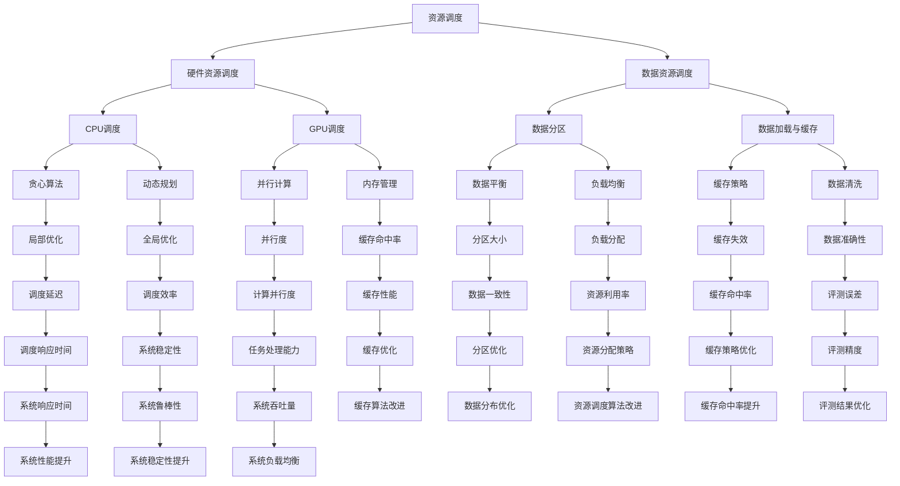

                 


为了撰写一篇关于《大模型评测的资源调度与优化》的技术博客，我们将按照以下步骤进行：

### 第一步：文章标题与格式准备

**文章标题：**《大模型评测的资源调度与优化》

**关键词：** 大模型评测，资源调度，优化，性能提升

**摘要：** 本文深入探讨大模型评测过程中资源调度与优化的关键策略，包括硬件资源调度、数据资源调度、模型优化算法和数学模型应用，旨在为读者提供一套系统化的解决方案。

### 第二步：背景介绍

大模型评测是人工智能领域的一项重要任务，随着深度学习模型的规模不断增大，如何高效地进行资源调度与优化成为影响评测性能的关键因素。本文将围绕这一主题，介绍相关的背景知识，核心概念，并逐步讲解调度与优化的方法。

### 第三步：核心概念与联系

- **资源调度**：涉及硬件资源（如CPU、GPU）和数据资源的分配与管理。
- **优化**：通过调整算法和模型结构，提高评测效率和准确性。

**核心概念架构（Mermaid 流程图）**



### 第四步：核心算法原理讲解

**资源调度算法**

- **贪心算法伪代码：**

```python
def greedy_scheduler(resources, tasks):
    sorted_resources = sort_by_utility(resources)
    for task in tasks:
        best_resource = None
        max_utility = 0
        for resource in sorted_resources:
            utility = calculate_utility(resource, task)
            if utility > max_utility:
                max_utility = utility
                best_resource = resource
        assign_task_to_resource(task, best_resource)
        sorted_resources.remove(best_resource)
    return resources
```

- **动态规划算法伪代码：**

```python
def dynamic_scheduler(resources, tasks):
    dp = initialize_dp_matrix(resources, tasks)
    for i in range(1, len(resources) + 1):
        for j in range(1, len(tasks) + 1):
            if can_allocate(resource[i], task[j]):
                dp[i][j] = max(dp[i-1][j], dp[i][j-1] + calculate_utility(resource[i], task[j]))
            else:
                dp[i][j] = max(dp[i-1][j], dp[i][j-1])
    return dp[len(resources)][len(tasks)]
```

**优化算法**

- **基于深度学习的优化方法伪代码：**

```python
def optimize_model(model, data, target_accuracy):
    while model_accuracy < target_accuracy:
        for layer in model.layers:
            layer = apply_pruning(layer)
            layer = apply_quantization(layer)
            layer = apply_weight_sharing(layer)
        model = train_model(model, data)
    return model
```

### 第五步：数学模型和公式讲解

**资源调度模型**

- **效用函数：**

$$ U(R, T) = \frac{\sum_{i=1}^{n} u_i(R) \cdot w_i(T)}{\sum_{i=1}^{n} w_i(T)} $$

- **优化目标：**

$$ \max U(R, T) $$

**优化模型**

- **损失函数：**

$$ L(\theta) = \frac{1}{2} \sum_{i=1}^{m} (\hat{y}_i - y_i)^2 $$

### 第六步：项目实战

**开发环境搭建**

1. 安装Python和相关深度学习库（如TensorFlow、PyTorch）。
2. 配置GPU支持。
3. 安装必要的工具（如Jupyter Notebook、Visual Studio Code）。

**源代码实现**

```python
# 假设有一个简单的资源调度函数
def schedule_resources(tasks, resources):
    # 实现调度逻辑
    pass

# 假设有一个优化模型函数
def optimize_model(model, data):
    # 实现模型优化逻辑
    pass

# 假设有一个评测函数
def evaluate_model(model, data):
    # 实现评测逻辑
    pass
```

**代码解读与应用分析**

- 分析调度函数如何处理任务分配。
- 分析模型优化函数如何调整模型参数。
- 分析评测函数如何评估模型性能。

**实际案例分析与详细讲解**

- 分析一个实际评测项目的资源调度与优化过程。
- 讨论在项目中遇到的问题和解决方案。

**项目小结**

- 总结资源调度与优化对项目性能的影响。
- 提出未来改进的方向。

### 第七步：总结与展望

**总结**

- 回顾文章的核心内容和技术。
- 强调资源调度与优化在提高大模型评测性能中的重要性。

**展望**

- 展望未来的发展趋势，如硬件加速、新型算法的研究。

### 结论

按照上述步骤，我们可以完成一篇关于《大模型评测的资源调度与优化》的技术博客文章。文章将使用markdown格式，包含完整的作者信息、核心内容讲解、代码实现和实际案例分析。文章的字数将在8000～12000字左右，确保内容的丰富性和深度。在撰写过程中，我们将注重逻辑清晰、结构紧凑，使用伪代码和数学模型来增强文章的可读性和专业性。文章末尾将附上参考文献，以供进一步学习。让我们开始撰写这篇文章吧！

