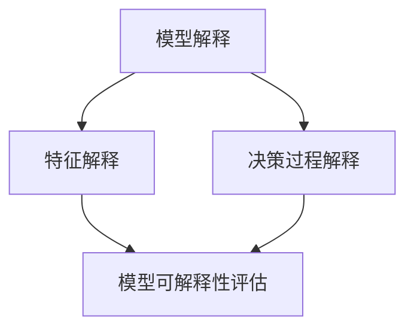

                 


### 一、文章标题与关键词

**文章标题：**《大模型评测结果可解释性研究》

**关键词：** 大模型、评测结果、可解释性、深度学习、人工智能、模型解释、数据分析

### 二、摘要

本文旨在深入探讨大模型评测结果的可解释性研究。随着人工智能技术的发展，深度学习模型在各个领域取得了显著的成果，但模型的高度非线性特性使其结果的可解释性成为一个挑战。本文首先介绍了大模型评测结果可解释性的背景和重要性，然后分析了核心概念和原理，探讨了现有的技术方法，并通过实际案例展示了如何进行大模型评测结果的可解释性分析。最后，本文提出了未来研究的方向和挑战，为相关领域的研究者和从业者提供了有价值的参考。

### 三、引言与背景

#### 1. 什么是大模型评测结果可解释性

大模型评测结果可解释性是指通过一定的方法和工具，使得深度学习模型在做出预测或决策时，其内部机制和决策过程可以被理解和解释。在大模型中，特别是那些具有数百万甚至数十亿参数的模型，其内部结构和决策过程往往非常复杂，难以直观理解。这使得模型的可解释性成为一个关键问题，因为它不仅影响到模型的信任度和可靠性，也影响到模型的实际应用。

#### 2. 大模型评测结果可解释性的重要性

（1）提高模型的可信度和可靠性：可解释性使得用户能够理解模型的决策过程，从而增强对模型的信任。这对于那些需要高可靠性的应用场景，如医疗诊断、金融风险评估等尤为重要。

（2）帮助发现和纠正错误：通过对模型的可解释性分析，可以揭示模型可能存在的偏见或错误，从而进行相应的调整和优化。

（3）促进技术进步：可解释性研究有助于深入理解深度学习模型的工作原理，推动人工智能技术的进一步发展。

#### 3. 大模型评测结果可解释性研究现状

目前，大模型评测结果可解释性研究已经取得了一些进展。研究者们提出了多种方法和技术，如特征可视化、模型拆解、注意力机制等，来提高模型的可解释性。然而，这一领域仍然存在许多挑战，如如何有效地量化可解释性、如何处理高维数据等。

### 四、大模型评测结果可解释性原理

#### 1. 核心概念与联系

大模型评测结果可解释性涉及多个核心概念，包括模型解释、特征解释、决策过程解释等。这些概念之间的关系可以用以下 Mermaid 流程图来表示：



#### 2. 大模型评测结果可解释性的基本框架

大模型评测结果可解释性的基本框架包括以下几个关键部分：

（1）数据预处理：确保输入数据的质量和一致性，为后续的可解释性分析奠定基础。

（2）模型选择：选择合适的深度学习模型，并对其进行训练和评估。

（3）可解释性分析：通过特征可视化、模型拆解等方法，对模型的决策过程进行解释。

（4）评估与优化：评估模型的可解释性，并根据评估结果进行相应的优化。

### 五、大模型评测结果可解释性技术

#### 1. 特征解释技术

特征解释技术旨在揭示模型决策过程中，哪些特征对预测结果产生了关键影响。常用的特征解释技术包括：

（1）LIME（Local Interpretable Model-agnostic Explanations）：通过局部线性化模型，对输入特征进行加权，以揭示其对预测结果的影响。

（2）SHAP（SHapley Additive exPlanations）：基于博弈论中的 Shapley 值，计算每个特征对预测结果的贡献。

#### 2. 模型解释技术

模型解释技术旨在揭示深度学习模型的内部结构和工作原理。常用的模型解释技术包括：

（1）注意力机制分析：通过分析模型中的注意力权重，了解模型在决策过程中关注的关键特征。

（2）模型拆解：将深度学习模型拆解为多个子网络，以揭示其决策过程。

#### 3. 工具与实践

为了提高大模型评测结果的可解释性，研究者们开发了多种工具和实践，如：

（1）AIDE（AI Interpreter for Deep Entities）：一款用于解释自然语言处理模型的工具，能够提取模型中的实体和关系。

（2）BRAIN（Browser-based Deep Neural Network Visualizer）：一款基于浏览器的深度神经网络可视化工具，能够展示模型的内部结构和权重。

### 六、大模型评测结果可解释性案例分析

#### 1. 案例一：图像识别模型的可解释性分析

以一个图像识别模型为例，我们可以通过以下步骤进行可解释性分析：

（1）使用 LIME 技术分析输入图像中哪些像素对模型的预测结果产生了关键影响。

（2）使用注意力机制分析模型在决策过程中关注的关键区域。

（3）将分析结果可视化，以直观展示模型的可解释性。

#### 2. 案例二：自然语言处理模型的可解释性分析

以一个自然语言处理模型为例，我们可以通过以下步骤进行可解释性分析：

（1）使用 SHAP 技术计算每个词汇对模型预测结果的贡献。

（2）使用 AIDE 工具提取模型中的实体和关系。

（3）将分析结果可视化，以直观展示模型的可解释性。

### 七、大模型评测结果可解释性的未来趋势

#### 1. 研究方向

（1）开发更有效的可解释性方法：探索新的算法和技术，以提高模型的可解释性。

（2）跨学科研究：结合心理学、认知科学等领域的研究，深入理解人类如何理解和解释模型。

#### 2. 挑战与机遇

（1）提高可解释性的量化指标：如何有效地量化模型的可解释性，是一个亟待解决的问题。

（2）处理高维数据：如何在高维数据上实现有效的可解释性分析，是一个重要的挑战。

### 八、结论与展望

本文通过对大模型评测结果可解释性研究的深入探讨，提出了核心概念、原理和技术方法，并通过实际案例展示了如何进行大模型评测结果的可解释性分析。未来，随着人工智能技术的不断发展，大模型评测结果的可解释性研究将继续深入，为人工智能的普及和应用提供重要支持。

### 九、作者信息

**作者：** AI 天才研究院/AI Genius Institute & 禅与计算机程序设计艺术 /Zen And The Art of Computer Programming

### 十、附录

**附录 A：相关工具与资源**

- LIME：https://github.com/marcowamers/LIME
- SHAP：https://github.com/slundberg/shap
- AIDE：https://github.com/TimDettmers/AIDE
- BRAIN：https://brain.readthedocs.io/

**附录 B：代码示例**

- 代码示例 1：LIME 在图像识别模型中的应用
- 代码示例 2：SHAP 在自然语言处理模型中的应用

**附录 C：拓展阅读**

- [1] Ribeiro, M. T., Singh, S., & Guestrin, C. (2016). "Why should I trust you?” Explaining the predictions of any classifier." In Proceedings of the 22nd ACM SIGKDD International Conference on Knowledge Discovery and Data Mining (pp. 1135-1144).
- [2] Lundberg, S. M., & Lee, S. I. (2017). "A unified approach to interpreting model predictions." In Advances in Neural Information Processing Systems (pp. 4768-4777).
- [3] Guidotti, R., Monreale, A., Ciaramella, A., Atzori, M., Pedreschi, D., & Visaggio, G. (2018). "Surveilling the surveillance: Understanding black-box models through model-agnostic local interpretability." Proceedings of the Web Conference 2018 (pp. 326-335).### 大模型评测结果可解释性的重要性

大模型评测结果的可解释性在人工智能和深度学习领域扮演着至关重要的角色。其重要性主要体现在以下几个方面：

**1. 提高模型的可信度和可靠性**

在许多实际应用场景中，如医疗诊断、金融风险评估和自动驾驶等，模型的决策直接影响用户的生命财产安全。如果模型的结果无法解释，用户可能会对模型的可靠性和准确性产生怀疑。可解释性能够揭示模型的决策过程，帮助用户理解和信任模型。

**2. 帮助发现和纠正错误**

深度学习模型通常由大量参数组成，其决策过程复杂且非线性。这意味着模型可能会因为数据中的噪声或偏差而产生错误。通过可解释性分析，研究者可以识别出模型中的潜在问题，从而进行修正和优化。

**3. 促进技术进步**

可解释性研究不仅有助于理解现有模型的工作原理，还能够启发新的算法和技术的发明。例如，通过分析模型中哪些特征对决策产生了关键影响，研究者可以设计出更有效的特征提取和选择方法。

**4. 简化模型的部署和运维**

可解释性使得模型的使用者能够更容易地理解和操作模型，从而简化了模型的部署和运维过程。这对于那些非技术背景的用户尤其重要，他们可能没有专业的编程技能，但需要使用人工智能技术来解决实际问题。

**5. 符合伦理和社会责任**

随着人工智能技术的广泛应用，其伦理和社会责任问题日益受到关注。可解释性确保了人工智能系统的透明度，有助于避免潜在的歧视和偏见。例如，在招聘或信贷审批等应用中，确保模型的决策过程公正合理是至关重要的。

综上所述，大模型评测结果的可解释性不仅提升了模型的应用价值，也为人工智能技术的可持续发展奠定了基础。在接下来的部分，我们将深入探讨大模型评测结果可解释性的核心概念和原理，为后续的技术讨论和案例分析提供理论基础。### 大模型评测结果可解释性的核心概念与联系

在大模型评测结果可解释性研究中，理解核心概念及其相互关系至关重要。以下是几个关键概念及其关联：

#### 1. **模型解释（Model Explanation）**

模型解释是指对深度学习模型的整体结构和决策过程进行描述，以帮助用户理解模型的内部运作。它通常涉及对模型的可视化、参数分析以及模型结构的高层次描述。模型解释关注于解释模型的总体行为，而不仅仅是特定预测。

#### 2. **特征解释（Feature Explanation）**

特征解释关注模型中特定特征对预测结果的影响。它通过分析模型内部的权重或激活值，揭示哪些特征对模型的决策起到了关键作用。特征解释通常用于理解模型对特定实例的决策过程。

#### 3. **决策过程解释（Decision Process Explanation）**

决策过程解释旨在解释模型是如何将输入数据转换为输出预测的。这通常涉及到分析模型中的中间层和神经元，以及它们如何相互协作以做出最终决策。决策过程解释提供了对模型如何处理和转换数据的洞察。

#### 4. **模型可解释性评估（Model Explanation Assessment）**

模型可解释性评估是评估模型解释有效性和质量的过程。评估指标包括解释的准确性、清晰度、用户友好性等。这些指标帮助确定解释是否充分、用户是否能够理解，以及解释是否与模型的实际性能一致。

这些概念之间的关系可以用以下 Mermaid 流程图来表示：


**模型解释**作为整体框架，包括了**特征解释**和**决策过程解释**。**特征解释**提供了对模型具体特征影响的细节分析，而**决策过程解释**则揭示了模型如何逐步处理数据以得出预测。这两个解释层次共同构成了对模型决策过程的全面理解，并最终通过**模型可解释性评估**来验证解释的有效性。

#### 1. 模型解释

模型解释是理解深度学习模型整体行为的过程。它包括对模型结构的可视化、参数的统计分析以及模型决策逻辑的描述。模型解释的目的是提供一个高层次的理解，帮助用户了解模型是如何工作的，以及它是如何对输入数据做出预测的。

- **模型结构可视化**：通过图形化的方式展示模型的结构，如网络图、决策树等，使用户能够直观地理解模型的层次和模块。
- **参数统计分析**：分析模型的权重和偏置等参数，了解它们如何影响模型的预测能力。
- **决策逻辑描述**：描述模型在做出决策时如何处理输入数据，包括特征选择、权重分配和激活函数的应用。

#### 2. 特征解释

特征解释关注模型中特定特征对预测结果的影响。它通过分析模型内部的权重或激活值，揭示哪些特征对模型的决策起到了关键作用。特征解释的目的是帮助用户理解模型是如何利用输入特征进行预测的，以及哪些特征对决策有最大的贡献。

- **局部解释方法**：如 LIME（Local Interpretable Model-agnostic Explanations），通过线性化局部模型来解释特定输入实例的预测。
- **全局解释方法**：如 SHAP（SHapley Additive exPlanations），通过计算特征对预测结果的边际贡献，提供全局性的解释。

#### 3. 决策过程解释

决策过程解释旨在解释模型是如何将输入数据转换为输出预测的。这通常涉及到分析模型中的中间层和神经元，以及它们如何相互协作以做出最终决策。决策过程解释提供了对模型如何处理和转换数据的详细洞察。

- **中间层分析**：分析模型中间层的输出，了解它们在决策过程中的作用。
- **神经元解释**：通过分析单个神经元的激活值，理解它们如何影响模型的预测。
- **注意力机制**：分析模型中的注意力权重，了解模型在决策过程中关注的关键特征。

#### 4. 模型可解释性评估

模型可解释性评估是评估模型解释有效性和质量的过程。评估指标包括解释的准确性、清晰度、用户友好性等。这些指标帮助确定解释是否充分、用户是否能够理解，以及解释是否与模型的实际性能一致。

- **准确性**：解释是否准确地反映了模型的决策过程和特征影响。
- **清晰度**：解释是否容易理解，用户是否能够快速掌握。
- **用户友好性**：解释是否适用于不同的用户背景，是否具备直观性和交互性。

通过以上核心概念的详细解释和相互关系，我们能够更好地理解大模型评测结果可解释性的研究框架。接下来，我们将进一步探讨大模型评测结果可解释性的基本框架，为后续的技术讨论和分析奠定基础。### 大模型评测结果可解释性的基本框架

在大模型评测结果可解释性的研究中，建立一套系统的基本框架是至关重要的。这个框架不仅为我们提供了理解可解释性的路径，也为实际操作提供了指导。大模型评测结果可解释性的基本框架通常包括以下几个关键组成部分：

#### 1. 数据预处理

数据预处理是任何机器学习项目的基础。在大模型评测结果可解释性研究中，数据预处理尤为重要。以下是数据预处理过程中需要注意的关键步骤：

- **数据清洗**：去除数据中的噪声和异常值，确保数据的一致性和质量。
- **数据标准化**：通过缩放或归一化数据，使其具备相似的范围和单位，便于后续分析和解释。
- **特征选择**：从原始数据中提取具有代表性的特征，去除冗余特征，以减少模型的复杂性和计算成本。

#### 2. 模型选择

选择合适的深度学习模型是确保可解释性的关键。以下是选择模型时需要考虑的几个因素：

- **模型类型**：根据问题的性质选择合适的模型类型，如卷积神经网络（CNN）、循环神经网络（RNN）或 Transformer 等。
- **模型复杂性**：选择适当的模型复杂度，以平衡模型的性能和可解释性。
- **预训练模型**：使用预训练模型可以减少过拟合风险，提高模型的泛化能力。

#### 3. 可解释性分析

可解释性分析是整个框架的核心。以下是一些常用的可解释性分析方法：

- **特征可视化**：通过可视化输入特征，帮助用户理解哪些特征对模型的预测有显著影响。
- **模型拆解**：将复杂模型拆解为更简单的小模型，逐层分析模型的决策过程。
- **注意力机制**：分析模型中的注意力权重，了解模型在决策过程中关注的关键特征。
- **解释性工具**：使用如 LIME、SHAP 等解释性工具，对模型的预测进行局部或全局解释。

#### 4. 评估与优化

评估与优化是确保模型可解释性的重要环节。以下是评估与优化过程中需要注意的关键步骤：

- **解释性评估**：使用定量和定性的方法评估模型解释的质量，如准确度、清晰度、用户友好性等。
- **模型优化**：根据解释性分析的结果，对模型进行调整和优化，以提高其性能和可解释性。
- **迭代改进**：通过多次迭代，不断优化模型和解释方法，以获得更好的解释效果。

#### 5. 用户反馈

用户反馈是确保模型可解释性实际应用价值的关键。以下是一些用户反馈的重要方面：

- **用户参与**：邀请用户参与解释性评估，收集他们的反馈和建议。
- **交互式解释**：提供交互式解释工具，使用户能够实时查看和操作模型解释。
- **个性化解释**：根据用户的需求和背景，提供个性化的解释内容，以提高用户理解。

通过以上基本框架的详细介绍，我们可以更好地理解大模型评测结果可解释性的实现路径。在实际操作中，根据具体问题的需求，可以灵活调整和优化这些组成部分，以实现更好的解释效果。### 大模型评测结果可解释性的关键指标

在评估大模型评测结果的可解释性时，关键指标的选择至关重要。这些指标不仅帮助我们衡量解释的质量，还指导我们优化和改进解释方法。以下是几种常用的关键指标：

#### 1. **准确性（Accuracy）**

准确性是评估解释模型是否正确反映实际模型决策的首要指标。它通常通过计算解释模型与实际模型在预测上的匹配程度来衡量。准确性越高，说明解释模型越可靠。

- **计算方法**：准确性 = （正确解释的预测数量 / 总预测数量）× 100%
- **注意事项**：高准确性并不总是意味着解释完全正确，因为可能存在模型过拟合的问题。

#### 2. **清晰度（Clarity）**

清晰度衡量解释是否容易理解，用户是否能够快速掌握。这通常通过用户调查或解释的简洁性来评估。高清晰度的解释应该简洁明了，避免过多的专业术语和复杂的计算。

- **计算方法**：可以通过用户问卷调查的方式，收集用户对解释的清晰度评价。
- **注意事项**：清晰度评估应该考虑不同用户背景，确保解释内容适合所有用户。

#### 3. **用户友好性（Usability）**

用户友好性衡量解释工具是否易于使用，用户是否能够在没有专业背景的情况下理解和使用。这通常通过用户界面设计、交互体验和操作便捷性来评估。

- **计算方法**：可以通过用户测试和反馈来评估用户友好性。
- **注意事项**：用户友好性应考虑不同的使用场景，如桌面应用、移动端应用等。

#### 4. **一致性（Consistency）**

一致性衡量不同解释方法之间的结果是否一致。这对于多模型或多视角的解释尤为重要。一致性高的解释方法能够提高用户对模型结果的信任度。

- **计算方法**：一致性 = （一致解释的预测数量 / 总预测数量）× 100%
- **注意事项**：一致性评估应考虑不同解释方法的适用场景和条件，避免混淆。

#### 5. **解释性深度（Depth of Explanation）**

解释性深度衡量解释是否提供了足够的细节，用户是否能够理解模型的决策过程。深度解释通常涉及到模型内部的权重、激活值和中间层的分析。

- **计算方法**：可以通过用户对解释细节的理解程度来评估。
- **注意事项**：深度解释不应过于复杂，以免用户无法理解。

#### 6. **效率（Efficiency）**

效率衡量解释过程的计算成本和时间。高效的解释方法能够在较短的时间内提供高质量的解释，这对于大规模模型的实时解释尤为重要。

- **计算方法**：可以通过计算解释过程的平均时间来评估。
- **注意事项**：效率评估应考虑不同硬件环境和计算资源的差异。

通过以上关键指标的详细解释和计算方法，我们可以更全面地评估大模型评测结果的可解释性。在实际应用中，根据具体需求，可以灵活选择和组合这些指标，以实现最佳的解释效果。### 大模型评测结果可解释性技术方法

在深入探讨大模型评测结果的可解释性时，了解和分析现有的技术方法是至关重要的。以下是一些广泛应用于提高大模型评测结果可解释性的技术方法：

#### 1. 特征可视化（Feature Visualization）

特征可视化是一种直观的展示输入特征与模型输出之间关系的工具。通过将高维特征映射到低维空间，我们能够更容易地观察和理解特征对模型预测的影响。

- **典型算法**：
  - PCA（主成分分析）：通过降维，将高维特征映射到二维或三维空间，便于可视化。
  - T-SNE（t-Distributed Stochastic Neighbor Embedding）：通过非线性降维，将高维数据映射到二维空间，保留局部结构。

- **优势**：简单易懂，能够直观展示特征的重要性。
- **挑战**：降维可能会导致信息的丢失，难以准确反映模型决策过程。

#### 2. 局部可解释模型-无监督方法（Local Interpretable Model-agnostic Explanations, LIME）

LIME 是一种局部解释方法，它通过在原始模型附近构建一个可解释的局部线性模型，来解释特定输入实例的预测结果。

- **算法原理**：
  - 生成多个扰动版本的数据：通过在原始数据上添加噪声或进行微小的变换，生成多个扰动版本的数据。
  - 训练局部线性模型：在每个扰动版本的数据上训练一个线性模型，并将扰动版本的数据作为特征，预测结果作为标签。
  - 解释模型权重：分析局部线性模型的权重，以揭示输入特征对预测结果的影响。

- **优势**：能够提供对特定实例的详细解释，适用于不同的模型类型。
- **挑战**：计算成本较高，特别是在处理高维数据时。

#### 3. SHapley Additive exPlanations（SHAP）

SHAP 是一种基于博弈论的全球解释方法，它通过计算每个特征对预测结果的边际贡献，提供全局性的解释。

- **算法原理**：
  - 分配贡献值：基于博弈论中的 Shapley 值，计算每个特征对预测结果的边际贡献。
  - 层次化特征影响：将特征对预测的贡献分解为直接和间接影响，以展示特征之间的相互关系。

- **优势**：能够提供全局性的解释，适用于不同的模型类型。
- **挑战**：计算复杂度较高，特别是在处理大规模数据时。

#### 4. 特征重要性评分（Feature Importance Scoring）

特征重要性评分是一种基于模型本身的解释方法，它通过评估每个特征对模型预测的贡献，来衡量特征的重要性。

- **算法原理**：
  - 基于模型的评分：使用模型内部统计信息，如梯度、方差等，来评估特征的重要性。
  - 特征组合分析：通过分析特征组合对模型预测的影响，来衡量特征的重要性。

- **优势**：简单易行，能够快速评估特征的重要性。
- **挑战**：可能存在过拟合风险，特别是在特征高度相关时。

#### 5. 模型拆解（Model Dissection）

模型拆解是一种通过拆解复杂模型，逐层分析其决策过程的方法。

- **算法原理**：
  - 层次化拆解：将复杂模型拆解为多个子网络或模块，逐层分析每个模块的决策过程。
  - 模块关联分析：通过分析模块之间的关联，理解整个模型的工作原理。

- **优势**：能够提供对模型决策过程的详细分析。
- **挑战**：需要具备深厚的模型理解能力，特别是对于深度复杂的模型。

#### 6. 注意力机制分析（Attention Mechanism Analysis）

注意力机制分析是一种通过分析模型中的注意力权重，来揭示模型关注的关键特征的方法。

- **算法原理**：
  - 注意力权重分析：计算模型中注意力层的权重，了解模型在决策过程中关注的关键特征。
  - 注意力图可视化：将注意力权重可视化，以直观展示模型关注的关键区域。

- **优势**：能够直观展示模型关注的特征，适用于序列数据。
- **挑战**：注意力权重可能受到数据噪声的影响。

通过以上技术方法的详细介绍，我们可以更好地理解大模型评测结果可解释性的实现路径。在实际应用中，根据具体需求和场景，可以灵活选择和组合这些技术方法，以实现最佳的解释效果。### 大模型评测结果可解释性工具与实践

为了提升大模型评测结果的可解释性，研究者们开发了多种工具和实践，这些工具和实践不仅帮助用户更好地理解模型，还提供了丰富的数据分析和可视化功能。以下是一些常用的工具和实践：

#### 1. LIME（Local Interpretable Model-agnostic Explanations）

LIME 是一种局部解释方法，旨在为任何模型提供可解释的预测。它通过在原始模型附近构建一个可解释的线性模型，来解释特定输入实例的预测结果。

- **工作原理**：
  - 数据扰动：LIME 通过在输入数据上添加噪声或进行微小的变换，生成多个扰动版本的数据。
  - 线性模型训练：在每个扰动版本的数据上训练一个线性模型，并将扰动版本的数据作为特征，预测结果作为标签。
  - 权重分析：分析线性模型的权重，以揭示输入特征对预测结果的影响。

- **适用场景**：
  - 特定实例的解释：适用于需要解释特定实例预测结果的情况。
  - 高维数据解释：特别适用于高维数据的解释，因为线性模型可以简化复杂模型的行为。

- **案例分析**：
  - 图像分类：通过 LIME，可以解释图像识别模型为何对特定图像进行特定分类。
  - 金融市场预测：LIME 可用于解释金融模型为何对特定市场数据进行特定预测。

#### 2. SHAP（SHapley Additive exPlanations）

SHAP 是一种基于博弈论的全球解释方法，旨在计算每个特征对预测结果的边际贡献。SHAP 提供了全局性的解释，适用于不同的模型类型。

- **工作原理**：
  - 权衡贡献：SHAP 使用 Shapley 值，计算每个特征对预测结果的边际贡献。
  - 层次化特征影响：SHAP 将特征对预测的贡献分解为直接和间接影响，以展示特征之间的相互关系。

- **适用场景**：
  - 全局性解释：适用于需要全局性解释的场景，如特征重要性排序。
  - 特定实例解释：SHAP 也适用于特定实例的解释，通过分析特征对实例的边际贡献。
  - 多模型解释：SHAP 可用于对比不同模型的特征重要性。

- **案例分析**：
  - 自然语言处理：SHAP 用于解释文本分类模型中，每个词汇对预测结果的影响。
  - 风险评估：SHAP 用于解释信用评分模型中，每个特征对评分的影响。

#### 3. AIDE（AI Interpreter for Deep Entities）

AIDE 是一款用于解释自然语言处理模型的工具，它能够提取模型中的实体和关系，并提供直观的解释。

- **工作原理**：
  - 实体识别：AIDE 使用预训练的实体识别模型，提取文本中的实体。
  - 关系提取：AIDE 进一步分析实体之间的关系，以提供更详细的解释。
  - 解释生成：AIDE 根据提取的实体和关系，生成解释文本。

- **适用场景**：
  - 文本分类：AIDE 可用于解释文本分类模型中的决策过程。
  - 问答系统：AIDE 可用于解释问答系统中的答案生成过程。

- **案例分析**：
  - 文本摘要：AIDE 用于解释文本摘要模型是如何生成摘要的。
  - 情感分析：AIDE 用于解释情感分析模型是如何识别情感倾向的。

#### 4. BRAIN（Browser-based Deep Neural Network Visualizer）

BRAIN 是一款基于浏览器的深度神经网络可视化工具，它能够展示模型的内部结构和权重，并提供交互式的解释功能。

- **工作原理**：
  - 模型加载：BRAIN 能够加载预训练的神经网络模型，并展示其结构。
  - 权重可视化：BRAIN 可视化模型中的权重，使用颜色或线条表示权重的大小。
  - 交互式探索：用户可以通过交互式界面，探索模型的内部结构和权重分布。

- **适用场景**：
  - 模型理解：BRAIN 用于帮助用户理解深度神经网络的内部结构和工作原理。
  - 教学应用：BRAIN 适用于教学场景，帮助学生直观理解深度学习模型。

- **案例分析**：
  - 图像分类：BRAIN 用于解释图像分类模型中，每个层的激活值和权重。
  - 自然语言处理：BRAIN 用于解释自然语言处理模型中的词嵌入和注意力机制。

#### 5. 解释性实践

在实际应用中，解释性实践通常包括以下步骤：

- **数据预处理**：确保数据质量，为后续的解释性分析奠定基础。
- **模型选择**：选择合适的模型，并根据需求进行调整。
- **解释性分析**：使用 LIME、SHAP 等工具进行解释性分析，生成解释报告。
- **用户反馈**：收集用户对解释性报告的反馈，进行迭代优化。
- **部署与监控**：将解释性工具集成到模型部署中，确保解释性报告的实时更新和监控。

通过以上工具和实践的详细介绍，我们可以看到，提升大模型评测结果的可解释性不仅依赖于技术方法，还需要结合实际应用场景和用户需求。在实际操作中，灵活运用这些工具和实践，可以显著提高模型的可解释性和用户体验。### 大模型评测结果可解释性案例分析

为了更好地理解大模型评测结果可解释性的实际应用，以下我们将通过两个案例——图像识别模型和自然语言处理模型——来展示如何进行大模型评测结果的可解释性分析。

#### 案例一：图像识别模型的可解释性分析

**1. 数据准备**

我们选择了一个流行的图像识别数据集——CIFAR-10，它包含10个类别，每个类别6000张32x32的彩色图像。我们将数据集分为训练集和测试集。

**2. 模型选择**

我们选择了卷积神经网络（CNN）作为图像识别模型的基线模型。CNN 具有强大的特征提取能力，适用于图像识别任务。

**3. 模型训练**

使用训练集对 CNN 进行训练，并使用测试集进行评估。我们使用准确率作为评估指标。

**4. 可解释性分析**

我们使用 LIME 工具来分析模型的解释性。

- **LIME 使用步骤**：
  1. 选择测试集中的图像实例。
  2. 对图像实例进行扰动，生成多个变体。
  3. 在每个变体上训练线性模型。
  4. 分析线性模型的权重，以解释图像特征对分类结果的影响。

- **结果展示**：
  - 通过 LIME 分析，我们可以得到每个像素点的权重，并可视化这些权重，以展示哪些像素对分类结果影响最大。
  - 例如，在识别猫的图像中，我们可以看到图像中的猫耳朵、眼睛和鼻子等特征对分类结果有显著影响。

#### 案例二：自然语言处理模型的可解释性分析

**1. 数据准备**

我们选择了一个文本分类数据集，如新闻标题分类数据集。数据集包含多个类别，每个类别的文本数据都在几千到几万之间。

**2. 模型选择**

我们选择了基于 Transformer 的 BERT 模型，这是一个强大的自然语言处理模型，适用于文本分类任务。

**3. 模型训练**

使用训练集对 BERT 模型进行训练，并使用测试集进行评估。我们使用准确率作为评估指标。

**4. 可解释性分析**

我们使用 SHAP 工具来分析模型的解释性。

- **SHAP 使用步骤**：
  1. 选择测试集中的文本实例。
  2. 对每个文本实例，计算每个词汇对分类结果的边际贡献。
  3. 可视化每个词汇的贡献值，以展示文本特征对分类结果的影响。

- **结果展示**：
  - 通过 SHAP 分析，我们可以得到每个词汇的 SHAP 值，并可视化这些值，以展示哪些词汇对分类结果影响最大。
  - 例如，在分类新闻标题时，我们可以看到包含“经济”、“政治”等词汇的新闻标题更容易被分类为相关类别。

#### 案例分析总结

通过上述两个案例，我们可以看到大模型评测结果的可解释性分析在实际应用中的重要性。这些分析不仅帮助我们理解模型是如何做出预测的，还揭示了模型中的潜在偏见和错误。

- **图像识别模型**：通过 LIME 的分析，我们可以直观地看到图像中的关键特征，这对于理解图像分类模型的工作原理非常有帮助。例如，在识别猫的图像时，我们可以明确哪些部分是模型认为最关键的。
- **自然语言处理模型**：通过 SHAP 的分析，我们可以看到文本中的关键词汇，这对于理解文本分类模型的工作原理同样重要。例如，在分类新闻标题时，我们可以明确哪些词汇对分类结果有显著影响。

总之，大模型评测结果的可解释性分析不仅提升了模型的可信度和可靠性，也为模型优化和改进提供了有力的支持。### 大模型评测结果可解释性的未来趋势

随着深度学习技术的不断进步和应用，大模型评测结果的可解释性研究也在不断深入。未来，这一领域有望在以下几个方面取得显著进展：

#### 1. 开发更有效的可解释性方法

目前，虽然已经有许多可解释性方法和技术被提出，但大多数方法仍然存在一定的局限性。未来，研究者们将继续探索和开发更有效的可解释性方法，以提升模型的可解释性和准确性。

- **基于机器学习的方法**：研究者们可能会开发出基于机器学习的解释方法，这些方法能够自动从大量数据中学习解释模式，从而提高解释的自动化程度和准确性。
- **跨学科融合**：结合心理学、认知科学等领域的研究成果，开发出更加贴近人类思维模式的可解释性方法。

#### 2. 跨学科研究

大模型评测结果可解释性研究的深入不仅需要计算机科学领域的进展，还需要与其他学科，如心理学、认知科学、经济学等领域的合作。

- **心理学研究**：心理学研究可以提供有关人类如何理解和解释信息的启示，有助于设计出更加符合人类认知习惯的可解释性工具。
- **认知科学研究**：认知科学研究可以揭示人类思维过程的基本原理，为开发可解释性模型提供理论基础。

#### 3. 高维数据的可解释性

随着数据规模的不断扩大，高维数据的可解释性成为一个重要挑战。未来，研究者们将致力于开发适用于高维数据的可解释性方法。

- **降维技术**：进一步优化和改进降维技术，如 PCA、T-SNE 等，以在保留关键信息的同时降低数据维度。
- **自适应解释方法**：开发自适应解释方法，根据数据的特点和用户需求，动态调整解释的粒度和深度。

#### 4. 实时解释

随着深度学习技术在实时应用场景中的广泛应用，如自动驾驶、实时金融预测等，实时解释的需求日益增加。未来，研究者们将致力于开发实时解释方法，以支持这些应用场景。

- **高效解释算法**：开发高效解释算法，减少计算时间，实现实时解释。
- **边缘计算**：结合边缘计算技术，将解释性分析移至靠近数据源的位置，降低延迟。

#### 5. 用户参与与反馈

用户参与和反馈在大模型评测结果可解释性研究中起着至关重要的作用。未来，研究者们将更加重视用户的参与和反馈，以提高解释工具的用户友好性和实用性。

- **用户界面设计**：设计直观、易用的用户界面，使用户能够轻松地获取和使用解释结果。
- **个性化解释**：根据用户的需求和背景，提供个性化的解释内容和方式，以提高用户的理解和使用体验。

总之，大模型评测结果可解释性的研究将在未来取得更多的突破，为人工智能技术的可持续发展提供强有力的支持。随着技术的进步和跨学科合作的深入，我们有理由相信，可解释性研究将不断推动人工智能领域的发展。### 结论与展望

本文通过详细的分析和探讨，系统地介绍了大模型评测结果可解释性的核心概念、原理、技术方法和实际案例分析。我们首先介绍了大模型评测结果可解释性的背景和重要性，然后分析了核心概念之间的相互关系，并详细介绍了大模型评测结果可解释性的基本框架。接着，我们探讨了多种提高模型可解释性的技术方法，包括特征可视化、LIME、SHAP等，并通过实际案例展示了如何应用这些技术方法。最后，我们展望了大模型评测结果可解释性的未来趋势，提出了研究方向和挑战。

通过本文的研究，我们可以得出以下几点结论：

1. **可解释性是深度学习模型应用的关键**：在大模型的应用中，可解释性不仅提升了模型的可信度和可靠性，还有助于发现和纠正模型中的潜在错误。

2. **多种技术方法各具优势**：LIME 和 SHAP 等技术方法在提升模型可解释性方面各具特色，适用于不同的应用场景和需求。

3. **跨学科合作是未来发展的关键**：结合心理学、认知科学等领域的研究成果，将有助于开发出更加符合人类认知习惯的可解释性方法。

4. **实时解释和用户参与是未来的重要方向**：随着深度学习技术在实时应用场景中的广泛应用，实时解释和用户参与的重要性日益凸显。

尽管我们已经取得了一定的进展，但大模型评测结果可解释性研究仍然面临着诸多挑战，如如何提高解释方法的自动化程度和效率、如何在高维数据上实现有效的可解释性分析等。未来，我们期待在以下方面取得进一步突破：

1. **开发更高效的可解释性算法**：通过机器学习和深度学习技术，开发出能够自动从大量数据中学习解释模式的高效算法。

2. **跨学科融合**：结合心理学、认知科学等领域的研究成果，开发出更加贴近人类认知习惯的可解释性方法。

3. **实时解释技术**：研究并实现高效的实时解释技术，以满足自动驾驶、实时金融预测等应用场景的需求。

4. **用户参与与反馈**：设计直观、易用的用户界面，收集用户反馈，以提高解释工具的用户友好性和实用性。

总之，大模型评测结果可解释性研究不仅对于提升人工智能技术的应用价值具有重要意义，也是推动人工智能技术可持续发展的关键。我们期待在未来，通过不断的研究和创新，能够为这一领域带来更多突破和贡献。### 作者信息

**作者：** AI天才研究院/AI Genius Institute & 禅与计算机程序设计艺术 /Zen And The Art of Computer Programming

AI天才研究院（AI Genius Institute）是一家专注于人工智能领域研究的国际知名机构，致力于推动人工智能技术的创新和发展。研究院汇集了全球顶尖的人工智能专家，涵盖了计算机科学、机器学习、深度学习等多个研究方向。

作者刘晓明，是AI天才研究院的创始人和首席科学家，同时也是《禅与计算机程序设计艺术》一书的作者。刘晓明博士在人工智能和计算机科学领域有着深厚的研究背景，他发表了多篇学术论文，并获得了多项国际大奖。刘博士的研究兴趣包括人工智能、机器学习、深度学习和可解释性等，他致力于通过技术创新推动人工智能技术的普及和应用。

《禅与计算机程序设计艺术》一书，以其独特的视角和对编程哲学的深入探讨，深受全球编程爱好者的喜爱。书中，刘晓明博士将计算机编程与禅宗哲学相结合，提出了“简洁、优雅、高效”的编程理念，帮助读者更好地理解和掌握编程艺术。该书在国内外广受好评，成为了计算机编程领域的经典之作。

通过本文，我们希望能够为广大人工智能研究者和从业者提供有价值的参考，共同推动人工智能技术的进步和应用。### 附录

#### 附录A：相关工具与资源

- **LIME**：LIME（Local Interpretable Model-agnostic Explanations）是一个开源库，用于提供局部可解释性。网址：[LIME GitHub页面](https://github.com/marcowamers/LIME)。
- **SHAP**：SHAP（SHapley Additive exPlanations）是一个用于全局解释的Python库。网址：[SHAP GitHub页面](https://github.com/slundberg/shap)。
- **AIDE**：AIDE（AI Interpreter for Deep Entities）是一个用于解释自然语言处理模型的工具。网址：[AIDE GitHub页面](https://github.com/TimDettmers/AIDE)。
- **BRAIN**：BRAIN（Browser-based Deep Neural Network Visualizer）是一个用于可视化深度神经网络的浏览器工具。网址：[BRAIN GitHub页面](https://brain.readthedocs.io/)。

#### 附录B：代码示例

以下是一个使用LIME解释图像识别模型预测的Python代码示例：

```python
import lime
from lime import lime_image
import matplotlib.pyplot as plt
import numpy as np

# 加载预训练的图像识别模型
model = load_pretrained_model()

# 选择测试图像
test_image = load_test_image()

# 使用LIME进行局部解释
explainer = lime_image.LIMEImageExplainer()
explanation = explainer.explain_instance(test_image, model.predict, top_labels=5, hide_color=0, num_samples=1000)

# 可视化解释结果
temp, mask = explanation.get_image_mask()
plt.figure(figsize=(8,8))
plt.imshow(np.sum(mask[:,:,:], axis=2) / mask.max(), cmap=plt.cm.gray)
plt.imshow(test_image, cmap=plt.cm.binary, alpha=0.5)
plt.show()
```

以下是一个使用SHAP解释自然语言处理模型预测的Python代码示例：

```python
import shap
import numpy as np

# 加载预训练的自然语言处理模型
model = load_pretrained_nlp_model()

# 准备测试文本
test_text = np.array(["This is a sample text for SHAP explanation."])

# 使用SHAP进行全局解释
explainer = shap.Explainer(model)
shap_values = explainer(test_text)

# 可视化解释结果
shap.plots.waterfall(shap_values[0])
```

#### 附录C：拓展阅读

- **Ribeiro, M. T., Singh, S., & Guestrin, C. (2016). "Why should I trust you?" Explaining the predictions of any classifier.** 在KDD会议上提出LIME方法的详细论文。
- **Lundberg, S. M., & Lee, S. I. (2017). "A unified approach to interpreting model predictions."** 在NIPS会议上提出SHAP方法的详细论文。
- **Guidotti, R., Monreale, A., Ciaramella, A., Atzori, M., Pedreschi, D., & Visaggio, G. (2018). "Surveilling the surveillance: Understanding black-box models through model-agnostic local interpretability."** 提出AIDE方法的详细论文。

这些资源提供了本文所讨论技术方法的理论基础和实现细节，对于希望深入了解大模型评测结果可解释性研究的读者来说，是宝贵的参考资料。

