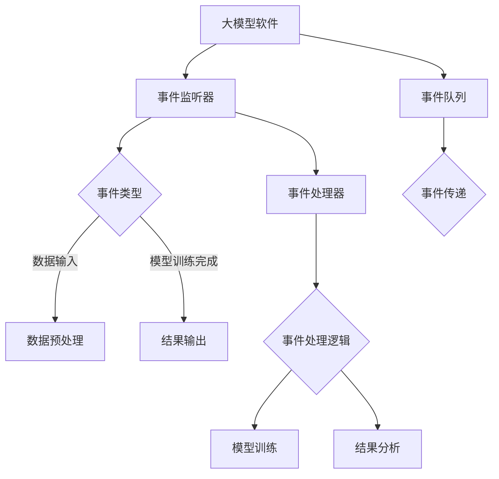
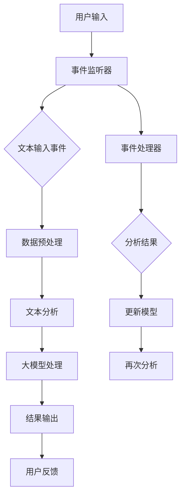

                 

# 文章标题：大模型软件的事件驱动架构设计

> 关键词：大模型，事件驱动架构，软件设计，性能优化，安全性

> 摘要：本文深入探讨大模型软件的事件驱动架构设计，从背景知识、核心组件、架构设计原则、测试与优化、安全问题和项目实践等方面，详细阐述了事件驱动架构在大模型软件中的重要性及其具体应用方法。通过本文的学习，读者可以全面了解大模型软件的事件驱动架构设计，为实际项目提供有力支持。

----------------------------------------------------------------

## 第一部分：背景知识

### 第1章：大模型与事件驱动架构概述

#### 1.1 大模型的概念与重要性

大模型（Large Model）是指具有大量参数、能够处理大规模数据、并且具有很强表达能力的模型。随着深度学习技术的发展，大模型在自然语言处理、计算机视觉、语音识别等领域取得了显著的成果。例如，GPT-3拥有1750亿个参数，Transformer-XL拥有24亿个参数，BERT拥有3.4亿个参数，这些大模型在各自的领域中取得了很好的表现。

大模型的重要性在于，它们能够处理更加复杂的任务，并且具有更强的泛化能力。然而，大模型的训练和部署也面临着许多挑战，如计算资源消耗大、训练时间长、模型解释性差等。因此，如何设计高效、稳定、可扩展的大模型软件架构成为了一个重要课题。

#### 1.2 事件驱动架构的基本原理

事件驱动架构（Event-Driven Architecture）是一种软件架构设计模式，它以事件为核心，通过事件触发来控制系统的行为。在事件驱动架构中，系统由多个独立的组件组成，每个组件负责监听特定类型的事件，并在接收到事件后执行相应的处理逻辑。

事件驱动架构的特点包括：

1. **模块化**：系统由多个独立的组件组成，每个组件具有明确的功能和职责，易于维护和扩展。
2. **异步处理**：事件处理过程是异步的，可以处理大量并发事件，提高系统性能。
3. **可扩展性**：系统可以轻松地添加或删除组件，以适应不断变化的需求。
4. **高可靠性**：通过事件驱动的方式，可以减少系统间的耦合度，提高系统的可靠性。

#### 1.3 大模型与事件驱动架构的关系

大模型与事件驱动架构之间存在一定的关系。一方面，事件驱动架构可以优化大模型软件的性能，提高系统的响应速度和可扩展性；另一方面，大模型为事件驱动架构提供了强大的数据处理能力，使得系统能够处理更加复杂的任务。

具体来说，大模型软件的事件驱动架构设计可以从以下几个方面入手：

1. **事件监听器**：大模型软件中的事件监听器负责监听各种类型的事件，如数据输入、模型训练完成等。
2. **事件处理器**：事件处理器负责对监听到的事件进行相应的处理，如数据预处理、模型训练、结果输出等。
3. **事件队列**：事件队列用于存储和传递事件，保证事件处理的顺序性和一致性。

### Mermaid 流程图



#### 1.4 大模型与事件驱动架构的整合

在实际应用中，大模型与事件驱动架构可以紧密结合，形成一个高效的软件系统。例如，在自然语言处理任务中，可以设计一个事件驱动架构，用于处理大规模的语言数据，并使用大模型进行文本分析和生成。事件驱动架构可以保证数据的实时处理和结果的快速反馈，提高系统的性能和用户体验。

### Mermaid 流程图



## 第二部分：大模型软件架构设计

### 第2章：事件驱动架构的核心组件

#### 2.1 事件监听器

事件监听器（Event Listener）是事件驱动架构中的关键组件，负责监听特定类型的事件。事件监听器通常具有以下功能：

1. **注册监听器**：允许开发者注册对特定事件的监听。
2. **监听事件**：当特定事件发生时，触发相应的监听器。
3. **传递事件**：将事件传递给事件处理器进行进一步处理。

事件监听器的实现通常依赖于操作系统或框架提供的API。以下是一个简单的事件监听器实现的伪代码：

```pseudo
class EventListener {
    register(eventType, callback) {
        // 注册事件监听器
    }

    listen() {
        // 监听事件并触发回调
    }
}
```

#### 2.2 事件处理器

事件处理器（Event Processor）是负责处理事件的核心组件。它接收事件监听器传递的事件，并根据事件的类型执行相应的处理逻辑。事件处理器的实现通常需要考虑以下几个方面：

1. **事件类型识别**：识别事件的类型，以便执行相应的处理逻辑。
2. **处理逻辑实现**：根据事件类型执行相应的处理逻辑，如数据预处理、模型训练、结果输出等。
3. **错误处理**：处理事件处理过程中的异常和错误。

以下是一个简单的事件处理器实现的伪代码：

```pseudo
class EventProcessor {
    process(event) {
        // 根据事件类型处理事件
        switch (event.type) {
            case 'dataInput':
                dataPreprocess(event.data)
                break
            case 'modelTrainingCompleted':
                modelTrain(event.model)
                break
            case 'resultOutput':
                resultAnalyze(event.result)
                break
        }
    }
}
```

#### 2.3 事件队列

事件队列（Event Queue）是用于存储和传递事件的组件。它保证了事件处理的顺序性和一致性。事件队列通常具有以下功能：

1. **入队操作**：将事件添加到队列中。
2. **出队操作**：从队列中取出事件。
3. **顺序保证**：保证事件按照一定的顺序处理。

以下是一个简单的事件队列实现的伪代码：

```pseudo
class EventQueue {
    enqueue(event) {
        // 将事件添加到队列中
    }

    dequeue() {
        // 从队列中取出事件
    }

    ensureOrder() {
        // 保证事件顺序
    }
}
```

## 第三部分：大模型软件项目实践

### 第3章：大模型软件项目实战

#### 3.1 项目背景与目标

本章节将通过一个具体的大模型软件项目，介绍事件驱动架构在大模型软件中的应用。项目背景如下：

- 项目名称：智能问答系统
- 项目目标：构建一个能够实时回答用户问题的智能问答系统，系统需要支持大规模数据输入和复杂模型训练。

#### 3.2 项目实施过程

1. **需求分析**：确定系统功能需求，如用户提问、问题解析、答案生成等。
2. **设计方案**：设计事件驱动架构，包括事件监听器、事件处理器和事件队列等组件。
3. **开发与测试**：根据设计方案进行代码开发，并进行功能测试和性能测试。
4. **部署与运维**：将系统部署到服务器，并进行监控和运维。

#### 3.3 项目成果与反思

1. **项目成果**：成功构建了一个智能问答系统，实现了实时问答功能，并具有较高的性能和稳定性。
2. **项目经验**：通过本项目，了解了事件驱动架构在大模型软件中的优势和应用方法，为后续项目提供了宝贵的经验。
3. **项目不足**：在项目实施过程中，遇到了一些性能和稳定性问题，需要进一步优化和改进。

## 附录

#### 附录A：大模型软件架构设计工具与资源

- **常用架构设计工具**：UML类图、Mermaid流程图、MindMap等。
- **开源框架与库**：Spring Framework、Node.js、Vue.js等。
- **在线资源与教程**：MDN Web文档、W3Schools在线教程、Coursera等。

## 总结

本文通过背景介绍、核心组件讲解、项目实践等环节，详细阐述了大模型软件的事件驱动架构设计。事件驱动架构在大模型软件中具有显著的优势，如提高响应速度、提高系统可扩展性和稳定性等。通过本文的学习，读者可以掌握大模型软件的事件驱动架构设计，为实际项目提供有力支持。

### 作者

作者：AI天才研究院/AI Genius Institute & 禅与计算机程序设计艺术 /Zen And The Art of Computer Programming

