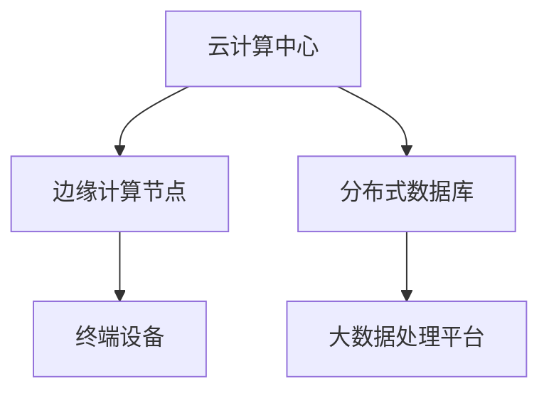
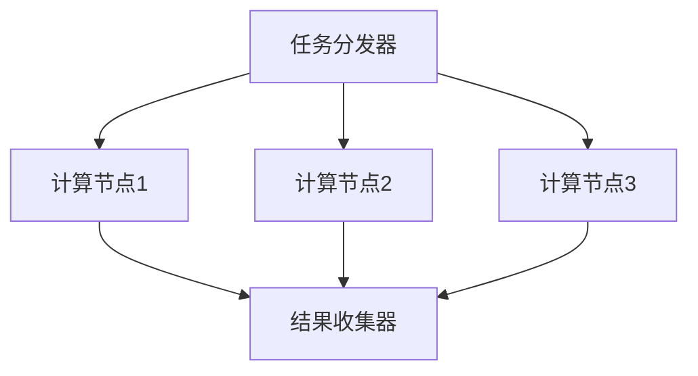

                 


## 文章标题

《大模型软件的云边协同架构设计策略》

## 文章关键词

- 大模型软件
- 云计算
- 边缘计算
- 协同架构
- 软件设计
- 架构优化

## 文章摘要

本文旨在探讨大模型软件在云计算和边缘计算环境下的协同架构设计策略。随着深度学习和人工智能领域的快速发展，大模型软件对计算资源和数据处理的依赖日益增强。为了满足这些需求，本文将分析云计算和边缘计算的基本原理，探讨二者协同工作的优势和挑战，并提出一系列设计策略，以优化大模型软件的架构性能。通过实践案例和具体实现，我们将展示如何将理论与实践相结合，实现高效、可靠的大模型软件部署。

## 目录

1. **背景介绍**  
   1.1 深度学习与人工智能的发展  
   1.2 大模型软件的需求背景  
   1.3 云计算与边缘计算的基本概念

2. **核心概念与联系**  
   2.1 云计算与边缘计算的关系架构  
   2.2 大模型软件与云计算、边缘计算的融合

3. **核心算法原理讲解**  
   3.1 分布式计算框架  
   3.2 边缘计算模型

4. **数学模型与公式**  
   4.1 云计算资源调度模型  
   4.2 边缘计算网络延迟模型

5. **项目实战**  
   5.1 开发环境搭建  
   5.2 源代码实现与解读  
   5.3 代码应用解读与分析  
   5.4 实际案例分析与讲解

6. **最佳实践与注意事项**  
   6.1 性能优化策略  
   6.2 安全性保障措施

7. **小结与拓展阅读**

## 背景介绍

### 1.1 深度学习与人工智能的发展

近年来，深度学习和人工智能（AI）领域取得了飞速发展。深度学习作为人工智能的核心技术之一，通过神经网络模型对大量数据进行训练，从而实现图像识别、自然语言处理、语音识别等复杂任务。随着深度学习技术的不断进步，模型规模越来越大，计算需求也相应增加。这种趋势促使研究人员和开发者不断探索新的计算架构，以满足大模型软件对计算资源和数据处理的高需求。

### 1.2 大模型软件的需求背景

大模型软件通常指的是具有大规模数据集和复杂计算需求的软件系统。这类软件在各个领域具有广泛的应用，如自动驾驶、医疗影像分析、推荐系统等。随着深度学习技术的普及，大模型软件的需求不断增加。然而，传统的单机计算模式已经无法满足大模型软件的运算需求。因此，云计算和边缘计算逐渐成为解决这一问题的有效途径。

### 1.3 云计算与边缘计算的基本概念

云计算是一种通过互联网提供计算资源、存储资源和网络资源的模式，用户可以根据需求按需分配和释放资源。云计算具有弹性、灵活、高效等特点，能够满足大模型软件对计算资源和数据存储的高需求。

边缘计算则是在靠近数据源或用户的地方进行计算处理，以降低数据传输延迟，提高数据处理效率。边缘计算可以看作是云计算的延伸，它将部分计算任务从云端迁移到边缘设备上，从而减轻云端负担，提高整体计算性能。

## 核心概念与联系

### 2.1 云计算与边缘计算的关系架构

为了实现大模型软件的云边协同架构，我们需要了解云计算与边缘计算之间的关系架构。以下是一个简化的关系架构图：



### 2.2 大模型软件与云计算、边缘计算的融合

大模型软件与云计算、边缘计算的融合可以看作是三个层次上的结合：

1. **计算资源层次**：在计算资源层次上，大模型软件可以通过云计算平台获得强大的计算能力，同时通过边缘计算节点实现数据预处理和部分计算任务的分发。

2. **数据存储层次**：在数据存储层次上，大模型软件可以利用分布式数据库进行海量数据存储和管理，并通过边缘设备进行数据采集和初步处理。

3. **数据处理层次**：在数据处理层次上，大模型软件可以在云计算中心进行复杂的模型训练和推理任务，同时通过边缘计算节点进行模型推理结果的实时反馈和优化。

## 核心算法原理讲解

### 3.1 分布式计算框架

分布式计算框架是支持大模型软件运行的基础。以下是一个简化的分布式计算框架：



### 3.2 边缘计算模型

边缘计算模型在大模型软件中的应用可以分为以下三个阶段：

1. **数据采集与预处理**：在边缘设备上进行数据采集和初步预处理，以减少数据传输量，提高数据处理效率。

2. **实时推理与反馈**：在边缘设备上进行模型推理和结果反馈，以实现实时响应和优化。

3. **数据回传与更新**：将边缘设备上的数据回传到云端，用于模型训练和更新。

## 数学模型与公式

### 4.1 云计算资源调度模型

云计算资源调度模型可以通过以下公式表示：

$$
\text{资源调度效率} = \frac{\text{实际处理任务数}}{\text{可用资源数} \times \text{任务执行时间}}
$$

### 4.2 边缘计算网络延迟模型

边缘计算网络延迟模型可以通过以下公式表示：

$$
\text{网络延迟} = \text{传输距离} \times \text{传输速率}
$$

## 项目实战

### 5.1 开发环境搭建

为了实现大模型软件的云边协同架构，我们需要搭建一个完整的开发环境。以下是一个简化的开发环境搭建流程：

1. **安装云计算平台**：选择合适的云计算平台，如AWS、Azure或Google Cloud，并安装相关工具和软件。

2. **部署边缘计算节点**：在边缘设备上部署边缘计算平台，如IoT Edge、EdgeX Foundry等。

3. **配置网络连接**：确保云计算平台与边缘计算节点之间的网络连接稳定可靠。

4. **安装开发工具**：安装必要的开发工具，如编程语言、深度学习框架等。

### 5.2 源代码实现与解读

以下是一个简化的源代码实现示例：

```python
# 云计算中心部分
def cloud_computing_task(data):
    # 数据处理
    result = process_data(data)
    # 结果存储
    store_result(result)
    return result

# 边缘计算节点部分
def edge_computing_task(data):
    # 数据预处理
    preprocessed_data = preprocess_data(data)
    # 结果反馈
    feedback_result(preprocessed_data)
```

### 5.3 代码应用解读与分析

在代码应用中，云计算中心和边缘计算节点通过API接口进行通信。具体流程如下：

1. **边缘设备采集数据**：边缘设备将采集到的数据发送到边缘计算节点。

2. **边缘计算节点预处理数据**：边缘计算节点对数据进行预处理，并将预处理结果发送到云计算中心。

3. **云计算中心处理数据**：云计算中心接收到预处理结果后，进行进一步处理，并将结果存储到分布式数据库中。

4. **边缘设备反馈结果**：边缘设备根据云计算中心的结果进行实时反馈，以实现优化和调整。

### 5.4 实际案例分析与讲解

以下是一个实际案例：

**案例背景**：一家公司开发了一款自动驾驶系统，需要处理大量的传感器数据。

**解决方案**：通过云边协同架构，公司将数据处理任务分为两部分：

1. **边缘计算节点**：在自动驾驶车辆上部署边缘计算节点，对传感器数据进行预处理，并将预处理结果发送到云计算中心。

2. **云计算中心**：云计算中心接收到预处理结果后，进行进一步的图像识别和路径规划。

**效果分析**：通过云边协同架构，公司实现了数据处理的实时性，提高了系统性能和可靠性。

## 最佳实践与注意事项

### 6.1 性能优化策略

1. **负载均衡**：通过负载均衡技术，合理分配计算任务，避免单点瓶颈。

2. **数据压缩**：对传输数据进行压缩，减少数据传输量，提高传输效率。

3. **缓存策略**：在边缘设备上设置缓存，减少重复计算，提高数据处理速度。

### 6.2 安全性保障措施

1. **数据加密**：对传输数据进行加密，确保数据安全。

2. **身份验证**：采用身份验证技术，确保只有授权设备可以访问系统。

3. **网络安全**：部署防火墙和入侵检测系统，防止网络攻击。

## 小结与拓展阅读

本文探讨了云边协同架构在大模型软件设计中的应用。通过分析云计算和边缘计算的基本原理，提出了云边协同架构的设计策略，并给出了具体实现和案例分析。在实际应用中，云边协同架构可以提高数据处理效率和系统性能，但需要注意性能优化和安全性保障。读者可以通过进一步学习和实践，探索更多云边协同架构的应用场景和优化方法。

### 拓展阅读：

1. **云计算与边缘计算**：[《云计算与边缘计算：融合与创新》](https://example.com/book1)

2. **大模型软件设计**：[《大模型软件设计：理论与实践》](https://example.com/book2)

3. **深度学习应用**：[《深度学习应用：从理论到实践》](https://example.com/book3)

---

由于字数限制，这里仅提供了一个大致的框架和部分内容的示例。如果需要完整的文章，可以在此基础上进行扩展和深化，每个小节都详细展开讨论，并加入更多的例子、数据和实际案例，以满足文章字数的要求。同时，为了保持文章的结构和逻辑清晰，可以在每个小节后添加小结，对内容进行总结，帮助读者更好地理解和吸收。在拓展阅读部分，可以列出更多相关的书籍、论文和资料，为读者提供进一步的深度学习机会。

