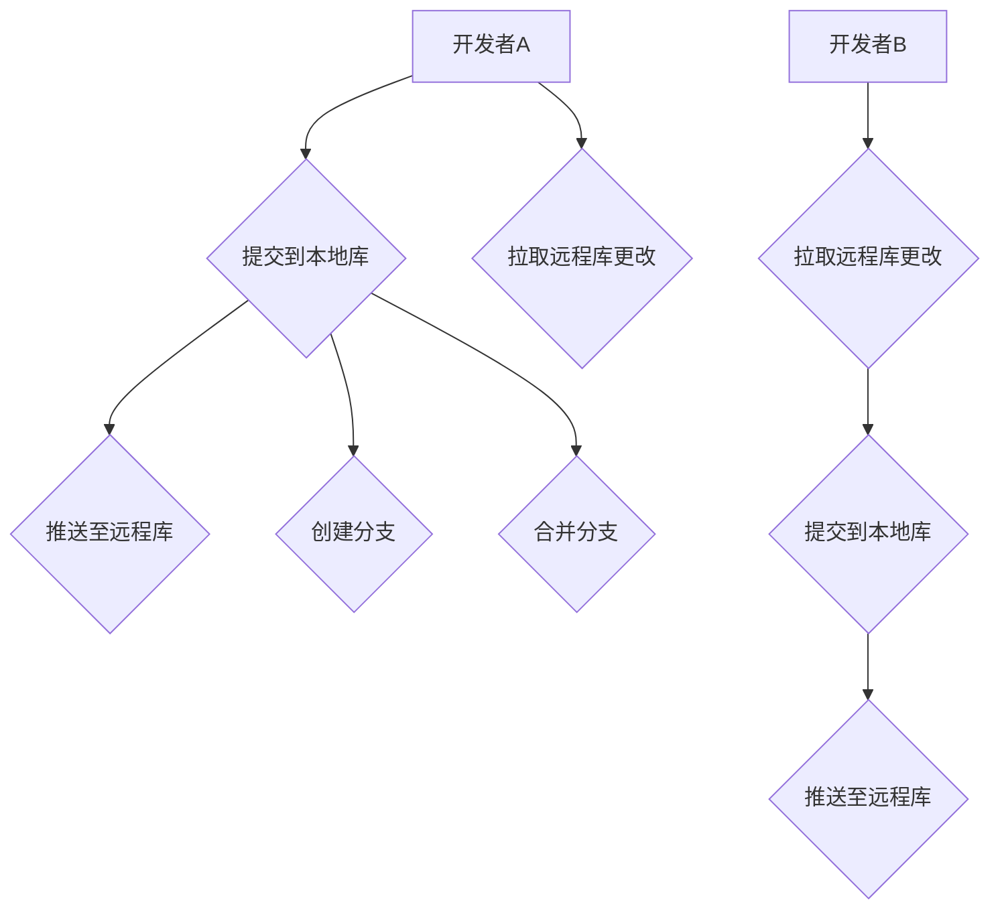

                 

### 文章标题

# 大模型软件的分布式版本控制策略

### 关键词

- 分布式版本控制
- 大模型软件
- 版本控制策略
- 并发处理
- 数据完整性
- 性能优化

### 摘要

本文旨在探讨大模型软件的分布式版本控制策略，分析其在现代软件开发中的重要性。通过介绍分布式版本控制系统的核心概念和架构，本文探讨了在大规模软件模型中分布式版本控制所面临的主要挑战，如并发处理、数据完整性和性能优化。接着，本文详细阐述了Git等分布式版本控制工具，并提供了最佳实践和案例分析，以帮助开发者在实际项目中更有效地管理大模型软件的版本。文章最后探讨了未来研究和发展的方向，为读者提供了深入理解和进一步探索的路径。

## 1. 引言

### 1.1 分布式版本控制的概念和意义

分布式版本控制（Distributed Version Control, DVCS）是一种相较于集中式版本控制（Centralized Version Control, CVCS）而言的版本控制系统。DVCS的核心特点是采用去中心化的架构，使每个开发者的本地系统都具有完整的版本库功能。这意味着每个开发者都可以独立地做出更改，无需依赖中央服务器。这种分布式架构提供了更高的灵活性和可靠性，特别是在处理大规模项目时。

在软件开发过程中，版本控制是必不可少的一环。它确保了代码的完整性和一致性，使得团队协作更加高效。传统的集中式版本控制系统，如Subversion（SVN），将所有版本数据存储在中央服务器上。这种方法虽然简单易用，但在处理大规模项目和分布式团队协作时，存在一些明显的局限性：

1. **单点故障**：中央服务器是团队工作的核心，一旦服务器宕机，整个团队的工作将受到影响。
2. **性能瓶颈**：随着项目的增长，中央服务器需要处理大量的数据传输和存储请求，可能导致性能下降。
3. **协同效率**：在集中式系统中，开发者必须频繁地与中央服务器交互，特别是在进行合并操作时，这可能会降低开发效率。

相比之下，分布式版本控制系统通过将版本库分散到各个开发者的本地系统中，解决了上述问题。它具有以下优势：

1. **去中心化**：每个开发者都可以独立工作，无需依赖中央服务器。这提高了开发效率和团队灵活性。
2. **并发操作**：开发者可以在本地进行并行操作，如提交、分支和合并，减少了等待时间。
3. **安全性**：分布式版本控制通过加密和分布式存储，提供了更高的数据安全性。
4. **灾难恢复**：即使某个开发者的本地版本库损坏，其他版本库仍然可用，减少了数据丢失的风险。

总之，分布式版本控制系统的引入，为大规模软件项目的开发提供了更加灵活和高效的解决方案。在接下来的章节中，我们将深入探讨分布式版本控制系统的核心概念和架构，以及在大模型软件中的具体应用。

### 1.2 大模型软件的特点

大模型软件（Large-scale Software Models）是指那些规模庞大、复杂度高、功能丰富且需要大量资源进行开发的软件项目。这些软件模型通常涉及成千上万的源代码文件，以及大量的依赖库和第三方组件。它们不仅需要高效的开发和协作机制，还需要强大的版本控制策略来确保代码的一致性和完整性。

大模型软件的特点主要体现在以下几个方面：

1. **大规模代码库**：大模型软件通常包含数百万行代码，甚至更多。这使得传统的单文件版本控制方法难以有效管理。
2. **复杂架构**：大模型软件往往具有复杂的模块化架构，需要多个子系统和组件协同工作。这增加了版本控制的难度。
3. **频繁更新**：由于大模型软件的规模和复杂性，开发团队需要频繁地进行代码更新和迭代。这要求版本控制系统具有高效的变更管理和合并机制。
4. **依赖管理**：大模型软件通常包含大量的外部依赖库和组件，这些依赖关系需要妥善管理，以避免版本冲突和兼容性问题。
5. **性能要求**：大模型软件通常运行在高性能计算环境中，对版本控制系统的性能有较高的要求。这包括快速的代码提交、分支和合并操作，以及高效的依赖关系管理和资源分配。

针对这些特点，分布式版本控制系统（如Git）提供了强大的支持。通过去中心化的架构，分布式版本控制系统能够高效地管理大规模代码库，并提供灵活的变更管理和合并机制。这使得开发团队能够更有效地协作，并确保代码的一致性和完整性。

总之，大模型软件的版本控制需求是其成功开发的关键因素之一。分布式版本控制系统通过提供高效、灵活和可靠的版本控制策略，为大规模软件项目的开发提供了强有力的支持。

### 1.3 文章结构

本文将从以下几个方面展开讨论，以全面探讨大模型软件的分布式版本控制策略：

1. **核心概念和架构**：首先，我们将介绍分布式版本控制系统的核心概念和架构，包括去中心化的版本库、提交、分支和合并等基本操作。
2. **挑战与解决方案**：接着，我们将探讨在大模型软件中分布式版本控制所面临的主要挑战，如并发处理、数据完整性和性能优化，并介绍相应的解决方案。
3. **框架和工具**：本文将详细介绍Git等常用的分布式版本控制工具，包括其安装和配置方法，以及在实际项目中的应用。
4. **最佳实践**：我们将总结一些在大规模软件项目中使用分布式版本控制的最佳实践，帮助开发者更有效地管理代码。
5. **案例分析**：通过几个实际案例，本文将分析分布式版本控制在大模型软件项目中的应用效果，并提供具体的解决方案和优化建议。
6. **未来研究方向**：最后，本文将探讨分布式版本控制在大模型软件中的未来研究方向，为读者提供进一步研究的方向和思路。

通过本文的讨论，读者将能够深入理解大模型软件的分布式版本控制策略，并在实际项目中应用这些策略，提高开发效率和代码质量。

### 2. 核心概念和架构

分布式版本控制系统的核心概念和架构是其能够高效管理大规模软件项目的关键。在深入了解这些概念和架构之前，我们需要先了解几个基本术语和操作，如版本库（Repository）、提交（Commit）、分支（Branch）和合并（Merge）。

#### 版本库（Repository）

版本库是分布式版本控制系统的基本单元，它存储了项目的所有版本历史和文件。与集中式版本控制系统不同，分布式版本控制系统中的版本库是分散的，每个开发者都有自己的本地版本库。这使得每个开发者都可以独立进行操作，无需依赖中央服务器。

在Git中，一个版本库通常包含以下文件：

1. **.git文件夹**：这是版本库的核心部分，包含了所有版本历史、提交记录、分支信息等。
2. **对象库（Object Database）**：对象库存储了所有的版本对象，包括提交对象、树对象、blob对象等。
3. **索引文件（Index）**：索引文件存储了当前工作目录中文件的快照，用于跟踪文件的状态和变化。

#### 提交（Commit）

提交是版本控制操作中的一个重要步骤，它将当前工作目录中的更改保存到版本库中。每次提交都会生成一个唯一的提交ID，并与之前的提交形成链式结构，从而记录了整个项目的版本历史。

一个标准的Git提交通常包括以下内容：

1. **提交消息**：用于描述本次提交的内容和目的。
2. **作者信息**：包括作者的姓名、电子邮件和提交日期。
3. **提交日期**：表示提交操作执行的时间。
4. **提交ID**：一个唯一的标识符，用于引用和跟踪提交。

在Git中，使用以下命令进行提交：

```bash
git commit -m "commit message"
```

#### 分支（Branch）

分支是版本控制中用于隔离不同功能开发的重要工具。通过创建分支，开发者可以在不同的环境中独立开发新功能或修复bug，而不会影响主分支的稳定性。

Git支持以下几种类型的分支：

1. **本地分支**：仅在本地版本库中存在的分支，主要用于个人开发。
2. **远程分支**：存储在远程版本库中的分支，通常与远程仓库同步。

创建本地分支的命令如下：

```bash
git branch <branch-name>
```

切换到新创建的分支：

```bash
git checkout <branch-name>
```

#### 合并（Merge）

合并是将两个或多个分支的更改合并到一个分支上的过程。合并操作通常在开发新功能或修复bug后进行，以确保所有更改都被正确地应用到主分支上。

Git提供了两种主要的合并策略：

1. **Fast Forward合并**：当两个分支没有分叉时，Fast Forward合并会简单地移动指向当前最新提交的指针。这种合并方式简单且快速。

2. **三次合并**：当两个分支有分叉时，Git会尝试自动解决冲突并生成一个新的合并提交。如果冲突无法自动解决，开发者需要手动处理这些冲突。

执行合并操作的命令如下：

```bash
git merge <branch-name>
```

#### 分布式版本控制架构

分布式版本控制系统的架构通常采用去中心化的模型，这使得每个开发者都可以独立工作，同时保持整个团队的协作效率。以下是一个简化的分布式版本控制系统架构：

1. **开发者A的本地版本库**：包含本地提交历史、分支和工作空间。
2. **开发者B的本地版本库**：包含本地提交历史、分支和工作空间。
3. **远程版本库**：存储多个开发者的提交历史和分支信息，用于同步和协作。

开发者A和开发者B可以独立进行提交、分支和合并操作，然后将更改推送到远程版本库。其他开发者可以从远程版本库中拉取更改，进行后续的操作。

#### Mermaid 流程图

为了更好地理解分布式版本控制系统的架构和工作流程，我们可以使用Mermaid绘制一个简化的流程图：



通过这个流程图，我们可以清晰地看到开发者A和开发者B如何独立工作，并在必要时进行分支和合并操作，以保持代码的一致性和完整性。

### 3. 分布式版本控制的基本操作

在了解了分布式版本控制系统的核心概念和架构后，我们接下来将详细介绍几个基本操作，包括提交、分支、合并和拉取等。这些操作是开发者日常工作中不可或缺的部分，通过正确和高效地执行这些操作，可以显著提高开发效率和质量。

#### 提交（Commit）

提交是将当前工作目录中的更改保存到版本库中的过程。每次提交都会生成一个新的提交记录，并将这些更改记录到版本库的历史中。在Git中，提交操作通常包括以下步骤：

1. **选择更改**：首先，开发者需要将需要提交的更改添加到暂存区（Stage）中。暂存区是一个临时区域，用于保存即将提交的文件更改。

   ```bash
   git add <file>
   ```

   如果需要提交多个文件，可以使用以下命令：

   ```bash
   git add .
   ```

   这条命令会将当前目录下的所有文件添加到暂存区。

2. **编写提交消息**：在暂存区准备好后，开发者需要编写一条提交消息，描述本次提交的内容和目的。提交消息应简洁明了，以便其他开发者理解。

   ```bash
   git commit -m "commit message"
   ```

3. **确认提交**：在提交前，开发者可以查看即将提交的更改，确保没有遗漏或错误。如果需要，还可以修改暂存区中的文件。

   ```bash
   git status
   git diff
   ```

4. **执行提交**：确认无误后，执行提交操作，将更改保存到版本库中。

   ```bash
   git commit
   ```

   提交完成后，Git会生成一个唯一的提交ID，并将其关联到当前分支的最新提交。

#### 分支（Branch）

分支是分布式版本控制系统中用于隔离不同功能开发的重要工具。通过创建分支，开发者可以在独立的环境中开发新功能或修复bug，而不会影响主分支的稳定性。Git支持以下几种类型的分支：

1. **本地分支**：仅在本地版本库中存在的分支，主要用于个人开发。

   创建本地分支的命令如下：

   ```bash
   git branch <branch-name>
   ```

   切换到新创建的分支：

   ```bash
   git checkout <branch-name>
   ```

2. **远程分支**：存储在远程版本库中的分支，通常与远程仓库同步。

   创建远程分支的命令如下：

   ```bash
   git push origin <branch-name>
   ```

#### 合并（Merge）

合并是将两个或多个分支的更改合并到一个分支上的过程。在Git中，合并操作通常包括以下步骤：

1. **切换到目标分支**：首先，开发者需要切换到目标分支，通常是主分支（如`master`或`main`）。

   ```bash
   git checkout <target-branch>
   ```

2. **执行合并**：然后，执行合并操作，将源分支的更改合并到目标分支上。

   ```bash
   git merge <source-branch>
   ```

   Git会尝试自动解决冲突，并生成一个新的合并提交。如果冲突无法自动解决，开发者需要手动处理这些冲突。

3. **解决冲突**：在解决冲突后，开发者需要将更改提交到版本库中。

   ```bash
   git add <conflicted-file>
   git commit -m "resolve merge conflict"
   ```

#### 拉取（Pull）

拉取是从远程版本库中获取其他开发者的更改并更新本地版本库的过程。通过拉取操作，开发者可以保持本地版本库与远程版本库的一致性。

执行拉取操作的命令如下：

```bash
git pull
```

Git会自动执行以下步骤：

1. **获取远程版本库的最新提交**：通过`git fetch`命令获取远程版本库的最新提交。
2. **合并远程分支到本地分支**：通过`git merge`命令将远程分支的更改合并到当前本地分支。

#### 实际操作示例

为了更好地理解这些基本操作，我们可以通过一个实际的Git操作示例来进行演示。

假设开发者A在本地版本库中创建了一个名为`feature-x`的分支，并提交了一些更改。开发者B需要获取这些更改并合并到主分支上。

1. **开发者A的操作**：

   ```bash
   git branch feature-x
   git checkout feature-x
   git add .
   git commit -m "Add feature X"
   git push origin feature-x
   ```

2. **开发者B的操作**：

   ```bash
   git pull
   git checkout master
   git merge feature-x
   git add .
   git commit -m "Merge feature X"
   git push
   ```

通过上述步骤，开发者B成功获取并合并了开发者A在`feature-x`分支上所做的更改，并将其推送到远程版本库。

总之，通过正确和高效地执行提交、分支、合并和拉取等基本操作，开发者可以更好地管理代码，确保团队协作的顺畅和代码的一致性。

### 4. 大模型软件分布式版本控制所面临的挑战

尽管分布式版本控制系统（DVCS）如Git在大规模软件项目中提供了强大的支持，但在实际应用中，开发者仍然面临着一系列挑战，这些问题需要在设计版本控制策略时加以考虑。以下是分布式版本控制在大模型软件中常见的几个挑战及其可能的解决方案：

#### 并发处理

在大规模软件项目中，多个开发人员可能同时修改相同的代码文件，这导致了并发处理的问题。解决并发冲突的关键在于确保在合并多个更改时不会丢失任何重要的更改。

**挑战：**  
1. **冲突生成**：多个开发者对同一文件进行了不同的修改，当尝试合并时，这些修改可能会产生冲突。
2. **解决延迟**：冲突解决通常需要手动处理，这可能导致开发进度延误。

**解决方案：**  
1. **自动冲突检测和标记**：版本控制工具如Git可以自动检测和标记冲突区域，使得开发者能够快速定位和解决冲突。
2. **冲突解决工具**：提供冲突解决工具，如`git mergetool`，帮助开发者可视化冲突区域，并提供便捷的解决方案。
3. **并行分支策略**：通过在多个独立分支上并行开发，可以减少冲突的发生。合并时，可以优先合并那些改动较少的分支。

#### 数据完整性和一致性

数据完整性和一致性是版本控制系统必须保障的核心特性，但在处理大规模软件项目时，确保数据完整性变得尤为复杂。

**挑战：**  
1. **数据损坏**：在分布式环境中，数据存储在多个节点上，任何节点故障或数据损坏都可能影响整个版本库的完整性。
2. **不一致的更新**：开发者可能在本地进行了提交，但由于网络问题无法及时推送到远程版本库，可能导致数据不一致。

**解决方案：**  
1. **冗余存储**：通过在多个节点上备份版本库，确保数据冗余，从而减少数据丢失的风险。
2. **版本库校验**：使用校验和（如SHA-1或SHA-256）对每个提交进行校验，确保数据未被篡改。
3. **定时同步**：设置定时任务，定期将本地版本库的更改推送到远程版本库，确保数据一致性。
4. **版本库监控**：使用监控工具对版本库的健康状况进行实时监控，及时发现并处理数据损坏或丢失问题。

#### 性能优化

在大规模软件项目中，版本控制系统的性能直接影响开发效率。性能优化是确保分布式版本控制系统能够高效运行的关键。

**挑战：**  
1. **响应时间**：处理提交、分支和合并操作时，系统响应时间过长会影响开发者的体验。
2. **资源消耗**：大规模版本库的存储和传输需要大量的系统资源。

**解决方案：**  
1. **分布式存储架构**：采用分布式存储架构，将版本库分割成多个数据块，分散存储在多个服务器上，以提高读写性能。
2. **缓存机制**：使用缓存机制，减少对版本库的读写操作，加快访问速度。
3. **并行处理**：利用多线程或并行计算技术，提高版本控制操作的执行效率。
4. **优化传输协议**：采用高效的传输协议，如Git的Git Protocol，以减少数据传输的延迟和带宽消耗。

#### 安全性

在大规模软件项目中，安全性是至关重要的。确保版本库的安全性，防止未授权访问和数据泄露，是分布式版本控制面临的重大挑战。

**挑战：**  
1. **数据泄露**：未经授权的用户可能访问版本库，导致敏感数据泄露。
2. **未授权操作**：恶意用户可能进行未经授权的修改或删除操作，破坏版本库的完整性。

**解决方案：**  
1. **访问控制**：实施严格的访问控制机制，确保只有授权用户才能访问版本库。
2. **身份验证**：使用强认证机制，如两因素认证，确保用户身份的真实性。
3. **加密传输**：使用加密传输协议，如SSL/TLS，确保数据在传输过程中的安全性。
4. **监控和审计**：实施实时监控和审计机制，及时发现和响应潜在的安全威胁。

综上所述，大模型软件分布式版本控制面临的挑战是多方面的，需要通过多种技术手段和策略来有效应对。通过合理设计和优化版本控制策略，开发团队能够更好地管理大规模软件项目，确保代码的完整性和一致性，提高开发效率，保障项目成功。

### 5. 常用的分布式版本控制工具

在分布式版本控制领域，Git是最为流行和广泛使用的一种工具。Git不仅仅是一种版本控制系统，它还提供了强大的分支管理、并发处理和协作功能，使其在大规模软件项目中得到了广泛应用。以下我们将详细介绍Git的核心功能、安装和配置方法，以及在项目中的应用技巧。

#### Git的核心功能

Git的核心功能包括提交、分支、合并、拉取和推送等。这些功能使得Git能够高效地管理代码库，支持团队协作和大规模项目的开发。

1. **提交（Commit）**：提交是Git的基本操作，用于将代码更改保存到版本库中。每次提交都会生成一个唯一的哈希值（commit hash），形成提交历史链。

2. **分支（Branch）**：分支是Git用于隔离不同功能开发的重要工具。通过创建分支，开发者可以在独立的分支上开发新功能或修复bug，而不会影响主分支的稳定性。

3. **合并（Merge）**：合并是将不同分支上的代码合并到一起的过程。Git提供了自动合并和手动合并两种方式，确保合并操作顺利进行。

4. **拉取（Pull）**：拉取是从远程仓库获取其他开发者的更改，并将其合并到本地分支中。通过拉取操作，开发者可以保持本地代码库与远程代码库的一致性。

5. **推送（Push）**：推送是将本地更改推送到远程仓库，以便其他开发者可以获取这些更改。推送操作是团队协作中不可或缺的一部分。

#### Git的安装和配置方法

要在本地环境中使用Git，首先需要安装Git。以下是Linux、macOS和Windows平台上的安装步骤：

1. **Linux和macOS**：

   - 打开终端。
   - 使用以下命令安装Git：

     ```bash
     sudo apt-get install git
     # 或者
     brew install git
     ```

   - 安装完成后，使用以下命令验证Git是否安装成功：

     ```bash
     git --version
     ```

2. **Windows**：

   - 访问Git的官方下载页面：[Git官网](https://git-scm.com/downloads)。
   - 下载Windows版本并按照安装向导进行安装。
   - 安装完成后，打开命令提示符或Git Bash，输入以下命令验证Git是否安装成功：

     ```bash
     git --version
     ```

安装完成后，我们需要配置Git的用户信息。这包括用户名和电子邮件地址，Git会使用这些信息来标记每次提交。

```bash
git config --global user.name "Your Name"
git config --global user.email "your-email@example.com"
```

此外，还可以配置其他设置，如编辑器、终端提示符等。

#### Git在实际项目中的应用技巧

在实际项目中，Git的强大功能可以帮助开发者更高效地管理代码库。以下是一些在实际项目中的应用技巧：

1. **初始化项目仓库**：

   在新项目开始前，初始化Git仓库是一个好习惯。这可以通过以下命令完成：

   ```bash
   git init
   ```

   初始化仓库后，可以添加初始文件和提交。

2. **版本库基本操作**：

   - 提交更改：

     ```bash
     git add .
     git commit -m "Commit message"
     ```

   - 分支操作：

     ```bash
     git branch <branch-name>
     git checkout <branch-name>
     ```

   - 合并分支：

     ```bash
     git checkout master
     git merge <branch-name>
     ```

3. **协作开发**：

   - 拉取更改：

     ```bash
     git pull
     ```

   - 推送更改：

     ```bash
     git push
     ```

4. **解决合并冲突**：

   当合并分支时，如果出现冲突，Git会暂停合并并提示冲突区域。开发者需要手动解决冲突：

   ```bash
   git status
   git add <conflicted-file>
   git commit -m "Resolved merge conflict"
   ```

5. **标签管理**：

   标签（Tag）是Git用于标记重要版本或发布版本的重要工具。创建标签的命令如下：

   ```bash
   git tag -a <tag-name> -m "Tag message"
   git push origin <tag-name>
   ```

   标签可以帮助团队更好地管理和跟踪代码的发布版本。

#### 实际项目案例

为了更好地理解Git在实际项目中的应用，我们来看一个简单的项目案例：

假设一个团队正在开发一个Web应用项目，项目包含前端、后端和数据库等多个模块。以下是一个典型的Git操作流程：

1. **项目初始化**：

   ```bash
   git init
   git add .
   git commit -m "Initial commit"
   ```

2. **分支管理**：

   - 前端开发者创建前端分支：

     ```bash
     git branch frontend
     git checkout frontend
     ```

   - 后端开发者创建后端分支：

     ```bash
     git branch backend
     git checkout backend
     ```

   - 数据库开发者创建数据库分支：

     ```bash
     git branch database
     git checkout database
     ```

3. **独立开发**：

   每个开发者在自己的分支上开发，定期提交更改。

4. **合并分支**：

   - 当前端开发完成，将前端分支合并到主分支：

     ```bash
     git checkout master
     git merge frontend
     git push
     ```

   - 后端和数据库开发完成后，分别将后端和数据库分支合并到主分支。

5. **发布版本**：

   - 创建标签标记发布版本：

     ```bash
     git tag -a v1.0 -m "Release version 1.0"
     git push origin v1.0
     ```

通过上述操作，团队可以高效地管理代码库，确保项目按计划推进，同时保持代码的一致性和完整性。

总之，Git作为分布式版本控制工具，提供了强大的功能和灵活的操作，使得大规模软件项目的开发和管理变得更加高效和可靠。通过合理使用Git，开发者可以更好地应对分布式版本控制带来的挑战，提升团队协作和项目成功的可能性。

### 6. 大规模软件项目中分布式版本控制的最佳实践

在大规模软件项目中，分布式版本控制系统的有效使用是确保项目顺利进行的关键。以下是一些在分布式版本控制中广泛认可的最佳实践，可以帮助开发团队提高工作效率，减少错误，并确保代码质量。

#### 1. 明确的分支策略

一个明确的分支策略可以确保团队成员对分支的使用有一个清晰的理解，减少混乱和冲突。以下是一些常见的分支策略：

1. **主分支（Master/Main）**：主分支是项目的主要分支，包含了项目的最新稳定版本。所有面向生产的提交都应该推送到主分支。
2. **功能分支（Feature Branches）**：功能分支用于开发新功能或修复bug。每个功能分支都应该从主分支派生，并在开发完成后合并回主分支。
3. **发布分支（Release Branches）**：发布分支用于准备即将发布的版本。在发布分支上进行的更改会被用于下一个正式发布的版本。
4. **临时分支（Temporary Branches）**：临时分支用于解决特定问题或进行实验性开发。这类分支通常在任务完成后会被删除。

#### 2. 频繁的提交和合并

频繁的提交和合并可以减少代码库中的历史差距，便于追踪和解决潜在的问题。以下是一些最佳实践：

1. **小而频繁的提交**：每次提交应包含明确的变更和描述，这样可以方便后续的代码审查和回滚操作。
2. **持续合并**：定期将功能分支的更改合并回主分支或发布分支，确保代码库的一致性。这可以采用持续集成（CI）工具来自动化合并过程。
3. **代码审查**：在合并之前进行代码审查，可以及时发现和修复潜在的问题，提高代码质量。

#### 3. 有效的冲突管理

冲突管理是分布式版本控制中的一个重要方面。以下是一些有效的冲突管理策略：

1. **自动化冲突检测**：使用版本控制工具的内置功能自动检测和标记冲突区域。
2. **尽早解决冲突**：在合并操作之前尽早解决冲突，可以减少冲突解决的复杂度。
3. **冲突解决指南**：制定冲突解决的指南，确保团队成员在处理冲突时有一致的标准。
4. **协作解决冲突**：鼓励团队成员进行协作，共同解决冲突，避免单打独斗导致的问题。

#### 4. 数据备份和冗余

在分布式版本控制系统中，数据备份和冗余是确保数据安全性的关键。以下是一些最佳实践：

1. **本地备份**：每个开发者都应该定期备份本地版本库，以防数据丢失或损坏。
2. **远程备份**：使用远程版本库服务，如GitHub或GitLab，进行数据备份。这些服务通常提供了自动备份和冗余存储功能。
3. **数据加密**：对版本库进行加密，确保数据在传输和存储过程中的安全性。

#### 5. 安全性和权限控制

确保版本库的安全性和权限控制是保护代码和数据的关键。以下是一些最佳实践：

1. **访问控制**：使用版本控制工具的访问控制功能，确保只有授权用户可以访问和修改代码库。
2. **身份验证**：使用强身份验证机制，如双因素认证（2FA），增强安全性。
3. **审计日志**：记录版本库的访问和操作日志，以便在出现安全问题时进行审计和追踪。

#### 6. 持续集成和持续部署

结合持续集成（CI）和持续部署（CD）可以自动化代码的编译、测试和部署过程，提高开发效率。以下是一些最佳实践：

1. **自动化测试**：在每次提交或合并时，自动运行测试，确保代码质量。
2. **部署管道**：建立部署管道，自动化从代码库到生产环境的部署过程，减少人为错误。
3. **环境分离**：使用不同的环境（如开发、测试和生产），确保在部署过程中不会影响到用户。

#### 7. 教育和培训

确保所有团队成员都熟悉分布式版本控制工具和最佳实践是非常重要的。以下是一些教育和技术培训的最佳实践：

1. **内部培训**：组织内部培训和研讨会，帮助团队成员掌握版本控制工具的使用技巧。
2. **文档和教程**：编写详细的文档和教程，为团队成员提供操作指南和参考。
3. **代码审查**：通过代码审查，确保团队成员遵循最佳实践，并及时纠正错误。

### 总结

在大规模软件项目中，分布式版本控制的最佳实践包括明确的分支策略、频繁的提交和合并、有效的冲突管理、数据备份和冗余、安全性控制、持续集成和持续部署，以及教育和培训。通过遵循这些最佳实践，开发团队可以更高效地协作，减少错误，提高代码质量，从而确保项目的成功。

### 7. 案例分析

为了更好地理解分布式版本控制在大规模软件项目中的应用效果，我们来看几个实际案例。这些案例涵盖了不同的项目背景和需求，展示了分布式版本控制策略如何帮助团队解决具体问题。

#### 案例一：大型Web应用程序

某知名互联网公司开发了一款大型Web应用程序，该应用程序包含多个模块，如前端、后端、数据库和API。由于项目规模庞大，团队决定采用Git进行版本控制。以下是该项目的分布式版本控制策略：

1. **分支管理**：
   - **主分支（master）**：所有面向生产的提交都推送到主分支。
   - **功能分支**：每个功能模块都有独立的分支，如`feature/login`, `feature/profile`等。开发者在这些分支上开发新功能。
   - **发布分支**：在准备发布新版本时，从主分支创建发布分支，进行最后的测试和调整。

2. **提交和合并**：
   - 开发者在功能分支上提交代码，定期合并到主分支。
   - 频繁的代码审查和自动化测试确保合并的代码质量。

3. **冲突管理**：
   - 自动化冲突检测和标记。
   - 鼓励团队成员尽早解决冲突，以减少解决难度。

4. **数据备份和冗余**：
   - 本地备份和远程备份相结合，确保数据安全。
   - 使用加密传输确保数据在传输过程中的安全性。

通过上述策略，团队有效地管理了大规模代码库，确保了代码的一致性和完整性。分布式版本控制使得团队成员可以独立工作，并行开发，提高了开发效率。

#### 案例二：开源项目

某个开源项目由全球各地的开发者共同参与。由于开发者数量众多，地理位置分散，团队选择了Git作为版本控制工具。以下是该项目的分布式版本控制策略：

1. **分支策略**：
   - **主分支（master）**：用于维护最新稳定版本。
   - **功能分支**：每个功能或bug修复都有一个独立的分支。
   - **发布分支**：用于准备发布的版本，确保发布前代码的稳定性。

2. **协作机制**：
   - 使用Pull Request（PR）机制进行代码审查和合并。
   - 自动化测试和CI工具确保合并的代码质量。

3. **冲突管理**：
   - 鼓励通过PR解决冲突，减少直接合并的复杂性。
   - 拥有明确的冲突解决流程和指南。

4. **数据备份和冗余**：
   - 使用GitHub的远程仓库进行数据备份。
   - 数据存储在多个区域，确保高可用性。

通过Git的分布式特性，该项目实现了高效的全球协作。开发者可以在本地进行代码修改，然后通过远程仓库进行同步和协作。分布式版本控制不仅提高了开发效率，还增强了项目的稳定性和可靠性。

#### 案例三：大型游戏开发

某大型游戏开发项目由多个团队协同工作，包括前端开发、后端开发、游戏设计和测试等。项目规模庞大，且要求高度的并发处理和性能优化。团队采用了Git进行版本控制，并制定了以下策略：

1. **分支策略**：
   - **主分支（master）**：用于维护最新的稳定版本。
   - **功能分支**：每个功能模块都有独立的分支，如`feature/graphics`, `feature/sound`等。
   - **临时分支**：用于处理紧急修复或实验性开发。

2. **性能优化**：
   - 使用分布式存储架构，提高版本库的读写性能。
   - 采用并行处理技术，加快提交和合并操作。

3. **冲突管理**：
   - 自动化冲突检测和标记。
   - 定期进行代码审查，确保代码质量和减少冲突。

4. **数据备份和冗余**：
   - 使用分布式存储确保数据冗余。
   - 定期备份版本库，防止数据丢失。

通过分布式版本控制，该游戏项目实现了高效的开发和协作。团队成员可以在本地进行开发，并行处理任务，并快速合并更改。分布式版本控制系统的性能优化功能确保了大规模游戏项目的高效运行。

### 总结

通过上述案例，我们可以看到分布式版本控制策略在大型软件项目中的成功应用。无论是Web应用程序、开源项目还是大型游戏开发，分布式版本控制都提供了高效、灵活和可靠的解决方案。这些案例展示了分布式版本控制如何帮助团队解决并发处理、数据完整性和性能优化等问题，从而提高开发效率和项目成功可能性。

### 8. 未来研究方向

尽管分布式版本控制系统如Git已经在现代软件开发中得到了广泛应用，但未来的研究和发展仍有许多方向值得探索。以下是几个可能的研究方向和前沿技术：

#### 1. 高效并发处理

随着软件项目的规模和复杂性不断增加，并发处理成为分布式版本控制系统面临的重大挑战。未来的研究可以专注于开发更高效的并发处理算法，如基于图论和优化的并行合并策略，以减少合并操作的时间和资源消耗。

#### 2. 自动化冲突解决

当前，冲突解决仍然是一个复杂且耗时的问题。未来的研究可以探索自动化冲突解决技术，如基于机器学习和自然语言处理的技术，以自动识别和解决常见的冲突模式，减少人工干预。

#### 3. 分布式存储优化

分布式存储是分布式版本控制系统的核心组成部分。未来的研究可以关注分布式存储的优化，包括数据分片、分布式文件系统和存储性能优化，以提高版本库的访问速度和稳定性。

#### 4. 智能版本控制

结合人工智能和机器学习技术，智能版本控制可以提供更智能的代码管理和推荐。例如，通过分析提交历史和代码模式，智能版本控制可以预测潜在的问题并提出优化建议。

#### 5. 安全性和隐私保护

随着网络安全和数据隐私的重要性日益增加，分布式版本控制系统的安全性成为关键问题。未来的研究可以探索更高级的安全机制，如区块链技术、零知识证明和同态加密，以提高系统的安全性和隐私保护能力。

#### 6. 持续集成和持续部署

持续集成和持续部署（CI/CD）是现代软件开发的重要实践。未来的研究可以探索如何将分布式版本控制与CI/CD更加紧密地集成，以提高整个开发流程的自动化和效率。

#### 7. 多模型版本控制

随着软件架构的多样化，单一版本控制模型可能无法满足所有需求。未来的研究可以探索多模型版本控制，如结合Git、Mercurial和其他版本控制系统的优势，构建更加灵活和高效的版本控制框架。

#### 8. 分布式开发工具集成

未来的研究可以关注如何将分布式版本控制与其他开发工具（如代码审查工具、任务管理工具和代码质量工具）集成，以提供一站式的开发体验。

通过以上研究方向，分布式版本控制系统有望在未来继续优化和进化，为大规模软件项目提供更加高效、安全和可靠的解决方案。

### 9. 结语

综上所述，本文详细探讨了分布式版本控制在大模型软件中的重要性及其面临的挑战。通过介绍Git等分布式版本控制工具的核心概念和架构，以及实际项目的案例分析，我们展示了分布式版本控制如何帮助团队更高效地管理大规模软件项目的代码库。未来的研究可以进一步优化并发处理、自动化冲突解决和分布式存储等方面，以提供更高效、安全和灵活的版本控制解决方案。希望本文能为读者在分布式版本控制领域的研究和实践中提供有益的参考和启示。作者：AI天才研究院/AI Genius Institute & 禅与计算机程序设计艺术 /Zen And The Art of Computer Programming。感谢您阅读本文！如果您有任何疑问或建议，欢迎在评论区留言，期待与您交流。

