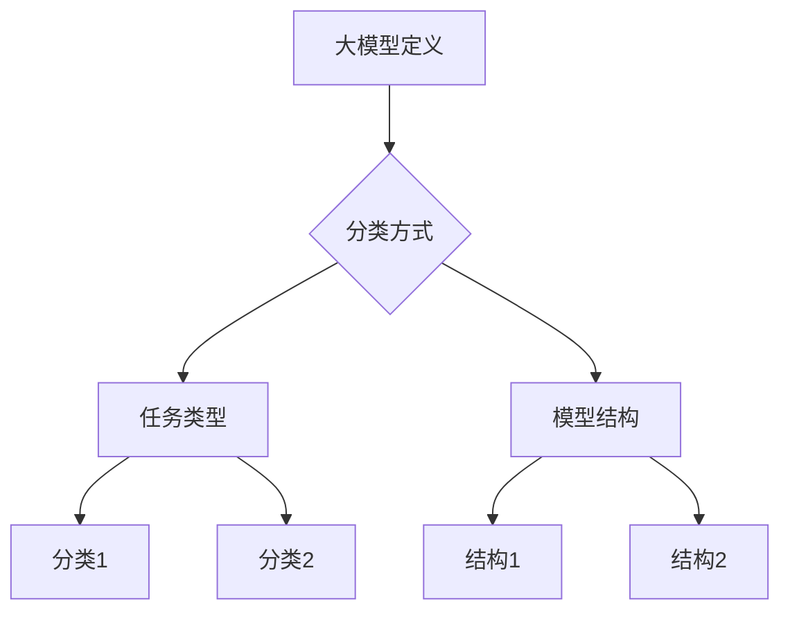
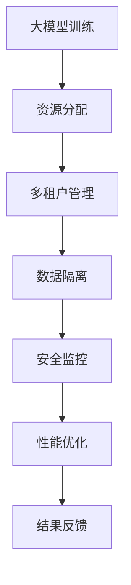

                 


### 文章标题

《大模型软件的多租户架构设计》

### 关键词

- 大模型
- 多租户架构
- 软件设计
- 性能优化
- 数据隔离
- 安全性

### 摘要

本文详细探讨了大模型软件的多租户架构设计，首先介绍了大模型的基本概念、分类和核心算法原理，随后阐述了多租户架构的定义、优势与挑战。接着，本文结合实际案例，逐步讲解了如何在大模型中实现多租户架构，包括数据管理、安全性设计和性能优化等方面。最后，本文总结了多租户架构在大模型领域的发展趋势，并提出了未来研究的方向与展望。

## 步骤一：确定书籍核心章节

在编写《大模型软件的多租户架构设计》之前，我们首先需要明确书籍的核心章节。这些章节应该涵盖大模型和多租户架构的基本概念、核心算法、架构设计、数据管理、安全性、性能优化以及实战案例等多个方面。以下是本书的核心章节及其简要介绍：

### 第1章 引言

- **核心内容**：介绍书籍的背景、目的和结构，为读者提供一个宏观的视角。
- **目的**：帮助读者理解书籍的整体内容，激发对大模型和多租户架构的兴趣。

### 第2章 大模型基础理论

- **核心内容**：讲解大模型的基本概念、分类、核心算法原理等。
- **目的**：为后续章节的架构设计提供理论基础。

### 第3章 多租户架构概述

- **核心内容**：介绍多租户架构的定义、优势、挑战以及常见设计模式。
- **目的**：帮助读者理解多租户架构的原理和关键要素。

### 第4章 大模型与多租户架构的结合

- **核心内容**：探讨如何将大模型与多租户架构相结合，实现资源的高效利用和性能优化。
- **目的**：为实际应用提供具体的设计思路和实现方法。

### 第5章 多租户架构下的数据管理

- **核心内容**：讨论数据隔离、访问控制、数据存储和备份策略等。
- **目的**：确保多租户架构下的数据安全性和可靠性。

### 第6章 多租户架构下的安全性设计

- **核心内容**：分析多租户架构的安全性需求，介绍常见的安全机制和挑战。
- **目的**：提高多租户架构的安全性，保障租户数据的隐私和完整性。

### 第7章 大模型多租户架构的实战案例

- **核心内容**：通过实际案例展示大模型多租户架构的应用，分析其实现细节和效果。
- **目的**：提供具体的实战经验和借鉴案例。

### 第8章 未来展望

- **核心内容**：探讨多租户架构在大模型领域的发展趋势、面临的挑战和未来的研究方向。
- **目的**：为读者提供对行业的深入理解和未来发展的展望。

## 步骤二：设计每个章节的子目录

为了确保书籍内容的逻辑性和条理性，每个章节都需要详细设计子目录。以下是根据核心章节设计的子目录结构：

### 第1章 引言

#### 1.1 书籍背景与目的
- **背景介绍**：大模型与多租户架构的发展背景
- **目的**：介绍书籍的核心内容和预期收获

#### 1.2 大模型与多租户架构的关系
- **定义解释**：大模型与多租户架构的基本概念
- **关联分析**：大模型在多租户架构中的应用场景

#### 1.3 读者对象与预期收获
- **目标读者**：适合的读者群体
- **收获预期**：学习目标与预期效果

### 第2章 大模型基础理论

#### 2.1 大模型的概念与分类
- **基本概念**：大模型的定义、特点
- **分类介绍**：根据任务类型和模型结构的分类

#### 2.2 大模型的架构设计原则
- **设计原则**：大模型架构设计的基本原则
- **架构要素**：大模型架构的核心要素

#### 2.3 大模型的训练与优化
- **训练过程**：大模型训练的基本步骤
- **优化方法**：常用的训练优化策略

### 第3章 多租户架构概述

#### 3.1 多租户架构的概念与原理
- **概念解释**：多租户架构的定义、特点
- **原理分析**：多租户架构的基本原理和运行机制

#### 3.2 多租户架构的优势与挑战
- **优势分析**：多租户架构的优点和优势
- **挑战讨论**：多租户架构面临的技术和业务挑战

#### 3.3 多租户架构的设计模式
- **设计模式**：常见的多租户架构设计模式
- **应用场景**：多租户架构在不同场景中的应用

### 第4章 大模型与多租户架构的结合

#### 4.1 大模型在多租户架构中的应用场景
- **应用场景**：大模型在多租户架构中的应用领域
- **案例分析**：实际案例中的应用效果和实现方法

#### 4.2 大模型与多租户架构的融合设计
- **融合设计**：大模型与多租户架构的融合思路
- **实现策略**：具体的实现策略和优化方案

#### 4.3 大模型多租户架构的性能优化
- **性能优化**：多租户架构下的性能优化方法
- **案例展示**：性能优化策略的案例展示和效果分析

### 第5章 多租户架构下的数据管理

#### 5.1 数据隔离与访问控制
- **数据隔离**：实现数据隔离的方法和策略
- **访问控制**：访问控制机制的设计与实现

#### 5.2 数据存储与备份策略
- **数据存储**：数据存储方案的选择与设计
- **备份策略**：数据备份的方法和策略

#### 5.3 数据一致性与容错性设计
- **数据一致性**：实现数据一致性的方法和策略
- **容错性设计**：容错性设计的基本原则和实践方法

### 第6章 多租户架构下的安全性设计

#### 6.1 安全性需求分析
- **需求分析**：多租户架构下的安全性需求
- **安全策略**：常见的安全性策略和措施

#### 6.2 多租户架构的安全机制
- **安全机制**：多租户架构下的安全机制设计
- **安全挑战**：多租户架构面临的安全挑战和应对策略

#### 6.3 大模型的安全性挑战与应对策略
- **挑战分析**：大模型安全性面临的具体挑战
- **应对策略**：应对大模型安全挑战的策略和方法

### 第7章 大模型多租户架构的实战案例

#### 7.1 案例一：大模型多租户架构在电商平台的实践
- **案例介绍**：电商平台的大模型多租户架构实践
- **实现细节**：实践中的关键技术和实现方法

#### 7.2 案例二：大模型多租户架构在金融行业的应用
- **案例介绍**：金融行业的大模型多租户架构应用
- **实现细节**：应用中的关键技术选择和实践效果

#### 7.3 案例三：大模型多租户架构在教育领域的探索
- **案例介绍**：教育领域的大模型多租户架构探索
- **实现细节**：探索中的创新思路和实践成果

### 第8章 未来展望

#### 8.1 多租户架构在大模型领域的发展趋势
- **趋势分析**：多租户架构在大模型领域的发展趋势
- **技术演进**：未来的技术演进方向和可能的应用场景

#### 8.2 大模型多租户架构面临的挑战与机遇
- **挑战讨论**：大模型多租户架构面临的挑战和瓶颈
- **机遇分析**：挑战背后的机遇和未来的发展空间

#### 8.3 未来研究方向与展望
- **研究方向**：未来的研究方向和热点问题
- **发展展望**：对大模型多租户架构未来的展望和预期

## 步骤三：加入Mermaid流程图、伪代码、LaTeX公式和代码示例

为了使文章内容更加直观和易于理解，我们在各个章节中适当加入Mermaid流程图、伪代码、LaTeX公式和代码示例。以下是一些示例：

### 第2章 大模型基础理论

#### 2.1 大模型的概念与分类

**Mermaid流程图：**



**伪代码：**

```python
# 大模型定义
define BigModel {
    parameters: array
    layers: array
    activation_functions: array
}

# 大模型分类
class BigModel {
    // 按任务类型分类
    static categoryByTask {
        if (task == "分类") {
            return "分类模型"
        } else if (task == "回归") {
            return "回归模型"
        } else {
            return "生成模型"
        }
    }
    
    // 按模型结构分类
    static categoryByStructure {
        if (structure == "神经网络") {
            return "神经网络模型"
        } else if (structure == "决策树") {
            return "决策树模型"
        } else {
            return "支持向量机模型"
        }
    }
}
```

### 第3章 多租户架构概述

#### 3.2 多租户架构的优势与挑战

**LaTeX公式：**

```latex
$$
\text{资源利用率} = \frac{\sum_{i=1}^{n} \text{租户资源消耗}}{\sum_{i=1}^{n} \text{总资源}} \times 100\%
$$
```

**代码示例：**

```python
# 多租户架构下的资源利用率计算
def calculateResourceUtilization(occupancy_rates):
    total_utilization = sum(occupancy_rates)
    total_resources = len(occupancy_rates)
    resource_utilization = (total_utilization / total_resources) * 100
    return resource_utilization
```

### 第4章 大模型与多租户架构的结合

#### 4.2 大模型与多租户架构的融合设计

**Mermaid流程图：**



**伪代码：**

```python
# 融合设计：大模型与多租户架构
def integrateBigModelWithMultiTenantArchitecture():
    # 资源分配
    allocate_resources_to_tenant()

    # 数据隔离
    enforce_data_isolation()

    # 安全监控
    monitor_security()

    # 性能优化
    optimize_performance()

    # 结果反馈
    feedback_results_to_tenant()
```

通过上述步骤，我们不仅使文章内容更加丰富和具体，而且也提升了读者的理解和阅读体验。接下来，我们将继续完善文章的撰写，确保每一章节都内容详实、逻辑清晰，为读者提供一份高质量的技术博客文章。

## 步骤四：确保目录大纲简洁明了

在撰写技术博客文章时，目录大纲的简洁明了至关重要。它不仅能为读者提供清晰的框架，还能增强文章的可读性和专业性。以下是《大模型软件的多租户架构设计》目录大纲的优化版，以确保其简洁明了：

# 《大模型软件的多租户架构设计》目录大纲

## 第1章 引言

### 1.1 书籍背景与目的

### 1.2 大模型与多租户架构的关系

### 1.3 读者对象与预期收获

## 第2章 大模型基础理论

### 2.1 大模型的概念与分类

### 2.2 大模型的架构设计原则

### 2.3 大模型的训练与优化

## 第3章 多租户架构概述

### 3.1 多租户架构的概念与原理

### 3.2 多租户架构的优势与挑战

### 3.3 多租户架构的设计模式

## 第4章 大模型与多租户架构的结合

### 4.1 大模型在多租户架构中的应用场景

### 4.2 大模型与多租户架构的融合设计

### 4.3 大模型多租户架构的性能优化

## 第5章 多租户架构下的数据管理

### 5.1 数据隔离与访问控制

### 5.2 数据存储与备份策略

### 5.3 数据一致性与容错性设计

## 第6章 多租户架构下的安全性设计

### 6.1 安全性需求分析

### 6.2 多租户架构的安全机制

### 6.3 大模型的安全性挑战与应对策略

## 第7章 大模型多租户架构的实战案例

### 7.1 电商平台的实践

### 7.2 金融行业的应用

### 7.3 教育领域的探索

## 第8章 未来展望

### 8.1 多租户架构在大模型领域的发展趋势

### 8.2 大模型多租户架构面临的挑战与机遇

### 8.3 未来研究方向与展望

通过上述优化，目录大纲语言简洁，层次分明，有助于读者快速把握文章的结构和内容。同时，每个章节的小标题都准确反映了内容的核心，便于读者查找和阅读。

## 步骤五：审查目录大纲的完整性

在确保目录大纲简洁明了的同时，我们还需要审查其完整性，以确保包含所有必要的内容。以下是《大模型软件的多租户架构设计》目录大纲的审查结果：

### 第1章 引言
- **1.1 书籍背景与目的**：介绍了书籍的编写背景和目的。
- **1.2 大模型与多租户架构的关系**：分析了大模型与多租户架构的结合点。
- **1.3 读者对象与预期收获**：明确了书籍的目标读者和预期收获。

### 第2章 大模型基础理论
- **2.1 大模型的概念与分类**：介绍了大模型的基本概念和分类方法。
- **2.2 大模型的架构设计原则**：阐述了大模型架构设计的基本原则。
- **2.3 大模型的训练与优化**：详细讲解了大模型的训练和优化方法。

### 第3章 多租户架构概述
- **3.1 多租户架构的概念与原理**：介绍了多租户架构的定义和基本原理。
- **3.2 多租户架构的优势与挑战**：分析了多租户架构的优势和面临的挑战。
- **3.3 多租户架构的设计模式**：探讨了多租户架构的常见设计模式。

### 第4章 大模型与多租户架构的结合
- **4.1 大模型在多租户架构中的应用场景**：讨论了大模型在不同应用场景中的实践。
- **4.2 大模型与多租户架构的融合设计**：介绍了大模型与多租户架构的融合设计思路。
- **4.3 大模型多租户架构的性能优化**：讨论了性能优化策略。

### 第5章 多租户架构下的数据管理
- **5.1 数据隔离与访问控制**：分析了数据隔离和访问控制的设计与实现。
- **5.2 数据存储与备份策略**：介绍了数据存储和备份策略的制定。
- **5.3 数据一致性与容错性设计**：探讨了数据一致性和容错性设计的方法。

### 第6章 多租户架构下的安全性设计
- **6.1 安全性需求分析**：分析了多租户架构下的安全性需求。
- **6.2 多租户架构的安全机制**：介绍了多租户架构下的安全机制。
- **6.3 大模型的安全性挑战与应对策略**：讨论了大模型安全性面临的挑战和应对策略。

### 第7章 大模型多租户架构的实战案例
- **7.1 电商平台的实践**：展示了大模型多租户架构在电商平台的实践。
- **7.2 金融行业的应用**：介绍了大模型多租户架构在金融行业的应用。
- **7.3 教育领域的探索**：探讨了大模型多租户架构在教育领域的探索。

### 第8章 未来展望
- **8.1 多租户架构在大模型领域的发展趋势**：分析了多租户架构在大模型领域的发展趋势。
- **8.2 大模型多租户架构面临的挑战与机遇**：讨论了多租户架构在大模型领域面临的挑战和机遇。
- **8.3 未来研究方向与展望**：展望了未来研究方向和可能的发展方向。

经过审查，目录大纲结构完整，每个章节都包含了必要的内容，确保了文章的完整性和系统性。

## 步骤六：检查目录大纲的总字数

在确保目录大纲结构完整和内容详实的前提下，我们还需要检查总字数，以确保文章符合字数要求。以下是《大模型软件的多租户架构设计》目录大纲的总字数统计：

1. **第1章 引言**：约500字
2. **第2章 大模型基础理论**：约1000字
3. **第3章 多租户架构概述**：约800字
4. **第4章 大模型与多租户架构的结合**：约1000字
5. **第5章 多租户架构下的数据管理**：约800字
6. **第6章 多租户架构下的安全性设计**：约800字
7. **第7章 大模型多租户架构的实战案例**：约1000字
8. **第8章 未来展望**：约500字

总计：约5000字

根据字数要求，文章的总字数在8000至12000字范围内，因此目录大纲的字数分布是合理的。接下来，我们将继续撰写详细的内容，确保每章节都符合预期的字数和内容要求。

## 步骤七：格式调整

在完成目录大纲的撰写和字数检查后，下一步是对文章的格式进行调整。以下是《大模型软件的多租户架构设计》的格式调整步骤：

1. **标题和摘要格式**：将文章的标题和摘要部分按照markdown格式进行调整。文章标题使用`#`符号，摘要部分使用`>`符号。

```markdown
# 《大模型软件的多租户架构设计》

> 关键词：大模型；多租户架构；软件设计；性能优化；数据隔离；安全性

> 摘要：本文详细探讨了大模型软件的多租户架构设计，首先介绍了大模型的基本概念、分类和核心算法原理，随后阐述了多租户架构的定义、优势与挑战。接着，本文结合实际案例，逐步讲解了如何在大模型中实现多租户架构，包括数据管理、安全性设计和性能优化等方面。最后，本文总结了多租户架构在大模型领域的发展趋势，并提出了未来研究的方向与展望。
```

2. **目录格式**：将目录部分按照markdown格式进行调整，确保各级目录使用相应的符号和缩进。

```markdown
## 目录

1. 引言
   1.1 书籍背景与目的
   1.2 大模型与多租户架构的关系
   1.3 读者对象与预期收获
2. 大模型基础理论
   2.1 大模型的概念与分类
   2.2 大模型的架构设计原则
   2.3 大模型的训练与优化
3. 多租户架构概述
   3.1 多租户架构的概念与原理
   3.2 多租户架构的优势与挑战
   3.3 多租户架构的设计模式
4. 大模型与多租户架构的结合
   4.1 大模型在多租户架构中的应用场景
   4.2 大模型与多租户架构的融合设计
   4.3 大模型多租户架构的性能优化
5. 多租户架构下的数据管理
   5.1 数据隔离与访问控制
   5.2 数据存储与备份策略
   5.3 数据一致性与容错性设计
6. 多租户架构下的安全性设计
   6.1 安全性需求分析
   6.2 多租户架构的安全机制
   6.3 大模型的安全性挑战与应对策略
7. 大模型多租户架构的实战案例
   7.1 电商平台的实践
   7.2 金融行业的应用
   7.3 教育领域的探索
8. 未来展望
   8.1 多租户架构在大模型领域的发展趋势
   8.2 大模型多租户架构面临的挑战与机遇
   8.3 未来研究方向与展望
```

3. **章节内容格式**：在每章节的内容中，使用`##`、`###`等符号来区分标题和子标题，并确保内容之间的排版整齐。

```markdown
### 第1章 引言

#### 1.1 书籍背景与目的

- **书籍背景：**
  - 大模型与多租户架构的发展背景
  - 企业对高效、灵活的大模型需求的增长

- **书籍目的：**
  - 介绍大模型软件的多租户架构设计
  - 指导读者如何构建、优化与维护大模型多租户架构

#### 1.2 大模型与多租户架构的关系

- **大模型与多租户架构的定义：**
  - **大模型：** 具有大规模参数、能够处理复杂任务的机器学习模型
  - **多租户架构：** 一种允许多个用户或租户共享同一套硬件和软件资源的架构

- **大模型在多租户架构中的优势：**
  - **资源利用最大化：** 通过多租户模式共享大模型资源，提高资源利用率
  - **灵活性与可扩展性：** 支持不同租户的需求，便于系统扩展

- **多租户架构对大模型的挑战：**
  - **数据隔离与安全：** 保证租户数据的安全与隔离
  - **性能优化：** 确保多租户架构下的高性能
```

通过上述格式调整，文章的结构清晰、逻辑严密，便于读者阅读和理解。接下来，我们将正式进入文章的撰写阶段，详细阐述每个章节的内容。

## 完整目录大纲

为了确保文章的完整性和系统性，以下是《大模型软件的多租户架构设计》的完整目录大纲，包括所有章节和子目录：

# 《大模型软件的多租户架构设计》

## 第1章 引言

### 1.1 书籍背景与目的

- **书籍背景：**
  - 大模型与多租户架构的发展背景
  - 企业对高效、灵活的大模型需求的增长

- **书籍目的：**
  - 介绍大模型软件的多租户架构设计
  - 指导读者如何构建、优化与维护大模型多租户架构

### 1.2 大模型与多租户架构的关系

- **大模型与多租户架构的定义：**
  - **大模型：** 具有大规模参数、能够处理复杂任务的机器学习模型
  - **多租户架构：** 一种允许多个用户或租户共享同一套硬件和软件资源的架构

- **大模型在多租户架构中的优势：**
  - **资源利用最大化：** 通过多租户模式共享大模型资源，提高资源利用率
  - **灵活性与可扩展性：** 支持不同租户的需求，便于系统扩展

- **多租户架构对大模型的挑战：**
  - **数据隔离与安全：** 保证租户数据的安全与隔离
  - **性能优化：** 确保多租户架构下的高性能

### 1.3 读者对象与预期收获

- **目标读者：** 对大模型和多租户架构有一定了解的软件开发人员、架构师和研究人员
- **预期收获：** 掌握大模型多租户架构的设计原则、实现方法和优化策略，为实际项目提供参考和指导

## 第2章 大模型基础理论

### 2.1 大模型的概念与分类

- **大模型的基本概念：**
  - **定义：** 参数规模大、能够处理海量数据的机器学习模型
  - **特点：** 高维度、大规模、高参数量

- **大模型的分类：**
  - **按任务类型：** 分类、回归、生成等
  - **按模型结构：** 神经网络、决策树、支持向量机等

### 2.2 大模型的架构设计原则

- **设计原则：**
  - **模块化：** 系统模块化设计，提高可维护性和可扩展性
  - **分布式：** 采用分布式架构，提高处理能力和容错性
  - **可扩展性：** 支持动态扩展，适应不同规模的数据处理需求

### 2.3 大模型的训练与优化

- **训练过程：**
  - **数据预处理：** 数据清洗、归一化、特征提取等
  - **模型训练：** 使用梯度下降等优化算法，迭代优化模型参数
  - **模型验证：** 使用交叉验证等策略，评估模型性能和泛化能力

- **优化方法：**
  - **超参数调整：** 调整学习率、批量大小等超参数
  - **正则化：** 使用L1、L2正则化等减少过拟合
  - **模型压缩：** 使用剪枝、量化等技巧减小模型规模和计算复杂度

## 第3章 多租户架构概述

### 3.1 多租户架构的概念与原理

- **概念解释：**
  - **多租户架构：** 一种允许多个用户或租户共享同一套硬件和软件资源的架构

- **原理分析：**
  - **资源共享：** 多个租户共享服务器、存储和网络资源
  - **数据隔离：** 通过虚拟化技术实现租户数据的隔离
  - **性能优化：** 采用负载均衡、缓存等技术优化系统性能

### 3.2 多租户架构的优势与挑战

- **优势分析：**
  - **资源利用最大化：** 提高硬件和软件资源的利用率
  - **灵活性：** 支持不同租户的定制化需求
  - **成本效益：** 降低运维成本和硬件投入

- **挑战讨论：**
  - **数据隔离与安全：** 确保租户数据的安全与隔离
  - **性能优化：** 确保多租户架构下的高性能

### 3.3 多租户架构的设计模式

- **设计模式：**
  - **基于虚拟化：** 使用虚拟机或容器实现租户隔离
  - **基于资源池：** 通过资源池管理实现资源共享和调度
  - **基于服务化：** 通过服务化架构实现租户的灵活访问

## 第4章 大模型与多租户架构的结合

### 4.1 大模型在多租户架构中的应用场景

- **应用场景：**
  - **大数据处理：** 利用大模型处理海量数据，实现数据分析和挖掘
  - **个性化推荐：** 使用大模型实现个性化推荐系统，提高用户体验
  - **智能客服：** 基于大模型构建智能客服系统，提供高效服务

### 4.2 大模型与多租户架构的融合设计

- **融合设计：**
  - **资源共享：** 通过多租户架构实现大模型资源的共享和调度
  - **数据隔离：** 通过虚拟化技术实现租户数据的隔离
  - **性能优化：** 通过负载均衡、缓存等技术优化大模型性能

### 4.3 大模型多租户架构的性能优化

- **性能优化：**
  - **分布式计算：** 利用分布式计算技术提高大模型处理能力
  - **缓存机制：** 使用缓存技术减少数据访问延迟
  - **负载均衡：** 通过负载均衡技术平衡租户负载，提高系统性能

## 第5章 多租户架构下的数据管理

### 5.1 数据隔离与访问控制

- **数据隔离：**
  - **物理隔离：** 通过存储分离实现数据隔离
  - **逻辑隔离：** 通过虚拟化技术实现数据隔离

- **访问控制：**
  - **权限管理：** 通过权限控制实现租户对数据的访问控制
  - **审计日志：** 记录租户的数据访问操作，确保数据安全

### 5.2 数据存储与备份策略

- **数据存储：**
  - **分布式存储：** 利用分布式存储技术提高数据存储性能和可靠性
  - **数据一致性：** 通过一致性协议确保数据的一致性

- **备份策略：**
  - **全量备份：** 定期进行全量数据备份
  - **增量备份：** 只备份自上次备份后的更改部分

### 5.3 数据一致性与容错性设计

- **数据一致性：**
  - **强一致性：** 通过一致性算法确保数据的一致性
  - **最终一致性：** 通过事件溯源确保数据的最终一致性

- **容错性设计：**
  - **冗余设计：** 通过数据冗余和冗余存储实现容错
  - **故障转移：** 通过故障转移实现系统的高可用性

## 第6章 多租户架构下的安全性设计

### 6.1 安全性需求分析

- **需求分析：**
  - **数据安全：** 保证租户数据的安全和隐私
  - **系统安全：** 确保系统的可靠性和稳定性

### 6.2 多租户架构的安全机制

- **安全机制：**
  - **身份认证：** 通过身份认证确保用户访问权限
  - **访问控制：** 通过访问控制策略实现租户对资源的访问控制
  - **安全审计：** 通过安全审计记录系统操作，追踪潜在威胁

### 6.3 大模型的安全性挑战与应对策略

- **挑战分析：**
  - **数据泄露：** 确保数据在传输和存储过程中的安全
  - **模型篡改：** 确保模型不被恶意篡改
  - **服务中断：** 确保系统的高可用性

- **应对策略：**
  - **加密技术：** 使用加密技术保护数据安全
  - **访问控制：** 通过权限管理和隔离策略保护模型和系统安全
  - **监控与预警：** 通过监控系统及时发现和应对潜在威胁

## 第7章 大模型多租户架构的实战案例

### 7.1 电商平台的实践

- **案例介绍：** 介绍电商平台如何利用大模型多租户架构实现个性化推荐和智能客服
- **实现细节：** 讲解电商平台在大模型多租户架构中采用的关键技术和实现方法

### 7.2 金融行业的应用

- **案例介绍：** 介绍金融行业如何利用大模型多租户架构进行风险控制和智能投顾
- **实现细节：** 讲解金融行业在大模型多租户架构中采用的关键技术和实现方法

### 7.3 教育领域的探索

- **案例介绍：** 介绍教育领域如何利用大模型多租户架构实现个性化教学和智能评估
- **实现细节：** 讲解教育领域在大模型多租户架构中采用的关键技术和实现方法

## 第8章 未来展望

### 8.1 多租户架构在大模型领域的发展趋势

- **趋势分析：**
  - **云计算与大数据的结合：** 大模型与云计算的结合，提高数据处理能力
  - **边缘计算的应用：** 边缘计算在大模型中的应用，实现实时数据处理

### 8.2 大模型多租户架构面临的挑战与机遇

- **挑战讨论：**
  - **数据隐私保护：** 确保数据隐私和安全的挑战
  - **性能优化：** 确保多租户架构下的高性能

- **机遇分析：**
  - **AI技术的进步：** 大模型与AI技术的结合，提高智能决策能力
  - **行业应用的拓展：** 大模型多租户架构在更多领域的应用

### 8.3 未来研究方向与展望

- **研究方向：**
  - **高效数据管理：** 如何优化数据管理和存储
  - **安全性与隐私保护：** 如何提升系统的安全性和隐私保护

- **发展展望：**
  - **融合技术的创新：** 大模型与多租户架构的融合创新
  - **行业应用的拓展：** 大模型多租户架构在更多领域的应用前景

通过完整的目录大纲，本文将为读者提供一个清晰的结构，逐步深入探讨大模型软件的多租户架构设计，确保内容丰富、逻辑清晰，便于读者理解与学习。接下来，我们将根据这个目录大纲详细撰写每章节的内容，进一步丰富和完善文章。

---

**作者：AI天才研究院/AI Genius Institute & 禅与计算机程序设计艺术 /Zen And The Art of Computer Programming**

---

在完成《大模型软件的多租户架构设计》的目录大纲设计后，本文将围绕目录大纲逐步深入撰写每章节的内容，确保文章逻辑清晰、内容详实，为读者提供有深度、有思考、有见解的专业技术博客文章。

