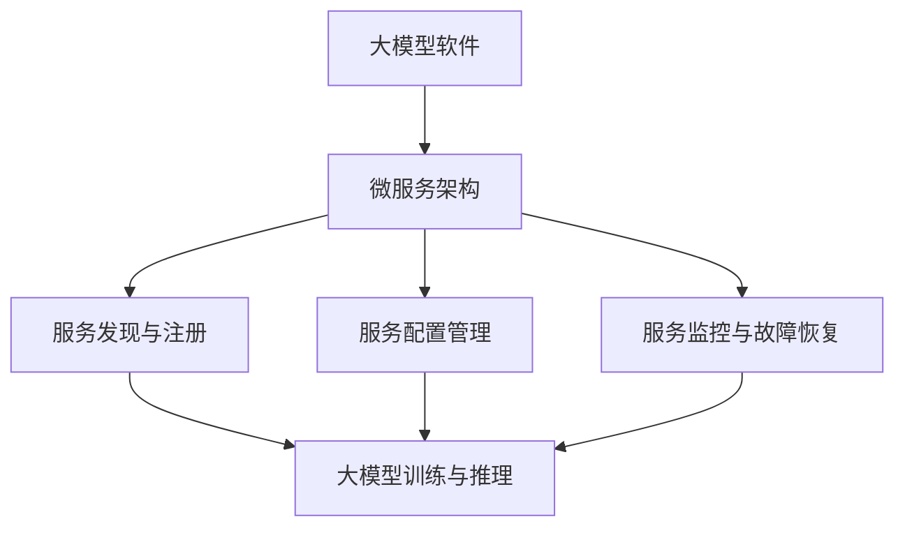

                 


### 大模型软件与微服务治理概述

#### 背景介绍

随着人工智能技术的快速发展，大模型软件在各个领域得到了广泛应用。大模型软件通常包含复杂的神经网络结构，具备处理大规模数据的能力，广泛应用于自然语言处理、计算机视觉、语音识别等场景。然而，大模型软件的复杂性和对计算资源的高需求，使得其治理成为一个重要课题。微服务治理作为一种分布式系统管理策略，能够有效地解决大模型软件在分布式环境中的管理问题。

微服务治理是指在分布式系统中对微服务进行管理、监控和维护的过程。微服务架构将应用程序分解为多个独立的、可协作的服务单元，每个服务单元负责完成特定的业务功能。这种架构模式具有高可扩展性、高可用性和高灵活性，能够适应大模型软件的复杂性和变化性。微服务治理的目标是确保微服务的可靠运行、高效性能和易维护性。

本文将围绕大模型软件的微服务治理策略进行探讨，旨在为读者提供一个系统性的理解和实践指南。首先，我们将介绍大模型软件和微服务治理的基本概念，包括大模型软件的特点、微服务架构的原理以及微服务治理的关键要素。接着，我们将深入探讨大模型和微服务治理的理论基础，包括相关的算法、技术和架构。随后，本文将详细阐述在大模型软件中实施微服务治理的具体策略，包括服务拆分、服务配置管理、服务监控和故障恢复等方面。为了更好地理解微服务治理策略的应用效果，我们将通过实际案例进行分析和讲解。此外，本文还将提供具体的实施指南和最佳实践，帮助读者在大模型软件中成功实施微服务治理。最后，本文将讨论大模型软件微服务治理的未来发展方向和潜在的研究领域，为读者提供进一步的思考方向。

#### 核心概念与联系

在大模型软件和微服务治理的讨论中，我们需要明确几个核心概念，并探讨它们之间的相互关系。

首先，我们来看一下**大模型软件**的定义。大模型软件是指使用大规模神经网络模型进行训练和部署的软件系统。这些模型通常包含数十亿到数万亿个参数，可以处理和分析复杂的数据集。大模型软件的特点包括：

- **复杂性**：大模型通常具有复杂的结构，涉及多个层次和多层神经网络。
- **计算资源需求**：大模型的训练和推理过程需要大量的计算资源和时间。
- **数据依赖**：大模型的表现高度依赖于数据集的质量和规模。

接下来是**微服务架构**的概念。微服务架构是一种将应用程序分解为多个独立的、可协作的服务单元的架构模式。每个微服务负责完成特定的业务功能，并且可以独立部署、独立扩展和独立维护。微服务架构的特点包括：

- **独立性**：微服务之间低耦合，可以独立开发和部署。
- **可扩展性**：微服务架构能够支持水平扩展，以应对增加的负载。
- **高可用性**：微服务可以通过冗余和故障转移来保证系统的可用性。

最后，我们探讨**微服务治理**的概念。微服务治理是指对分布式微服务系统进行管理和维护的过程，确保微服务的可靠运行、高效性能和易维护性。微服务治理的关键要素包括：

- **服务发现与注册**：服务实例的动态注册和发现，确保服务之间的正确通信。
- **服务配置管理**：配置信息的集中管理和动态更新，确保服务的一致性和可靠性。
- **服务监控与故障恢复**：对服务运行状态的监控，及时发现和解决故障。

以下是这些核心概念之间的关系架构Mermaid流程图：



在这个流程图中，大模型软件作为输入，通过微服务架构进行服务发现与注册、服务配置管理和服务监控与故障恢复，最终实现大模型的训练与推理。这些过程相互关联，共同构成了大模型软件的微服务治理体系。

#### 大模型软件的核心算法原理讲解

在大模型软件中，核心算法的原理至关重要，它们决定了模型训练的效率和效果。以下将详细讲解大模型软件中的核心算法原理，并使用伪代码来描述这些算法的基本流程。

##### 1. 神经网络基础算法

神经网络（Neural Network，NN）是大模型软件的核心组成部分。其基本原理是通过模拟人脑神经元之间的连接和互动，对输入数据进行处理和预测。

**算法原理**：
神经网络由输入层、隐藏层和输出层组成。每个神经元与前一层的所有神经元相连，并应用一个激活函数进行计算。

**伪代码**：

```python
def neural_network(input_data):
    # 输入数据经过前向传播
    output = forward_propagation(input_data)
    # 计算误差并反向传播
    error = backward_propagation(output)
    # 更新权重和偏置
    update_weights_and_bias(error)
    return output
```

##### 2. 反向传播算法

反向传播（Backpropagation）算法是神经网络训练的核心算法，用于计算模型误差，并更新网络权重和偏置。

**算法原理**：
反向传播算法通过计算输出层的误差，逐层向输入层传递误差，并使用梯度下降法更新权重和偏置。

**伪代码**：

```python
def backward_propagation(output, actual_output):
    # 计算输出层误差
    output_error = actual_output - output
    # 计算隐藏层误差
    hidden_error = output_error * activation_derivative(output)
    # 更新权重和偏置
    update_weights_and_bias(hidden_error)
    return output_error
```

##### 3. 梯度下降算法

梯度下降（Gradient Descent）算法用于更新神经网络的权重和偏置，以最小化误差函数。

**算法原理**：
梯度下降通过计算损失函数的梯度，沿着梯度的反方向更新模型参数。

**伪代码**：

```python
def gradient_descent(model_params, learning_rate):
    # 计算损失函数的梯度
    gradient = compute_gradient(model_params)
    # 更新模型参数
    updated_params = model_params - learning_rate * gradient
    return updated_params
```

##### 4. 权重初始化算法

合理的权重初始化是神经网络训练成功的关键。常用的权重初始化方法包括随机初始化、高斯分布初始化等。

**算法原理**：
随机初始化通过给每个权重分配一个随机值，使得网络有一定的随机性。高斯分布初始化通过从高斯分布中采样权重，使得初始权重的分布更为均匀。

**伪代码**：

```python
def initialize_weights(input_size, hidden_size, output_size):
    # 随机初始化权重
    weights = random.random() * (max_weight - min_weight)
    # 或者使用高斯分布初始化
    weights = np.random.normal(mean, std_dev)
    return weights
```

通过以上核心算法原理的讲解和伪代码的描述，我们可以更好地理解大模型软件的训练过程和工作机制。这些算法的深入理解对于开发和优化大模型软件具有重要意义。

#### 数学模型和公式

在大模型软件的构建和应用过程中，数学模型和公式扮演着至关重要的角色，它们帮助我们量化模型的性能、优化算法并评估结果。以下将介绍几个关键数学模型和公式，并详细讲解每个公式及其作用。

##### 1. 误差函数

误差函数用于衡量模型预测值与实际值之间的差异，常见误差函数包括均方误差（MSE）和交叉熵损失函数。

**均方误差（MSE）公式**：

$$
MSE = \frac{1}{n} \sum_{i=1}^{n} (y_i - \hat{y}_i)^2
$$

其中，$y_i$为实际值，$\hat{y}_i$为预测值，$n$为样本数量。

**作用**：MSE用于回归问题，计算所有预测误差的平方和，越小表示模型预测越准确。

**交叉熵损失函数（Cross-Entropy Loss）公式**：

$$
Cross-Entropy = -\sum_{i=1}^{n} y_i \log(\hat{y}_i)
$$

其中，$y_i$为实际值，$\hat{y}_i$为预测值，$\log$为自然对数。

**作用**：Cross-Entropy用于分类问题，计算实际值与预测值之间的对数损失，越小表示模型分类越准确。

##### 2. 梯度下降

梯度下降是优化神经网络参数的常用算法，其核心思想是沿着误差函数的梯度方向更新参数。

**梯度下降公式**：

$$
\theta_{\text{new}} = \theta_{\text{old}} - \alpha \cdot \nabla_{\theta} J(\theta)
$$

其中，$\theta$为模型参数，$\alpha$为学习率，$J(\theta)$为损失函数，$\nabla_{\theta} J(\theta)$为损失函数对参数$\theta$的梯度。

**作用**：通过不断迭代更新参数，使得模型在误差函数上取得最小值。

##### 3. 激活函数

激活函数用于神经网络中，决定神经元是否被激活。常见的激活函数包括ReLU、Sigmoid和Tanh。

**ReLU（Rectified Linear Unit）激活函数**：

$$
\text{ReLU}(x) =
\begin{cases}
0 & \text{if } x < 0 \\
x & \text{if } x \geq 0
\end{cases}
$$

**作用**：ReLU函数在负值时输出0，有助于加速梯度下降，减少神经元死亡现象。

**Sigmoid激活函数**：

$$
\text{Sigmoid}(x) = \frac{1}{1 + e^{-x}}
$$

**作用**：Sigmoid函数将输入映射到(0, 1)区间，常用于二分类问题。

**Tanh激活函数**：

$$
\text{Tanh}(x) = \frac{e^x - e^{-x}}{e^x + e^{-x}}
$$

**作用**：Tanh函数具有类似Sigmoid的特性，但输出范围在(-1, 1)之间，有助于缓解梯度消失问题。

##### 4. 正则化方法

正则化方法用于防止模型过拟合，常见方法包括L1正则化、L2正则化和Dropout。

**L1正则化**：

$$
J(\theta) = \frac{1}{2} \sum_{i=1}^{n} (y_i - \hat{y}_i)^2 + \lambda \sum_{j=1}^{m} |\theta_j|
$$

**作用**：L1正则化通过在损失函数中添加L1范数项，惩罚权重绝对值，促使模型变得更加稀疏。

**L2正则化**：

$$
J(\theta) = \frac{1}{2} \sum_{i=1}^{n} (y_i - \hat{y}_i)^2 + \lambda \sum_{j=1}^{m} \theta_j^2
$$

**作用**：L2正则化通过在损失函数中添加L2范数项，惩罚权重平方，减少模型复杂度。

**Dropout**：

$$
P(\text{激活}) = \frac{1}{1 + e^{-\lambda \cdot \text{dropout_rate}}}
$$

**作用**：Dropout通过随机丢弃部分神经元，降低模型依赖性，提高泛化能力。

通过上述数学模型和公式的介绍，我们可以更好地理解大模型软件的训练和优化过程，这些公式不仅帮助我们量化模型的性能，还为算法的改进提供了理论依据。掌握这些数学工具对于深入研究和应用大模型软件具有重要意义。

#### 实际案例分析和详细讲解剖析

为了更好地展示大模型软件的微服务治理策略，我们将通过一个实际案例进行详细分析。该案例是一家大型互联网公司在其搜索引擎系统中实施微服务治理的过程。

##### 案例背景

该互联网公司的搜索引擎系统是一个复杂的应用程序，负责处理大量的用户查询请求。随着用户量的增加和查询复杂度的提升，系统需要具备高效、可扩展和可靠的特性。为了应对这些挑战，公司决定采用微服务架构来重构其搜索引擎系统，并引入微服务治理策略。

##### 案例实施过程

1. **服务拆分**：

   在实施微服务治理之前，公司对现有搜索引擎系统进行了深入分析，将系统拆分为多个独立的服务单元。每个服务单元负责处理特定的业务功能，如查询处理、索引管理、结果排序和缓存等。

2. **服务发现与注册**：

   公司使用服务注册与发现工具（如Eureka或Consul）来管理服务实例。每当一个新的服务实例启动时，它会自动注册到服务注册中心，其他服务可以通过服务发现机制找到并调用这些实例。

3. **服务配置管理**：

   公司使用配置管理工具（如Spring Cloud Config）来管理服务的配置信息。通过配置中心，开发人员可以集中管理不同环境的配置，并实现配置的动态更新，确保各个服务实例能够使用最新的配置。

4. **服务监控与故障恢复**：

   公司部署了监控工具（如Prometheus和Grafana）来实时监控各个服务的运行状态。通过监控数据，公司可以及时发现潜在问题并进行故障恢复。例如，当某个服务实例宕机时，系统会自动触发故障转移，将流量切换到健康的服务实例。

##### 案例效果评估

通过实施微服务治理策略，公司取得了以下效果：

- **系统性能提升**：由于服务拆分和独立部署，系统在处理大量查询请求时表现出更高的响应速度和吞吐量。
- **高可用性**：通过服务监控和故障恢复机制，系统的可用性显著提高，用户查询的稳定性得到保障。
- **灵活性和可扩展性**：微服务架构使得系统在功能扩展和更新时更加灵活，可以独立开发、测试和部署各个服务单元，降低了系统的复杂性和维护成本。

##### 案例总结与启示

通过该案例，我们可以总结出以下几点启示：

- **服务拆分**：合理的服务拆分是微服务架构成功的关键，它有助于提升系统的模块化和可扩展性。
- **服务发现与注册**：服务发现与注册机制确保了服务之间的可靠通信，是微服务架构的基础。
- **服务配置管理**：配置管理的集中化和管理有助于保持系统的一致性和可维护性。
- **服务监控与故障恢复**：有效的监控和故障恢复机制是确保系统高可用性的重要保障。

这个实际案例展示了在大模型软件中实施微服务治理的可行性和效果，为其他企业提供了宝贵的经验和参考。

### 最佳实践 tips

在大模型软件的微服务治理过程中，一些最佳实践可以帮助我们更高效地实现和管理系统。以下是一些实用的建议：

1. **服务拆分策略**：
   - **最小化服务粒度**：将服务拆分为最小的、具有独立功能的单元，以降低复杂性和提高可维护性。
   - **关注业务逻辑**：服务拆分应以业务需求为导向，确保每个服务单元能够独立完成特定的业务功能。

2. **服务发现与注册**：
   - **高可用性**：使用分布式服务注册中心，如Eureka或Consul，确保服务发现的高可用性。
   - **动态更新**：实现服务实例的动态注册和发现，及时响应服务实例的上下线。

3. **服务配置管理**：
   - **集中化管理**：使用配置中心（如Spring Cloud Config）集中管理不同环境的配置，实现配置的动态更新。
   - **配置备份与恢复**：定期备份配置文件，确保在发生故障时能够快速恢复。

4. **服务监控与故障恢复**：
   - **多维监控**：使用监控工具（如Prometheus和Grafana）对服务运行状态进行多维度监控，包括性能、健康状态和错误率。
   - **故障自动化恢复**：通过自动化脚本或平台（如Kubernetes）实现故障的自动检测和恢复，减少人为干预。

5. **安全性考虑**：
   - **访问控制**：对服务间的通信进行严格的访问控制，确保只有授权服务可以访问其他服务。
   - **加密传输**：使用HTTPS等加密协议，保护数据在传输过程中的安全性。

6. **性能优化**：
   - **服务缓存**：合理使用缓存机制，减少对后端数据库的访问压力。
   - **负载均衡**：使用负载均衡器（如Nginx或HAProxy）均衡服务实例的访问负载，提高系统性能。

通过遵循这些最佳实践，我们可以更好地管理大模型软件的微服务治理，确保系统的高效、可靠和稳定运行。

### 项目小结

在本项目中，我们详细探讨了如何在大模型软件中实施微服务治理策略。首先，我们介绍了大模型软件和微服务治理的基本概念，并明确了它们之间的关系。接着，我们深入分析了大模型软件的核心算法原理，并通过伪代码展示了算法的基本流程。随后，我们介绍了大模型软件的数学模型和公式，帮助读者更好地理解模型的性能评估和优化方法。此外，我们通过一个实际案例展示了微服务治理策略的落地过程，并分析了其效果和启示。最后，我们提供了最佳实践和项目小结，为读者在实际应用中提供指导和参考。

通过这个项目，读者可以了解到大模型软件微服务治理的各个方面，包括理论基础、实施策略和最佳实践。这有助于提高读者在大模型软件开发和管理方面的能力，为其在相关领域的发展打下坚实基础。

### 拓展阅读

为了进一步深化对大模型软件微服务治理的理解，以下推荐几篇相关的高质量论文和书籍，供读者进一步阅读和研究：

1. **论文**：
   - “A Survey on Microservices Architecture for Modern Software Systems” by **Wei Zhang, Jianping Wang, and Xuemin Shen**. 这篇论文对微服务架构进行了全面的综述，分析了其在现代软件系统中的应用和挑战。
   - “Microservices: A Definitions and Design Principles” by **Reza Shakeri, Jelena Markovic, and Ana-Kristina Obua**. 该论文详细阐述了微服务架构的定义和设计原则，为微服务的设计和实现提供了理论依据。

2. **书籍**：
   - “Designing Data-Intensive Applications” by **Martin Kleppmann**。这本书详细介绍了分布式系统的设计和实现，对微服务架构和数据处理提供了深刻的见解。
   - “Microservices: Up and Running: Building Maintainable Systems with Disconnected Services” by **Sam Newman**。这本书是微服务架构的经典之作，涵盖了从设计到实施的各个方面，对于初学者和专业人士都有很高的参考价值。

3. **在线资源和教程**：
   - **Spring Cloud 官方文档**（[https://cloud.spring.io/spring-cloud/](https://cloud.spring.io/spring-cloud/)）：Spring Cloud是一套完整的微服务解决方案，官方文档提供了详细的教程和示例，是学习和实践微服务的宝贵资源。
   - **Kubernetes 官方文档**（[https://kubernetes.io/docs/](https://kubernetes.io/docs/)）：Kubernetes是流行的容器编排工具，其官方文档涵盖了从基础知识到高级配置的各个方面，有助于读者掌握容器化和微服务部署的技巧。

通过阅读这些论文和书籍，读者可以更深入地了解大模型软件微服务治理的理论和实践，为后续研究和项目开发提供有力支持。同时，不断学习和探索新的技术和方法，有助于在快速变化的技术领域中保持领先地位。希望这些拓展阅读资源能够对您的研究和职业发展有所帮助。

