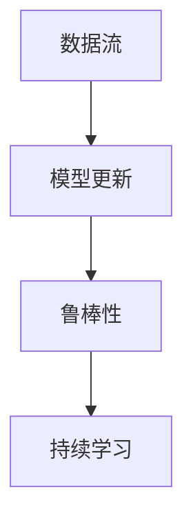

                 


### 3.1 持续学习概念

持续学习（Continuous Learning）是指机器学习模型在已有知识的基础上，不断获取新数据并进行学习，以适应动态变化的环境和任务需求。其核心目标是保持模型的准确性和鲁棒性，使其能够应对不断变化的数据分布和应用场景。

#### 核心概念与联系

持续学习的核心概念包括：

- 数据流：持续学习依赖于实时数据流，这些数据可以是新的样本、标签信息，或者是环境中的变化。
- 模型更新：模型在持续学习过程中不断更新，以适应新的数据分布。
- 鲁棒性：持续学习要求模型具有较高的鲁棒性，即使在数据分布发生变化时，也能保持良好的性能。

这些概念之间的关系可以通过以下 Mermaid 流程图来表示：



#### 核心算法原理讲解

持续学习的核心算法包括以下几种：

1. **在线学习**：在线学习是指在实时数据流中不断更新模型参数。其伪代码如下：

   ```python
   for each new data point in data_stream:
       predict = model(data_point)
       update_model(predict, data_point)
   ```

2. **迁移学习**：迁移学习是指将已有模型的某些知识迁移到新任务中。其伪代码如下：

   ```python
   pre_trained_model = load_pre_trained_model()
   new_model = copy(pre_trained_model)
   new_model.fit(new_data, new_labels)
   ```

3. **增量学习**：增量学习是指模型在已有知识的基础上，对新数据进行学习。其伪代码如下：

   ```python
   for each new data point:
       model.partial_fit(data_point)
   ```

#### 数学模型和公式

持续学习的数学模型主要包括以下几个方面：

1. **损失函数**：损失函数用于评估模型预测值与真实值之间的差异。常见的损失函数包括均方误差（MSE）、交叉熵（Cross-Entropy）等。

   $$ 
   L(\theta) = \frac{1}{m} \sum_{i=1}^{m} (y_i - \hat{y}_i)^2 
   $$

   其中，$L(\theta)$ 是损失函数，$\theta$ 是模型参数，$y_i$ 是真实值，$\hat{y}_i$ 是预测值。

2. **优化算法**：优化算法用于更新模型参数，以最小化损失函数。常见的优化算法包括梯度下降（Gradient Descent）、Adam等。

   $$ 
   \theta = \theta - \alpha \nabla_\theta L(\theta) 
   $$

   其中，$\alpha$ 是学习率，$\nabla_\theta L(\theta)$ 是损失函数关于模型参数的梯度。

#### 举例说明

假设我们有一个分类问题，模型需要预测图片中的物体类别。在持续学习过程中，我们可以采用以下步骤：

1. 初始化模型。
2. 收集新的图片数据。
3. 对新数据进行预处理，如归一化、裁剪等。
4. 使用模型对新数据进行预测。
5. 计算预测值与真实值之间的差异。
6. 使用优化算法更新模型参数。
7. 重复步骤 3-6，直到模型达到预期性能。

通过以上步骤，模型可以不断适应新的数据分布，提高分类准确率。

---

持续学习是机器学习领域的一个重要研究方向，它使模型能够适应动态变化的环境和应用场景。本文介绍了持续学习的核心概念、算法原理和数学模型，并通过一个分类问题的实例，展示了持续学习在实际应用中的具体实现过程。持续学习的研究与应用对于提升机器学习模型在现实世界中的性能具有重要意义。在未来的研究中，我们还可以探索更高效的持续学习算法、更鲁棒的学习策略以及更广泛的应用场景。让我们一起期待持续学习领域的新发展！

