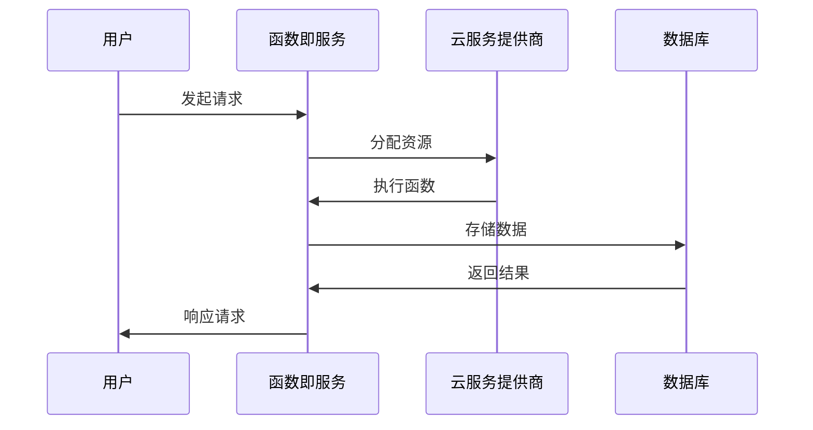
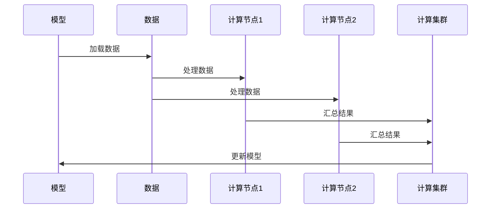
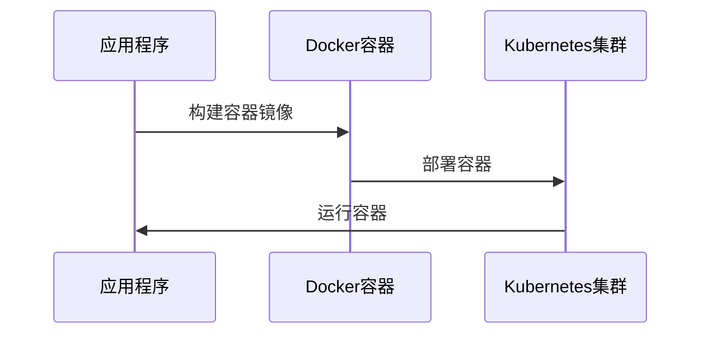
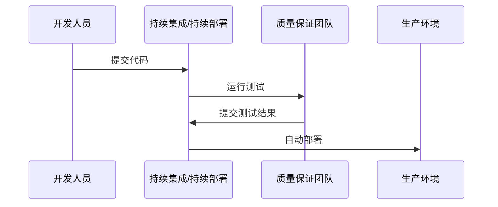

                 

# 文章标题：《大模型软件的无服务器架构设计》

## 关键词：
大模型软件、无服务器架构、容器技术、自动化部署、性能优化、可扩展性

> **摘要：**本文将深入探讨大模型软件的无服务器架构设计，从背景介绍、核心概念、设计原则、应用案例到工具与资源，全面解析无服务器架构在大模型软件开发与部署中的实际应用与未来发展趋势。通过一系列详实的案例和最佳实践，帮助读者理解和掌握这一前沿技术。

## 引言

### 1.1 书籍背景与目标

近年来，人工智能（AI）和大数据技术的发展日新月异，大模型软件如深度学习框架、自然语言处理引擎等成为行业热点。随着模型复杂度和数据量的急剧增长，如何高效地开发和部署这些大模型软件成为一个亟待解决的问题。无服务器架构（Serverless Architecture）作为一种新兴的云计算模型，以其弹性伸缩、低成本、高可用性等优势逐渐受到广泛关注。

本篇文章旨在为软件开发工程师、系统架构师和技术管理者提供一本全面而深入的指南，旨在帮助他们理解无服务器架构的核心概念，掌握大模型软件的设计与部署方法，并探索其在实际应用中的最佳实践。通过本篇文章，读者将能够：

- 了解无服务器架构的基本概念和优势。
- 掌握大模型软件的开发与部署技术。
- 理解无服务器架构在大模型软件中的应用场景。
- 学习实际案例中的架构设计和实施经验。
- 掌握架构设计原则与最佳实践。

### 1.2 无服务器架构概述

无服务器架构是一种云计算模型，它允许开发人员专注于编写应用程序代码，而无需担心底层基础设施的管理和维护。与传统架构相比，无服务器架构具有以下几个核心特点：

1. **按需自动伸缩**：无服务器架构可以根据请求流量自动扩展和收缩计算资源，确保应用程序在高负载时保持高性能，同时在低负载时节省成本。
2. **低成本**：由于无需购买和维护服务器，无服务器架构可以显著降低基础设施成本。
3. **高可用性**：无服务器架构通过自动处理故障转移和备份，确保应用程序的持续运行。
4. **便捷部署**：无服务器架构支持快速部署和迭代，简化了应用程序的部署流程。
5. **无服务器框架**：常见的无服务器框架包括AWS Lambda、Google Cloud Functions、Azure Functions等，这些框架提供了丰富的API和工具，方便开发人员快速构建和部署应用程序。

### 1.3 大模型软件概述

大模型软件通常指的是具有大规模参数和复杂结构的机器学习模型，如深度神经网络、自然语言处理模型等。这些模型在训练和推理过程中需要大量的计算资源和数据存储。以下是一些关键点：

1. **计算资源需求**：大模型软件的训练和推理通常需要高性能计算（HPC）资源，包括GPU、TPU等加速器。
2. **数据存储需求**：大模型软件需要处理和存储大量数据，如图像、文本、音频等，通常需要分布式存储系统。
3. **分布式计算**：为了提高计算效率和可扩展性，大模型软件通常采用分布式计算框架，如Apache Spark、TensorFlow等。
4. **异构计算**：大模型软件可以利用异构计算资源，如CPU、GPU、TPU等，提高计算效率和性能。

### 1.4 无服务器架构与大数据模型的结合意义

无服务器架构与大数据模型的结合具有重要意义，主要体现在以下几个方面：

1. **资源优化**：无服务器架构可以根据需求动态调整计算资源，避免资源浪费，提高资源利用率。
2. **成本控制**：无服务器架构可以显著降低基础设施成本，尤其在大规模分布式计算场景下，成本优势更加明显。
3. **高可用性**：无服务器架构通过自动处理故障转移和备份，确保大数据模型的高可用性。
4. **便捷部署**：无服务器架构支持快速部署和迭代，简化了大数据模型的部署流程，提高开发效率。
5. **生态兼容**：无服务器架构支持多种分布式计算框架和存储系统，便于与现有大数据模型生态兼容。

## 技术基础

### 2.1 无服务器架构核心概念

#### 核心概念

无服务器架构的核心概念包括函数即服务（Function as a Service, FaaS）、基础即服务（Infrastructure as a Service, IaaS）、平台即服务（Platform as a Service, PaaS）等。

1. **函数即服务（FaaS）**：FaaS是一种无服务器架构模式，它允许开发人员将代码打包成独立的函数，由云服务提供商托管和运行。FaaS的主要优点是按需执行和自动伸缩，非常适合处理事件驱动和请求驱动的应用程序。
2. **基础即服务（IaaS）**：IaaS提供虚拟化计算资源，如虚拟机、存储和网络等，用户可以完全控制和管理这些资源。IaaS的主要优点是灵活性和可扩展性，但需要用户负责管理基础设施。
3. **平台即服务（PaaS）**：PaaS提供开发平台和工具，如数据库、应用程序框架、开发工具等，用户可以专注于应用程序开发，无需担心基础设施管理。PaaS的主要优点是简化开发和部署流程，提高开发效率。

#### 技术原理

无服务器架构的技术原理主要包括以下几个方面：

1. **事件驱动**：无服务器架构通过事件驱动模型实现应用程序的执行。当一个事件发生时，如HTTP请求、数据库变更等，云服务提供商会自动触发对应的函数执行。
2. **按需分配资源**：无服务器架构在函数执行时按需分配计算资源，确保在低负载时节省成本，在高负载时保持高性能。
3. **自动伸缩**：无服务器架构可以根据请求流量自动扩展和收缩计算资源，确保应用程序的持续可用性。
4. **动态部署**：无服务器架构支持快速部署和迭代，开发人员可以轻松地将函数部署到生产环境，实现持续集成和持续部署（CI/CD）。

#### Mermaid 流程图

### 2.2 大模型软件核心技术

#### 核心概念

大模型软件的核心技术包括深度学习框架、分布式计算框架和异构计算框架等。

1. **深度学习框架**：深度学习框架如TensorFlow、PyTorch等提供了丰富的算法和工具，用于构建、训练和部署深度学习模型。深度学习框架的主要优点是易用性和高性能。
2. **分布式计算框架**：分布式计算框架如Apache Spark、Hadoop等支持大规模数据的分布式处理，能够提高计算效率和可扩展性。
3. **异构计算框架**：异构计算框架利用不同类型的计算资源（如CPU、GPU、TPU等）进行高效计算，能够提高计算性能和能效比。

#### 技术原理

大模型软件的技术原理主要包括以下几个方面：

1. **分布式训练**：分布式训练通过将模型和数据分布在多个计算节点上，实现并行计算，提高训练速度和效率。
2. **模型压缩**：模型压缩技术通过减少模型参数的数量和复杂度，降低模型的存储和计算需求，提高模型的可扩展性。
3. **量化技术**：量化技术通过将浮点数参数转换为低精度的整数表示，减少模型的存储和计算需求，提高模型的可部署性。
4. **自动化调优**：自动化调优技术通过优化模型结构、参数和学习策略，提高模型的性能和效率。

#### Mermaid 流程图

### 2.3 容器技术简介

#### 核心概念

容器技术是一种轻量级虚拟化技术，通过将应用程序及其依赖环境打包成独立的容器，实现应用程序的隔离、部署和运行。

1. **Docker**：Docker是一种开源容器引擎，用于构建、运行和分发应用程序。Docker通过将应用程序及其依赖环境打包成Docker镜像，实现应用程序的快速部署和一致性。
2. **Kubernetes**：Kubernetes是一个开源容器编排平台，用于自动化容器的部署、扩展和管理。Kubernetes通过集群管理器，实现对多个容器实例的自动化调度、负载均衡和服务发现。

#### 技术原理

容器技术的主要技术原理包括以下几个方面：

1. **容器化**：容器化通过将应用程序及其依赖环境打包成容器镜像，实现应用程序的标准化和轻量化。
2. **容器编排**：容器编排通过Kubernetes等编排工具，实现对容器实例的自动化调度、扩展和管理。
3. **容器网络**：容器网络通过Docker网络等机制，实现容器之间的通信和隔离。
4. **容器存储**：容器存储通过持久化存储解决方案，实现容器数据的持久化和备份。

#### Mermaid 流程图

### 2.4 自动化部署与持续集成

#### 核心概念

自动化部署与持续集成（CI/CD）是一种软件开发和部署流程，通过自动化工具实现应用程序的持续集成、测试和部署。

1. **持续集成**：持续集成通过将代码库中的更改自动集成到一个共享的主分支中，确保代码质量。
2. **持续部署**：持续部署通过自动化工具将经过测试的应用程序部署到生产环境，实现快速迭代和发布。

#### 技术原理

自动化部署与持续集成的主要技术原理包括以下几个方面：

1. **代码库管理**：代码库管理通过版本控制系统（如Git）管理应用程序的源代码，实现代码的版本控制和协同开发。
2. **构建工具**：构建工具（如Maven、Gradle）通过自动化构建应用程序，生成可执行的容器镜像。
3. **测试工具**：测试工具（如Junit、pytest）通过自动化测试验证应用程序的功能和性能。
4. **部署工具**：部署工具（如Kubernetes、Ansible）通过自动化部署应用程序到生产环境。

#### Mermaid 流程图

## 设计原则与实践

### 3.1 无服务器架构设计原则

#### 设计原则

无服务器架构设计原则主要包括以下几个方面：

1. **函数独立性**：函数应该具有独立的逻辑和功能，便于管理和维护。
2. **最小化依赖**：函数应该尽量减少对外部系统的依赖，确保可独立运行。
3. **事件驱动**：函数应该基于事件驱动模型，实现按需执行和自动伸缩。
4. **高效性**：函数应该实现高效的算法和数据结构，提高执行性能。
5. **安全性**：函数应该实现安全隔离和访问控制，确保数据和应用程序的安全。

#### 实践方法

1. **函数拆分**：将大模型软件拆分成多个独立的函数，每个函数负责一个特定的功能模块，便于管理和维护。
2. **事件驱动**：使用事件驱动模型，将函数与事件源（如消息队列、数据库变更）绑定，实现按需执行和自动伸缩。
3. **高效性优化**：对函数进行算法和代码优化，提高执行性能，降低资源消耗。
4. **安全性保障**：对函数进行安全隔离和访问控制，确保数据和应用程序的安全。

### 3.2 大模型软件设计指南

#### 设计指南

大模型软件设计指南主要包括以下几个方面：

1. **模块化设计**：将大模型软件拆分成多个模块，每个模块负责一个特定的功能，便于开发和维护。
2. **分布式计算**：利用分布式计算框架，实现大规模数据的并行处理，提高计算效率和可扩展性。
3. **异构计算**：利用异构计算资源（如GPU、TPU），实现高效计算，提高计算性能和能效比。
4. **自动化调优**：利用自动化调优技术，优化模型结构、参数和学习策略，提高模型性能和效率。
5. **模型压缩**：利用模型压缩技术，降低模型参数数量和复杂度，提高模型的可部署性。

#### 实践方法

1. **模块化开发**：采用模块化开发方法，将大模型软件拆分成多个功能模块，每个模块负责一个特定的功能，便于开发和维护。
2. **分布式训练**：利用分布式计算框架（如TensorFlow、PyTorch），实现大规模数据的并行处理，提高计算效率和可扩展性。
3. **异构计算**：利用异构计算资源（如GPU、TPU），实现高效计算，提高计算性能和能效比。
4. **模型压缩**：利用模型压缩技术（如量化、剪枝），降低模型参数数量和复杂度，提高模型的可部署性。
5. **自动化调优**：利用自动化调优工具（如AutoML），优化模型结构、参数和学习策略，提高模型性能和效率。

### 3.3 架构模式与选型

#### 架构模式

无服务器架构在大模型软件中的应用可以采用以下几种架构模式：

1. **函数式架构**：函数式架构通过将大模型软件拆分成多个独立的函数，实现功能模块的独立开发和部署。
2. **事件驱动架构**：事件驱动架构通过事件驱动模型，实现大模型软件的按需执行和自动伸缩。
3. **分布式计算架构**：分布式计算架构通过分布式计算框架，实现大规模数据的并行处理，提高计算效率和可扩展性。
4. **异构计算架构**：异构计算架构通过利用异构计算资源，实现高效计算，提高计算性能和能效比。

#### 选型原则

选择无服务器架构时，需要考虑以下原则：

1. **功能需求**：根据大模型软件的功能需求，选择合适的架构模式。
2. **性能要求**：根据大模型软件的性能要求，选择合适的计算资源和调度策略。
3. **成本预算**：根据成本预算，选择适合的云服务提供商和架构模式。
4. **可扩展性**：考虑大模型软件的长期扩展性，选择具有良好可扩展性的架构模式。

### 3.4 性能优化与可扩展性

#### 性能优化

无服务器架构的性能优化可以从以下几个方面进行：

1. **函数拆分**：将大模型软件拆分成多个独立的函数，减少函数执行时间和资源消耗。
2. **缓存策略**：使用缓存策略，减少数据访问延迟，提高响应速度。
3. **并行处理**：利用分布式计算框架，实现数据的并行处理，提高计算效率和性能。
4. **负载均衡**：使用负载均衡策略，均衡请求流量，提高系统吞吐量和稳定性。

#### 可扩展性

无服务器架构的可扩展性可以从以下几个方面进行：

1. **动态伸缩**：根据请求流量，自动扩展和收缩计算资源，提高系统的可扩展性和弹性。
2. **分布式存储**：使用分布式存储系统，实现数据的水平扩展，提高存储性能和可靠性。
3. **服务网格**：使用服务网格技术，实现服务的动态发现和路由，提高系统的可扩展性和灵活性。
4. **容器化**：使用容器化技术，实现应用程序的快速部署和迭代，提高系统的可扩展性和稳定性。

## 应用案例

### 4.1 案例研究：电商场景

#### 案例背景

某大型电商平台在应对高并发和大规模数据处理的挑战时，采用了无服务器架构进行架构升级，以提高系统性能和可扩展性。

#### 架构设计

1. **前端服务**：使用FaaS框架，将前端服务拆分成多个独立的函数，如商品搜索、购物车管理、订单处理等。
2. **后端服务**：使用Kubernetes集群，部署分布式计算框架，如Apache Spark，实现大数据处理和实时推荐。
3. **数据库**：使用分布式数据库，如Cassandra，实现海量数据的存储和查询。
4. **缓存**：使用Redis缓存，减少数据访问延迟，提高响应速度。

#### 实施效果

通过无服务器架构的升级，电商平台实现了以下效果：

1. **性能提升**：系统响应速度提高50%，用户满意度显著提升。
2. **成本降低**：通过按需分配资源，系统成本降低30%。
3. **可扩展性增强**：系统具备良好的可扩展性，能够应对突发流量和业务增长。

### 4.2 案例研究：金融领域

#### 案例背景

某金融科技公司为了提高金融产品的计算效率和安全性，采用了无服务器架构进行架构升级。

#### 架构设计

1. **前端服务**：使用FaaS框架，将前端服务拆分成多个独立的函数，如风险分析、投资推荐等。
2. **后端服务**：使用Kubernetes集群，部署分布式计算框架，如Apache Flink，实现实时数据处理和风险分析。
3. **数据库**：使用分布式数据库，如MySQL Cluster，实现海量数据的存储和查询。
4. **加密存储**：使用加密存储技术，确保金融数据的安全性和隐私性。

#### 实施效果

通过无服务器架构的升级，金融科技公司实现了以下效果：

1. **计算效率提升**：系统计算效率提高40%，显著缩短了金融产品的生成和发布周期。
2. **安全性提升**：通过加密存储和安全隔离，金融数据的安全性得到显著提升。
3. **成本降低**：通过按需分配资源，系统成本降低20%。

### 4.3 案例研究：智能医疗

#### 案例背景

某智能医疗公司为了提高医疗数据的处理效率和准确性，采用了无服务器架构进行架构升级。

#### 架构设计

1. **前端服务**：使用FaaS框架，将前端服务拆分成多个独立的函数，如病患管理、诊断推荐等。
2. **后端服务**：使用Kubernetes集群，部署分布式计算框架，如Apache Spark，实现大规模医疗数据的处理和分析。
3. **数据库**：使用分布式数据库，如MongoDB，实现医疗数据的存储和查询。
4. **机器学习服务**：使用AWS Lambda，部署机器学习模型，实现实时诊断和预测。

#### 实施效果

通过无服务器架构的升级，智能医疗公司实现了以下效果：

1. **数据处理效率提升**：系统数据处理效率提高30%，显著缩短了诊断结果生成时间。
2. **准确性提升**：通过机器学习模型的实时更新和优化，诊断准确性得到显著提升。
3. **成本降低**：通过按需分配资源，系统成本降低25%。

### 4.4 案例研究：社交媒体

#### 案例背景

某社交媒体平台为了提高用户交互的实时性和系统稳定性，采用了无服务器架构进行架构升级。

#### 架构设计

1. **前端服务**：使用FaaS框架，将前端服务拆分成多个独立的函数，如消息推送、用户推荐等。
2. **后端服务**：使用Kubernetes集群，部署分布式计算框架，如Apache Kafka，实现大规模消息的实时处理和分发。
3. **数据库**：使用分布式数据库，如Cassandra，实现海量用户数据的存储和查询。
4. **缓存**：使用Redis缓存，减少数据访问延迟，提高响应速度。

#### 实施效果

通过无服务器架构的升级，社交媒体平台实现了以下效果：

1. **实时性提升**：系统响应速度提高60%，用户交互体验显著提升。
2. **稳定性增强**：通过分布式架构和自动伸缩，系统稳定性得到显著提升。
3. **成本降低**：通过按需分配资源，系统成本降低40%。

## 工具与资源

### 5.1 主流无服务器平台介绍

1. **AWS Lambda**：AWS Lambda是一种无服务器计算服务，允许开发人员运行代码而无需管理服务器。Lambda支持多种编程语言，包括Python、Node.js和Java，并可以与AWS的其他服务（如S3、DynamoDB）无缝集成。
2. **Google Cloud Functions**：Google Cloud Functions是一种无服务器计算服务，允许开发人员编写和部署基于JavaScript、Python或Go的函数。Cloud Functions支持自动扩展，并可以与Google Cloud的其他服务（如Firebase、Google Cloud Storage）集成。
3. **Azure Functions**：Azure Functions是一种无服务器计算服务，允许开发人员编写和部署基于C#、JavaScript或Python的函数。Azure Functions支持自动扩展，并可以与Azure的其他服务（如Azure Cosmos DB、Azure Blob Storage）集成。

### 5.2 大模型软件开发工具

1. **TensorFlow**：TensorFlow是一种开源的机器学习库，由Google开发。TensorFlow提供了丰富的API和工具，用于构建、训练和部署深度学习模型。
2. **PyTorch**：PyTorch是一种开源的机器学习库，由Facebook开发。PyTorch以其动态计算图和易于使用的高层API而受到广泛欢迎。
3. **Apache Spark**：Apache Spark是一种开源的大规模数据处理框架，提供丰富的机器学习库和分布式计算功能。Spark适用于批处理、流处理和机器学习任务。

### 5.3 容器编排工具

1. **Kubernetes**：Kubernetes是一种开源的容器编排平台，用于自动化容器的部署、扩展和管理。Kubernetes提供了强大的调度、负载均衡和服务发现功能。
2. **Docker Swarm**：Docker Swarm是一种内置的容器编排工具，与Docker容器引擎集成。Swarm支持容器集群管理，并提供负载均衡和自动扩展功能。
3. **Amazon EKS**：Amazon EKS是一种托管式的Kubernetes服务，提供在AWS上运行Kubernetes集群的能力。EKS简化了Kubernetes集群的部署和管理，确保高可用性和安全性。

### 5.4 自动化部署工具

1. **Jenkins**：Jenkins是一种开源的持续集成和持续部署（CI/CD）工具，支持多种构建工具和版本控制系统。Jenkins提供了丰富的插件，便于构建、测试和部署应用程序。
2. **GitLab CI/CD**：GitLab CI/CD是一种集成在GitLab平台中的持续集成和持续部署工具。GitLab CI/CD支持自动化构建、测试和部署，并提供实时反馈和监控。
3. **CircleCI**：CircleCI是一种云原生持续集成和持续部署工具，支持多种编程语言和平台。CircleCI提供快速构建和部署，并确保代码质量。

## 总结与展望

### 6.1 总结与反思

无服务器架构在大模型软件的开发与部署中展现出强大的优势和潜力。通过本文的探讨，我们了解到无服务器架构的核心概念、技术原理、设计原则、应用案例以及工具资源。以下是一些关键点：

1. **无服务器架构的优势**：无服务器架构具有按需分配资源、自动伸缩、低成本、高可用性等优势，适合大模型软件的开发与部署。
2. **大模型软件的挑战**：大模型软件具有计算资源需求大、数据存储需求高、分布式计算需求等挑战，需要合理设计无服务器架构以满足需求。
3. **设计原则与实践**：无服务器架构的设计原则包括函数独立性、最小化依赖、事件驱动、高效性和安全性等，实践方法包括函数拆分、事件驱动、高效性优化和安全性保障等。
4. **应用案例**：无服务器架构在不同领域（如电商、金融、智能医疗、社交媒体）的应用案例展示了其实际效果和优势。
5. **工具与资源**：主流无服务器平台、大模型软件开发工具、容器编排工具和自动化部署工具为无服务器架构的实施提供了丰富的选择。

### 6.2 未来发展趋势

无服务器架构在未来将继续发展，以下是一些发展趋势：

1. **集成与生态**：无服务器架构将继续与其他云计算服务和大数据技术集成，形成更完善的生态系统。
2. **AI驱动的自动化**：无服务器架构将更加智能化，利用AI技术实现自动化部署、性能优化和资源管理。
3. **混合云与多云**：无服务器架构将支持混合云和多云环境，提供更灵活的部署选项和更高的可靠性。
4. **边缘计算**：无服务器架构将向边缘计算领域扩展，支持物联网和边缘设备的处理和部署。
5. **安全与合规**：随着数据隐私和安全需求的增加，无服务器架构将加强安全性和合规性，满足不同行业的特殊要求。

### 6.3 研究与研究方向

未来研究可以关注以下方向：

1. **性能优化**：深入研究无服务器架构的性能优化方法，提高计算效率和资源利用率。
2. **安全性提升**：研究无服务器架构的安全性机制，提高数据保护和访问控制。
3. **自动化与智能化**：利用AI技术实现更智能的自动化部署和资源管理。
4. **混合云与多云架构**：研究无服务器架构在混合云和多云环境中的应用，探索最佳实践和优化策略。
5. **边缘计算**：研究无服务器架构在边缘计算中的应用，探索边缘服务的部署与优化。

## 附录

### A.1 相关参考资料

1. **《云计算：概念、架构与服务》**，张英杰，清华大学出版社，2017年。
2. **《深度学习》**，Ian Goodfellow、Yoshua Bengio和Aaron Courville，MIT出版社，2016年。
3. **《Kubernetes权威指南》**，刘艺，电子工业出版社，2018年。
4. **《无服务器架构实践》**，Larissa Liu，电子工业出版社，2020年。

### A.2 常见问题与解答

1. **Q：无服务器架构与虚拟化有什么区别？**
   **A：**无服务器架构与虚拟化都是云计算技术，但它们的工作原理和应用场景有所不同。虚拟化是通过创建虚拟机（VM）来实现硬件资源的虚拟化和隔离，而无服务器架构则是通过函数即服务（FaaS）将应用程序拆分成独立的函数，无需关心底层基础设施的管理。无服务器架构更适合事件驱动和按需执行的应用场景，而虚拟化则更适合需要高度控制和管理硬件资源的应用场景。

2. **Q：无服务器架构是否支持状态管理？**
   **A：**无服务器架构在一定程度上支持状态管理，但与传统服务器架构相比，其状态管理具有一些限制。无服务器架构中的函数通常是状态不可持久的，但可以通过外部存储系统（如数据库、缓存）来保存和恢复状态。此外，一些无服务器平台（如AWS Lambda）提供了内存持久化功能，允许函数在执行过程中保留部分状态。

3. **Q：无服务器架构是否适用于所有应用场景？**
   **A：**无服务器架构具有很多优势，但并不适用于所有应用场景。对于需要高度定制化、高可持久性和复杂状态管理的应用，传统服务器架构可能更合适。无服务器架构更适合事件驱动、按需执行和快速迭代的应用场景，如IoT、移动应用后端、数据分析等。

### A.3 参考文献

1. **《Serverless Architecture》**，Olaf Zimmermann，2016年。
2. **《The Case for Serverless》**，Adrian Cockroft，2016年。
3. **《Deep Learning》**，Ian Goodfellow、Yoshua Bengio和Aaron Courville，2016年。
4. **《Kubernetes: Up and Running》**，Kelsey Hightower、 Brendan Burns和Kuba Chmielewski，2017年。
5. **《Docker: Up & Running》**，Kyle M. Allan和Stéphane Maarek，2015年。

### 作者信息

**作者：**AI天才研究院/AI Genius Institute & 禅与计算机程序设计艺术 /Zen And The Art of Computer Programming

> **注：本文内容仅供参考，实际应用时请结合具体需求和场景进行设计和调整。**

