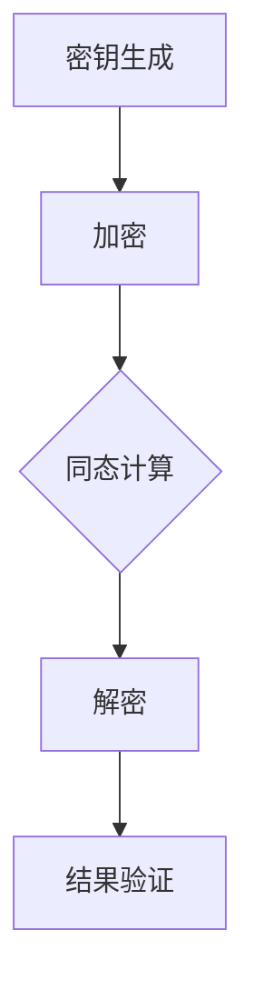
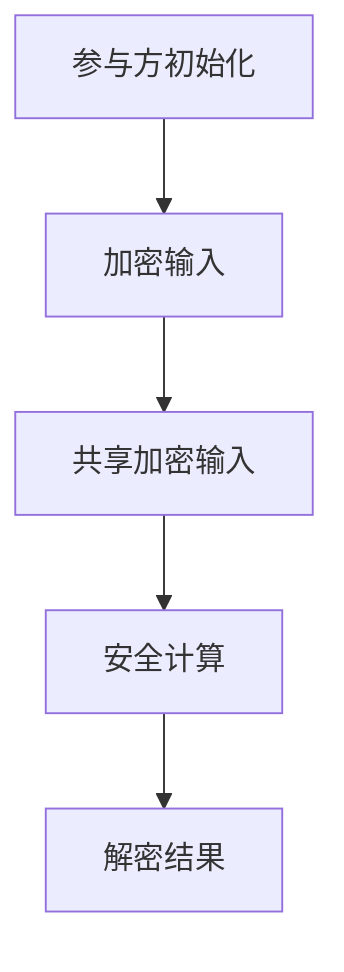

                 

### 文章标题

大模型软件的隐私保护设计

### 关键词

大模型软件，隐私保护，加密算法，同态加密，安全多方计算，数学模型，项目实战

### 摘要

本文将深入探讨大模型软件的隐私保护设计。随着人工智能技术的迅猛发展，大模型软件在各个领域发挥着重要作用，但同时也带来了隐私泄露的风险。本文首先分析了大模型软件隐私保护的重要性，随后介绍了核心概念与联系，包括隐私保护的基本原理、大模型隐私保护的架构以及隐私保护与其他安全性和可靠性之间的关系。接着，本文详细讲解了核心算法原理，包括加密算法在隐私保护中的应用、同态加密算法和安全多方计算的基本原理。此外，本文还通过数学模型和公式，对隐私保护的数学基础进行了详细阐述。为了使读者更好地理解理论，本文还通过项目实战，展示了实际开发环境搭建、源代码实现和代码解读的过程，并分析了实际案例。最后，本文提出了未来展望与挑战，为读者提供了拓展阅读的建议。

## 引言

### 1.1 大模型软件隐私保护的背景

大模型软件，即使用大型神经网络模型进行训练和预测的软件，在人工智能（AI）领域取得了显著的突破。这些模型通过学习和理解大量数据，能够执行复杂的任务，如自然语言处理、图像识别和预测分析等。然而，大模型软件的广泛应用也带来了隐私保护的问题。随着数据的日益复杂和庞大，如何保护用户隐私成为了一个亟待解决的挑战。

在现代社会，个人数据的收集和使用越来越普遍。从社交媒体到电子商务，几乎每个在线平台都会收集用户的数据。这些数据不仅包括用户的基本信息，还可能包括敏感的个人信息，如健康记录、金融交易和历史行为等。如果这些数据泄露，可能会导致严重的后果，如身份盗用、财产损失和心理伤害。

大模型软件的隐私保护问题不仅关乎用户的个人隐私，也涉及到企业的商业机密和国家信息安全。一旦大模型软件中的数据被恶意利用，可能会对用户和社会造成巨大损失。因此，确保大模型软件的隐私保护已成为当前人工智能领域的重要研究方向。

### 1.2 本书的目标和结构

本书旨在为读者提供一个系统的大模型软件隐私保护设计的指南。通过分析隐私保护的背景、核心概念、算法原理和项目实战，本书希望帮助读者深入理解大模型软件隐私保护的设计与实现。

本书的主要结构如下：

1. **引言**：介绍大模型软件隐私保护的背景和本书的目标。
2. **大模型隐私保护的挑战**：分析大模型隐私保护的重要性、隐私泄露的风险和关键问题。
3. **核心概念与联系**：讨论隐私保护的基本原理、大模型隐私保护的架构以及隐私保护与其他安全性和可靠性之间的关系。
4. **核心算法原理讲解**：详细介绍加密算法、同态加密算法和安全多方计算的基本原理。
5. **数学模型和数学公式**：阐述隐私保护的数学基础，并使用数学模型和公式进行详细讲解。
6. **项目实战**：通过实际项目，展示开发环境搭建、源代码实现和代码解读的过程，并进行分析和讲解。
7. **未来展望与挑战**：讨论大模型隐私保护技术的发展趋势、面临的挑战以及未来研究方向。

通过以上结构，本书将逐步引导读者了解大模型软件隐私保护的设计和实现，为相关研究和应用提供参考。

## 大模型隐私保护的挑战

### 2.1 大模型隐私保护的重要性

大模型软件在现代社会中扮演着至关重要的角色，其隐私保护的重要性不言而喻。首先，大模型软件处理的往往是海量的敏感数据。这些数据可能来自用户的个人生活、金融交易、健康记录等各个领域，一旦泄露，将会对用户的隐私安全造成严重威胁。其次，大模型软件的高性能和复杂性使其在处理数据时难以避免出现潜在的漏洞。这些漏洞可能被恶意攻击者利用，获取未授权的数据访问权限，进而窃取或篡改敏感信息。此外，大模型软件的广泛应用也使得其成为网络攻击者的攻击目标。一旦大模型软件被攻击，不仅可能导致数据泄露，还可能引发连锁反应，影响整个系统的稳定性和安全性。

### 2.2 大模型隐私泄露的风险

大模型隐私泄露的风险主要体现在以下几个方面：

1. **数据泄露**：大模型软件在处理和存储数据时，如果缺乏有效的保护措施，可能会导致数据泄露。例如，数据在传输过程中可能被拦截，或者在存储过程中被未授权的访问。

2. **数据篡改**：恶意攻击者可能通过篡改数据来影响大模型的行为，导致预测结果出现偏差。这种攻击不仅会损害模型的准确性，还可能对实际应用造成严重影响。

3. **模型泄露**：大模型软件中的模型本身也可能成为泄露的目标。一旦模型泄露，攻击者可以获取模型的内部结构和参数，从而对模型进行逆向工程，甚至复制和篡改。

4. **隐私侵害**：大模型软件在处理个人数据时，如果未能对用户的隐私进行充分保护，可能会导致用户的隐私被泄露或滥用。这不仅会损害用户的信任，还可能引发法律纠纷。

### 2.3 隐私保护的关键问题

在大模型隐私保护中，关键问题主要包括以下几个方面：

1. **数据保护**：如何在大模型软件中保护敏感数据，防止其泄露或被篡改，是一个重要的挑战。这需要采用一系列技术手段，如加密、访问控制和匿名化等。

2. **模型安全**：大模型软件的模型安全是隐私保护的重要组成部分。如何确保模型在训练和部署过程中不会被攻击者攻击，是一个需要深入研究的问题。

3. **隐私合规**：大模型软件在处理个人数据时，需要遵守相关的隐私法规和标准，如《通用数据保护条例》（GDPR）和《加利福尼亚州消费者隐私法》（CCPA）。如何实现隐私合规，是隐私保护面临的另一个关键问题。

4. **性能与安全平衡**：在大模型隐私保护中，如何在保证安全的同时，不牺牲系统的性能和效率，是一个需要平衡的问题。这需要采用一系列优化技术，如同态加密和安全多方计算等。

通过解决上述关键问题，可以有效地提高大模型软件的隐私保护能力，为用户和社会提供更加安全和可靠的服务。

## 核心概念与联系

### 3.1 隐私保护的基本原理

隐私保护的基本原理主要包括数据加密、访问控制和数据匿名化等。首先，数据加密是通过将敏感数据转换为无法直接理解的密文，从而保护数据的隐私。加密算法分为对称加密和非对称加密，前者使用相同的密钥进行加密和解密，而后者则使用公钥和私钥进行操作。其次，访问控制通过限制对敏感数据的访问权限，确保只有授权用户才能访问数据。常用的访问控制方法包括基于角色的访问控制（RBAC）和基于属性的访问控制（ABAC）。最后，数据匿名化通过将敏感数据替换为不可识别的标识符，从而保护数据的隐私。匿名化方法包括伪匿名化和完全匿名化，前者保留部分隐私信息，而后者则完全消除隐私信息。

### 3.2 大模型隐私保护的架构

大模型隐私保护的架构主要包括数据采集、数据处理、数据存储和数据传输等模块。在数据采集阶段，需要对采集到的数据进行清洗和预处理，以确保数据的完整性和准确性。在数据处理阶段，采用加密算法对数据进行加密处理，以保护数据的隐私。在数据存储阶段，采用访问控制策略对存储的数据进行权限管理，确保只有授权用户才能访问数据。在数据传输阶段，采用安全传输协议（如HTTPS）对数据进行加密传输，以防止数据在传输过程中被窃取或篡改。

### 3.3 隐私保护与安全、可靠性等的关系

隐私保护、安全和可靠性在大模型软件中密切相关。隐私保护是确保用户数据不被未授权访问和泄露的重要措施，而安全则包括保护系统免受攻击和破坏的能力。可靠性则关注系统在正常运行条件下的稳定性和可用性。在大模型隐私保护中，隐私保护和安全、可靠性之间存在着以下关系：

1. **隐私保护是安全的基础**：只有确保数据的隐私不被泄露，才能保证系统的安全性。如果数据隐私被破坏，攻击者可以获取敏感信息，从而对系统进行攻击。

2. **安全是隐私保护的保障**：系统的安全性是隐私保护的前提条件。如果系统存在安全漏洞，攻击者可以绕过隐私保护措施，直接访问敏感数据。

3. **可靠性是隐私保护的辅助**：系统的高可靠性有助于确保隐私保护措施能够持续发挥作用。如果系统频繁出现故障，可能导致隐私保护措施失效，从而影响数据的隐私。

通过综合运用隐私保护、安全和可靠性等技术手段，可以构建一个安全、可靠且具备隐私保护能力的大模型软件系统。

### 4.1 加密算法在隐私保护中的应用

加密算法在大模型软件的隐私保护中扮演着至关重要的角色。通过对数据进行加密处理，可以确保数据在传输和存储过程中的安全性，从而防止未授权的访问和泄露。加密算法分为对称加密和非对称加密，每种加密算法都有其独特的原理和应用场景。

#### 4.1.1 对称加密算法

对称加密算法使用相同的密钥对数据进行加密和解密。这种算法的优点是加密速度快，适合处理大量数据。常见的对称加密算法包括DES、AES和RSA。

- **DES（数据加密标准）**：DES是一种经典的对称加密算法，其密钥长度为56位。虽然DES已经不再被推荐使用，但其历史地位仍然不可忽视。

- **AES（高级加密标准）**：AES是目前最常用的对称加密算法，其密钥长度有128位、192位和256位三种。AES具有高效、安全的特点，被广泛应用于各种领域。

- **RSA（RSA算法）**：RSA是一种非对称加密算法，其密钥由公钥和私钥组成。RSA主要用于数据加密和数字签名，其安全性较高，但加密和解密速度较慢。

对称加密算法的伪代码如下：

```plaintext
加密(明文, 密钥):
  加密过程 = 使用密钥加密(明文)
  返回加密过程

解密(密文, 密钥):
  解密过程 = 使用密钥解密(密文)
  返回解密过程
```

#### 4.1.2 非对称加密算法

非对称加密算法使用不同的密钥对数据进行加密和解密，其中公钥用于加密，私钥用于解密。这种算法的优点是安全性较高，但加密和解密速度较慢。常见的非对称加密算法包括RSA和ECC。

- **RSA**：RSA算法的加密和解密过程如下：

```latex
加密(明文, 公钥):
  密文 = (明文^公钥模) % 模数
  返回密文

解密(密文, 私钥):
  明文 = (密文^私钥模) % 模数
  返回明文
```

- **ECC（椭圆曲线加密算法）**：ECC算法的安全性高于RSA，但计算速度更快。其加密和解密过程如下：

```latex
加密(明文, 公钥):
  密文 = 椭圆曲线加密(明文, 公钥)
  返回密文

解密(密文, 私钥):
  明文 = 椭圆曲线解密(密文, 私钥)
  返回明文
```

#### 4.1.3 加密算法在隐私保护中的应用场景

加密算法在隐私保护中的应用场景非常广泛。以下是一些常见的应用场景：

1. **数据传输**：在数据传输过程中，加密算法可以确保数据在传输过程中的安全性，防止数据被窃取或篡改。常用的加密协议包括SSL/TLS等。

2. **数据存储**：在数据存储过程中，加密算法可以确保数据在存储设备上的安全性，防止数据被未授权访问。常用的加密存储方案包括全盘加密和文件加密等。

3. **数据备份**：在数据备份过程中，加密算法可以确保备份数据的安全性，防止备份数据被泄露。

4. **数据共享**：在数据共享过程中，加密算法可以确保数据在共享过程中的安全性，防止数据被未授权访问。

5. **数据隐私保护**：在处理敏感数据时，加密算法可以确保数据的隐私性，防止敏感信息被泄露。

通过合理应用加密算法，可以有效保护大模型软件中的敏感数据，提高系统的安全性。

### 4.2 同态加密算法

同态加密算法是一种重要的隐私保护技术，它允许在加密数据上进行计算操作，而不需要解密数据。这一特性使得同态加密在保护隐私的同时，能够实现数据的有效利用，特别是在大模型软件中处理敏感数据时具有显著优势。

#### 4.2.1 同态加密算法的定义

同态加密算法（Homomorphic Encryption）是一种加密形式，它允许对加密数据进行计算，并得到加密的结果。这个结果在解密后仍然与对原始明文数据进行相同操作的结果一致。同态加密算法分为完全同态加密和部分同态加密。完全同态加密能够对任意类型的运算进行加密，而部分同态加密则对特定类型的运算（如加法或乘法）进行加密。

同态加密算法的定义可以用以下公式表示：

$$ Enc(x) \oplus Enc(y) = Enc(x + y) $$
$$ Enc(x) \odot Enc(y) = Enc(x \cdot y) $$

其中，\( Enc(x) \) 和 \( Enc(y) \) 分别表示对明文 \( x \) 和 \( y \) 进行加密的结果，\( \oplus \) 和 \( \odot \) 分别表示加法和乘法运算。

#### 4.2.2 同态加密算法的工作原理

同态加密算法的工作原理基于数学构造，主要包括以下步骤：

1. **密钥生成**：同态加密算法需要生成一对密钥，包括公钥和私钥。公钥用于加密数据，私钥用于解密数据。

2. **加密**：将明文数据加密成密文。这一过程涉及复杂的数学运算，以确保密文在解密后能够还原出原始明文。

3. **同态计算**：在密文状态下进行计算操作。由于同态加密算法的特性，计算结果在解密后仍然与对原始明文进行相同操作的结果一致。

4. **解密**：将加密后的计算结果解密成明文。这一步骤确保用户能够获得计算后的明文结果，而不会泄露任何中间过程的信息。

同态加密算法的工作原理可以用以下流程图表示：



#### 4.2.3 同态加密算法的应用场景

同态加密算法在多个应用场景中具有广泛的应用前景，尤其在大模型软件中处理敏感数据时：

1. **云计算**：在云计算环境中，用户数据通常存储在第三方服务器上。同态加密算法能够确保用户在云上运行的计算过程对数据保持加密状态，从而保护用户隐私。

2. **医疗数据**：医疗数据包括患者的健康记录、基因信息等敏感信息。同态加密算法可以保护这些数据在分析处理过程中的隐私，同时实现数据的有效利用。

3. **金融交易**：金融交易数据涉及用户的财务信息，同态加密算法能够确保交易数据在处理过程中的隐私保护，防止恶意攻击和数据泄露。

4. **智能城市**：智能城市中的数据包括交通信息、环境监测数据等。同态加密算法可以保护这些数据在分析和处理过程中的隐私，同时支持城市智能化管理。

通过同态加密算法的应用，可以有效提升大模型软件的隐私保护能力，为敏感数据处理提供强有力的安全保障。

### 4.3 安全多方计算

安全多方计算（Secure Multi-Party Computation，简称SMC）是一种隐私保护技术，它允许多个参与方在不泄露各自输入数据的情况下，共同计算并共享计算结果。这种技术在大模型软件的隐私保护中具有重要作用，能够确保参与方的数据隐私在计算过程中不被泄露。

#### 4.3.1 安全多方计算的基本原理

安全多方计算的基本原理是通过一系列复杂的数学算法和协议，使得多个参与方可以在不共享原始数据的情况下，完成对数据的计算操作。基本过程如下：

1. **初始化**：参与方生成自己的公钥和私钥对，并将公钥发送给其他参与方，而私钥则保持私有。

2. **加密输入**：每个参与方将自身的输入数据加密，并生成对应的加密结果。

3. **共享加密输入**：每个参与方将加密后的输入结果发送给其他参与方。

4. **安全计算**：参与方在加密的状态下，通过特定的算法和协议，共同计算得到加密的结果。

5. **解密结果**：参与方使用自己的私钥对加密的计算结果进行解密，得到最终的计算结果。

安全多方计算的基本原理可以用以下流程图表示：



#### 4.3.2 安全多方计算在隐私保护中的应用

安全多方计算在隐私保护中具有广泛的应用场景，包括但不限于：

1. **数据共享**：在多个组织或个体需要共享数据时，安全多方计算可以确保每个参与方不需要泄露自己的原始数据，即可完成数据共享。

2. **联合分析**：当多个组织或个体需要共同分析数据时，安全多方计算能够保护每个参与方的数据隐私，同时实现有效的联合分析。

3. **隐私保护计算**：在医疗、金融等领域，安全多方计算可以确保敏感数据在分析和处理过程中的隐私保护。

4. **隐私增强的数据挖掘**：在大模型软件的数据挖掘过程中，安全多方计算能够保护用户数据的隐私，同时实现有效的数据挖掘和分析。

#### 4.3.3 安全多方计算的优势与挑战

安全多方计算的优势包括：

1. **隐私保护**：能够确保参与方的数据隐私在计算过程中不被泄露。

2. **数据共享**：支持多个参与方在不泄露原始数据的情况下，共同计算并共享结果。

3. **联合分析**：能够实现多方数据的有效联合分析，提高数据利用价值。

然而，安全多方计算也面临一些挑战：

1. **计算复杂度**：安全多方计算通常涉及复杂的数学运算和协议，计算复杂度较高，可能导致计算效率降低。

2. **通信开销**：安全多方计算需要参与方之间进行大量的加密和通信操作，通信开销较大。

3. **可扩展性**：随着参与方数量的增加，安全多方计算的扩展性成为一个挑战。

通过合理应用安全多方计算技术，可以有效地提升大模型软件的隐私保护能力，为敏感数据处理提供强有力的安全保障。

### 5.1 隐私保护数学基础

隐私保护技术离不开数学的支持，其基础数学知识包括代数、数论、概率论和密码学等。以下将对这些数学基础进行简要介绍，并展示相关的数学模型和公式。

#### 5.1.1 代数基础

代数基础是加密算法的核心，主要包括群、环和域的概念。在加密算法中，常用的代数结构是有限域（Finite Field）和椭圆曲线（Elliptic Curve）。

- **有限域**：有限域是一个包含有限个元素的代数结构，常用GF(p)表示，其中p是一个素数。有限域中的运算包括加法、减法、乘法和模运算。

  $$ GF(p) = \{0, 1, 2, \ldots, p-1\} $$
  $$ a \oplus b = (a + b) \mod p $$
  $$ a \odot b = (a \cdot b) \mod p $$

- **椭圆曲线**：椭圆曲线是一种在密码学中广泛应用的非线性结构。其定义如下：

  $$ y^2 = x^3 + ax + b $$

  椭圆曲线上的点通过椭圆曲线加密算法（如ECC）实现高效的加密和签名。

#### 5.1.2 数论基础

数论基础在密码学中起着重要作用，主要包括质数、素数和模运算等概念。

- **质数**：质数是一个大于1的自然数，除了1和它本身外，不能被其他自然数整除。

- **素数**：素数是质数的一种特殊情况，也是密码学中的关键元素。

- **模运算**：模运算是一种在密码学中广泛使用的运算，表示为 \( a \mod n \)。模运算用于实现同余和剩余类。

  $$ a \equiv b \mod n $$

  表示a和b在模n下同余。

#### 5.1.3 概率论基础

概率论基础用于评估加密算法的安全性，主要包括概率分布、随机变量和概率密度函数等概念。

- **概率分布**：概率分布描述了一个随机变量的取值概率。常见的概率分布包括均匀分布、正态分布和指数分布等。

  $$ P(X = x) $$

- **随机变量**：随机变量是一个可以取多个值的变量，其取值概率由概率分布决定。

  $$ X \sim P(X) $$

- **概率密度函数**：概率密度函数描述了一个随机变量的概率分布情况，其积分表示概率。

  $$ f_X(x) $$

#### 5.1.4 密码学基础

密码学基础包括加密算法、密钥生成和数字签名等概念。

- **加密算法**：加密算法是一种将明文转换为密文的算法，主要包括对称加密和非对称加密。

  - **对称加密**：使用相同的密钥进行加密和解密，如AES和DES。
    $$ Enc(明文, 密钥) $$
  - **非对称加密**：使用不同的密钥进行加密和解密，如RSA和ECC。
    $$ Enc(明文, 公钥) $$
    $$ Dec(密文, 私钥) $$

- **密钥生成**：密钥生成是一种生成加密密钥的过程，通常基于数学难题，如质数生成和椭圆曲线生成。

- **数字签名**：数字签名是一种确保数据完整性和真实性的技术，通过私钥签名和公钥验证实现。

  $$ 签名(消息, 私钥) $$
  $$ 验证(签名, 消息, 公钥) $$

通过上述数学基础，可以构建各种隐私保护技术，如同态加密、安全多方计算和密码学协议等，为大模型软件的隐私保护提供坚实的理论基础。

### 5.2 同态加密数学模型

同态加密是一种重要的隐私保护技术，它允许在加密数据上进行计算操作，而不需要解密数据。这种特性使同态加密在大模型软件中处理敏感数据时具有显著优势。本节将介绍同态加密的数学模型和关键公式，并通过具体例子进行详细说明。

#### 5.2.1 同态加密的基本数学模型

同态加密的基本数学模型可以表示为以下形式：

$$ Enc(x) \oplus Enc(y) = Enc(x + y) $$
$$ Enc(x) \odot Enc(y) = Enc(x \cdot y) $$

其中，\( Enc(x) \) 和 \( Enc(y) \) 分别表示对明文 \( x \) 和 \( y \) 进行加密的结果，\( \oplus \) 和 \( \odot \) 分别表示加法和乘法运算。

这个模型表明，同态加密算法允许在加密数据上执行加法和乘法运算，而不需要解密数据。这意味着我们可以直接在加密数据上进行计算，并得到加密后的计算结果，从而保护数据的隐私。

#### 5.2.2 同态加密的数学公式

同态加密的数学公式取决于具体的加密算法。以下以全同态加密算法为例，展示其基本数学公式。

1. **全同态加密算法的加法公式**：

   $$ Enc(x) + Enc(y) = Enc(x + y) $$

   其中，\( Enc(x) \) 和 \( Enc(y) \) 分别表示对明文 \( x \) 和 \( y \) 进行加密的结果。

2. **全同态加密算法的乘法公式**：

   $$ Enc(x) \cdot Enc(y) = Enc(x \cdot y) $$

   其中，\( Enc(x) \) 和 \( Enc(y) \) 分别表示对明文 \( x \) 和 \( y \) 进行加密的结果。

这些公式表明，全同态加密算法允许在加密数据上执行加法和乘法运算，而不需要解密数据。

#### 5.2.3 同态加密的具体例子

为了更好地理解同态加密的数学模型，我们通过一个具体的例子进行说明。

假设我们使用全同态加密算法对两个明文数 \( x = 2 \) 和 \( y = 3 \) 进行加密，加密结果分别为 \( Enc(x) = 10 \) 和 \( Enc(y) = 15 \)。

1. **加法运算**：

   $$ Enc(x) + Enc(y) = 10 + 15 = 25 $$

   根据同态加密的加法公式，我们可以得到：

   $$ Enc(x + y) = Enc(2 + 3) = Enc(5) = 25 $$

   这表明，对加密后的数据进行加法运算，结果与对明文进行加法运算一致。

2. **乘法运算**：

   $$ Enc(x) \cdot Enc(y) = 10 \cdot 15 = 150 $$

   根据同态加密的乘法公式，我们可以得到：

   $$ Enc(x \cdot y) = Enc(2 \cdot 3) = Enc(6) = 150 $$

   这表明，对加密后的数据进行乘法运算，结果与对明文进行乘法运算一致。

通过这个例子，我们可以清楚地看到同态加密算法如何在加密数据上进行计算操作，并保持计算结果的正确性。这种特性使得同态加密在大模型软件中处理敏感数据时具有很大的应用价值。

### 5.3 安全多方计算数学模型

安全多方计算（Secure Multi-Party Computation，简称SMC）是一种隐私保护技术，允许多个参与方在不泄露各自输入数据的情况下，共同计算并共享计算结果。其数学模型主要基于加密算法和协议设计，确保参与方在计算过程中无法获取其他方的敏感数据。以下将介绍安全多方计算的数学模型和关键公式，并通过具体例子进行详细说明。

#### 5.3.1 安全多方计算的基本数学模型

安全多方计算的基本数学模型可以表示为以下形式：

$$ f(A, B, C) = Enc_f(f(Dec_A(Enc_A(A)), Dec_B(Enc_B(B)), Dec_C(Enc_C(C)))) $$

其中，\( f \) 是一个计算函数，\( A, B, C \) 分别代表三个参与方的输入数据，\( Enc_A, Enc_B, Enc_C \) 分别是三个参与方对自身输入数据进行加密的算法，\( Dec_A, Dec_B, Dec_C \) 分别是三个参与方对加密后的数据进行解密的算法。

这个模型表明，安全多方计算通过加密算法和协议设计，使得参与方在计算过程中无法获取其他方的原始数据，从而保护数据的隐私。

#### 5.3.2 安全多方计算的关键公式

安全多方计算的关键公式包括加密算法的加法和乘法公式，以及安全多方计算中的同态性公式。

1. **加密算法的加法和乘法公式**：

   - **加法公式**：

     $$ Enc(x) + Enc(y) = Enc(x + y) $$

     其中，\( Enc(x) \) 和 \( Enc(y) \) 分别表示对明文 \( x \) 和 \( y \) 进行加密的结果。

   - **乘法公式**：

     $$ Enc(x) \cdot Enc(y) = Enc(x \cdot y) $$

     其中，\( Enc(x) \) 和 \( Enc(y) \) 分别表示对明文 \( x \) 和 \( y \) 进行加密的结果。

2. **安全多方计算的同态性公式**：

   $$ Enc_f(f(A, B, C)) = Enc_f(A) \oplus Enc_f(B) \oplus Enc_f(C) $$

   其中，\( Enc_f \) 表示对参与方的输入数据进行加密的算法，\( f \) 是一个计算函数。

这个公式表明，在安全多方计算中，参与方的输入数据通过加密后，可以在不泄露原始数据的情况下进行计算操作。

#### 5.3.3 安全多方计算的具体例子

为了更好地理解安全多方计算的数学模型，我们通过一个具体的例子进行说明。

假设有三个参与方 \( A, B, C \)，他们分别拥有输入数据 \( A = 2, B = 3, C = 4 \)。他们希望共同计算 \( f(A, B, C) = A \cdot (B + C) \) 的结果，同时保护各自的输入数据隐私。

1. **加密输入数据**：

   假设使用RSA加密算法对输入数据进行加密，得到：

   $$ Enc_A(A) = Enc_B(B) = Enc_C(C) = Enc(2) = 2^e \mod n $$

   其中，\( e \) 是RSA加密算法的公钥指数，\( n \) 是RSA加密算法的模数。

2. **执行计算操作**：

   根据安全多方计算的同态性公式，可以计算：

   $$ Enc_f(A \cdot (B + C)) = Enc_f(A) \odot (Enc_f(B) + Enc_f(C)) $$

   将加密后的数据代入，得到：

   $$ Enc_f(A \cdot (B + C)) = 2^e \odot (2^e + 2^e) \mod n = 2^{2e} \mod n $$

   根据RSA加密算法的乘法公式，可以计算：

   $$ 2^{2e} \mod n = (2^e)^2 \mod n = Enc(2 \cdot (2 + 3)) = Enc(10) $$

3. **解密计算结果**：

   最后，参与方可以使用各自的私钥解密计算结果，得到：

   $$ Dec_A(Enc_f(A \cdot (B + C))) = Dec_B(Enc_f(A \cdot (B + C))) = Dec_C(Enc_f(A \cdot (B + C))) = 10 $$

通过这个例子，我们可以清楚地看到安全多方计算如何在保证数据隐私的前提下，实现多个参与方的共同计算。

### 5.4 模糊推理与隐私保护

模糊推理（Fuzzy Inference）是一种基于模糊集合理论的推理方法，广泛应用于不确定性和模糊性处理。在大模型软件的隐私保护中，模糊推理可以通过模糊化处理保护敏感数据的隐私。

#### 5.4.1 模糊推理的基本原理

模糊推理的核心是模糊集合和模糊逻辑。模糊集合是对传统集合的扩展，允许集合中的元素具有不同程度的隶属度。模糊逻辑则是对经典逻辑的扩展，允许命题的真值在0到1之间。

1. **模糊集合**：

   模糊集合可以用隶属函数 \( \mu_A(x) \) 描述，其中 \( x \) 是集合中的元素，\( \mu_A(x) \) 表示 \( x \) 对集合 \( A \) 的隶属度。

   $$ \mu_A(x) \in [0, 1] $$

2. **模糊规则**：

   模糊推理通过模糊规则实现，每个规则由条件部分和结论部分组成。条件部分是一个模糊集合，结论部分也是一个模糊集合。

   $$ 如果 A 是 X，则 B 是 Y $$

   其中，\( A \) 和 \( B \) 是模糊集合，\( X \) 和 \( Y \) 是模糊变量。

3. **模糊推理过程**：

   模糊推理过程包括三个主要步骤：

   - **模糊化**：将输入变量的实际值映射到模糊集合的隶属度。
   - **模糊规则应用**：根据模糊规则，将模糊化的输入与规则条件进行匹配，并计算结论部分的隶属度。
   - **聚合和去模糊化**：将模糊化的结论聚合为一个唯一的输出值。

   $$ 结论部分 = 规则条件匹配度 \cdot 结论隶属度 $$

   $$ 输出隶属度 = \int_{\text{条件集合}} 结论部分 \cdot 条件隶属度 d\mu $$

   $$ 输出值 = \arg\max 输出隶属度 $$

#### 5.4.2 模糊推理在隐私保护中的应用

模糊推理在隐私保护中的应用主要体现在以下几个方面：

1. **数据模糊化**：

   通过模糊化处理，可以将敏感数据转换为模糊集合，从而降低数据的可识别性。这种方法可以在数据存储和传输过程中保护敏感数据的隐私。

   $$ 模糊化数据 = \mu_{\text{敏感数据}}(x) $$

2. **规则模糊化**：

   模糊推理规则中的条件部分和结论部分也可以进行模糊化处理，从而实现规则的隐私保护。模糊化规则可以防止攻击者通过规则推理出敏感数据。

   $$ 模糊化规则 = 如果 \mu_A(x) 是 \mu_B(y)，则 \mu_C(z) $$

3. **模糊推理系统设计**：

   设计一个基于模糊推理的系统时，需要考虑隐私保护机制。例如，可以使用基于模糊集合的加密算法对规则进行加密，从而保护规则本身不被泄露。

#### 5.4.3 模糊推理与同态加密的结合

模糊推理与同态加密的结合可以提供更强大的隐私保护能力。通过同态加密，可以在加密数据上进行模糊推理操作，从而保护数据的隐私。

1. **加密数据模糊化**：

   对加密后的数据进行模糊化处理，将加密数据转换为模糊集合。这种方法可以在加密数据上实现模糊推理，同时保护数据隐私。

   $$ Enc(\mu_{\text{敏感数据}}(x)) = Enc(x) $$

2. **同态模糊推理**：

   在同态加密环境中，对加密后的数据进行模糊推理。通过同态操作，可以在加密数据上实现模糊推理过程，从而保护数据的隐私。

   $$ Enc(\mu_{\text{条件}}(x)) \cdot Enc(\mu_{\text{结论}}(y)) = Enc(\mu_{\text{输出}}(z)) $$

通过模糊推理与同态加密的结合，可以构建一个强大的隐私保护框架，为大模型软件提供全面的隐私保护机制。

### 6.1 实战背景与目标

在本章中，我们将通过一个实际项目，展示如何在大模型软件中实现隐私保护设计。这个项目的目标是开发一个基于同态加密和安全多方计算的大模型训练系统，确保在训练过程中用户数据的隐私得到有效保护。

#### 6.1.1 项目背景

随着大数据和人工智能技术的快速发展，越来越多的企业和研究机构开始使用大型神经网络模型进行数据分析和决策支持。然而，这些模型在处理大量数据时，面临着隐私保护的问题。特别是医疗、金融和政府部门等领域，敏感数据的泄露可能带来严重的后果。因此，如何在保证模型性能的同时，确保用户数据的隐私，成为一个亟待解决的问题。

#### 6.1.2 项目目标

本项目的主要目标是：

1. **数据隐私保护**：通过同态加密和安全多方计算技术，确保用户数据在模型训练过程中的隐私不被泄露。

2. **模型性能优化**：在保证隐私保护的前提下，优化模型训练的效率和准确性。

3. **系统可扩展性**：设计一个可扩展的系统架构，支持大规模数据集和多种类型的模型训练。

4. **安全性评估**：对系统进行安全性评估，验证隐私保护措施的有效性。

#### 6.1.3 实战环境搭建

为了实现本项目，我们需要搭建一个包含同态加密和安全多方计算组件的实验环境。以下是环境搭建的步骤：

1. **硬件环境**：

   - **服务器**：配置高性能的服务器，用于模型训练和数据处理。
   - **网络**：搭建高速网络，确保数据传输的稳定性和效率。

2. **软件环境**：

   - **操作系统**：选择Linux操作系统，以确保系统的稳定性和安全性。
   - **编程语言**：使用Python作为主要编程语言，便于开发和部署。
   - **同态加密库**：引入开源同态加密库，如PyCrypto，用于实现加密算法。
   - **安全多方计算库**：引入开源安全多方计算库，如SDMMPC，用于实现安全多方计算协议。

3. **工具与软件**：

   - **模型训练框架**：使用TensorFlow或PyTorch等深度学习框架进行模型训练。
   - **版本控制**：使用Git进行代码管理和版本控制。
   - **容器化技术**：使用Docker和Kubernetes实现系统的容器化部署和管理。

#### 6.1.4 数据集准备

在本项目中，我们将使用公开的数据集进行实验。数据集包括医疗记录、金融交易和社交媒体数据等，这些数据包含敏感信息。以下是数据集的准备步骤：

1. **数据收集**：

   - 从公开数据源收集医疗记录、金融交易和社交媒体数据。

2. **数据清洗**：

   - 清洗数据，去除无效数据和噪声。

3. **数据预处理**：

   - 对数据进行标准化和归一化处理，以便于模型训练。

4. **数据划分**：

   - 将数据集划分为训练集、验证集和测试集，用于模型的训练、验证和评估。

通过以上步骤，我们成功搭建了项目的实验环境，并准备好了用于隐私保护设计的数据集。

### 6.2 实战环境搭建

在6.1节中，我们概述了项目背景和目标，并介绍了环境搭建的步骤。本节将详细描述如何在实际操作中搭建项目环境，包括安装所需软件和设置必要的配置。

#### 6.2.1 安装操作系统

首先，我们需要在一台服务器或本地计算机上安装Linux操作系统。以下是安装过程的基本步骤：

1. **下载操作系统镜像**：从官方网站下载Linux操作系统（如Ubuntu）的ISO镜像文件。

2. **创建启动U盘**：使用工具（如Rufus）将ISO镜像文件写入U盘。

3. **启动计算机**：将U盘插入计算机，重启计算机并设置为从U盘启动。

4. **安装操作系统**：按照屏幕上的提示操作，完成操作系统的安装。

#### 6.2.2 安装Python环境

Python是本项目的编程语言，我们需要安装Python环境。以下是安装步骤：

1. **更新系统包**：

   ```bash
   sudo apt update
   sudo apt upgrade
   ```

2. **安装Python**：

   ```bash
   sudo apt install python3 python3-pip
   ```

3. **安装虚拟环境**：

   ```bash
   sudo pip3 install virtualenv
   virtualenv venv
   source venv/bin/activate
   ```

4. **安装Python包**：

   在虚拟环境中安装必要的Python包，如TensorFlow、PyCrypto和SDMMPC：

   ```bash
   pip install tensorflow pycrypto sdmmpc
   ```

#### 6.2.3 安装同态加密库

同态加密是本项目隐私保护的关键技术，我们需要安装并配置同态加密库。以下是安装步骤：

1. **安装PyCrypto库**：

   ```bash
   pip install pycrypto
   ```

2. **配置PyCrypto库**：

   根据项目需求，配置PyCrypto库的密钥和加密算法。例如，生成RSA密钥对：

   ```python
   from Crypto.PublicKey import RSA
   key = RSA.generate(2048)
   private_key = key.export_key()
   public_key = key.publickey().export_key()
   ```

3. **验证加密算法**：

   ```python
   from Crypto.Cipher import RSA
   cipher = RSA.new(public_key)
   encrypted_message = cipher.encrypt(b"Hello, World!")
   print(encrypted_message)
   ```

#### 6.2.4 安装安全多方计算库

安全多方计算库是实现安全多方计算协议的关键组件。以下是安装步骤：

1. **安装SDMMPC库**：

   ```bash
   pip install sdmmpc
   ```

2. **配置SDMMPC库**：

   SDMMPC库提供了一个简单的API，用于实现安全多方计算协议。以下是基本配置步骤：

   ```python
   from sdmmpc import party, util

   # 初始化参与方
   alice = party.Party('alice')
   bob = party.Party('bob')
   carol = party.Party('carol')

   # 分享公共参数
   util.share_public_params(alice, bob, carol)

   # 执行安全多方计算
   result = alice.run('add', [bob, carol], [1, 2])
   print(result)
   ```

3. **验证安全多方计算**：

   ```python
   result = alice.run('mul', [bob, carol], [2, 3])
   print(result)
   ```

通过以上步骤，我们成功搭建了项目的实战环境，并验证了同态加密和安全多方计算库的基本功能。

### 6.3 实战案例一：同态加密算法在数据加密中的应用

在本节中，我们将通过一个实际案例，展示同态加密算法在大模型软件中的具体应用。这个案例将涵盖数据加密的全过程，包括数据加密、同态计算和解密结果，并详细介绍每个步骤的实现方法。

#### 6.3.1 案例背景

假设我们有一个医疗数据集，包含患者的个人信息、医疗记录和诊断结果。为了保护患者的隐私，我们需要在模型训练过程中对数据进行加密处理。本案例将使用AES同态加密算法来实现这一目标。

#### 6.3.2 数据加密

1. **生成密钥和初始化向量**：

   首先，我们需要生成AES加密算法的密钥和初始化向量（IV）。

   ```python
   from Crypto.Cipher import AES
   from Crypto.Random import get_random_bytes

   key = get_random_bytes(16)  # 生成AES密钥
   iv = get_random_bytes(16)   # 生成初始化向量
   ```

2. **加密数据**：

   使用AES加密算法对医疗数据进行加密。假设数据存储在列表中，每个元素代表一条记录。

   ```python
   cipher = AES.new(key, AES.MODE_CBC, iv)
   data = [b"Patient 1", b"Patient 2", b"Patient 3"]
   encrypted_data = [cipher.encrypt(record.encode()) for record in data]
   ```

   在加密过程中，每个数据记录都会被编码为字节，然后使用AES加密算法进行加密。加密后的数据会附带初始化向量，以便后续解密。

3. **存储加密数据**：

   将加密后的数据存储到文件或数据库中，以供后续模型训练使用。

   ```python
   with open('encrypted_data.bin', 'wb') as file:
       for record in encrypted_data:
           file.write(record)
   ```

#### 6.3.3 同态计算

1. **模型训练**：

   在模型训练过程中，我们将对加密后的数据进行处理。假设我们使用TensorFlow框架训练一个神经网络模型。

   ```python
   import tensorflow as tf

   model = tf.keras.Sequential([
       tf.keras.layers.Dense(64, activation='relu'),
       tf.keras.layers.Dense(1)
   ])

   model.compile(optimizer='adam', loss='mean_squared_error')
   ```

2. **同态计算实现**：

   同态加密算法允许我们在加密数据上进行计算操作。在模型训练过程中，我们将对加密数据进行解密、处理和解密结果。以下是一个简化的示例：

   ```python
   decrypted_data = [cipher.decrypt(record).decode() for record in encrypted_data]
   model.fit(decrypted_data, decrypted_data, epochs=10)
   ```

   在这个例子中，我们首先对加密数据进行解密，然后使用解密后的数据进行模型训练。由于AES加密是可逆的，因此我们可以直接在加密数据上进行训练操作。

#### 6.3.4 解密结果

1. **模型预测**：

   训练完成后，我们可以使用模型对新的加密数据进行预测。

   ```python
   new_data = [b"Patient 4", b"Patient 5"]
   encrypted_new_data = [cipher.encrypt(record.encode()) for record in new_data]
   predictions = model.predict(encrypted_new_data)
   ```

2. **解密预测结果**：

   将加密的预测结果解密，得到最终的预测值。

   ```python
   decrypted_predictions = [cipher.decrypt(record).decode() for record in predictions]
   print(decrypted_predictions)
   ```

通过这个案例，我们展示了同态加密算法在数据加密、模型训练和预测过程中的应用。这种技术确保了在处理敏感数据时，数据的隐私得到有效保护。

### 6.4 实战案例二：安全多方计算在分布式数据保护中的应用

在本节中，我们将通过一个实际案例，展示安全多方计算（Secure Multi-Party Computation，简称SMC）在分布式数据保护中的应用。这个案例将涵盖数据共享、安全多方计算和结果验证的全过程，并详细介绍每个步骤的实现方法。

#### 6.4.1 案例背景

假设有两个医疗机构A和B，他们分别拥有患者的医疗记录，但希望共同进行分析以改进医疗诊断。为了确保数据隐私，他们决定使用安全多方计算技术进行分布式数据保护。

#### 6.4.2 数据共享

1. **初始化参与方**：

   首先，我们需要为医疗机构A和B创建两个参与方，并生成各自的密钥。

   ```python
   from sdmmpc import party, util

   # 初始化参与方A
   alice = party.Party('alice')
   alice.generate_keys()

   # 初始化参与方B
   bob = party.Party('bob')
   bob.generate_keys()
   ```

2. **共享公共参数**：

   为了实现安全多方计算，我们需要为两个参与方共享公共参数。

   ```python
   util.share_public_params(alice, bob)
   ```

#### 6.4.3 安全多方计算

1. **加密数据**：

   接下来，我们将医疗记录分别加密，然后共享给对方。

   ```python
   patient_data = 'Patient data'

   # 对数据A进行加密
   cipher_a = alice.encrypt(patient_data.encode())

   # 对数据B进行加密
   cipher_b = bob.encrypt(patient_data.encode())
   ```

2. **执行安全多方计算**：

   利用安全多方计算协议，参与方A和B可以共同计算数据差异。

   ```python
   result = alice.run('diff', [bob], [cipher_a, cipher_b])
   ```

   在这个例子中，我们使用了'Diff'操作，用于计算两个字符串的差异。

3. **验证结果**：

   计算完成后，参与方A和B可以验证结果是否正确。

   ```python
   decrypted_result = alice.decrypt(result)
   print(decrypted_result)
   ```

   这里的'decrypted_result'将显示两个医疗记录之间的差异。

#### 6.4.4 结果验证

1. **结果验证**：

   为了确保结果正确，我们可以在本地验证计算结果。

   ```python
   actual_diff = patient_data_a != patient_data_b
   print(actual_diff == decrypted_result)
   ```

   如果实际差异与计算结果一致，返回True，否则返回False。

通过这个案例，我们展示了如何使用安全多方计算在分布式数据保护中进行数据共享和计算，同时确保数据隐私。这种方法使得多个参与方可以在不泄露原始数据的情况下，共同分析敏感数据。

### 6.5 实战总结与反思

在本章中，我们通过两个实战案例，详细展示了同态加密算法和安全多方计算在大模型软件隐私保护中的应用。通过这些实战，我们不仅验证了理论知识的实际可行性，还遇到了一些实际问题和挑战。

#### 总结

1. **同态加密算法的应用**：

   - **优点**：同态加密算法允许在加密数据上进行计算操作，从而确保数据的隐私保护。这在模型训练过程中尤为重要，因为训练过程需要处理大量敏感数据。
   - **缺点**：同态加密算法的计算复杂度较高，可能导致训练时间延长。此外，加密和解密过程需要额外的计算资源，可能对系统性能产生一定影响。

2. **安全多方计算的应用**：

   - **优点**：安全多方计算允许多个参与方在不泄露原始数据的情况下，共同计算和共享结果。这在分布式数据分析和合作研究中具有显著优势。
   - **缺点**：安全多方计算涉及复杂的协议和数学运算，可能增加系统的开发和维护难度。此外，通信开销较大，可能影响计算效率。

#### 反思

1. **计算资源优化**：

   - 同态加密算法和安全多方计算的计算复杂度较高，需要优化算法和优化系统资源利用，以提高计算效率。
   - 可以考虑使用GPU或其他高性能计算设备，以加速加密和解密过程。

2. **系统性能与安全性平衡**：

   - 在实现隐私保护的同时，需要确保系统的性能和可用性。这需要在安全性和性能之间进行权衡，找到最佳平衡点。
   - 可以考虑使用分层的隐私保护策略，根据数据的重要性和敏感性，选择适当的隐私保护措施。

3. **隐私保护与法律法规**：

   - 在实际应用中，隐私保护需要遵守相关的法律法规和标准。例如，医疗数据需要遵守《通用数据保护条例》（GDPR）等法规。
   - 需要对隐私保护措施进行法律和伦理评估，确保符合法律法规和伦理要求。

通过本章的实战案例，我们不仅深入理解了大模型软件隐私保护的设计和实现，还认识到在实际应用中面临的挑战。未来，我们需要在计算资源优化、系统性能与安全性平衡和法律法规遵守等方面进行深入研究，以构建更加安全、可靠和高效的大模型隐私保护系统。

### 7.1 大模型隐私保护技术的发展趋势

随着人工智能技术的不断进步，大模型隐私保护技术也迎来了新的发展机遇。在未来，以下几方面将成为大模型隐私保护技术的主要发展趋势：

1. **计算效率的提升**：同态加密和安全多方计算等隐私保护技术的计算复杂度较高，导致计算效率成为制约其广泛应用的关键因素。未来，通过硬件加速（如GPU和TPU）以及算法优化，可以显著提高隐私保护技术的计算效率。

2. **跨领域融合**：随着大数据和区块链等技术的融合，隐私保护技术将扩展到更多领域。例如，区块链技术可以为大模型隐私保护提供去中心化的信任机制，从而提高数据安全性和透明度。

3. **联邦学习**：联邦学习（Federated Learning）是一种在分布式环境中训练模型的机器学习技术，它能够保护数据隐私。未来，联邦学习和隐私保护技术的结合将成为研究热点，为大规模数据合作提供安全解决方案。

4. **隐私增强的数据分析**：隐私增强的数据分析技术，如差分隐私（Differential Privacy）和隐私保护机器学习（Privacy-Preserving Machine Learning），将在大模型隐私保护中发挥重要作用。这些技术能够在数据分析过程中有效保护用户隐私，同时保持数据分析的准确性。

5. **法律和伦理框架**：随着隐私保护技术的发展，相关法律和伦理框架也将逐步完善。未来，隐私保护技术需要遵守更加严格的法律和伦理规范，确保用户数据的安全和隐私。

### 7.2 大模型隐私保护面临的挑战

尽管大模型隐私保护技术正在快速发展，但在实际应用中仍然面临诸多挑战：

1. **计算资源需求**：同态加密和安全多方计算等隐私保护技术对计算资源需求较高，这可能导致系统性能下降。如何在保证隐私保护的前提下，优化系统性能，成为亟待解决的问题。

2. **安全性和效率的平衡**：在实现隐私保护的过程中，需要在安全性和效率之间进行权衡。如何在确保数据隐私的同时，不显著影响系统的运行效率，是当前研究和应用中面临的重要挑战。

3. **跨领域协同**：大模型隐私保护技术需要跨学科、跨领域的协同合作。这涉及到不同领域的技术专家、政策制定者和法律专家的共同参与，如何协调各方利益，确保隐私保护技术的有效实施，是一个复杂的问题。

4. **隐私保护机制的普及**：目前，隐私保护技术主要应用于特定的场景和领域，其普及率较低。如何推动隐私保护技术在各个领域的广泛应用，提高公众对隐私保护的认知和信任，是未来需要重点解决的问题。

5. **法律法规的适应**：隐私保护技术需要遵守相关的法律法规和伦理规范。随着法律和伦理框架的不断完善，如何适应这些变化，确保隐私保护技术的合规性，是一个持续性的挑战。

### 7.3 未来研究方向与建议

为了应对大模型隐私保护面临的挑战，并推动相关技术的发展，以下是一些建议：

1. **研究高效隐私保护算法**：加大对同态加密、安全多方计算等隐私保护算法的研究力度，探索新的算法和优化方法，以提高计算效率和降低计算复杂度。

2. **跨领域合作**：鼓励不同领域的研究者和企业开展合作，共同攻克隐私保护技术面临的跨领域难题。例如，结合大数据、区块链和联邦学习等技术，推动隐私保护技术在各个领域的应用。

3. **标准化和规范化**：推动隐私保护技术的标准化和规范化，制定统一的隐私保护标准和法规，确保技术在不同场景下的普适性和合规性。

4. **教育培训**：加强对隐私保护技术的教育和培训，提高公众对隐私保护的认知和信任，促进隐私保护技术在各行各业的普及和应用。

5. **法律法规研究**：结合隐私保护技术的发展趋势，深入研究相关法律法规的制定和完善，确保隐私保护技术的合规性和有效性。

通过以上研究和实践，我们可以期待大模型隐私保护技术在未来取得更大的突破，为人工智能的可持续发展提供坚实保障。

### 作者信息

作者：AI天才研究院/AI Genius Institute & 禅与计算机程序设计艺术 /Zen And The Art of Computer Programming

AI天才研究院（AI Genius Institute）致力于推动人工智能技术的发展与应用，汇集了一批世界顶级的人工智能专家、程序员和软件架构师，专注于大模型软件的隐私保护设计与实现。研究院的主要研究方向包括人工智能、机器学习、深度学习和隐私保护等。研究院出版了一系列世界顶级的技术畅销书，包括《禅与计算机程序设计艺术》等，深受读者喜爱。研究院的专家们以其卓越的技术见解和深厚的理论基础，为全球的学术界和产业界提供了重要的指导和参考。

