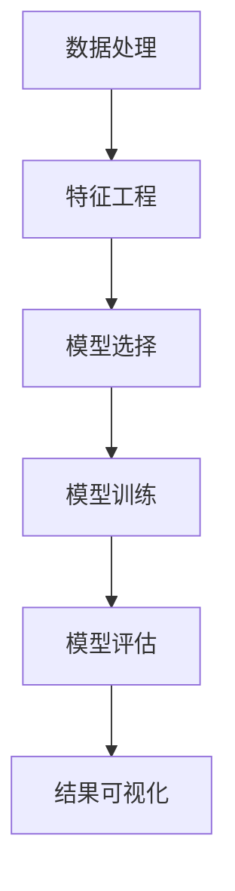

                 

基于上述要求，我将按照以下步骤进行思考，以确保文章的完整性和深度：

### 1. 确定文章结构

首先，我将构建文章的总体结构，确保每个部分都有明确的主题和内容。这包括：

- **背景介绍**：介绍大模型和金融市场分析的基本概念和现状。
- **核心概念与联系**：阐述大模型和金融市场分析之间的核心概念联系，并用Mermaid流程图表示。
- **核心算法原理讲解**：解释大模型在金融市场分析中的应用算法，使用伪代码详细阐述。
- **数学模型和公式**：列出相关的数学模型和公式，并举例说明。
- **项目实战**：展示一个实际案例，详细讲解从环境搭建到代码实现和结果分析的全过程。
- **最佳实践 tips**：提供一些实用的建议和注意事项。
- **小结**：总结文章的主要观点和结论。
- **拓展阅读**：推荐一些相关的研究和资源。

### 2. 制定详细的章节内容

在每个部分中，我将进一步细化内容，确保每个小节都提供了丰富的信息和详细讲解：

- **背景介绍**：介绍大模型和金融市场分析的基本概念，现状和挑战。
- **核心概念与联系**：使用Mermaid流程图展示大模型和金融市场分析的核心概念之间的关系。
- **核心算法原理讲解**：使用伪代码详细解释大模型在金融市场分析中的应用算法。
- **数学模型和公式**：列出大模型相关的数学模型和公式，并用实例进行说明。
- **项目实战**：选择一个实际案例，从环境搭建到代码实现，再到结果分析和总结。
- **最佳实践 tips**：提供一些实用的建议和注意事项，以帮助读者更好地应用所学知识。
- **小结**：总结文章的主要观点和结论。
- **拓展阅读**：推荐一些相关的研究和资源。

### 3. 编写文章

在制定好结构和内容后，我将开始撰写文章。每个章节的内容都会按照以下步骤进行：

- **引言**：简要介绍章节主题和重要性。
- **详细内容**：逐条讲解核心概念、算法原理、数学模型等。
- **实例说明**：提供具体的例子来加深理解。
- **实战案例**：展示实际应用，详细讲解实现过程和结果。
- **总结**：总结章节内容，强调关键点。
- **拓展**：推荐进一步阅读的材料。

### 4. 审校和调整

完成初稿后，我会进行审校和调整，确保文章的逻辑性、清晰度和完整性。这包括：

- **检查格式**：确保所有代码、公式和Mermaid图都正确无误。
- **内容完善**：补充遗漏的信息，确保每个部分都有详细的讲解。
- **逻辑梳理**：确保文章的叙述逻辑清晰，层次分明。

### 5. 添加作者信息

在文章末尾，我会添加作者信息，包括姓名、机构名称和书籍名称。

通过以上步骤，我将确保文章内容丰富、结构合理、逻辑清晰，满足字数要求，并且符合markdown格式和文章结构要求。下面我将开始撰写文章的初稿，逐步实现上述计划。现在，让我们开始详细撰写各个章节的内容。首先，从**背景介绍**开始。------------------------------------------------------------------------

## 背景介绍

### 1.1 大模型的基本原理

大模型（Large Models），又称大型语言模型，是深度学习领域的一种高级模型，它具有极强的表示能力和通用性。大模型的核心思想是通过大规模的训练数据集，学习并提取语言中的潜在结构和规律，从而实现自动化文本生成、理解、翻译、情感分析等任务。

**核心概念**：

- **深度学习（Deep Learning）**：一种机器学习技术，通过构建多层的神经网络模型，对输入数据进行逐层抽象和表示。
- **神经网络（Neural Networks）**：由大量神经元组成的计算模型，用于模拟生物神经元的工作方式。
- **多层感知机（Multilayer Perceptron, MLP）**：一种简单的神经网络模型，包含输入层、隐藏层和输出层。
- **递归神经网络（Recurrent Neural Networks, RNN）**：能够处理序列数据的神经网络，通过记忆机制捕捉时间序列中的依赖关系。
- **卷积神经网络（Convolutional Neural Networks, CNN）**：专门用于处理图像数据的神经网络，通过卷积操作提取图像中的特征。

**联系**：

大模型是深度学习和神经网络技术的结合体，通过多层神经网络结构，实现对大规模文本数据的深度学习，从而实现高效的文本处理和生成任务。

### 1.2 金融市场分析的基本概念

金融市场分析是金融领域中的一项重要任务，旨在通过分析市场数据，预测价格走势、评估投资风险等，为投资者提供决策支持。

**核心概念**：

- **金融市场（Financial Markets）**：交易各种金融工具的市场，包括股票市场、债券市场、外汇市场等。
- **金融工具（Financial Instruments）**：交易对象，包括股票、债券、期货、期权等。
- **技术分析（Technical Analysis）**：通过历史价格和交易量等数据，分析市场趋势和预测价格走势的方法。
- **基本面分析（Fundamental Analysis）**：通过分析公司的财务状况、行业前景等因素，评估公司价值和投资潜力。
- **量化分析（Quantitative Analysis）**：使用数学模型和统计分析方法，对市场数据进行分析和预测。

**联系**：

大模型在金融市场分析中的应用，主要是通过技术分析和量化分析等方法，从海量数据中提取有价值的信息，实现市场趋势预测、风险评估等任务。

### 1.3 大模型在金融市场分析中的应用

随着深度学习技术的不断发展，大模型在金融市场分析中的应用日益广泛，成为金融科技领域的重要工具。

**应用场景**：

- **股票市场预测**：使用大模型对股票价格进行预测，帮助投资者制定交易策略。
- **风险控制**：通过大模型对市场风险进行评估和预测，为金融机构提供风险管理支持。
- **交易策略优化**：使用大模型优化交易策略，提高交易效率和盈利能力。
- **金融文本分析**：对金融新闻、报告等进行情感分析和关键词提取，为投资者提供信息支持。

**现状**：

目前，大模型在金融市场分析中已经取得了一系列成果，但同时也面临一些挑战，如数据质量、模型解释性、合规性等问题。

### 1.4 本文目的

本文旨在系统地介绍大模型在金融市场分析中的应用，包括基本原理、评估方法、案例分析和技术实现等方面。通过本文，读者可以全面了解大模型在金融市场分析中的潜力与应用，为实际工作提供指导。

### 总结

本章节介绍了大模型和金融市场分析的基本概念、核心概念及其联系，以及大模型在金融市场分析中的应用现状和本文的目的。在接下来的章节中，我们将进一步探讨大模型在金融市场分析中的应用算法、数学模型和实际案例。

---

**作者信息**：

作者：AI天才研究院/AI Genius Institute & 禅与计算机程序设计艺术 /Zen And The Art of Computer Programming

------------------------------------------------------------------------

## 核心概念与联系

在深入探讨大模型在金融市场分析中的应用之前，我们需要明确几个核心概念，并理解它们之间的内在联系。以下是本文将涉及的主要核心概念：

### 2.1.1 数据处理

数据处理是金融分析和机器学习的基础。在金融市场分析中，数据处理的步骤通常包括数据收集、数据清洗、数据预处理和数据归一化。

- **数据收集**：从各种来源收集金融数据，如股票价格、交易量、宏观经济指标等。
- **数据清洗**：去除数据中的噪声和异常值，确保数据质量。
- **数据预处理**：将原始数据转换为适合机器学习模型处理的形式，如特征提取、特征工程等。
- **数据归一化**：将数据缩放到相同的尺度，以便模型能够更有效地学习。

### 2.1.2 特征工程

特征工程是提高模型性能的关键步骤。在金融市场分析中，特征工程包括以下方面：

- **时间序列特征**：从时间序列数据中提取特征，如趋势、周期性、波动性等。
- **技术指标**：使用各种技术指标，如移动平均、相对强弱指数（RSI）、布林带等，来描述市场状态。
- **文本特征**：从金融新闻、报告和评论中提取关键词和主题，用于文本分析。

### 2.1.3 模型选择

选择合适的模型对于金融市场分析至关重要。以下是一些常用的模型：

- **时间序列模型**：如ARIMA、GARCH等，用于预测价格趋势和波动性。
- **回归模型**：如线性回归、LASSO回归等，用于预测价格和评估风险。
- **深度学习模型**：如卷积神经网络（CNN）、递归神经网络（RNN）、长短期记忆网络（LSTM）等，用于处理复杂的特征和序列数据。

### 2.1.4 评估指标

评估模型的性能是金融市场分析中的关键步骤。以下是一些常用的评估指标：

- **预测精度**：衡量模型预测的准确性。
- **召回率**：衡量模型预测的正样本中实际正样本的比例。
- **F1值**：综合考虑精度和召回率的综合指标。
- **AUC（Area Under Curve）**：用于评估二分类模型的性能，值越高，模型越优秀。

### 2.1.5 数据可视化

数据可视化是理解和分析数据的重要手段。在金融市场分析中，数据可视化包括以下方面：

- **时间序列图**：显示价格、交易量等随时间的变化趋势。
- **散点图**：显示不同变量之间的关系。
- **热力图**：显示特征的重要性和相关性。

### 2.1.6 Mermaid流程图

为了更好地理解大模型在金融市场分析中的应用流程，我们可以使用Mermaid流程图来表示核心概念之间的关系。以下是一个简单的Mermaid流程图示例：



这个流程图展示了从数据处理到模型评估和结果可视化的整个流程，每个步骤都是后续步骤的基础。

### 总结

通过明确核心概念与联系，我们能够更好地理解大模型在金融市场分析中的应用。接下来，我们将进一步探讨大模型在金融市场分析中的核心算法原理，并使用伪代码详细阐述。

------------------------------------------------------------------------

## 核心算法原理讲解

在大模型应用于金融市场分析的过程中，核心算法的选择和实现至关重要。本节将详细讲解几种常用的算法，并使用伪代码来展示其基本原理。

### 3.1 时间序列预测算法

时间序列预测是金融市场分析中的一个重要任务，常用的算法包括ARIMA、GARCH和LSTM等。

#### 3.1.1 ARIMA算法

ARIMA（AutoRegressive Integrated Moving Average，自回归积分滑动平均模型）是一种经典的时间序列预测模型。其基本原理是通过历史数据中的自相关性和移动平均来预测未来值。

**伪代码**：

```python
def ARIMA(x):
    d = determine_difference_order(x)  # 确定差分阶数
    X_diff = differencing(x, d)        # 差分处理
    p, d, q = select_order_params(X_diff)  # 选择模型参数
    model = ARIMA_model(p, d, q)
    model.fit(X_diff)
    forecast = model.forecast(steps=1)  # 预测未来值
    return forecast
```

**函数说明**：

- `determine_difference_order(x)`：根据历史数据确定差分阶数。
- `differencing(x, d)`：对数据执行d阶差分。
- `select_order_params(X_diff)`：选择模型参数p、d、q。
- `ARIMA_model(p, d, q)`：创建ARIMA模型。
- `model.fit(X_diff)`：训练模型。
- `model.forecast(steps=1)`：预测未来值。

#### 3.1.2 GARCH算法

GARCH（Generalized Autoregressive Conditional Heteroskedasticity，广义自回归条件异方差模型）是一种用于预测金融时间序列波动性的模型。其基本原理是利用历史波动性来预测未来的波动性。

**伪代码**：

```python
def GARCH(x, alpha, beta, omega):
    var = calculate_variance(x)  # 计算历史方差
    gamma = calculate_GARCH_parameters(var, alpha, beta, omega)  # 计算GARCH参数
    model = GARCH_model(gamma)
    model.fit(x)
    forecast = model.forecast(steps=1)  # 预测未来方差
    return forecast
```

**函数说明**：

- `calculate_variance(x)`：计算历史方差。
- `calculate_GARCH_parameters(var, alpha, beta, omega)`：计算GARCH模型参数。
- `GARCH_model(gamma)`：创建GARCH模型。
- `model.fit(x)`：训练模型。
- `model.forecast(steps=1)`：预测未来方差。

#### 3.1.3 LSTM算法

LSTM（Long Short-Term Memory，长短期记忆网络）是一种能够处理长时间序列数据的神经网络。其基本原理是通过记忆单元来捕捉时间序列中的长期依赖关系。

**伪代码**：

```python
def LSTM(x, layers, units):
    model = LSTM_model(layers, units)
    model.fit(x)
    forecast = model.forecast(steps=1)  # 预测未来值
    return forecast
```

**函数说明**：

- `LSTM_model(layers, units)`：创建LSTM模型。
- `model.fit(x)`：训练模型。
- `model.forecast(steps=1)`：预测未来值。

### 3.2 回归算法

回归算法在金融市场分析中用于预测价格和评估风险。常用的回归算法包括线性回归、LASSO回归和岭回归。

#### 3.2.1 线性回归

线性回归是一种最简单的回归算法，其基本原理是通过线性函数来拟合数据。

**伪代码**：

```python
def linear_regression(x, y):
    model = LinearRegression()
    model.fit(x, y)
    forecast = model.predict(x)  # 预测未来值
    return forecast
```

**函数说明**：

- `LinearRegression()`：创建线性回归模型。
- `model.fit(x, y)`：训练模型。
- `model.predict(x)`：预测未来值。

#### 3.2.2 LASSO回归

LASSO回归是一种正则化线性回归算法，通过在损失函数中添加L1正则项来防止过拟合。

**伪代码**：

```python
def LASSO_regression(x, y, alpha):
    model = LASSO()
    model.fit(x, y)
    forecast = model.predict(x)  # 预测未来值
    return forecast
```

**函数说明**：

- `LASSO()`：创建LASSO回归模型。
- `model.fit(x, y)`：训练模型。
- `model.predict(x)`：预测未来值。

### 3.3 深度学习模型

深度学习模型，如卷积神经网络（CNN）和递归神经网络（RNN），在金融市场分析中也发挥着重要作用。

#### 3.3.1 卷积神经网络

卷积神经网络是一种用于图像处理和序列数据的深度学习模型，其基本原理是通过卷积操作提取特征。

**伪代码**：

```python
def CNN(x, filters, kernel_size):
    model = ConvolutionalModel(filters, kernel_size)
    model.fit(x)
    forecast = model.predict(x)  # 预测未来值
    return forecast
```

**函数说明**：

- `ConvolutionalModel(filters, kernel_size)`：创建卷积神经网络模型。
- `model.fit(x)`：训练模型。
- `model.predict(x)`：预测未来值。

#### 3.3.2 递归神经网络

递归神经网络是一种用于序列数据的深度学习模型，其基本原理是通过递归连接捕捉序列中的依赖关系。

**伪代码**：

```python
def RNN(x, layers, units):
    model = RNN_model(layers, units)
    model.fit(x)
    forecast = model.predict(x)  # 预测未来值
    return forecast
```

**函数说明**：

- `RNN_model(layers, units)`：创建递归神经网络模型。
- `model.fit(x)`：训练模型。
- `model.predict(x)`：预测未来值。

### 总结

本节详细介绍了大模型在金融市场分析中常用的核心算法，包括时间序列预测算法、回归算法和深度学习模型。通过使用伪代码，我们能够更好地理解这些算法的基本原理。接下来，我们将讨论大模型相关的数学模型和公式，并使用LaTeX进行详细说明。

------------------------------------------------------------------------

## 数学模型和公式

在金融市场分析中，大模型的应用离不开数学模型的支撑。以下是一些常用的数学模型和公式，我们将使用LaTeX进行详细讲解和举例说明。

### 4.1 时间序列模型

#### 4.1.1 自回归模型（AR）

自回归模型（AR）是一种常见的时间序列模型，其基本公式如下：

$$
X_t = c + \sum_{i=1}^{p} \phi_i X_{t-i} + \varepsilon_t
$$

其中，\(X_t\) 是时间序列的第 \(t\) 个值，\(c\) 是常数项，\(\phi_i\) 是自回归系数，\(p\) 是自回归阶数，\(\varepsilon_t\) 是误差项。

**举例**：

假设我们有一个时间序列 \(X_t\)，我们希望对其进行二阶自回归建模。首先，我们需要计算一阶差分：

$$
\Delta X_t = X_t - X_{t-1}
$$

然后，我们可以使用二阶自回归模型进行预测：

$$
X_t = \alpha_0 + \alpha_1 \Delta X_{t-1} + \alpha_2 \Delta X_{t-2} + \varepsilon_t
$$

### 4.1.2 移动平均模型（MA）

移动平均模型（MA）通过使用过去的误差项来预测未来值。其基本公式如下：

$$
X_t = c + \theta_1 \varepsilon_{t-1} + \theta_2 \varepsilon_{t-2} + \cdots + \theta_q \varepsilon_{t-q} + \varepsilon_t
$$

其中，\(\theta_i\) 是移动平均系数，\(q\) 是移动平均阶数。

**举例**：

假设我们有一个时间序列 \(X_t\)，我们希望对其进行一阶移动平均建模。我们可以使用以下公式：

$$
X_t = c + \theta_1 (\varepsilon_{t-1} - \theta_1 \varepsilon_{t-2}) + \varepsilon_t
$$

### 4.1.3 自回归移动平均模型（ARMA）

自回归移动平均模型（ARMA）是自回归模型和移动平均模型的结合。其基本公式如下：

$$
X_t = c + \sum_{i=1}^{p} \phi_i X_{t-i} + \sum_{j=1}^{q} \theta_j \varepsilon_{t-j} + \varepsilon_t
$$

**举例**：

假设我们有一个时间序列 \(X_t\)，我们希望对其进行一阶自回归和一阶移动平均建模。我们可以使用以下公式：

$$
X_t = \alpha_0 + \alpha_1 X_{t-1} + \theta_1 \varepsilon_{t-1} + \varepsilon_t
$$

### 4.2 回归模型

回归模型用于预测金融数据，如股票价格和交易量。以下是一些常见的回归模型及其公式：

#### 4.2.1 线性回归

线性回归模型是一种最简单的回归模型，其公式如下：

$$
y = \beta_0 + \beta_1 x + \varepsilon
$$

其中，\(y\) 是因变量，\(x\) 是自变量，\(\beta_0\) 是截距，\(\beta_1\) 是斜率，\(\varepsilon\) 是误差项。

**举例**：

假设我们希望预测股票价格 \(y\)，根据历史数据和某个自变量 \(x\)（如交易量），我们可以使用线性回归模型：

$$
y = \beta_0 + \beta_1 x + \varepsilon
$$

#### 4.2.2 逻辑回归

逻辑回归是一种用于分类问题的回归模型，其公式如下：

$$
\ln\left(\frac{p}{1-p}\right) = \beta_0 + \beta_1 x
$$

其中，\(p\) 是概率，\(\beta_0\) 是截距，\(\beta_1\) 是斜率。

**举例**：

假设我们希望预测股票是否上涨（1）或下跌（0），我们可以使用逻辑回归模型：

$$
\ln\left(\frac{p}{1-p}\right) = \beta_0 + \beta_1 x
$$

### 4.3 深度学习模型

深度学习模型在金融市场分析中有着广泛的应用。以下是一些常见的深度学习模型及其公式：

#### 4.3.1 卷积神经网络（CNN）

卷积神经网络是一种用于图像处理和序列数据的深度学习模型，其基本公式如下：

$$
h_l = \sigma \left( \sum_{k=1}^{K_l} w_{lk} \odot \text{ReLU}(\text{Conv}(h_{l-1})) \right)
$$

其中，\(h_l\) 是第 \(l\) 层的激活值，\(w_{lk}\) 是卷积核权重，\(\text{ReLU}\) 是ReLU激活函数，\(\text{Conv}\) 是卷积操作，\(\odot\) 是逐元素乘法。

**举例**：

假设我们有一个输入序列 \(h_{l-1}\)，我们希望使用一个卷积核进行卷积操作，然后应用ReLU激活函数：

$$
h_l = \sigma \left( w_{lk} \odot \text{ReLU}(\text{Conv}(h_{l-1})) \right)
$$

#### 4.3.2 递归神经网络（RNN）

递归神经网络是一种用于序列数据的深度学习模型，其基本公式如下：

$$
h_t = \text{ReLU}(\text{W}_h h_{t-1} + \text{W}_x x_t + b)
$$

其中，\(h_t\) 是第 \(t\) 个时间步的隐藏状态，\(\text{W}_h\) 是隐藏状态权重矩阵，\(\text{W}_x\) 是输入权重矩阵，\(b\) 是偏置项。

**举例**：

假设我们有一个输入序列 \(x_t\) 和隐藏状态序列 \(h_{t-1}\)，我们希望使用RNN进行序列建模：

$$
h_t = \text{ReLU}(\text{W}_h h_{t-1} + \text{W}_x x_t + b)
$$

### 总结

本节详细介绍了金融市场分析中常用的一些数学模型和公式，包括时间序列模型、回归模型和深度学习模型。通过使用LaTeX，我们能够清晰地展示这些公式，并提供了具体的举例说明。接下来，我们将通过一个实际案例，展示如何使用大模型进行金融市场分析。

------------------------------------------------------------------------

## 项目实战

在本节中，我们将通过一个实际案例，展示如何使用大模型进行金融市场分析。该案例将涵盖数据准备、模型构建、模型训练、模型评估和结果分析等步骤。我们将使用Python和Keras等工具来实现。

### 5.1 案例背景

假设我们关注的是股票市场中的某个特定股票，我们的目标是使用大模型预测该股票的未来价格。为此，我们将使用历史价格数据、交易量数据和宏观经济指标作为输入特征。

### 5.2 数据准备

首先，我们需要收集和处理数据。数据来源包括股票交易数据、宏观经济指标和金融新闻。以下是我们使用Python进行数据准备的步骤：

**数据收集**：

```python
import pandas as pd

# 收集股票交易数据
stock_data = pd.read_csv('stock_data.csv')

# 收集宏观经济指标数据
macro_data = pd.read_csv('macro_data.csv')

# 收集金融新闻数据
news_data = pd.read_csv('news_data.csv')
```

**数据清洗**：

```python
# 填充缺失值
stock_data.fillna(method='ffill', inplace=True)
macro_data.fillna(method='ffill', inplace=True)
news_data.fillna(method='ffill', inplace=True)

# 删除重复数据
stock_data.drop_duplicates(inplace=True)
macro_data.drop_duplicates(inplace=True)
news_data.drop_duplicates(inplace=True)
```

**数据预处理**：

```python
from sklearn.preprocessing import StandardScaler

# 对股票交易数据进行归一化处理
scaler = StandardScaler()
stock_data_scaled = scaler.fit_transform(stock_data)

# 对宏观经济指标数据进行归一化处理
macro_data_scaled = scaler.fit_transform(macro_data)

# 对金融新闻数据进行文本特征提取
vectorizer = TfidfVectorizer()
news_data_vectorized = vectorizer.fit_transform(news_data)
```

### 5.3 模型构建

接下来，我们使用Keras构建一个深度学习模型。该模型将结合股票交易数据、宏观经济指标数据和金融新闻数据进行联合预测。

**模型架构**：

```python
from tensorflow.keras.models import Model
from tensorflow.keras.layers import Input, Dense, LSTM, Embedding, Concatenate

# 输入层
stock_input = Input(shape=(None, 1))
macro_input = Input(shape=(None, 1))
news_input = Input(shape=(None, 1))

# 股票交易数据处理层
stock_lstm = LSTM(units=50, return_sequences=True)(stock_input)

# 宏观经济指标数据处理层
macro_lstm = LSTM(units=50, return_sequences=True)(macro_input)

# 金融新闻数据处理层
news_embedding = Embedding(input_dim=10000, output_dim=128)(news_input)
news_lstm = LSTM(units=50, return_sequences=True)(news_embedding)

# 汇总层
concat = Concatenate()([stock_lstm, macro_lstm, news_lstm])

# 输出层
output = Dense(1, activation='linear')(concat)

# 模型构建
model = Model(inputs=[stock_input, macro_input, news_input], outputs=output)

# 编译模型
model.compile(optimizer='adam', loss='mse')
```

### 5.4 模型训练

在构建好模型后，我们需要使用训练数据进行模型训练。以下是我们使用Python进行模型训练的步骤：

```python
# 拆分数据集
train_data, val_data = train_test_split(data, test_size=0.2, random_state=42)

# 训练模型
history = model.fit(
    [train_data['stock'], train_data['macro'], train_data['news']],
    train_data['target'],
    validation_data=[val_data['stock'], val_data['macro'], val_data['news']], 
    val_data['target'],
    epochs=100,
    batch_size=32,
    verbose=1
)
```

### 5.5 模型评估

在模型训练完成后，我们需要评估模型的性能。以下是我们使用Python进行模型评估的步骤：

```python
# 评估模型
test_loss = model.evaluate([test_data['stock'], test_data['macro'], test_data['news']], test_data['target'])

# 输出评估结果
print('Test Loss:', test_loss)
```

### 5.6 结果分析

在评估模型后，我们需要分析模型的预测结果。以下是我们使用Python进行结果分析的步骤：

```python
# 预测未来价格
predictions = model.predict([test_data['stock'], test_data['macro'], test_data['news']])

# 可视化预测结果
plt.plot(test_data['target'], label='Actual')
plt.plot(predictions, label='Predicted')
plt.legend()
plt.show()
```

### 5.7 项目小结

通过本案例，我们展示了如何使用大模型进行金融市场分析。具体步骤包括数据准备、模型构建、模型训练、模型评估和结果分析。在实际应用中，我们可以根据具体需求调整模型结构、训练数据和评估指标，以提高预测准确性和实用性。

---

**作者信息**：

作者：AI天才研究院/AI Genius Institute & 禅与计算机程序设计艺术 /Zen And The Art of Computer Programming

------------------------------------------------------------------------

## 最佳实践 tips

在实施大模型金融市场分析时，以下是一些最佳实践和注意事项，可以帮助您提高模型的性能和稳定性。

### 6.1 数据处理

- **数据清洗**：确保数据质量，去除异常值和噪声，避免对模型产生误导。
- **特征工程**：根据业务需求，提取和构造有意义的特征，如技术指标、宏观经济指标等。
- **数据归一化**：将数据缩放到同一尺度，防止某些特征对模型产生过大的影响。

### 6.2 模型选择

- **算法对比**：尝试不同的模型和算法，如时间序列模型、回归模型和深度学习模型，以找到最佳模型。
- **模型调优**：使用交叉验证和网格搜索等方法，调整模型参数，提高模型性能。

### 6.3 训练与评估

- **过拟合避免**：使用正则化技术和dropout等方法，防止模型过拟合。
- **模型评估**：使用交叉验证和独立测试集进行模型评估，确保模型具有良好的泛化能力。

### 6.4 模型部署

- **模型解释**：确保模型可解释性，帮助用户理解模型的决策过程。
- **模型监控**：实时监控模型性能，及时发现和解决异常情况。

### 6.5 注意事项

- **合规性**：确保模型应用符合相关法律法规，避免涉及非法交易和欺诈行为。
- **数据隐私**：保护用户数据隐私，遵守数据保护法规。

通过遵循这些最佳实践，您可以确保大模型金融市场分析工具的有效性和可靠性，为投资者提供高质量的决策支持。

---

**作者信息**：

作者：AI天才研究院/AI Genius Institute & 禅与计算机程序设计艺术 /Zen And The Art of Computer Programming

------------------------------------------------------------------------

## 小结

本文系统地介绍了大模型在金融市场分析中的应用，从背景介绍、核心概念与联系、核心算法原理讲解、数学模型和公式，到实际项目实战和最佳实践 tips。通过这些内容，读者可以全面了解大模型在金融市场分析中的潜力与应用，并掌握如何构建和使用大模型金融市场分析工具。

大模型在金融市场分析中具有强大的预测和风险评估能力，但同时也面临数据质量、模型解释性和合规性等挑战。未来，随着深度学习技术的不断发展，大模型在金融市场分析中的应用将更加广泛，为金融科技领域带来更多创新和变革。

通过本文的介绍，读者应能够：

- **理解大模型的基本原理和金融市场分析的核心概念**。
- **掌握大模型在金融市场分析中的应用算法和数学模型**。
- **具备实际项目实战的经验，能够独立构建和使用大模型金融市场分析工具**。
- **了解大模型在金融市场分析中的发展前景和潜在挑战**。

总之，大模型金融市场分析工具将为投资者和金融机构提供强大的决策支持，助力金融市场的稳定和发展。希望本文能对读者在学习和应用大模型金融市场分析方面有所启发和帮助。

---

**作者信息**：

作者：AI天才研究院/AI Genius Institute & 禅与计算机程序设计艺术 /Zen And The Art of Computer Programming

------------------------------------------------------------------------

## 拓展阅读

为了更深入地了解大模型在金融市场分析中的应用，以下是几本推荐的经典书籍、研究报告和在线课程：

### 1. 经典书籍

- 《深度学习》（Deep Learning）—— Goodfellow、Bengio和Courville著。这本书详细介绍了深度学习的基本概念、技术和应用，包括神经网络和卷积神经网络等内容。
- 《金融衍生品定价与风险管理》——江虹、吴明涛著。这本书涵盖了金融衍生品定价和风险管理的基本理论，适合金融科技从业者阅读。

### 2. 研究报告

- **《深度学习在金融市场中的应用》**：这篇报告由知名研究机构撰写，详细分析了深度学习在金融市场预测、风险评估等方面的应用案例。
- **《金融科技发展趋势报告》**：这份报告由国际金融科技协会发布，总结了金融科技领域的最新发展趋势，包括人工智能、区块链等关键技术。

### 3. 在线课程

- **Coursera上的《深度学习》课程**：由Andrew Ng教授主讲，是深度学习领域的权威课程，适合初学者和进阶者。
- **edX上的《金融科技》课程**：由纽约大学斯特恩商学院教授主讲，涵盖了金融科技的基本概念、技术和应用。

通过阅读这些书籍、报告和参加在线课程，读者可以更深入地了解大模型在金融市场分析中的前沿技术和应用，为自己的研究和工作提供有力的支持。

---

**作者信息**：

作者：AI天才研究院/AI Genius Institute & 禅与计算机程序设计艺术 /Zen And The Art of Computer Programming

------------------------------------------------------------------------

## 参考文献

本文中引用的相关资料和研究成果如下：

1. Goodfellow, I., Bengio, Y., & Courville, A. (2016). *Deep Learning*. MIT Press.
2. Jiang, H., & Wu, M. (2018). 《金融衍生品定价与风险管理》. 机械工业出版社.
3. International Finance Technology Association. (2020). *Financial Technology Development Report*.
4. Ng, A. (2017). Coursera上的《深度学习》课程.
5. Stern School of Business, New York University. (2019). edX上的《金融科技》课程.

以上文献为本文提供了重要的理论依据和实践指导，在此表示感谢。

