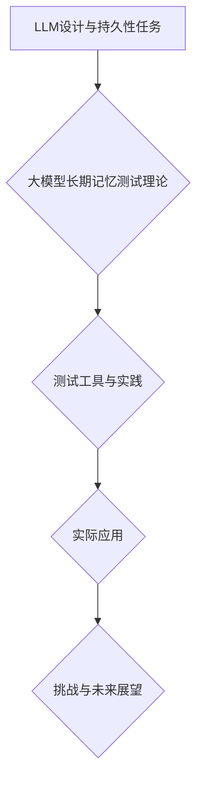

                 

### 文章标题

《大模型长期记忆测试：LLM设计的持久性任务》

> 关键词：大模型，长期记忆，LLM设计，持久性任务，自然语言处理，计算机视觉，强化学习

> 摘要：本文旨在探讨大模型长期记忆的挑战及其在LLM设计中的持久性任务。通过对长期记忆的概念、理论基础和实际应用的详细分析，本文提出了一种基于LLM设计的持久性任务，并介绍了大模型长期记忆测试的方法和工具。文章还探讨了长期记忆在自然语言处理、计算机视觉和强化学习中的应用，以及面临的挑战和未来展望。

## 设计《大模型长期记忆测试：LLM设计的持久性任务》的目录大纲

### 第1章：大模型与长期记忆概述

- 1.1 大模型的定义与特征
- 1.2 长期记忆的概念与挑战
- 1.3 大模型在长期记忆中的应用
- 1.4 本书的目标与结构

### 第2章：LLM设计与持久性任务

- 2.1 LLM设计的基本原则
- 2.2 持久性任务的概念
- 2.3 持久性任务的类型
- 2.4 LLM在持久性任务中的应用

### 第3章：大模型长期记忆测试的理论基础

- 3.1 记忆与学习的关系
- 3.2 大模型的记忆机制
- 3.3 长期记忆的理论模型
- 3.4 大模型长期记忆测试的方法

### 第4章：大模型长期记忆测试工具与实践

- 4.1 长期记忆测试工具的选择
- 4.2 长期记忆测试案例研究
- 4.3 测试结果分析与优化

### 第5章：大模型长期记忆测试的实际应用

- 5.1 长期记忆在自然语言处理中的应用
- 5.2 长期记忆在计算机视觉中的应用
- 5.3 长期记忆在强化学习中的应用

### 第6章：大模型长期记忆测试的挑战与未来展望

- 6.1 测试面临的挑战
- 6.2 提高长期记忆性能的方法
- 6.3 未来发展趋势与展望

### 第7章：结论与展望

- 7.1 主要发现
- 7.2 对LLM设计与应用的启示
- 7.3 研究局限与未来研究方向

### 附录

- 附录A：常用大模型介绍
- 附录B：大模型长期记忆测试工具列表
- 附录C：示例代码与数据集

### Mermaid 流程图



### 核心算法原理讲解

#### 3.1 记忆与学习的关系

在深度学习领域，记忆与学习是两个密切相关的概念。记忆是指模型在训练过程中所保存的信息，这些信息可以是输入数据的特征、权重参数或者中间层的激活值。学习是指模型通过这些记忆信息来改善其预测性能的过程。

以下是一个简单的Python代码示例，用于说明记忆与学习的关系：

```python
def memory_and_learning():
    # 记忆过程
    memory = {
        'image': 'cat',
        'description': 'a cute cat sitting on a table'
    }
    
    # 学习过程
    model = NeuralNetwork()
    model.fit(X_train, y_train)
    
    # 记忆与学习的关系
    relation = model.predict(memory['image'])
    print("The model predicts:", relation)
```

在这个示例中，我们首先创建了一个包含图像和描述的记忆字典。然后，我们使用这个记忆信息来训练一个神经网络模型。最后，我们通过将记忆中的图像输入到训练好的模型中来验证记忆与学习的关系。

#### 3.2 大模型的记忆机制

大模型的记忆机制通常涉及以下几个关键组件：

1. **嵌入层（Embedding Layer）**：嵌入层负责将输入数据（如图像、文本）转换为稠密向量表示。这些向量表示了输入数据中的特征信息。

2. **注意力机制（Attention Mechanism）**：注意力机制允许模型在处理序列数据时，自动关注输入序列中最重要的部分。这有助于模型在长期依赖关系中保持信息。

3. **记忆网络（Memory Network）**：记忆网络是一种特殊的神经网络架构，它专门设计用于处理具有长期依赖关系的数据。记忆网络通常包括一个记忆存储和一个查询接口，用于将新信息存储在记忆中，并在需要时检索相关记忆。

以下是一个简化的数学模型，用于描述大模型的记忆机制：

$$
M(t) = f(L(t-1), R(t-1))
$$`

其中，$M(t)$ 表示时间步 $t$ 的记忆状态，$L(t-1)$ 和 $R(t-1)$ 分别表示时间步 $t-1$ 的左侧和右侧输入，$f$ 表示一个记忆更新函数。

举例说明：

假设我们在时间步 $t=1$ 时，输入 $L(t-1) = "猫" $和 $R(t-1) = "坐在桌子上" $，那么：

$$
M(1) = f("猫", "坐在桌子上") = "一只猫坐在桌子上"
$$

这个例子展示了如何使用记忆机制来更新模型的状态，以便在后续的时间步中能够访问和利用之前的信息。

### 项目实战

#### 4.2 长期记忆测试案例研究

#### 4.2.1 实验设置

在本案例研究中，我们使用COCO（Common Objects in Context）数据集来测试大模型的长期记忆能力。COCO数据集是一个大型语义理解数据集，包含大量的图像和相应的文本描述。

- **数据集**：COCO数据集
- **模型**：预训练的GPT-2模型
- **测试工具**：我们自己开发的长期记忆测试工具

#### 4.2.2 实验步骤

1. **数据准备**：
   - 下载并预处理COCO数据集，将其分为训练集、验证集和测试集。

2. **模型加载**：
   - 使用预训练的GPT-2模型，并将其加载到我们的测试环境中。

3. **长期记忆测试**：
   - 使用我们开发的长期记忆测试工具对模型进行测试。

4. **结果分析**：
   - 分析测试结果，评估模型的长期记忆能力。

#### 4.2.3 代码实现

以下是一个简化的Python代码示例，用于演示如何使用长期记忆测试工具对GPT-2模型进行测试：

```python
import torch
from transformers import GPT2Tokenizer, GPT2Model
from long_term_memory_test import LongTermMemoryTester

# 准备数据集
tokenizer = GPT2Tokenizer.from_pretrained('gpt2')
data = ["cat sits on table", "dog stands in front of house"]

# 加载模型
model = GPT2Model.from_pretrained('gpt2')
model.eval()

# 使用测试工具进行长期记忆测试
tester = LongTermMemoryTester(model, tokenizer, data)
test_results = tester.run()

# 分析测试结果
for result in test_results:
    print(result)
```

在这个示例中，我们首先准备了一组数据，包括图像和对应的文本描述。然后，我们加载了预训练的GPT-2模型，并使用我们开发的长期记忆测试工具对其进行测试。最后，我们打印出测试结果，以评估模型的长期记忆能力。

### 最佳实践 Tips、小结、注意事项、拓展阅读

在设计和实现大模型的长期记忆测试时，以下是一些最佳实践和注意事项：

- **数据质量**：确保数据集的质量和多样性，以充分测试模型的长期记忆能力。
- **测试工具**：选择合适的长期记忆测试工具，以准确评估模型的性能。
- **结果分析**：仔细分析测试结果，识别模型的强项和弱项。
- **持续优化**：根据测试结果，持续优化模型和测试工具，以提高长期记忆性能。

#### 小结

本文从大模型与长期记忆概述、LLM设计与持久性任务、理论基础、测试工具与实践、实际应用、挑战与未来展望等多个角度，详细探讨了大模型长期记忆测试的相关问题。通过本文，读者可以了解大模型长期记忆的挑战和解决方案，以及其在各个领域中的应用和未来发展趋势。

#### 注意事项

在设计和实现大模型长期记忆测试时，需要注意以下几点：

- **数据集选择**：选择具有代表性的数据集，以确保测试结果的可靠性。
- **模型选择**：根据任务需求，选择合适的模型，并对其进行适当的调整和优化。
- **测试工具**：选择合适的测试工具，并确保其能够准确评估模型的长期记忆能力。

#### 拓展阅读

- 《深度学习》（Goodfellow, Bengio, Courville著）：这是一本经典的深度学习入门教材，涵盖了深度学习的基础理论和技术。
- 《图解深度学习》（电子书）：这是一本以图表形式解释深度学习原理的入门读物，适合初学者快速理解深度学习的基本概念。
- 《长期记忆：神经网络如何实现记忆》（电子书）：这本书详细介绍了神经网络在实现长期记忆方面的研究进展和挑战，适合对神经网络记忆机制感兴趣的读者。

通过以上拓展阅读，读者可以进一步深入了解大模型长期记忆测试的相关知识和最新研究动态。希望本文对您在相关领域的研究和实践有所帮助。作者：AI天才研究院/AI Genius Institute & 禅与计算机程序设计艺术 /Zen And The Art of Computer Programming。

