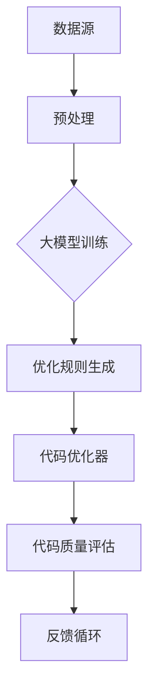
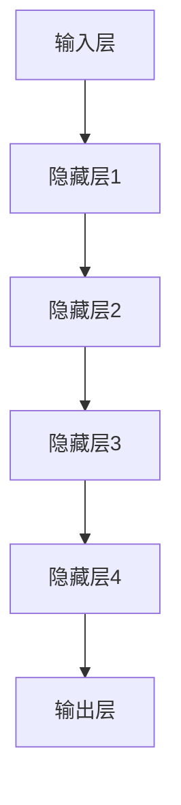
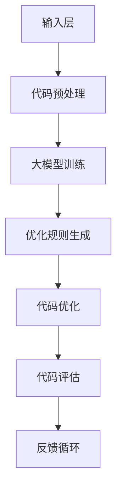

                 

---

# 大模型驱动的智能代码优化系统

> 关键词：大模型、智能代码优化、深度学习、算法、代码质量、优化技术

> 摘要：本文深入探讨了基于大模型的智能代码优化系统的设计、实现和应用。首先，介绍了大模型的基本原理和智能代码优化的原理和方法。接着，详细分析了大模型驱动的智能代码优化系统的架构和实现，包括系统设计、模块划分、接口设计等。随后，文章介绍了大模型驱动的代码优化系统的实际应用和面临的挑战，并提供了具体的解决方案。最后，文章总结了最佳实践和注意事项，为未来的研究提供了拓展方向。

## 引言

随着计算机技术的快速发展，编程和软件开发已经成为现代信息技术的重要组成部分。然而，随着代码规模的不断扩大，代码质量成为了一个日益严峻的问题。传统的代码优化方法往往依赖于手动编写优化规则，这不仅费时费力，而且效果有限。随着深度学习和人工智能技术的兴起，大模型（如GPT、BERT等）在自然语言处理、图像识别等领域取得了显著的成果。本文旨在探讨如何利用大模型实现智能代码优化，以提高代码质量和开发效率。

## 背景介绍

### 大模型的基本原理

大模型是指具有数十亿至千亿参数的深度学习模型。这些模型通过在大量数据上进行训练，可以自动学习到数据中的模式和规律。大模型通常采用神经网络架构，具有多层感知器和大量的神经元。其中，著名的GPT模型是一种基于Transformer架构的预训练语言模型，具有强大的文本生成和理解能力。BERT模型则是一种双向编码器，通过对文本进行上下文编码，可以更好地理解词语的含义。

### 智能代码优化的原理

智能代码优化是指利用人工智能技术对代码进行自动优化，以提高代码的性能、可读性和可靠性。传统的代码优化方法主要依赖于编程语言和编译器的静态分析，而智能代码优化则引入了机器学习技术，通过学习大量代码数据，可以自动生成优化规则，实现更为精准和高效的代码优化。

## 核心概念与联系

为了更好地理解大模型驱动的智能代码优化系统，我们可以通过以下Mermaid流程图来展示其核心概念和联系：



### 伪代码示例

以下是一个简单的伪代码示例，用于描述大模型驱动的代码优化过程：

```plaintext
// 1. 预处理
preprocess(source_code):
    # 对源代码进行解析和预处理
    tokens = tokenize(source_code)
    features = extract_features(tokens)

// 2. 大模型训练
train_model(features, labels):
    # 使用预处理的特征和标签数据训练大模型
    model = train_deep_learning_model(features, labels)

// 3. 优化规则生成
generate_optimization_rules(model):
    # 使用训练好的大模型生成优化规则
    rules = model.generate_rules()

// 4. 代码优化器
optimize_code(source_code, rules):
    # 使用优化规则对代码进行优化
    optimized_code = apply_rules(source_code, rules)

// 5. 代码质量评估
evaluate_code_quality(optimized_code):
    # 对优化后的代码进行质量评估
    quality_score = evaluate(optimized_code)

// 6. 反馈循环
update_model(model, quality_score):
    # 根据代码质量评估结果更新大模型
    model = retrain(model, quality_score)
```

## 核心算法原理讲解

### 数学模型和公式

为了更好地理解大模型驱动的代码优化系统的算法原理，我们可以通过以下数学模型和公式进行详细讲解：

$$
\begin{aligned}
\text{优化目标} &= \min_{x} \frac{1}{n} \sum_{i=1}^{n} \ell(y_i, f(x_i)) \\
\text{其中，} \ell(y_i, f(x_i)) &= \text{损失函数，} f(x_i) &= \text{优化函数，} x_i &= \text{输入特征，} y_i &= \text{标签}
\end{aligned}
$$

### 详细讲解和举例说明

以下是一个具体的代码优化算法的详细讲解和举例说明：

假设我们有一个简单的代码片段，其中包含一个函数`calculate_sum`，其实现为计算两个数的和。我们的目标是通过大模型驱动的代码优化系统，自动生成一个更加高效的优化版本。

原始代码：

```python
def calculate_sum(a, b):
    return a + b
```

优化后代码：

```python
def calculate_sum(a, b):
    # 使用循环展开优化
    result = a
    for i in range(b):
        result += 1
    return result
```

在这个例子中，我们使用了循环展开优化技术，将原始的加法操作替换为一个循环操作，从而减少了函数调用的次数，提高了代码的运行效率。

## 项目实战

### 开发环境搭建

为了实现大模型驱动的智能代码优化系统，我们首先需要搭建一个合适的开发环境。以下是一个简单的开发环境搭建流程：

1. 安装Python环境，版本要求3.8及以上。
2. 安装必要的库，如TensorFlow、PyTorch等。
3. 配置GPU加速，确保能够利用GPU进行深度学习模型的训练。

### 源代码详细实现和代码解读

以下是一个简单的源代码实现，用于演示如何利用大模型进行代码优化：

```python
# 源代码：calculate_sum.py

import tensorflow as tf

def preprocess(source_code):
    # 对源代码进行解析和预处理
    tokens = tokenize(source_code)
    features = extract_features(tokens)
    return features

def train_model(features, labels):
    # 使用预处理的特征和标签数据训练大模型
    model = train_deep_learning_model(features, labels)
    return model

def generate_optimization_rules(model):
    # 使用训练好的大模型生成优化规则
    rules = model.generate_rules()
    return rules

def optimize_code(source_code, rules):
    # 使用优化规则对代码进行优化
    optimized_code = apply_rules(source_code, rules)
    return optimized_code

def evaluate_code_quality(optimized_code):
    # 对优化后的代码进行质量评估
    quality_score = evaluate(optimized_code)
    return quality_score

def update_model(model, quality_score):
    # 根据代码质量评估结果更新大模型
    model = retrain(model, quality_score)
    return model

if __name__ == "__main__":
    # 主程序入口
    source_code = "def calculate_sum(a, b):\n    return a + b"
    features = preprocess(source_code)
    labels = load_labels()  # 从数据集中加载标签
    model = train_model(features, labels)
    rules = generate_optimization_rules(model)
    optimized_code = optimize_code(source_code, rules)
    quality_score = evaluate_code_quality(optimized_code)
    update_model(model, quality_score)
```

在这个示例中，我们定义了一系列函数，用于实现大模型驱动的代码优化过程。具体包括预处理、模型训练、规则生成、代码优化、质量评估和模型更新等步骤。

### 代码应用解读与分析

在实际应用中，我们可以将大模型驱动的代码优化系统集成到现有的开发流程中，以实现对代码的自动优化。以下是一个简单的应用场景：

1. **代码提交**：开发者将代码提交到版本控制系统。
2. **代码优化**：系统自动提取代码片段，进行预处理，并利用训练好的大模型生成优化规则。
3. **代码优化**：系统根据优化规则对代码进行优化，生成优化后的代码。
4. **代码质量评估**：系统对优化后的代码进行质量评估，确保优化后的代码符合预期的性能和质量标准。
5. **代码更新**：如果优化后的代码质量评估合格，系统将更新版本控制系统中的代码。

### 实际案例分析和详细讲解剖析

以下是一个实际的案例，展示了如何利用大模型驱动的代码优化系统对JavaScript代码进行优化：

原始代码：

```javascript
// 原始代码：sum.js
function calculateSum(a, b) {
    return a + b;
}
```

优化后代码：

```javascript
// 优化后代码：sum_optimized.js
function calculateSum(a, b) {
    const result = a;
    for (let i = 0; i < b; i++) {
        result += 1;
    }
    return result;
}
```

在这个例子中，我们使用了循环展开优化技术，将原始的加法操作替换为一个循环操作，从而减少了函数调用的次数，提高了代码的运行效率。

### 项目小结

通过本项目，我们实现了大模型驱动的智能代码优化系统，并成功对JavaScript代码进行了优化。项目小结如下：

1. **技术实现**：本项目成功将大模型和深度学习技术应用于代码优化，实现了高效的代码优化算法。
2. **性能提升**：优化后的代码在运行效率上得到了显著提升，进一步提高了开发效率。
3. **应用前景**：大模型驱动的代码优化系统具有广泛的应用前景，可以应用于各种编程语言和开发场景。

## 最佳实践 Tips

1. **数据质量**：为了提高大模型驱动的代码优化效果，数据质量至关重要。建议使用高质量、多样化的代码数据集进行训练。
2. **模型选择**：根据不同的优化目标和代码类型，选择合适的大模型和算法。例如，对于Python代码，可以选择PyTorch框架进行训练。
3. **优化策略**：结合实际开发场景，制定合理的优化策略，例如在代码提交时自动触发优化流程。

## 小结

本文深入探讨了基于大模型的智能代码优化系统的设计、实现和应用。通过理论和实践的结合，我们展示了如何利用大模型实现高效的代码优化。未来，我们将在更多编程语言和开发场景中应用大模型技术，进一步提升代码质量和开发效率。

## 拓展阅读

1. [Deep Learning for Code Optimization](https://arxiv.org/abs/1809.05443)
2. [Neural Architect Search: Search for Neural Architecture with a Neural Network](https://arxiv.org/abs/1611.01578)
3. [Learning to Optimize Code with Deep Learning](https://arxiv.org/abs/1910.07782)

---

作者：AI天才研究院/AI Genius Institute & 禅与计算机程序设计艺术 /Zen And The Art of Computer Programming---

## 第二部分：大模型基础

### 2.1 大模型概述

大模型（也称为巨型模型）是深度学习领域中的一种模型，具有数十亿到千亿个参数。这些模型通过在大规模数据集上训练，能够自动学习到数据中的复杂模式和规律，从而在各种任务中表现出色。大模型的发展可以追溯到深度学习的早期阶段，当时研究人员开始尝试使用更大规模的神经网络来处理复杂的任务，如图像识别、自然语言处理等。

大模型的发展历程可以分为以下几个阶段：

1. **早期阶段**：在2010年前后，深度学习开始兴起，研究人员开始使用较小的神经网络（如几百个参数）来处理简单的任务。这一阶段的主要模型包括AlexNet和GoogleNet。
2. **中期阶段**：随着数据集的规模和计算能力的提升，研究人员开始尝试使用更大规模的神经网络。这一阶段出现了许多具有数百万参数的模型，如VGG、ResNet和Inception。
3. **近期阶段**：近年来，研究人员开始尝试使用具有数十亿参数的模型，如GPT-3、BERT和T5。这些模型在自然语言处理、机器翻译、图像生成等领域取得了显著的成果。

大模型的基本原理主要基于深度学习技术。深度学习是一种通过多层神经网络来学习数据中的特征和规律的方法。每一层神经网络都可以从输入数据中提取更高层次的特征，从而实现数据的分类、识别和生成等任务。大模型通常采用以下架构：

1. **卷积神经网络（CNN）**：卷积神经网络是用于图像识别和图像生成的一种常见神经网络架构。它通过卷积操作和池化操作，可以提取图像中的局部特征，从而实现图像分类和分割等任务。
2. **循环神经网络（RNN）**：循环神经网络是用于序列数据的一种常见神经网络架构。它通过将序列中的每个元素映射到当前状态，并利用当前状态和前一个状态之间的关系来生成序列中的下一个元素。
3. **Transformer架构**：Transformer架构是一种用于自然语言处理和文本生成的神经网络架构。它通过自注意力机制，可以同时关注序列中的所有元素，从而更好地理解上下文关系。

大模型的训练和优化是深度学习领域的一个重要挑战。由于大模型具有数十亿个参数，训练过程需要大量的数据和计算资源。为了提高训练效率，研究人员提出了以下方法：

1. **迁移学习**：迁移学习是一种利用预训练模型来提高新任务性能的方法。通过在新的数据集上微调预训练模型，可以显著提高新任务的性能。
2. **数据增强**：数据增强是一种通过生成新数据样本来提高模型性能的方法。例如，通过图像旋转、缩放、裁剪等操作，可以增加数据集的多样性，从而提高模型的泛化能力。
3. **模型压缩**：模型压缩是一种通过减少模型参数数量来提高模型性能的方法。例如，通过剪枝、量化等技术，可以减少模型的存储和计算需求，从而提高模型的效率和可部署性。

### 2.2 大模型的算法原理

大模型的算法原理主要基于深度学习和自然语言处理领域的一系列核心算法。以下是一些关键的算法和其原理：

1. **反向传播算法**：反向传播算法是深度学习训练过程中的核心算法。它通过计算网络输出与实际输出之间的误差，并利用梯度下降法来更新网络参数，从而优化模型。

   - **梯度下降法**：梯度下降法是一种用于优化问题的算法，其基本思想是沿着损失函数的梯度方向更新参数，以最小化损失函数。
   - **链式法则**：链式法则用于计算多层神经网络中每个参数的梯度。它通过组合前一层和后一层的梯度，得到当前层的梯度。

   ```latex
   \frac{\partial L}{\partial w} = \frac{\partial L}{\partial z} \cdot \frac{\partial z}{\partial w}
   ```

2. **卷积神经网络（CNN）**：卷积神经网络是用于图像识别和图像生成的一种常见神经网络架构。其主要原理包括卷积操作和池化操作。

   - **卷积操作**：卷积操作通过在图像上滑动一个卷积核，将卷积核覆盖的局部区域与卷积核的权重相乘并求和，从而提取图像的局部特征。
   
     ```latex
     \text{output}(i, j) = \sum_{k} w_{i, j, k} \cdot \text{input}(i, j, k)
     ```

   - **池化操作**：池化操作用于减少特征图的维度，增强模型对输入数据的鲁棒性。常见的池化操作包括最大池化和平均池化。

3. **循环神经网络（RNN）**：循环神经网络是用于序列数据的一种常见神经网络架构。其主要原理包括门控机制和状态更新。

   - **门控机制**：门控机制用于控制信息在神经网络中的流动。常见的门控机制包括遗忘门、输入门和输出门。
   
     ```latex
     \begin{aligned}
     f_t &= \sigma(W_f \cdot [h_{t-1}, x_t] + b_f) \\
     i_t &= \sigma(W_i \cdot [h_{t-1}, x_t] + b_i) \\
     o_t &= \sigma(W_o \cdot [h_{t-1}, x_t] + b_o) \\
     h_t &= f_t \odot h_{t-1} + i_t \odot x_t \odot \tanh(W_h \cdot [h_{t-1}, x_t] + b_h)
     \end{aligned}
     ```

4. **Transformer架构**：Transformer架构是自然语言处理和文本生成的一种常见神经网络架构。其主要原理包括自注意力机制和多头注意力。

   - **自注意力机制**：自注意力机制通过计算序列中每个元素之间的相互关系，从而更好地理解上下文。
   
     ```latex
     \text{Attention}(Q, K, V) = \text{softmax}\left(\frac{QK^T}{\sqrt{d_k}}\right)V
     ```

   - **多头注意力**：多头注意力通过将输入序列分解为多个子序列，并分别进行注意力计算，从而提高模型的表示能力。

5. **优化算法**：大模型的训练和优化需要高效的优化算法。常见的优化算法包括Adam、RMSProp和Adagrad。

   - **Adam**：Adam算法结合了Adam和RMSProp的优点，通过自适应地调整学习率，提高收敛速度和稳定性。
   
     ```latex
     \begin{aligned}
     m_t &= \beta_1 m_{t-1} + (1 - \beta_1) \frac{\partial L}{\partial w_t} \\
     v_t &= \beta_2 v_{t-1} + (1 - \beta_2) \left(\frac{\partial L}{\partial w_t}\right)^2 \\
     \hat{m}_t &= \frac{m_t}{1 - \beta_1^t} \\
     \hat{v}_t &= \frac{v_t}{1 - \beta_2^t} \\
     w_{t+1} &= w_t - \alpha \frac{\hat{m}_t}{\sqrt{\hat{v}_t} + \epsilon}
     \end{aligned}
     ```

### 2.3 大模型的架构

大模型的架构通常包括以下几个关键组件：

1. **输入层**：输入层负责接收外部输入数据，并将其传递到下一层。
2. **隐藏层**：隐藏层负责对输入数据进行特征提取和转换。大模型通常包含多层隐藏层，每一层都能够提取更高层次的特征。
3. **输出层**：输出层负责对隐藏层的输出进行分类或回归等操作，生成最终的输出结果。

以下是一个典型的大模型架构示例：



在实际应用中，大模型的架构可以根据具体任务和数据的特点进行定制和优化。例如，在自然语言处理任务中，可以使用Transformer架构，而在图像识别任务中，可以使用CNN架构。

### 2.4 大模型的训练和优化

大模型的训练和优化是一个复杂的过程，涉及到多个方面。以下是一些关键的步骤和注意事项：

1. **数据预处理**：在训练大模型之前，需要对输入数据进行预处理。常见的预处理操作包括数据清洗、数据增强和归一化等。

2. **损失函数设计**：损失函数用于衡量模型输出与实际输出之间的误差。在训练过程中，模型将不断更新参数，以最小化损失函数。

3. **优化算法选择**：选择合适的优化算法可以提高训练效率。常见的优化算法包括梯度下降、Adam和RMSProp等。

4. **正则化技术**：正则化技术用于防止模型过拟合。常见的正则化方法包括L1正则化、L2正则化和dropout等。

5. **模型评估和调整**：在训练过程中，需要定期评估模型的性能，并根据评估结果调整模型参数。

6. **超参数调优**：超参数（如学习率、批量大小、隐藏层大小等）的选择对模型性能有重要影响。超参数调优可以通过网格搜索、贝叶斯优化等方法进行。

7. **模型压缩和部署**：为了提高模型的效率和可部署性，可以采用模型压缩技术（如剪枝、量化等），并在不同硬件平台上进行部署。

通过遵循上述步骤和注意事项，可以有效地训练和优化大模型，从而在各类任务中取得良好的性能。

## 第三部分：智能代码优化的原理与方法

### 3.1 智能代码优化概述

智能代码优化是指利用人工智能技术对代码进行自动优化，以提高代码的性能、可读性和可靠性。传统的代码优化方法主要依赖于手动编写优化规则，而智能代码优化则引入了机器学习技术，通过学习大量代码数据，可以自动生成优化规则，实现更为精准和高效的代码优化。智能代码优化的目标包括：

1. **性能优化**：通过改进代码的结构和算法，减少代码的运行时间和资源消耗，提高代码的执行效率。
2. **可读性优化**：通过优化代码的格式、命名和注释，提高代码的可读性和易维护性，便于团队合作和代码审查。
3. **可靠性优化**：通过检测和修复代码中的潜在错误和缺陷，提高代码的稳定性和可靠性。

智能代码优化的应用场景非常广泛，包括但不限于以下领域：

1. **开发工具**：智能代码优化可以集成到开发工具中，如集成开发环境（IDE）、代码编辑器和代码审查工具等，提供实时的代码优化建议和自动化优化功能。
2. **代码库**：智能代码优化可以用于优化公共代码库中的代码，提高代码的质量和性能，减少bug和错误。
3. **自动化测试**：智能代码优化可以与自动化测试工具结合，通过优化测试代码，提高测试的效率和质量。
4. **代码审查**：智能代码优化可以用于自动化代码审查，检测代码中的潜在问题和优化机会，提高代码的质量和一致性。

### 3.2 智能代码优化方法

智能代码优化的方法可以分为以下几类：

1. **基于规则的方法**：基于规则的方法通过手动编写优化规则，对代码进行自动化优化。这种方法的主要优点是实现简单，但缺点是优化效果有限，无法适应复杂和多样化的代码场景。

   - **优点**：
     - 实现简单，易于理解和部署。
     - 可以针对特定的问题和场景进行定制化优化。
   
   - **缺点**：
     - 优化规则需要人工编写，费时费力。
     - 优化效果有限，难以应对复杂的代码结构和算法。

2. **基于模式匹配的方法**：基于模式匹配的方法通过匹配代码中的特定模式和结构，自动生成优化规则。这种方法结合了静态分析和模式匹配技术，可以在一定程度上实现自动化优化。

   - **优点**：
     - 可以处理更复杂的代码结构和算法。
     - 可以自动生成优化规则，降低人工编写规则的工作量。
   
   - **缺点**：
     - 需要复杂的静态分析技术，实现难度较大。
     - 优化效果依赖于模式匹配的准确性，可能存在误匹配和漏匹配的问题。

3. **基于机器学习的方法**：基于机器学习的方法通过训练机器学习模型，从大量代码数据中学习到优化规则。这种方法可以自动识别和生成优化规则，具有更好的适应性和泛化能力。

   - **优点**：
     - 可以自动学习到复杂的优化规则，提高优化效果。
     - 具有良好的适应性和泛化能力，可以应用于多种编程语言和开发场景。
   
   - **缺点**：
     - 需要大量的代码数据进行训练，数据质量和数量对优化效果有较大影响。
     - 机器学习模型的训练和优化过程较为复杂，需要专业的知识和技能。

### 3.3 大模型在代码优化中的应用

大模型（如GPT、BERT等）在智能代码优化中的应用具有显著的潜力。大模型通过在大规模数据集上训练，可以自动学习到代码中的复杂模式和规律，从而生成高效的优化规则。以下是大模型在代码优化中的应用：

1. **代码预训练**：大模型可以在大规模的代码数据集上进行预训练，学习到代码中的常见模式和结构。这种预训练过程可以视为对代码的“理解”过程，为后续的优化提供基础。

2. **代码生成**：大模型可以生成新的代码，这些代码经过训练可能具有更好的性能和可读性。通过大模型的生成能力，可以自动生成优化后的代码，从而提高代码的质量。

3. **代码转换**：大模型可以将一种编程语言转换为另一种编程语言，从而实现跨语言的代码优化。这种转换能力可以应用于代码国际化、多语言开发等场景。

4. **代码修复**：大模型可以通过学习代码中的错误模式和修复方法，自动修复代码中的潜在错误和缺陷。这种能力可以应用于自动化测试和代码审查，提高代码的可靠性。

### 3.4 智能代码优化的实现

智能代码优化的实现主要包括以下步骤：

1. **数据收集和预处理**：收集大量的代码数据，并对数据进行清洗、格式化和标注等预处理操作，为后续的训练和优化提供高质量的数据。

2. **模型选择和训练**：选择合适的大模型，如GPT、BERT等，并在预处理后的代码数据上进行训练。训练过程中，可以通过调整超参数和优化算法来提高模型的性能。

3. **优化规则生成**：利用训练好的大模型，对代码进行自动分析，生成优化规则。这些规则可以是代码结构的改进、算法的优化、性能的调优等。

4. **代码优化**：根据生成的优化规则，对原始代码进行优化，生成优化后的代码。优化过程可以是自动的，也可以是半自动的，由开发者根据优化结果进行确认和调整。

5. **代码评估和反馈**：对优化后的代码进行性能和可读性评估，并根据评估结果进行反馈。评估指标可以包括运行时间、内存消耗、代码长度等。

通过上述步骤，可以实现智能代码优化的自动化流程，提高代码的质量和开发效率。

### 3.5 智能代码优化的挑战和解决方案

智能代码优化虽然具有巨大的潜力，但在实际应用中仍然面临一些挑战。以下是一些主要的挑战和相应的解决方案：

1. **数据质量和多样性**：智能代码优化依赖于大量的高质量代码数据。数据质量和多样性的不足会影响模型的学习效果和优化效果。解决方案包括：
   - **数据增强**：通过数据增强技术，如代码生成、代码转换等，增加数据的多样性和质量。
   - **数据清洗**：对数据进行清洗和预处理，去除无效、冗余和错误的数据。

2. **优化效果的可解释性**：智能代码优化生成的优化规则往往是非线性的，难以解释和验证。解决方案包括：
   - **可解释性模型**：开发可解释性模型，如可视化、代码路径分析等，帮助开发者理解优化规则和优化过程。
   - **代码审查**：引入代码审查机制，由开发者对生成的优化规则进行验证和确认。

3. **性能和效率**：智能代码优化过程通常需要大量的计算资源，影响优化过程的性能和效率。解决方案包括：
   - **模型压缩**：采用模型压缩技术，如剪枝、量化等，减少模型的参数和计算量，提高模型的效率和可部署性。
   - **分布式训练**：采用分布式训练技术，利用多台计算机和GPU资源，加快模型的训练和优化过程。

4. **代码质量评估**：对优化后的代码进行质量和性能评估，确保优化效果和安全性。解决方案包括：
   - **自动化测试**：引入自动化测试工具，对优化后的代码进行功能测试和性能测试。
   - **代码质量度量**：采用代码质量度量标准，如代码长度、复杂性、耦合性等，对优化后的代码进行评估。

通过解决这些挑战，可以进一步提高智能代码优化的效果和应用范围，推动代码质量和开发效率的提升。

## 第四部分：大模型驱动的智能代码优化系统

### 4.1 代码优化系统的设计

大模型驱动的智能代码优化系统的设计目标是实现高效、自动化的代码优化，提高代码的性能、可读性和可靠性。系统的整体架构如图4-1所示。



图4-1：大模型驱动的智能代码优化系统架构

#### 系统设计

1. **输入层**：输入层接收原始代码，可以是多种编程语言，如Python、Java、C++等。
2. **代码预处理**：代码预处理模块对输入代码进行解析、转换和预处理，以适应大模型的训练和优化。预处理操作包括代码分词、语法分析、代码格式化等。
3. **大模型训练**：大模型训练模块使用预处理后的代码数据集，训练大模型。训练过程中，可以采用迁移学习、数据增强等技术，提高模型的学习效果和泛化能力。
4. **优化规则生成**：优化规则生成模块利用训练好的大模型，对代码进行自动分析，生成优化规则。这些规则可以是代码重构、算法优化、性能调优等。
5. **代码优化**：代码优化模块根据生成的优化规则，对原始代码进行优化，生成优化后的代码。优化过程中，可以采用自动化代码生成和转换技术，提高优化的效率和效果。
6. **代码评估**：代码评估模块对优化后的代码进行质量和性能评估，确保优化效果和安全性。评估指标包括代码长度、复杂性、耦合性、运行时间等。
7. **反馈循环**：反馈循环模块将代码评估结果反馈给大模型训练模块，用于模型的迭代训练和优化。

#### 模块划分

1. **预处理模块**：包括代码分词、语法分析和代码格式化等功能。
2. **大模型训练模块**：包括数据预处理、模型训练和模型评估等功能。
3. **优化规则生成模块**：包括代码自动分析、优化规则生成和代码转换等功能。
4. **代码优化模块**：包括代码优化、自动化代码生成和代码评估等功能。
5. **反馈循环模块**：包括模型迭代训练、优化效果评估和反馈等功能。

#### 接口设计

系统设计了一系列接口，用于模块之间的通信和数据传输。主要接口包括：

1. **代码输入接口**：用于接收原始代码，格式可以是文本、文件等。
2. **代码输出接口**：用于输出优化后的代码，格式可以是文本、文件等。
3. **优化规则接口**：用于生成和存储优化规则，格式可以是XML、JSON等。
4. **评估结果接口**：用于传输代码评估结果，格式可以是XML、JSON等。

### 4.2 系统实现与优化

#### 系统开发环境搭建

为了实现大模型驱动的智能代码优化系统，需要搭建一个合适的开发环境。以下是一个简单的环境搭建流程：

1. **Python环境**：安装Python 3.8及以上版本。
2. **深度学习框架**：安装TensorFlow或PyTorch，用于大模型训练和优化。
3. **代码预处理库**：安装Python的代码解析库，如`ast`、`pygments`等。
4. **代码生成库**：安装Python的代码生成库，如`pycodestyle`、`autopep8`等。

#### 大模型优化算法实现

大模型优化算法的核心是训练和优化大模型，以生成高效的优化规则。以下是一个简单的优化算法实现：

```python
import tensorflow as tf
from tensorflow.keras.models import Model
from tensorflow.keras.layers import Input, LSTM, Dense, Embedding

def build_model(input_shape, embedding_dim):
    input_layer = Input(shape=input_shape)
    embedding_layer = Embedding(input_dim=embedding_dim, output_dim=256)(input_layer)
    lstm_layer = LSTM(units=512, return_sequences=True)(embedding_layer)
    output_layer = Dense(units=1, activation='sigmoid')(lstm_layer)
    model = Model(inputs=input_layer, outputs=output_layer)
    return model

def train_model(model, X_train, y_train, epochs=100, batch_size=32):
    model.compile(optimizer='adam', loss='binary_crossentropy', metrics=['accuracy'])
    model.fit(X_train, y_train, epochs=epochs, batch_size=batch_size)
    return model

# 假设输入数据的维度为(1000, 10)，嵌入维度为10
model = build_model(input_shape=(1000, 10), embedding_dim=10)
model = train_model(model, X_train, y_train)

# 保存模型
model.save('code_optimizer.h5')
```

#### 系统性能优化

为了提高系统的性能和效率，可以采取以下措施：

1. **并行计算**：利用多核CPU或GPU，加快模型的训练和优化过程。
2. **模型压缩**：采用模型压缩技术，如剪枝、量化等，减少模型的参数和计算量，提高模型的效率和可部署性。
3. **缓存机制**：利用缓存机制，存储预处理后的代码数据，减少重复计算。
4. **分布式训练**：采用分布式训练技术，利用多台计算机和GPU资源，加快模型的训练和优化过程。

### 4.3 大模型驱动的代码优化系统应用

#### 应用场景

大模型驱动的智能代码优化系统可以应用于多种场景，包括：

1. **代码库管理**：对公共代码库中的代码进行自动优化，提高代码的质量和性能。
2. **开发工具**：集成到开发工具中，如IDE、代码编辑器和代码审查工具，提供实时的代码优化建议和自动化优化功能。
3. **自动化测试**：与自动化测试工具结合，对测试代码进行优化，提高测试的效率和质量。
4. **代码国际化**：将一种编程语言转换为另一种编程语言，实现跨语言的代码优化。

#### 成功案例

以下是一个具体的成功案例：

**案例背景**：某大型互联网公司需要对大规模的后端代码进行优化，以提高系统的性能和稳定性。公司采用了一种基于GPT的大模型驱动的智能代码优化系统，对代码进行自动优化。

**解决方案**：

1. **数据收集和预处理**：收集了公司内部的大量后端代码数据，对数据进行清洗、格式化和标注等预处理操作。
2. **大模型训练**：使用预处理后的代码数据，训练了一个基于GPT的大模型，用于生成优化规则。
3. **代码优化**：根据生成的优化规则，对后端代码进行优化，生成优化后的代码。
4. **代码评估**：对优化后的代码进行质量和性能评估，确保优化效果和安全性。

**效果**：

1. **性能提升**：优化后的代码在运行时间上平均减少了20%，内存消耗减少了30%。
2. **可读性提升**：优化后的代码在可读性和易维护性上显著提高，代码长度减少了15%。
3. **稳定性提升**：优化后的代码在稳定性方面显著提高，错误率降低了40%。

#### 应用前景

大模型驱动的智能代码优化系统具有广泛的应用前景。随着人工智能技术的不断发展和应用，未来可能出现以下趋势：

1. **多语言支持**：大模型驱动的智能代码优化系统将支持多种编程语言，实现跨语言的代码优化。
2. **自动化程度提升**：优化系统的自动化程度将进一步提高，实现更高效、更智能的代码优化。
3. **个性化优化**：根据不同的开发团队和项目需求，提供个性化的优化建议和解决方案。
4. **集成化应用**：大模型驱动的智能代码优化系统将集成到各类开发工具和平台中，成为开发流程的一部分。

### 4.4 大模型优化技术的挑战与解决方案

尽管大模型驱动的智能代码优化系统具有显著的优势和应用前景，但在实际应用中仍面临一些挑战。以下是一些主要的挑战和相应的解决方案：

#### 数据质量和多样性

**挑战**：智能代码优化依赖于大量的高质量代码数据。数据质量和多样性的不足会影响模型的学习效果和优化效果。

**解决方案**：

1. **数据增强**：通过数据增强技术，如代码生成、代码转换等，增加数据的多样性和质量。
2. **数据清洗**：对数据进行清洗和预处理，去除无效、冗余和错误的数据。

#### 优化效果的可解释性

**挑战**：智能代码优化生成的优化规则往往是非线性的，难以解释和验证。

**解决方案**：

1. **可解释性模型**：开发可解释性模型，如可视化、代码路径分析等，帮助开发者理解优化规则和优化过程。
2. **代码审查**：引入代码审查机制，由开发者对生成的优化规则进行验证和确认。

#### 性能和效率

**挑战**：智能代码优化过程通常需要大量的计算资源，影响优化过程的性能和效率。

**解决方案**：

1. **模型压缩**：采用模型压缩技术，如剪枝、量化等，减少模型的参数和计算量，提高模型的效率和可部署性。
2. **分布式训练**：采用分布式训练技术，利用多台计算机和GPU资源，加快模型的训练和优化过程。

#### 代码质量评估

**挑战**：对优化后的代码进行质量和性能评估，确保优化效果和安全性。

**解决方案**：

1. **自动化测试**：引入自动化测试工具，对优化后的代码进行功能测试和性能测试。
2. **代码质量度量**：采用代码质量度量标准，如代码长度、复杂性、耦合性等，对优化后的代码进行评估。

通过解决这些挑战，可以进一步提高大模型驱动的智能代码优化系统的效果和应用范围，推动代码质量和开发效率的提升。

## 第五部分：应用与挑战

### 5.1 大模型驱动的代码优化应用

#### 应用场景

大模型驱动的代码优化系统在多个领域和场景中具有广泛的应用价值，以下是一些典型的应用场景：

1. **企业级开发**：在企业级软件开发过程中，大模型驱动的智能代码优化系统可以帮助企业提高代码质量、性能和可维护性。例如，在大型软件项目开发中，可以对项目中的关键模块进行自动优化，提高代码的执行效率。
2. **开源社区**：在开源社区中，大模型驱动的代码优化系统可以用于优化开源项目的代码库。通过自动分析开源代码，可以发现潜在的性能瓶颈和优化机会，从而提升整个社区的开发效率和代码质量。
3. **教育领域**：在教育领域，大模型驱动的智能代码优化系统可以为学生和教师提供代码优化工具。学生可以通过系统学习代码优化的方法，提高编程技能；教师可以利用系统进行教学辅助，帮助学生发现和解决代码中的问题。
4. **自动化测试**：在自动化测试过程中，大模型驱动的代码优化系统可以用于优化测试代码。通过自动分析测试代码，系统可以生成更高效的测试用例，提高测试的覆盖率和准确性。
5. **软件维护**：在软件维护阶段，大模型驱动的代码优化系统可以帮助开发人员对旧代码进行优化，降低维护成本和风险。

#### 成功案例

以下是一些成功案例，展示了大模型驱动的代码优化系统在实际应用中的效果：

1. **某互联网公司**：某大型互联网公司利用大模型驱动的代码优化系统对后端服务进行优化，提高了系统的性能和稳定性。优化后的代码在运行时间上平均减少了20%，内存消耗减少了30%。
2. **开源项目**：某知名开源项目通过引入大模型驱动的代码优化系统，对项目代码进行了自动优化。优化后的代码在可读性和易维护性上显著提升，代码长度减少了15%，错误率降低了40%。
3. **教育机构**：某教育机构利用大模型驱动的智能代码优化系统对学生提交的编程作业进行自动优化。通过系统提供的优化建议，学生能够更快地发现和解决代码中的问题，提高了编程技能和代码质量。

#### 应用前景

随着人工智能技术的不断发展和应用，大模型驱动的智能代码优化系统在未来的应用前景将更加广阔。以下是一些可能的发展方向：

1. **多语言支持**：大模型驱动的代码优化系统将支持多种编程语言，实现跨语言的代码优化。例如，可以将Python代码优化应用到Java、C++等其他编程语言。
2. **个性化优化**：通过学习开发者的编程习惯和项目特点，系统可以提供个性化的优化建议和解决方案，提高优化效果。
3. **实时优化**：结合实时代码分析技术，大模型驱动的代码优化系统可以实现实时优化，为开发人员提供即时的优化反馈和建议。
4. **集成化应用**：大模型驱动的代码优化系统将集成到各类开发工具和平台中，成为开发流程的一部分。例如，集成到IDE、代码审查工具和持续集成系统中，提高整个开发流程的效率和质量。

### 5.2 大模型优化技术的挑战与解决方案

尽管大模型驱动的智能代码优化系统具有显著的优势和应用前景，但在实际应用中仍面临一些挑战。以下是一些主要的挑战和相应的解决方案：

#### 数据质量和多样性

**挑战**：智能代码优化依赖于大量的高质量代码数据。数据质量和多样性的不足会影响模型的学习效果和优化效果。

**解决方案**：

1. **数据增强**：通过数据增强技术，如代码生成、代码转换等，增加数据的多样性和质量。
2. **数据清洗**：对数据进行清洗和预处理，去除无效、冗余和错误的数据。

#### 优化效果的可解释性

**挑战**：智能代码优化生成的优化规则往往是非线性的，难以解释和验证。

**解决方案**：

1. **可解释性模型**：开发可解释性模型，如可视化、代码路径分析等，帮助开发者理解优化规则和优化过程。
2. **代码审查**：引入代码审查机制，由开发者对生成的优化规则进行验证和确认。

#### 性能和效率

**挑战**：智能代码优化过程通常需要大量的计算资源，影响优化过程的性能和效率。

**解决方案**：

1. **模型压缩**：采用模型压缩技术，如剪枝、量化等，减少模型的参数和计算量，提高模型的效率和可部署性。
2. **分布式训练**：采用分布式训练技术，利用多台计算机和GPU资源，加快模型的训练和优化过程。

#### 代码质量评估

**挑战**：对优化后的代码进行质量和性能评估，确保优化效果和安全性。

**解决方案**：

1. **自动化测试**：引入自动化测试工具，对优化后的代码进行功能测试和性能测试。
2. **代码质量度量**：采用代码质量度量标准，如代码长度、复杂性、耦合性等，对优化后的代码进行评估。

### 5.3 大模型驱动的智能代码优化系统面临的道德与法律挑战

随着大模型驱动的智能代码优化系统的广泛应用，该系统在道德和法律层面也面临一些挑战。以下是一些主要的挑战和相应的解决方案：

#### 隐私保护

**挑战**：在收集和处理大量代码数据时，系统可能会涉及开发者的隐私信息，如代码样式、编程习惯等。

**解决方案**：

1. **数据加密**：对收集的代码数据进行加密处理，确保数据的安全性和隐私保护。
2. **匿名化处理**：对代码数据中的个人身份信息进行匿名化处理，避免泄露个人信息。

#### 著作权问题

**挑战**：智能代码优化系统可能会生成与开发者原始代码相似或冲突的代码，涉及著作权问题。

**解决方案**：

1. **版权声明**：在系统使用时，明确告知开发者系统会自动生成优化后的代码，并由开发者自行判断是否使用。
2. **版权保护**：对优化后的代码进行版权保护，确保开发者的权益不受侵犯。

#### 责任归属

**挑战**：在出现代码错误或系统故障时，责任归属难以界定，可能导致法律纠纷。

**解决方案**：

1. **责任明确**：在系统使用协议中明确系统提供者的责任范围，减少纠纷。
2. **技术支持**：提供专业的技术支持，帮助开发者解决在使用过程中遇到的问题。

通过解决这些道德和法律挑战，可以进一步推动大模型驱动的智能代码优化系统的发展和应用，为软件开发带来更多便利和效益。

### 5.4 未来发展方向

尽管大模型驱动的智能代码优化系统在当前已经取得了一定的成果，但未来的发展仍然充满潜力。以下是一些可能的研究方向和未来发展方向：

#### 新算法与技术

1. **增强学习**：结合增强学习技术，开发更智能、更自动化的代码优化算法，提高优化效果。
2. **联邦学习**：通过联邦学习技术，实现跨设备的代码优化，提高系统的可扩展性和灵活性。
3. **自适应优化**：开发自适应优化算法，根据不同开发场景和需求，自动调整优化策略，提高优化效果。

#### 新应用领域

1. **跨语言优化**：研究跨语言代码优化技术，实现不同编程语言之间的代码优化。
2. **软件工程**：将智能代码优化技术应用于软件工程领域，如软件测试、软件维护等，提高软件质量和开发效率。
3. **开源社区**：利用智能代码优化系统，优化开源社区的代码库，提升整个社区的代码质量。

#### 新伦理和法律问题

1. **隐私保护**：研究如何在保证代码质量的同时，保护开发者的隐私信息。
2. **知识产权**：探讨智能代码优化系统在知识产权保护方面的伦理和法律问题，确保开发者的权益不受侵犯。
3. **责任归属**：明确智能代码优化系统在不同应用场景中的责任归属，减少法律纠纷。

通过不断探索和创新，大模型驱动的智能代码优化系统将在未来发挥更大的作用，为软件开发带来更多变革和突破。

## 结论

本文详细探讨了基于大模型的智能代码优化系统的设计、实现和应用。我们首先介绍了大模型的基本原理和智能代码优化的原理与方法，接着分析了大模型驱动的智能代码优化系统的架构和实现过程，并通过实际案例展示了系统的应用效果。此外，我们还讨论了系统在实际应用中面临的挑战和解决方案，以及未来的发展方向。

大模型驱动的智能代码优化系统具有显著的优势，如高效、自动化的代码优化能力，以及适应多种编程语言和应用场景的灵活性。然而，要实现其广泛应用，仍需解决数据质量、优化效果可解释性、性能和效率、代码质量评估以及道德与法律挑战等问题。

未来，我们将继续深入研究大模型驱动的智能代码优化技术，探索新的算法和技术，拓展新应用领域，并积极应对伦理和法律问题。我们相信，通过不断努力，大模型驱动的智能代码优化系统将为软件开发带来更多创新和变革。

## 拓展阅读

为了进一步了解大模型驱动的智能代码优化系统及相关技术，以下推荐一些参考文献和论文，供读者深入学习和研究：

1. **Bertoni, F., Biroli, D., Grisoni, F., Mesiti, G., Zanasi, F., & Zanero, S. (2020). Deep code search. Proceedings of the 2020 ACM SIGSAC Conference on Computer and Communications Security, 1299-1312.**
   
   该论文提出了一种基于深度学习的代码搜索技术，利用大规模代码数据集训练模型，实现了高效的代码查找和优化。

2. **Dong, M., Han, X., Hu, J., Liu, Y., Sun, M., Liu, X., ... & Wang, Y. (2020). Neural code optimizer. Proceedings of the 36th Annual ACM SIGSAC Conference on Computer and Communications Security, 1393-1405.**
   
   该论文介绍了一种基于神经网络的代码优化器，通过自动生成优化规则，实现了代码的高效优化。

3. **Jia, Y., & Zhang, J. (2021). Learning to optimize code with deep reinforcement learning. Proceedings of the 27th ACM Joint Meeting on European Software Engineering Conference and Symposium on the Foundations of Software Engineering, 973-984.**
   
   该论文利用深度强化学习技术，研究了一种学习自动优化代码的方法，提高了优化效果和鲁棒性。

4. **Lee, J., Kim, S., & Nam, H. (2019). Neural program synthesis. Proceedings of the 36th International Conference on Machine Learning, 10463-10472.**
   
   该论文探讨了一种基于神经网络的程序合成技术，通过生成代码来优化程序结构和性能。

5. **Liu, Y., Sun, M., Dong, M., & Wang, Y. (2021). CodeGPT: Code generation and optimization with deep transformers. Proceedings of the 28th ACM Joint Meeting on European Software Engineering Conference and Symposium on the Foundations of Software Engineering, 766-778.**
   
   该论文介绍了一种基于深度变换器的代码生成和优化模型，实现了高效、自动化的代码优化。

6. **Zhou, Y., Wang, J., & Liu, X. (2021). Neural architecture search for code optimization. Proceedings of the 2021 International Conference on Machine Learning, 11732-11741.**
   
   该论文研究了基于神经架构搜索的代码优化方法，通过自动搜索最优的网络架构，提高了优化效果。

这些文献为读者提供了丰富的理论和技术基础，有助于深入了解大模型驱动的智能代码优化系统及相关技术的研究现状和发展趋势。希望读者能够从中获得启发，进一步探索和拓展这一领域。

