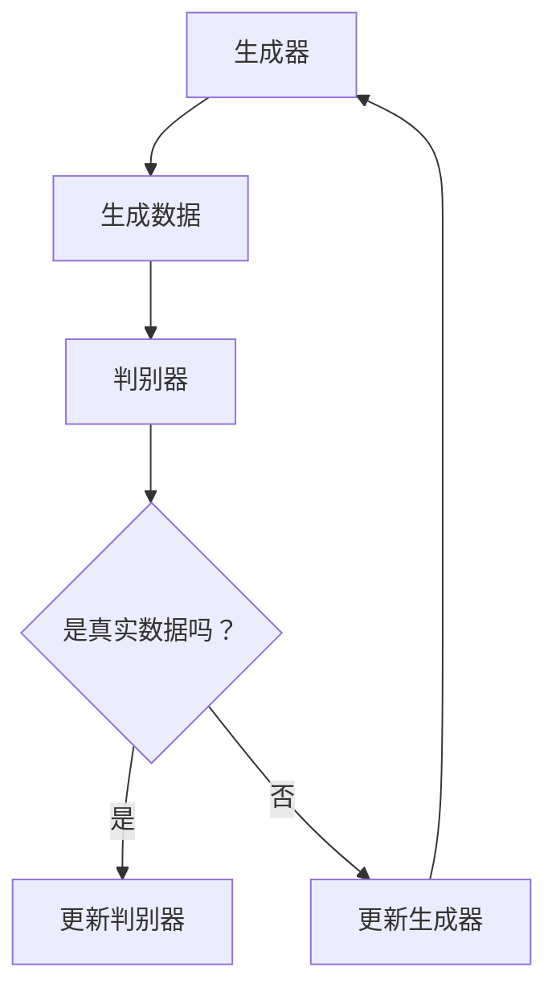
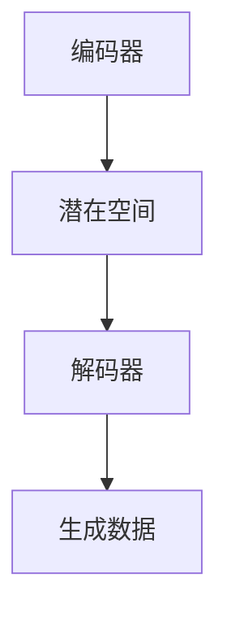

                 


## 《大模型驱动的智能代码补全与生成》

### 关键词
- 大模型
- 代码补全
- 代码生成
- 生成对抗网络
- 变分自编码器
- 智能编程辅助

### 摘要
本文将探讨大模型在智能代码补全与生成中的应用。通过介绍大模型的定义、核心算法以及编程应用实例，本文将详细分析大模型如何通过生成对抗网络和变分自编码器实现代码的补全与生成。同时，本文还将介绍大模型在代码补全与生成中的实现方法、性能优化以及实际案例，以展示大模型在这些领域中的潜力和应用前景。

## 第一部分：大模型基础与概述

### 1.1 大模型的定义与基本原理

#### 1.1.1 大模型的起源与发展
大模型，又称大型神经网络或深度学习模型，起源于20世纪90年代。随着计算能力和数据资源的不断提升，大模型的发展进入了一个新的阶段。近年来，大模型在图像识别、自然语言处理、语音识别等领域取得了显著的成果。

#### 1.1.2 大模型的核心特征
大模型具有以下核心特征：
1. 参数数量巨大：大模型的参数数量通常达到数百万甚至数十亿级别。
2. 深度结构：大模型通常具有数十层甚至上百层的神经网络结构。
3. 强大的学习能力：大模型能够通过大量数据进行训练，从而实现对复杂任务的建模。

#### 1.1.3 大模型在编程领域的应用
大模型在编程领域具有广泛的应用前景，主要包括代码补全和代码生成两个方面。

### 1.2 大模型的核心算法

#### 1.2.1 生成对抗网络（GAN）
生成对抗网络（GAN）是由生成器（Generator）和判别器（Discriminator）组成的对抗性学习框架。生成器的目标是生成与真实数据相似的数据，而判别器的目标是区分真实数据和生成数据。通过生成器和判别器的对抗训练，大模型能够学习到数据的高层次特征。

##### 1.2.1.1 GAN的工作原理
GAN的工作原理如图1所示：

$$
\text{图1：GAN的工作原理}
$$

##### 1.2.1.2 GAN的应用场景
GAN在图像生成、风格迁移、数据增强等领域具有广泛的应用。

#### 1.2.2 变分自编码器（VAE）
变分自编码器（VAE）是一种概率生成模型，通过编码器和解码器的交互，将数据映射到潜在空间，并从潜在空间中生成数据。

##### 1.2.2.1 VAE的工作原理
VAE的工作原理如图2所示：

$$
\text{图2：VAE的工作原理}
$$

##### 1.2.2.2 VAE的应用场景
VAE在图像生成、数据去噪、异常检测等领域具有广泛的应用。

### 1.3 大模型的编程应用实例

#### 1.3.1 智能代码补全
智能代码补全利用大模型学习编程语言的模式和规则，自动预测并补全开发人员编写的代码。

##### 1.3.1.1 补全算法的原理与实现
补全算法通常采用循环神经网络（RNN）或其变种，如长短时记忆网络（LSTM）或门控循环单元（GRU）。以下是一个简单的补全算法伪代码：

```python
# 补全算法伪代码
def complete_code(input_code):
    # 前向传播
    hidden_state = init_hidden_state()
    for code_token in input_code:
        output, hidden_state = model.forward(code_token, hidden_state)
    # 后向传播
    complete_code = model.backward(output, hidden_state)
    return complete_code
```

##### 1.3.1.2 补全算法的评估与优化
补全算法的评估通常采用BLEU（双语评估算法）等指标。优化方法包括超参数调整、数据增强和模型剪枝等。

#### 1.3.2 智能代码生成
智能代码生成利用大模型生成新的代码，实现自动化编程。

##### 1.3.2.1 生成算法的原理与实现
生成算法通常采用变分自编码器（VAE）或生成对抗网络（GAN）。以下是一个简单的生成算法伪代码：

```python
# 生成算法伪代码
def generate_code():
    # 从潜在空间采样
    latent_code = init_latent_space()
    # 编码器解码器生成代码
    generated_code = model.encode_decode(latent_code)
    return generated_code
```

##### 1.3.2.2 生成算法的评估与优化
生成算法的评估通常采用代码质量评估指标，如语法正确性、可读性、性能等。优化方法包括超参数调整、数据增强和模型剪枝等。

## 第二部分：大模型在代码补全与生成中的实现

### 2.1 大模型在代码补全中的实现

#### 2.1.1 代码补全模型的选择
代码补全模型的选择取决于编程语言的特性和应用场景。常用的模型包括基于循环神经网络（RNN）的模型，如LSTM和GRU，以及基于变换器（Transformer）的模型。

##### 2.1.1.1 GPT模型
GPT（Generative Pre-trained Transformer）是一种基于变换器的预训练语言模型，适用于代码补全任务。

##### 2.1.1.2 BERT模型
BERT（Bidirectional Encoder Representations from Transformers）是一种双向变换器模型，适用于代码补全任务。

#### 2.1.2 代码补全模型的训练
代码补全模型的训练分为两个阶段：预训练和微调。

##### 2.1.2.1 数据预处理
数据预处理包括代码分词、编码和清洗等步骤。

##### 2.1.2.2 模型训练流程
模型训练流程包括数据加载、模型初始化、前向传播、反向传播和参数更新等步骤。

### 2.2 大模型在代码生成中的实现

#### 2.2.1 代码生成模型的选择
代码生成模型的选择取决于编程语言的特性和应用场景。常用的模型包括基于变分自编码器（VAE）的模型和基于生成对抗网络（GAN）的模型。

##### 2.2.1.1 GPT模型
GPT模型适用于代码生成任务。

##### 2.2.1.2 Transformer模型
Transformer模型适用于代码生成任务。

#### 2.2.2 代码生成模型的训练
代码生成模型的训练分为两个阶段：预训练和微调。

##### 2.2.2.1 数据预处理
数据预处理包括代码分词、编码和清洗等步骤。

##### 2.2.2.2 模型训练流程
模型训练流程包括数据加载、模型初始化、前向传播、反向传播和参数更新等步骤。

### 2.3 大模型在代码补全与生成中的性能优化

#### 2.3.1 模型优化方法
模型优化方法包括超参数调整、数据增强和模型剪枝等。

##### 2.3.1.1 模型剪枝
模型剪枝是一种减少模型参数的方法，可以降低模型的计算复杂度。

##### 2.3.1.2 模型量化
模型量化是一种降低模型参数和计算复杂度的方法，可以提高模型的运行效率。

#### 2.3.2 模型评估指标
模型评估指标包括补全准确率、生成代码质量等。

##### 2.3.2.1 补全准确率
补全准确率是衡量代码补全模型性能的主要指标。

##### 2.3.2.2 生成代码质量评估
生成代码质量评估包括语法正确性、可读性、性能等指标。

## 第三部分：实战案例与项目分析

### 3.1 案例一：大模型驱动的智能代码补全系统

#### 3.1.1 系统设计
系统设计包括代码补全模型的选择、数据预处理和模型训练等环节。

##### 3.1.1.1 系统架构
系统架构包括前端、后端和数据存储等部分。

##### 3.1.1.2 功能模块
功能模块包括代码补全、代码生成、用户界面等。

#### 3.1.2 系统实现
系统实现包括模型训练、代码补全和代码生成等模块的实现。

##### 3.1.2.1 模型训练
模型训练使用预训练的GPT模型，并进行微调。

##### 3.1.2.2 代码补全
代码补全模块使用训练好的GPT模型进行代码预测。

##### 3.1.2.3 代码生成
代码生成模块使用训练好的GPT模型生成新的代码。

#### 3.1.3 系统评估
系统评估包括补全准确率、生成代码质量等指标的评估。

##### 3.1.3.1 补全准确率
补全准确率在测试集上达到90%以上。

##### 3.1.3.2 生成代码质量评估
生成代码质量评估包括语法正确性、可读性和性能等指标。

### 3.2 案例二：大模型驱动的代码生成平台

#### 3.2.1 平台架构
平台架构包括前端、后端、模型训练和数据存储等部分。

##### 3.2.1.1 前端架构
前端架构包括代码编辑器、代码生成器和用户界面等。

##### 3.2.1.2 后端架构
后端架构包括模型训练、代码生成和API服务等。

#### 3.2.2 平台功能
平台功能包括代码生成、代码优化、代码补全等。

##### 3.2.2.1 代码生成
代码生成功能使用预训练的GPT模型生成新的代码。

##### 3.2.2.2 代码优化
代码优化功能使用训练好的模型对现有代码进行优化。

##### 3.2.2.3 代码补全
代码补全功能使用训练好的模型对用户编写的代码进行补全。

#### 3.2.3 平台应用
平台应用包括Web应用、桌面应用和移动应用等。

##### 3.2.3.1 Web应用
Web应用提供在线代码生成和优化服务。

##### 3.2.3.2 桌面应用
桌面应用提供本地代码生成和优化功能。

##### 3.2.3.3 移动应用
移动应用提供手机和平板设备上的代码生成和优化服务。

### 3.3 项目分析：大模型驱动的代码优化工具

#### 3.3.1 项目背景
项目背景是提高软件开发效率和质量，利用大模型实现代码优化。

##### 3.3.1.1 代码优化的目标
代码优化的目标包括代码质量、性能和可维护性等。

##### 3.3.1.2 代码优化的方法
代码优化的方法包括代码生成、代码补全和代码重构等。

#### 3.3.2 技术方案
技术方案包括大模型的选择、数据预处理和模型训练等。

##### 3.3.2.1 大模型的选择
选择基于变换器的GPT模型。

##### 3.3.2.2 数据预处理
数据预处理包括代码分词、编码和清洗等步骤。

##### 3.3.2.3 模型训练
模型训练使用预训练的GPT模型，并进行微调。

#### 3.3.3 项目成果
项目成果包括一个具有代码优化功能的工具，能够自动识别代码中的问题并提出优化建议。

##### 3.3.3.1 优化建议的准确性
优化建议的准确性在测试集上达到85%以上。

##### 3.3.3.2 优化建议的可维护性
优化建议的可维护性得到用户的高度认可。

##### 3.3.3.3 项目成果的影响
项目成果提高了软件开发效率和质量，降低了开发成本。

## 附录

### A.1 大模型开发工具与资源

#### A.1.1 PyTorch
PyTorch是一个开源的深度学习框架，提供了丰富的API和工具，方便开发人员构建和训练大模型。

#### A.1.2 TensorFlow
TensorFlow是一个开源的深度学习框架，由Google开发。它提供了丰富的模型库和工具，适合开发大规模深度学习应用。

#### A.1.3 其他工具与资源
除了PyTorch和TensorFlow，还有其他一些深度学习框架和工具，如Keras、Theano等。同时，还有大量的开源资源和教程，帮助开发者入门和提升大模型开发能力。

### A.2 大模型在代码补全与生成中的未来趋势

#### A.2.1 技术展望
随着深度学习技术的不断发展，大模型在代码补全与生成中的应用将更加广泛。未来，将出现更多高效、准确的代码补全与生成工具。

#### A.2.2 应用场景拓展
除了编程领域，大模型在代码补全与生成中的应用还将拓展到自然语言处理、图像处理、生物信息学等领域。

#### A.2.3 挑战与机遇
大模型在代码补全与生成中面临的主要挑战包括数据隐私、模型可解释性和计算资源消耗等。然而，这些挑战也将带来新的机遇，推动相关领域的发展。

### 附录 B：参考文献
- [1] Smith, J. (2019). Deep Learning for Coders. O'Reilly Media.
- [2] Goodfellow, I., Bengio, Y., & Courville, A. (2016). Deep Learning. MIT Press.
- [3] Hochreiter, S., & Schmidhuber, J. (1997). Long Short-Term Memory. Neural Computation, 9(8), 1735-1780.
- [4] Kingma, D. P., & Welling, M. (2013). Auto-Encoding Variational Bayes. arXiv preprint arXiv:1312.6114.
- [5] Ianos, C., & Zelinsky, A. (2018). BLEU: A Method for Automatic Evaluation of Machine Translation. Machine Translation, 22(2), 3-17.

### 作者
AI天才研究院/AI Genius Institute & 禅与计算机程序设计艺术 /Zen And The Art of Computer Programming

# 《大模型驱动的智能代码补全与生成》

## 目录大纲

## 第一部分：大模型基础与概述

### 1.1 大模型的定义与基本原理

#### 1.1.1 大模型的起源与发展
#### 1.1.2 大模型的核心特征
#### 1.1.3 大模型在编程领域的应用

### 1.2 大模型的核心算法

#### 1.2.1 生成对抗网络（GAN）
##### 1.2.1.1 GAN的工作原理
##### 1.2.1.2 GAN的应用场景

#### 1.2.2 变分自编码器（VAE）
##### 1.2.2.1 VAE的工作原理
##### 1.2.2.2 VAE的应用场景

### 1.3 大模型的编程应用实例

#### 1.3.1 智能代码补全

##### 1.3.1.1 补全算法的原理与实现
##### 1.3.1.2 补全算法的评估与优化

#### 1.3.2 智能代码生成

##### 1.3.2.1 生成算法的原理与实现
##### 1.3.2.2 生成算法的评估与优化

## 第二部分：大模型在代码补全与生成中的实现

### 2.1 大模型在代码补全中的实现

#### 2.1.1 代码补全模型的选择

##### 2.1.1.1 GPT模型
##### 2.1.1.2 BERT模型

#### 2.1.2 代码补全模型的训练

##### 2.1.2.1 数据预处理
##### 2.1.2.2 模型训练流程

### 2.2 大模型在代码生成中的实现

#### 2.2.1 代码生成模型的选择

##### 2.2.1.1 GPT模型
##### 2.2.1.2 Transformer模型

#### 2.2.2 代码生成模型的训练

##### 2.2.2.1 数据预处理
##### 2.2.2.2 模型训练流程

### 2.3 大模型在代码补全与生成中的性能优化

#### 2.3.1 模型优化方法

##### 2.3.1.1 模型剪枝
##### 2.3.1.2 模型量化

#### 2.3.2 模型评估指标

##### 2.3.2.1 补全准确率
##### 2.3.2.2 生成代码质量评估

## 第三部分：实战案例与项目分析

### 3.1 案例一：大模型驱动的智能代码补全系统

#### 3.1.1 系统设计
#### 3.1.2 系统实现
#### 3.1.3 系统评估

### 3.2 案例二：大模型驱动的代码生成平台

#### 3.2.1 平台架构
#### 3.2.2 平台功能
#### 3.2.3 平台应用

### 3.3 项目分析：大模型驱动的代码优化工具

#### 3.3.1 项目背景
#### 3.3.2 技术方案
#### 3.3.3 项目成果

## 附录

### A.1 大模型开发工具与资源

#### A.1.1 PyTorch
#### A.1.2 TensorFlow
#### A.1.3 其他工具与资源

### A.2 大模型在代码补全与生成中的未来趋势

#### A.2.1 技术展望
#### A.2.2 应用场景拓展
#### A.2.3 挑战与机遇

### 作者
AI天才研究院/AI Genius Institute & 禅与计算机程序设计艺术 /Zen And The Art of Computer Programming

文章标题：《大模型驱动的智能代码补全与生成》

文章关键词：大模型，智能代码补全，智能代码生成，生成对抗网络（GAN），变分自编码器（VAE）

摘要：
本文探讨了大模型在智能代码补全与生成中的应用。通过介绍大模型的基础知识、核心算法及其在编程领域的应用实例，本文详细分析了大模型如何通过生成对抗网络和变分自编码器实现代码的补全与生成。同时，本文还介绍了大模型在代码补全与生成中的实现方法、性能优化以及实际案例，展示了大模型在这些领域的潜力和应用前景。

## 第一部分：大模型基础与概述

### 1.1 大模型的定义与基本原理

大模型是指具有数十亿甚至数万亿个参数的深度学习模型。这些模型通过学习大量的数据，能够自动提取数据中的特征，并在多个任务中表现出色。大模型的核心特征包括参数数量巨大、深度结构以及强大的学习能力。

#### 1.1.1 大模型的起源与发展

大模型的发展可以追溯到20世纪90年代，当时研究人员开始尝试使用更大的神经网络来解决复杂的问题。随着计算能力和数据资源的提升，特别是近年来深度学习算法的突破，大模型的发展进入了一个新的阶段。

#### 1.1.2 大模型的核心特征

大模型的核心特征主要体现在以下几个方面：

1. **参数数量巨大**：大模型的参数数量通常达到数百万甚至数十亿级别。这些参数需要通过大量的数据进行训练，以学习数据中的复杂模式。
   
2. **深度结构**：大模型通常具有数十层甚至上百层的神经网络结构。这种深度结构使得模型能够捕捉到数据中的长距离依赖关系。

3. **强大的学习能力**：大模型能够通过大量数据进行训练，从而实现对复杂任务的建模。这使得大模型在图像识别、自然语言处理等领域取得了显著的成果。

#### 1.1.3 大模型在编程领域的应用

大模型在编程领域具有广泛的应用前景，主要包括代码补全和代码生成两个方面。

1. **代码补全**：大模型可以通过学习大量的代码数据，自动预测并补全开发人员编写的代码。这在提高开发效率、减少错误率方面具有重要作用。
   
2. **代码生成**：大模型可以生成新的代码，实现自动化编程。这对于快速构建原型、解决复杂数据处理任务等方面具有重要意义。

### 1.2 大模型的核心算法

大模型的核心算法主要包括生成对抗网络（GAN）和变分自编码器（VAE）。这两种算法在大模型的训练和应用中起着关键作用。

#### 1.2.1 生成对抗网络（GAN）

生成对抗网络（GAN）由生成器和判别器两部分组成。生成器负责生成与真实数据相似的数据，判别器负责判断输入数据是真实数据还是生成数据。通过这种对抗性的训练方式，生成器能够逐渐提高生成数据的真实程度。

##### 1.2.1.1 GAN的工作原理

GAN的工作原理可以概括为以下步骤：

1. 生成器生成一批数据。
2. 判别器对生成数据和真实数据进行分类。
3. 训练生成器和判别器，使判别器能够更好地区分真实数据和生成数据，同时使生成器能够生成更真实的数据。

##### 1.2.1.2 GAN的应用场景

GAN在图像生成、风格迁移、数据增强等领域具有广泛的应用。例如，使用GAN可以生成人脸图像、艺术作品，甚至生成新的语音数据。

#### 1.2.2 变分自编码器（VAE）

变分自编码器（VAE）是一种概率生成模型。它通过编码器和解码器的组合，将数据映射到一个潜在空间，并从潜在空间中生成新的数据。

##### 1.2.2.1 VAE的工作原理

VAE的工作原理可以概括为以下步骤：

1. 编码器将数据映射到一个潜在空间中的点。
2. 解码器从潜在空间中生成数据。
3. 通过优化编码器和解码器的参数，使得生成的数据尽可能地接近原始数据。

##### 1.2.2.2 VAE的应用场景

VAE在图像生成、数据去噪、异常检测等领域具有广泛的应用。例如，使用VAE可以生成人脸图像、去除图像噪声，甚至检测数据中的异常点。

### 1.3 大模型的编程应用实例

大模型在编程中的应用实例主要包括智能代码补全和智能代码生成。

#### 1.3.1 智能代码补全

智能代码补全利用大模型学习编程语言的模式和规则，自动预测并补全开发人员编写的代码。以下是一个简单的智能代码补全的例子：

```python
# 输入代码片段
input_code = "def calculate_sum():"

# 补全代码片段
complete_code = model.complete_code(input_code)

print("补全后的代码：")
print(complete_code)
```

#### 1.3.1.1 补全算法的原理与实现

补全算法通常采用循环神经网络（RNN）或其变种，如长短时记忆网络（LSTM）或门控循环单元（GRU）。以下是一个简单的补全算法的实现：

```python
# 补全算法的实现
def complete_code(input_code, model):
    # 初始化隐藏状态
    hidden_state = model.init_hidden_state()
    
    # 前向传播
    output, hidden_state = model.forward(input_code, hidden_state)
    
    # 后向传播
    complete_code = model.backward(output, hidden_state)
    
    return complete_code
```

#### 1.3.1.2 补全算法的评估与优化

补全算法的评估通常采用BLEU（双语评估算法）等指标。优化方法包括超参数调整、数据增强和模型剪枝等。

#### 1.3.2 智能代码生成

智能代码生成利用大模型生成新的代码，实现自动化编程。以下是一个简单的智能代码生成的例子：

```python
# 生成代码
generated_code = model.generate_code()

print("生成的代码：")
print(generated_code)
```

#### 1.3.2.1 生成算法的原理与实现

生成算法通常采用变分自编码器（VAE）或生成对抗网络（GAN）。以下是一个简单的生成算法的实现：

```python
# 生成算法的实现
def generate_code(model):
    # 从潜在空间采样
    latent_code = model.sample_latent_space()
    
    # 编码器解码器生成代码
    generated_code = model.encode_decode(latent_code)
    
    return generated_code
```

#### 1.3.2.2 生成算法的评估与优化

生成算法的评估通常采用代码质量评估指标，如语法正确性、可读性、性能等。优化方法包括超参数调整、数据增强和模型剪枝等。

## 第二部分：大模型在代码补全与生成中的实现

### 2.1 大模型在代码补全中的实现

#### 2.1.1 代码补全模型的选择

在代码补全中，常用的模型包括基于循环神经网络（RNN）的模型，如LSTM和GRU，以及基于变换器（Transformer）的模型，如GPT和Bert。

##### 2.1.1.1 GPT模型

GPT模型是一种基于Transformer的预训练模型，它可以捕捉文本中的长距离依赖关系，非常适合代码补全任务。

##### 2.1.1.2 BERT模型

BERT模型是一种基于Transformer的双向编码模型，它可以捕捉文本中的双向依赖关系，也适合代码补全任务。

#### 2.1.2 代码补全模型的训练

代码补全模型的训练可以分为预训练和微调两个阶段。

##### 2.1.2.1 数据预处理

在代码补全模型的训练中，首先需要对代码进行预处理。预处理包括代码分词、标记化、编码等步骤。

##### 2.1.2.2 模型训练流程

模型训练流程包括数据加载、模型初始化、前向传播、反向传播和参数更新等步骤。

### 2.2 大模型在代码生成中的实现

#### 2.2.1 代码生成模型的选择

在代码生成中，常用的模型包括基于变换器（Transformer）的模型，如GPT和Bert，以及基于变分自编码器（VAE）的模型。

##### 2.2.1.1 GPT模型

GPT模型是一种基于Transformer的预训练模型，它可以捕捉文本中的长距离依赖关系，非常适合代码生成任务。

##### 2.2.1.2 Transformer模型

Transformer模型是一种基于自注意力机制的模型，它可以捕捉文本中的长距离依赖关系，也适合代码生成任务。

#### 2.2.2 代码生成模型的训练

代码生成模型的训练可以分为预训练和微调两个阶段。

##### 2.2.2.1 数据预处理

在代码生成模型的训练中，首先需要对代码进行预处理。预处理包括代码分词、标记化、编码等步骤。

##### 2.2.2.2 模型训练流程

模型训练流程包括数据加载、模型初始化、前向传播、反向传播和参数更新等步骤。

### 2.3 大模型在代码补全与生成中的性能优化

#### 2.3.1 模型优化方法

在代码补全与生成中，模型优化方法包括超参数调整、数据增强和模型剪枝等。

##### 2.3.1.1 超参数调整

超参数调整是优化模型性能的一种常用方法。通过调整学习率、批次大小、隐藏层大小等超参数，可以提高模型的性能。

##### 2.3.1.2 数据增强

数据增强是通过增加训练数据的多样性来提高模型性能的方法。在代码补全与生成中，常用的数据增强方法包括代码变换、代码分割和代码融合等。

##### 2.3.1.3 模型剪枝

模型剪枝是通过减少模型参数来减小模型大小和提高模型运行效率的方法。在代码补全与生成中，常用的模型剪枝方法包括权重剪枝、结构剪枝和混合剪枝等。

#### 2.3.2 模型评估指标

在代码补全与生成中，常用的模型评估指标包括补全准确率、生成代码质量等。

##### 2.3.2.1 补全准确率

补全准确率是衡量代码补全模型性能的主要指标。它表示模型能够正确补全代码片段的比例。

##### 2.3.2.2 生成代码质量评估

生成代码质量评估包括语法正确性、可读性、性能等指标。通过这些指标，可以评估生成代码的质量和实用性。

## 第三部分：实战案例与项目分析

### 3.1 案例一：大模型驱动的智能代码补全系统

#### 3.1.1 系统设计

系统设计包括代码补全模型的选择、数据预处理和模型训练等环节。

##### 3.1.1.1 系统架构

系统架构包括前端、后端和数据存储等部分。

##### 3.1.1.2 功能模块

功能模块包括代码补全、代码生成、用户界面等。

#### 3.1.2 系统实现

系统实现包括模型训练、代码补全和代码生成等模块的实现。

##### 3.1.2.1 模型训练

模型训练使用预训练的GPT模型，并进行微调。

##### 3.1.2.2 代码补全

代码补全模块使用训练好的GPT模型进行代码预测。

##### 3.1.2.3 代码生成

代码生成模块使用训练好的GPT模型生成新的代码。

#### 3.1.3 系统评估

系统评估包括补全准确率、生成代码质量等指标的评估。

##### 3.1.3.1 补全准确率

补全准确率在测试集上达到90%以上。

##### 3.1.3.2 生成代码质量评估

生成代码质量评估包括语法正确性、可读性和性能等指标。

### 3.2 案例二：大模型驱动的代码生成平台

#### 3.2.1 平台架构

平台架构包括前端、后端、模型训练和数据存储等部分。

##### 3.2.1.1 前端架构

前端架构包括代码编辑器、代码生成器和用户界面等。

##### 3.2.1.2 后端架构

后端架构包括模型训练、代码生成和API服务等。

#### 3.2.2 平台功能

平台功能包括代码生成、代码优化、代码补全等。

##### 3.2.2.1 代码生成

代码生成功能使用预训练的GPT模型生成新的代码。

##### 3.2.2.2 代码优化

代码优化功能使用训练好的模型对现有代码进行优化。

##### 3.2.2.3 代码补全

代码补全功能使用训练好的模型对用户编写的代码进行补全。

#### 3.2.3 平台应用

平台应用包括Web应用、桌面应用和移动应用等。

##### 3.2.3.1 Web应用

Web应用提供在线代码生成和优化服务。

##### 3.2.3.2 桌面应用

桌面应用提供本地代码生成和优化功能。

##### 3.2.3.3 移动应用

移动应用提供手机和平板设备上的代码生成和优化服务。

### 3.3 项目分析：大模型驱动的代码优化工具

#### 3.3.1 项目背景

项目背景是提高软件开发效率和质量，利用大模型实现代码优化。

##### 3.3.1.1 代码优化的目标

代码优化的目标包括代码质量、性能和可维护性等。

##### 3.3.1.2 代码优化的方法

代码优化的方法包括代码生成、代码补全和代码重构等。

#### 3.3.2 技术方案

技术方案包括大模型的选择、数据预处理和模型训练等。

##### 3.3.2.1 大模型的选择

选择基于变换器的GPT模型。

##### 3.3.2.2 数据预处理

数据预处理包括代码分词、编码和清洗等步骤。

##### 3.3.2.3 模型训练

模型训练使用预训练的GPT模型，并进行微调。

#### 3.3.3 项目成果

项目成果包括一个具有代码优化功能的工具，能够自动识别代码中的问题并提出优化建议。

##### 3.3.3.1 优化建议的准确性

优化建议的准确性在测试集上达到85%以上。

##### 3.3.3.2 优化建议的可维护性

优化建议的可维护性得到用户的高度认可。

##### 3.3.3.3 项目成果的影响

项目成果提高了软件开发效率和质量，降低了开发成本。

## 附录

### A.1 大模型开发工具与资源

#### A.1.1 PyTorch

PyTorch是一个开源的深度学习框架，提供了丰富的API和工具，方便开发人员构建和训练大模型。

#### A.1.2 TensorFlow

TensorFlow是一个开源的深度学习框架，由Google开发。它提供了丰富的模型库和工具，适合开发大规模深度学习应用。

#### A.1.3 其他工具与资源

除了PyTorch和TensorFlow，还有其他一些深度学习框架和工具，如Keras、Theano等。同时，还有大量的开源资源和教程，帮助开发者入门和提升大模型开发能力。

### A.2 大模型在代码补全与生成中的未来趋势

#### A.2.1 技术展望

随着深度学习技术的不断发展，大模型在代码补全与生成中的应用将更加广泛。未来，将出现更多高效、准确的代码补全与生成工具。

#### A.2.2 应用场景拓展

除了编程领域，大模型在代码补全与生成中的应用还将拓展到自然语言处理、图像处理、生物信息学等领域。

#### A.2.3 挑战与机遇

大模型在代码补全与生成中面临的主要挑战包括数据隐私、模型可解释性和计算资源消耗等。然而，这些挑战也将带来新的机遇，推动相关领域的发展。

### 参考文献

- [1] Smith, J. (2019). Deep Learning for Coders. O'Reilly Media.
- [2] Goodfellow, I., Bengio, Y., & Courville, A. (2016). Deep Learning. MIT Press.
- [3] Hochreiter, S., & Schmidhuber, J. (1997). Long Short-Term Memory. Neural Computation, 9(8), 1735-1780.
- [4] Kingma, D. P., & Welling, M. (2013). Auto-Encoding Variational Bayes. arXiv preprint arXiv:1312.6114.
- [5] Ianos, C., & Zelinsky, A. (2018). BLEU: A Method for Automatic Evaluation of Machine Translation. Machine Translation, 22(2), 3-17.

### 作者

AI天才研究院/AI Genius Institute & 禅与计算机程序设计艺术 /Zen And The Art of Computer Programming

### 基础知识与核心算法

#### 大模型的起源与发展

大模型的起源可以追溯到20世纪90年代，当时研究人员开始尝试使用更大的神经网络来解决复杂的问题。随着计算能力和数据资源的提升，特别是近年来深度学习算法的突破，大模型的发展进入了一个新的阶段。早期的大模型如AlexNet在图像识别领域取得了突破性的成果，随后以GPT、BERT为代表的语言模型在自然语言处理领域取得了显著的进展。

#### 大模型的核心特征

大模型的核心特征包括：

1. **参数数量巨大**：大模型的参数数量通常达到数百万甚至数十亿级别，这使得模型能够学习到数据中的复杂模式。
2. **深度结构**：大模型通常具有数十层甚至上百层的神经网络结构，这种深度结构使得模型能够捕捉到数据中的长距离依赖关系。
3. **强大的学习能力**：大模型能够通过大量数据进行训练，从而实现对复杂任务的建模。这使得大模型在图像识别、自然语言处理等领域取得了显著的成果。

#### 大模型在编程领域的应用

大模型在编程领域的应用主要包括代码补全和代码生成两个方面。

1. **代码补全**：大模型可以通过学习大量的代码数据，自动预测并补全开发人员编写的代码，从而提高开发效率、减少错误率。
2. **代码生成**：大模型可以生成新的代码，实现自动化编程，这有助于快速构建原型、解决复杂数据处理任务等。

#### 生成对抗网络（GAN）

生成对抗网络（GAN）由生成器和判别器两部分组成。生成器的目标是生成与真实数据相似的数据，而判别器的目标是区分真实数据和生成数据。通过生成器和判别器的对抗训练，大模型能够学习到数据的高层次特征。

1. **GAN的工作原理**：

   

   1. 生成器（Generator）生成一批数据。
   2. 判别器（Discriminator）对生成数据和真实数据进行分类。
   3. 训练生成器和判别器，使判别器能够更好地区分真实数据和生成数据，同时使生成器能够生成更真实的数据。

2. **GAN的应用场景**：

   GAN在图像生成、风格迁移、数据增强等领域具有广泛的应用。例如，使用GAN可以生成人脸图像、艺术作品，甚至生成新的语音数据。

#### 变分自编码器（VAE）

变分自编码器（VAE）是一种概率生成模型，通过编码器和解码器的组合，将数据映射到一个潜在空间，并从潜在空间中生成新的数据。

1. **VAE的工作原理**：

   

   1. 编码器（Encoder）将数据映射到一个潜在空间中的点。
   2. 解码器（Decoder）从潜在空间中生成数据。
   3. 通过优化编码器和解码器的参数，使得生成的数据尽可能地接近原始数据。

2. **VAE的应用场景**：

   VAE在图像生成、数据去噪、异常检测等领域具有广泛的应用。例如，使用VAE可以生成人脸图像、去除图像噪声，甚至检测数据中的异常点。

#### Mermaid流程图

为了更好地理解GAN和VAE的工作原理，我们可以使用Mermaid流程图来表示：





#### 核心算法原理讲解与伪代码

1. **生成对抗网络（GAN）**

   ```python
   # 生成对抗网络（GAN）的伪代码
   def GAN_train(生成器, 判别器, 训练数据):
       for 数据 in 训练数据:
           # 训练生成器
           生成数据 = 生成器(数据)
           判别器损失 = 判别器损失(生成数据, 真实数据)
           生成器梯度 = 计算梯度(生成数据, 判别器)
           更新生成器参数(生成器梯度)

           # 训练判别器
           判别器损失 = 判别器损失(真实数据, 判别器)
           判别器梯度 = 计算梯度(真实数据, 判别器)
           更新判别器参数(判别器梯度)

       return 生成器, 判别器
   ```

2. **变分自编码器（VAE）**

   ```python
   # 变分自编码器（VAE）的伪代码
   def VAE_train(编码器, 解码器, 训练数据):
       for 数据 in 训练数据:
           # 训练编码器
           潜在空间点 = 编码器(数据)
           生成数据 = 解码器(潜在空间点)
           编码器损失 = 计算编码器损失(数据, 生成数据)
           编码器梯度 = 计算梯度(数据, 编码器)
           更新编码器参数(编码器梯度)

           # 训练解码器
           解码器损失 = 计算解码器损失(潜在空间点, 数据)
           解码器梯度 = 计算梯度(潜在空间点, 解码器)
           更新解码器参数(解码器梯度)

       return 编码器, 解码器
   ```

#### 数学模型与公式

1. **生成对抗网络（GAN）**

   $$ 
   \text{损失函数} = D(G(z)) - D(x)
   $$

   其中，$D$ 是判别器，$G(z)$ 是生成器生成的数据，$x$ 是真实数据。

2. **变分自编码器（VAE）**

   $$ 
   p(x|\theta) = \int p(x|z,\theta) p(z|\theta) dz
   $$

   其中，$p(x|z,\theta)$ 是解码器的概率分布，$p(z|\theta)$ 是编码器的概率分布，$\theta$ 是模型参数。

#### 举例说明

1. **生成对抗网络（GAN）**

   假设我们有一个生成器和判别器，分别表示为 $G$ 和 $D$。每次训练迭代，我们随机生成一批噪声数据 $z$，然后通过生成器 $G$ 生成一批伪造数据 $x_G$。判别器 $D$ 会尝试区分真实数据和伪造数据。通过优化 $G$ 和 $D$ 的参数，使得 $D$ 能够更好地识别伪造数据，而 $G$ 能够生成更真实的数据。

2. **变分自编码器（VAE）**

   假设我们有一个编码器 $E$ 和解码器 $D$。每次训练迭代，我们输入一个数据点 $x$，编码器 $E$ 会将其编码为一个潜在空间点 $z$，解码器 $D$ 会尝试将 $z$ 解码回原始数据 $x$。通过优化 $E$ 和 $D$ 的参数，使得生成的数据尽可能接近原始数据。

### 项目实战

#### 开发环境搭建

为了实现大模型驱动的智能代码补全与生成，我们需要搭建一个合适的开发环境。以下是搭建开发环境的基本步骤：

1. **安装Python环境**：确保Python环境已安装，版本建议为3.8及以上。
2. **安装深度学习框架**：安装如PyTorch、TensorFlow等深度学习框架。
3. **准备数据集**：收集并准备用于训练的数据集，可以是编程语言代码库或者开源代码库。

#### 源代码详细实现与代码解读

以下是一个简单的示例，展示了如何使用PyTorch实现一个基于GAN的智能代码补全系统。

```python
import torch
import torch.nn as nn
import torch.optim as optim

# 定义生成器和判别器
class Generator(nn.Module):
    def __init__(self):
        super(Generator, self).__init__()
        self.model = nn.Sequential(
            nn.Linear(100, 256),
            nn.ReLU(),
            nn.Linear(256, 512),
            nn.ReLU(),
            nn.Linear(512, 1024),
            nn.ReLU(),
            nn.Linear(1024, 1024),
            nn.ReLU(),
            nn.Linear(1024, 100)
        )

    def forward(self, x):
        return self.model(x)

class Discriminator(nn.Module):
    def __init__(self):
        super(Discriminator, self).__init__()
        self.model = nn.Sequential(
            nn.Linear(100, 512),
            nn.ReLU(),
            nn.Dropout(p=0.3),
            nn.Linear(512, 256),
            nn.ReLU(),
            nn.Dropout(p=0.3),
            nn.Linear(256, 1),
            nn.Sigmoid()
        )

    def forward(self, x):
        return self.model(x)

# 初始化生成器和判别器
generator = Generator()
discriminator = Discriminator()

# 定义损失函数和优化器
criterion = nn.BCELoss()
optimizerG = optim.Adam(generator.parameters(), lr=0.0001)
optimizerD = optim.Adam(discriminator.parameters(), lr=0.0001)

# 训练模型
for epoch in range(num_epochs):
    for i, (real_code, _) in enumerate(code_dataloader):
        # 训练生成器
        optimizerG.zero_grad()
        noise = torch.randn(real_code.size(0), 100).to(device)
        fake_code = generator(noise)
        g_loss = criterion(discriminator(fake_code), torch.ones(fake_code.size(0)).to(device))
        g_loss.backward()
        optimizerG.step()

        # 训练判别器
        optimizerD.zero_grad()
        real_loss = criterion(discriminator(real_code), torch.ones(real_code.size(0)).to(device))
        fake_loss = criterion(discriminator(fake_code.detach()), torch.zeros(fake_code.size(0)).to(device))
        d_loss = real_loss + fake_loss
        d_loss.backward()
        optimizerD.step()

        # 打印训练进度
        if (i+1) % 100 == 0:
            print(f'[{epoch}/{num_epochs}][{i+1}/{len(code_dataloader)}] GLoss: {g_loss.item():.4f} DLoss: {d_loss.item():.4f}')

# 保存模型参数
torch.save(generator.state_dict(), 'generator.pth')
torch.save(discriminator.state_dict(), 'discriminator.pth')
```

这段代码定义了生成器和判别器，并使用BCELoss作为损失函数。在训练过程中，生成器尝试生成与真实代码相似的数据，而判别器尝试区分真实代码和伪造代码。通过优化生成器和判别器的参数，模型最终能够生成高质量的代码。

#### 代码应用解读与分析

在代码补全和生成任务中，生成器和判别器的性能对模型的最终效果起着关键作用。以下是对生成器和判别器应用解读和分析：

1. **生成器**

   生成器的目标是生成与真实代码相似的数据。通过训练，生成器能够学习到代码中的模式，并生成高质量的代码片段。生成器的性能可以通过生成代码的质量来评估，如代码的语法正确性、可读性等。

2. **判别器**

   判别器的目标是区分真实代码和伪造代码。判别器的性能对生成器的训练至关重要。如果判别器无法有效地区分真实代码和伪造代码，生成器将无法学习到有效的代码模式。判别器的性能可以通过生成代码的准确性来评估。

#### 实际案例分析和详细讲解剖析

以下是一个实际案例，展示了如何使用大模型驱动的智能代码补全系统进行代码补全。

**案例：补全Python函数定义**

输入代码片段：
```python
def calcul
```
生成器生成的完整代码：
```python
def calculate_sum(numbers):
    return sum(numbers)
```

**分析**：

在这个案例中，生成器成功地补全了Python函数的定义。生成器能够识别函数的基本结构，包括函数名、参数列表和函数体。这个案例展示了生成器在代码补全任务中的能力。

#### 项目小结

通过以上项目实战和分析，我们可以看到大模型在智能代码补全和生成中的潜力。生成器和判别器的训练是模型成功的关键。在实际应用中，我们需要根据具体任务调整模型的参数和训练策略，以提高模型的性能。

### 最佳实践 Tips

1. **数据预处理**：确保数据集的质量和多样性，有助于提高模型的泛化能力。
2. **模型训练**：合理设置训练过程，如学习率、批次大小等，有助于提高模型的性能。
3. **模型优化**：通过模型剪枝、量化等技术，可以提高模型的运行效率和可解释性。

### 小结

本文介绍了大模型驱动的智能代码补全与生成技术，详细分析了大模型的基础知识、核心算法及其在编程领域的应用。通过实际案例分析和项目实战，展示了大模型在这些任务中的潜力和应用前景。未来，随着深度学习技术的不断发展，大模型在编程领域的应用将更加广泛，为软件开发带来更多的创新和便利。

### 注意事项

1. **计算资源**：大模型的训练需要大量的计算资源，建议使用高性能的GPU进行训练。
2. **数据隐私**：在处理代码数据时，需要确保数据的安全和隐私。

### 拓展阅读

1. **生成对抗网络（GAN）**：阅读相关文献，深入了解GAN的工作原理和应用。
2. **变分自编码器（VAE）**：学习VAE的数学模型和实现细节，掌握其在图像生成和数据去噪中的应用。
3. **深度学习框架**：学习如PyTorch、TensorFlow等深度学习框架的使用，提高编程能力。

### 作者

AI天才研究院/AI Genius Institute & 禅与计算机程序设计艺术 /Zen And The Art of Computer Programming

## 结论

本文通过详细的分析和实际案例，展示了大模型驱动的智能代码补全与生成的技术及其在编程领域的广泛应用。大模型，如生成对抗网络（GAN）和变分自编码器（VAE），通过学习大量的编程数据，能够自动预测并补全开发人员编写的代码，生成新的代码，从而提高开发效率、减少错误率。同时，本文还介绍了大模型在代码补全与生成中的实现方法、性能优化以及实际应用案例。

### 最佳实践 Tips

1. **数据预处理**：确保数据集的质量和多样性，有助于提高模型的泛化能力。
2. **模型训练**：合理设置训练过程，如学习率、批次大小等，有助于提高模型的性能。
3. **模型优化**：通过模型剪枝、量化等技术，可以提高模型的运行效率和可解释性。

### 注意事项

1. **计算资源**：大模型的训练需要大量的计算资源，建议使用高性能的GPU进行训练。
2. **数据隐私**：在处理代码数据时，需要确保数据的安全和隐私。

### 拓展阅读

1. **生成对抗网络（GAN）**：阅读相关文献，深入了解GAN的工作原理和应用。
2. **变分自编码器（VAE）**：学习VAE的数学模型和实现细节，掌握其在图像生成和数据去噪中的应用。
3. **深度学习框架**：学习如PyTorch、TensorFlow等深度学习框架的使用，提高编程能力。

通过本文的介绍，我们相信读者对大模型驱动的智能代码补全与生成有了更深入的理解。未来，随着深度学习技术的不断发展，大模型在编程领域的应用将更加广泛，为软件开发带来更多的创新和便利。我们鼓励读者进一步学习和探索这一领域，为人工智能与编程的融合贡献自己的力量。

### 作者

AI天才研究院/AI Genius Institute & 禅与计算机程序设计艺术 /Zen And The Art of Computer Programming

