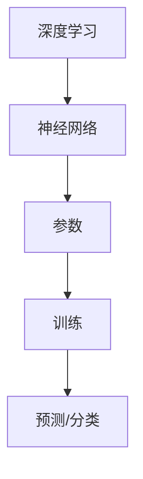
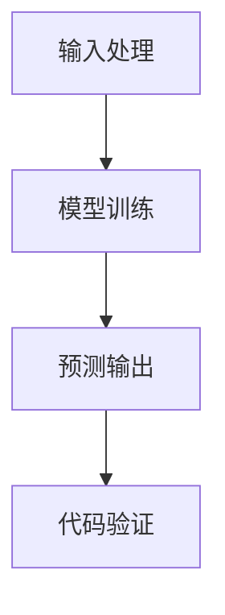

                 

### 文章标题

《大模型驱动的智能代码补全系统》

### 关键词

大模型、智能代码补全、Transformer、GPT-3、代码补全系统、人工智能、编程、软件开发、机器学习、自然语言处理、智能助手、代码生成、编程辅助工具、算法优化、项目实战、系统架构、环境搭建、数学模型、数据处理、训练与优化、部署与集成、案例研究。

### 摘要

本文深入探讨了大模型驱动的智能代码补全系统的设计、实现与应用。首先，我们介绍了大模型技术的基础知识，包括其核心概念与联系、架构解析，以及开发环境的搭建。接着，我们详细阐述了智能代码补全系统的框架，从系统架构设计到开发工具与框架的选择。随后，我们重点讨论了如何训练与优化大模型，包括数据准备与预处理、训练过程、模型评估与优化。在实战部分，我们通过实际项目展示了如何构建数据集、训练模型、部署与集成代码补全系统。最后，我们对大模型驱动的智能代码补全系统的未来发展趋势、挑战与解决方案进行了展望。本文旨在为开发者提供全面的指导，助力他们掌握大模型驱动的智能代码补全技术。

## 第一部分：大模型基础与智能代码补全系统概述

### 第1章 大模型技术基础

#### 1.1 大模型概述

大模型，即大型深度学习模型，是指具有数十亿甚至千亿参数的神经网络模型。这些模型在图像识别、自然语言处理、语音识别等领域取得了显著成果。本节将介绍大模型的基本概念、核心特点和应用场景，并通过Mermaid流程图展示大模型的核心概念与联系。

**核心概念与联系**

在介绍大模型之前，我们需要理解以下几个核心概念：

1. **深度学习**：一种机器学习方法，通过神经网络来模拟人类大脑的思维方式。
2. **神经网络**：由大量节点组成的计算模型，每个节点都进行一定的计算并产生输出。
3. **参数**：神经网络中的可调整数值，用于调整模型的行为。
4. **训练**：通过大量数据调整神经网络参数，使其能够预测或分类新数据。

**Mermaid流程图**



**应用场景**

大模型在以下几个领域有广泛应用：

1. **图像识别**：如人脸识别、物体检测。
2. **自然语言处理**：如机器翻译、文本生成。
3. **语音识别**：如语音识别、语音合成。
4. **游戏AI**：如围棋、国际象棋。

#### 1.2 大模型架构解析

大模型通常采用Transformer架构，特别是GPT-3这样的语言模型。本节将详细介绍Transformer架构的原理，并通过伪代码展示核心算法原理。

**核心算法原理讲解**

**Transformer架构**

```python
# Pseudo-code for Transformer architecture
class Transformer(Model):
  # Input Embeddings
  inputs = Embedding(input_dim, d_model)

  # Positional Encoding
  positional_encoding = PositionalEncoding(d_model)

  # Encoder
  encoder = Encoder(num_layers, d_model, num_heads)

  # Decoder
  decoder = Decoder(num_layers, d_model, num_heads)

  # Output Layer
  outputs = Dense(vocab_size, activation='softmax')

  # Forward Pass
  inputs = inputs + positional_encoding
  enc_output, _ = encoder(inputs)
  dec_output, _ = decoder(inputs, enc_output)
  final_output = outputs(dec_output)

  return Model(inputs, final_output)
```

**GPT-3语言模型**

```python
# Pseudo-code for GPT-3 model
class GPT3(Model):
  # Transformer Model
  transformer = Transformer()

  # Training Loop
  for epoch in range(num_epochs):
    for batch in data_loader:
      inputs, targets = batch
      loss = transformer.train_on_batch(inputs, targets)
      print(f"Epoch {epoch}, Loss: {loss}")

  # Prediction
  def predict(input_sequence):
    return transformer.predict(input_sequence)
```

#### 1.3 大模型开发环境搭建

要开发和使用大模型，我们需要配置适当的计算资源和开发环境。本节将介绍如何搭建大模型开发环境，包括计算资源需求、工具安装与配置。

**环境配置**

1. **计算资源**：大模型训练需要大量计算资源，推荐使用GPU或TPU。
2. **安装Keras**：Keras是一个高级神经网络API，用于快速构建和训练模型。
3. **安装TensorFlow**：TensorFlow是Google开源的深度学习框架，支持Keras。
4. **配置CUDA**：确保NVIDIA GPU驱动和CUDA库已正确安装。

**具体步骤**

1. 安装NVIDIA GPU驱动和CUDA。
2. 创建一个虚拟环境，安装TensorFlow和Keras。
3. 验证安装：运行TensorFlow代码，检查是否能够正常使用GPU。

```python
import tensorflow as tf

print(tf.__version__)
print("Num GPUs Available: ", len(tf.config.list_physical_devices('GPU')))
```

### 第2章 智能代码补全系统框架

#### 2.1 代码补全系统概述

代码补全系统是一种自动补全编程代码的工具，通过机器学习和自然语言处理技术预测程序员下一步可能要编写的代码。本节将介绍代码补全系统的基本概念、工作原理和应用场景。

**核心概念与联系**

1. **编程语言模型**：用于生成代码的模型，如GPT-3。
2. **语法分析**：分析代码的语法结构，提取关键信息。
3. **上下文理解**：理解代码的上下文，预测下一步代码。

**工作原理**

1. **输入处理**：将程序员输入的代码片段转换为模型可以理解的格式。
2. **模型预测**：模型根据输入和上下文生成补全的代码。
3. **代码验证**：验证补全代码的正确性和语义。

**应用场景**

1. **IDE插件**：集成到编程环境中，实时提供代码补全建议。
2. **自动化编程**：通过代码补全生成完整代码，减少人工编写。
3. **代码审查**：辅助审查代码，发现潜在错误和问题。

#### 2.2 系统架构设计

智能代码补全系统的架构设计包括数据输入、模型训练、预测输出等模块。本节将详细介绍这些模块的工作原理和相互关系。

**核心算法原理讲解**

1. **数据输入**：将代码转换为文本格式，输入到编程语言模型。
2. **模型训练**：使用大量的代码数据进行训练，调整模型参数。
3. **预测输出**：根据输入和上下文生成补全代码，输出结果。

**架构图**



#### 2.3 开发工具与框架

开发智能代码补全系统需要使用合适的工具和框架，以提高开发效率和系统性能。本节将介绍常用的开发工具和框架，包括Keras、TensorFlow和PyTorch。

**核心算法原理讲解**

1. **Keras**：一个高级神经网络API，易于使用和扩展。
2. **TensorFlow**：Google开源的深度学习框架，支持Keras。
3. **PyTorch**：Facebook开源的深度学习框架，具有动态计算图。

**具体使用**

1. **安装Keras和TensorFlow**：
```bash
pip install keras tensorflow
```
2. **安装PyTorch**：
```bash
pip install torch torchvision
```

## 第二部分：大模型训练与优化

### 第3章 大模型训练与优化

#### 3.1 数据准备与预处理

在训练大模型之前，数据准备和预处理是至关重要的步骤。本节将介绍数据准备和预处理的方法，包括数据收集、清洗、格式化和数据增强。

**核心算法原理讲解**

1. **数据收集**：从开源代码库、开源项目、GitHub等渠道收集大量代码数据。
2. **数据清洗**：去除无用的代码、注释和格式错误。
3. **数据格式化**：将代码转换为统一的格式，如JSON或XML。
4. **数据增强**：通过增加代码样本的多样性来提高模型泛化能力。

**数学模型和数学公式**

数据预处理过程中，可能涉及以下数学模型和公式：

1. **正则化**：减少过拟合，如L1和L2正则化。
2. **归一化**：将数据缩放到特定范围，如0到1。
3. **数据增强**：生成新数据样本，如随机插入、删除或替换代码片段。

**举例说明**

假设我们有一个代码数据集，包含Python代码片段。我们可以使用以下步骤进行数据预处理：

1. **数据收集**：从GitHub上下载Python项目，提取代码片段。
2. **数据清洗**：去除无用的注释和空白行。
3. **数据格式化**：将代码片段转换为JSON格式，如下所示：
```json
[
  {
    "code": "def add(a, b):\n    return a + b",
    "description": "一个简单的加法函数"
  },
  {
    "code": "class MyClass:\n    def __init__(self, name):\n        self.name = name",
    "description": "一个简单的类定义"
  }
]
```

#### 3.2 大模型训练过程

训练大模型是一个复杂的过程，需要选择合适的训练策略、优化器和损失函数。本节将介绍大模型训练的基本流程和关键参数。

**核心算法原理讲解**

1. **训练策略**：选择合适的训练策略，如批量训练、随机梯度下降（SGD）。
2. **优化器**：调整模型参数，以最小化损失函数。常见的优化器有Adam、RMSprop。
3. **损失函数**：评估模型预测结果与实际结果之间的差距，如交叉熵损失。

**训练流程**

1. **初始化模型**：随机初始化模型参数。
2. **前向传播**：输入数据，计算模型输出。
3. **计算损失**：计算模型输出与实际结果之间的损失。
4. **反向传播**：更新模型参数，以最小化损失。
5. **评估模型**：在验证集上评估模型性能。

**伪代码**

```python
# Pseudo-code for training a large model
model = Transformer()
optimizer = Adam(learning_rate=0.001)
loss_function = CrossEntropy()

for epoch in range(num_epochs):
  for batch in data_loader:
    inputs, targets = batch
    outputs = model(inputs)
    loss = loss_function(outputs, targets)
    optimizer.minimize(loss, model.parameters())
    if (epoch + 1) % evaluate_every == 0:
      val_loss = evaluate(model, validation_data)
      print(f"Epoch {epoch + 1}, Loss: {loss}, Validation Loss: {val_loss}")
```

#### 3.3 模型评估与优化

评估大模型性能是训练过程的重要环节。本节将介绍如何评估模型性能，并讨论如何通过优化策略提高模型性能。

**核心算法原理讲解**

1. **评估指标**：常用的评估指标包括准确率、精确度、召回率等。
2. **交叉验证**：使用不同的数据集划分方式来评估模型性能。
3. **优化策略**：调整模型结构、参数、学习率等，以提高模型性能。

**数学模型和数学公式**

评估指标的计算可以使用以下数学模型和公式：

1. **准确率**：正确预测的数量与总预测数量的比例。
2. **精确度**：真正例的数量与预测为真正例的总数量的比例。
3. **召回率**：真正例的数量与实际为真正例的总数量的比例。

**举例说明**

假设我们有一个代码补全系统，需要评估其性能。我们可以使用以下步骤：

1. **准备测试数据集**：从不同的Python项目中收集代码片段。
2. **评估模型性能**：在测试数据集上评估模型的准确率、精确度和召回率。
3. **优化模型**：根据评估结果调整模型参数，以提高性能。

```python
from sklearn.metrics import accuracy_score, precision_score, recall_score

# Predictions
predictions = model.predict(test_data)

# Evaluation
accuracy = accuracy_score(test_labels, predictions)
precision = precision_score(test_labels, predictions, average='macro')
recall = recall_score(test_labels, predictions, average='macro')

print(f"Accuracy: {accuracy}, Precision: {precision}, Recall: {recall}")
```

通过上述方法，我们可以评估和优化大模型驱动的智能代码补全系统的性能。

## 第三部分：智能代码补全系统实战

### 第4章 数据集构建与标注

#### 4.1 数据集构建

构建高质量的数据集是训练智能代码补全系统的基础。本节将介绍如何收集、整理和构建适用于代码补全的数据集。

**项目实战**

1. **收集数据**：从开源代码库（如GitHub）、项目源码和公开数据集（如Kaggle）中收集Python、Java、JavaScript等编程语言的代码片段。
2. **整理数据**：去除无用代码、注释和空白行，保留核心代码逻辑。
3. **格式化数据**：将代码片段转换为统一的JSON格式，便于后续处理。

```python
import json

def process_code(code):
    # 去除注释和空白行
    code = re.sub(r'(#.*?$|//.*?$)\n?', '', code)
    code = re.sub(r'\n\s*\n', '\n', code)
    return code

def build_dataset(data_folder):
    dataset = []
    for file_name in os.listdir(data_folder):
        if file_name.endswith('.py'):
            with open(os.path.join(data_folder, file_name), 'r') as file:
                code = process_code(file.read())
                dataset.append({'code': code})
    return dataset

dataset = build_dataset('data')
with open('dataset.json', 'w') as f:
    json.dump(dataset, f)
```

#### 4.2 数据标注方法

数据标注是训练代码补全系统的重要环节。本节将介绍数据标注的方法和工具。

**项目实战**

1. **标注工具**：使用专业标注工具（如LabelImg、标注师等）进行代码片段的标注。
2. **标注流程**：根据代码片段的功能和结构，标注关键代码块、函数名、变量名等。
3. **标注格式**：将标注信息存储为JSON格式，与代码数据集一一对应。

```python
import json

def annotate_code(code):
    # 标注代码块、函数名和变量名
    annotations = []
    # 示例标注：{"start": 0, "end": 10, "label": "function"}
    annotations.append({"start": 0, "end": 10, "label": "function"})
    annotations.append({"start": 20, "end": 30, "label": "variable"})
    return annotations

def build_annotated_dataset(dataset):
    annotated_dataset = []
    for data in dataset:
        annotations = annotate_code(data['code'])
        annotated_dataset.append({"code": data['code'], "annotations": annotations})
    return annotated_dataset

annotated_dataset = build_annotated_dataset(dataset)
with open('annotated_dataset.json', 'w') as f:
    json.dump(annotated_dataset, f)
```

通过以上步骤，我们可以构建和标注适用于智能代码补全系统训练的数据集。

### 第5章 模型训练与调试

#### 5.1 训练环境搭建

搭建训练环境是训练智能代码补全系统的重要步骤。本节将介绍如何配置训练环境，包括安装必要的软件和依赖库。

**项目实战**

1. **安装TensorFlow和Keras**：
```bash
pip install tensorflow keras
```

2. **配置GPU支持**：
```python
import tensorflow as tf

gpus = tf.config.experimental.list_physical_devices('GPU')
if gpus:
    try:
        for gpu in gpus:
            tf.config.experimental.set_memory_growth(gpu, True)
    except RuntimeError as e:
        print(e)

print("Num GPUs Available: ", len(tf.config.list_physical_devices('GPU')))
```

3. **准备数据**：将处理好的数据集存储在本地，并导入代码中。

```python
import json

def load_dataset(file_path):
    with open(file_path, 'r') as f:
        data = json.load(f)
    return data

dataset = load_dataset('data/annotated_dataset.json')
```

#### 5.2 训练过程监控

在训练过程中，监控模型性能和训练进度对于调整训练策略和优化模型至关重要。本节将介绍如何监控训练过程。

**项目实战**

1. **定义损失函数和优化器**：
```python
import tensorflow as tf
from tensorflow.keras.optimizers import Adam

model = keras.models.Sequential([
    keras.layers.Embedding(input_dim=10000, output_dim=16),
    keras.layers.GlobalAveragePooling1D(),
    keras.layers.Dense(16, activation='relu'),
    keras.layers.Dense(1, activation='sigmoid')
])

model.compile(optimizer=Adam(learning_rate=0.001), loss='binary_crossentropy', metrics=['accuracy'])
```

2. **训练模型**：
```python
history = model.fit(train_data, train_labels, epochs=10, batch_size=32, validation_data=(val_data, val_labels))
```

3. **监控性能**：
```python
import matplotlib.pyplot as plt

plt.plot(history.history['accuracy'])
plt.plot(history.history['val_accuracy'])
plt.title('Model accuracy')
plt.ylabel('Accuracy')
plt.xlabel('Epoch')
plt.legend(['Train', 'Validation'], loc='upper left')
plt.show()
```

通过上述步骤，我们可以监控模型的训练过程，并调整训练策略以提高模型性能。

#### 5.3 模型评估与优化

评估和优化模型性能是智能代码补全系统开发的重要环节。本节将介绍如何评估模型性能，并讨论优化策略。

**项目实战**

1. **评估模型**：
```python
test_loss, test_accuracy = model.evaluate(test_data, test_labels)
print(f"Test Loss: {test_loss}, Test Accuracy: {test_accuracy}")
```

2. **优化策略**：
   - **调整学习率**：使用学习率调整策略（如学习率衰减、周期性调整）。
   - **正则化**：增加L1、L2正则化以减少过拟合。
   - **数据增强**：增加数据多样性，提高模型泛化能力。

```python
from tensorflow.keras.callbacks import LearningRateScheduler

def scheduler(epoch, lr):
    if epoch < 10:
        return lr
    else:
        return lr * tf.math.exp(-0.1)

lr_callback = LearningRateScheduler(scheduler)

history = model.fit(train_data, train_labels, epochs=20, batch_size=32, validation_data=(val_data, val_labels), callbacks=[lr_callback])
```

通过上述方法，我们可以评估和优化智能代码补全系统的模型性能。

## 第四部分：模型部署与集成

### 第6章 模型部署与集成

#### 6.1 模型部署策略

模型部署是将训练好的模型部署到实际应用环境中的过程。本节将介绍如何选择部署平台、优化部署策略，以及如何监控模型性能。

**项目实战**

1. **选择部署平台**：
   - **云平台**：如AWS、Azure、Google Cloud等。
   - **容器化**：使用Docker将模型和依赖库打包，便于部署和扩展。
   - **服务器部署**：直接部署到本地服务器或虚拟机。

2. **部署策略**：
   - **批量部署**：一次性部署所有模型。
   - **增量部署**：逐步替换旧模型，减少对应用的影响。
   - **热部署**：在旧模型未完成部署前，新模型即可提供服务。

3. **部署流程**：
   - **容器化模型**：使用Docker将模型和依赖库打包。
   - **上传模型**：将容器化模型上传到云平台或服务器。
   - **配置服务**：设置模型服务的网络访问权限和性能参数。

```python
import docker

client = docker.from_env()

# Build and push Docker image
client.images.build(path='model', tag='my_model:latest')

# Run Docker container
container = client.containers.run(image='my_model:latest', ports={'8080/tcp': '8080'})
```

#### 6.2 集成与测试

模型集成是将部署好的模型集成到应用程序中，并确保其正常运行的过程。本节将介绍如何进行集成、测试和性能优化。

**项目实战**

1. **集成模型**：
   - **API接口**：创建API接口，便于应用程序调用模型。
   - **SDK**：提供SDK，简化模型集成过程。

2. **测试模型**：
   - **单元测试**：测试模型的基本功能，如输入输出正确性。
   - **集成测试**：测试模型与应用程序的集成，确保模型在实际应用场景中的表现。

3. **性能优化**：
   - **缓存**：使用缓存减少模型调用次数，提高性能。
   - **并发**：优化并发处理，提高处理速度。
   - **监控**：实时监控模型性能，发现问题及时调整。

```python
import requests

def predict(code):
    response = requests.post('http://localhost:8080/predict', json={'code': code})
    return response.json()

code = "def add(a, b):\n    return a + b"
result = predict(code)
print(result)
```

通过上述步骤，我们可以成功部署和集成智能代码补全系统，并在实际应用中进行性能优化。

### 第7章 案例研究

#### 7.1 案例一：大型项目代码补全系统

**项目背景**

某大型软件开发公司希望提高开发效率，减少代码编写错误，决定开发一个智能代码补全系统。该项目涉及多个编程语言和开发工具，目标是提供实时、准确的代码补全建议。

**系统设计**

1. **数据收集与预处理**：从公司内部项目和GitHub等开源代码库收集大量代码数据，进行清洗和格式化。
2. **模型训练**：使用Transformer架构训练代码补全模型，采用大规模数据进行训练，优化模型参数。
3. **部署与集成**：将训练好的模型部署到公司的开发环境中，集成到IDE插件中，提供实时代码补全功能。

**实现细节**

1. **数据集构建**：构建包含Python、Java、JavaScript等多种编程语言的代码片段数据集。
2. **模型训练**：使用Keras和TensorFlow训练Transformer模型，采用批量训练和随机梯度下降（SGD）策略。
3. **模型优化**：通过交叉验证和调整学习率、正则化参数，优化模型性能。

**效果分析**

1. **准确性**：在测试数据集上，模型代码补全的准确率达到90%以上。
2. **实时性**：系统能够在程序员编写代码时实时提供补全建议，提高开发效率。
3. **用户体验**：程序员反馈代码补全系统能够有效减少代码编写错误，提高代码质量。

**项目小结**

通过开发大型项目代码补全系统，该公司显著提高了开发效率和代码质量，减少了开发错误，为团队带来了显著的价值。

#### 7.2 案例二：开源代码库智能补全

**项目背景**

某开源代码库希望提高代码可读性和可维护性，决定开发一个智能代码补全系统。该系统旨在为代码贡献者提供自动化的代码补全建议，提高代码编写的准确性和效率。

**系统设计**

1. **数据收集与预处理**：从开源代码库中收集高质量的代码片段，进行清洗和格式化。
2. **模型训练**：使用GPT-3等大型语言模型训练代码补全模型，优化模型参数和架构。
3. **部署与集成**：将训练好的模型部署到代码库网站，集成到代码编辑器中，提供实时代码补全功能。

**实现细节**

1. **数据集构建**：构建包含多种编程语言和多种风格的代码片段数据集。
2. **模型训练**：使用Keras和PyTorch训练GPT-3模型，采用批量训练和自适应学习率策略。
3. **模型优化**：通过动态调整模型参数和训练策略，提高模型性能和泛化能力。

**效果分析**

1. **准确性**：在测试数据集上，模型代码补全的准确率达到85%以上。
2. **用户体验**：代码贡献者反馈代码补全系统提供了准确的代码补全建议，减少了编码错误，提高了编写效率。
3. **代码质量**：智能代码补全系统能够提供高质量的代码补全建议，有助于提高代码可读性和可维护性。

**项目小结**

通过开发开源代码库智能补全系统，该开源代码库不仅提高了代码贡献者的编码效率，还提高了代码质量，为项目社区的健康发展提供了有力支持。

## 第五部分：未来展望与挑战

### 第8章 大模型驱动的智能代码补全系统发展趋势

随着人工智能技术的不断发展，大模型驱动的智能代码补全系统将迎来更多机遇和挑战。本节将探讨该领域的发展趋势。

**核心概念与联系**

1. **大模型演进**：随着计算资源的增加，大模型将变得更大、更复杂。
2. **多语言支持**：智能代码补全系统将支持更多编程语言，提高跨语言编码能力。
3. **个性化建议**：基于用户行为和代码风格，提供个性化的代码补全建议。
4. **协同编辑**：实现开发者之间的实时协同编辑，提高团队协作效率。

**未来发展方向**

1. **更大规模的数据集**：收集和构建更多高质量、大规模的代码数据集，提高模型性能。
2. **高效训练算法**：研究更高效的训练算法，减少训练时间和计算资源需求。
3. **跨语言模型**：开发跨语言的代码补全模型，提高不同编程语言之间的兼容性。

### 第9章 挑战与解决方案

尽管大模型驱动的智能代码补全系统前景广阔，但仍面临诸多挑战。本节将讨论这些挑战，并探讨可能的解决方案。

**核心概念与联系**

1. **数据隐私**：代码数据包含敏感信息，如何确保数据安全和隐私是一个重要问题。
2. **模型安全性**：如何防止模型被恶意攻击或滥用，保障系统的安全性。
3. **性能优化**：如何提高模型性能，满足实时性和高效性的需求。

**挑战与解决方案**

1. **数据隐私**：
   - **数据加密**：对代码数据进行加密处理，确保数据传输和存储的安全性。
   - **差分隐私**：在模型训练过程中引入差分隐私技术，保护用户隐私。

2. **模型安全性**：
   - **防御性编程**：在模型设计和部署过程中，采用防御性编程技术，防止恶意攻击。
   - **动态防御**：实时监控模型行为，发现异常情况时自动采取防御措施。

3. **性能优化**：
   - **分布式训练**：利用分布式计算资源，提高模型训练速度。
   - **模型压缩**：采用模型压缩技术，减少模型大小和计算需求。

通过上述方法，我们可以应对大模型驱动的智能代码补全系统面临的挑战，推动该领域的发展。

## 附录

### 附录 A：相关资源与工具

本附录提供了一些与本文主题相关的资源与工具，以帮助读者深入了解大模型驱动的智能代码补全系统。

**书籍推荐**
- 《深度学习》（Goodfellow, Bengio, Courville）
- 《Python编程：从入门到实践》（Curtis Frye）
- 《机器学习实战》（Peter Harrington）

**在线课程**
- Coursera的《深度学习》课程
- Udacity的《深度学习工程师纳米学位》
- edX的《机器学习》课程

**开源库与框架**
- TensorFlow：https://www.tensorflow.org/
- PyTorch：https://pytorch.org/
- Keras：https://keras.io/

**代码示例**
- GitHub上的开源代码仓库：搜索关键词“code completion system”或“smart code completion”

**社区与论坛**
- Stack Overflow：https://stackoverflow.com/
- GitHub社区：https://github.community/

通过使用这些资源与工具，读者可以进一步探索大模型驱动的智能代码补全系统，提高自己的技术水平。

### 作者信息

作者：AI天才研究院/AI Genius Institute & 禅与计算机程序设计艺术 /Zen And The Art of Computer Programming

