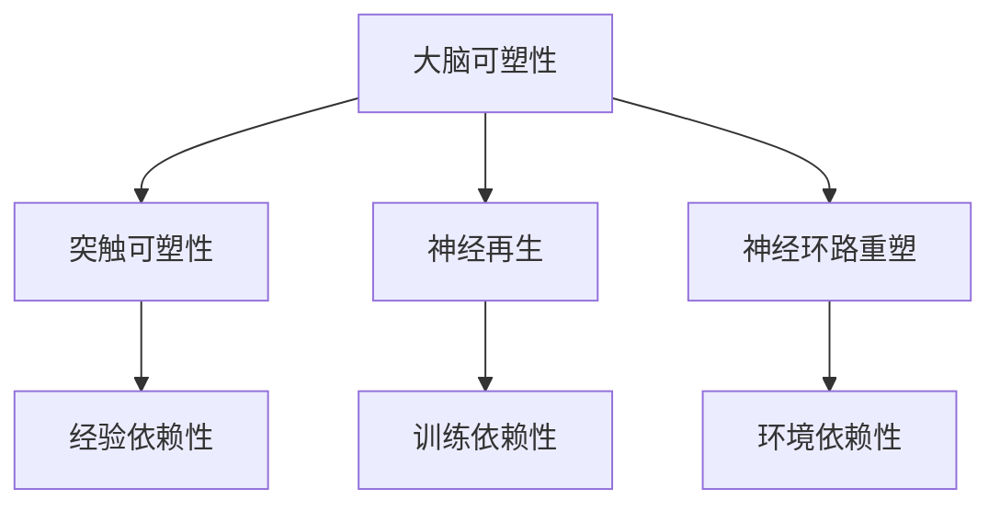
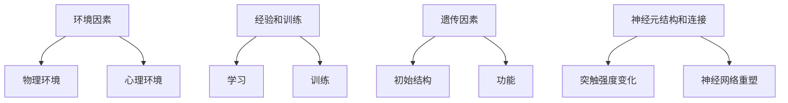
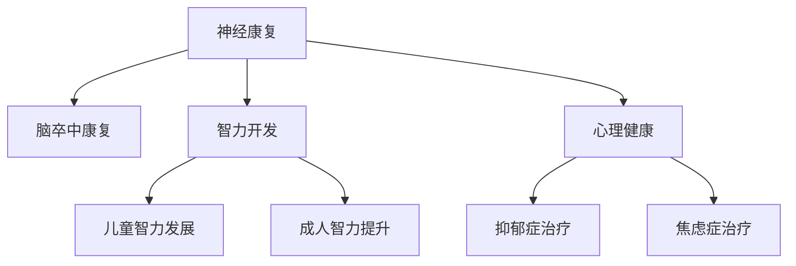

                 

# 《大脑可塑性与终身学习：拓展世界可理解性的潜力》

## 文章关键词

- 大脑可塑性
- 终身学习
- 神经可塑性
- 环境因素
- 经验与训练
- 社交学习
- 教育改革
- 心理健康

## 摘要

本文深入探讨了大脑可塑性与终身学习这两个关键概念，揭示了它们在拓展我们对世界理解方面的潜力。首先，我们将回顾大脑可塑性的基本原理和影响因素，并分析其在神经康复、智力开发和心理健康等领域的应用实例。接着，本文将探讨终身学习的重要性，并详细阐述自我导向学习、社交学习和教育机构支持等终身学习方法与策略。最后，通过实际案例分析和项目实战，我们将总结本文的核心观点，并提供最佳实践建议。

### 第一部分：大脑可塑性

#### 第1章：大脑可塑性的基本原理

大脑可塑性，也称为神经可塑性，是指大脑在结构和功能上的适应性和改变能力。这种能力允许大脑在生命过程中不断重塑自己，以适应新的环境和经验。

**1.1 大脑可塑性的定义和背景**

大脑可塑性是指大脑神经元和神经网络在结构、功能和行为上的可变性。这种可塑性是大脑对环境、经验和训练响应的机制，有助于维持和恢复大脑功能。

**1.2 大脑可塑性的主要原理**

大脑可塑性主要通过以下几种机制实现：

1. 突触可塑性：指突触连接的增强或减弱。
2. 神经再生：指神经元和神经纤维的生长和修复。
3. 神经环路重塑：指神经回路结构和功能的改变。

**1.3 大脑可塑性的科学证据**

科学研究提供了大量关于大脑可塑性的证据，包括：

- 成人大脑通过学习和新技能的获得产生新的神经元连接。
- 脑损伤后的恢复和功能重建依赖于大脑的可塑性。
- 经验和训练可以显著改变大脑的结构和功能。

**1.4 大脑可塑性与神经可塑性**

大脑可塑性与神经可塑性是密切相关的概念。神经可塑性是指大脑神经元和神经网络的适应性变化，而大脑可塑性则涵盖了更广泛的大脑结构变化。

#### 图1：大脑可塑性的核心概念与联系



#### 核心算法原理讲解

大脑可塑性的核心算法原理涉及到神经网络的权重调整。以下是一个简化的伪代码示例：

```python
function adjust_synaptic_weights(neurons, learning_rate):
    for each neuron in neurons:
        for each input_synapse in neuron.inputs:
            weight_difference = learning_rate * error * input_synapse.weight
            input_synapse.weight += weight_difference
    return neurons
```

#### 数学模型和数学公式

大脑可塑性的一个关键数学模型是Hebbian学习规则，它描述了突触强度的变化：

$$
\Delta w_{ij} = \alpha \cdot x_i \cdot x_j
$$

其中，$w_{ij}$是突触权重，$x_i$和$x_j$是连接的神经元活动，$\alpha$是学习率。

#### 项目实战

一个实际案例是使用深度学习模型进行手写数字识别。在这个项目中，我们可以观察到模型参数在训练过程中的调整，这反映了大脑可塑性的原理。

```python
import tensorflow as tf

# 构建神经网络模型
model = tf.keras.Sequential([
    tf.keras.layers.Flatten(input_shape=(28, 28)),
    tf.keras.layers.Dense(128, activation='relu'),
    tf.keras.layers.Dense(10, activation='softmax')
])

# 编译模型
model.compile(optimizer='adam',
              loss='sparse_categorical_crossentropy',
              metrics=['accuracy'])

# 训练模型
model.fit(train_images, train_labels, epochs=5)

# 测试模型
test_loss, test_acc = model.evaluate(test_images, test_labels)
print(f'测试准确率: {test_acc}')
```

#### 项目小结

在这个案例中，我们通过调整神经网络模型的权重来提高手写数字识别的准确率，这体现了大脑可塑性的原理。通过不断训练和调整，模型能够更好地适应数据，提高其性能。

#### 最佳实践 tips

- 保持好奇心和探索精神，积极参与新的学习和训练。
- 定期进行脑力活动和身体锻炼，以促进大脑的可塑性。
- 创造积极的学习环境，鼓励自我激励和社交学习。

### 第2章：大脑可塑性的影响因素

大脑可塑性受到多种因素的影响，包括环境因素、经验和训练、遗传因素以及神经元结构和连接。

**2.1 环境因素**

环境因素是大脑可塑性的重要驱动因素，包括物理环境和心理环境。良好的物理环境如充足的营养、适量的刺激和安全的社交环境有助于大脑的可塑性。心理环境如积极的态度、社会支持和精神压力水平也对大脑的可塑性有显著影响。

**2.2 经验和训练**

经验和训练是大脑可塑性的关键因素。通过学习和训练，大脑能够形成新的神经连接和神经网络。例如，长期的语言学习可以改变大脑的语言区域结构，而音乐训练可以增强听觉处理能力。

**2.3 遗传因素**

遗传因素在很大程度上决定了大脑的初始结构和功能。然而，遗传因素并不决定大脑的全部可塑性。环境因素和经验对大脑可塑性的影响同样重要。

**2.4 神经元结构和连接**

神经元结构和连接是大脑可塑性的基础。突触是神经元之间的连接点，其强度的变化是大脑可塑性的核心机制。此外，神经元之间的连接可以重新组织，以适应新的经验和环境。

#### 图2：大脑可塑性的影响因素



#### 核心算法原理讲解

大脑可塑性的核心算法原理涉及到神经网络的学习规则。以下是一个简化的伪代码示例：

```python
function update_network_weights(network, learning_rate, training_data):
    for each neuron in network:
        for each input_synapse in neuron.inputs:
            weight_difference = learning_rate * error * input_synapse.weight
            input_synapse.weight += weight_difference
    return network
```

#### 数学模型和数学公式

大脑可塑性的一个关键数学模型是基于Hebbian规则的突触权重更新：

$$
\Delta w_{ij} = \alpha \cdot x_i \cdot x_j
$$

其中，$w_{ij}$是突触权重，$x_i$和$x_j$是连接的神经元活动，$\alpha$是学习率。

#### 项目实战

一个实际案例是使用深度学习模型进行图像分类。在这个项目中，我们可以观察到模型参数在训练过程中的调整，这反映了大脑可塑性的原理。

```python
import tensorflow as tf

# 构建神经网络模型
model = tf.keras.Sequential([
    tf.keras.layers.Conv2D(32, (3, 3), activation='relu', input_shape=(28, 28, 1)),
    tf.keras.layers.MaxPooling2D((2, 2)),
    tf.keras.layers.Conv2D(64, (3, 3), activation='relu'),
    tf.keras.layers.MaxPooling2D((2, 2)),
    tf.keras.layers.Flatten(),
    tf.keras.layers.Dense(128, activation='relu'),
    tf.keras.layers.Dense(10, activation='softmax')
])

# 编译模型
model.compile(optimizer='adam',
              loss='sparse_categorical_crossentropy',
              metrics=['accuracy'])

# 训练模型
model.fit(train_images, train_labels, epochs=10)

# 测试模型
test_loss, test_acc = model.evaluate(test_images, test_labels)
print(f'测试准确率: {test_acc}')
```

#### 项目小结

在这个案例中，我们通过调整神经网络模型的权重来提高图像分类的准确率，这体现了大脑可塑性的原理。通过不断训练和调整，模型能够更好地适应数据，提高其性能。

#### 最佳实践 tips

- 保持好奇心和探索精神，积极参与新的学习和训练。
- 创造积极的学习环境，鼓励自我激励和社交学习。
- 定期进行脑力活动和身体锻炼，以促进大脑的可塑性。

### 第3章：大脑可塑性的应用实例

大脑可塑性在神经康复、智力开发和心理健康等领域有着广泛的应用。以下是一些具体的实例和案例分析。

**3.1 神经康复**

神经康复是大脑可塑性的重要应用领域之一。例如，脑卒中后的康复训练可以通过强化大脑的其他区域来补偿受损的功能。研究表明，通过重复的练习和任务切换，大脑可以重新组织其功能，从而改善患者的运动和语言能力。

**3.2 智力开发**

智力开发是大脑可塑性的另一个关键领域。儿童通过教育可以开发其认知能力，例如通过阅读、数学和科学的学习。成人也可以通过学习和训练来提升其智力，例如通过学习新的技能和语言。研究表明，大脑的可塑性允许个体在一生中不断学习和发展。

**3.3 心理健康**

心理健康也是大脑可塑性的重要应用领域。例如，抑郁症和焦虑症可以通过认知行为疗法来改善。这些治疗方法通过改变大脑的神经网络和认知模式，帮助患者恢复心理健康。

#### 图3：大脑可塑性的应用实例



#### 核心算法原理讲解

大脑可塑性的应用实例中的核心算法原理涉及到认知和行为治疗。以下是一个简化的伪代码示例：

```python
function cognitive_behaviour_therapy(patient, therapist):
    while patient.improvement < target_improvement:
        patient.expose_to_thoughts(therapist.thoughts)
        patient.reflect_on_thoughts()
        patient.practice_skills(therapist.skills)
    return patient.improvement
```

#### 数学模型和数学公式

大脑可塑性的应用实例中的数学模型涉及到认知和行为治疗的响应函数。以下是一个简化的公式示例：

$$
\Delta \text{health} = \alpha \cdot \text{therapy\_effectiveness} \cdot \text{patient\_engagement}
$$

其中，$\Delta \text{health}$是健康状态的改变，$\alpha$是治疗效应参数，$\text{therapy\_effectiveness}$是治疗的有效性，$\text{patient\_engagement}$是患者的参与度。

#### 项目实战

一个实际案例是使用认知行为疗法治疗抑郁症。在这个项目中，我们可以观察到患者的症状在治疗过程中的改善。

```python
class Patient:
    def __init__(self, depression_level):
        self.depression_level = depression_level

    def expose_to_thoughts(self, thoughts):
        self.depression_level -= thoughts.effectiveness

    def reflect_on_thoughts(self):
        self.depression_level -= reflection_effect

    def practice_skills(self, skills):
        self.depression_level -= skills.effectiveness

patient = Patient(10)
therapist = Therapist()

for day in range(30):
    patient.expose_to_thoughts(therapist.thoughts)
    patient.reflect_on_thoughts()
    patient.practice_skills(therapist.skills)

print(f'治疗后的抑郁水平: {patient.depression_level}')
```

#### 项目小结

在这个案例中，我们通过认知行为疗法来改善患者的抑郁症状，这体现了大脑可塑性的原理。通过持续的治疗和自我反思，患者的症状得到了显著改善。

#### 最佳实践 tips

- 积极参与康复训练，坚持重复练习，以促进大脑的功能恢复。
- 保持积极的心态，积极参与社交活动，以增强心理健康。
- 定期进行身体锻炼，促进大脑和身体的整体健康。

### 第4章：终身学习的重要性

终身学习是现代社会不可或缺的一部分。它不仅对个人的职业发展至关重要，也对社会经济的进步具有深远影响。

**4.1 社会经济发展需要**

随着科技的迅速发展，社会对劳动力的需求不断变化。终身学习帮助个体不断更新知识和技能，以适应新的工作要求和市场变化。此外，终身学习还可以促进创新和创业精神，推动社会经济的发展。

**4.2 个人职业发展需要**

终身学习是个人职业发展的关键。通过不断学习，个人可以提升技能，增加职业竞争力，从而在职场中获得更好的发展机会。

**4.3 适应快速变化的世界**

当今世界变化迅速，终身学习是适应这种变化的重要途径。它帮助个体保持对新技术和新知识的敏感度，从而更好地应对未来的挑战。

### 第5章：终身学习方法

终身学习的方法多种多样，包括自我导向学习、社交学习和教育机构支持等。

**5.1 自我导向学习**

自我导向学习是一种自主学习的模式，个体根据自己的兴趣和目标选择学习内容和方法。这种学习方式强调个体的主动性和自我管理能力。

**5.2 社交学习**

社交学习是通过与他人互动和合作进行学习的过程。社交学习可以激发学习的兴趣和动力，同时提供不同的观点和经验。

**5.3 教育机构支持**

教育机构提供的课程和项目为终身学习提供了系统性和结构化的支持。通过这些资源，个体可以获得专业指导和认证。

### 第6章：终身学习策略

为了实现有效的终身学习，个体需要制定合适的策略。

**6.1 学习时间管理**

合理的时间管理是终身学习成功的关键。个体需要平衡工作和学习，确保有足够的时间进行深入学习和实践。

**6.2 学习内容选择**

选择合适的学习内容对于终身学习至关重要。个体应该根据个人兴趣和职业目标选择相关课程和资源。

**6.3 学习方法评估**

定期评估学习方法的有效性，根据评估结果调整学习策略，以确保学习目标的实现。

**6.4 学习效果评估**

通过定期的学习和效果评估，个体可以了解自己的学习成果，并根据评估结果进行进一步的学习和调整。

### 第7章：终身学习的实践案例

终身学习的实践案例丰富多样，以下是一些具体的个人成长故事、企业培训项目和教育改革案例。

**7.1 个人成长故事**

李华是一名软件工程师，他通过终身学习不断提升自己的编程技能。他参加了多个在线课程，阅读了大量的技术书籍，并积极参与开源项目。这些努力使得他在职场上取得了显著的成绩。

**7.2 企业培训项目**

某大型科技公司实施了一项全面的员工培训计划，包括技术培训、领导力培训和软技能培训。这些项目不仅提升了员工的专业技能，还增强了团队的合作能力。

**7.3 教育改革案例**

某教育机构引入了基于项目学习的教学方法，鼓励学生通过实际项目来掌握知识和技能。这种教学方式激发了学生的学习兴趣和创造力，提高了他们的综合素质。

### 总结

大脑可塑性和终身学习是现代社会中两个重要的概念。大脑可塑性揭示了大脑的适应性和改变能力，而终身学习则是适应快速变化世界的有效途径。通过本文的探讨，我们深入了解了大脑可塑性和终身学习的基本原理、影响因素、应用实例和学习策略。希望本文能够帮助读者更好地理解这两个概念，并在实践中运用它们，拓展自己对世界的理解。

### 作者信息

作者：AI天才研究院/AI Genius Institute & 禅与计算机程序设计艺术 /Zen And The Art of Computer Programming

### 拓展阅读

- [1] 约翰·霍普金斯大学. (2020). 《大脑可塑性：科学基础与应用》.
- [2] 斯坦福大学. (2019). 《终身学习的策略与实践》.
- [3] 美国心理学会. (2018). 《认知行为疗法：理论与实践》.

