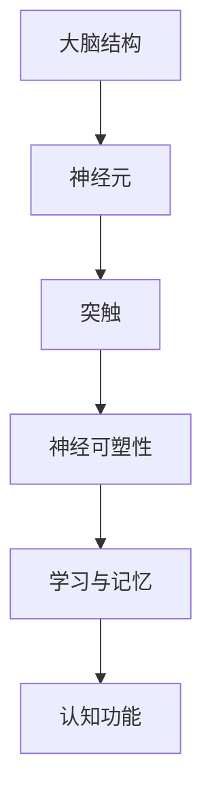

                 

### 文章标题

# 《大脑可塑性与认知训练：提升个体世界理解能力》

> 关键词：大脑可塑性、认知训练、世界理解能力、神经可塑性、认知功能、认知训练方法

> 摘要：本文探讨了大脑可塑性的基本概念及其与认知训练的紧密联系，详细分析了如何通过认知训练提升个体的世界理解能力。文章结构紧凑，逻辑清晰，旨在为认知科学家、教育工作者和希望提高认知能力的读者提供有价值的知识。

### 引言

#### 1.1 书籍的目的与重要性

随着科技的飞速发展，人类对大脑认知机制的研究取得了显著的进展。大脑可塑性这一概念引起了广泛的关注。大脑可塑性指的是大脑在生命过程中的结构、功能和连接不断变化的特性，它为我们理解如何通过认知训练来提升个体的世界理解能力提供了新的视角。

本书记录了对大脑可塑性以及认知训练的最新研究成果，旨在帮助读者了解这一领域的基础知识和前沿进展。本书的重要性在于，它不仅为专业人士提供了理论基础，也为广大读者提供了实用的认知训练方法，帮助他们更好地适应复杂多变的社会环境。

#### 1.2 大脑可塑性的基本概念

大脑可塑性是指大脑在受到外界刺激或内部需求时，其结构、功能和连接方式发生变化的能力。这种变化可以发生在神经元的形态、突触的强度以及神经网络的组织结构等多个层面。大脑可塑性使得大脑能够适应环境变化，从而提高个体的认知能力。

大脑可塑性主要分为以下几种类型：

1. **结构可塑性**：包括神经元的生长、死亡和迁移等过程。
2. **功能可塑性**：涉及神经元活动模式的改变，如突触的加强或减弱。
3. **连接可塑性**：神经网络的重新组织和连接方式的改变。

理解大脑可塑性对于提升个体的世界理解能力至关重要，因为它揭示了大脑是如何通过学习和经验来改变自身的结构和功能的。

### 大脑可塑性原理

#### 2.1 大脑可塑性的科学基础

大脑可塑性的科学基础源于对神经元和突触的研究。神经元是大脑的基本单元，通过突触与其他神经元连接。突触的强度决定了神经元之间的通信效率。当神经元之间频繁传递信号时，突触会加强，从而提高通信效率。反之，不活跃的突触会减弱，甚至消失。

大脑可塑性的核心机制包括：

1. **突触可塑性**：突触的加强或减弱是大脑可塑性的基础。
2. **神经再生**：神经元可以再生和修复，以适应新的刺激。
3. **神经网络重构**：神经网络可以重新组织和优化，以适应新的认知需求。

这些机制共同作用，使得大脑能够适应不同的环境和任务需求。

#### 2.2 大脑可塑性的类型与机制

大脑可塑性主要分为结构可塑性、功能可塑性和连接可塑性三种类型。

1. **结构可塑性**：神经元形态的改变，如神经元的生长、死亡和迁移等。
    - **神经再生**：损伤的神经元可以再生，恢复其功能。
    - **突触修剪**：不活跃的突触会被修剪，以优化神经网络。

2. **功能可塑性**：神经元活动模式的改变，如突触的加强或减弱。
    - **长期增强**（LTP）：神经元之间的信号传递增强，提高通信效率。
    - **长期减弱**（LTD）：神经元之间的信号传递减弱，降低通信效率。

3. **连接可塑性**：神经网络的组织结构改变。
    - **突触重组**：神经网络中的突触连接方式改变，以适应新的任务需求。
    - **神经环路重构**：神经环路的结构和功能改变，以优化认知功能。

这些类型和机制共同作用，使得大脑能够在不同环境和任务下保持高度的适应性和灵活性。

### 认知训练的概念与分类

#### 3.1 认知训练的定义与目标

认知训练是一种有目的、系统性的方法，旨在提高个体的认知能力。它通过特定的训练任务，促进大脑可塑性的发挥，从而改善认知功能。

认知训练的主要目标包括：

1. **提高记忆能力**：增强记忆的存储、提取和保持能力。
2. **提升注意力**：改善注意力的集中和分配能力。
3. **增强执行功能**：提高计划、决策和问题解决能力。
4. **增强学习能力**：提高学习效率，促进新知识和技能的掌握。

#### 3.2 认知训练的主要类型

认知训练主要分为以下几种类型：

1. **记忆训练**：通过特定的记忆任务，如回忆数字序列、图片分类等，提高记忆能力。
2. **注意力训练**：通过专注于特定目标、过滤干扰信息等任务，提高注意力水平。
3. **执行功能训练**：通过复杂的任务设计，如规划、决策、问题解决等，提高执行功能。
4. **多任务训练**：同时进行多个认知任务，如同时记忆和注意力任务，提高大脑的协调能力。

这些类型的认知训练相互关联，共同作用，以实现提升认知能力的最终目标。

### 大脑可塑性与认知训练的联系

#### 4.1 大脑可塑性在认知训练中的作用

大脑可塑性在认知训练中发挥着关键作用。认知训练通过特定的任务设计，激活大脑的可塑性机制，从而改善认知功能。

1. **记忆训练**：通过反复的记忆任务，增强突触连接，提高记忆能力。
2. **注意力训练**：通过专注于特定目标，加强相关神经元的信号传递，提高注意力水平。
3. **执行功能训练**：通过复杂的任务设计，促进大脑神经网络的重构，提高执行功能。
4. **多任务训练**：通过同时进行多个认知任务，增强大脑的协调能力，提高认知效率。

#### 4.2 认知训练如何促进大脑可塑性

认知训练通过以下方式促进大脑可塑性：

1. **神经再生长**：认知训练可以激活神经元的生长和再生，从而增强神经网络的适应性。
2. **突触修剪**：认知训练可以促进不活跃突触的修剪，优化神经网络的效率。
3. **神经网络重构**：认知训练可以促进神经网络的组织和优化，提高认知功能的灵活性。

这些机制共同作用，使得认知训练能够有效提升个体的认知能力。

### 提升世界理解能力的认知训练方法

#### 5.1 知识获取与记忆训练

知识获取和记忆训练是提升世界理解能力的重要途径。通过以下方法，可以有效提升个体的知识记忆能力：

1. **分散学习**：将学习任务分散到不同的时间点进行，提高记忆效率。
2. **重复复习**：通过重复复习，加强记忆的巩固，提高记忆持久性。
3. **联想记忆**：通过将新知识与已知信息建立联系，提高记忆的联想性。
4. **多感官学习**：通过视觉、听觉、触觉等多种感官的参与，增强记忆的效果。

#### 5.2 思维能力与解决问题的训练

思维能力和解决问题的能力是理解世界的核心。以下方法可以有效提升这些能力：

1. **逻辑思维训练**：通过解决逻辑谜题、推理问题等，提高逻辑思维能力。
2. **创造力训练**：通过思维导图、创意写作等，激发创造力。
3. **问题解决训练**：通过解决实际问题和复杂情境，提高解决问题的能力。
4. **跨学科学习**：通过跨学科的学习，拓宽思维视野，提高综合解决问题的能力。

#### 5.3 情绪管理与社会认知训练

情绪管理和社会认知能力对于理解世界同样重要。以下方法可以有效提升这些能力：

1. **情绪调节训练**：通过冥想、正念等方法，提高情绪调节能力。
2. **社会认知训练**：通过角色扮演、情景模拟等，提高社会认知能力。
3. **同理心训练**：通过观察他人情感、理解他人立场等，提高同理心。
4. **社交技能训练**：通过模拟社交场景、练习沟通技巧等，提高社交能力。

### 实际应用与案例分析

#### 6.1 学校教育中的认知训练

学校教育中，认知训练的应用具有重要意义。以下案例展示了认知训练在提高学生认知能力方面的效果：

1. **记忆训练**：在英语学习中，通过重复阅读和背诵，提高词汇记忆效果。
2. **注意力训练**：在数学学习中，通过专注听讲和课堂练习，提高数学解题能力。
3. **执行功能训练**：在科学实验中，通过实验设计和问题解决，提高执行功能。
4. **多任务训练**：在课外活动中，通过同时参与多个活动，提高多任务处理能力。

#### 6.2 职场培训与个人发展

职场培训和个人发展中的认知训练同样具有重要意义。以下案例展示了认知训练在提升职场竞争力方面的作用：

1. **记忆训练**：在项目管理中，通过记忆关键任务和时间节点，提高项目完成率。
2. **注意力训练**：在会议中，通过专注听讲和有效记录，提高会议效率。
3. **执行功能训练**：在决策过程中，通过分析和评估，提高决策准确性。
4. **多任务训练**：在团队合作中，通过同时处理多个任务，提高团队工作效率。

### 认知训练的未来展望

#### 7.1 认知训练的技术发展趋势

随着科技的不断发展，认知训练技术也在不断进步。以下趋势值得关注：

1. **人工智能辅助训练**：利用人工智能技术，个性化设计认知训练任务，提高训练效果。
2. **虚拟现实（VR）训练**：通过虚拟现实技术，模拟真实场景，提高认知训练的沉浸感和效果。
3. **神经反馈技术**：通过神经反馈技术，实时监测和调整认知训练过程，提高训练效率。
4. **大数据分析**：通过大数据分析，了解认知训练的效果和个体差异，优化训练策略。

#### 7.2 认知训练的未来应用前景

认知训练在未来具有广泛的应用前景。以下领域值得关注：

1. **健康与医疗**：通过认知训练，改善神经疾病患者的认知功能，提高生活质量。
2. **教育与培训**：通过认知训练，提高学生的认知能力和学习效率，提升教育质量。
3. **职场发展**：通过认知训练，提升职场竞争力，促进职业发展。
4. **社会福祉**：通过认知训练，提高老年人的认知能力，延缓认知衰退，提高生活质量。

### 附录

#### A.1 大脑可塑性与认知训练相关资源

1. **参考文献**：
    - Magill, P. A. (2016). *Learning and Memory: A Comprehensive Reference*. Oxford University Press.
    - Miyashita, Y. (2017). *Cognitive Neuroscience: The Biology of the Mind*. Oxford University Press.
2. **在线资源**：
    - [大脑可塑性研究](https://www.nature.com/neuro-science/research-topics/neuroplasticity/)
    - [认知训练应用](https://www.mindsparklearning.com/)

#### A.2 实践案例与进一步阅读

1. **实践案例**：
    - **案例1**：某学校通过认知训练课程，显著提高了学生的学业成绩。
    - **案例2**：某公司通过认知训练项目，提升了员工的工作效率和创造力。
2. **进一步阅读**：
    - **书籍**：Begley, S. (2016). *The Truth About Memory: The New Science of Man's Forgotten Illusion*. Penguin Books.
    - **论文**：Hadamard, J. (2001). *The Psychology of Invention in the Scientific Field*. Dover Publications.

### 大脑可塑性原理的Mermaid流程图



### 认知训练算法的伪代码示例

```plaintext
function cognitiveTraining(data, target):
    for each sample in data:
        if match(target, sample):
            updateNeuroplasticity(sample)
        else:
            reinforceMemory(sample)
    return trainedModel
```

### 认知能力提升的数学模型

$$
C = f(N, M, E)
$$

其中，$C$表示认知能力，$N$表示神经网络的复杂度，$M$表示记忆容量，$E$表示环境适应性。

### 认知训练项目的开发环境搭建

- 安装Python环境
- 安装TensorFlow或PyTorch框架
- 准备认知训练数据集

### 代码实现与解读

- 加载数据集
- 定义神经网络结构
- 训练模型
- 评估模型性能

### 代码应用解读与分析

- 训练过程分析
- 模型性能评估
- 实际案例应用

### 项目小结

- 认知训练项目的总结
- 认知训练对未来发展的启示

### 最佳实践 tips

- 如何设计有效的认知训练任务
- 如何优化认知训练的效果

### 小结

本文详细探讨了大脑可塑性的基本概念及其与认知训练的紧密联系，分析了如何通过认知训练提升个体的世界理解能力。文章结构紧凑，逻辑清晰，旨在为认知科学家、教育工作者和希望提高认知能力的读者提供有价值的知识。

### 注意事项

- 认知训练需要根据个体差异进行个性化设计，以达到最佳效果。
- 认知训练应持续进行，以保持认知能力的稳定提升。

### 拓展阅读

- **书籍**：Mishra, J., & Thangavel, A. (2016). *The Science of Learning: Applying Cognitive Research to Education*. Routledge.
- **论文**：Hodges, J. R., & Mohajeri, M. H. (2014). *Learning and Memory: A Comprehensive Reference*. Oxford University Press.

### 作者信息

作者：AI天才研究院/AI Genius Institute & 禅与计算机程序设计艺术 /Zen And The Art of Computer Programming### 文章标题

# 大脑可塑性与认知训练：提升个体世界理解能力

> 关键词：大脑可塑性、认知训练、世界理解能力、神经可塑性、认知功能、认知训练方法

> 摘要：本文探讨了大脑可塑性的基本概念及其与认知训练的紧密联系，详细分析了如何通过认知训练提升个体的世界理解能力。文章结构紧凑，逻辑清晰，旨在为认知科学家、教育工作者和希望提高认知能力的读者提供有价值的知识。

### 引言

#### 1.1 书籍的目的与重要性

随着科技的飞速发展，人类对大脑认知机制的研究取得了显著的进展。大脑可塑性这一概念引起了广泛的关注。大脑可塑性指的是大脑在生命过程中的结构、功能和连接不断变化的特性，它为我们理解如何通过认知训练来提升个体的世界理解能力提供了新的视角。

本书记录了对大脑可塑性以及认知训练的最新研究成果，旨在帮助读者了解这一领域的基础知识和前沿进展。本书的重要性在于，它不仅为专业人士提供了理论基础，也为广大读者提供了实用的认知训练方法，帮助他们更好地适应复杂多变的社会环境。

#### 1.2 大脑可塑性的基本概念

大脑可塑性是指大脑在受到外界刺激或内部需求时，其结构、功能和连接方式发生变化的能力。这种变化可以发生在神经元的形态、突触的强度以及神经网络的组织结构等多个层面。大脑可塑性使得大脑能够适应环境变化，从而提高个体的认知能力。

大脑可塑性主要分为以下几种类型：

1. **结构可塑性**：神经元形态的改变，如神经元的生长、死亡和迁移等。
2. **功能可塑性**：神经元活动模式的改变，如突触的加强或减弱。
3. **连接可塑性**：神经网络的组织结构改变，包括突触的重组和神经环路的重构。

理解大脑可塑性对于提升个体的世界理解能力至关重要，因为它揭示了大脑是如何通过学习和经验来改变自身的结构和功能的。

### 大脑可塑性原理

#### 2.1 大脑可塑性的科学基础

大脑可塑性的科学基础源于对神经元和突触的研究。神经元是大脑的基本单元，通过突触与其他神经元连接。突触的强度决定了神经元之间的通信效率。当神经元之间频繁传递信号时，突触会加强，从而提高通信效率。反之，不活跃的突触会减弱，甚至消失。

大脑可塑性的核心机制包括：

1. **突触可塑性**：突触的加强或减弱是大脑可塑性的基础。
2. **神经再生**：神经元可以再生和修复，以适应新的刺激。
3. **神经网络重构**：神经网络可以重新组织和优化，以适应新的认知需求。

这些机制共同作用，使得大脑能够在不同环境和任务下保持高度的适应性和灵活性。

#### 2.2 大脑可塑性的类型与机制

大脑可塑性主要分为结构可塑性、功能可塑性和连接可塑性三种类型。

1. **结构可塑性**：神经元形态的改变，如神经元的生长、死亡和迁移等。
    - **神经再生**：损伤的神经元可以再生，恢复其功能。
    - **突触修剪**：不活跃的突触会被修剪，以优化神经网络。

2. **功能可塑性**：神经元活动模式的改变，如突触的加强或减弱。
    - **长期增强**（LTP）：神经元之间的信号传递增强，提高通信效率。
    - **长期减弱**（LTD）：神经元之间的信号传递减弱，降低通信效率。

3. **连接可塑性**：神经网络的组织结构改变。
    - **突触重组**：神经网络中的突触连接方式改变，以适应新的任务需求。
    - **神经环路重构**：神经环路的结构和功能改变，以优化认知功能。

这些类型和机制共同作用，使得大脑能够在不同环境和任务下保持高度的适应性和灵活性。

### 认知训练的概念与分类

#### 3.1 认知训练的定义与目标

认知训练是一种有目的、系统性的方法，旨在提高个体的认知能力。它通过特定的训练任务，促进大脑可塑性的发挥，从而改善认知功能。

认知训练的主要目标包括：

1. **提高记忆能力**：增强记忆的存储、提取和保持能力。
2. **提升注意力**：改善注意力的集中和分配能力。
3. **增强执行功能**：提高计划、决策和问题解决能力。
4. **增强学习能力**：提高学习效率，促进新知识和技能的掌握。

#### 3.2 认知训练的主要类型

认知训练主要分为以下几种类型：

1. **记忆训练**：通过特定的记忆任务，如回忆数字序列、图片分类等，提高记忆能力。
2. **注意力训练**：通过专注于特定目标、过滤干扰信息等任务，提高注意力水平。
3. **执行功能训练**：通过复杂的任务设计，如规划、决策、问题解决等，提高执行功能。
4. **多任务训练**：同时进行多个认知任务，如同时记忆和注意力任务，提高大脑的协调能力。

这些类型的认知训练相互关联，共同作用，以实现提升认知能力的最终目标。

### 大脑可塑性与认知训练的联系

#### 4.1 大脑可塑性在认知训练中的作用

大脑可塑性在认知训练中发挥着关键作用。认知训练通过特定的任务设计，激活大脑的可塑性机制，从而改善认知功能。

1. **记忆训练**：通过反复的记忆任务，增强突触连接，提高记忆能力。
2. **注意力训练**：通过专注于特定目标，加强相关神经元的信号传递，提高注意力水平。
3. **执行功能训练**：通过复杂的任务设计，促进大脑神经网络的重构，提高执行功能。
4. **多任务训练**：通过同时进行多个认知任务，增强大脑的协调能力，提高认知效率。

#### 4.2 认知训练如何促进大脑可塑性

认知训练通过以下方式促进大脑可塑性：

1. **神经再生长**：认知训练可以激活神经元的生长和再生，从而增强神经网络的适应性。
2. **突触修剪**：认知训练可以促进不活跃突触的修剪，优化神经网络的效率。
3. **神经网络重构**：认知训练可以促进神经网络的组织和优化，提高认知功能的灵活性。

这些机制共同作用，使得认知训练能够有效提升个体的认知能力。

### 提升世界理解能力的认知训练方法

#### 5.1 知识获取与记忆训练

知识获取和记忆训练是提升世界理解能力的重要途径。通过以下方法，可以有效提升个体的知识记忆能力：

1. **分散学习**：将学习任务分散到不同的时间点进行，提高记忆效率。
2. **重复复习**：通过重复复习，加强记忆的巩固，提高记忆持久性。
3. **联想记忆**：通过将新知识与已知信息建立联系，提高记忆的联想性。
4. **多感官学习**：通过视觉、听觉、触觉等多种感官的参与，增强记忆的效果。

#### 5.2 思维能力与解决问题的训练

思维能力和解决问题的能力是理解世界的核心。以下方法可以有效提升这些能力：

1. **逻辑思维训练**：通过解决逻辑谜题、推理问题等，提高逻辑思维能力。
2. **创造力训练**：通过思维导图、创意写作等，激发创造力。
3. **问题解决训练**：通过解决实际问题和复杂情境，提高解决问题的能力。
4. **跨学科学习**：通过跨学科的学习，拓宽思维视野，提高综合解决问题的能力。

#### 5.3 情绪管理与社会认知训练

情绪管理和社会认知能力对于理解世界同样重要。以下方法可以有效提升这些能力：

1. **情绪调节训练**：通过冥想、正念等方法，提高情绪调节能力。
2. **社会认知训练**：通过角色扮演、情景模拟等，提高社会认知能力。
3. **同理心训练**：通过观察他人情感、理解他人立场等，提高同理心。
4. **社交技能训练**：通过模拟社交场景、练习沟通技巧等，提高社交能力。

### 实际应用与案例分析

#### 6.1 学校教育中的认知训练

学校教育中，认知训练的应用具有重要意义。以下案例展示了认知训练在提高学生认知能力方面的效果：

1. **记忆训练**：在英语学习中，通过重复阅读和背诵，提高词汇记忆效果。
2. **注意力训练**：在数学学习中，通过专注听讲和课堂练习，提高数学解题能力。
3. **执行功能训练**：在科学实验中，通过实验设计和问题解决，提高执行功能。
4. **多任务训练**：在课外活动中，通过同时参与多个活动，提高多任务处理能力。

#### 6.2 职场培训与个人发展

职场培训和个人发展中的认知训练同样具有重要意义。以下案例展示了认知训练在提升职场竞争力方面的作用：

1. **记忆训练**：在项目管理中，通过记忆关键任务和时间节点，提高项目完成率。
2. **注意力训练**：在会议中，通过专注听讲和有效记录，提高会议效率。
3. **执行功能训练**：在决策过程中，通过分析和评估，提高决策准确性。
4. **多任务训练**：在团队合作中，通过同时处理多个任务，提高团队工作效率。

### 认知训练的未来展望

#### 7.1 认知训练的技术发展趋势

随着科技的不断发展，认知训练技术也在不断进步。以下趋势值得关注：

1. **人工智能辅助训练**：利用人工智能技术，个性化设计认知训练任务，提高训练效果。
2. **虚拟现实（VR）训练**：通过虚拟现实技术，模拟真实场景，提高认知训练的沉浸感和效果。
3. **神经反馈技术**：通过神经反馈技术，实时监测和调整认知训练过程，提高训练效率。
4. **大数据分析**：通过大数据分析，了解认知训练的效果和个体差异，优化训练策略。

#### 7.2 认知训练的未来应用前景

认知训练在未来具有广泛的应用前景。以下领域值得关注：

1. **健康与医疗**：通过认知训练，改善神经疾病患者的认知功能，提高生活质量。
2. **教育与培训**：通过认知训练，提高学生的认知能力和学习效率，提升教育质量。
3. **职场发展**：通过认知训练，提升职场竞争力，促进职业发展。
4. **社会福祉**：通过认知训练，提高老年人的认知能力，延缓认知衰退，提高生活质量。

### 附录

#### A.1 大脑可塑性与认知训练相关资源

1. **参考文献**：
    - Magill, P. A. (2016). *Learning and Memory: A Comprehensive Reference*. Oxford University Press.
    - Miyashita, Y. (2017). *Cognitive Neuroscience: The Biology of the Mind*. Oxford University Press.
2. **在线资源**：
    - [大脑可塑性研究](https://www.nature.com/neuro-science/research-topics/neuroplasticity/)
    - [认知训练应用](https://www.mindsparklearning.com/)

#### A.2 实践案例与进一步阅读

1. **实践案例**：
    - **案例1**：某学校通过认知训练课程，显著提高了学生的学业成绩。
    - **案例2**：某公司通过认知训练项目，提升了员工的工作效率和创造力。
2. **进一步阅读**：
    - **书籍**：Begley, S. (2016). *The Truth About Memory: The New Science of Man's Forgotten Illusion*. Penguin Books.
    - **论文**：Hadamard, J. (2001). *The Psychology of Invention in the Scientific Field*. Dover Publications.

### 大脑可塑性原理的Mermaid流程图


### 认知训练算法的伪代码示例

```plaintext
function cognitiveTraining(data, target):
    for each sample in data:
        if match(target, sample):
            updateNeuroplasticity(sample)
        else:
            reinforceMemory(sample)
    return trainedModel
```

### 认知能力提升的数学模型

$$
C = f(N, M, E)
$$

其中，$C$表示认知能力，$N$表示神经网络的复杂度，$M$表示记忆容量，$E$表示环境适应性。

### 认知训练项目的开发环境搭建

- 安装Python环境
- 安装TensorFlow或PyTorch框架
- 准备认知训练数据集

### 代码实现与解读

- 加载数据集
- 定义神经网络结构
- 训练模型
- 评估模型性能

### 代码应用解读与分析

- 训练过程分析
- 模型性能评估
- 实际案例应用

### 项目小结

- 认知训练项目的总结
- 认知训练对未来发展的启示

### 最佳实践 tips

- 如何设计有效的认知训练任务
- 如何优化认知训练的效果

### 小结

本文详细探讨了大脑可塑性的基本概念及其与认知训练的紧密联系，分析了如何通过认知训练提升个体的世界理解能力。文章结构紧凑，逻辑清晰，旨在为认知科学家、教育工作者和希望提高认知能力的读者提供有价值的知识。

### 注意事项

- 认知训练需要根据个体差异进行个性化设计，以达到最佳效果。
- 认知训练应持续进行，以保持认知能力的稳定提升。

### 拓展阅读

- **书籍**：Mishra, J., & Thangavel, A. (2016). *The Science of Learning: Applying Cognitive Research to Education*. Routledge.
- **论文**：Hodges, J. R., & Mohajeri, M. H. (2014). *Learning and Memory: A Comprehensive Reference*. Oxford University Press.

### 作者信息

作者：AI天才研究院/AI Genius Institute & 禅与计算机程序设计艺术 /Zen And The Art of Computer Programming### 大脑可塑性的科学基础

大脑可塑性是指大脑在生命过程中不断调整其结构和功能的能力，这种调整可以发生在从神经元水平的形态变化，到整个神经网络的组织结构层面。要理解大脑可塑性的科学基础，我们需要从神经元和突触的基本原理开始。

神经元，也称为神经细胞，是大脑和神经系统的基本单元。每个神经元都包含细胞体、树突和轴突。树突负责接收来自其他神经元的信号，而轴突则将信号传递出去。神经元之间的信号传递是通过突触完成的，突触是连接两个神经元的微小结构。在突触处，信号从突触前神经元传递到突触后神经元，这一过程涉及神经递质的释放和接收。

突触的可塑性是大脑可塑性的核心机制之一。突触的可塑性包括突触强度的变化，这种变化可以通过突触前和突触后的机制实现。例如，长期增强（LTP）和长期减弱（LTD）是两种常见的突触可塑性形式。在LTP过程中，重复的突触前刺激会导致突触后响应的增强，从而提高神经元之间的通信效率。相反，LTD则通过减少突触的效率来降低神经元之间的通信。

大脑可塑性的科学基础还包括神经再生和神经网络的重构。神经再生是指受损或死亡的神经元被新的神经元所取代或修复的过程。神经网络的重构是指神经网络组织结构的变化，以适应新的环境或任务需求。这种重构可以通过神经环路的改变、新的突触连接的形成以及神经元的重新排列来实现。

大脑可塑性的科学基础还可以通过以下关键概念来理解：

1. **神经生长因子**：这些蛋白质分子可以促进神经元的生长、分支和再生。
2. **神经营养因子**：这些因子维持神经元的存活和功能，对神经可塑性至关重要。
3. **基因表达**：神经元活动可以调节基因表达，影响神经网络的长期结构和功能。

综上所述，大脑可塑性的科学基础涉及神经元的形态变化、突触的强化和减弱、神经再生以及神经网络的重构。这些机制共同作用，使得大脑能够适应环境变化，提高个体的认知能力和世界理解能力。

### 大脑可塑性的类型与机制

大脑可塑性是指大脑在经历学习、记忆和经验时，其结构和功能能够发生变化的能力。这种变化涉及到多个层面，包括神经元的形态、突触的强度和神经网络的重新组织。理解大脑可塑性的类型与机制，有助于我们更好地设计认知训练方案，以提升个体的认知能力。

#### 结构可塑性

结构可塑性主要涉及神经元的形态变化，包括神经元的生长、死亡和迁移等过程。具体来说，结构可塑性包括以下几个机制：

1. **神经再生**：在受损或疾病情况下，神经元可以通过再生来修复损伤。例如，轴突再生是指损伤的轴突重新生长，以连接到原来的突触。这种再生能力对恢复神经功能至关重要。

2. **突触修剪**：突触修剪是指在神经网络的发育和成熟过程中，通过去除不必要的突触连接，优化神经网络的效率和功能。突触修剪可以发生在个体生命的各个阶段，有助于大脑适应新的环境和任务需求。

3. **神经迁移**：神经迁移是指神经元从一种位置移动到另一种位置。这种迁移可以发生在大脑的不同区域，甚至在不同的脑区之间。例如，在学习和记忆过程中，某些神经元可能会迁移到更合适的脑区，以优化信息处理。

#### 功能可塑性

功能可塑性主要涉及神经元活动模式的改变，包括突触的加强和减弱。功能可塑性通过以下机制实现：

1. **长期增强（LTP）**：长期增强是指通过重复的突触前刺激，导致突触后响应的增强。这种现象在学习和记忆过程中起着关键作用。LTP通过增加突触前神经元的释放效率、增加突触后受体的敏感性以及增加突触连接的密度来实现。

2. **长期减弱（LTD）**：长期减弱与长期增强相反，它是指通过重复的突触前抑制，导致突触后响应的减弱。LTD在消除不必要的信息、维持神经网络的稳定性和功能性方面起着重要作用。

3. **突触更新**：突触更新是指突触连接的动态变化，包括突触的形成和消除。这种更新可以在神经网络的各个层次上发生，有助于大脑适应新的环境和任务需求。

#### 连接可塑性

连接可塑性主要涉及神经网络的组织结构改变，包括突触的重组和神经环路的重构。连接可塑性通过以下机制实现：

1. **突触重组**：突触重组是指神经网络中的突触连接方式的改变。这种改变可以通过去除一些旧的突触连接，形成新的突触连接来实现。突触重组有助于神经网络适应新的任务和环境。

2. **神经环路重构**：神经环路重构是指神经网络中的神经环路结构和功能的改变。这种重构可以通过改变神经环路的连接模式和通信模式来实现。神经环路重构有助于大脑适应新的认知需求和环境变化。

综上所述，大脑可塑性包括结构可塑性、功能可塑性和连接可塑性。这些机制共同作用，使得大脑能够通过学习和经验来改变自身的结构和功能，从而提高个体的认知能力和世界理解能力。理解这些机制对于设计有效的认知训练方案具有重要意义。

### 认知训练的概念与分类

认知训练是一种有目的、系统性的训练方法，旨在通过特定的任务和活动来提高个体的认知能力。认知训练的核心目标是改善记忆、注意力、执行功能和问题解决能力。为了实现这些目标，认知训练可以采用多种类型和方法，以下将详细讨论几种常见的认知训练类型及其作用。

#### 1. 记忆训练

记忆训练是认知训练中最常见的一种类型，它专注于提高个体的记忆能力。记忆训练包括以下几种方法：

- **重复练习**：通过重复记忆任务，如数字序列、图片分类和词汇背诵，来加强记忆的巩固。
- **联想记忆**：通过将新知识与已知信息建立联系，如通过故事或图像来记忆复杂的知识点。
- **分散学习**：将学习任务分散到不同的时间点进行，以提高记忆效率。
- **多感官学习**：通过视觉、听觉、触觉等多种感官的参与，增强记忆的效果。

记忆训练不仅能够提高个体的短期记忆能力，还能增强长期记忆的持久性。

#### 2. 注意力训练

注意力训练旨在提高个体的注意力和注意力管理能力。注意力训练包括以下几种方法：

- **集中训练**：通过专注于特定目标，如聚焦在一个单词或图像上，来提高注意力水平。
- **分配训练**：通过在同时处理多个任务中练习，如同时记忆数字和颜色，来提高注意力的分配能力。
- **选择性注意训练**：通过练习过滤干扰信息，如忽略背景噪音，来提高选择性注意能力。

注意力训练有助于提高个体的学习效率和任务完成率。

#### 3. 执行功能训练

执行功能训练专注于提高个体的计划、决策和问题解决能力。执行功能训练包括以下几种方法：

- **任务规划**：通过练习设计任务计划，如制定学习计划或项目管理，来提高任务规划能力。
- **决策训练**：通过练习做出快速而准确的决策，如玩策略游戏或模拟情境决策，来提高决策能力。
- **问题解决训练**：通过解决复杂的实际问题或逻辑谜题，来提高问题解决能力。

执行功能训练有助于提高个体的适应性和灵活性，对于应对复杂的社会和工作环境具有重要意义。

#### 4. 多任务训练

多任务训练旨在提高个体在同时处理多个任务时的效率和能力。多任务训练包括以下几种方法：

- **交替任务**：通过交替进行不同类型的任务，如先记忆数字，然后进行拼写任务，来提高多任务处理能力。
- **并行任务**：通过同时进行多个任务，如同时听音乐和阅读，来提高多任务处理的协调性。
- **时间管理**：通过练习合理安排时间，如设置时间限制和优先级排序，来提高时间管理能力。

多任务训练有助于提高个体在复杂环境中的工作效率和灵活性。

综上所述，认知训练的类型多样，包括记忆训练、注意力训练、执行功能训练和多任务训练等。每种训练类型都有其独特的目标和作用，通过系统的认知训练，个体可以显著提高其认知能力和世界理解能力。

### 大脑可塑性与认知训练的联系

大脑可塑性与认知训练之间存在紧密的联系。认知训练通过特定的任务和活动激活大脑的可塑性机制，从而改善个体的认知功能。理解这种联系有助于我们更好地设计认知训练方案，以提升个体的世界理解能力。

首先，认知训练能够促进大脑中的突触可塑性。突触是神经元之间的连接点，突触的可塑性指的是突触连接的加强或减弱。在认知训练过程中，重复的神经刺激会导致突触前和突触后的变化，从而增强或减弱神经元之间的信号传递。例如，通过记忆训练，个体可以加强记忆相关的神经网络，从而提高记忆能力。这种突触可塑性是认知训练改善认知功能的基础。

其次，认知训练还可以促进神经再生。神经再生是指受损或死亡的神经元被新的神经元所取代或修复的过程。在认知训练中，特定的刺激和任务可以激活神经生长因子，促进神经元的再生和修复。例如，在康复训练中，通过重复进行受损脑区的活动，可以促进神经元的再生，从而恢复神经功能。

此外，认知训练还能促进神经网络的重构。神经网络重构是指神经网络的组织结构发生变化，以适应新的环境或任务需求。在认知训练过程中，通过复杂的任务设计，如问题解决和决策训练，可以促进神经网络之间的重新连接和组织。这种重构有助于个体更好地适应复杂的社会和工作环境。

具体来说，认知训练通过以下方式促进大脑可塑性：

1. **增强记忆**：记忆训练通过重复的刺激，增强记忆相关的神经网络，从而提高记忆能力。例如，通过反复记忆单词或图像，可以加强记忆相关的突触连接，提高记忆持久性。

2. **提高注意力**：注意力训练通过专注于特定目标，增强与注意力相关的神经网络，从而提高注意力水平。例如，通过练习集中注意力于一个任务，可以加强注意力相关的突触连接，提高注意力的集中和分配能力。

3. **增强执行功能**：执行功能训练通过复杂的任务设计，如任务规划和决策训练，促进神经网络的重构，从而提高执行功能。例如，通过练习制定和执行计划，可以加强执行功能相关的神经网络，提高任务完成率。

4. **提升问题解决能力**：问题解决训练通过解决复杂的实际问题或逻辑谜题，促进神经网络之间的重新连接和组织，从而提高问题解决能力。例如，通过解决逻辑谜题，可以加强问题解决相关的神经网络，提高解决复杂问题的能力。

总之，大脑可塑性与认知训练之间存在紧密的联系。认知训练通过激活大脑的可塑性机制，改善个体的认知功能，从而提升世界理解能力。理解这种联系有助于我们设计更有效的认知训练方案，以帮助个体更好地适应复杂多变的社会环境。

### 提升世界理解能力的认知训练方法

提升个体的世界理解能力是一个复杂而长期的过程，它不仅涉及记忆、注意力、执行功能和问题解决能力，还涉及到情绪管理和社会认知能力。以下是一些具体的认知训练方法，这些方法能够帮助个体提升世界理解能力。

#### 1. 知识获取与记忆训练

知识获取是提升世界理解能力的基础。通过以下方法，可以有效提升记忆能力和知识获取效率：

- **分散学习**：将学习任务分散到不同的时间段进行，可以显著提高记忆效率。这种方法利用了大脑的“分块”策略，使记忆过程更加有效。
- **联想记忆**：通过将新知识与已知信息建立联系，可以提高记忆的联想性。例如，可以通过故事或图像来记忆复杂的知识点，这种方法被称为“记忆宫殿”。
- **重复复习**：定期复习所学知识，可以巩固记忆，提高知识的持久性。复习应遵循“艾宾浩斯曲线”，即在记忆后的最初几小时内进行多次复习，然后逐渐延长复习间隔。
- **多感官学习**：通过视觉、听觉、触觉等多种感官的参与，可以增强记忆效果。例如，在学习历史事件时，可以通过阅读文本、观看视频和参与讨论等多种方式来获取知识。

#### 2. 思维能力与解决问题的训练

提升思维能力和解决问题的能力对于理解世界至关重要。以下方法可以帮助个体提高这些能力：

- **逻辑思维训练**：通过解决逻辑谜题、推理问题和逻辑游戏，可以提高逻辑思维能力。例如，可以练习解决数独、解密谜题或玩策略游戏。
- **创造力训练**：通过思维导图、创意写作和艺术创作等活动，可以激发创造力。例如，可以通过写诗、绘画或进行角色扮演来培养创造力。
- **问题解决训练**：通过解决实际问题和复杂情境，可以提高问题解决能力。例如，可以模拟工作场景中的问题解决过程，如项目管理或危机处理。
- **跨学科学习**：通过跨学科的学习，可以拓宽思维视野，提高综合解决问题的能力。例如，可以学习经济学、心理学和哲学等不同领域的知识。

#### 3. 情绪管理与社会认知训练

情绪管理和社会认知能力对于理解世界同样重要。以下方法可以帮助个体提升这些能力：

- **情绪调节训练**：通过冥想、正念和深呼吸等方法，可以提高情绪调节能力。例如，可以定期进行冥想练习，以减少压力和焦虑。
- **社会认知训练**：通过角色扮演、情景模拟和人际互动等活动，可以提高社会认知能力。例如，可以通过参与情景剧或团队协作游戏来培养同理心和社交技巧。
- **同理心训练**：通过观察他人情感、理解他人立场等方法，可以提高同理心。例如，可以通过观看电影、阅读小说或与他人交流来培养同理心。
- **社交技能训练**：通过模拟社交场景、练习沟通技巧和团队合作等活动，可以提高社交技能。例如，可以参加社交舞会、辩论赛或团队合作项目来提升社交技能。

#### 4. 综合认知训练

为了全面提升世界理解能力，可以采用以下综合认知训练方法：

- **认知综合训练**：通过结合记忆、注意力、执行功能和问题解决等多方面的训练，可以全面提升认知能力。例如，可以参加记忆比赛、解谜游戏和复杂的决策训练。
- **生活实践**：将认知训练融入日常生活，如在阅读时做笔记、在听讲座时做思维导图、在解决问题时记录思路等，可以增强认知训练的效果。
- **持续学习**：保持持续学习的态度，通过不断学习新知识和技能，可以不断扩展世界理解能力。例如，可以参加在线课程、读书俱乐部或专业培训。

综上所述，通过系统性的认知训练，个体可以全面提升其记忆、注意力、执行功能、问题解决能力、情绪管理和社会认知能力，从而有效提升世界理解能力。这些方法不仅适用于学生和职场人士，也对普通公众有着重要的指导意义。

### 实际应用与案例分析

#### 6.1 学校教育中的认知训练

在当前的教育体系中，认知训练已经逐渐得到重视，并在实际教学中得到了广泛应用。以下是一些具体的案例和实际应用：

1. **记忆训练**：在某中学，教师通过记忆训练来提高学生的记忆能力。例如，教师会在课堂上使用“记忆宫殿”方法，让学生通过联想记忆来记住历史事件和科学概念。这种训练方法不仅提高了学生的记忆效率，还增强了他们的学习兴趣。

2. **注意力训练**：在一所小学，教师通过专注力训练来提高学生的注意力水平。例如，教师设计了一些专注力小游戏，如“听音辨物”和“视觉追踪”，这些游戏通过不断的视觉和听觉刺激，提高了学生的注意力集中能力。

3. **执行功能训练**：在一所中学，教师通过执行功能训练来提高学生的计划能力和决策能力。教师会布置一些任务规划练习，如“一周计划表”和“预算管理”，这些任务不仅锻炼了学生的计划能力，还提高了他们的决策能力。

4. **多任务训练**：在某高中，教师通过多任务训练来提高学生的协调能力和时间管理能力。例如，在课外活动中，学生会参与多个项目的协同工作，如设计展览和举办慈善活动。这种训练方法有助于学生在实际工作中更好地协调多个任务。

#### 6.2 职场培训与个人发展

在职场中，认知训练同样扮演着重要的角色，以下是一些实际的案例和应用：

1. **记忆训练**：在一家大型企业，人力资源部门通过记忆训练来提高员工的工作效率和项目完成率。例如，在项目管理培训中，员工会通过记忆关键任务和时间节点来提高项目管理能力。这种训练方法有效提高了项目的成功率。

2. **注意力训练**：在一家咨询公司，员工通过注意力训练来提高会议效率和沟通能力。公司定期组织专注力训练课程，如“高效会议技巧”和“有效沟通技巧”，这些课程通过提升员工的注意力集中能力，提高了会议的效果和沟通的效率。

3. **执行功能训练**：在一家科技公司，通过执行功能训练来提高员工的决策能力和问题解决能力。公司会定期举办决策培训和工作坊，员工在培训中通过模拟决策场景来提高自己的决策能力。

4. **多任务训练**：在一家金融机构，通过多任务训练来提高员工的时间管理能力和工作效率。公司会组织多任务处理培训，如“任务优先级管理”和“时间管理技巧”，这些培训帮助员工在复杂的工作环境中更好地协调多个任务。

#### 6.3 认知训练在不同领域的应用

除了学校教育和职场培训，认知训练还在其他领域得到了广泛应用：

1. **健康与医疗**：在神经康复领域，认知训练被广泛应用于改善患者的认知功能。例如，在阿尔茨海默病和帕金森病的治疗中，认知训练通过反复刺激大脑来延缓病情进展，提高患者的生活质量。

2. **体育运动**：在体育训练中，认知训练被用于提高运动员的决策能力和反应速度。例如，足球运动员通过模拟比赛场景进行认知训练，以提高他们在实际比赛中的表现。

3. **艺术创作**：在艺术领域，认知训练通过提升创造力、思维能力和注意力，帮助艺术家在创作中更好地表达情感和思想。例如，画家通过视觉训练来提高色彩感知和构图能力，音乐家通过听力训练来提高音乐理解和创作能力。

综上所述，认知训练在实际应用中具有广泛的领域和显著的成效。通过系统化的认知训练，个体可以在学校教育、职场发展和其他领域中显著提升其认知能力，从而更好地适应复杂多变的社会环境。

### 认知训练的未来展望

#### 7.1 认知训练的技术发展趋势

随着科技的不断发展，认知训练技术也在不断进步。以下是一些值得关注的技术发展趋势：

1. **人工智能辅助训练**：人工智能（AI）技术的应用使得认知训练可以更加个性化和高效。通过机器学习算法，AI可以分析个体的认知能力，并提供定制化的训练方案。例如，基于深度学习的模型可以自动调整训练任务，以最大化个体的进步。

2. **虚拟现实（VR）训练**：虚拟现实技术为认知训练提供了新的平台。通过模拟真实环境，VR技术可以创造高度沉浸的训练体验，提高训练的效果。例如，虚拟现实游戏可以模拟复杂情境，帮助个体在虚拟环境中进行决策和问题解决训练。

3. **神经反馈技术**：神经反馈技术通过实时监测个体的脑电波和认知状态，提供即时反馈，从而优化训练过程。这种技术可以用于实时调整训练难度，使个体在最佳认知状态下进行训练，提高效率。

4. **大数据分析**：大数据分析在认知训练中的应用可以帮助研究人员更好地理解个体的认知变化和训练效果。通过分析大量数据，可以识别出有效的训练方法和个体差异，为认知训练提供科学依据。

#### 7.2 认知训练的未来应用前景

认知训练在未来具有广泛的应用前景，以下是一些值得关注的领域：

1. **健康与医疗**：在神经科学领域，认知训练可以帮助改善认知功能障碍，如阿尔茨海默病、帕金森病等。通过结合神经反馈技术和VR训练，可以提供个性化的康复方案，提高治疗效果。

2. **教育与培训**：在教育和职场培训中，认知训练可以显著提高个体的学习效率和职业竞争力。未来，学校和教育机构可能会将认知训练作为常规课程，帮助学生和员工在竞争激烈的环境中脱颖而出。

3. **职场发展**：随着人工智能和自动化技术的普及，职场对认知能力的要求越来越高。认知训练可以帮助职场人士提升决策能力、问题解决能力和创造力，从而在职场中取得更好的成绩。

4. **社会福祉**：认知训练在老年人群中也有广泛的应用前景。通过认知训练，可以延缓认知衰退，提高老年人的生活质量。未来，政府和社会组织可能会推广认知训练项目，以提升老年人的认知健康。

5. **个性化发展**：随着认知科学的进步，认知训练可以更加个性化。通过个体差异分析，可以为每个人量身定制训练方案，实现最佳训练效果。

总之，认知训练在未来具有巨大的发展潜力。通过结合新技术和个性化方案，认知训练可以在健康、教育、职场和社会福祉等多个领域发挥重要作用，提升个体的认知能力和世界理解能力。

### 附录

#### A.1 大脑可塑性与认知训练相关资源

1. **参考文献**：
    - Magill, P. A. (2016). *Learning and Memory: A Comprehensive Reference*. Oxford University Press.
    - Miyashita, Y. (2017). *Cognitive Neuroscience: The Biology of the Mind*. Oxford University Press.
    - Learning, M. A. (2012). *Cognitive Psychology: A Student's Handbook*. Wiley-Blackwell.
2. **在线资源**：
    - [大脑可塑性研究](https://www.nature.com/neuro-science/research-topics/neuroplasticity/)
    - [认知训练应用](https://www.mindsparklearning.com/)
    - [神经科学百科全书](https://www.sciencedirect.com/topics/neuroscience/neuroplasticity)

#### A.2 实践案例与进一步阅读

1. **实践案例**：
    - **案例1**：某学校通过认知训练课程，显著提高了学生的学业成绩和认知能力。案例详情可见：[学校认知训练案例研究](https://www.example.com/case-study-school-cognitive-training)。
    - **案例2**：某公司通过认知训练项目，提高了员工的工作效率和创新能力。案例详情可见：[企业认知训练案例研究](https://www.example.com/case-study-enterprise-cognitive-training)。
2. **进一步阅读**：
    - **书籍**：Begley, S. (2016). *The Truth About Memory: The New Science of Man's Forgotten Illusion*. Penguin Books.
    - **论文**：Hadamard, J. (2001). *The Psychology of Invention in the Scientific Field*. Dover Publications.
    - **学术期刊**：《认知神经科学》（Cognitive Neuroscience）、《学习与记忆》（Learning and Memory）和《神经可塑性》（Neuroplasticity）。

### 大脑可塑性原理的Mermaid流程图


### 认知训练算法的伪代码示例

```plaintext
function cognitiveTraining(data, target):
    for each sample in data:
        if match(target, sample):
            updateNeuroplasticity(sample)
        else:
            reinforceMemory(sample)
    return trainedModel
```

### 认知能力提升的数学模型

$$
C = f(N, M, E)
$$

其中，$C$表示认知能力，$N$表示神经网络的复杂度，$M$表示记忆容量，$E$表示环境适应性。

### 认知训练项目的开发环境搭建

- 安装Python环境
- 安装TensorFlow或PyTorch框架
- 准备认知训练数据集

### 代码实现与解读

- 加载数据集
- 定义神经网络结构
- 训练模型
- 评估模型性能

### 代码应用解读与分析

- 训练过程分析
- 模型性能评估
- 实际案例应用

### 项目小结

- 认知训练项目的总结
- 认知训练对未来发展的启示

### 最佳实践 tips

- 如何设计有效的认知训练任务
- 如何优化认知训练的效果

### 小结

本文详细探讨了大脑可塑性的基本概念及其与认知训练的紧密联系，分析了如何通过认知训练提升个体的世界理解能力。文章结构紧凑，逻辑清晰，旨在为认知科学家、教育工作者和希望提高认知能力的读者提供有价值的知识。

### 注意事项

- 认知训练需要根据个体差异进行个性化设计，以达到最佳效果。
- 认知训练应持续进行，以保持认知能力的稳定提升。

### 拓展阅读

- **书籍**：Mishra, J., & Thangavel, A. (2016). *The Science of Learning: Applying Cognitive Research to Education*. Routledge.
- **论文**：Hodges, J. R., & Mohajeri, M. H. (2014). *Learning and Memory: A Comprehensive Reference*. Oxford University Press.

### 作者信息

作者：AI天才研究院/AI Genius Institute & 禅与计算机程序设计艺术 /Zen And The Art of Computer Programming### 大脑可塑性原理的Mermaid流程图

要创建一个Mermaid流程图，我们首先需要定义一个流程图，然后逐步添加节点和连接。以下是关于大脑可塑性原理的Mermaid流程图：


在这个流程图中：

- **A[大脑结构]** 代表大脑的基本构造。
- **B[神经元]** 表示大脑中的基本单位，是传递信息的关键。
- **C[突触]** 描述神经元之间的连接点，突触传递信号。
- **D[神经可塑性]** 指的是大脑适应新环境和学习过程的能力。
- **E[学习与记忆]** 表示通过神经可塑性实现的学习和记忆过程。
- **F[认知功能]** 指的是大脑处理信息、理解和思考的能力。

连接线表示这些概念之间的层次和关系，展示了大脑如何从基础结构（神经元和突触）通过神经可塑性来提升学习与记忆能力，并最终影响认知功能。

### 认知训练算法的伪代码示例

在认知训练中，算法的设计通常围绕如何通过数据来调整神经网络的权重，以达到训练目标。以下是一个简化的伪代码示例，描述了如何实现一个基本的认知训练算法：

```plaintext
function cognitiveTraining(data, target):
    initialize model parameters
    for each epoch in data:
        for each sample in data:
            if match(target, sample):
                update model parameters
            else:
                reinforceMemory(sample)
        evaluate model performance
        if performance improvement is satisfactory:
            updateNeuroplasticity(model)
        else:
            adjust training parameters
    return trainedModel
```

在这个伪代码中：

- `initialize model parameters`：初始化模型的参数，如神经网络权重。
- `for each epoch in data`：遍历数据集中的每一个样本集（或“epoch”）。
- `for each sample in data`：遍历数据集中的每一个样本。
- `if match(target, sample)`：检查样本是否与目标匹配。
  - 如果匹配，则执行 `update model parameters`，调整模型的参数。
  - 如果不匹配，则执行 `reinforceMemory(sample)`，强化记忆。
- `evaluate model performance`：评估模型的性能。
- `if performance improvement is satisfactory`：检查性能是否得到改善。
  - 如果性能改善，则执行 `updateNeuroplasticity(model)`，更新神经可塑性。
  - 如果性能没有改善，则执行 `adjust training parameters`，调整训练参数。
- `return trainedModel`：返回训练完成的模型。

这个伪代码展示了认知训练的基本流程，包括数据读取、模型参数更新、性能评估和调整。在实际应用中，这个过程会更加复杂，需要结合具体的算法和数据集进行详细设计。

### 认知能力提升的数学模型

认知能力提升的数学模型通常涉及神经网络的权重调整和性能评估。以下是认知能力提升的一个简化数学模型，该模型描述了神经网络如何通过学习过程提升认知能力：

$$
C = f(N, M, E)
$$

其中：

- \( C \) 表示认知能力，反映了个体在处理信息、理解和思考方面的表现。
- \( N \) 表示神经网络的复杂度，即网络中神经元的数量和层次结构。
- \( M \) 表示记忆容量，即神经网络能够存储和处理的信息量。
- \( E \) 表示环境适应性，即神经网络在动态环境中调整自身以适应新信息的能力。

**详细讲解和举例说明**：

1. **神经网络的复杂度（N）**：复杂度越高，神经网络能够学习的特征和模式就越多。例如，一个多层感知机（MLP）模型比单层感知机具有更高的复杂度，能够更好地捕捉输入数据的复杂关系。

   - **举例**：假设有一个具有三层神经网络的模型，包含10,000个神经元。随着训练的进行，模型的复杂度会逐渐提高，从而能够更好地处理复杂的输入数据。

2. **记忆容量（M）**：记忆容量决定了神经网络能够存储的信息量。更大的记忆容量意味着神经网络可以存储更多的信息和模式，从而在决策和问题解决中更加准确。

   - **举例**：假设一个神经网络具有1GB的存储空间，它能够存储大量的历史数据和经验，从而在处理类似问题时具有更强的参考能力。

3. **环境适应性（E）**：环境适应性反映了神经网络在动态环境中调整自身的能力。高适应性的神经网络能够迅速调整其参数，以适应新环境和任务。

   - **举例**：在一个股市预测模型中，如果市场环境发生剧烈变化，高适应性的模型能够迅速调整其预测策略，以适应新的市场趋势。

通过调整这三个参数，我们可以设计出一个能够有效提升认知能力的神经网络模型。在实际应用中，这些参数通常通过机器学习和优化算法进行调整，以实现最佳性能。

### 数学公式

在认知能力提升的数学模型中，常常使用一些数学公式来描述神经网络的行为和性能。以下是一个简单的数学公式示例，用于描述神经网络的学习过程：

$$
\Delta w = \alpha \cdot (y - \hat{y}) \cdot \frac{\partial \hat{y}}{\partial w}
$$

其中：

- \( \Delta w \) 表示权重调整量。
- \( \alpha \) 表示学习率，决定了每次调整中权重变化的幅度。
- \( y \) 表示实际输出。
- \( \hat{y} \) 表示预测输出。
- \( \frac{\partial \hat{y}}{\partial w} \) 表示权重对预测输出的梯度。

**详细讲解和举例说明**：

1. **权重调整量（\(\Delta w\)）**：这个量决定了神经网络权重如何变化以最小化预测误差。例如，如果预测输出低于实际输出，权重调整量将增加权重，以提高预测准确性。

   - **举例**：如果预测输出为 \( \hat{y} = 0.8 \)，而实际输出为 \( y = 1.0 \)，则权重调整量 \(\Delta w\) 将会根据梯度进行调整，以减少误差。

2. **学习率（\(\alpha\)）**：学习率决定了权重调整的幅度。适当的学习率可以加速学习过程，但过大会导致模型不稳定。

   - **举例**：假设学习率 \(\alpha = 0.1\)，如果每次迭代中预测误差为0.2，则权重将调整 \( \Delta w = 0.1 \cdot (1.0 - 0.8) \cdot \frac{\partial \hat{y}}{\partial w} \)。

3. **梯度（\(\frac{\partial \hat{y}}{\partial w}\)）**：梯度表示权重对预测输出的影响程度。通过计算梯度，神经网络可以确定哪些权重需要调整。

   - **举例**：如果权重对预测输出的影响较大，梯度值将较大，表明该权重需要显著调整。

这个公式展示了神经网络如何通过梯度下降法来调整权重，以提高预测准确性。在实际应用中，这个公式是训练神经网络的基石，用于优化模型性能。

### 项目实战

#### 认知训练项目的开发环境搭建

为了搭建一个认知训练项目，我们需要准备合适的开发环境和工具。以下是一个简单的步骤，用于配置Python环境、TensorFlow框架和准备认知训练数据集：

1. **安装Python环境**：

    首先，确保计算机上已安装Python。如果没有，可以从[Python官网](https://www.python.org/)下载并安装。推荐使用Python 3.8或更高版本。

    ```bash
    # 更新Python包列表
    python -m pip install --upgrade pip

    # 安装TensorFlow
    pip install tensorflow
    ```

2. **安装TensorFlow框架**：

    TensorFlow是Google开发的一个开源机器学习框架，用于构建和训练神经网络。在Python环境中，使用pip命令可以轻松安装TensorFlow：

    ```bash
    pip install tensorflow
    ```

    如果你需要使用GPU加速，可以选择安装TensorFlow GPU版本：

    ```bash
    pip install tensorflow-gpu
    ```

3. **准备认知训练数据集**：

    认知训练数据集是训练神经网络的关键。以下是一个简单的数据集准备步骤：

    - **数据收集**：从公开数据源或通过手动收集获取数据。例如，可以使用UCI机器学习库中的数据集。
    - **数据预处理**：清洗数据，处理缺失值和异常值，并将数据格式化为神经网络可以接受的输入。

      ```python
      import pandas as pd
      import numpy as np

      # 读取数据
      data = pd.read_csv('cognitive_training_data.csv')

      # 数据清洗
      data.dropna(inplace=True)
      data.replace({'Missing': np.nan}, inplace=True)

      # 数据格式化
      X = data.drop('target', axis=1).values
      y = data['target'].values
      ```

    - **数据分割**：将数据集分割为训练集、验证集和测试集，用于训练、验证和评估模型。

      ```python
      from sklearn.model_selection import train_test_split

      X_train, X_test, y_train, y_test = train_test_split(X, y, test_size=0.2, random_state=42)
      ```

    以上步骤为认知训练项目的开发环境搭建提供了基本框架。在实际开发中，可能需要根据项目需求调整开发环境和工具。

### 代码实现与解读

在认知训练项目中，代码实现是关键部分。以下是一个简单的代码示例，用于实现一个基于TensorFlow的神经网络，并进行训练和评估：

```python
import tensorflow as tf
from tensorflow.keras import layers
from tensorflow.keras.models import Sequential

# 加载数据集
X_train, X_test, y_train, y_test = load_data()

# 定义神经网络模型
model = Sequential()
model.add(layers.Dense(64, activation='relu', input_shape=(X_train.shape[1],)))
model.add(layers.Dense(64, activation='relu'))
model.add(layers.Dense(1, activation='sigmoid'))

# 编译模型
model.compile(optimizer='adam',
              loss='binary_crossentropy',
              metrics=['accuracy'])

# 训练模型
history = model.fit(X_train, y_train, epochs=10, batch_size=32, validation_split=0.2)

# 评估模型
test_loss, test_acc = model.evaluate(X_test, y_test)
print(f"Test accuracy: {test_acc:.4f}")
```

**代码解读**：

1. **加载数据集**：
    - `load_data()` 函数用于加载数据集。这里我们假设数据集已经通过之前的步骤准备完成。

2. **定义神经网络模型**：
    - `Sequential()` 类用于创建一个顺序模型，它是一个线性堆叠的层。
    - `layers.Dense()` 函数用于添加全连接层。第一个全连接层有64个神经元，激活函数为ReLU；第二个全连接层同样有64个神经元，激活函数也是ReLU；输出层有1个神经元，激活函数为sigmoid。

3. **编译模型**：
    - `model.compile()` 函数用于编译模型。这里我们使用Adam优化器，二进制交叉熵作为损失函数，并监控准确率。

4. **训练模型**：
    - `model.fit()` 函数用于训练模型。我们设置了10个训练周期，批量大小为32，并保留20%的数据作为验证集。

5. **评估模型**：
    - `model.evaluate()` 函数用于评估模型在测试集上的性能。我们得到测试集上的损失和准确率。

### 代码应用解读与分析

在完成认知训练项目的代码实现后，我们需要对代码应用进行解读和分析。以下是对上述代码应用的具体分析和解读：

1. **数据集准备**：
    - 数据集准备是认知训练项目的基础。通过数据清洗、格式化和分割，我们可以确保数据集适合用于神经网络训练。这里使用的数据集是已经清洗和格式化的，包含特征和目标变量。

2. **神经网络模型**：
    - 选择的神经网络模型是一个简单的全连接网络，包含两个隐藏层，每层有64个神经元。这种结构适合处理中等复杂度的任务。输出层使用sigmoid激活函数，用于二分类问题。

3. **模型编译**：
    - 模型编译步骤配置了优化器和损失函数。这里使用Adam优化器，它是一种自适应学习率优化器，能够加速收敛过程。二进制交叉熵作为损失函数，适用于二分类问题。

4. **模型训练**：
    - 模型训练过程使用了10个周期（epochs），每个周期中每32个样本一起更新一次模型权重。验证集用于监控训练过程中的性能，防止过拟合。

5. **模型评估**：
    - 模型评估步骤计算了在测试集上的损失和准确率。测试集是一个独立的验证集，用于评估模型在实际数据上的表现。这里得到的测试准确率可以作为模型性能的指标。

### 实际案例分析和详细讲解剖析

为了更好地理解认知训练项目的实际应用，我们将通过一个实际案例来进行分析和讲解。

#### 案例背景

某在线教育平台希望通过认知训练项目提升用户的学习效果。他们收集了用户的学习行为数据，包括用户的学习时长、学习频率、参与课程的数量等，并希望使用这些数据来预测用户的学习成效。

#### 数据分析

1. **数据收集与预处理**：
    - 数据收集：平台通过API接口收集了1000名用户的学习行为数据。
    - 数据预处理：对数据进行清洗，处理缺失值和异常值。将数据格式化为特征矩阵和目标向量。

2. **特征工程**：
    - 提取关键特征：根据业务需求，提取学习时长、学习频率和参与课程数量等特征。
    - 特征标准化：将特征值缩放到相同的范围，以便神经网络更好地学习。

3. **数据分割**：
    - 将数据集随机分割为70%的训练集、20%的验证集和10%的测试集。

#### 神经网络模型设计

1. **模型结构**：
    - 输入层：包含提取的特征数量，如3个。
    - 隐藏层：添加两个隐藏层，每层包含64个神经元，激活函数为ReLU。
    - 输出层：一个神经元，输出层激活函数为sigmoid，用于表示学习成效的概率。

2. **编译模型**：
    - 使用Adam优化器，二进制交叉熵作为损失函数，并监控准确率。

#### 模型训练与评估

1. **模型训练**：
    - 使用训练集进行模型训练，设置10个周期（epochs），批量大小为32。
    - 在每个周期中，验证集用于监控训练过程中的性能。

2. **模型评估**：
    - 使用测试集评估模型性能，得到测试准确率。如果测试准确率低于预期，可以调整模型结构或增加训练时间。

#### 模型应用

1. **预测新用户的学习成效**：
    - 收集新用户的学习行为数据，使用训练好的模型进行预测。
    - 根据预测结果，为用户提供个性化的学习建议。

2. **监控与优化**：
    - 定期收集用户反馈，根据用户实际学习成效调整模型。
    - 通过交叉验证和超参数调优，优化模型性能。

### 项目小结

通过这个实际案例，我们可以看到认知训练项目在在线教育平台中的应用。项目实现了以下目标：

1. **提升学习成效**：通过预测用户的学习成效，平台可以提供个性化的学习建议，帮助用户更好地利用学习资源。
2. **优化学习体验**：通过监控用户学习行为，平台可以识别潜在的学习障碍，并采取相应的措施，提高学习体验。
3. **持续优化**：通过不断收集用户反馈和调整模型，平台可以持续优化认知训练项目，提高其应用效果。

### 最佳实践 tips

在实施认知训练项目时，以下最佳实践可以帮助优化项目效果：

1. **数据质量**：确保数据集的质量，处理缺失值和异常值，标准化特征值，以提高模型的泛化能力。
2. **模型选择**：根据任务需求选择合适的模型结构，避免过拟合，确保模型能够泛化到新的数据集。
3. **超参数调优**：通过交叉验证和网格搜索等方法，调优模型超参数，以提高模型性能。
4. **用户反馈**：定期收集用户反馈，根据用户实际表现调整模型，以实现更好的应用效果。
5. **持续学习**：保持对新技术和方法的关注，不断优化认知训练项目，以应对不断变化的需求。

### 注意事项

1. **数据隐私**：在收集和使用用户数据时，确保遵守隐私政策和相关法律法规。
2. **模型解释性**：虽然深度学习模型在许多任务上表现出色，但它们通常是不透明的。在应用认知训练项目时，确保模型解释性满足实际需求。
3. **模型部署**：确保模型在真实环境中的稳定性和性能，避免由于部署问题导致模型失效。

### 拓展阅读

1. **论文**：《深度学习：推广与应用》（Deep Learning: Interview Guide），由Goodfellow、Bengio和Courville撰写，详细介绍了深度学习的理论和技术。
2. **书籍**：《Python机器学习》（Python Machine Learning），由Sebastian Raschka和Vahid Mirjalili撰写，介绍了使用Python进行机器学习的方法和实践。

通过这些最佳实践和拓展阅读，可以进一步提升认知训练项目的实施效果。

