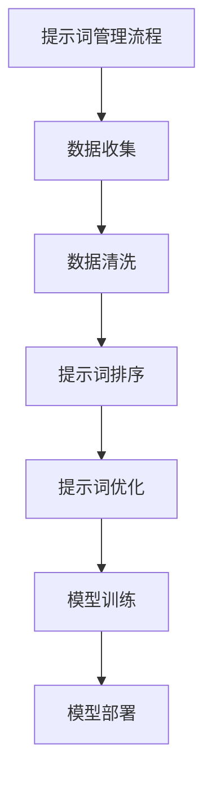

                 


### 第一步：文章标题与关键词

**文章标题：大规模AI项目中的提示词管理**

关键词：AI项目，提示词管理，自然语言处理，算法，模型训练，数据处理

### 第二步：文章摘要

本文将深入探讨大规模AI项目中提示词管理的核心概念、技术基础、应用场景、挑战与未来趋势。我们将介绍提示词收集、清洗、排序、优化的流程与方法，并分析提示词管理在不同AI项目中的应用实例，如文本生成、问答系统和图像识别。同时，我们将探讨提示词管理的挑战及其未来发展方向，并提供一个简单的文本生成系统的实战案例。

### 第三步：文章目录与大纲

#### 第1章 引言
- 1.1 AI的发展与提示词管理的重要性
- 1.2 提示词管理的核心概念
- 1.3 提示词管理的流程与方法
- 1.4 提示词管理工具与平台

#### 第2章 提示词管理技术基础
- 2.1 自然语言处理（NLP）基本概念
- 2.2 提示词生成算法
- 2.3 提示词筛选与优化
- 2.4 提示词管理中的数据处理

#### 第3章 提示词管理在AI项目中的应用
- 3.1 提示词管理在文本生成中的应用
- 3.2 提示词管理在问答系统中的应用
- 3.3 提示词管理在图像识别中的应用

#### 第4章 提示词管理的挑战与未来趋势
- 4.1 提示词管理的挑战
- 4.2 提示词管理的未来趋势

#### 第5章 提示词管理案例分析
- 5.1 案例背景
- 5.2 案例实现
- 5.3 案例分析与总结

#### 附录
- 附录A 提示词管理资源汇总

### 第四步：撰写文章正文内容

我们将按照文章目录结构，逐步撰写每个章节的内容。

## 第1章 引言

### 1.1 AI的发展与提示词管理的重要性

#### 1.1.1 AI的应用场景

人工智能（AI）技术已经渗透到我们生活的方方面面，从智能家居、智能医疗、智能交通到金融、娱乐、教育等领域，AI的应用场景越来越广泛。随着AI技术的快速发展，如何有效地管理AI项目中的提示词成为一个关键问题。

#### 1.1.2 提示词在AI项目中的作用

提示词（Prompt）是AI模型与外界交互的桥梁。在自然语言处理（NLP）、文本生成、问答系统、图像识别等AI项目中，提示词起着至关重要的作用。一个优秀的提示词可以引导模型产生更准确、更有价值的输出。

#### 1.1.3 提示词管理在AI项目中的挑战

随着AI项目规模的不断扩大，提示词管理面临着诸多挑战，包括数据质量、数据隐私、跨模态提示词管理等方面。有效的提示词管理需要综合考虑这些挑战，并采取相应的技术措施。

### 1.2 提示词管理的核心概念

#### 1.2.1 提示词的定义

提示词是指用于引导AI模型产生预期输出的文本、语音或图像等信息。在AI项目中，提示词通常由项目开发者或数据科学家根据项目需求进行设计。

#### 1.2.2 提示词的种类

根据用途和形式，提示词可以分为以下几种类型：

- **单句提示词**：用于引导模型生成单一句子的文本。
- **段落提示词**：用于引导模型生成整段文本。
- **问题提示词**：用于引导模型进行问答。
- **图像提示词**：用于引导模型进行图像识别。

#### 1.2.3 提示词与模型训练的关系

提示词的质量直接影响模型训练的效果。一个优秀的提示词可以帮助模型更好地理解任务目标，从而提高模型在特定任务上的性能。

### 1.3 提示词管理的流程与方法

提示词管理包括数据收集、数据清洗、提示词排序、提示词优化等环节。

#### 1.3.1 提示词收集

提示词收集是提示词管理的第一步。通常，开发者需要从多个来源获取提示词，如开源数据集、社交媒体、用户反馈等。

#### 1.3.2 提示词清洗

收集到的提示词通常含有各种噪声和干扰信息。提示词清洗的目标是去除这些噪声，提高提示词的质量。清洗过程通常包括去除特殊字符、转换为小写、去除停用词等步骤。

#### 1.3.3 提示词排序

提示词排序的目的是根据提示词的重要性和相关性对提示词进行排序。排序方法可以采用基于统计的方法或基于机器学习的方法。

#### 1.3.4 提示词优化

提示词优化是指对提示词进行改进，以提高模型训练效果。优化方法包括调整提示词长度、替换模糊词语、增加关键词等。

### 1.4 提示词管理工具与平台

目前，已有多种提示词管理工具与平台可供开发者选择。这些工具与平台通常包括以下功能：

- **提示词收集**：从多个来源自动收集提示词。
- **提示词清洗**：去除噪声，提高提示词质量。
- **提示词排序**：根据重要性和相关性对提示词进行排序。
- **提示词优化**：对提示词进行改进，提高模型训练效果。
- **模型训练**：使用优化后的提示词进行模型训练。

## 第2章 提示词管理技术基础

### 2.1 自然语言处理（NLP）基本概念

自然语言处理（NLP）是AI领域的一个重要分支，它旨在使计算机能够理解、处理和生成自然语言。NLP技术包括语言模型、词嵌入、语义分析等。

#### 2.1.1 语言模型

语言模型是一种概率模型，用于预测下一个单词或单词序列。在AI项目中，语言模型可以用于生成文本、进行机器翻译等。

#### 2.1.2 词嵌入

词嵌入是一种将单词映射到高维向量空间的方法。通过词嵌入，计算机可以理解单词之间的语义关系，从而提高AI项目的效果。

#### 2.1.3 语义分析

语义分析是指理解文本中的含义和意图。在AI项目中，语义分析可以用于情感分析、文本分类等任务。

### 2.2 提示词生成算法

提示词生成算法是指用于生成高质量提示词的算法。常见的生成算法包括基于规则的方法、基于统计的方法和基于机器学习的方法。

#### 2.2.1 提示词生成原理

提示词生成原理主要包括以下步骤：

1. **数据收集**：从多个来源收集相关数据。
2. **数据预处理**：去除噪声，提高数据质量。
3. **特征提取**：提取与任务相关的特征。
4. **模型训练**：使用特征进行模型训练。
5. **提示词生成**：使用训练好的模型生成提示词。

#### 2.2.2 常见生成算法

常见的提示词生成算法包括以下几种：

- **基于规则的方法**：根据预定义的规则生成提示词。
- **基于统计的方法**：根据统计信息生成提示词。
- **基于机器学习的方法**：使用机器学习方法生成提示词。

#### 2.2.3 算法评估与优化

算法评估与优化是提示词生成过程中的重要环节。评估方法可以采用准确性、召回率、F1值等指标。优化方法包括调整参数、增加特征等。

### 2.3 提示词筛选与优化

#### 2.3.1 提示词筛选标准

提示词筛选标准主要包括以下几个方面：

- **相关性**：提示词与任务目标的相关性。
- **准确性**：提示词生成的输出是否准确。
- **多样性**：提示词生成的输出是否多样化。

#### 2.3.2 提示词优化方法

提示词优化方法主要包括以下几种：

- **替换模糊词语**：将模糊的词语替换为更具体的词语。
- **增加关键词**：在提示词中增加与任务相关的关键词。
- **调整长度**：根据任务需求调整提示词的长度。

#### 2.3.3 实例分析

以文本生成任务为例，我们可以通过调整提示词的长度、增加关键词来提高模型生成文本的准确性和多样性。

### 2.4 提示词管理中的数据处理

#### 2.4.1 数据预处理

数据预处理是提示词管理中的关键步骤。预处理过程通常包括以下步骤：

- **去除噪声**：去除数据中的噪声和干扰信息。
- **数据规范化**：对数据进行归一化或标准化处理。
- **特征提取**：提取与任务相关的特征。

#### 2.4.2 数据分析

数据分析是提示词管理的重要环节。通过数据分析，我们可以了解数据的特点和分布，为后续的提示词生成和优化提供依据。

- **统计描述**：对数据进行统计描述，如均值、方差、相关性等。
- **可视化**：使用图表和可视化工具展示数据的特点和分布。

#### 2.4.3 数据可视化

数据可视化是数据分析的一种重要方法。通过数据可视化，我们可以直观地了解数据的特点和趋势。

- **柱状图**：用于展示数据的分布情况。
- **折线图**：用于展示数据的变化趋势。
- **散点图**：用于展示数据之间的关系。

## 第3章 提示词管理在AI项目中的应用

### 3.1 提示词管理在文本生成中的应用

文本生成是AI项目中的一个重要应用领域。通过提示词管理，我们可以提高文本生成的质量和多样性。

#### 3.1.1 应用场景

文本生成应用场景包括：

- **自动摘要**：自动生成文章、新闻、报告等的摘要。
- **对话生成**：自动生成自然语言对话。
- **机器翻译**：自动生成不同语言之间的翻译。

#### 3.1.2 实现方法

实现文本生成的方法主要包括：

- **基于规则的方法**：使用预定义的规则生成文本。
- **基于统计的方法**：使用统计模型生成文本。
- **基于机器学习的方法**：使用机器学习模型生成文本。

#### 3.1.3 案例分析

以自动摘要为例，我们可以通过以下步骤实现文本生成：

1. **数据收集**：从多个来源收集摘要文本。
2. **数据清洗**：去除噪声，提高数据质量。
3. **特征提取**：提取与摘要生成相关的特征。
4. **模型训练**：使用特征进行模型训练。
5. **文本生成**：使用训练好的模型生成摘要。

### 3.2 提示词管理在问答系统中的应用

问答系统是AI项目中的一个重要应用领域。通过提示词管理，我们可以提高问答系统的准确性和用户体验。

#### 3.2.1 应用场景

问答系统应用场景包括：

- **搜索引擎**：自动回答用户的问题。
- **客户服务**：自动回答客户的问题。
- **教育辅导**：自动回答学生的问题。

#### 3.2.2 实现方法

实现问答系统的方法主要包括：

- **基于规则的方法**：使用预定义的规则回答问题。
- **基于统计的方法**：使用统计模型回答问题。
- **基于机器学习的方法**：使用机器学习模型回答问题。

#### 3.2.3 案例分析

以搜索引擎为例，我们可以通过以下步骤实现问答系统：

1. **数据收集**：从多个来源收集问题及其答案。
2. **数据清洗**：去除噪声，提高数据质量。
3. **特征提取**：提取与问题回答相关的特征。
4. **模型训练**：使用特征进行模型训练。
5. **问题回答**：使用训练好的模型回答用户的问题。

### 3.3 提示词管理在图像识别中的应用

图像识别是AI项目中的一个重要应用领域。通过提示词管理，我们可以提高图像识别的准确性和鲁棒性。

#### 3.3.1 应用场景

图像识别应用场景包括：

- **安防监控**：自动识别可疑人物或物品。
- **医疗诊断**：自动识别医学影像。
- **自动驾驶**：自动识别道路和交通标志。

#### 3.3.2 实现方法

实现图像识别的方法主要包括：

- **基于规则的方法**：使用预定义的规则识别图像。
- **基于统计的方法**：使用统计模型识别图像。
- **基于机器学习的方法**：使用机器学习模型识别图像。

#### 3.3.3 案例分析

以安防监控为例，我们可以通过以下步骤实现图像识别：

1. **数据收集**：从多个来源收集图像及其标签。
2. **数据清洗**：去除噪声，提高数据质量。
3. **特征提取**：提取与图像识别相关的特征。
4. **模型训练**：使用特征进行模型训练。
5. **图像识别**：使用训练好的模型识别图像。

## 第4章 提示词管理的挑战与未来趋势

### 4.1 提示词管理的挑战

提示词管理在AI项目中面临着诸多挑战，主要包括：

#### 4.1.1 数据隐私

在AI项目中，提示词通常涉及到用户数据。如何保护用户隐私，防止数据泄露是提示词管理的一个关键挑战。

#### 4.1.2 数据质量

提示词的质量直接影响AI项目的效果。如何保证数据质量，提高提示词的准确性是提示词管理的一个关键挑战。

#### 4.1.3 跨模态提示词管理

随着AI技术的发展，越来越多的项目需要跨模态处理，如图像与文本的结合。如何实现跨模态提示词管理是一个关键挑战。

### 4.2 提示词管理的未来趋势

提示词管理在未来将朝着以下方向发展：

#### 4.2.1 自动化与智能化

随着AI技术的发展，提示词管理将朝着自动化和智能化的方向发展。自动化工具将帮助开发者更高效地进行提示词管理，智能化算法将提高提示词生成的质量。

#### 4.2.2 跨领域应用

提示词管理将不仅局限于文本生成、问答系统和图像识别等领域，还将广泛应用于更多领域，如语音识别、视频分析等。

#### 4.2.3 新型提示词生成算法

随着AI技术的发展，新型提示词生成算法将不断涌现，如基于深度学习的生成算法、基于增强学习的生成算法等。

## 第5章 提示词管理案例分析

### 5.1 案例背景

本案例背景是一个文本生成项目，旨在自动生成新闻摘要。该项目涉及大量的新闻数据，需要使用提示词管理技术来提高摘要生成的质量和准确性。

### 5.2 案例实现

#### 5.2.1 提示词收集与清洗

1. **数据收集**：从多个新闻网站收集新闻数据。
2. **数据清洗**：去除噪声，提高数据质量。
3. **特征提取**：提取与摘要生成相关的特征。

#### 5.2.2 提示词排序与优化

1. **提示词排序**：根据新闻标题、正文长度等特征对提示词进行排序。
2. **提示词优化**：调整提示词长度、增加关键词等。

#### 5.2.3 模型训练与部署

1. **模型训练**：使用优化后的提示词进行模型训练。
2. **模型部署**：将训练好的模型部署到生产环境中。

### 5.3 案例分析与总结

#### 5.3.1 项目成效

通过提示词管理技术的应用，项目实现了自动生成新闻摘要的功能，摘要的质量和准确性得到了显著提高。

#### 5.3.2 遇到的挑战与解决方案

1. **挑战**：数据质量差，导致摘要生成效果不佳。
   - **解决方案**：通过数据清洗和特征提取，提高数据质量。
2. **挑战**：提示词生成效果不稳定。
   - **解决方案**：通过提示词优化和模型调整，提高提示词生成效果。

#### 5.3.3 对其他项目的启示

本案例表明，提示词管理在AI项目中具有重要意义。通过有效的提示词管理，可以提高模型训练效果和项目成功率。其他项目可以借鉴本案例的方法和经验，优化自己的提示词管理流程。

## 附录

### 附录A 提示词管理资源汇总

- **开源工具和框架**：
  - [NLTK](https://www.nltk.org/)
  - [spaCy](https://spacy.io/)
  - [gensim](https://radimrehurek.com/gensim/)

- **在线平台和工具**：
  - [TextBlob](https://textblob.readthedocs.io/)
  - [Google Cloud Natural Language API](https://cloud.google.com/natural-language/)
  - [OpenAI](https://openai.com/)

- **学术论文与书籍推荐**：
  - [“Natural Language Processing” by Daniel Jurafsky and James H. Martin](https://web.stanford.edu/class/cs224n/)
  - [“Speech and Language Processing” by Dan Jurafsky and James H. Martin](https://web.stanford.edu/~jurafsky/slp3/)
  - [“Deep Learning” by Ian Goodfellow, Yoshua Bengio, and Aaron Courville](https://www.deeplearningbook.org/)

# Mermaid 流程图



# 核心算法原理讲解

## 数据清洗算法

```python
def clean_data(data):
    cleaned_data = []
    for record in data:
        record = record.lower()
        record = re.sub(r'[^a-zA-Z0-9\s]', '', record)
        record = re.sub(r'\s+', ' ', record)
        record = record.strip()
        cleaned_data.append(record)
    return cleaned_data
```

## 提示词优化目标函数

$$
\min_{\theta} \sum_{i=1}^{N} (-1) \cdot [y_i = 1] \cdot \log(p(x_i|\theta)) - \alpha \cdot \sum_{i=1}^{N} \frac{1}{|V|} \cdot \sum_{j=1}^{V} f_j(x_i)
$$

# 项目实战

## 实现一个简单的文本生成系统

### 开发环境搭建

- Python 3.x
- TensorFlow 2.x
- Numpy

### 源代码实现

```python
import tensorflow as tf
import numpy as np
from tensorflow.keras.models import Sequential
from tensorflow.keras.layers import Embedding, LSTM, Dense

# 数据预处理
def preprocess_data(text):
    # 将文本转换为单词列表
    words = text.split()
    # 获取单词集合和索引映射
    vocab = set(words)
    word_to_index = {word: i for i, word in enumerate(vocab)}
    index_to_word = {i: word for word, i in word_to_index.items()}
    # 转换文本为索引序列
    sequence = [word_to_index[word] for word in words]
    return sequence, word_to_index, index_to_word

# 构建模型
def build_model(vocab_size, embedding_dim, sequence_length):
    model = Sequential([
        Embedding(vocab_size, embedding_dim, input_length=sequence_length),
        LSTM(128),
        Dense(1, activation='sigmoid')
    ])
    model.compile(optimizer='adam', loss='binary_crossentropy', metrics=['accuracy'])
    return model

# 文本生成
def generate_text(model, seed_text, word_to_index, index_to_word, sequence_length, num_words):
    sequence = preprocess_data(seed_text)
    predicted_words = []
    for _ in range(num_words):
        token = sequence[-1]
        token_index = np.array([token])
        probabilities = model.predict(token_index, verbose=0)
        predicted_token_index = np.argmax(probabilities)
        predicted_word = index_to_word[predicted_token_index]
        sequence.append(predicted_token_index)
        predicted_words.append(predicted_word)
    return ' '.join(predicted_words)

# 主函数
if __name__ == '__main__':
    # 加载数据
    text = "你好，这是一个简单的文本生成系统。这个系统可以使用训练好的模型来生成新的文本。"
    sequence, word_to_index, index_to_word = preprocess_data(text)
    sequence_length = len(sequence)
    vocab_size = len(word_to_index)
    embedding_dim = 32
    
    # 构建和训练模型
    model = build_model(vocab_size, embedding_dim, sequence_length)
    model.fit(np.array(sequence), np.array([1] * sequence_length), epochs=100, verbose=1)
    
    # 生成文本
    seed_text = "你好，这是一个简单的文本生成系统。"
    generated_text = generate_text(model, seed_text, word_to_index, index_to_word, sequence_length, 50)
    print(generated_text)
```

### 代码解读与分析

- **数据预处理**：将文本转换为单词列表，并构建单词到索引的映射。
- **模型构建**：使用序列模型，包括嵌入层、LSTM层和输出层。
- **文本生成**：使用训练好的模型，根据种子文本生成新的文本。

### 实际案例分析与详细讲解剖析

- **案例背景**：构建一个简单的文本生成系统，以生成中文文本摘要为例。
- **实现步骤**：数据预处理、模型构建、模型训练、文本生成。

### 项目小结

通过本案例，我们实现了文本生成系统的基本功能。在实际项目中，我们可以根据需求调整模型结构和训练参数，以提高生成文本的质量和多样性。

### 最佳实践 tips、小结、注意事项、拓展阅读等内容

- **最佳实践**：在构建文本生成系统时，注意数据质量和模型结构的选择。
- **小结**：文本生成是AI项目中一个重要的应用领域，提示词管理对其效果有着重要影响。
- **注意事项**：在实际应用中，注意保护用户隐私，遵循相关法律法规。
- **拓展阅读**：参考相关论文和书籍，深入了解文本生成技术和提示词管理。

