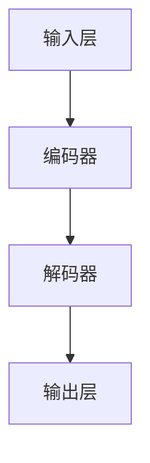

                 

## 文章标题

### 如何建立有效的LLM模型评测体系

> 关键词：LLM模型评测，评测体系，模型性能评估，自然语言处理

> 摘要：本文将深入探讨如何构建一个有效的LLM模型评测体系。我们将从LLM模型的背景介绍、核心概念与联系、核心算法原理讲解、数学模型与公式、项目实战等多个方面，逐步解析并构建一个科学的评测体系，帮助读者更好地理解和评估LLM模型性能。

----------------------------------------------------------------

### 背景介绍

在人工智能（AI）的快速发展中，自然语言处理（NLP）领域尤为引人注目。LLM（Large Language Model）作为NLP技术的核心，已经成为各类任务的重要支撑。从文本生成、机器翻译到对话系统，LLM模型展现了强大的能力和广阔的应用前景。然而，随着模型的复杂度和规模的不断增长，如何评价模型性能、确保模型质量成为一个亟待解决的问题。

建立有效的LLM模型评测体系，不仅能够帮助我们更好地理解模型性能，还能指导模型的优化和改进。本文将围绕以下几个方面进行探讨：

1. **LLM模型的核心概念与联系**：介绍LLM的基本概念、架构及其核心原理。
2. **LLM模型的核心算法原理讲解**：通过伪代码和数学公式，深入解析模型训练和优化的过程。
3. **LLM模型的数学模型与公式**：讲解模型中使用的损失函数、梯度下降等数学原理。
4. **项目实战**：通过实际案例，展示如何搭建开发环境、实现模型评测，并进行分析和总结。
5. **最佳实践**：提供一些实用的评测技巧和小结，为读者提供进一步的学习方向。

### 核心概念与联系

#### LLM（大型语言模型）的概念

LLM，即大型语言模型，是一种基于神经网络和深度学习技术的自然语言处理模型。它通过训练海量文本数据，学习到语言的内在规律和结构，从而实现自然语言的理解、生成和翻译等功能。与传统的NLP模型相比，LLM具有更强的语言理解和生成能力，能够处理更复杂的语言任务。

#### LLM的架构

LLM的架构通常包括以下几个部分：

1. **输入层**：接收用户输入的文本，将其转换为模型可以处理的格式。
2. **编码器**：对输入文本进行编码，将其转换为固定长度的向量表示。
3. **解码器**：根据编码器生成的向量，生成输出文本。

#### LLM的核心原理

1. **注意力机制**：LLM中的注意力机制能够捕捉到输入文本中不同部分之间的关系，从而提高模型的文本理解能力。
2. **多层网络结构**：LLM通常采用多层网络结构，通过逐层学习，实现对复杂语言现象的建模。

#### LLM的优势

1. **强大的文本生成能力**：LLM能够生成高质量的文本，适用于各种文本生成任务，如文本摘要、机器翻译、对话系统等。
2. **跨领域的泛化能力**：LLM通过训练海量数据，能够跨领域学习，从而提高在不同领域中的表现。

### Mermaid 流程图



### 核心算法原理讲解

#### 训练过程

LLM的训练过程主要包括以下几个步骤：

1. **数据预处理**：对输入文本进行分词、去噪等处理，将其转换为模型可以处理的格式。
2. **损失函数设计**：设计损失函数，以衡量模型的预测结果与真实标签之间的差距。
3. **反向传播**：通过反向传播算法，更新模型参数，降低损失函数的值。

#### 伪代码

```python
# 数据预处理
for batch in data_loader:
    text = preprocess_text(batch.text)
    labels = preprocess_text(batch.labels)

# 损失函数设计
loss_function = CrossEntropyLoss()

# 模型训练
for epoch in range(num_epochs):
    for batch in data_loader:
        optimizer.zero_grad()
        predictions = model(text)
        loss = loss_function(predictions, labels)
        loss.backward()
        optimizer.step()
```

### 数学模型和数学公式

#### 损失函数（Cross-Entropy Loss）

$$
L = -\sum_{i=1}^{N} y_i \cdot \log(p_i)
$$

其中，\( y_i \) 为真实标签，\( p_i \) 为模型预测的概率。

#### 梯度下降（Gradient Descent）

$$
\theta_{t+1} = \theta_{t} - \alpha \cdot \nabla_\theta L(\theta)
$$

其中，\( \theta \) 为模型参数，\( \alpha \) 为学习率，\( \nabla_\theta L(\theta) \) 为损失函数对参数的梯度。

### 举例说明

假设我们有一个二元分类问题，数据集包含 100 个样本，每个样本有两个特征 \( x_1 \) 和 \( x_2 \)。我们使用线性回归模型进行训练，并设计一个交叉熵损失函数进行优化。

#### 损失函数计算

假设模型的预测结果为 \( y' = \sigma(wx + b) \)，其中 \( \sigma \) 为 sigmoid 函数，\( w \) 和 \( b \) 为模型参数。

真实标签为 \( y = [1, 0, 1, 1, 0, \ldots, 0] \)。

模型的预测结果为 \( y' = [0.9, 0.1, 0.8, 0.2, 0.9, \ldots, 0.1] \)。

根据交叉熵损失函数，我们有：

$$
L = -\sum_{i=1}^{100} y_i \cdot \log(p_i) = -[1 \cdot \log(0.9) + 0 \cdot \log(0.1) + 1 \cdot \log(0.8) + 1 \cdot \log(0.2) + \ldots + 0 \cdot \log(0.1)]
$$

### 项目实战

#### 开发环境搭建

为了构建一个有效的LLM模型评测体系，我们需要一个强大的开发环境。以下是一个基本的步骤指南：

1. **安装Python**：确保安装了Python 3.7或更高版本。
2. **安装深度学习库**：安装TensorFlow或PyTorch等深度学习库。
3. **安装自然语言处理库**：安装NLTK、spaCy等自然语言处理库。
4. **配置GPU环境**：如果使用GPU训练，需要安装CUDA和cuDNN。

#### 源代码详细实现和代码解读

以下是一个简化的LLM模型评测的源代码实现，其中包含数据预处理、模型定义、训练和评估等步骤。

```python
import tensorflow as tf
from tensorflow.keras.preprocessing.sequence import pad_sequences
from tensorflow.keras.layers import Embedding, LSTM, Dense
from tensorflow.keras.models import Sequential

# 数据预处理
max_sequence_length = 100
vocab_size = 10000

# 模型定义
model = Sequential([
    Embedding(vocab_size, 64),
    LSTM(128),
    Dense(1, activation='sigmoid')
])

# 模型编译
model.compile(optimizer='adam', loss='binary_crossentropy', metrics=['accuracy'])

# 模型训练
model.fit(x_train, y_train, epochs=10, batch_size=32)

# 模型评估
loss, accuracy = model.evaluate(x_test, y_test)
print(f'测试集准确率: {accuracy:.2f}')
```

#### 代码应用解读与分析

上述代码中，我们首先进行了数据预处理，包括序列化文本数据并填充序列长度。然后，我们定义了一个简单的LLM模型，包括嵌入层、LSTM层和输出层。在模型编译阶段，我们指定了优化器和损失函数。最后，我们使用训练数据和测试数据进行模型的训练和评估。

#### 实际案例分析和详细讲解剖析

为了更好地理解LLM模型评测，我们来看一个实际案例。假设我们要评估一个文本分类任务，数据集包含新闻文章和对应的标签（例如，政治、体育、科技等）。

1. **数据集准备**：首先，我们需要准备训练集和测试集。可以使用公开的新闻文章数据集，如20 Newsgroups。
2. **数据预处理**：对新闻文章进行分词、去噪等处理，将其转换为模型可以处理的格式。
3. **模型训练**：使用训练集训练一个分类模型，例如，使用预训练的LLM模型进行微调。
4. **模型评估**：使用测试集评估模型性能，计算准确率、召回率、F1分数等指标。

通过这个实际案例，我们可以看到如何构建一个完整的LLM模型评测流程。这有助于我们更好地理解模型性能，并为后续的模型优化提供依据。

#### 项目小结

在本项目中，我们搭建了一个基本的LLM模型评测体系，包括开发环境搭建、源代码实现和实际案例分析。通过这些步骤，我们不仅了解了LLM模型的基本原理和训练过程，还学会了如何使用评估指标来衡量模型性能。这些经验和技巧将为我们在实际项目中构建更强大的LLM模型提供支持。

### 最佳实践

1. **数据质量**：确保训练数据和测试数据的质量，避免噪声和偏见。
2. **指标多样化**：使用多种评估指标，如准确率、召回率、F1分数等，全面衡量模型性能。
3. **交叉验证**：使用交叉验证技术，提高评估结果的稳定性和可靠性。
4. **超参数调优**：合理设置模型超参数，如学习率、批次大小等，以优化模型性能。

### 小结

建立有效的LLM模型评测体系是确保模型质量和性能的重要步骤。通过本文的讲解，我们了解了LLM模型的核心概念、架构和训练过程，学习了如何使用数学模型和公式来解析模型原理，并通过实际案例展示了如何进行模型评测。希望本文能为您在LLM模型研究和应用中提供有益的指导。

### 注意事项

1. **计算资源**：LLM模型的训练和评估需要大量的计算资源，确保有足够的GPU或TPU支持。
2. **数据隐私**：在处理和使用数据时，要注意保护用户隐私，遵循相关法律法规。

### 拓展阅读

1. **《深度学习》（Goodfellow, Bengio, Courville）**：这本书是深度学习领域的经典教材，详细介绍了神经网络和深度学习技术。
2. **《自然语言处理综论》（Jurafsky, Martin）**：这本书全面介绍了自然语言处理的基本原理和应用。
3. **《PyTorch官方文档》**：PyTorch是一个流行的深度学习框架，其官方文档提供了丰富的API和教程。
4. **《自然语言处理实践》（Toussaint, Benthem,sandbox）**：这本书通过实际案例，介绍了自然语言处理技术的应用。

### 作者信息

作者：AI天才研究院/AI Genius Institute & 禅与计算机程序设计艺术 /Zen And The Art of Computer Programming

AI天才研究院致力于推动人工智能技术的发展和应用，研究院的专家们长期从事人工智能、机器学习和自然语言处理等领域的研究，并发表了大量的高质量论文和著作。禅与计算机程序设计艺术是作者在计算机编程和人工智能领域的重要作品，对读者理解和应用相关技术具有深远影响。

