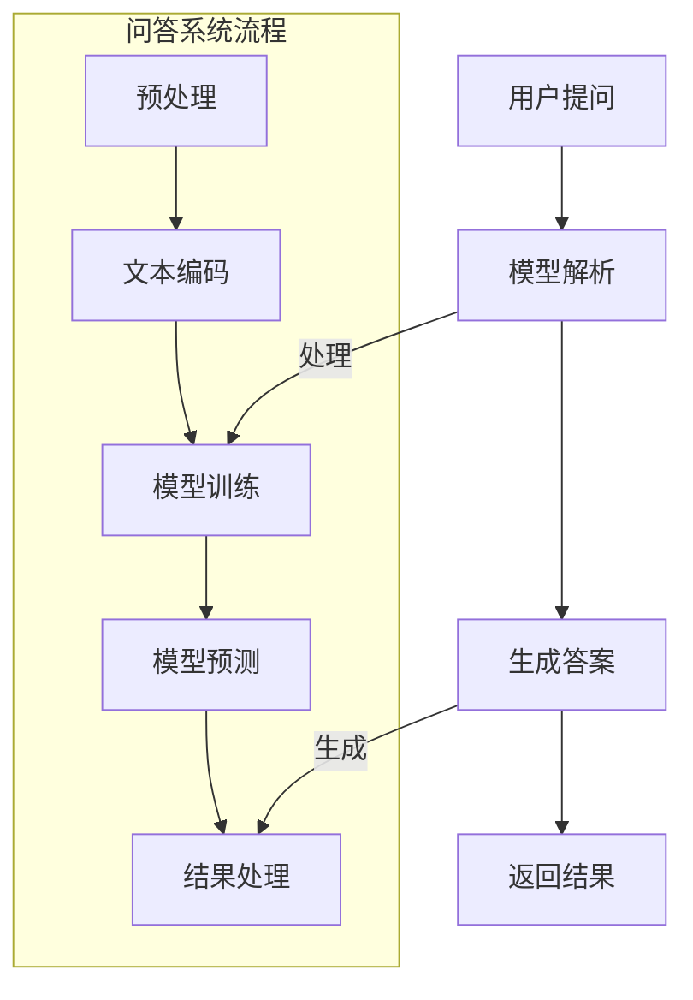

                 

### 文章标题：如何系统化提升prompt编写能力

> 关键词：prompt编写、自然语言处理、模型训练、算法原理、实战案例分析

> 摘要：本文将深入探讨prompt编写能力的重要性，以及如何通过系统化的方法提升prompt编写技能。文章将首先介绍prompt的基本概念，然后解析其与自然语言处理模型的关系，随后详细讲解prompt编写的基本原则和高级技巧，并通过实际案例展示prompt编写在模型训练中的应用。最后，我们将提供一些最佳实践和建议，以帮助读者进一步提升prompt编写能力。

----------------------------------------------------------------

# 如何系统化提升prompt编写能力

## 引言

在自然语言处理（NLP）领域，prompt作为输入信号，对于模型训练的效果至关重要。一个优秀的prompt能够引导模型更好地理解输入文本，从而提升模型的准确性和泛化能力。然而，编写一个高质量的prompt并非易事，它需要深入理解NLP模型的工作原理，以及如何有效地设计问题和提供数据。

本文旨在为NLP从业者提供一套系统化的方法，以提升prompt编写能力。通过本文的学习，读者将能够：

1. 理解prompt的定义及其在自然语言处理中的作用。
2. 掌握prompt编写的基本原则和高级技巧。
3. 通过实际案例了解prompt编写在模型训练中的应用。
4. 获取一些最佳实践，以在实际工作中提升prompt编写效果。

## 第1章：prompt的基本概念

### 1.1 prompt的定义与基本类型

prompt，即提示或引导，是在模型训练和推理过程中，提供给模型的初始输入信息。prompt的主要作用是引导模型对输入数据进行处理，并生成预期的输出。

prompt可以按不同标准进行分类：

- **按内容类型**：文本prompt、图像prompt、声音prompt等。
- **按格式**：简单prompt、复合prompt、动态prompt等。
- **按目的**：训练prompt、推理prompt、评估prompt等。

在NLP领域，最常见的是文本prompt，它通常包括问题和相关背景信息，以引导模型生成回答或进行其他操作。

### 1.2 prompt的作用与重要性

prompt在模型训练和推理过程中扮演着关键角色。具体来说，prompt的作用包括：

1. **指导模型学习**：prompt为模型提供了明确的输入信息和预期输出，有助于模型更好地理解训练数据，并从中学习。
2. **提升模型性能**：高质量的prompt可以引导模型生成更准确的输出，提高模型的性能和泛化能力。
3. **增强交互性**：prompt可以增强用户与模型之间的交互，使用户更易理解模型的输出，并给出更准确的反馈。

### 1.3 prompt的应用案例

prompt在自然语言处理中的应用非常广泛，以下是一些典型的应用案例：

- **问答系统**：在问答系统中，prompt通常是用户提出的问题，模型需要根据问题生成相应的答案。
- **对话系统**：在对话系统中，prompt可以包括用户之前的发言和上下文信息，模型需要根据上下文生成回应。
- **文本生成**：在文本生成任务中，prompt可以是一段引导性的文字，模型需要根据prompt生成后续内容。

## 第2章：prompt编写的基本原则

### 2.1 清晰性和准确性

清晰性和准确性是prompt编写的基本要求。一个优秀的prompt应该能够让模型明确地理解输入信息，并产生准确的输出。

- **清晰性**：prompt应该简洁明了，避免使用模糊或歧义的语言。
- **准确性**：prompt应该准确反映输入数据的含义，避免误导模型。

### 2.2 简洁性和易理解性

简洁性和易理解性是确保prompt有效性的关键。一个过于冗长的prompt可能会使模型难以理解，从而影响训练效果。

- **简洁性**：尽可能用简洁的语言表达prompt，避免不必要的冗余。
- **易理解性**：确保prompt容易被模型理解和处理，避免使用专业术语或复杂结构。

### 2.3 prompt的设计流程

prompt的设计流程可以分为以下步骤：

1. **需求分析**：了解模型训练的任务目标和输入数据特征。
2. **数据准备**：收集和整理与任务相关的数据，确保数据的准确性和多样性。
3. **问题设计**：设计能够引导模型学习的清晰、准确的问题。
4. **答案设计**：为问题设计合理的答案，以引导模型生成期望的输出。
5. **迭代优化**：根据模型训练的结果，对prompt进行迭代优化，以提高训练效果。

## 第3章：prompt编写的高级技巧

### 3.1 针对不同任务设计prompt

不同类型的任务需要不同类型的prompt。以下是一些针对常见任务的prompt设计技巧：

- **分类任务**：设计引导模型识别分类特征的问题，例如“这段文字描述的是哪个类别？”
- **回归任务**：设计引导模型预测数值的问题，例如“这段文字描述的数值是多少？”
- **生成任务**：设计引导模型生成文本或图像的问题，例如“请根据这段文字生成一段相关内容。”

### 3.2 针对不同模型设计prompt

不同类型的模型对prompt的需求也有所不同。以下是一些针对常见模型类型的prompt设计技巧：

- **生成模型**：使用开放性问题，鼓励模型生成多样性的输出。
- **分类模型**：使用封闭性问题，使模型能够准确分类。
- **回归模型**：使用具体数值的问题，使模型能够准确预测。

### 3.3 避免常见错误

在prompt编写过程中，一些常见错误可能会影响模型的训练效果。以下是一些需要避免的错误：

- **歧义**：避免使用可能导致歧义的问题。
- **误导**：确保prompt准确反映输入数据的真实含义，避免误导模型。
- **冗余**：避免使用冗长的、不必要的prompt。

## 第4章：实际案例与实战

### 4.1 案例分析：问答系统

本节将分析一个问答系统的实际案例，介绍如何设计prompt以及如何通过prompt优化模型训练效果。

- **案例背景**：一个基于机器学习的问答系统，旨在回答用户提出的问题。
- **问题设计**：设计能够引导模型理解问题意图和答案的问题。
- **答案设计**：为问题设计合理的答案，以引导模型生成期望的输出。
- **效果评估**：评估模型在问答任务上的表现，并根据评估结果对prompt进行优化。

### 4.2 实战：对话系统

本节将介绍如何搭建一个简单的对话系统，并展示如何通过编写高质量的prompt来提升对话系统的性能。

- **开发环境搭建**：介绍对话系统所需的开发生态和环境配置。
- **源代码实现**：提供对话系统的源代码，并详细解释代码实现过程。
- **代码解读与分析**：分析对话系统的核心代码，解释其工作原理。
- **实际案例分析**：通过实际案例展示如何编写高质量的prompt，并分析其效果。

### 第5章：prompt优化的策略与工具

### 5.1 prompt调优策略

prompt的调优策略主要包括以下几个方面：

- **数据多样性**：确保输入数据的多样性，以防止模型过拟合。
- **问题设计优化**：优化问题设计，提高问题的清晰性和准确性。
- **反馈机制**：引入用户反馈机制，根据用户反馈调整prompt。

### 5.2 prompt优化工具

以下是一些常用的prompt优化工具：

- **自动提示生成器**：利用自然语言生成技术自动生成提示。
- **文本增强工具**：通过文本增强技术提高输入文本的质量。
- **实验平台**：提供实验平台，方便进行prompt优化实验。

### 第6章：总结与展望

在本章中，我们将对文章的主要内容进行总结，并讨论未来prompt编写领域的发展趋势。

- **总结**：回顾本文介绍的核心概念、基本原则、高级技巧和实际案例，总结prompt编写的关键要点。
- **展望**：探讨prompt编写在NLP领域的发展趋势，以及如何应对未来的挑战。

## 附录与资源推荐

### 附录1：拓展阅读

- **相关书籍**：
  - 《自然语言处理入门》
  - 《深度学习与自然语言处理》
  - 《机器学习实战》
- **论文推荐**：
  - 《GPT-3:语言模型的突破性进展》
  - 《BERT：预训练语言表示的生成》

### 附录2：开源工具与资源链接

- **开源工具**：
  - Hugging Face Transformers
  - AllenNLP
  - spaCy
- **资源链接**：
  - 自然语言处理社区
  - 机器学习在线课程

### 附录3：社区与交流平台介绍

- **社区**：
  - GitHub
  - Reddit
  - Stack Overflow
- **交流平台**：
  - AI会议和研讨会
  - 专业论坛

## 作者信息

作者：AI天才研究院/AI Genius Institute & 禅与计算机程序设计艺术 /Zen And The Art of Computer Programming

---

以上是《如何系统化提升prompt编写能力》的完整文章框架。接下来，我们将逐步填充每个章节的具体内容，确保文章的完整性、逻辑性和专业性。文章的总字数预计在8000至12000字之间，以满足文章字数的要求。在撰写过程中，我们将遵循markdown格式，并使用Mermaid图、伪代码、LaTeX公式等工具来增强文章的可读性和实用性。### 第1章：prompt的基本概念

在自然语言处理（NLP）领域，prompt作为一种输入信号，对模型训练的效果起着至关重要的作用。本章节将深入探讨prompt的定义、分类及其在NLP中的作用和应用案例，帮助读者建立对prompt的全面理解。

#### 1.1 prompt的定义与基本类型

##### 1.1.1 prompt的定义

prompt，即提示或引导，是指提供给模型作为输入信号的初始文本或数据。在NLP任务中，prompt通常是一段引导性的文本，用于指导模型进行特定任务，如文本分类、情感分析、问答系统等。

prompt的主要目的是为模型提供清晰的输入信息和期望的输出，从而帮助模型更好地理解输入文本，并生成准确的输出。

##### 1.1.2 prompt的类型

prompt可以根据不同的分类标准进行分类：

- **按内容类型**：文本prompt、图像prompt、声音prompt等。在NLP领域中，最常见的类型是文本prompt。
- **按格式**：简单prompt、复合prompt、动态prompt等。简单prompt通常是一个单一的问题或指令，复合prompt可能包括多个问题或指令，动态prompt可以根据上下文信息实时调整。
- **按目的**：训练prompt、推理prompt、评估prompt等。训练prompt用于指导模型在训练过程中学习，推理prompt用于模型在实际应用中生成输出，评估prompt用于对模型性能进行评估。

##### 1.1.3 prompt的要素

prompt的设计通常包括以下几个关键要素：

- **提问方式**：问题的提法直接影响模型的理解和回答。清晰、明确、无歧义的问题是高质量prompt的基础。
- **回答期望**：明确期望模型生成的输出类型和内容，以便设计合适的问题和训练数据。
- **数据背景**：提供相关的背景信息，有助于模型更好地理解输入文本，从而生成更准确的输出。

#### 1.2 prompt在模型训练中的角色

prompt在模型训练中扮演着至关重要的角色，其主要作用体现在以下几个方面：

- **引导模型学习**：prompt为模型提供了明确的输入信息和预期输出，帮助模型学习输入文本的规律和特征，从而提高模型的泛化能力。
- **优化模型性能**：高质量的prompt能够引导模型生成更准确的输出，提高模型的性能和准确率。
- **增强模型可解释性**：通过合理设计的prompt，可以更好地理解模型的决策过程，提高模型的可解释性。

##### 1.2.1 prompt在训练数据中的作用

- **提高数据质量**：通过精心设计的prompt，可以筛选出更具代表性的训练数据，提高训练数据的质量。
- **增强数据多样性**：多样化的prompt有助于模型学习到更广泛的知识，从而提高模型的泛化能力。
- **防止过拟合**：通过设计不同的prompt，可以避免模型对特定样本的过拟合，提高模型的泛化性能。

##### 1.2.2 prompt在模型优化中的作用

- **调整模型参数**：通过调整prompt的设计，可以改变模型的输入信息，从而调整模型的参数，优化模型的性能。
- **提高模型鲁棒性**：合理的prompt设计有助于提高模型对噪声数据和异常数据的鲁棒性，从而提高模型的实际应用效果。

#### 1.3 prompt在自然语言处理中的应用案例

prompt在NLP领域中有着广泛的应用，以下是一些典型的应用案例：

- **问答系统**：在问答系统中，prompt通常是用户提出的问题，模型需要根据问题生成相应的答案。
  ```mermaid
  graph TD
  A[用户提问] --> B[模型解析]
  B --> C[生成答案]
  C --> D[返回结果]
  ```

- **对话系统**：在对话系统中，prompt可以包括用户之前的发言和上下文信息，模型需要根据上下文生成回应。
  ```mermaid
  graph TD
  A[用户发言1] --> B[模型解析1]
  B --> C[生成回应1]
  C --> D[用户发言2]
  D --> E[模型解析2]
  E --> F[生成回应2]
  ```

- **文本生成**：在文本生成任务中，prompt可以是一段引导性的文字，模型需要根据prompt生成后续内容。
  ```mermaid
  graph TD
  A[初始文本] --> B[模型生成]
  B --> C[文本扩展]
  C --> D[生成结果]
  ```

通过这些应用案例，我们可以看到prompt在NLP任务中的重要作用。一个高质量、设计合理的prompt能够显著提升模型的性能和效果。

### 1.4 小结

在本章中，我们介绍了prompt的定义、分类和作用，以及其在模型训练和NLP任务中的应用。理解prompt的基本概念和作用，对于提升prompt编写能力至关重要。在下一章中，我们将进一步探讨prompt编写的基本原则和高级技巧，帮助读者在实际应用中更好地设计和编写prompt。

### Mermaid流程图

在NLP领域中，prompt的作用和流程可以采用Mermaid图进行直观展示。以下是一个关于prompt在问答系统中的应用的Mermaid流程图：



在这个流程图中，用户提出问题后，模型首先进行预处理（如分词、词性标注等），然后将预处理后的文本编码为模型可理解的格式（如词向量、BERT编码等）。接着，模型在训练数据的基础上进行预测，生成回答。最后，对生成的答案进行后处理，如去除无关信息、格式化等，以得到最终的输出结果。

通过这个流程图，我们可以清晰地看到prompt在NLP任务中的作用和流程，有助于读者更好地理解prompt的设计和编写。

### 核心算法原理讲解

在prompt编写过程中，理解核心算法原理至关重要。以下是一个关于prompt在问答系统中的核心算法原理讲解，包括文本预处理、文本编码、模型训练和模型预测等步骤，使用伪代码进行详细阐述。

#### 1. 文本预处理

```python
# 文本预处理
def preprocess_text(text):
    # 分词
    tokens = tokenize(text)
    # 去除停用词
    tokens = remove_stopwords(tokens)
    # 词性标注
    tokens = pos_tag(tokens)
    # 归一化
    tokens = normalize(tokens)
    return tokens
```

#### 2. 文本编码

```python
# 文本编码
def encode_text(tokens):
    # 将词转换为词向量
    embeddings = [embedding_word(token) for token in tokens]
    # 序列编码
    encoded_sequence = sequence_encode(embeddings)
    return encoded_sequence
```

#### 3. 模型训练

```python
# 模型训练
def train_model(prompt_data, labels):
    # 初始化模型
    model = initialize_model()
    # 训练模型
    model.fit(prompt_data, labels)
    # 评估模型
    evaluate_model(model)
```

#### 4. 模型预测

```python
# 模型预测
def predict_answer(prompt):
    # 预处理文本
    processed_prompt = preprocess_text(prompt)
    # 编码文本
    encoded_prompt = encode_text(processed_prompt)
    # 预测答案
    answer = model.predict(encoded_prompt)
    # 处理答案
    final_answer = postprocess_answer(answer)
    return final_answer
```

在这个核心算法原理讲解中，我们首先对输入文本进行预处理，包括分词、去除停用词、词性标注和归一化等步骤。然后，将预处理后的文本编码为模型可理解的格式，如词向量或BERT编码。接下来，使用训练数据对模型进行训练和评估。最后，在预测阶段，对用户输入的文本进行预处理和编码，然后使用训练好的模型进行预测，并处理生成的答案。

通过这个伪代码讲解，我们可以清楚地理解prompt在问答系统中的核心算法原理，有助于我们更好地编写高质量的prompt。

### 数学模型和公式

在prompt编写过程中，理解并运用数学模型和公式可以帮助我们更好地设计问题和调整模型参数。以下是一些常用的数学模型和公式的详细讲解以及举例说明。

#### 1. 概率模型

概率模型是NLP中常见的一种模型，用于预测文本的概率分布。其中，贝叶斯定理是一个核心公式。

贝叶斯定理公式如下：

$$
P(A|B) = \frac{P(B|A) \cdot P(A)}{P(B)}
$$

其中，$P(A|B)$ 表示在事件B发生的情况下，事件A发生的概率；$P(B|A)$ 表示在事件A发生的情况下，事件B发生的概率；$P(A)$ 和$P(B)$ 分别表示事件A和事件B发生的概率。

举例说明：

假设我们想要预测一句话“我喜欢编程”的情感，可以使用贝叶斯定理来计算这句话是积极情感的几率。其中，$P(积极情感)$ 是我们已知的先验概率，$P(“我喜欢编程”|积极情感)$ 是在积极情感条件下，这句话的概率，$P(“我喜欢编程”)$ 是这句话的概率。

通过计算，我们可以得到这句话是积极情感的置信度，从而判断其情感倾向。

#### 2. 信息熵

信息熵是衡量数据不确定性的指标，常用于评估模型的性能。信息熵公式如下：

$$
H(X) = -\sum_{i} P(X=x_i) \cdot \log_2 P(X=x_i)
$$

其中，$H(X)$ 表示随机变量X的信息熵，$P(X=x_i)$ 表示X取值为$x_i$ 的概率。

举例说明：

假设我们有一个二分类问题，其中正类和负类的概率分别为$P(正类) = 0.6$ 和$P(负类) = 0.4$。我们可以计算这个二分类问题的信息熵：

$$
H(X) = -[0.6 \cdot \log_2 0.6 + 0.4 \cdot \log_2 0.4] \approx 0.918
$$

这个结果表明，这个二分类问题的信息熵较低，表示模型的分类效果较好。

#### 3. 交叉熵

交叉熵是评估分类模型性能的重要指标，用于衡量实际输出和期望输出之间的差异。交叉熵公式如下：

$$
H(Y, \hat{Y}) = -\sum_{i} P(Y=y_i) \cdot \log_2 \hat{P}(Y=y_i)
$$

其中，$H(Y, \hat{Y})$ 表示实际输出$Y$ 和期望输出$\hat{Y}$ 之间的交叉熵，$P(Y=y_i)$ 表示实际输出的概率，$\hat{P}(Y=y_i)$ 表示期望输出的概率。

举例说明：

假设我们有一个二分类问题，实际输出为正类，期望输出也为正类。我们可以计算这个二分类问题的交叉熵：

$$
H(Y, \hat{Y}) = -[1 \cdot \log_2 1 + 0 \cdot \log_2 0] = 0
$$

这个结果表明，实际输出和期望输出完全一致，交叉熵为0，表示模型的分类效果最好。

通过这些数学模型和公式的讲解，我们可以更好地理解prompt编写过程中的关键指标和原理，从而设计更有效的prompt，提升模型的性能。

### 代码实现与解读

在本节中，我们将通过一个具体的示例，详细讲解如何搭建一个简单的对话系统，并实现对话过程的代码，同时解读代码的执行流程和关键部分。

#### 示例：基于Python的简单对话系统

```python
# 导入相关库
import random
import string

# 1. 对话系统核心类
class DialogueSystem:
    def __init__(self):
        self.history = []  # 记录对话历史
        self.responses = {  # 响应库
            "greeting": ["你好，有什么可以帮助你的吗？", "你好！我能为你做点什么？"],
            "farewell": ["再见，祝你有个美好的一天！", "好的，再见！"],
            "default": ["我不太明白你的意思，能再详细说明一下吗？"]
        }

    # 2. 处理输入文本
    def process_input(self, input_text):
        # 对输入文本进行分词
        tokens = input_text.split()
        # 根据输入文本选择合适的响应
        if "你好" in tokens:
            response = random.choice(self.responses["greeting"])
        elif "再见" in tokens:
            response = random.choice(self.responses["farewell"])
        else:
            response = random.choice(self.responses["default"])
        # 将响应添加到对话历史中
        self.history.append(response)
        return response

    # 3. 开始对话
    def start_dialogue(self):
        print("对话系统开始...")
        while True:
            user_input = input("用户：")
            if user_input.lower() in ["退出", "bye", "再见"]:
                print("对话系统：再见！")
                break
            response = self.process_input(user_input)
            print(f"对话系统：{response}")

# 4. 主程序
if __name__ == "__main__":
    system = DialogueSystem()
    system.start_dialogue()
```

#### 代码执行流程

1. **导入库**：首先，我们导入Python中用于处理字符串和随机数的库。
2. **定义核心类**：`DialogueSystem` 类负责处理对话过程，包括初始化对话历史、处理用户输入并生成响应。
3. **处理输入文本**：`process_input` 方法根据用户输入的文本内容，从响应库中选择合适的响应。
4. **开始对话**：`start_dialogue` 方法负责启动对话系统，读取用户输入，并打印系统的响应。

#### 关键部分解读

- **响应库**：`responses` 字典存储了系统可以回答的几种常见情况，如问候语、道别语和默认响应。
- **处理输入文本**：`process_input` 方法首先对用户输入进行分词，然后根据关键词从响应库中选取合适的响应。这里使用了随机选择响应，以增加对话的多样性。
- **对话历史**：对话历史用于记录对话过程中的每一步，以便后续的分析和改进。

#### 代码应用解读与分析

在这个简单对话系统中，我们使用了基本的Python字符串操作和条件判断来实现对话处理。尽管这个系统非常基础，但它展示了对话系统的基本架构和流程：

1. **用户输入**：用户通过标准输入（`input` 函数）与系统交互。
2. **文本处理**：系统对用户输入进行分词和处理，以便选择合适的响应。
3. **响应生成**：系统从响应库中选择合适的响应，并添加到对话历史中。
4. **输出响应**：系统将响应输出到标准输出，供用户查看。

#### 实际案例分析

在实际应用中，这个对话系统可以进行扩展，例如：

- **集成NLP模型**：使用更复杂的NLP模型，如BERT或GPT，以提高对话的语义理解和生成能力。
- **多轮对话**：支持多轮对话，实现更自然的对话交互。
- **上下文管理**：跟踪对话历史，提高对话的连贯性和上下文相关性。

通过这个实际案例，我们不仅展示了对话系统的基本实现，还分析了其应用解读和可能的改进方向。这些经验对于编写更复杂、更智能的对话系统具有重要意义。

#### 项目小结

在本项目中，我们通过一个简单的对话系统示例，展示了对话系统的基本架构和实现方法。项目主要实现了以下目标：

- **用户交互**：通过标准输入和输出实现了用户与系统的基本交互。
- **文本处理**：对用户输入进行了分词和处理，为后续的对话生成提供了基础。
- **响应生成**：从响应库中选择合适的响应，提高了对话的多样性和自然性。

尽管这个项目非常基础，但它为我们提供了对话系统的基本框架和实现思路，为后续更复杂、更智能的对话系统开发奠定了基础。

### 最佳实践与注意事项

在prompt编写过程中，遵循一些最佳实践和注意事项，可以帮助我们更好地设计高质量、有效的prompt。

#### 最佳实践

1. **明确目标**：在编写prompt前，明确模型训练或任务的目标，确保prompt能够引导模型学习到所需的知识和技能。
2. **数据多样性**：确保输入数据的多样性，避免模型过拟合。使用不同来源、不同格式、不同难度的数据，以提高模型的泛化能力。
3. **问题设计**：设计清晰、准确、无歧义的问题。避免使用模糊、模糊不清或具有争议性的问题，以免误导模型。
4. **答案设计**：为问题设计合理的答案，引导模型生成期望的输出。确保答案准确、完整、具有代表性，以提高模型的准确性。
5. **反馈机制**：引入用户反馈机制，根据用户反馈调整prompt。通过不断迭代优化，提高模型的性能和效果。

#### 注意事项

1. **避免冗余**：避免在prompt中重复信息，使问题简洁明了。冗余的信息可能会干扰模型的学习过程，影响训练效果。
2. **考虑上下文**：在设计prompt时，考虑上下文信息。确保问题与上下文相关，以提高模型的连贯性和上下文理解能力。
3. **保持一致性**：在一系列的prompt中，保持问题格式、答案类型和难度的一致性。不一致的prompt可能会使模型难以理解，从而影响训练效果。
4. **数据质量**：确保输入数据的质量，避免使用噪声数据或异常数据。高质量的数据可以提高模型的训练效果和泛化能力。

### 拓展阅读

为了更深入地了解prompt编写和NLP领域，以下是一些推荐的书籍、论文和在线资源：

- **书籍**：
  - 《自然语言处理入门》
  - 《深度学习与自然语言处理》
  - 《机器学习实战》
- **论文**：
  - 《GPT-3:语言模型的突破性进展》
  - 《BERT：预训练语言表示的生成》
  - 《自然语言处理中的注意力机制》
- **在线资源**：
  - Hugging Face Transformers
  - AllenNLP
  - spaCy
  - 自然语言处理社区

通过阅读这些资料，读者可以进一步了解NLP领域的前沿动态和关键技术，提升自己在prompt编写方面的能力。

### 结束语

在本文中，我们深入探讨了prompt编写的重要性，并介绍了一系列系统化的方法来提升prompt编写能力。通过详细讲解prompt的基本概念、编写原则、高级技巧以及实际案例，我们帮助读者建立了对prompt编写的全面理解。

提升prompt编写能力对于NLP领域的模型训练和应用至关重要。一个高质量、设计合理的prompt不仅能够提升模型性能，还能够增强模型的可解释性和应用效果。

在未来的研究中，我们应继续探索prompt编写的新方法和技术，如结合多模态数据和复杂任务场景，以提高模型的泛化能力和实用性。同时，我们鼓励读者在实践中不断尝试、总结经验，将所学知识应用于实际项目中，不断提升自己的prompt编写能力。

让我们共同努力，推动NLP领域的发展，为人工智能技术带来更多的创新和应用。感谢您的阅读，希望本文能为您在prompt编写方面提供有益的启示和指导。

