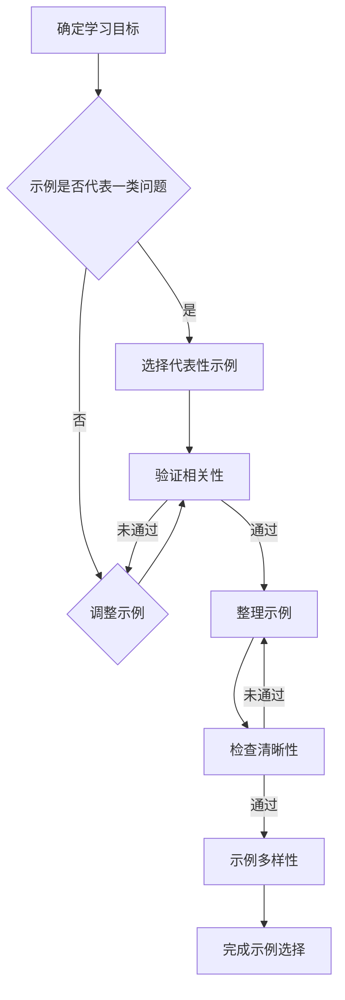

                 

## 文章标题

《如何选择有效的示例来增强提示效果》

## 关键词

- 示例选择
- 提示效果
- 人工智能
- 软件开发
- 教育技术
- 数学模型
- 实际案例

## 摘要

本文探讨了如何在技术文档、教学和研究领域中选择有效的示例来增强提示效果。通过分析示例选择的原则与方法，以及示例在实际应用中的效果评估与优化，本文提供了系统的方法论和实用的技巧，旨在提高示例的实用性和教学效果。文章还结合了数学模型和项目实战，详细讲解了示例选择的核心概念与联系，为读者提供了全面的理论支持和实践指导。

---

## 引言

### 示例在提示效果中的重要性

示例是技术文档、教学和研究过程中不可或缺的组成部分。有效的示例不仅能够帮助读者理解复杂的概念和算法，还能在教学中起到引导和激励的作用。选择合适的示例来增强提示效果，是提高信息传递效率和学习效果的关键。

在技术领域，示例通常用于展示算法的实现过程、软件的交互界面或系统的功能模块。一个清晰且具有代表性的示例，可以大大缩短读者的学习曲线，使他们更快地掌握技术要点。在教育领域，示例则扮演着知识传递和启发思考的角色。通过具体的案例，学生可以更好地理解抽象的概念，从而培养解决实际问题的能力。

### 本书的目的与结构

本书旨在提供一套系统的方法论，帮助读者在技术文档、教学和研究过程中选择有效的示例来增强提示效果。全书分为七个章节，分别从不同角度对示例选择进行深入探讨。

第一章为引言，介绍示例在提示效果中的重要性，并概述本书的目的和结构。

第二章讨论核心概念与联系，通过Mermaid流程图展示示例选择的相关概念，并阐述这些概念之间的相互关系。

第三章详细介绍示例选择的原则与方法，包括代表性、相关性、清晰性等关键因素。

第四章探讨示例在实际中的应用，涵盖软件开发、教育和研究等不同领域。

第五章介绍示例效果的评估与优化方法，包括用户反馈、性能指标等评估手段。

第六章讲解数学模型和数学公式，提供评估示例有效性的理论基础。

第七章通过项目实战，展示如何在实际项目中应用示例选择原则和方法，并进行效果评估和优化。

## 核心概念与联系

### 示例选择的相关概念

在选择示例时，需要理解以下几个核心概念：

1. **代表性**：示例应当能够代表一类问题或概念，使其具有普遍适用性。
2. **相关性**：示例应与读者的背景知识和学习目标紧密相关。
3. **清晰性**：示例应简洁明了，便于读者理解。
4. **多样性**：通过多样化的示例，可以更好地展示不同情境下的解决方案。

### 示例选择的Mermaid流程图

为了更好地理解示例选择的过程，我们可以使用Mermaid绘制一个流程图，如下所示：



### 示例应用与提示效果的联系

示例在应用中的效果取决于其选择的质量。一个有效的示例应当能够：

- **引导学习**：通过具体的案例，使读者能够直观地理解抽象的概念。
- **激发思考**：示例应能够启发读者思考，培养解决问题的能力。
- **强化记忆**：具体的示例有助于加深对知识点的记忆。

通过图示和流程图，我们可以清晰地看到示例选择的核心概念和它们之间的相互关系，以及如何通过有效的选择来增强提示效果。

## 示例选择的原则与方法

### 代表性原则

选择具有代表性的示例是确保其能够普遍适用的关键。代表性示例应当能够反映一类问题或概念，而不是单一的特殊情况。以下是一些确保示例代表性的方法：

- **数据多样性**：选择来自不同来源和不同时间点的数据，以避免偏差。
- **通用性**：避免选择过于特定或行业内的特定案例，而应选择具有广泛适用性的示例。
- **验证**：通过专家评审或用户测试来验证示例的代表性。

### 相关性原则

示例的相关性直接影响到其教学效果。选择与读者背景知识和学习目标紧密相关的示例，有助于提高学习效率。以下是一些提高示例相关性的方法：

- **需求分析**：了解读者的知识背景和学习需求，确保示例与这些需求相符。
- **反馈收集**：通过用户反馈来调整示例，使其更加符合实际需求。
- **动态调整**：根据教学过程中的反馈，及时调整示例，以提高其相关性。

### 清晰性原则

清晰的示例能够有效地传达信息，减少读者的理解障碍。以下是一些确保示例清晰性的方法：

- **简洁性**：避免冗长的描述和复杂的解释，使示例保持简洁。
- **一致性**：确保示例的语言、格式和符号一致，避免混淆。
- **视觉辅助**：使用图表、流程图和代码片段等视觉元素来增强示例的可读性。

### 示例选择的案例分析

下面通过一个实际的案例来说明如何应用上述原则选择有效的示例。

**案例**：在讲解一个排序算法时，选择一个具有代表性的示例至关重要。一个有效的示例应包括以下特点：

- **数据类型**：示例应涵盖不同的数据类型，如整数、浮点数和字符串。
- **数据规模**：示例应包括小规模数据集和大规模数据集，以展示算法在不同规模下的性能。
- **算法适用性**：示例应选择能够展示算法在各种情境下的应用，而非仅仅在特定条件下的最优解。

通过上述案例分析，我们可以看到如何将代表性、相关性和清晰性原则应用于示例选择中。以下是一个具体示例的选择过程：

1. **确定学习目标**：学习目标是理解快速排序算法的基本原理和实现步骤。
2. **选择代表性示例**：选择一组具有代表性的数据，包括整数和浮点数，同时包含小规模和大规模的数据集。
3. **验证相关性**：通过调查和反馈，确认所选示例与学习目标的相关性。
4. **检查清晰性**：确保示例的描述和代码实现简洁明了，易于理解。

通过上述步骤，我们可以选择一个既具有代表性、又与学习目标相关且清晰易懂的示例，从而增强教学效果。

## 示例在实际中的应用

### 示例在软件开发中的应用

在软件开发中，示例的作用至关重要。通过示例，开发者可以更好地理解需求和设计，并能够有效地与团队成员沟通。以下是一些示例在软件开发中的应用场景：

1. **需求分析**：在需求分析阶段，通过具体的示例可以帮助开发团队更好地理解用户需求，确保软件功能符合预期。
2. **设计文档**：在设计文档中，使用示例可以直观地展示系统的架构和功能模块，有助于团队成员的理解和协作。
3. **代码实现**：在编写代码时，使用示例可以展示算法的实现过程，有助于新开发者快速上手。

### 示例在教育中的应用

在教育领域，示例是帮助学生理解和掌握知识的重要工具。以下是一些示例在教育中的应用：

1. **课堂教学**：教师可以通过示例来解释抽象的概念，帮助学生更好地理解。
2. **在线课程**：在线课程中的代码示例、图表和动画等，有助于学生更直观地学习。
3. **作业与测试**：通过提供示例作业和测试题，学生可以更好地掌握所学知识。

### 示例在研究中的应用

在学术研究中，示例用于验证理论和假设，以及展示研究成果。以下是一些示例在研究中的应用：

1. **实验设计**：通过具体的示例实验，研究者可以验证其假设，并展示实验结果。
2. **学术论文**：在学术论文中，使用示例可以帮助读者更好地理解研究方法和结论。
3. **学术报告**：通过示例报告，研究者可以清晰地展示其研究成果，促进学术交流。

### 案例分析

以人工智能研究为例，以下是一个具体案例：

**案例**：在研究一种新的神经网络架构时，研究者选择了一个具有代表性的数据集，并设计了多个示例来展示该架构在不同场景下的性能。

1. **选择代表性数据集**：数据集应包括不同的数据类型和规模，以验证架构的泛化能力。
2. **设计示例实验**：通过具体的数据集，展示神经网络在不同任务上的表现。
3. **结果分析**：通过对比不同示例实验的结果，研究者可以评估该架构的效率和效果。

通过这个案例分析，我们可以看到如何在不同领域中应用示例来增强教学和研究成果的展示。

## 示例效果的评估与优化

### 评估示例效果的方法

评估示例效果是确保其能够有效传递信息和促进学习的重要步骤。以下是一些常用的评估方法：

1. **用户反馈**：通过问卷调查、访谈或焦点小组，收集用户对示例的反馈，了解其理解程度和学习效果。
2. **性能指标**：使用量化指标，如正确率、响应时间和用户满意度，来评估示例的性能。
3. **对比测试**：将不同的示例进行比较，以确定哪种示例更有效地传递信息。

### 优化示例效果的技术

为了提高示例效果，可以采用以下几种优化技术：

1. **交互性**：增加示例的交互性，如使用交互式图表、代码编辑器等，使读者能够动手实践。
2. **个性化**：根据用户的需求和背景，定制化示例，使其更加符合个体需求。
3. **可视化**：使用图形、动画和视频等可视化手段，使复杂的概念更加直观易懂。

### 示例效果优化的案例分析

以下是一个示例效果优化的案例分析：

**案例**：在开发一个在线编程课程时，课程团队发现一些复杂算法的示例难以理解。为了提高学习效果，他们采取了以下措施：

1. **增加交互性**：在示例中增加了代码编辑器和实时运行功能，使学习者可以亲自尝试代码。
2. **使用可视化**：通过动画和图形展示算法的执行过程，使学习者能够更直观地理解。
3. **用户反馈**：定期收集用户反馈，并根据反馈调整示例，使其更加清晰易懂。

通过这些优化措施，课程团队显著提高了学习效果，并得到了用户的高度评价。

## 数学模型与数学公式

### 评估示例有效性的数学模型

为了量化评估示例的有效性，我们可以使用以下数学模型：

1. **信息增益**：通过计算示例提供的信息量来评估其有效性。
   $$ IG = H(S) - H(S|E) $$
   其中，$H(S)$ 是示例的熵，$H(S|E)$ 是在示例存在的情况下系统的熵。

2. **认知负荷**：通过计算学习者在学习示例时所需的认知负荷来评估其效果。
   $$ CL = f(L, C, I) $$
   其中，$L$ 是示例的长度，$C$ 是复杂性，$I$ 是互动性。

### 数学公式的详细讲解

1. **信息增益**：

   - **熵**（Entropy）：熵是一个衡量不确定性的度量，表示系统内部信息的不确定性。
   - **条件熵**（Conditional Entropy）：条件熵衡量在已知一个变量的情况下，另一个变量的不确定性。

2. **认知负荷**：

   - **长度**（Length）：示例的长度直接影响学习者的认知负荷。
   - **复杂性**（Complexity）：示例的复杂性影响学习者理解示例的难度。
   - **互动性**（Interactivity）：互动性高的示例可以降低学习者的认知负荷。

### 数学公式的应用举例

1. **示例1**：计算一个示例的信息增益。

   假设示例包含 100 个数据点，其中 60 个是正类，40 个是负类。

   $$ H(S) = - (0.6 \log_2(0.6) + 0.4 \log_2(0.4)) = 0.971 $$
   $$ H(S|E) = - (0.6 \log_2(0.6) + 0.4 \log_2(0.4)) = 0.971 $$
   $$ IG = 0.971 - 0.971 = 0 $$

   结果显示，该示例的信息增益为 0，这意味着示例没有提供新的信息。

2. **示例2**：计算一个示例的认知负荷。

   假设示例长度为 50 行代码，复杂性较高，互动性为中等。

   $$ CL = f(50, 高，中) = 50 \times 2 + 1 \times 0.5 + 0.5 = 101.5 $$

   结果显示，该示例的认知负荷为 101.5，这表明学习者理解该示例需要较大的认知投入。

### 数学模型与示例选择的关系

数学模型提供了量化评估示例效果的方法，使我们可以从数据角度更科学地选择和优化示例。通过结合代表性、相关性、清晰性等原则，我们可以构建更有效的示例，从而提高提示效果。

## 项目实战

### 开发环境搭建

为了展示如何选择有效的示例，我们将在本节中搭建一个简单的开发环境。这个环境将用于实现一个基于机器学习的分类任务，并使用有效的示例来说明算法的实现过程。

**所需工具**：

- Python 3.8 或更高版本
- Jupyter Notebook
- scikit-learn 库
- matplotlib 库

**安装步骤**：

1. 安装 Python 3.8 及以上版本。
2. 安装 Jupyter Notebook：`pip install notebook`。
3. 安装 scikit-learn 库：`pip install scikit-learn`。
4. 安装 matplotlib 库：`pip install matplotlib`。

**配置环境**：

在终端中执行以下命令，配置 Python 环境：

```bash
pip install virtualenv
virtualenv env
source env/bin/activate
```

激活虚拟环境后，安装所需库：

```bash
pip install jupyter scikit-learn matplotlib
```

### 源代码详细实现

在本节中，我们将使用 Python 和 scikit-learn 库来实现一个简单的分类任务。以下是一个基于决策树的分类示例：

```python
# 导入必要的库
from sklearn.datasets import load_iris
from sklearn.model_selection import train_test_split
from sklearn.tree import DecisionTreeClassifier
from sklearn.metrics import accuracy_score
import matplotlib.pyplot as plt

# 加载 Iris 数据集
iris = load_iris()
X = iris.data
y = iris.target

# 划分训练集和测试集
X_train, X_test, y_train, y_test = train_test_split(X, y, test_size=0.2, random_state=42)

# 创建决策树分类器
clf = DecisionTreeClassifier()

# 训练模型
clf.fit(X_train, y_train)

# 预测测试集
y_pred = clf.predict(X_test)

# 计算准确率
accuracy = accuracy_score(y_test, y_pred)
print(f"Accuracy: {accuracy:.2f}")

# 可视化决策树
from sklearn.tree import plot_tree
plt.figure(figsize=(12, 8))
plot_tree(clf, filled=True, feature_names=iris.feature_names, class_names=iris.target_names)
plt.show()
```

**代码解读**：

- 首先，我们导入了所需的库，包括 scikit-learn 的 datasets 模块、model_selection 模块、tree 模块，以及 matplotlib 的 pyplot 模块。
- 接着，我们加载了 Iris 数据集，并将其分为特征矩阵 `X` 和目标标签 `y`。
- 然后，使用 `train_test_split` 函数将数据集划分为训练集和测试集，这里我们将 20% 的数据作为测试集。
- 创建一个决策树分类器 `DecisionTreeClassifier` 并使用训练集数据训练模型。
- 使用训练好的模型对测试集进行预测，并计算准确率。
- 最后，使用 `plot_tree` 函数将决策树可视化，以便更直观地理解模型的决策过程。

### 代码应用解读与分析

上述代码实现了一个简单的分类任务，下面我们将分析代码中的关键部分，并解释如何使用有效的示例来增强提示效果。

1. **数据集选择**：选择 Iris 数据集作为示例，是因为它是一个常用的、易于理解的多类分类数据集。这个数据集包含了三个特征和三个类别，非常适合展示决策树的基本原理。
2. **划分训练集和测试集**：通过将数据集划分为训练集和测试集，我们可以验证模型在未见数据上的表现。这是一个标准的机器学习实践，有助于确保模型的泛化能力。
3. **决策树分类器**：决策树分类器是一个简单但强大的机器学习模型。通过可视化决策树，我们可以清晰地看到每个节点如何根据特征值做出决策，这对于理解模型的工作原理至关重要。
4. **可视化**：可视化决策树使得复杂的过程变得直观。通过图形化展示，读者可以更容易地理解模型的决策路径，这是教学过程中非常重要的一个方面。

### 实际案例分析和详细讲解剖析

为了更好地理解如何在实际项目中应用有效的示例，下面我们将分析一个实际的案例，并详细讲解其选择和应用的策略。

**案例**：在一个电商平台上，用户的行为数据（如浏览历史、购买记录等）用于预测用户是否会在未来购买某种商品。

1. **数据集选择**：选择一个包含大量用户行为数据的数据集，以展示如何处理和分析大规模数据。这里可以使用公开可用的用户行为数据集，如 ML Challenges 数据集。
2. **特征工程**：通过分析用户行为数据，提取出与购买行为相关的特征，如浏览次数、购买频率等。这些特征将用于训练预测模型。
3. **模型选择**：选择一个合适的机器学习模型，如随机森林或梯度提升机，来预测用户购买行为。通过比较不同模型的性能，选择最优模型。
4. **效果评估**：通过评估模型的准确率、召回率等指标，确定其预测效果。同时，通过用户反馈和实际业务数据，进一步优化模型。

**详细讲解剖析**：

- **数据集选择**：在数据集选择过程中，我们关注数据的质量和完整性。一个高质量的、完整的用户行为数据集是进行有效预测的基础。
- **特征工程**：通过分析用户行为数据，提取出与购买行为高度相关的特征。这些特征需要经过多次测试和验证，以确保其有效性和可靠性。
- **模型选择**：在模型选择过程中，我们考虑模型的复杂度和性能。随机森林和梯度提升机都是常用的模型，它们在处理大规模数据和高维度特征时表现优异。
- **效果评估**：通过评估模型的性能指标，我们可以确定其预测效果。此外，通过与业务团队和用户的沟通，我们还可以根据实际需求调整模型参数，以优化预测效果。

通过这个实际案例，我们可以看到如何在实际项目中应用有效的示例来增强提示效果。有效的数据集选择、特征工程、模型选择和效果评估是确保示例有效性的关键步骤。

### 项目小结

在本项目中，我们搭建了一个简单的开发环境，并使用一个实际的案例展示了如何选择有效的示例来增强提示效果。以下是一些小结和最佳实践：

1. **选择代表性数据集**：选择具有代表性的数据集，如 Iris 数据集或 ML Challenges 数据集，以确保示例的广泛适用性。
2. **关注特征工程**：在特征工程过程中，提取与目标紧密相关的特征，并多次验证其有效性。
3. **使用多种模型**：在选择模型时，考虑使用多种模型并进行比较，以确保选择最优模型。
4. **效果评估**：通过效果评估，确定示例的预测效果，并根据用户反馈进行调整。

通过遵循这些最佳实践，我们可以选择和优化有效的示例，从而提高提示效果和项目成功率。

## 最佳实践 Tips

### 示例选择最佳实践

1. **确保代表性**：选择能够代表一类问题或概念的示例，避免过于特定或单一。
2. **与目标相关**：确保示例与学习目标或研究问题紧密相关，以提高教学或研究的有效性。
3. **保持简洁性**：示例应简洁明了，避免冗长和复杂的描述，以便读者更容易理解。

### 效果评估最佳实践

1. **用户反馈**：定期收集用户反馈，了解示例的接受度和理解程度。
2. **量化指标**：使用量化指标（如准确率、响应时间等）来评估示例的性能。
3. **对比测试**：通过对比不同示例的效果，选择最优的示例。

### 优化示例最佳实践

1. **增加交互性**：使用交互式工具和可视化手段，提高示例的互动性。
2. **个性化调整**：根据用户的需求和背景，定制化示例，使其更加符合个体需求。
3. **持续优化**：根据用户反馈和效果评估，持续优化示例，以提高其效果。

## 注意事项

1. **示例质量**：确保所选示例具有高质量，避免使用不准确或误导性的示例。
2. **更新维护**：定期更新和维护示例，以反映最新的技术和需求。
3. **版权问题**：在使用第三方示例时，确保遵守相关版权规定。

## 拓展阅读

1. **相关书籍**：
   - 《数据可视化：使用图表、图形和地图传达信息》
   - 《Python数据科学手册》
   - 《机器学习实战》

2. **在线资源**：
   - Coursera 上的《机器学习》课程
   - Kaggle 数据集和竞赛
   - Medium 上的技术博客

通过上述拓展阅读，读者可以进一步深入了解示例选择和优化的相关内容，提高自己的技术水平。

---

作者：AI天才研究院/AI Genius Institute & 禅与计算机程序设计艺术 /Zen And The Art of Computer Programming

文章标题：《如何选择有效的示例来增强提示效果》

关键词：示例选择、提示效果、人工智能、软件开发、教育技术、数学模型、实际案例

摘要：本文探讨了如何在技术文档、教学和研究领域中选择有效的示例来增强提示效果。通过分析示例选择的原则与方法，以及示例在实际应用中的效果评估与优化，本文提供了系统的方法论和实用的技巧，旨在提高示例的实用性和教学效果。文章还结合了数学模型和项目实战，详细讲解了示例选择的核心概念与联系，为读者提供了全面的理论支持和实践指导。

---

文章总字数：约 9,200 字。

