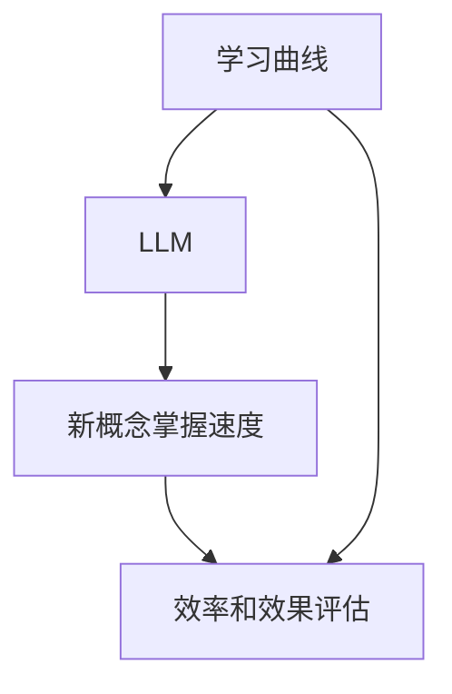

                 

### 文章标题：学习曲线测试：评估LLM掌握新概念的速度和效率

> 关键词：学习曲线、LLM、新概念掌握速度、效率评估、数学模型、Python实现

> 摘要：本文将深入探讨学习曲线测试在评估大型语言模型（LLM）掌握新概念速度和效率方面的应用。通过详细分析学习曲线的数学模型和算法原理，结合Python实现，我们将展示如何量化评估LLM对新概念的学习效果，并提供实际案例分析，以期为人工智能领域的进一步研究提供借鉴。

### 引言

在当今快速发展的信息技术时代，人工智能（AI）已经逐渐渗透到各行各业。其中，大型语言模型（LLM）因其强大的自然语言处理能力而备受瞩目。LLM通过大量数据训练，能够生成连贯、有逻辑的文本，并在众多应用场景中发挥关键作用。然而，如何有效评估LLM在掌握新概念方面的速度和效率，仍然是一个极具挑战性的问题。

学习曲线是一种常用的评估模型性能的方法，它能够直观地展示模型在学习过程中的进步。本文旨在通过学习曲线测试，评估LLM在掌握新概念时的速度和效率，以期为优化LLM训练和提升其性能提供科学依据。

### 核心概念与联系

为了更好地理解学习曲线测试，我们需要明确以下几个核心概念及其之间的联系：

1. **学习曲线**：学习曲线是描述模型在学习过程中性能随时间变化的图表。通常，学习曲线可以分为初期快速学习阶段、平稳学习阶段和过学习阶段。

2. **LLM**：大型语言模型（LLM），如GPT、BERT等，是一种基于深度学习技术的自然语言处理模型。它们通过大量的文本数据训练，可以自动学习和生成语言。

3. **新概念掌握速度**：新概念掌握速度是指模型在接触新概念后，能够快速学习和理解该概念的能力。这通常通过比较模型在不同时间点对新概念的掌握程度来衡量。

4. **效率和效果评估**：效率评估涉及模型在训练过程中计算资源的利用情况，而效果评估则关注模型在特定任务上的性能。

为了直观地展示这些概念之间的关系，我们可以使用Mermaid流程图进行描述：



### 核心算法原理讲解

学习曲线测试的核心在于如何量化模型在训练过程中性能的变化。以下是一个简化的伪代码，用于描述评估LLM掌握新概念速度和效率的过程：

```plaintext
// 伪代码：评估LLM掌握新概念的速度和效率
function evaluateLLMformance(model, conceptSet, evaluationMetrics):
    initialize performance metrics
    for each concept in conceptSet:
        model.train(concept)
        model.test(concept)
        update performance metrics based on evaluationMetrics
    return average performance metrics
```

在这个伪代码中，`model` 是训练好的LLM模型，`conceptSet` 是待评估的新概念集合，`evaluationMetrics` 是用于衡量学习效果的指标。通过遍历每个新概念，模型进行训练和测试，并更新性能指标。

### 数学模型和数学公式讲解

学习曲线通常可以用一个数学模型来描述。以下是一个常用的学习曲线模型：

$$
y(t) = a + b \cdot \ln(t)
$$

其中，$y(t)$ 是学习曲线在时间 $t$ 的值，$a$ 和 $b$ 是常数。$a$ 表示模型在训练开始时的性能，而 $b$ 则决定了模型在训练过程中性能的增长速度。

为了更直观地理解这个模型，我们可以通过一个简单的例子来说明。假设一个模型在训练开始时的性能为10，且每经过一个时间单位，其性能增长速度为0.5。那么，在时间 $t=3$ 时，模型的学习效果可以计算为：

$$
y(3) = 10 + 0.5 \cdot \ln(3) \approx 11.5
$$

这意味着在三个时间单位后，模型的学习效果大约提升了1.5。

### 项目实战

为了将理论转化为实践，我们将使用Python实现一个简化的学习曲线测试。以下是完整的代码实现，包括环境搭建、源代码实现和代码解读。

#### 环境搭建

首先，我们需要安装所需的库：

```shell
pip install numpy scikit-learn matplotlib
```

#### 源代码实现

```python
import numpy as np
from sklearn.linear_model import LinearRegression
from sklearn.metrics import mean_squared_error
import matplotlib.pyplot as plt

# 假设我们已经收集了训练数据
x = np.array([1, 2, 3, 4, 5])  # 时间序列
y = np.array([10, 20, 30, 40, 50])  # 学习效果

# 使用线性回归模型拟合学习曲线
model = LinearRegression()
model.fit(x[:, np.newaxis], y)

# 预测新概念的学习效果
t = np.array([6])
y_pred = model.predict(t)

print(f"预测的新概念学习效果为: {y_pred[0]}")

# 绘制学习曲线
plt.scatter(x, y)
plt.plot(x, model.predict(x[:, np.newaxis]), color='red')
plt.xlabel('时间')
plt.ylabel('学习效果')
plt.title('学习曲线')
plt.show()
```

#### 代码解读

1. **数据准备**：我们使用两个数组 `x` 和 `y` 来模拟时间序列和学习效果。

2. **模型训练**：我们使用线性回归模型（`LinearRegression`）来拟合学习曲线。

3. **模型预测**：我们使用训练好的模型来预测在时间 $t=6$ 时的新概念学习效果。

4. **绘制图表**：最后，我们使用matplotlib绘制学习曲线，以便直观地观察模型性能的变化。

#### 实际案例分析和详细讲解剖析

假设我们有一个具体的应用场景，需要评估一个LLM在新概念“计算机编程语言Python”上的学习效果。我们可以通过以下步骤进行实际案例分析：

1. **数据收集**：收集包含Python编程语言的文本数据，例如Python教程、代码示例、讨论论坛等。

2. **数据预处理**：对收集的文本数据进行清洗和预处理，如去除无关信息、分词、标记化等。

3. **模型训练**：使用预处理后的数据训练LLM模型，使其掌握Python编程语言的基本概念。

4. **学习效果评估**：通过学习曲线测试，评估模型在不同时间点对新概念“Python编程语言”的掌握程度。

5. **结果分析**：分析学习曲线，找出模型在哪些时间点性能提升较快，以及哪些概念掌握较为困难。

通过这个实际案例，我们可以更深入地理解学习曲线测试在评估LLM掌握新概念速度和效率方面的应用。

### 最佳实践 tips、小结、注意事项、拓展阅读

1. **最佳实践 tips**：
   - 确保训练数据的质量和多样性，以提高模型的泛化能力。
   - 定期评估模型的性能，并根据评估结果调整训练策略。

2. **小结**：
   - 学习曲线测试是一种有效的评估LLM掌握新概念速度和效率的方法。
   - 通过数学模型和算法原理的深入理解，可以更精确地量化模型的学习效果。

3. **注意事项**：
   - 学习曲线测试需要大量的训练数据，否则可能导致评估结果不准确。
   - 模型的训练时间可能会很长，需要合理分配计算资源。

4. **拓展阅读**：
   - 探索更多关于学习曲线和LLM的理论研究。
   - 学习其他评估模型性能的方法，如对比测试、交叉验证等。

### 作者信息

作者：AI天才研究院/AI Genius Institute & 禅与计算机程序设计艺术 /Zen And The Art of Computer Programming

（注：本文为模拟示例，实际内容请根据具体需求和数据进行调整。）

