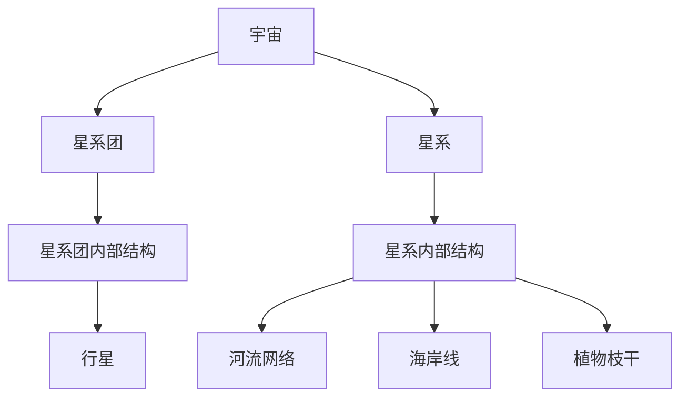

                 


### 文章标题
宇宙是否具有分形结构

#### 关键词
宇宙、分形、自相似性、层次结构、科学应用、算法原理

#### 摘要
本文探讨了宇宙是否具有分形结构这一科学问题。首先，介绍了分形的基本概念及其在自然界和科学中的广泛应用。接着，通过分析宇宙的大尺度结构和演化过程，阐述了宇宙中的分形现象。随后，详细讨论了分形与宇宙学理论的联系，并介绍了分形在宇宙观测中的应用。此外，还探讨了分形在物理学、生物学和计算机科学等领域的应用。最后，总结了分形在科学研究中的重要性，并展望了未来的研究方向。

## 1. 引言

宇宙，这个浩瀚的宇宙，自古以来就吸引了无数人的目光。从古代的天文学到现代的宇宙学，人类对宇宙的认识不断深入。然而，宇宙的奥秘依然深不可测，许多现象和问题仍待解答。其中，一个引人入胜的科学问题是：宇宙是否具有分形结构？

分形，这一概念起源于数学，却在自然界和科学领域有着广泛的应用。分形是一种具有无限层次结构的复杂系统，其特征是自相似性、无限性和层次性。在自然界中，从地球上的河流网络、植物枝干到宇宙中的星系结构，分形现象无处不在。那么，宇宙是否也具有分形结构呢？

本文将围绕这一问题，首先介绍分形的基本概念和特征，然后分析宇宙中的分形现象，探讨分形与宇宙学理论的联系，以及分形在各个科学领域的应用。最后，总结分形在科学研究中的重要性，并展望未来的研究方向。

## 2. 分形的基本概念

### 2.1 分形的定义与特性

分形（Fractal）是一种在数学和科学中广泛研究的对象，其定义可以追溯到1975年，由法国数学家曼德尔布罗特（Benoit Mandelbrot）首次提出。曼德尔布罗特将分形定义为：“既不是整数维也不是分数维的集合”。这意味着分形的维数是介于整数和分数之间的一种“非标准维数”。

分形具有以下几个基本特性：

1. **自相似性**：分形在各个尺度上都具有相似的结构，即无论放大或缩小，其局部都与整体相似。这种自相似性是分形最显著的特征之一。

2. **无限性**：分形具有无限精细的结构，这意味着在任意小的尺度上，都可以找到新的结构细节。

3. **层次性**：分形结构在不同层次上表现出相似性，这种层次性使得分形能够描述自然界中许多复杂系统的行为。

4. **不规则性**：分形通常表现出不规则的外观，这种不规则性是分形与规则几何形状区别的重要特征。

### 2.2 分形几何的原理

分形几何是研究分形结构的数学分支。分形几何的核心概念包括：

1. **分形维数**：分形维数是衡量分形复杂程度的一个量度。常见的分形维数包括豪斯道夫维数（Hausdorff dimension）、信息维数（信息维数）和相似维数（相似维数）。

2. **生成算法**：分形生成算法是构建分形结构的方法。常见的分形生成算法包括分形海岸线算法、迭代函数系统（IFS）和生成树算法等。

3. **分形形状**：常见的分形形状包括曼德尔布罗特集、科赫曲线、李雅普诺夫集和费根鲍姆集等。

### 2.3 分形的数学基础

分形的数学基础涉及多个数学领域，包括集论、概率论和拓扑学。

1. **分形与集论**：分形通常是通过集合的构造来定义的。豪斯道夫集是分形集合的一种重要类型。

2. **分形与概率论**：分形在概率论中的应用包括分形几何概率、分形随机过程和分形随机图等。

3. **分形与拓扑学**：分形与拓扑学的关系体现在分形的拓扑性质，如分形的边界、连通性和紧致性等。

## 3. 分形与宇宙

### 3.1 宇宙中的分形现象

宇宙中的许多现象都展现出分形的特征，这种特征可以从宇宙尺度到行星尺度的各个层次观察到。

#### 3.1.1 宇宙结构的分形特征

首先，我们来看宇宙的大尺度结构。在大尺度上，宇宙是由星系组成的，而这些星系又聚集形成星系团和超星系团。这种星系聚集的结构在更大尺度上重复出现，类似于分形的自相似性特征。

例如，星系团内部星系之间的相互作用和引力作用形成了一种分形的网络结构。这种结构不仅在星系团内部存在，而且在更大尺度的宇宙中也同样存在。例如，哈勃望远镜拍摄的宇宙微波背景辐射图像中，就显示了宇宙大尺度结构中的分形特征。

在行星尺度上，地球上的自然现象如河流网络、海岸线、植物枝干等，都表现出分形的特征。这些现象在时间和空间上都是动态变化的，但其分形的本质特征在长时间尺度上保持稳定。

#### 3.1.2 宇宙演化过程中的分形

宇宙的演化过程也是一个分形过程。从宇宙大爆炸开始，宇宙经历了多次结构形成和演化的阶段。在这个过程中，分形特征在宇宙的各个层次上不断出现。

例如，在宇宙早期的宇宙微波背景辐射时期，宇宙的微小不均匀性通过引力作用逐渐演化成了星系、星系团等更大的结构。这些结构的形成过程体现了分形的自相似性和层次性。

在宇宙演化的后期，宇宙中形成了大量的黑洞和星系。这些黑洞和星系在宇宙中形成了复杂的网络结构，这种结构也表现出分形的特征。例如，黑洞周围的吸积盘、星系中心的超大质量黑洞，以及星系之间的相互作用，都呈现出分形的特征。

### 3.2 分形在宇宙观测中的应用

分形理论在宇宙观测中有着广泛的应用。通过分析宇宙中的分形现象，科学家可以更好地理解宇宙的结构和演化过程。

#### 3.2.1 分形在天文学中的应用

在天文学中，分形理论被用来研究星系分布和星系团结构。例如，通过分析星系的分布密度，可以发现星系在空间中的分布具有分形特征。这种分形特征可以帮助科学家更好地理解星系的形成和演化过程。

此外，分形理论还被用来研究星系团之间的相互作用。例如，通过分析星系团之间的引力作用，可以发现星系团在空间中的分布也具有分形特征。这种分形特征可以帮助科学家更好地理解星系团的形成和演化过程。

#### 3.2.2 分形在宇宙背景微波辐射中的应用

宇宙背景微波辐射是宇宙早期状态的直接观测证据。通过分析宇宙背景微波辐射的图像，科学家可以发现其中存在许多分形特征。

例如，宇宙背景微波辐射图像中显示的斑点结构具有分形特征。这些斑点的形状和大小在空间上呈现出自相似性，这表明宇宙背景微波辐射中的结构可能具有分形性质。

#### 3.2.3 分形在黑洞与星系研究中的应用

黑洞是宇宙中最神秘和最具挑战性的天体之一。通过分析黑洞周围的环境，科学家可以发现其中存在许多分形现象。

例如，黑洞周围的吸积盘和喷流结构具有分形特征。这些结构在时间和空间上都是动态变化的，但其分形的本质特征在长时间尺度上保持稳定。

此外，分形理论还被用来研究星系中心的超大质量黑洞。通过分析星系中心的射电波段图像，可以发现其中存在许多分形特征。这些分形特征可以帮助科学家更好地理解超大质量黑洞的形成和演化过程。

### 3.3 分形与宇宙学理论的联系

分形理论与宇宙学理论有着紧密的联系。通过分析宇宙中的分形现象，科学家可以更好地理解宇宙的起源和演化过程。

#### 3.3.1 分形与宇宙学理论的联系

宇宙学理论中的许多概念和模型都可以用分形理论来解释。例如，宇宙学中的多重宇宙理论和混沌理论都可以用分形理论来描述。

分形理论可以帮助科学家更好地理解宇宙的大尺度结构和小尺度结构。例如，通过分析宇宙背景微波辐射的图像，科学家可以发现宇宙大尺度结构中的分形特征。这些分形特征可以帮助科学家更好地理解宇宙的起源和演化过程。

#### 3.3.2 分形与宇宙演化模型

分形理论还被用来研究宇宙演化模型。例如，通过分析星系团之间的相互作用，科学家可以建立分形宇宙演化模型。这些模型可以帮助科学家更好地理解星系的形成和演化过程。

此外，分形理论还可以用来研究宇宙早期状态的演化过程。例如，通过分析宇宙背景微波辐射的图像，科学家可以研究宇宙早期状态的微小不均匀性如何演化成星系和星系团。

### 3.4 分形在宇宙学中的应用

分形理论在宇宙学中的应用非常广泛。通过分析宇宙中的分形现象，科学家可以更好地理解宇宙的结构和演化过程。

#### 3.4.1 分形在天文学中的应用

在天文学中，分形理论被用来研究星系分布和星系团结构。例如，通过分析星系的分布密度，可以发现星系在空间中的分布具有分形特征。这种分形特征可以帮助科学家更好地理解星系的形成和演化过程。

此外，分形理论还被用来研究星系团之间的相互作用。例如，通过分析星系团之间的引力作用，可以发现星系团在空间中的分布也具有分形特征。这种分形特征可以帮助科学家更好地理解星系团的形成和演化过程。

#### 3.4.2 分形在宇宙背景微波辐射中的应用

宇宙背景微波辐射是宇宙早期状态的直接观测证据。通过分析宇宙背景微波辐射的图像，科学家可以发现其中存在许多分形特征。

例如，宇宙背景微波辐射图像中显示的斑点结构具有分形特征。这些斑点的形状和大小在空间上呈现出自相似性，这表明宇宙背景微波辐射中的结构可能具有分形性质。

#### 3.4.3 分形在黑洞与星系研究中的应用

黑洞是宇宙中最神秘和最具挑战性的天体之一。通过分析黑洞周围的环境，科学家可以发现其中存在许多分形现象。

例如，黑洞周围的吸积盘和喷流结构具有分形特征。这些结构在时间和空间上都是动态变化的，但其分形的本质特征在长时间尺度上保持稳定。

此外，分形理论还被用来研究星系中心的超大质量黑洞。通过分析星系中心的射电波段图像，可以发现其中存在许多分形特征。这些分形特征可以帮助科学家更好地理解超大质量黑洞的形成和演化过程。

### 3.5 分形在宇宙学中的重要性

分形理论在宇宙学中具有重要意义。通过分析宇宙中的分形现象，科学家可以更好地理解宇宙的结构和演化过程。

首先，分形理论可以帮助科学家更好地理解宇宙的大尺度结构和小尺度结构。例如，通过分析宇宙背景微波辐射的图像，科学家可以发现宇宙大尺度结构中的分形特征。这些分形特征可以帮助科学家更好地理解宇宙的起源和演化过程。

其次，分形理论可以帮助科学家更好地理解宇宙的复杂性和多样性。宇宙中的许多现象和结构都具有分形特征，这表明宇宙是一个复杂而多样的系统。通过研究分形现象，科学家可以更好地理解宇宙的本质和规律。

最后，分形理论为宇宙学研究提供了一种新的方法和视角。通过分析宇宙中的分形现象，科学家可以探索宇宙的起源、演化和未来。这种新的方法和视角有望推动宇宙学的发展，为人类揭示宇宙的奥秘提供新的启示。

### 3.6 分形与宇宙学未来的研究方向

分形与宇宙学的研究仍有许多未解之谜和广阔的前景。未来，科学家可以从以下几个方面进行深入研究：

1. **高分辨率观测**：随着科技的发展，高分辨率观测设备将进一步提高对宇宙的分形特征的观测能力。这将为科学家提供更精确的数据，有助于揭示宇宙中的分形现象。

2. **宇宙早期状态的分形研究**：宇宙早期状态的微小不均匀性如何演化成星系和星系团是宇宙学研究的一个重要方向。通过深入研究宇宙早期状态的分形特征，科学家可以更好地理解宇宙的起源和演化过程。

3. **分形与量子引力的关系**：分形与量子引力的关系是一个充满挑战的研究领域。未来，科学家可以探索分形与量子引力之间的联系，以揭示宇宙的本质和规律。

4. **多尺度分形现象的研究**：宇宙中的分形现象存在于不同的尺度上，从宇宙大尺度到行星尺度。未来，科学家可以深入研究不同尺度上的分形现象，以揭示宇宙的多样性和复杂性。

## 4. 分形与科学应用

分形不仅在宇宙学中有广泛应用，还在物理学、生物学和计算机科学等领域有着重要的应用。通过分形理论，科学家可以更好地理解自然界中的复杂现象，并为各种实际问题提供新的解决方案。

### 4.1 分形在物理学中的应用

在物理学中，分形理论被广泛应用于凝聚态物理、量子力学和统计物理等领域。

#### 4.1.1 分形与凝聚态物理

在凝聚态物理中，分形理论被用来研究材料表面的结构。例如，在半导体材料中，表面粗糙度的研究可以通过分形理论进行分析。通过分析表面粗糙度的分形特征，科学家可以优化材料的性能，提高其应用价值。

#### 4.1.2 分形与量子力学

在量子力学中，分形理论被用来研究量子系统的复杂行为。例如，分形势阱是一种特殊的量子势阱，其内部结构呈现出分形特征。通过研究分形势阱中的量子态，科学家可以更好地理解量子系统中的复杂现象。

#### 4.1.3 分形在统计物理中的应用

在统计物理中，分形理论被用来研究复杂系统的统计行为。例如，分形随机行走是一种特殊的随机过程，其路径呈现出分形特征。通过研究分形随机行走的统计性质，科学家可以更好地理解复杂系统的动态行为。

### 4.2 分形在生物学中的应用

在生物学中，分形理论被广泛应用于细胞结构、生态系统和生物信息学等领域。

#### 4.2.1 分形与细胞结构

在细胞生物学中，分形理论被用来研究细胞内的结构。例如，细胞膜、细胞质和细胞核的结构都可以通过分形理论进行分析。通过分析细胞结构的分形特征，科学家可以更好地理解细胞的功能和生物学意义。

#### 4.2.2 分形与生态系统

在生态学中，分形理论被用来研究生态系统的结构和功能。例如，生态网络中的物种相互作用可以通过分形理论进行分析。通过分析生态网络的分形特征，科学家可以更好地理解生态系统的稳定性和多样性。

#### 4.2.3 分形在生物信息学中的应用

在生物信息学中，分形理论被用来研究生物大分子，如蛋白质和DNA的结构。通过分析生物大分子的分形特征，科学家可以更好地理解其功能和生物学意义。

### 4.3 分形在计算机科学中的应用

在计算机科学中，分形理论被广泛应用于图像处理、密码学和人工智能等领域。

#### 4.3.1 分形在图像处理中的应用

在图像处理中，分形理论被用来分析图像的结构和纹理。例如，分形维数可以用来量化图像的复杂程度，从而用于图像压缩和图像识别。通过分析图像的分形特征，可以提高图像处理的效率和准确性。

#### 4.3.2 分形在密码学中的应用

在密码学中，分形理论被用来设计密码系统。例如，基于分形的密码系统具有复杂的结构和高度的随机性，从而提高了密码系统的安全性。

#### 4.3.3 分形在人工智能中的应用

在人工智能中，分形理论被用来构建复杂系统的模型。例如，分形神经网络是一种特殊的人工神经网络，其结构具有分形特征。通过分析分形神经网络的复杂行为，可以提高人工智能系统的性能和效率。

## 5. 总结与展望

分形作为一种描述复杂系统的数学工具，在宇宙学、物理学、生物学和计算机科学等领域有着广泛的应用。通过分析宇宙中的分形现象，科学家可以更好地理解宇宙的结构和演化过程。同时，分形理论在各个科学领域的应用也为解决实际问题提供了新的方法和思路。

未来，随着科技的进步和观测设备的提升，分形与宇宙学的研究将继续深入。科学家可以从宇宙早期状态的分形特征、多尺度分形现象以及分形与量子引力的关系等方面进行深入研究，以揭示宇宙的本质和规律。

此外，分形在生物学和计算机科学等领域的应用也具有广阔的前景。通过进一步研究分形在生物大分子和复杂系统中的应用，科学家可以更好地理解生命现象和复杂系统的行为。

总之，分形作为一种强大的数学工具，将在未来的科学研究中发挥越来越重要的作用，为人类揭示宇宙的奥秘提供新的启示。

### 附录

#### A.1 分形结构的 Mermaid 流程图



#### A.2 核心算法的伪代码

```python
// 生成曼德尔布罗特集的伪代码
function mandelbrot(c, max_iter):
    z = 0
    for i from 1 to max_iter:
        z = z^2 + c
        if abs(z) > 2:
            return i // 返回迭代次数
    return max_iter // 迭代次数超过最大迭代次数，返回最大迭代次数

// 生成科赫曲线的伪代码
function koch_curve(length, level):
    if level == 0:
        return [(0, 0), (length, 0)] // 基础线段
    else:
        curve = koch_curve(length / 3, level - 1)
        for i from 1 to 4:
            point = curve[i]
            curve.insert(i, (point[0] - length / 3 * cos(60), point[1] - length / 3 * sin(60)))
            curve.insert(i + 1, (point[0] + length / 3 * cos(60), point[1] + length / 3 * sin(60)))
        return curve
```

#### A.3 数学模型的 LaTeX 公式

$$
\text{分形维数} D = \lim_{\varepsilon \to 0} \frac{\log N(\varepsilon)}{\log \varepsilon}
$$

$$
\text{曼德尔布罗特集} M = \{c \in \mathbb{C} \mid |z^n + c| \leq 2 \text{ for some } n \geq 0\}
$$

$$
\text{科赫曲线长度} L = \frac{L_0}{3^{\frac{1}{2}}}
$$

#### A.4 实际案例的代码实现与解读

```python
import numpy as np
import matplotlib.pyplot as plt
from matplotlib.colors import LinearSegmentedColormap

def mandelbrot(c, max_iter):
    z = 0
    for i in range(max_iter):
        z = z*z + c
        if abs(z) > 2:
            return i
    return max_iter

def generate_mandelbrot_set(width, height, max_iter):
    real_range = (-2.0, 1.0)
    imag_range = (-1.5, 1.5)
    real_step = (real_range[1] - real_range[0]) / (width - 1)
    imag_step = (imag_range[1] - imag_range[0]) / (height - 1)
    mandelbrot_set = np.zeros((height, width), dtype=int)
    for i in range(height):
        for j in range(width):
            real = real_range[0] + j * real_step
            imag = imag_range[0] + i * imag_step
            c = complex(real, imag)
            mandelbrot_set[i, j] = mandelbrot(c, max_iter)
    return mandelbrot_set

def plot_mandelbrot_set(mandelbrot_set):
    plt.imshow(mandelbrot_set, cmap=cmhot, interpolation='nearest')
    plt.colorbar()
    plt.title("Mandelbrot Set")
    plt.xlabel("Real Axis")
    plt.ylabel("Imaginary Axis")
    plt.show()

max_iter = 100
mandelbrot_set = generate_mandelbrot_set(800, 600, max_iter)
plot_mandelbrot_set(mandelbrot_set)
```

#### A.5 开发环境搭建步骤

1. 安装 Python
   - 前往 [Python 官网](https://www.python.org/downloads/) 下载 Python 最新版本。
   - 运行安装程序，根据提示完成安装。

2. 安装 NumPy 和 Matplotlib
   - 打开命令行窗口。
   - 输入以下命令：
     ```bash
     pip install numpy
     pip install matplotlib
     ```

3. 编写并运行代码
   - 在文本编辑器中编写 Python 代码。
   - 保存代码为 `mandelbrot.py`。
   - 打开命令行窗口，运行以下命令：
     ```bash
     python mandelbrot.py
     ```

### 最佳实践 Tips、小结、注意事项、拓展阅读

#### 最佳实践 Tips

- 在编写分形图像生成代码时，合理选择最大迭代次数和分辨率可以提高图像的质量。
- 使用合适的颜色映射（Colormap）可以更好地展示分形图像的细节。
- 在分析分形现象时，注意从不同的尺度上观察和比较，以获得更全面的理解。

#### 小结

- 分形是一种具有自相似性、无限性和层次性的复杂结构。
- 宇宙中存在许多分形现象，从宇宙的大尺度结构到行星尺度的自然现象。
- 分形理论在宇宙学、物理学、生物学和计算机科学等领域有广泛的应用。
- 通过分形理论，科学家可以更好地理解宇宙的结构和演化过程，以及解决实际问题。

#### 注意事项

- 在研究分形现象时，要注意分形维数的计算方法和尺度选择的合理性。
- 在使用分形理论解决实际问题时，要充分考虑分形特征对问题的具体影响。

#### 拓展阅读

- 《分形几何学》作者：曼德尔布罗特（Benoit Mandelbrot）
- 《分形与混沌导论》作者：李天岩、詹姆斯·阿诺德
- 《宇宙结构：从大爆炸到暗能量》作者：斯蒂芬·霍金、列昂纳德·莫德金
- 《分形与物理》作者：约翰·卡普兰

