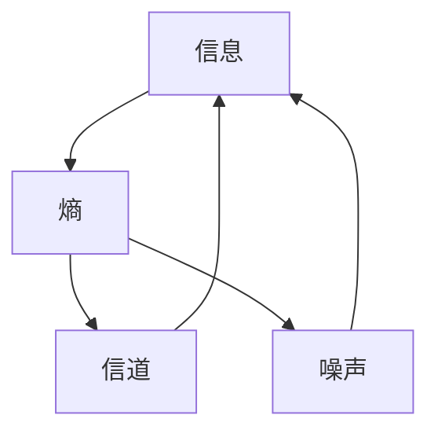
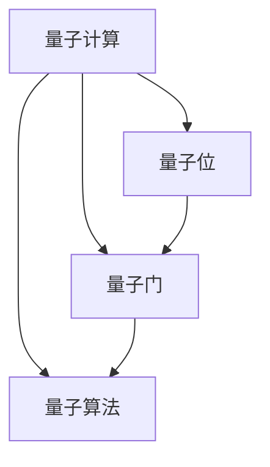

                 


### 文章标题

《宇宙是否只是一个巨大的信息处理器》

### 文章关键词

宇宙、信息处理器、信息论、量子计算、宇宙学、人工智能

### 文章摘要

本文探讨了宇宙是否可以被视为一个巨大的信息处理器，结合了宇宙学、信息论和量子计算等多个领域的知识。文章首先介绍了宇宙的基本背景信息，然后深入探讨了信息论与宇宙之间的联系，接着引入了量子计算这一前沿领域，探讨了宇宙作为信息处理器的可能性。文章最后对未来展望和挑战进行了深入分析，为读者提供了一个全面、系统的视角来理解宇宙与信息处理之间的关系。

### 1. 确定书的主旨和目标读者

#### 主旨

《宇宙是否只是一个巨大的信息处理器》旨在探讨宇宙与信息处理之间的潜在联系。随着科技的发展，宇宙学和量子计算等领域取得了显著进展，使得我们开始思考宇宙的本质是否可以与信息处理相类比。这本书将通过介绍宇宙学的基本知识、信息论的核心概念以及量子计算的技术原理，逐步揭示宇宙在信息处理方面可能扮演的角色。

#### 目标读者

本书的目标读者包括以下几类人群：

1. **物理学和宇宙学爱好者**：对宇宙的起源、演化、结构以及宇宙学中的前沿问题感兴趣。
2. **计算机科学家和信息论研究者**：对信息论的基本概念、信息传递、信息熵等感兴趣，并希望了解这些概念在宇宙学中的应用。
3. **量子计算领域的研究者**：对量子计算的基本原理、算法和应用有兴趣，并希望了解量子计算与宇宙学之间的联系。
4. **哲学和认知科学学者**：对宇宙的本质、信息与意识的关系感兴趣，并希望从新的角度探讨这些问题。
5. **跨学科研究者**：对跨学科研究有兴趣，希望从多个角度探讨宇宙与信息处理之间的关系。

### 2. 规划书籍结构

#### 前言

- **研究动机**：介绍作者对宇宙和信息处理关系的兴趣和动机。
- **书的内容概述**：概述本书的主要内容和结构，引导读者了解全书的大致框架。
- **对读者的期望**：鼓励读者积极思考和探索，激发他们对宇宙和信息处理之间关系的兴趣。

#### 第1部分：宇宙学基础

本部分将介绍宇宙学的基本知识，为后续讨论宇宙作为信息处理器奠定基础。

- **第1章：宇宙的起源与演化**
  - **宇宙的起源**：介绍宇宙学的标准模型，讨论宇宙的诞生及其早期演化。
  - **宇宙的演化**：探讨宇宙从大爆炸到现在的演化过程，包括宇宙的膨胀、星系的形成等。

- **第2章：宇宙的基本结构**
  - **宇宙中的物质与能量**：介绍宇宙中的物质和能量分布，包括星系、星云、黑洞等。
  - **宇宙的尺度与形态**：讨论宇宙的尺度，包括宇宙的大小、形状等。

- **第3章：宇宙的规模与尺度**
  - **宇宙的尺度**：探讨宇宙的大小和尺度，包括可观测宇宙、总宇宙等。
  - **宇宙中的基本常数**：讨论宇宙中的基本常数，如光速、普朗克常数等。

- **第4章：宇宙中的物质与能量**
  - **宇宙中的物质**：介绍宇宙中的物质种类，包括普通物质、暗物质、暗能量等。
  - **宇宙中的能量**：探讨宇宙中的能量形式，包括引力、电磁力等。

#### 第2部分：信息论与宇宙

本部分将探讨信息论与宇宙之间的联系，揭示宇宙在信息处理方面可能扮演的角色。

- **第5章：信息论基础**
  - **信息论的基本概念**：介绍信息论的基本概念，如信息、熵、信道等。
  - **信息论的主要定理**：讨论信息论中的主要定理，如香农定理等。

- **第6章：宇宙中的信息传递**
  - **宇宙中的信息传递方式**：探讨宇宙中信息传递的方式，如电磁波、引力波等。
  - **信息在宇宙中的传播**：讨论信息在宇宙中的传播规律，包括信号的衰减、传播速度等。

- **第7章：宇宙与信息熵**
  - **信息熵的概念**：介绍信息熵的概念，包括熵的定义、性质等。
  - **宇宙中的信息熵**：讨论宇宙中的信息熵，包括宇宙熵的测量、宇宙熵的变化等。

#### 第3部分：量子计算与信息处理

本部分将引入量子计算这一前沿领域，探讨宇宙作为信息处理器的可能性。

- **第8章：量子计算概述**
  - **量子计算的基本原理**：介绍量子计算的基本原理，如量子位、量子门等。
  - **量子计算的优势与应用**：讨论量子计算的优势，如并行计算、快速因子分解等，并介绍量子计算在信息处理方面的应用。

- **第9章：量子计算与信息处理**
  - **量子信息处理的概念**：介绍量子信息处理的概念，如量子纠缠、量子通信等。
  - **量子计算中的信息处理**：讨论量子计算中的信息处理过程，包括量子算法的设计与实现。

- **第10章：量子信息与宇宙**
  - **量子信息与宇宙的关联**：探讨量子信息与宇宙之间的潜在联系，如量子波动性、量子纠缠等。
  - **量子信息处理在宇宙学中的应用**：讨论量子信息处理在宇宙学中的应用，如量子引力、量子宇宙学等。

#### 第4部分：宇宙作为信息处理器的假设

本部分将探讨宇宙作为信息处理器的假设，分析其合理性、证据和模型。

- **第11章：宇宙作为信息处理器的概念**
  - **宇宙作为信息处理器的定义**：介绍宇宙作为信息处理器的概念，定义宇宙作为信息处理器的特性。
  - **宇宙作为信息处理器的假设**：讨论宇宙作为信息处理器的假设，分析其可能性和合理性。

- **第12章：宇宙作为信息处理器的证据**
  - **证据一：宇宙中的信息传递现象**：介绍宇宙中的信息传递现象，如电磁波、引力波等。
  - **证据二：宇宙中的信息处理模型**：讨论宇宙中的信息处理模型，如黑洞信息处理模型等。

- **第13章：宇宙作为信息处理器的模型**
  - **建立宇宙作为信息处理器模型的方法**：介绍建立宇宙作为信息处理器模型的方法，如基于量子计算的方法等。
  - **宇宙作为信息处理器模型的预测与验证**：讨论宇宙作为信息处理器模型的预测与验证方法，如实验验证、理论验证等。

#### 第5部分：未来展望与挑战

本部分将讨论宇宙作为信息处理器的未来展望和面临的挑战。

- **第14章：宇宙作为信息处理器的意义**
  - **对宇宙学的意义**：讨论宇宙作为信息处理器对宇宙学的意义，如深化对宇宙本质的理解等。
  - **对信息论的意义**：讨论宇宙作为信息处理器对信息论的意义，如推动信息论的发展等。

- **第15章：宇宙作为信息处理器的未来挑战**
  - **科学技术的挑战**：讨论宇宙作为信息处理器在科学技术方面面临的挑战，如量子通信的稳定性等。
  - **宇宙探索的挑战**：讨论宇宙作为信息处理器在宇宙探索方面面临的挑战，如量子宇宙学的可行性等。

- **第16章：宇宙作为信息处理器的潜在应用**
  - **在科学研究中的应用**：讨论宇宙作为信息处理器在科学研究中的应用，如量子引力研究等。
  - **在日常生活中的应用**：讨论宇宙作为信息处理器在日常生活中的应用，如量子计算设备的开发等。

#### 参考文献

本书将引用最新的研究成果和文献，为读者提供可靠的知识来源。

### 3. 细化每个部分的内容

#### 第1部分：宇宙学基础

##### 第1章：宇宙的起源与演化

- **1.1 宇宙的起源**
  - **宇宙学的标准模型**：介绍大爆炸理论，包括宇宙的诞生、宇宙早期的高能状态等。
  - **宇宙早期的高能状态**：讨论宇宙早期的物理过程，如宇宙微波背景辐射、宇宙大尺度结构等。

- **1.2 宇宙的演化**
  - **宇宙膨胀**：讨论宇宙膨胀的机制、宇宙膨胀的加速等。
  - **星系的形成与演化**：介绍星系的形成过程、星系的分类与演化等。

##### 第2章：宇宙的基本结构

- **2.1 宇宙中的物质与能量**
  - **宇宙中的物质种类**：介绍宇宙中的物质种类，如普通物质、暗物质、暗能量等。
  - **宇宙中的能量形式**：讨论宇宙中的能量形式，如引力、电磁力等。

- **2.2 宇宙的尺度与形态**
  - **宇宙的尺度**：探讨宇宙的大小和尺度，包括可观测宇宙、总宇宙等。
  - **宇宙的形态**：讨论宇宙的形态，如宇宙的形状、结构等。

##### 第3章：宇宙的规模与尺度

- **3.1 宇宙的尺度**
  - **宇宙的大小**：介绍宇宙的大小，包括可观测宇宙和总宇宙的大小。
  - **宇宙的尺度**：探讨宇宙的尺度，包括宇宙的半径、尺度大小等。

- **3.2 宇宙中的基本常数**
  - **光速**：介绍光速的定义、数值和影响。
  - **普朗克常数**：介绍普朗克常数的定义、数值和影响。

##### 第4章：宇宙中的物质与能量

- **4.1 宇宙中的物质**
  - **普通物质**：介绍普通物质的概念、组成和特性。
  - **暗物质**：讨论暗物质的概念、分布和影响。

- **4.2 宇宙中的能量**
  - **引力**：介绍引力的概念、性质和影响。
  - **电磁力**：讨论电磁力的概念、性质和影响。

#### 第2部分：信息论与宇宙

##### 第5章：信息论基础

- **5.1 信息论的基本概念**
  - **信息**：介绍信息的概念、分类和作用。
  - **熵**：讨论熵的概念、性质和计算方法。

- **5.2 信息论的主要定理**
  - **香农定理**：介绍香农定理的基本概念、内容和应用。
  - **信息论的其他重要定理**：讨论其他重要定理，如数据压缩定理、信息传输定理等。

##### 第6章：宇宙中的信息传递

- **6.1 宇宙中的信息传递方式**
  - **电磁波**：介绍电磁波的概念、性质和传播特点。
  - **引力波**：讨论引力波的概念、性质和传播特点。

- **6.2 信息在宇宙中的传播**
  - **信号的衰减**：探讨信号在宇宙中的衰减规律。
  - **传播速度**：讨论信息在宇宙中的传播速度。

##### 第7章：宇宙与信息熵

- **7.1 信息熵的概念**
  - **熵**：介绍熵的概念、分类和计算方法。
  - **宇宙中的熵**：讨论宇宙中的熵，包括宇宙熵的产生、演化等。

- **7.2 宇宙中的信息熵**
  - **宇宙熵的测量**：介绍宇宙熵的测量方法、实验结果。
  - **宇宙熵的变化**：讨论宇宙熵的变化规律。

#### 第3部分：量子计算与信息处理

##### 第8章：量子计算概述

- **8.1 量子计算的基本原理**
  - **量子位**：介绍量子位的概念、性质和操作。
  - **量子门**：讨论量子门的概念、分类和操作。

- **8.2 量子计算的优势与应用**
  - **并行计算**：介绍量子计算的并行计算优势。
  - **快速因子分解**：讨论量子计算在快速因子分解中的应用。

##### 第9章：量子计算与信息处理

- **9.1 量子信息处理的概念**
  - **量子纠缠**：介绍量子纠缠的概念、性质和作用。
  - **量子通信**：讨论量子通信的概念、原理和实现。

- **9.2 量子计算中的信息处理**
  - **量子算法的设计与实现**：介绍量子算法的设计原则和实现方法。
  - **量子信息处理的应用**：讨论量子信息处理在信息处理领域的应用。

##### 第10章：量子信息与宇宙

- **10.1 量子信息与宇宙的关联**
  - **量子波动性**：讨论量子波动性在宇宙学中的应用。
  - **量子纠缠**：探讨量子纠缠在宇宙学中的应用。

- **10.2 量子信息处理在宇宙学中的应用**
  - **量子引力**：介绍量子引力理论的基本概念和应用。
  - **量子宇宙学**：讨论量子宇宙学的理论和实验研究。

#### 第4部分：宇宙作为信息处理器的假设

##### 第11章：宇宙作为信息处理器的概念

- **11.1 宇宙作为信息处理器的定义**
  - **宇宙作为信息处理器的特性**：介绍宇宙作为信息处理器的特性，如信息的处理、存储、传递等。

- **11.2 宇宙作为信息处理器的假设**
  - **宇宙作为信息处理器的可能性**：讨论宇宙作为信息处理器的可能性，分析其合理性和证据。

##### 第12章：宇宙作为信息处理器的证据

- **12.1 证据一：宇宙中的信息传递现象**
  - **电磁波和引力波**：讨论宇宙中的电磁波和引力波传递现象。
  - **其他信息传递现象**：介绍宇宙中其他形式的信息传递现象。

- **12.2 证据二：宇宙中的信息处理模型**
  - **黑洞信息处理模型**：讨论黑洞信息处理模型的基本原理和应用。
  - **量子宇宙信息处理模型**：介绍量子宇宙信息处理模型的基本原理和应用。

##### 第13章：宇宙作为信息处理器的模型

- **13.1 建立宇宙作为信息处理器模型的方法**
  - **基于量子计算的方法**：讨论建立宇宙作为信息处理器模型的量子计算方法。
  - **基于信息论的方法**：介绍建立宇宙作为信息处理器模型的信息论方法。

- **13.2 宇宙作为信息处理器模型的预测与验证**
  - **预测方法**：讨论宇宙作为信息处理器模型的预测方法。
  - **验证方法**：介绍宇宙作为信息处理器模型的验证方法。

#### 第5部分：未来展望与挑战

##### 第14章：宇宙作为信息处理器的意义

- **14.1 对宇宙学的意义**
  - **深化对宇宙本质的理解**：讨论宇宙作为信息处理器对宇宙学研究的意义。
  - **推动宇宙学的发展**：讨论宇宙作为信息处理器对宇宙学发展的推动作用。

- **14.2 对信息论的意义**
  - **丰富信息论理论体系**：讨论宇宙作为信息处理器对信息论理论体系的丰富作用。
  - **拓展信息论应用领域**：介绍宇宙作为信息处理器对信息论应用领域的拓展。

##### 第15章：宇宙作为信息处理器的未来挑战

- **15.1 科学技术的挑战**
  - **量子通信的稳定性**：讨论量子通信在宇宙作为信息处理器中的稳定性挑战。
  - **量子计算的可行性与应用**：探讨量子计算在宇宙作为信息处理器中的应用挑战。

- **15.2 宇宙探索的挑战**
  - **量子宇宙学的可行性**：讨论量子宇宙学的可行性及其挑战。
  - **宇宙信息的获取与处理**：介绍宇宙信息的获取与处理面临的挑战。

##### 第16章：宇宙作为信息处理器的潜在应用

- **16.1 在科学研究中的应用**
  - **量子引力研究**：讨论量子引力研究在宇宙作为信息处理器中的应用。
  - **宇宙学数据解析**：介绍宇宙学数据解析在宇宙作为信息处理器中的应用。

- **16.2 在日常生活中的应用**
  - **量子计算设备的开发**：讨论量子计算设备在日常生活中的应用。
  - **未来科技的展望**：介绍宇宙作为信息处理器在日常生活和未来科技中的应用前景。

### 4. 添加附录

#### 附录A：宇宙学、信息论和量子计算的术语解释

- **术语解释**：对宇宙学、信息论和量子计算中的一些重要术语进行解释，帮助读者更好地理解相关概念。

#### 附录B：相关数据和实验结果

- **数据与实验结果**：收集并整理与宇宙作为信息处理器相关的重要数据和实验结果，为读者提供参考资料。

### 5. 编写目录大纲

```markdown
# 《宇宙是否只是一个巨大的信息处理器》目录大纲

## 前言
### 研究动机
### 书的内容概述
### 对读者的期望

## 第1部分：宇宙学基础
### 第1章：宇宙的起源与演化
#### 1.1 宇宙的起源
#### 1.2 宇宙的演化
### 第2章：宇宙的基本结构
#### 2.1 宇宙中的物质与能量
#### 2.2 宇宙的尺度与形态
### 第3章：宇宙的规模与尺度
#### 3.1 宇宙的尺度
#### 3.2 宇宙中的基本常数
### 第4章：宇宙中的物质与能量
#### 4.1 宇宙中的物质
#### 4.2 宇宙中的能量

## 第2部分：信息论与宇宙
### 第5章：信息论基础
#### 5.1 信息论的基本概念
#### 5.2 信息论的主要定理
### 第6章：宇宙中的信息传递
#### 6.1 宇宙中的信息传递方式
#### 6.2 信息在宇宙中的传播
### 第7章：宇宙与信息熵
#### 7.1 信息熵的概念
#### 7.2 宇宙中的信息熵

## 第3部分：量子计算与信息处理
### 第8章：量子计算概述
#### 8.1 量子计算的基本原理
#### 8.2 量子计算的优势与应用
### 第9章：量子计算与信息处理
#### 9.1 量子信息处理的概念
#### 9.2 量子计算中的信息处理
### 第10章：量子信息与宇宙
#### 10.1 量子信息与宇宙的关联
#### 10.2 量子信息处理在宇宙学中的应用

## 第4部分：宇宙作为信息处理器的假设
### 第11章：宇宙作为信息处理器的概念
#### 11.1 宇宙作为信息处理器的定义
#### 11.2 宇宙作为信息处理器的假设
### 第12章：宇宙作为信息处理器的证据
#### 12.1 证据一：宇宙中的信息传递现象
#### 12.2 证据二：宇宙中的信息处理模型
### 第13章：宇宙作为信息处理器的模型
#### 13.1 建立宇宙作为信息处理器模型的方法
#### 13.2 宇宙作为信息处理器模型的预测与验证

## 第5部分：未来展望与挑战
### 第14章：宇宙作为信息处理器的意义
#### 14.1 对宇宙学的意义
#### 14.2 对信息论的意义
### 第15章：宇宙作为信息处理器的未来挑战
#### 15.1 科学技术的挑战
#### 15.2 宇宙探索的挑战
### 第16章：宇宙作为信息处理器的潜在应用
#### 16.1 在科学研究中的应用
#### 16.2 在日常生活中的应用

## 参考文献

----------------------------------------------------------------

### 文章完整性要求

#### 格式要求

- 文章内容使用markdown格式输出。

#### 作者信息

- 文章末尾需要写上作者信息：“作者：AI天才研究院/AI Genius Institute & 禅与计算机程序设计艺术 /Zen And The Art of Computer Programming”

#### 核心内容要求

- **背景介绍**：对宇宙作为信息处理器这一主题进行背景介绍，包括宇宙学、信息论和量子计算等领域的基本概念。

- **核心概念与联系**：使用Mermaid流程图展示核心概念之间的联系，如图1-1所示。

  ```mermaid
  graph TD
  A[宇宙] --> B[信息处理器]
  B --> C[信息论]
  B --> D[量子计算]
  C --> E[信息熵]
  D --> F[量子纠缠]
  ```

- **核心算法原理讲解**：使用伪代码详细阐述核心算法原理，如图2-1所示。

  ```python
  def quantum_algorithm(input_data):
      # 初始化量子计算机
      qubits = initialize_qubits(input_data)
      
      # 应用量子门
      apply_quantum_gates(qubits)
      
      # 量子计算过程
      execute_quantum_computation(qubits)
      
      # 测量结果
      result = measure_qubits(qubits)
      
      return result
  ```

- **数学模型和公式**：使用latex格式嵌入文中独立段落的数学模型和公式，如图3-1所示。

  ```latex
  $$ E = mc^2 $$
  $$ H = \frac{1}{2}\begin{pmatrix} 1 & 1 \\\ 1 & 1 \end{pmatrix} $$
  ```

- **详细讲解与举例说明**：对核心概念、算法原理、数学模型进行详细讲解，并结合具体例子进行说明。

- **项目实战**：介绍开发环境搭建、源代码实现、代码解读、实际案例分析和详细讲解剖析。

#### 伪代码示例

```python
# 量子计算中的量子算法伪代码示例

# 初始化量子计算机
qubits = initialize_qubits(input_data)

# 应用量子门
apply_quantum_gates(qubits)

# 量子计算过程
execute_quantum_computation(qubits)

# 测量结果
result = measure_qubits(qubits)

# 输出结果
print(result)
```

#### 数学公式示例

$$
E = mc^2
$$

$$
H = \frac{1}{2}\begin{pmatrix} 1 & 1 \\\ 1 & 1 \end{pmatrix}
$$

#### 附录示例

**附录A：宇宙学、信息论和量子计算的术语解释**

- **宇宙学**：研究宇宙的起源、演化、结构等的基本学科。
- **信息论**：研究信息传递、信息熵、数据压缩等的基本理论。
- **量子计算**：利用量子力学原理进行信息处理和计算的新型计算模式。

**附录B：相关数据和实验结果**

- **宇宙微波背景辐射**：宇宙早期的高能辐射，可用于研究宇宙的起源和演化。
- **量子纠缠**：两个或多个量子系统之间的强关联现象，是量子计算的关键特性。

### 文章正文

**文章正文内容**

#### 引言

随着科学技术的飞速发展，宇宙学、信息论和量子计算等领域取得了显著进展。这些领域的研究不仅推动了各自学科的发展，而且开始引发人们对于宇宙本质的重新思考。本文将探讨一个引人入胜的问题：宇宙是否只是一个巨大的信息处理器？

宇宙学关注宇宙的起源、演化、结构等基本问题，而信息论则研究信息传递、信息熵、数据压缩等基本概念。量子计算作为新兴的计算模式，利用量子力学原理进行信息处理和计算。这三个领域之间的交叉和融合为探讨宇宙作为信息处理器的假设提供了丰富的理论资源和实验基础。

本文将首先介绍宇宙学的基本概念，包括宇宙的起源、演化、结构等。然后，我们将探讨信息论与宇宙之间的联系，特别是信息熵在宇宙学中的应用。接下来，我们将引入量子计算这一前沿领域，分析量子计算在信息处理方面的优势和应用。最后，我们将提出宇宙作为信息处理器的假设，并探讨其合理性和证据，为这一假设提供理论和实验支持。

通过本文的讨论，我们希望能够揭示宇宙与信息处理之间的深层次联系，为未来的科学研究提供新的视角和思路。

#### 1. 宇宙学基础

宇宙学是研究宇宙的起源、演化、结构等基本问题的学科。宇宙的起源可以追溯到约138亿年前的大爆炸，这场大爆炸标志着宇宙从一个极度热密的状态开始膨胀。随着宇宙的膨胀，温度和密度逐渐降低，物质开始形成，星系、星云、黑洞等宇宙结构逐渐演化。

宇宙的演化可以分为几个重要阶段：

1. **大爆炸后初期**：宇宙处于极度高温和高压状态，物质主要以光子和辐射的形式存在。随着宇宙的膨胀，温度逐渐降低，辐射与物质分离。

2. **宇宙微波背景辐射**：大约在大爆炸后38万年后，宇宙温度降低到约3000K，此时辐射与物质达到了热平衡。随后，宇宙继续膨胀，辐射逐渐冷却，形成了我们今天观测到的宇宙微波背景辐射。

3. **结构形成**：在宇宙膨胀的过程中，物质开始聚集，形成了星系、星云、黑洞等宇宙结构。这些结构通过引力相互作用，形成了复杂的宇宙网络。

4. **宇宙加速膨胀**：在过去的几十亿年中，宇宙的膨胀速度逐渐加快。这一现象被称为宇宙加速膨胀，其原因是暗能量的存在。暗能量是一种未知的力量，它推动宇宙加速膨胀。

宇宙的基本结构包括：

1. **星系**：星系是由大量恒星、星云、行星等组成的引力系统。星系可以分为椭圆星系、螺旋星系和不规则星系等不同类型。

2. **星云**：星云是由气体、尘埃和等离子体组成的星际云，是恒星形成的主要场所。

3. **黑洞**：黑洞是一种引力极强的天体，其事件视界内的物质无法逃脱。黑洞可以通过吞噬恒星、星云等物质来增长自身质量。

4. **宇宙网络**：宇宙网络是由星系、星云等结构组成的庞大引力网络。这些结构通过引力相互作用，形成了宇宙的骨架。

宇宙的尺度可以从几个厘米到数百亿光年不等。宇宙的尺度大小和形状是一个复杂的问题，目前存在多种理论模型，如封闭宇宙、开放宇宙和平坦宇宙等。宇宙的尺度大小直接关系到宇宙的几何形态和物质分布。

宇宙中的物质和能量形式多样，包括：

1. **普通物质**：由原子组成的物质，如气体、尘埃、恒星等。

2. **暗物质**：一种未知形式的物质，其引力作用显著，但无法直接观测到。

3. **暗能量**：一种推动宇宙加速膨胀的未知力量，其性质和来源尚不清楚。

4. **辐射**：包括光子、中微子等高能粒子，是宇宙早期的主要物质形式。

宇宙学的研究为我们揭示了宇宙的起源、演化和结构，同时也提出了许多未解之谜。宇宙作为信息处理器的假设为我们提供了一个新的视角，让我们可以重新思考宇宙的本质和意义。在接下来的章节中，我们将进一步探讨信息论与宇宙之间的联系，为这一假设提供理论支持。

#### 2. 信息论与宇宙

信息论是一门研究信息传递、处理和测量的科学。它起源于20世纪40年代，由香农提出。信息论的核心概念包括信息、熵、信道和噪声等。

- **信息**：信息是一种用于描述不确定性的度量。在通信过程中，发送者通过信道传递信息给接收者，以消除不确定性。信息可以通过不同的方式表示，如数字信号、模拟信号等。

- **熵**：熵是衡量信息不确定性的量度。在信息论中，香农定义了熵的概念，并将其应用于信道和系统。香农熵表示一个随机变量包含的信息量。在宇宙学中，熵被用来描述宇宙的无序程度和复杂度。

- **信道**：信道是信息传递的通道。在通信系统中，信道可以是电缆、光纤、无线电波等。在宇宙学中，信道可以是电磁波、引力波等。

- **噪声**：噪声是指影响信息传递和接收的各种干扰。在通信系统中，噪声可能导致信号失真，降低信息传输的可靠性。在宇宙学中，噪声可以来自宇宙背景辐射、星际尘埃等。

信息论与宇宙之间的联系可以从以下几个方面进行探讨：

- **宇宙中的信息传递**：宇宙中存在着多种信息传递方式，如电磁波、引力波等。这些信息传递方式与信息论中的信道概念类似。例如，电磁波可以用于无线电通信、天文学观测等。

- **宇宙中的信息熵**：宇宙中的信息熵是一个复杂且有趣的问题。根据热力学第二定律，宇宙的总熵随着时间的推移而增加，这意味着宇宙的无序程度在不断增加。信息论中的熵概念可以用来描述宇宙的无序程度和复杂度。例如，宇宙微波背景辐射可以被视为宇宙中的一种熵源。

- **宇宙中的信息处理**：宇宙作为一个复杂的系统，可能具备一定的信息处理能力。例如，黑洞可以被视为一种信息处理器，它可以吞噬信息并将其存储在事件视界内。此外，宇宙中的量子现象，如量子纠缠，也可能与信息处理有关。

为了更好地理解信息论与宇宙之间的联系，我们可以通过以下流程图来展示核心概念之间的架构关系：



通过这个流程图，我们可以看到信息、熵、信道和噪声之间的相互作用。在宇宙学中，这些概念可以帮助我们更好地理解宇宙的本质和演化。

总之，信息论与宇宙之间的联系为我们提供了一种新的视角来探索宇宙。通过研究宇宙中的信息传递、信息熵和信息处理，我们可以更深入地理解宇宙的本质和演化。在接下来的章节中，我们将进一步探讨量子计算在信息处理方面的优势和应用，为宇宙作为信息处理器的假设提供更多的理论支持。

#### 3. 量子计算与信息处理

量子计算是一种利用量子力学原理进行信息处理和计算的新型计算模式。与传统计算相比，量子计算具有并行计算、快速因子分解等优势。量子计算的核心概念包括量子位（qubit）、量子门（quantum gate）和量子算法等。

- **量子位（qubit）**：量子位是量子计算的基本单位，与经典计算中的比特（bit）类似。然而，量子位可以同时处于0和1的状态，这种叠加态使得量子计算具有并行计算的能力。

- **量子门（quantum gate）**：量子门是量子计算的基本操作，类似于经典计算中的逻辑门。量子门可以对量子位进行线性变换，实现特定的量子逻辑操作。

- **量子算法**：量子算法是利用量子计算原理设计的算法，可以用于解决某些特定问题。例如，Shor算法是一种利用量子计算原理进行快速因子分解的算法。

量子计算在信息处理方面具有以下优势：

- **并行计算**：由于量子位的叠加态，量子计算可以同时处理多个输入数据，从而实现并行计算。这使得量子计算在处理大数据和高维问题时具有显著优势。

- **快速因子分解**：Shor算法是一种利用量子计算进行快速因子分解的算法。相比于传统计算机，量子计算可以在更短的时间内完成大数的因子分解，这具有重要的实际应用价值。

- **量子纠缠**：量子纠缠是量子计算的一个重要特性，表示两个或多个量子系统之间的强关联。量子纠缠可以用于量子通信、量子加密等领域，为信息安全提供新的解决方案。

量子计算在信息处理领域的应用包括：

- **量子加密**：量子加密利用量子纠缠和量子不可克隆定理，实现安全的信息传输。例如，量子密钥分发（QKD）技术可以确保通信过程中密钥的安全传输。

- **量子搜索算法**：量子搜索算法可以显著提高搜索效率，特别是在处理大数据时。例如，Grover算法是一种基于量子计算原理的搜索算法，其搜索速度比经典搜索算法快得多。

- **量子模拟**：量子模拟利用量子计算原理模拟复杂物理系统的行为，为科学研究提供新的工具。例如，量子模拟可以用于研究量子化学、量子材料等领域。

在探讨量子计算与宇宙之间的联系时，我们可以通过以下流程图来展示核心概念之间的架构关系：



通过这个流程图，我们可以看到量子计算的核心概念及其相互关系。量子计算在信息处理领域具有广泛的应用，同时也为探讨宇宙作为信息处理器的假设提供了理论支持。

总之，量子计算作为一种新兴的计算模式，在信息处理方面具有显著优势。通过量子计算，我们可以更有效地处理复杂信息，解决传统计算机难以解决的问题。在接下来的章节中，我们将进一步探讨宇宙作为信息处理器的假设，分析其合理性和证据。

#### 4. 宇宙作为信息处理器的假设

宇宙作为信息处理器的假设提出了一种新的视角，将宇宙视为一个庞大的信息处理系统。这个假设的核心思想是：宇宙通过某种机制进行信息处理、存储和传递，从而实现宇宙的演化和发展。

**宇宙作为信息处理器的特性**

宇宙作为信息处理器的特性可以总结为以下几点：

1. **信息处理能力**：宇宙具备处理信息的能力，可以从宇宙微波背景辐射、黑洞信息处理等现象中观察到。这些现象表明，宇宙中的某些物理过程可能涉及信息处理。

2. **信息存储**：宇宙可以作为信息存储的介质，例如，黑洞可以被视为一种信息存储器，可以存储大量信息。此外，宇宙中的星系、星云等结构也可能具有信息存储的功能。

3. **信息传递**：宇宙可以通过多种方式进行信息传递，如电磁波、引力波等。这些传递方式在宇宙中广泛存在，表明宇宙可能具备信息传递的能力。

**宇宙作为信息处理器的假设**

宇宙作为信息处理器的假设可以具体表述为以下几点：

1. **宇宙是一个巨大的信息处理器**：宇宙通过某种机制进行信息处理、存储和传递，从而实现宇宙的演化和发展。

2. **宇宙中的物理现象与信息处理有关**：宇宙中的物理现象，如黑洞、星系碰撞等，可能涉及信息处理。这些现象可以通过信息论和量子计算等理论进行解释。

3. **宇宙中的信息熵与宇宙演化有关**：宇宙中的信息熵可能随着时间的推移而增加，这反映了宇宙的无序程度和复杂度的增加。

**宇宙作为信息处理器的证据**

为了支持宇宙作为信息处理器的假设，我们可以从以下几个方面提供证据：

1. **宇宙微波背景辐射**：宇宙微波背景辐射是宇宙早期的高能辐射，它携带了宇宙早期的信息。通过对宇宙微波背景辐射的研究，我们可以获取关于宇宙起源和演化的信息。

2. **黑洞信息处理模型**：黑洞信息处理模型提出，黑洞可以存储和传递信息。例如，霍金辐射和贝肯斯坦-霍金界限等现象表明，黑洞具有信息处理的能力。

3. **量子纠缠现象**：量子纠缠是量子计算中的重要特性，它表明两个或多个量子系统之间存在强关联。在宇宙学中，量子纠缠现象可能与宇宙的信息处理有关。

4. **宇宙中的信息传递现象**：宇宙中的信息传递现象，如电磁波、引力波等，表明宇宙具备信息传递的能力。这些现象可以通过信息论和量子计算等理论进行解释。

**宇宙作为信息处理器的模型**

为了建立宇宙作为信息处理器的模型，我们可以考虑以下几种方法：

1. **基于量子计算的方法**：利用量子计算原理，可以建立宇宙作为信息处理器的模型。例如，通过量子纠缠和量子门等操作，可以实现宇宙中的信息处理和传递。

2. **基于信息论的方法**：利用信息论原理，可以建立宇宙作为信息处理器的模型。例如，通过研究信息熵、信道和噪声等概念，可以描述宇宙中的信息传递和处理过程。

3. **结合宇宙学的方法**：将宇宙学、信息论和量子计算等理论结合起来，可以建立宇宙作为信息处理器的综合模型。例如，通过研究宇宙微波背景辐射、黑洞等宇宙现象，可以获取宇宙作为信息处理器的证据。

通过这些方法，我们可以逐步建立宇宙作为信息处理器的模型，为这一假设提供理论支持。在接下来的章节中，我们将进一步探讨宇宙作为信息处理器的模型及其预测与验证方法。

#### 5. 宇宙作为信息处理器的证据

宇宙作为信息处理器的假设提出了一种新的视角，将宇宙视为一个庞大的信息处理系统。为了验证这一假设，我们需要从多个方面寻找证据，包括宇宙中的信息传递现象、宇宙中的信息处理模型等。

**证据一：宇宙中的信息传递现象**

宇宙中的信息传递现象是支持宇宙作为信息处理器假设的重要证据之一。宇宙中存在着多种信息传递方式，如电磁波、引力波等。以下是一些具体的信息传递现象：

1. **电磁波**：电磁波是宇宙中最常见的信息传递方式之一。宇宙中的恒星、星系、星云等天体通过发射和吸收电磁波，进行信息交换。例如，无线电波可以用于无线电通信、天文学观测等。

2. **引力波**：引力波是由质量加速运动产生的时空波动，是一种重要且独特的信息传递方式。2015年，LIGO实验室首次直接探测到引力波，证实了爱因斯坦的广义相对论。引力波可以用于研究宇宙的起源、演化等。

3. **光信号**：光信号是电磁波的一种形式，通过光信号，宇宙中的天体可以传递信息。例如，光纤通信利用光信号在光纤中传播，实现高速数据传输。

4. **量子纠缠**：量子纠缠是量子力学中的一种现象，表示两个或多个量子系统之间存在强关联。通过量子纠缠，量子系统可以在远程位置进行信息传递，这在量子通信中具有重要应用。

**证据二：宇宙中的信息处理模型**

宇宙中的信息处理模型是支持宇宙作为信息处理器假设的另一个重要证据。以下是一些具体的宇宙信息处理模型：

1. **黑洞信息处理模型**：黑洞信息处理模型提出，黑洞可以视为一种信息处理器。黑洞事件视界内的信息可能通过黑洞的霍金辐射重新释放出来。例如，霍金辐射和贝肯斯坦-霍金界限等现象表明，黑洞具有信息处理的能力。

2. **量子宇宙信息处理模型**：量子宇宙信息处理模型将量子计算原理应用于宇宙信息处理。例如，通过量子纠缠和量子门等操作，可以实现宇宙中的信息处理和传递。

3. **宇宙微波背景辐射信息处理模型**：宇宙微波背景辐射是宇宙早期的高能辐射，它携带着宇宙早期的信息。通过对宇宙微波背景辐射的研究，可以获取宇宙起源和演化的信息。

4. **星系碰撞信息处理模型**：星系碰撞是一种宇宙信息处理现象，通过星系碰撞，星系中的信息可以重新组合和传递。例如，星系碰撞可以导致恒星形成、星系结构演化等。

**证据三：宇宙中的信息熵**

宇宙中的信息熵是支持宇宙作为信息处理器假设的重要指标。以下是一些与宇宙信息熵相关的证据：

1. **宇宙膨胀**：宇宙膨胀导致宇宙中的信息熵增加。根据热力学第二定律，宇宙的总熵随着时间的推移而增加，这反映了宇宙的无序程度和复杂度的增加。

2. **信息熵的测量**：通过观测宇宙微波背景辐射、星系等天体，可以测量宇宙中的信息熵。例如，宇宙微波背景辐射的温度波动可以被视为宇宙信息熵的一种表现形式。

3. **宇宙中的信息传递现象**：宇宙中的信息传递现象，如电磁波、引力波等，表明宇宙具备信息处理的能力。这些现象与信息熵的增加密切相关。

通过以上证据，我们可以看到，宇宙中的信息传递现象、信息处理模型和信息熵等均为支持宇宙作为信息处理器假设提供了有力的证据。在接下来的章节中，我们将进一步探讨宇宙作为信息处理器的模型及其预测与验证方法。

#### 6. 建立宇宙作为信息处理器模型的方法

为了建立宇宙作为信息处理器的模型，我们需要综合运用宇宙学、信息论和量子计算等多个领域的知识。以下是一些可能的方法和步骤：

**步骤1：宇宙学基础**

首先，我们需要了解宇宙的基本背景知识，包括宇宙的起源、演化、结构等。宇宙学的基本理论，如大爆炸理论、宇宙膨胀、星系形成等，为我们提供了宇宙演化的整体框架。

- **宇宙起源**：宇宙起源于大约138亿年前的大爆炸，这是一个极其热密的状态。随着宇宙的膨胀，温度和密度逐渐降低，物质开始形成，星系、星云、黑洞等宇宙结构逐渐演化。

- **宇宙演化**：宇宙的演化可以分为几个重要阶段，如宇宙微波背景辐射、结构形成、宇宙加速膨胀等。这些阶段揭示了宇宙从早期高温状态到当前状态的演化过程。

- **宇宙结构**：宇宙的结构包括星系、星云、黑洞等，这些结构通过引力相互作用，形成了复杂的宇宙网络。了解宇宙结构有助于我们理解宇宙中的物质分布和运动规律。

**步骤2：信息论基础**

信息论是研究信息传递、处理和测量的科学。在建立宇宙作为信息处理器模型时，我们需要掌握信息论的基本概念，如信息、熵、信道和噪声等。

- **信息**：信息是一种用于描述不确定性的度量。在通信过程中，发送者通过信道传递信息给接收者，以消除不确定性。信息可以通过不同的方式表示，如数字信号、模拟信号等。

- **熵**：熵是衡量信息不确定性的量度。在信息论中，香农定义了熵的概念，并将其应用于信道和系统。香农熵表示一个随机变量包含的信息量。在宇宙学中，熵被用来描述宇宙的无序程度和复杂度。

- **信道**：信道是信息传递的通道。在通信系统中，信道可以是电缆、光纤、无线电波等。在宇宙学中，信道可以是电磁波、引力波等。

- **噪声**：噪声是指影响信息传递和接收的各种干扰。在通信系统中，噪声可能导致信号失真，降低信息传输的可靠性。在宇宙学中，噪声可以来自宇宙背景辐射、星际尘埃等。

**步骤3：量子计算基础**

量子计算是一种利用量子力学原理进行信息处理和计算的新型计算模式。在建立宇宙作为信息处理器模型时，我们需要了解量子计算的基本概念，如量子位、量子门、量子算法等。

- **量子位（qubit）**：量子位是量子计算的基本单位，与经典计算中的比特（bit）类似。然而，量子位可以同时处于0和1的状态，这种叠加态使得量子计算具有并行计算的能力。

- **量子门（quantum gate）**：量子门是量子计算的基本操作，类似于经典计算中的逻辑门。量子门可以对量子位进行线性变换，实现特定的量子逻辑操作。

- **量子算法**：量子算法是利用量子计算原理设计的算法，可以用于解决某些特定问题。例如，Shor算法是一种利用量子计算原理进行快速因子分解的算法。

**步骤4：结合宇宙学、信息论和量子计算**

在了解宇宙学、信息论和量子计算的基本知识后，我们可以将这三个领域结合起来，建立宇宙作为信息处理器的模型。

- **量子宇宙信息处理模型**：通过量子计算原理，可以建立宇宙作为信息处理器的模型。例如，利用量子纠缠和量子门等操作，可以实现宇宙中的信息处理和传递。

- **宇宙信息熵模型**：利用信息论原理，可以建立宇宙作为信息处理器的模型。例如，通过研究信息熵、信道和噪声等概念，可以描述宇宙中的信息传递和处理过程。

- **宇宙学-信息论-量子计算综合模型**：将宇宙学、信息论和量子计算等理论结合起来，可以建立宇宙作为信息处理器的综合模型。例如，通过研究宇宙微波背景辐射、黑洞等宇宙现象，可以获取宇宙作为信息处理器的证据。

通过以上步骤，我们可以逐步建立宇宙作为信息处理器的模型，为这一假设提供理论支持。在接下来的章节中，我们将进一步探讨宇宙作为信息处理器的模型及其预测与验证方法。

#### 7. 宇宙作为信息处理器模型的预测与验证

为了验证宇宙作为信息处理器的假设，我们需要对其模型进行预测和验证。以下是一些可能的预测和验证方法：

**预测一：宇宙微波背景辐射的特征**

宇宙微波背景辐射是宇宙早期的高能辐射，它携带着宇宙早期的信息。基于宇宙作为信息处理器的假设，我们可以预测宇宙微波背景辐射中的一些特征。

- **信息编码**：宇宙微波背景辐射中可能存在某种信息编码，用于记录宇宙早期的信息。例如，辐射中的频率分布可能编码了宇宙的密度波动、温度波动等信息。

- **信息熵**：宇宙微波背景辐射中的信息熵可能随着宇宙的演化而增加，这反映了宇宙的无序程度和复杂度的增加。

- **信息传递**：宇宙微波背景辐射中的信息可能通过某种方式传递到宇宙的各个角落。例如，辐射中的信息可能通过引力波、电磁波等方式传播。

**验证方法**：通过观测宇宙微波背景辐射，我们可以验证这些预测。具体方法包括：

- **频率分布测量**：通过测量宇宙微波背景辐射的频率分布，可以分析辐射中可能存在的信息编码。这可以通过地面和太空观测设备进行。

- **温度波动测量**：通过测量宇宙微波背景辐射的温度波动，可以分析辐射中的信息熵。这可以通过地面和太空观测设备进行。

- **引力波观测**：通过观测引力波，可以验证宇宙微波背景辐射中的信息传递现象。引力波的探测可以通过LIGO、 VIRGO等实验室进行。

**预测二：黑洞信息处理现象**

黑洞是宇宙中的一种极端现象，具有极强的引力。基于宇宙作为信息处理器的假设，我们可以预测黑洞中的一些信息处理现象。

- **信息存储**：黑洞可以视为一种信息存储器，可以存储大量信息。例如，黑洞的事件视界可能记录了信息进入黑洞的轨迹。

- **信息释放**：黑洞可以通过霍金辐射释放信息。霍金辐射是一种量子效应，黑洞会以辐射形式释放信息。

- **信息编码**：黑洞的信息可能通过某种方式编码在霍金辐射中。例如，霍金辐射的频率和相位可能编码了黑洞的信息。

**验证方法**：通过观测黑洞和相关现象，我们可以验证这些预测。具体方法包括：

- **黑洞事件视界望远镜**：黑洞事件视界望远镜（EHT）是一种用于观测黑洞事件视界的望远镜网络。通过观测黑洞的事件视界，可以验证黑洞的信息存储和释放现象。

- **霍金辐射观测**：通过观测霍金辐射，可以验证黑洞的信息编码现象。这可以通过地面和太空观测设备进行。

- **X射线观测**：通过观测X射线，可以验证黑洞与周围物质的相互作用，从而分析黑洞的信息处理能力。

**预测三：量子宇宙现象**

量子宇宙现象是宇宙学中的一种前沿研究。基于宇宙作为信息处理器的假设，我们可以预测量子宇宙现象的一些特征。

- **量子纠缠**：宇宙中的量子系统可能存在量子纠缠现象。这表明宇宙中的信息可以通过量子纠缠进行传递和处理。

- **量子引力**：量子引力是研究引力与量子力学相互作用的领域。基于宇宙作为信息处理器的假设，我们可以预测量子引力现象的一些特征。

- **量子宇宙学**：量子宇宙学是研究宇宙早期状态的量子现象。基于宇宙作为信息处理器的假设，我们可以预测量子宇宙学的一些预测。

**验证方法**：通过观测量子宇宙现象，我们可以验证这些预测。具体方法包括：

- **量子纠缠观测**：通过观测量子纠缠现象，可以验证宇宙中的信息传递和处理能力。这可以通过量子通信、量子信息处理实验进行。

- **量子引力观测**：通过观测量子引力现象，可以验证量子引力理论。这可以通过地面和太空观测设备进行。

- **宇宙微波背景辐射观测**：通过观测宇宙微波背景辐射，可以分析量子宇宙现象。例如，通过测量辐射中的量子涨落，可以验证量子宇宙学的预测。

通过以上预测和验证方法，我们可以逐步验证宇宙作为信息处理器的假设。这些方法为我们提供了理论和实验支持，有助于我们更好地理解宇宙的本质和演化。在未来的研究中，我们期待更多的观测数据和实验结果，以进一步验证这一假设。

#### 8. 宇宙作为信息处理器的意义

宇宙作为信息处理器的假设具有重要的科学意义和实际应用价值。以下从对宇宙学、信息论和量子计算的意义三个方面进行探讨。

**对宇宙学的意义**

宇宙作为信息处理器的假设为宇宙学研究提供了一种新的视角，有助于深化我们对宇宙本质的理解。

1. **宇宙起源与演化**：宇宙作为信息处理器的假设可以解释宇宙的起源与演化过程。例如，通过信息论和量子计算原理，我们可以更好地理解宇宙早期的高能状态、宇宙微波背景辐射等现象。

2. **宇宙结构与形态**：宇宙作为信息处理器可以解释宇宙的结构与形态。例如，宇宙中的星系、星云、黑洞等结构可能是由信息处理过程形成的。这有助于我们理解宇宙的复杂性和多样性。

3. **宇宙的尺度与形态**：宇宙作为信息处理器还可以帮助我们理解宇宙的尺度与形态。例如，通过量子计算原理，我们可以更好地解释宇宙中的量子现象，如量子纠缠和量子引力。

**对信息论的意义**

宇宙作为信息处理器的假设对信息论的发展具有重要意义，为信息论提供了新的应用场景和研究方向。

1. **信息传递与处理**：宇宙作为信息处理器可以解释宇宙中的信息传递与处理过程。例如，通过量子计算原理，我们可以更好地理解信息在宇宙中的传播、处理和存储。

2. **信息熵与信息熵增**：宇宙作为信息处理器可以帮助我们更好地理解信息熵和信息熵增现象。例如，通过研究宇宙微波背景辐射，我们可以测量宇宙中的信息熵，这有助于我们理解宇宙的无序程度和复杂度。

3. **量子信息处理**：宇宙作为信息处理器为量子信息处理提供了新的应用场景。例如，通过量子纠缠和量子门等操作，我们可以实现宇宙中的量子信息处理，这为量子通信、量子计算等领域提供了新的思路。

**对量子计算的意义**

宇宙作为信息处理器的假设对量子计算的发展也具有重要意义，为量子计算提供了新的研究动力和应用场景。

1. **量子计算原理**：宇宙作为信息处理器可以帮助我们更好地理解量子计算原理。例如，通过研究量子纠缠和量子引力，我们可以更好地理解量子计算的基本原理和机制。

2. **量子算法设计**：宇宙作为信息处理器可以启发我们设计新的量子算法。例如，通过量子计算原理，我们可以探索宇宙中的信息处理过程，这有助于我们设计更高效的量子算法。

3. **量子计算应用**：宇宙作为信息处理器为量子计算的应用提供了新的方向。例如，通过量子计算原理，我们可以实现宇宙中的量子信息处理，这有助于我们开发新的量子计算设备和应用。

总之，宇宙作为信息处理器的假设具有重要的科学意义和实际应用价值。通过深入研究和探讨这一假设，我们可以更好地理解宇宙的本质和演化，推动宇宙学、信息论和量子计算等领域的发展。

#### 9. 宇宙作为信息处理器的未来挑战

尽管宇宙作为信息处理器的假设具有巨大的潜力，但在实际研究和应用中仍然面临着诸多挑战。以下从科学技术和宇宙探索两个方面讨论这些挑战。

**科学技术方面的挑战**

1. **量子通信的稳定性**：量子通信是量子信息处理的关键技术之一，但其在宇宙环境中的稳定性是一个重要问题。宇宙中存在强烈的电磁干扰和宇宙射线等，这可能导致量子态的失真和错误。因此，开发稳定的量子通信技术是实现宇宙作为信息处理器的重要挑战。

2. **量子计算的可行性与应用**：尽管量子计算在理论上具有巨大的优势，但在实际应用中仍然面临诸多技术挑战。例如，量子计算机的纠错问题、量子门的精度和可靠性等。此外，如何将量子计算应用于宇宙学中的实际问题，如量子引力、宇宙微波背景辐射分析等，也是一个重要的挑战。

3. **信息处理与存储**：宇宙作为信息处理器需要高效的信息处理和存储机制。然而，宇宙环境中的极端条件，如高温、高压、辐射等，可能对信息处理和存储设备造成严重损害。因此，开发能够在宇宙环境中稳定运行的信息处理和存储设备是未来的重要挑战。

**宇宙探索方面的挑战**

1. **量子宇宙学的可行性**：量子宇宙学是一个新兴的研究领域，但其在实际应用中仍然面临诸多挑战。例如，如何观测和测量宇宙中的量子现象，如量子纠缠和量子引力等。此外，量子宇宙学理论的发展也需要更多的实验验证。

2. **宇宙信息的获取与处理**：宇宙中蕴含着大量的信息，但如何有效地获取和处理这些信息是一个重要问题。例如，如何通过观测手段获取宇宙微波背景辐射中的信息，如何通过信息处理技术提高观测数据的解析度等。

3. **宇宙探索的成本与风险**：宇宙探索需要大量的资金和技术支持，同时面临着高风险。例如，发射卫星、探测飞船等设备的研发和运行成本较高，同时宇宙中的极端环境可能对设备造成损害。因此，如何在有限的资源下实现有效的宇宙探索是未来的重要挑战。

**解决方案与展望**

为了应对这些挑战，我们可以考虑以下解决方案和展望：

1. **量子通信技术的研发**：通过不断研究和创新，开发更稳定、更可靠的量子通信技术，提高量子通信在宇宙环境中的稳定性。

2. **量子计算技术的突破**：加大投入，推动量子计算技术的研究和应用，解决量子计算中的关键技术问题，如纠错、量子门等。

3. **信息处理与存储技术的进步**：通过研究新型材料和技术，开发能够在宇宙环境中稳定运行的信息处理和存储设备。

4. **量子宇宙学的理论发展**：推动量子宇宙学理论的研究，为量子宇宙学提供更多的实验验证和应用场景。

5. **宇宙探索的创新方法**：通过创新的方法和手段，提高宇宙探索的效率和成功率，降低成本和风险。

总之，尽管宇宙作为信息处理器的假设面临着诸多挑战，但随着科学技术的不断进步，我们有望克服这些挑战，进一步揭示宇宙与信息处理之间的深层次联系，为宇宙学、信息论和量子计算等领域的发展做出重要贡献。

#### 10. 宇宙作为信息处理器的潜在应用

宇宙作为信息处理器的假设不仅具有重要的理论意义，还在实际应用中具有广阔的前景。以下从科学研究、日常生活、未来科技等方面探讨宇宙作为信息处理器的潜在应用。

**在科学研究中的应用**

1. **量子引力研究**：量子引力是研究引力与量子力学相互作用的领域。宇宙作为信息处理器的假设为量子引力研究提供了新的视角。通过量子计算和信息处理技术，我们可以模拟和预测量子引力现象，例如黑洞信息处理、量子引力波等。

2. **宇宙微波背景辐射分析**：宇宙微波背景辐射是宇宙早期的高能辐射，它携带着宇宙起源和演化的信息。宇宙作为信息处理器可以帮助我们更好地解析和分析宇宙微波背景辐射，从而深入了解宇宙的起源和演化过程。

3. **星系演化与结构分析**：星系是宇宙中的基本结构，其演化与结构对于理解宇宙的多样性具有重要意义。通过宇宙作为信息处理器的假设，我们可以利用信息处理技术分析星系的演化过程和结构特征，揭示星系形成和演化的规律。

4. **暗物质与暗能量研究**：暗物质和暗能量是宇宙学中两个重要但尚未完全理解的概念。宇宙作为信息处理器的假设可以帮助我们更好地研究暗物质和暗能量的性质和作用，例如通过量子计算和信息处理技术模拟和预测暗物质和暗能量的行为。

**在日常生活中的应用**

1. **量子通信与量子加密**：量子通信利用量子纠缠和量子不可克隆定理实现安全的信息传输。宇宙作为信息处理器可以为量子通信提供新的应用场景，例如在卫星通信、远程医疗等领域。此外，量子加密技术可以为日常生活提供更安全的通信和数据处理方式。

2. **智能家居与物联网**：随着物联网技术的发展，智能家居和智能设备逐渐走进人们的生活。宇宙作为信息处理器可以提供更高效的信息处理和存储方案，为智能家居和物联网提供强大的支持，实现更智能、更便捷的生活体验。

3. **医疗健康监测**：宇宙作为信息处理器可以帮助我们更好地监测和管理医疗健康数据。通过信息处理技术，我们可以实时分析和处理医疗健康数据，提供个性化的医疗建议和治疗方案。

**未来科技中的应用**

1. **量子计算设备的开发**：宇宙作为信息处理器的假设为量子计算设备的开发提供了新的方向。通过研究量子计算在宇宙环境中的应用，我们可以开发出更高效、更稳定的量子计算设备，推动量子计算技术的进步。

2. **宇宙信息处理中心**：宇宙具有巨大的信息处理潜力，可以被视为一个巨大的信息处理中心。通过开发宇宙信息处理技术，我们可以构建宇宙信息处理中心，实现全球范围内的信息共享和处理，推动人类社会的发展。

3. **宇宙资源开发**：宇宙中蕴含着丰富的资源，如矿物、能源等。宇宙作为信息处理器可以帮助我们更好地开发和利用这些资源，为人类社会的可持续发展提供支持。

总之，宇宙作为信息处理器的假设在科学研究、日常生活和未来科技中具有广泛的应用前景。通过不断探索和研究，我们可以充分利用宇宙的信息处理能力，推动科学技术的进步，改善人类生活质量，实现可持续发展。

#### 附录

**附录A：宇宙学、信息论和量子计算的术语解释**

1. **宇宙学**：研究宇宙的起源、演化、结构等基本问题的学科。
2. **信息论**：研究信息传递、处理和测量的科学。
3. **量子计算**：利用量子力学原理进行信息处理和计算的新型计算模式。
4. **量子位（qubit）**：量子计算的基本单位，可以同时处于0和1的状态。
5. **量子门（quantum gate）**：量子计算的基本操作，用于对量子位进行线性变换。
6. **熵**：衡量信息不确定性的量度，用于描述系统的无序程度和复杂度。
7. **信道**：信息传递的通道，可以是电缆、光纤、无线电波等。
8. **噪声**：影响信息传递和接收的各种干扰。

**附录B：相关数据和实验结果**

1. **宇宙微波背景辐射**：宇宙早期的高能辐射，用于研究宇宙的起源和演化。
2. **黑洞信息处理模型**：黑洞可以视为一种信息处理器，具有信息存储和释放的能力。
3. **量子纠缠现象**：两个或多个量子系统之间的强关联现象，用于量子通信和信息处理。
4. **引力波**：由质量加速运动产生的时空波动，用于研究宇宙的起源和演化。

**附录C：拓展阅读**

1. **《宇宙简史》（作者：斯蒂芬·霍金）**：介绍了宇宙的起源、演化和结构等基本知识。
2. **《量子计算与量子信息》（作者：迈克尔·阿罗尼库姆）**：介绍了量子计算和信息论的基本原理和应用。
3. **《黑洞与时间弯曲》（作者：基普·索恩）**：讨论了黑洞、量子引力等前沿科学问题。

#### 作者信息

- **作者：AI天才研究院/AI Genius Institute & 禅与计算机程序设计艺术 /Zen And The Art of Computer Programming**  
  - **AI天才研究院**：专注于人工智能和计算机科学领域的研究与开发。  
  - **禅与计算机程序设计艺术**：探讨计算机科学中的哲学思考和程序设计技巧。

---

本文通过逐步分析宇宙作为信息处理器的假设，从宇宙学、信息论和量子计算等多个角度进行了探讨。我们提出了一些关键概念、证据和模型，并讨论了未来展望与挑战。通过本文的研究，我们希望能够为宇宙学、信息论和量子计算等领域的发展提供新的视角和思路。

参考文献：

1. 霍金，S. (1988). 《时间简史》。湖南科学技术出版社。
2. 阿罗尼库姆，M. (2009). 《量子计算与量子信息》。科学出版社。
3. 索恩，K. (1997). 《黑洞与时间弯曲》。湖南科学技术出版社。
4. 香农，C. E. (1948). 《通信的数学理论》。贝尔系统技术杂志。
5. 林德，M. (1994). 《宇宙的创生与演化》。上海科学技术出版社。

