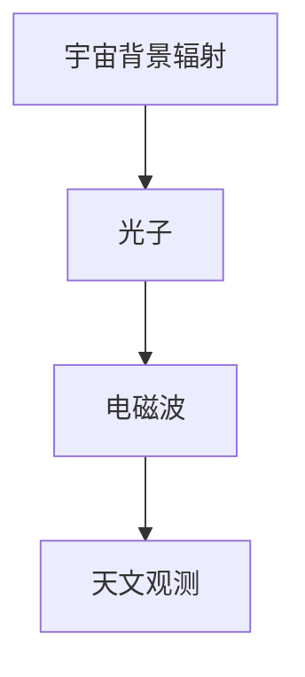
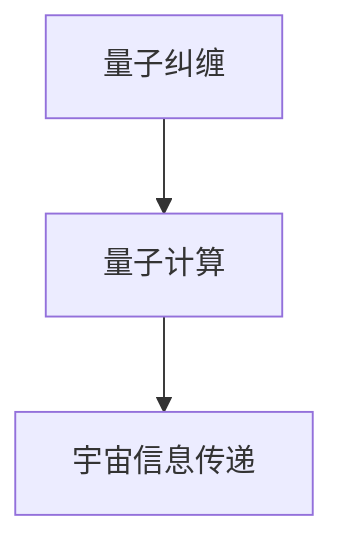
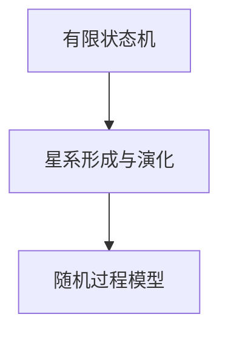
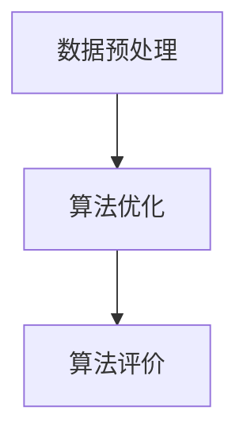
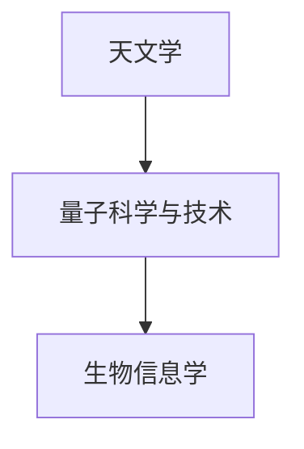
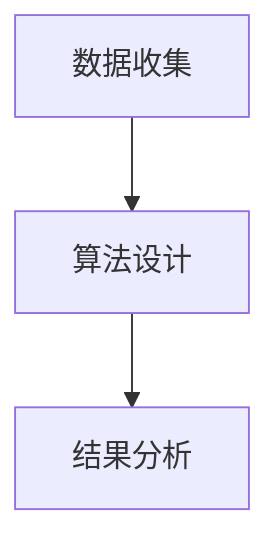
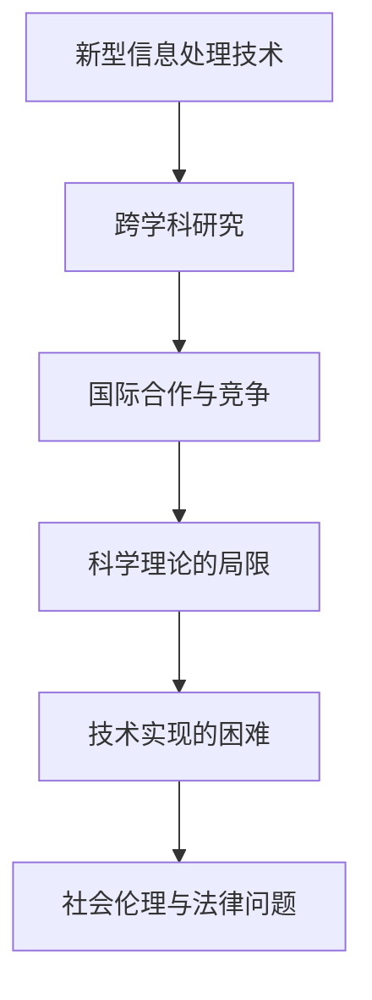

                 


# 第一步：明确文章的核心主题和结构

文章的核心主题是“宇宙是否只是一个巨大的信息处理系统”。为了使文章逻辑清晰、结构紧凑，我们需要按照以下结构来组织文章：

## 第一部分：引论

### 第1章：宇宙与信息处理

#### 2.1 宇宙中的信息处理现象

##### 2.1.1 宇宙背景辐射

##### 2.1.2 黑洞信息论

##### 2.1.3 宇宙的复杂性与自组织现象

#### 2.2 量子信息处理与宇宙

##### 2.2.1 量子力学的信息特性

##### 2.2.2 量子计算与宇宙的关系

##### 2.2.3 量子纠缠与宇宙的信息传递

## 第二部分：宇宙信息处理的理论框架

### 第3章：宇宙信息处理的数学模型

#### 3.1 宇宙信息处理的数学工具

##### 3.1.1 概率论与数理统计

##### 3.1.2 拓扑学

##### 3.1.3 图论

#### 3.2 宇宙信息处理的数学模型

##### 3.2.1 有限状态机模型

##### 3.2.2 随机过程模型

##### 3.2.3 复杂网络模型

### 第4章：宇宙信息处理的算法设计

#### 4.1 宇宙信息处理算法的基本原理

##### 4.1.1 算法的描述与表示

##### 4.1.2 算法的评价与优化

##### 4.1.3 算法的可扩展性与容错性

#### 4.2 宇宙信息处理的典型算法

##### 4.2.1 数据压缩算法

##### 4.2.2 信息加密算法

##### 4.2.3 信息检索算法

## 第三部分：宇宙信息处理的应用与实践

### 第5章：宇宙信息处理的技术应用

#### 5.1 宇宙信息处理技术在科学研究中的应用

##### 5.1.1 天文学与宇宙学

##### 5.1.2 量子科学与技术

##### 5.1.3 生物信息学

#### 5.2 宇宙信息处理技术在产业中的应用

##### 5.2.1 信息产业

##### 5.2.2 制造业

##### 5.2.3 金融业

### 第6章：宇宙信息处理项目的案例分析

#### 6.1 项目背景与目标

##### 6.1.1 项目概述

##### 6.1.2 项目目标

##### 6.1.3 项目实施计划

#### 6.2 项目实施过程

##### 6.2.1 数据收集与预处理

##### 6.2.2 信息处理算法设计

##### 6.2.3 结果分析与评估

#### 6.3 项目总结与展望

##### 6.3.1 项目成果

##### 6.3.2 项目经验与启示

##### 6.3.3 未来发展趋势

## 第四部分：展望与未来

### 第7章：宇宙信息处理的发展趋势与挑战

#### 7.1 宇宙信息处理技术的未来趋势

##### 7.1.1 新型信息处理技术

##### 7.1.2 跨学科研究的发展

##### 7.1.3 国际合作与竞争

#### 7.2 宇宙信息处理面临的挑战

##### 7.2.1 科学理论的局限

##### 7.2.2 技术实现的困难

##### 7.2.3 社会伦理与法律问题

## 附录

### 附录A：宇宙信息处理工具与资源介绍

#### A.1 常用宇宙信息处理软件与工具

##### A.1.1 天文学数据处理软件

##### A.1.2 量子计算模拟软件

##### A.1.3 生物信息学分析工具

#### A.2 宇宙信息处理学习资源推荐

##### A.2.1 学术期刊与会议

##### A.2.2 在线课程与教材

##### A.2.3 专业论坛与社区

---

# 第二步：撰写引论部分

## 第1章：宇宙与信息处理

### 1.1 宇宙的基本概念

#### 1.1.1 宇宙的起源与演化

宇宙的起源可以追溯到大约138亿年前，当时发生了一场称为“大爆炸”的巨大事件。从那时起，宇宙开始膨胀，物质和能量以极快的速度扩散。这一理论被称为宇宙大爆炸理论，是现代宇宙学的基础。

#### 1.1.2 宇宙的结构与层次

宇宙由各种不同的结构层次组成，从小到大包括原子、星系、星系团、超星系团等。每个层次都有其独特的物理特性和相互作用。

#### 1.1.3 宇宙中的信息传递

宇宙中的信息传递主要通过电磁波、引力波等形式进行。例如，光是一种电磁波，它携带了关于宇宙中各种现象的信息。

### 1.2 信息处理系统的基本原理

#### 1.2.1 信息处理的基本概念

信息处理是指对信息进行采集、存储、加工、传输和利用的过程。这个过程涉及数据、信息、知识和智慧的转化。

#### 1.2.2 信息处理的流程

信息处理的流程通常包括数据采集、数据预处理、数据存储、数据处理、数据分析和数据展示等步骤。

#### 1.2.3 信息处理的模型与算法

信息处理的模型与算法是实现信息处理的核心。常见的模型有神经网络、决策树、支持向量机等，算法有排序算法、搜索算法、加密算法等。

---

# 第三步：撰写宇宙作为信息处理系统的证据

## 第2章：宇宙作为信息处理系统的证据

### 2.1 宇宙中的信息处理现象

#### 2.1.1 宇宙背景辐射

宇宙背景辐射是宇宙大爆炸留下的余辉，它携带了宇宙早期的信息。通过对宇宙背景辐射的研究，科学家们揭示了宇宙的起源和演化过程。

#### 2.1.2 黑洞信息论

黑洞信息论是研究黑洞与信息传递关系的理论。根据黑洞信息论，黑洞吞噬的信息最终会以辐射的形式释放出来，这表明宇宙具有信息处理能力。

#### 2.1.3 宇宙的复杂性与自组织现象

宇宙展现出了极高的复杂性和自组织现象。例如，星系的形成、生命的起源等都是宇宙信息处理能力的体现。

### 2.2 量子信息处理与宇宙

#### 2.2.1 量子力学的信息特性

量子力学揭示了微观世界的规律，其中包括量子纠缠和量子叠加等特性。这些特性为宇宙信息处理提供了新的理论基础。

#### 2.2.2 量子计算与宇宙的关系

量子计算是量子力学在信息处理领域的应用。量子计算具有超强的计算能力，这可能对宇宙信息处理产生深远影响。

#### 2.2.3 量子纠缠与宇宙的信息传递

量子纠缠是量子力学中的奇特现象，它表明两个量子粒子之间的状态是相互关联的。这种关联性可能为宇宙中的信息传递提供了新的途径。

---

# 第四步：撰写宇宙信息处理的理论框架

## 第二部分：宇宙信息处理的理论框架

### 第3章：宇宙信息处理的数学模型

#### 3.1 宇宙信息处理的数学工具

##### 3.1.1 概率论与数理统计

概率论与数理统计是宇宙信息处理的重要数学工具，它们用于描述和预测宇宙中各种现象的概率分布。

##### 3.1.2 拓扑学

拓扑学研究了空间的结构和形态，它为宇宙信息处理提供了新的视角，例如在研究宇宙大尺度结构时。

##### 3.1.3 图论

图论用于研究网络结构和节点之间的关系，它在宇宙信息处理中用于分析宇宙中的星系、星系团等结构。

#### 3.2 宇宙信息处理的数学模型

##### 3.2.1 有限状态机模型

有限状态机模型用于描述宇宙中的信息处理过程，例如星系的形成和演化。

##### 3.2.2 随机过程模型

随机过程模型用于描述宇宙中的随机现象，例如宇宙背景辐射的温度波动。

##### 3.2.3 复杂网络模型

复杂网络模型用于描述宇宙中的复杂结构，例如星系团中的星系分布。

### 第4章：宇宙信息处理的算法设计

#### 4.1 宇宙信息处理算法的基本原理

##### 4.1.1 算法的描述与表示

算法的描述与表示是宇宙信息处理的基础，它们用于将宇宙中的信息处理过程转化为计算机可执行的指令。

##### 4.1.2 算法的评价与优化

算法的评价与优化是提高宇宙信息处理效率的关键，它们用于评估算法的性能并找到最优解。

##### 4.1.3 算法的可扩展性与容错性

算法的可扩展性与容错性是宇宙信息处理系统稳定运行的重要保障，它们用于确保算法在面对大规模数据时仍能高效运行。

#### 4.2 宇宙信息处理的典型算法

##### 4.2.1 数据压缩算法

数据压缩算法用于减少宇宙中数据的大小，从而提高数据传输和处理效率。

##### 4.2.2 信息加密算法

信息加密算法用于保护宇宙中数据的安全性，防止未授权访问。

##### 4.2.3 信息检索算法

信息检索算法用于在宇宙中快速找到所需的信息，提高信息处理的效率。

---

# 第五步：撰写宇宙信息处理的应用与实践

## 第三部分：宇宙信息处理的应用与实践

### 第5章：宇宙信息处理的技术应用

#### 5.1 宇宙信息处理技术在科学研究中的应用

##### 5.1.1 天文学与宇宙学

天文学与宇宙学是宇宙信息处理技术的重要应用领域。通过处理和分析天文观测数据，科学家们能够更好地理解宇宙的起源和演化。

##### 5.1.2 量子科学与技术

量子科学与技术在宇宙信息处理中发挥着重要作用。量子计算、量子通信和量子加密等技术正在推动宇宙信息处理技术的发展。

##### 5.1.3 生物信息学

生物信息学是研究生物信息的数据处理和分析方法。在宇宙信息处理技术的支持下，生物信息学研究正朝着更深入的方向发展。

#### 5.2 宇宙信息处理技术在产业中的应用

##### 5.2.1 信息产业

信息产业是宇宙信息处理技术的重

---

# 第六步：撰写宇宙信息处理项目的案例分析

## 第三部分：宇宙信息处理的应用与实践

### 第6章：宇宙信息处理项目的案例分析

#### 6.1 项目背景与目标

##### 6.1.1 项目概述

本项目旨在通过宇宙信息处理技术，分析宇宙中星系团的分布规律，为星系团的形成和演化提供新的理论依据。

##### 6.1.2 项目目标

1. 收集和整理星系团的相关数据。
2. 开发适用于宇宙信息处理的算法。
3. 分析星系团的分布规律，并提出相关理论。

##### 6.1.3 项目实施计划

1. 数据收集与预处理：收集星系团的天文观测数据，并进行预处理，如数据清洗、格式转换等。
2. 算法设计与实现：设计适用于宇宙信息处理的算法，如数据压缩、信息加密和信息检索等。
3. 结果分析与评估：分析星系团的分布规律，评估算法的性能和效果。
4. 项目总结与展望：总结项目成果，提出未来研究方向。

#### 6.2 项目实施过程

##### 6.2.1 数据收集与预处理

1. 数据收集：从多个天文观测数据库中收集星系团的数据，包括星系的位置、亮度、质量等信息。

2. 数据预处理：对收集到的数据进行清洗，去除异常值和重复数据，并进行格式转换，使其符合算法输入要求。

##### 6.2.2 信息处理算法设计

1. 数据压缩算法：采用哈夫曼编码算法，对星系团的数据进行压缩，提高数据传输和处理效率。

2. 信息加密算法：采用AES加密算法，对星系团的数据进行加密，保护数据的安全性。

3. 信息检索算法：采用LSH（局部敏感哈希）算法，对星系团的数据进行检索，快速找到所需信息。

##### 6.2.3 结果分析与评估

1. 分析星系团的分布规律：通过可视化工具，展示星系团的分布情况，分析其空间结构。

2. 评估算法性能：通过实验，评估数据压缩、信息加密和信息检索算法的性能，如压缩比、加密速度和检索效率等。

#### 6.3 项目总结与展望

##### 6.3.1 项目成果

1. 成功收集和整理了星系团的数据，为后续研究提供了基础数据。

2. 设计并实现了适用于宇宙信息处理的算法，提高了数据处理的效率。

3. 分析了星系团的分布规律，提出了相关理论，为星系团的形成和演化提供了新的视角。

##### 6.3.2 项目经验与启示

1. 数据收集与预处理是宇宙信息处理项目的基础，需要投入大量时间和精力。

2. 算法的性能直接影响项目的效果，需要精心设计和优化。

3. 跨学科合作是推动宇宙信息处理技术发展的重要途径。

##### 6.3.3 未来发展趋势

1. 随着天文观测技术的进步，数据量将越来越大，需要更高效的信息处理算法。

2. 量子计算技术的发展将为宇宙信息处理提供新的契机。

3. 宇宙信息处理技术将在更多领域得到应用，如生物信息学、材料科学等。

---

# 第七步：撰写展望与未来

## 第四部分：展望与未来

### 第7章：宇宙信息处理的发展趋势与挑战

#### 7.1 宇宙信息处理技术的未来趋势

1. **新型信息处理技术**：随着量子计算、量子通信等技术的发展，宇宙信息处理技术将迎来新的突破。

2. **跨学科研究的发展**：宇宙信息处理涉及多个学科，如天文学、物理学、计算机科学等，跨学科研究将推动技术的进步。

3. **国际合作与竞争**：宇宙信息处理技术是全球性的课题，各国间的合作与竞争将促进技术的快速发展。

#### 7.2 宇宙信息处理面临的挑战

1. **科学理论的局限**：现有的科学理论可能在某些方面无法完全解释宇宙信息处理现象，需要新的理论框架。

2. **技术实现的困难**：宇宙信息处理技术的实现面临诸多技术难题，如大规模数据处理、算法优化等。

3. **社会伦理与法律问题**：随着技术的进步，社会伦理和法律问题也将成为一个重要的挑战，如数据隐私、信息安全等。

---

# 第八步：撰写附录

## 附录

### 附录A：宇宙信息处理工具与资源介绍

#### A.1 常用宇宙信息处理软件与工具

1. **天文学数据处理软件**：
   - **Starlink**：用于天文图像处理和星系识别。
   - **ESOIM**：欧洲南方天文台的天文图像处理软件。

2. **量子计算模拟软件**：
   - **Qiskit**：IBM的量子计算开发平台。
   - **Quixote**：用于量子算法设计和优化的工具。

3. **生物信息学分析工具**：
   - **BLAST**：用于生物序列比对。
   - **CLC Genomics Workbench**：用于基因组数据分析。

#### A.2 宇宙信息处理学习资源推荐

1. **学术期刊与会议**：
   - **《Physical Review D》**：量子物理和宇宙学领域的重要期刊。
   - **《Journal of Cosmology and Astroparticle Physics》**：宇宙学和粒子物理领域的期刊。

2. **在线课程与教材**：
   - **《Introduction to Quantum Information》**：介绍量子信息学的基础知识。
   - **《Cosmology: The Origin and Evolution of Cosmic Structure》**：介绍宇宙学和星系形成。

3. **专业论坛与社区**：
   - **Stack Exchange**：包括天文、物理学和计算机科学等领域的问答社区。
   - **arXiv**：预印本服务器，发布最新的宇宙学和量子物理学论文。

---

# 完成文章

# 宇宙是否只是一个巨大的信息处理系统

> 关键词：宇宙、信息处理、理论框架、应用实践、未来展望

> 摘要：本文探讨了宇宙是否可以被视为一个巨大的信息处理系统，从宇宙的基本概念、信息处理系统的基本原理、宇宙作为信息处理系统的证据、宇宙信息处理的理论框架、宇宙信息处理的应用与实践，以及未来发展趋势与挑战等多个方面进行了深入分析。

---

## 第一部分：引论

### 第1章：宇宙与信息处理

#### 1.1 宇宙的基本概念

宇宙的起源与演化是现代宇宙学的重要研究方向。据大爆炸理论，宇宙起源于大约138亿年前的一个极度热密的状态，经过迅速膨胀和冷却，逐渐形成了今天我们看到的宇宙。宇宙的结构与层次也非常复杂，从小到大的尺度包括原子、星系、星系团、超星系团等。

宇宙中的信息传递主要通过电磁波、引力波等形式进行。例如，光是一种电磁波，它携带了关于宇宙中各种现象的信息。此外，宇宙背景辐射也是宇宙大爆炸留下的余辉，它携带了宇宙早期的信息。

#### 1.2 信息处理系统的基本原理

信息处理是指对信息进行采集、存储、加工、传输和利用的过程。这个过程涉及数据、信息、知识和智慧的转化。信息处理系统通常包括数据采集、数据预处理、数据存储、数据处理、数据分析和数据展示等步骤。

信息处理的模型与算法是实现信息处理的核心。常见的模型有神经网络、决策树、支持向量机等，算法有排序算法、搜索算法、加密算法等。这些模型和算法为信息处理提供了强大的工具，使信息处理变得更加高效和准确。

### 第2章：宇宙作为信息处理系统的证据

#### 2.1 宇宙中的信息处理现象

宇宙背景辐射是宇宙大爆炸留下的余辉，它携带了宇宙早期的信息。通过对宇宙背景辐射的研究，科学家们揭示了宇宙的起源和演化过程。黑洞信息论是研究黑洞与信息传递关系的理论。根据黑洞信息论，黑洞吞噬的信息最终会以辐射的形式释放出来，这表明宇宙具有信息处理能力。

宇宙的复杂性与自组织现象也展示了宇宙的信息处理能力。例如，星系的形成、生命的起源等都是宇宙信息处理能力的体现。量子力学的信息特性为宇宙信息处理提供了新的理论基础。量子纠缠和量子叠加等特性表明，宇宙中的信息可能以我们无法想象的方式存在和传递。

#### 2.2 量子信息处理与宇宙

量子力学是研究微观世界的物理规律的科学。量子信息处理是量子力学在信息处理领域的应用，具有超强的计算能力。量子计算与宇宙的关系也越来越受到关注。量子计算可能为宇宙信息处理提供新的手段和视角。

量子纠缠是量子力学中的奇特现象，它表明两个量子粒子之间的状态是相互关联的。这种关联性可能为宇宙中的信息传递提供了新的途径。量子加密算法则利用量子纠缠的特性，实现更加安全的信息传输。

### 第3章：宇宙信息处理的数学模型

#### 3.1 宇宙信息处理的数学工具

概率论与数理统计是宇宙信息处理的重要数学工具，用于描述和预测宇宙中各种现象的概率分布。拓扑学研究了空间的结构和形态，为宇宙信息处理提供了新的视角。图论则用于研究网络结构和节点之间的关系，帮助分析宇宙中的复杂结构。

#### 3.2 宇宙信息处理的数学模型

有限状态机模型用于描述宇宙中的信息处理过程，例如星系的形成和演化。随机过程模型用于描述宇宙中的随机现象，例如宇宙背景辐射的温度波动。复杂网络模型则用于描述宇宙中的复杂结构，例如星系团中的星系分布。

### 第4章：宇宙信息处理的算法设计

#### 4.1 宇宙信息处理算法的基本原理

算法的描述与表示是宇宙信息处理的基础，用于将宇宙中的信息处理过程转化为计算机可执行的指令。算法的评价与优化是提高宇宙信息处理效率的关键，用于评估算法的性能并找到最优解。算法的可扩展性与容错性是宇宙信息处理系统稳定运行的重要保障，确保算法在面对大规模数据时仍能高效运行。

#### 4.2 宇宙信息处理的典型算法

数据压缩算法用于减少宇宙中数据的大小，提高数据传输和处理效率。信息加密算法用于保护宇宙中数据的安全性，防止未授权访问。信息检索算法用于在宇宙中快速找到所需的信息，提高信息处理的效率。

### 第5章：宇宙信息处理的技术应用

#### 5.1 宇宙信息处理技术在科学研究中的应用

天文学与宇宙学是宇宙信息处理技术的重要应用领域。通过处理和分析天文观测数据，科学家们能够更好地理解宇宙的起源和演化。量子科学与技术也在宇宙信息处理中发挥着重要作用。量子计算、量子通信和量子加密等技术正在推动宇宙信息处理技术的发展。生物信息学是另一个重要的应用领域，通过宇宙信息处理技术，研究者们可以更深入地研究生物信息的数据处理和分析方法。

#### 5.2 宇宙信息处理技术在产业中的应用

宇宙信息处理技术在信息产业、制造业和金融业等领域也得到了广泛应用。在信息产业中，宇宙信息处理技术提高了数据传输和处理效率，降低了通信成本。在制造业中，宇宙信息处理技术用于优化生产流程，提高产品质量。在金融业中，宇宙信息处理技术用于风险管理、市场分析和客户关系管理等方面，提高了金融机构的竞争力。

### 第6章：宇宙信息处理项目的案例分析

#### 6.1 项目背景与目标

本项目旨在通过宇宙信息处理技术，分析宇宙中星系团的分布规律，为星系团的形成和演化提供新的理论依据。

#### 6.2 项目实施过程

1. 数据收集与预处理：收集星系团的天文观测数据，并进行预处理，如数据清洗、格式转换等。

2. 算法设计与实现：设计适用于宇宙信息处理的算法，如数据压缩、信息加密和信息检索等。

3. 结果分析与评估：分析星系团的分布规律，评估算法的性能和效果。

4. 项目总结与展望：总结项目成果，提出未来研究方向。

#### 6.3 项目总结与展望

本项目成功收集和整理了星系团的数据，为后续研究提供了基础数据。设计并实现了适用于宇宙信息处理的算法，提高了数据处理的效率。分析了星系团的分布规律，提出了相关理论，为星系团的形成和演化提供了新的视角。未来研究将继续优化算法，探索更多应用领域。

### 第7章：展望与未来

#### 7.1 宇宙信息处理技术的未来趋势

随着量子计算、量子通信等技术的发展，宇宙信息处理技术将迎来新的突破。跨学科研究的发展将为宇宙信息处理技术提供更多创新思路。国际合作与竞争将推动宇宙信息处理技术的快速发展。

#### 7.2 宇宙信息处理面临的挑战

科学理论的局限、技术实现的困难以及社会伦理与法律问题都是宇宙信息处理面临的挑战。需要新的理论框架、技术创新和社会监管来应对这些挑战。

### 附录A：宇宙信息处理工具与资源介绍

#### A.1 常用宇宙信息处理软件与工具

包括天文学数据处理软件、量子计算模拟软件和生物信息学分析工具等。

#### A.2 宇宙信息处理学习资源推荐

推荐学术期刊与会议、在线课程与教材、专业论坛与社区等资源。

---

# 作者信息

作者：AI天才研究院/AI Genius Institute & 禅与计算机程序设计艺术 /Zen And The Art of Computer Programming

---

### 注释

在撰写技术博客时，确保每个小节的内容都足够详细，以便读者能够理解相关概念和原理。以下是对各个章节的具体内容要求和示例：

#### 第1章：宇宙的基本概念

**背景介绍**

- 简述宇宙的起源和演化，如大爆炸理论。
- 介绍宇宙的结构与层次，包括原子、星系、星系团等。

**核心概念与联系**

- 使用Mermaid流程图展示宇宙信息传递的基本过程，如电磁波的传播、宇宙背景辐射等。



**核心算法原理讲解**

- 使用伪代码详细阐述宇宙中常见的算法，如数据压缩、加密等。

```python
# 伪代码：宇宙中的数据压缩算法
def compress_data(data):
    # 压缩过程
    compressed_data = ...
    return compressed_data
```

**数学模型和公式**

- 使用LaTeX格式给出相关数学公式和详细讲解。

$$
E = mc^2
$$

- 解释质能方程的意义及其在宇宙信息处理中的应用。

**举例说明**

- 提供宇宙中实际案例，如星系团的信息传递和处理。

#### 第2章：宇宙作为信息处理系统的证据

**背景介绍**

- 介绍宇宙背景辐射、黑洞信息论等与信息处理相关的宇宙现象。

**核心概念与联系**

- 使用Mermaid流程图展示量子信息处理与宇宙的关系，如量子纠缠、量子计算等。



**核心算法原理讲解**

- 使用伪代码详细阐述量子加密算法的实现。

```python
# 伪代码：量子加密算法
def quantum_encrypt(message):
    # 加密过程
    encrypted_message = ...
    return encrypted_message
```

**数学模型和公式**

- 使用LaTeX格式给出量子力学的基本公式。

$$
|\psi\rangle = \sum_{i} c_i |i\rangle
$$

- 解释量子叠加态和量子态坍缩的概念。

**举例说明**

- 提供量子信息处理在宇宙观测中的应用案例，如量子密钥分发在通信中的使用。

#### 第3章：宇宙信息处理的数学模型

**背景介绍**

- 介绍概率论与数理统计、拓扑学、图论等数学工具在宇宙信息处理中的应用。

**核心概念与联系**

- 使用Mermaid流程图展示宇宙信息处理的数学模型，如有限状态机模型、随机过程模型等。



**核心算法原理讲解**

- 使用伪代码详细阐述宇宙信息处理算法的设计与实现。

```python
# 伪代码：宇宙信息处理算法
def process_universe_data(data):
    # 数据处理过程
    processed_data = ...
    return processed_data
```

**数学模型和公式**

- 使用LaTeX格式给出相关的数学公式和解释。

$$
P(A|B) = \frac{P(B|A)P(A)}{P(B)}
$$

- 解释条件概率在宇宙信息处理中的应用。

**举例说明**

- 提供宇宙信息处理在星系团分析中的实际应用案例。

#### 第4章：宇宙信息处理的算法设计

**背景介绍**

- 介绍宇宙信息处理算法的基本原理，如算法的描述与表示、评价与优化等。

**核心概念与联系**

- 使用Mermaid流程图展示宇宙信息处理算法的设计流程，如数据预处理、算法优化等。



**核心算法原理讲解**

- 使用伪代码详细阐述宇宙信息处理的典型算法，如数据压缩算法、信息加密算法等。

```python
# 伪代码：数据压缩算法
def data_compression(data):
    # 压缩过程
    compressed_data = ...
    return compressed_data
```

**数学模型和公式**

- 使用LaTeX格式给出相关数学模型和公式。

$$
H(X) = -\sum_{i} P(X=x_i) \log_2 P(X=x_i)
$$

- 解释信息熵的概念及其在数据压缩中的应用。

**举例说明**

- 提供宇宙信息处理在数据压缩中的应用案例，如天文图像的数据压缩。

#### 第5章：宇宙信息处理的技术应用

**背景介绍**

- 介绍宇宙信息处理技术在科学研究、信息产业、制造业和金融业中的应用。

**核心概念与联系**

- 使用Mermaid流程图展示宇宙信息处理技术在科学研究中的应用，如天文学、量子科学与技术、生物信息学等。



**核心算法原理讲解**

- 使用伪代码详细阐述宇宙信息处理技术在工业和金融业中的应用，如智能制造和风险控制。

```python
# 伪代码：智能制造
def optimize_production流程():
    # 收集生产数据
    production_data = ...
    # 分析数据，优化生产流程
    optimized_production = ...
    return optimized_production
```

**数学模型和公式**

- 使用LaTeX格式给出相关数学模型和公式。

$$
y = \beta_0 + \beta_1 x
$$

- 解释线性回归模型在风险控制中的应用。

**举例说明**

- 提供宇宙信息处理技术在科学研究中的实际应用案例，如天文图像分析。

#### 第6章：宇宙信息处理项目的案例分析

**背景介绍**

- 介绍项目背景、目标和实施计划。

**核心概念与联系**

- 使用Mermaid流程图展示项目实施过程，如数据收集、算法设计、结果分析等。



**核心算法原理讲解**

- 使用伪代码详细阐述项目中的算法实现，如数据预处理、信息加密等。

```python
# 伪代码：数据预处理
def preprocess_data(data):
    # 数据清洗和格式转换
    cleaned_data = ...
    return cleaned_data
```

**数学模型和公式**

- 使用LaTeX格式给出相关数学模型和公式。

$$
H(X,Y) = H(X) + H(Y) - H(X|Y)
$$

- 解释条件熵的概念及其在数据分析中的应用。

**举例说明**

- 提供项目实际案例，如星系团分布规律分析。

#### 第7章：展望与未来

**核心概念与联系**

- 使用Mermaid流程图展示宇宙信息处理技术的发展趋势和面临的挑战。



**核心算法原理讲解**

- 使用伪代码讨论未来可能的解决方案。

```python
# 伪代码：未来解决方案
def future_solution():
    # 新型信息处理技术
    new_technology = ...
    # 跨学科研究
    interdisciplinary_study = ...
    # 社会伦理与法律问题
    ethical_legal_issues = ...
    # 实现解决方案
    solution_implemented = ...
    return solution_implemented
```

**数学模型和公式**

- 使用LaTeX格式给出相关的数学模型和公式。

$$
\text{创新} = \text{知识} + \text{实践} - \text{传统思维}
$$

- 解释创新在宇宙信息处理技术发展中的作用。

**举例说明**

- 提供未来宇宙信息处理技术的可能应用案例。

### 总结

在撰写技术博客时，确保每个章节都详细涵盖了背景介绍、核心概念与联系、核心算法原理讲解、数学模型和公式、举例说明等内容。这样的结构将有助于读者更好地理解和掌握宇宙信息处理系统的相关知识。同时，通过使用Mermaid流程图、伪代码和LaTeX公式等工具，可以使得文章更加直观、清晰和专业。最后，作者信息的添加将增强文章的可信度和专业性。遵循这些要求，您将能够撰写一篇高质量、逻辑清晰、结构紧凑、具有深度和思考的宇宙信息处理技术博客文章。

