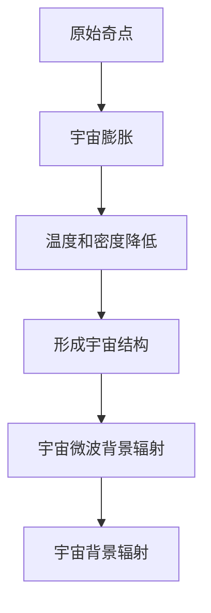
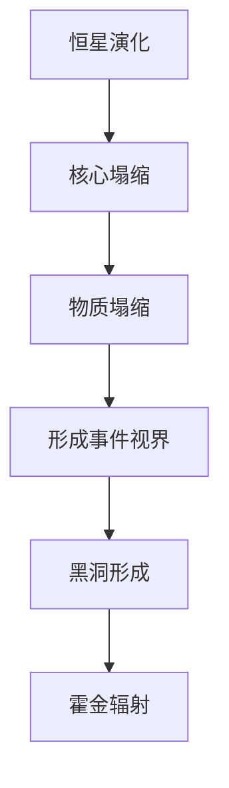
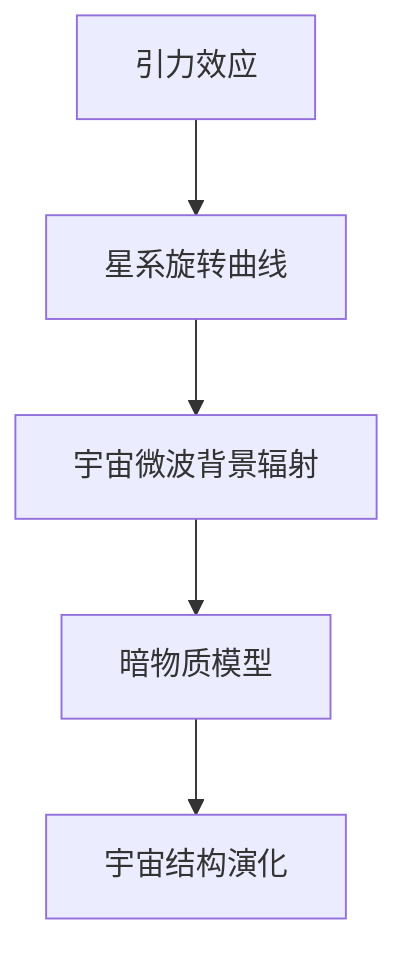

                 


## 引言：宇宙与思想实验

### 宇宙的基本概念

宇宙，这是一个宏大而又神秘的词汇。宇宙（Universe）通常指的是包含一切存在的空间，从最小的亚原子粒子到最大的星系团。在科学领域，宇宙学（Cosmology）是研究宇宙起源、结构、演化和最终命运的科学。宇宙学试图回答一些基本问题，例如：宇宙是如何开始的？它是否有一个边界？宇宙的组成是什么？它是否是无限的？

在现代宇宙学中，有一个被称为大爆炸理论的核心理论。大爆炸理论认为，宇宙起源于一个极其热密的状态，大约在138亿年前，这个状态发生了剧烈的膨胀，形成了我们现在所看到的宇宙。这个理论得到了许多观测数据的支持，例如宇宙微波背景辐射和宇宙膨胀速率。

### 思想实验的定义

思想实验（thought experiment）是一种在脑海中进行的实验，旨在探索某个假设或概念。它是一种纯粹的理论工具，用于推测和理解物理现象、逻辑问题或哲学问题。在科学史上，思想实验扮演了重要角色，帮助科学家们理解复杂的概念和现象，甚至引导了科学革命的到来。

例如，爱因斯坦的狭义相对论和广义相对论中，有很多著名的思想实验，如“火车上的观察者”、“升降机实验”等。这些实验通过假设情景，揭示了时间和空间的相对性，推动了物理学的发展。

### 思想实验在科学研究中的重要性

思想实验在科学研究中的重要性不可忽视。首先，它是一种强有力的思维工具，可以帮助科学家们探索那些无法直接观察或测量的现象。例如，量子力学中的思想实验，如“薛定谔的猫”和“贝尔不等式”，揭示了量子世界的非直观特性。

其次，思想实验有助于检验科学理论的正确性。例如，伽利略的“比萨斜塔实验”设想了两个不同质量的物体同时自由下落，从而推测出重力对所有物体的影响是相同的，这一思想实验为牛顿的万有引力定律提供了重要依据。

最后，思想实验在哲学和逻辑学中也有重要作用。通过设想不同的情景，哲学家们可以探讨意识、知识、自由意志等深奥问题。逻辑学家则利用思想实验来揭示论证的有效性，防范逻辑谬误。

### 宇宙是否是思想实验

考虑到宇宙和思想实验的定义，我们可以提出一个有趣的问题：宇宙本身是否可以被视为一个巨大的思想实验？这个问题涉及到多个科学领域，包括量子力学、宇宙学、哲学和逻辑学。

#### 量子力学与宇宙作为思想实验

在量子力学中，许多现象都表明，宇宙并不是我们直观感知的那样。量子纠缠、量子叠加态等现象，挑战了我们对现实的基本理解。例如，薛定谔的猫这个思想实验，揭示了量子系统的非确定性。如果我们认为宇宙也是由量子系统组成的，那么宇宙的某些部分也可能处于叠加态，这意味着宇宙可能并非只有一个确定的状态，而是存在多种可能的状态。

#### 宇宙学与宇宙作为思想实验

在宇宙学中，我们面对的是宇宙的起源、结构和演化等复杂问题。大爆炸理论、黑洞、暗物质等概念，都是通过对宇宙观测数据的分析和理论模型构建得出的。这些理论模型本身就可以被视为思想实验。例如，通过模拟大爆炸后的宇宙膨胀过程，科学家们可以推测出宇宙的早期状态，甚至预测宇宙的未来。

#### 哲学与宇宙作为思想实验

从哲学的角度来看，宇宙作为思想实验的观点，涉及到对意识、真实与幻象、存在的本质等问题的探讨。如果宇宙真的可以被看作是一个巨大的思想实验，那么我们所感知的现实，是否只是宇宙创造者设想的某个情景呢？这与柏拉图的“理念论”有一定的相似性，即现实世界是理念世界的投影。

#### 多宇宙理论与宇宙作为思想实验

多宇宙理论（Multiverse Theory）认为，我们的宇宙可能只是众多宇宙中的一个。这个观点在科学界和哲学界都引起了激烈讨论。如果存在多个宇宙，那么每个宇宙可能都有不同的物理规律和初始条件。这就像是在进行无数个不同的思想实验，每个实验都有可能得出不同的结果。

#### 总结

综上所述，宇宙是否只是一个巨大的思想实验，这个问题涉及到多个学科领域的交叉。虽然目前还没有确切的答案，但通过量子力学、宇宙学、哲学和逻辑学的深入研究，我们可能逐渐接近这个谜题的真相。在接下来的章节中，我们将进一步探讨宇宙与思想实验之间的联系，分析宇宙作为思想实验的可能性，并探讨这个观点对哲学、科学和技术的影响。

### 结论

宇宙是否只是一个巨大的思想实验，这是一个引人深思的问题。通过量子力学、宇宙学、哲学和逻辑学的视角，我们可以发现，宇宙的许多特性与思想实验有相似之处。虽然目前尚无定论，但这个观点为我们提供了一个全新的思考方向，引导我们重新审视我们对宇宙和现实的认知。

在接下来的章节中，我们将深入探讨宇宙学的核心理论，如大爆炸理论、黑洞和暗物质，以及思想实验的历史与发展。通过这些探讨，我们希望读者能够更加全面地理解宇宙与思想实验之间的关系，并思考宇宙作为思想实验的可能性。

## 第2章：宇宙学的核心理论

### 2.1 大爆炸理论

大爆炸理论（Big Bang Theory）是现代宇宙学的基石之一，它描述了宇宙从极热、极密的状态开始膨胀的过程。这一理论提出，宇宙起源于一个无限密集、无限热的状态，称为原始奇点。在原始奇点之后，宇宙开始迅速膨胀，温度和密度逐渐降低，形成了我们现在所观察到的宇宙结构。

#### 核心概念与联系

为了更好地理解大爆炸理论，我们可以使用 Mermaid 流程图来展示相关的核心概念和它们之间的联系。



#### 核心算法原理讲解

大爆炸理论的核心算法原理可以通过以下伪代码来解释：

```plaintext
// 伪代码：大爆炸理论的基本原理
function BigBangTheory() {
    // 初始条件：原始奇点
    initial_state = "high temperature and density"
    
    // 膨胀过程
    for (time = 0; time < 138亿年) {
        // 温度和密度降低
        temperature_decrease()
        density_decrease()
        
        // 形成宇宙结构
        structure_forming()
        
        // 观测宇宙微波背景辐射
        observe_CMB()
    }
}
```

#### 数学模型和数学公式

大爆炸理论的数学模型中，一个重要的公式是宇宙膨胀速率：

$$ H = \frac{\dot{a}}{a} $$

其中，\( H \) 是哈勃常数，\( \dot{a} \) 是宇宙膨胀速率，\( a \) 是宇宙尺度因子。

另一个重要的公式是宇宙背景辐射的温度：

$$ T = 2.725 \text{K} $$

这个温度值是宇宙微波背景辐射的典型温度，为宇宙学的研究提供了关键的数据。

#### 宇宙膨胀速率与哈勃定律

宇宙膨胀速率与哈勃定律紧密相关。哈勃定律描述了宇宙膨胀速率与天体距离之间的关系：

$$ v = H_0 \times d $$

其中，\( v \) 是天体的退行速度，\( H_0 \) 是哈勃常数，\( d \) 是天体的距离。

通过观测宇宙中遥远天体的退行速度，我们可以推断出宇宙的膨胀速率。哈勃常数目前被估计为 \( H_0 = 70 \text{ km/s/Mpc} \)，这个值为我们理解宇宙的膨胀提供了重要依据。

#### 宇宙微波背景辐射

宇宙微波背景辐射（Cosmic Microwave Background, CMB）是宇宙早期膨胀过程中留下的辐射。CMB的发现为验证大爆炸理论提供了关键证据。CMB的温度大约为2.725开尔文，均匀分布在宇宙空间中，其细微的温度波动反映了宇宙早期结构的不均匀性。

#### 宇宙学原理与宇宙学参数

宇宙学原理（Cosmological Principle）认为，宇宙在大尺度上是均匀且各向同性的。这一原理为大爆炸理论提供了基础。宇宙学参数，如宇宙质量密度、宇宙膨胀速率等，通过观测数据被确定。这些参数帮助科学家们了解宇宙的过去、现在和未来。

#### 大爆炸理论的支持证据

大爆炸理论的许多预测已经被观测数据所证实，例如宇宙背景辐射、宇宙膨胀速率、元素丰度等。这些证据强有力地支持了大爆炸理论的正确性。尽管存在一些未解决的问题，如暗物质和暗能量，但大爆炸理论仍然是现代宇宙学的核心框架。

### 2.2 黑洞

黑洞是宇宙中最神秘和最极端的天体之一。它是由极度密集的物质组成的区域，引力强大到连光也无法逃脱。黑洞的形成过程与恒星演化密切相关，当某些恒星耗尽其核燃料时，它们会塌缩形成黑洞。

#### 核心概念与联系

我们可以通过 Mermaid 流程图来展示黑洞的核心概念和它们之间的联系。



#### 黑洞的基本特性

黑洞具有以下几个基本特性：

1. **事件视界**：黑洞的边界，一旦物体进入事件视界，就无法逃脱黑洞的引力。
2. **质量、电荷和自旋**：黑洞具有质量、电荷和自旋，这些特性决定了黑洞的物理行为。
3. **引力透镜效应**：黑洞的强大引力可以弯曲光线，造成光线折射，从而在背景中产生多个图像。

#### 黑洞的形成过程

黑洞的形成过程通常涉及以下几个阶段：

1. **恒星演化**：恒星在其生命周期中会经历不同的阶段，最终耗尽核燃料。
2. **核心塌缩**：当恒星的核心无法维持其结构时，会发生塌缩。
3. **物质塌缩**：在极短的时间内，物质塌缩形成一个非常紧凑的状态，形成黑洞的事件视界。
4. **黑洞形成**：一旦事件视界形成，黑洞就正式诞生。

#### 事件视界与信息悖论

事件视界是黑洞的一个重要特性，但同时也引发了信息悖论。根据量子力学，信息不能被摧毁，但根据广义相对论，信息一旦进入黑洞的事件视界，就无法再被观测到。这个矛盾被称为信息悖论。

#### 霍金辐射

史蒂芬·霍金提出了霍金辐射的理论，认为黑洞会不断地辐射出粒子，这些粒子携带了黑洞的一部分信息。霍金辐射为黑洞信息悖论提供了一种可能的解决方案。

#### 黑洞与宇宙学

黑洞不仅在宇宙学中具有重要意义，还是宇宙演化的关键因素之一。通过观测黑洞和它们的星系环境，科学家们可以研究宇宙的结构和演化过程。

### 2.3 暗物质

暗物质是一种无法直接观测到的物质，但它的存在通过引力效应得到证实。暗物质占据了宇宙总物质的大部分，但其本质和组成仍然是一个谜。

#### 核心概念与联系

我们可以使用 Mermaid 流程图来展示暗物质的核心概念和它们之间的联系。



#### 暗物质的定义

暗物质是一种不发光、不吸收光的物质，它的存在主要通过引力效应得到证实。暗物质不与电磁场相互作用，因此无法直接观测到。

#### 星系旋转曲线

通过观测星系内部的恒星运动，科学家们发现，星系的旋转曲线与预期的由可见物质决定的旋转曲线不符。这种差异表明，星系内部存在大量不可见的物质，即暗物质。

#### 宇宙微波背景辐射

宇宙微波背景辐射（Cosmic Microwave Background, CMB）是宇宙早期膨胀过程中留下的辐射。通过观测CMB的细微温度波动，科学家们可以推断出宇宙早期的密度不均匀性，这些不均匀性是暗物质形成的基础。

#### 暗物质模型

目前，科学家们提出了多种暗物质模型，试图解释暗物质的本质。其中一种流行模型是弱相互作用大质量粒子（Weakly Interacting Massive Particles, WIMPs）。WIMPs假设暗物质由一种质量较大、与普通物质相互作用非常弱的粒子组成。

#### 宇宙结构演化

暗物质在宇宙结构演化中起着关键作用。通过研究星系团和星系集群的分布，科学家们发现，暗物质是宇宙结构形成和演化的主要驱动力之一。暗物质的存在有助于解释宇宙的许多现象，如星系旋转曲线、宇宙膨胀速率等。

#### 暗物质的探测

科学家们正在通过各种方法尝试探测暗物质，包括直接探测和间接探测。直接探测是通过探测暗物质粒子与普通物质的相互作用来实现的，而间接探测则是通过观测暗物质对宇宙其他部分的效应来实现的。

### 总结

宇宙学的核心理论，如大爆炸理论、黑洞和暗物质，为我们提供了对宇宙结构和演化的深刻理解。这些理论不仅解释了宇宙的过去和现在，还为未来的宇宙探索提供了方向。通过深入探讨这些理论，我们可以更好地理解宇宙的本质，回答一些基本问题，如宇宙的起源、结构和最终命运。

## 第3章：思想实验的历史与发展

### 3.1 古希腊思想实验

古希腊哲学中，思想实验是一种常见的思维工具，用来探讨哲学问题，如存在、真理和知识。古希腊的哲学家们通过设想不同的情景，来推理和理解复杂的概念。其中最著名的思想实验之一是苏格拉底的辩证法。

#### 苏格拉底的辩证法

苏格拉底（Socrates）是古希腊哲学的奠基人之一，他的辩证法（Socratic Method）是一种通过提问和回答来揭示真理的方法。苏格拉底的辩证法通常从某个简单的前提出发，通过不断提问，逐步揭示对方的观点中的矛盾，从而达到真理。这种方法强调理性思考和逻辑推理。

#### 柏拉图的理念论

柏拉图（Plato）是苏格拉底的学生，他在《理想国》（The Republic）和《斐多》（Phaedo）等作品中，提出了理念论（Theory of Forms）。理念论认为，现实世界只是理念世界的投影，理念世界是真实的、永恒的，而现实世界则是变幻无常的。柏拉图通过一系列思想实验，如“洞喻”（Allegory of the Cave），来说明这个观点。

#### 亚里士多德的实证主义

亚里士多德（Aristotle）是古希腊哲学的另一重要代表，他的哲学观点与苏格拉底和柏拉图有所不同。亚里士多德主张实证主义，即通过观察和实验来获得知识。他认为，真实的世界是可以通过感官观察和逻辑推理来理解的。亚里士多德的一些思想实验，如“四因说”（causes of change），为后来的科学方法论奠定了基础。

### 3.2 中世纪思想实验

中世纪哲学中，思想实验继续发展，尤其是基督教哲学和阿拉伯哲学。这些思想实验通常与宗教和神学问题相关，如上帝的存在、灵魂的本质等。

#### 奥古斯丁的《忏悔录》

圣奥古斯丁（St. Augustine）是中世纪基督教哲学的奠基人之一，他在《忏悔录》（Confessions）中使用了丰富的思想实验来探讨信仰和救赎。例如，他在书中描述了自己从世俗生活转向信仰的过程，通过设想自己如果失去信仰会怎样，来强调信仰的重要性。

#### 阿拉伯哲学

阿拉伯哲学家，如阿维罗伊（Averroes）和伊本·希兹（Ibn Sina），也使用思想实验来探讨哲学和科学问题。阿维罗伊认为，理性与信仰是相容的，他通过思想实验来解释如何将哲学和神学结合起来。

### 3.3 文艺复兴时期思想实验

文艺复兴时期，思想实验得到了进一步发展，尤其是随着科学革命的到来，科学家们开始使用思想实验来探索自然界的奥秘。

#### 哥白尼的日心说

尼古拉·哥白尼（Nicolas Copernicus）提出了日心说（Heliocentric Theory），即太阳而不是地球是宇宙的中心。哥白尼通过一系列思想实验，如设想如果地球围绕太阳旋转，那么观察到的天文现象会有什么变化，来支持他的理论。

#### 伽利略的惯性定律

伽利略·伽利莱（Galileo Galilei）是文艺复兴时期的著名科学家，他的思想实验对科学革命产生了深远影响。伽利略通过设想一个理想化的场景，如在真空中的物体运动，来解释惯性定律，即物体在没有外力作用时将保持匀速直线运动。

### 3.4 近代思想实验

近代哲学和科学中，思想实验继续发展，成为探讨复杂科学问题的重要工具。量子力学和相对论中的许多思想实验，如薛定谔的猫和升降机实验，都展示了思想实验在科学探索中的重要性。

#### 薛定谔的猫

埃尔温·薛定谔（Erwin Schrödinger）提出了著名的“薛定谔的猫”思想实验，来揭示量子力学中的非确定性。这个实验设想了一个猫被关在一个盒子里，盒子里有一个放射性物质，如果放射性物质衰变，会触发一个装置释放毒气。根据量子力学的原理，猫在盒子内部处于既生又死的叠加态，直到盒子被打开。

#### 升降机实验

阿尔贝特·爱因斯坦（Albert Einstein）提出了“升降机实验”，用来解释引力与加速度的等效性。这个实验设想一个人在一个封闭的升降机中，无法区分自己是在自由下落还是在匀速上升。爱因斯坦通过这个实验，揭示了广义相对论中的基本原理。

### 3.5 思想实验在当代科学中的应用

当代科学中，思想实验仍然是探索复杂科学问题和理论的重要工具。例如，多宇宙理论和弦理论中的许多概念，都通过思想实验来解释和探讨。

#### 多宇宙理论

多宇宙理论（Multiverse Theory）认为，我们的宇宙只是众多宇宙中的一个。通过思想实验，科学家们可以设想不同的宇宙条件，来探讨不同物理规律的可能性。

#### 弦理论

弦理论是一种尝试统一量子力学和广义相对论的理论。通过思想实验，科学家们可以探索不同维度的可能性，以及弦在宇宙中的行为。

### 总结

思想实验从古希腊哲学开始，经历了中世纪、文艺复兴时期，到近代和当代，不断发展和演变。这些思想实验不仅帮助我们理解了哲学和科学问题，还推动了科学革命和哲学变革。通过回顾思想实验的历史和发展，我们可以更好地理解它们在科学研究中的重要性，以及它们如何帮助我们探索宇宙的本质。

## 第4章：宇宙作为思想实验的可能性

### 4.1 宇宙与意识的联系

宇宙是否是一个巨大的思想实验，这一问题的探讨首先需要我们思考宇宙与意识之间的联系。意识是宇宙中一种特殊的现象，它不仅涉及物理过程，还涉及到心理过程。许多哲学家和科学家试图探讨意识如何产生，以及它是否是宇宙演化过程中的一个关键因素。

#### 意识的起源

意识的起源一直是哲学和科学争论的焦点。传统的唯物主义认为，意识是大脑的产物，是神经系统活动的结果。而某些唯心主义观点则认为，意识是宇宙的基本属性，独立于物质存在。量子力学中的哥本哈根诠释提出了一个不同的观点，认为观察者的存在对物理现象有直接影响，这可能意味着意识在宇宙中扮演着更加核心的角色。

#### 意识与宇宙的相互作用

如果我们接受意识是宇宙基本属性的观点，那么意识与宇宙之间的相互作用就成为了一个重要的问题。例如，假设宇宙是一个巨大的计算机模拟，我们的意识可能只是这个模拟中的一个程序。这样的设想类似于“模拟宇宙假说”（Simulation Hypothesis），由哲学家尼克·博斯特罗姆（Nick Bostrom）提出。在这个假设中，宇宙的创造者可能通过运行一个模拟，来观察意识的演化。

#### 意识与量子力学

量子力学中的许多现象，如量子纠缠和量子叠加态，似乎暗示了宇宙的某种非确定性。这些现象是否与意识有直接联系，是一个值得探讨的问题。一些科学家，如物理学家弗雷德·阿洛（Fred Alan Wolf），认为意识可能是量子场的体现，意识与物质相互作用，共同塑造了宇宙的演化。

### 4.2 量子力学与宇宙作为思想实验

量子力学是20世纪最伟大的科学革命之一，它揭示了微观世界的非直观特性。量子力学的思想实验，如薛定谔的猫、贝尔不等式等，挑战了我们对现实的基本理解。这些实验是否可以视为宇宙作为一个整体的思想实验，是一个值得探讨的问题。

#### 薛定谔的猫

薛定谔的猫是一个著名的量子力学思想实验，它描述了一只猫被关在一个盒子里，盒子中有一个放射性物质。如果放射性物质衰变，会触发一个装置释放毒气，导致猫死亡。根据量子力学的原理，猫在盒子内部处于既生又死的叠加态，直到盒子被打开。这个实验揭示了量子世界中的非确定性，也引发了关于现实本质的哲学讨论。

#### 宇宙的叠加态

如果我们认为宇宙本身是由量子系统组成的，那么宇宙可能也处于某种叠加态。这意味着宇宙可能存在多种可能的状态，而不是只有一个确定的状态。这种观点与多宇宙理论（Multiverse Theory）有一定的相似性。多宇宙理论认为，存在多个平行宇宙，每个宇宙都有不同的物理规律和初始条件。如果宇宙是一个巨大的思想实验，那么我们可能只是这个实验中的一个观察者。

#### 贝尔不等式

贝尔不等式是另一个重要的量子力学思想实验，它由物理学家约翰·贝尔（John Bell）提出。贝尔不等式揭示了量子纠缠现象与经典物理学之间的根本差异。如果宇宙是一个巨大的思想实验，那么我们可以设想，宇宙的创造者可能通过运行不同的实验，来观察量子纠缠现象的不同表现。

### 4.3 宇宙作为思想实验的哲学思考

从哲学的角度来看，宇宙作为思想实验的观点涉及对意识、真实与幻象、存在的本质等问题的探讨。以下是一些相关的哲学思考：

#### 柏拉图的“理念论”

柏拉图的“理念论”认为，现实世界只是理念世界的投影。如果宇宙是一个巨大的思想实验，那么我们可能只是这个实验中的投影，我们所感知的现实可能只是宇宙创造者设想的一种情景。

#### 康德的“先验范畴”

康德提出了“先验范畴”的概念，认为我们的认知能力是基于一些先天的、先验的范畴。如果宇宙是一个巨大的思想实验，那么我们的认知能力可能是宇宙创造者设定的，用于观察和解释这个实验的结果。

#### 意识与自由意志

意识与自由意志是哲学中两个重要的问题。如果我们认为宇宙是一个巨大的思想实验，那么我们的意识可能是宇宙创造者用来测试自由意志的一种工具。这意味着，我们的行为可能受到宇宙创造者的控制，但我们仍然有某种程度的自由意志。

### 4.4 多宇宙理论与宇宙作为思想实验

多宇宙理论认为，存在多个平行宇宙，每个宇宙都有不同的物理规律和初始条件。这种理论提供了一个可能的框架，来解释宇宙作为思想实验的观点。

#### 多宇宙与思想实验

多宇宙理论中的每个宇宙可以被视为一个思想实验。宇宙的创造者可能通过运行不同的实验，来观察和测试不同的物理规律。例如，在一个宇宙中，物理定律可能是不同的，而在另一个宇宙中，可能存在超光速运动。通过观察这些不同的宇宙，宇宙创造者可以更好地理解物理规律的本质。

#### 多宇宙与哲学问题

多宇宙理论也引发了一些哲学问题，如存在的本质、真实与幻象等。例如，如果存在多个平行宇宙，那么我们所感知的现实是否真实？或者，我们可能只是某个宇宙中的一个观察者，我们的现实只是宇宙创造者设想的一种情景。

### 总结

宇宙作为思想实验的观点，涉及到意识、量子力学、哲学等多个领域的探讨。通过分析宇宙与意识之间的联系，以及量子力学中的非确定性现象，我们可以设想宇宙可能是一个巨大的思想实验。这种观点不仅挑战了我们对现实的基本理解，也为未来的科学研究提供了新的方向。在接下来的章节中，我们将进一步探讨宇宙作为思想实验对哲学、科学和技术的影响。

## 第5章：哲学思考

### 意识与真实

意识与真实之间的关系一直是哲学讨论的核心问题。如果我们认为宇宙是一个巨大的思想实验，那么我们的意识是否能够真正反映宇宙的本质？或者，我们是否只是宇宙创造者设想中的一个幻象？

#### 意识的本质

首先，我们需要探讨意识的本质。传统上，意识被视为一种主观体验，是我们内心世界的核心。然而，量子力学提供了一种新的视角，认为意识可能是量子场的一种表现形式。这种观点认为，意识与物质是相互关联的，它们共同塑造了宇宙的演化。

#### 真实的定义

接下来，我们需要明确真实的定义。在哲学中，真实通常指的是客观存在的状态，不受主观意识的影响。然而，如果我们接受宇宙是一个巨大的思想实验，那么真实可能只是宇宙创造者设想的一种情景。这种情景可能与我们主观体验到的现实有所不同。

#### 意识与真实的关系

基于上述讨论，我们可以提出几个关于意识与真实之间关系的假设：

1. **意识反映真实**：如果我们的意识能够真实反映宇宙的本质，那么我们可能可以通过思考和理解来揭示宇宙的真实状态。
2. **意识是真实的投影**：如果我们只是宇宙创造者设想中的一个幻象，那么我们的意识可能只是对宇宙真实状态的一种投影。
3. **意识与真实无关**：另一种可能是，我们的意识与宇宙的真实状态无关，我们只是宇宙中的一个观察者，无法真正理解宇宙的本质。

### 存在的本质

存在是哲学中的另一个基本问题。如果我们认为宇宙是一个巨大的思想实验，那么存在的本质可能与我们传统观念中的存在有所不同。

#### 存在的多元性

传统上，存在被视为一种单一的状态，即事物存在于现实中。然而，如果我们接受宇宙是一个巨大的思想实验，那么存在可能具有多种不同的状态。例如，在一个宇宙中，事物可能以某种形式存在，而在另一个宇宙中，它们可能以完全不同的形式存在。

#### 存在的相对性

基于这种观点，我们可以提出存在是相对的，即存在依赖于观察者的视角。例如，在一个宇宙中，某种事物可能被视为存在，而在另一个宇宙中，它可能被视为不存在。这种观点挑战了我们对存在的绝对性理解。

### 意识与自由意志

意识与自由意志是哲学中的两个重要问题。如果我们认为宇宙是一个巨大的思想实验，那么我们的意识可能被设计成能够自由选择，从而测试自由意志的可能性。

#### 自由意志的存在

自由意志的存在一直是哲学争论的焦点。如果我们接受宇宙是一个巨大的思想实验，那么自由意志可能是一个关键因素。这意味着我们的行为不是完全由物理规律决定的，而是具有一定的自由度。

#### 自由意志的限制

然而，自由意志的存在也带来了一些问题。例如，如果我们的行为完全由宇宙创造者设定，那么自由意志可能只是一个幻象。这意味着我们的所谓自由选择，实际上只是宇宙创造者设计的一种情景。

### 结论

通过哲学思考，我们可以看出宇宙作为思想实验的观点对意识、真实和存在等基本问题提出了新的视角。虽然这个观点目前还没有确凿的证据，但它为我们提供了一种全新的思考方式，引导我们重新审视我们对宇宙和自身的认知。在未来的研究中，我们可以进一步探讨这些哲学问题，以更深入地理解宇宙的本质。

## 第6章：科学与技术的互动

### 科学与技术的相互关系

科学和技术之间存在着紧密的相互关系。科学通过观察、实验和理论构建来探索自然界的规律，而技术则将这些科学知识应用于实际生活中，创造新的工具和产品。这种互动不仅推动了科学的发展，也深刻地改变了人类社会的面貌。

#### 科学推动技术发展

科学的发展为技术提供了理论基础和创新灵感。例如，量子力学和相对论的发展，为现代计算机科学和通信技术的发展奠定了基础。在量子力学的基础上，科学家发明了量子计算机，这将为计算能力的突破提供新的可能。相对论则帮助我们理解了时间膨胀和引力透镜效应，这些理论在GPS技术中得到了应用，使得全球定位系统更加精确。

#### 技术促进科学研究

技术的进步也为科学研究提供了新的工具和方法。例如，高能物理实验中使用的粒子加速器，可以产生高能粒子碰撞，帮助科学家探索宇宙的基本构成。基因编辑技术，如CRISPR-Cas9，为生物科学研究提供了强大的工具，使得基因编辑和基因治疗成为可能。

#### 数据科学与宇宙探索

数据科学在宇宙探索中发挥着越来越重要的作用。随着观测技术的进步，科学家们获得了海量的天文数据。这些数据需要进行高效的存储、处理和分析，以提取有价值的信息。数据科学提供了各种算法和技术，如机器学习和深度学习，帮助科学家从大量数据中发现模式、趋势和规律。

#### 宇宙作为数据集

如果我们认为宇宙是一个巨大的思想实验，那么它本身就是一个巨大的数据集。通过分析宇宙中的各种现象和规律，我们可以更好地理解宇宙的本质。例如，通过分析宇宙微波背景辐射，科学家们可以推断出宇宙早期的状态和结构。这些数据分析不仅加深了我们对宇宙的理解，也为未来的宇宙探索提供了新的方向。

### 技术在宇宙探索中的应用

技术的发展极大地推动了宇宙探索的进程。以下是一些关键技术及其在宇宙探索中的应用：

#### 空间探测器

空间探测器是探索宇宙的重要工具。例如，旅行者1号和旅行者2号探测器在1977年发射，对太阳系外的星际空间进行了探测。这些探测器携带了各种科学仪器，如望远镜、粒子探测器等，帮助我们了解了太阳系外的情况。

#### 天文望远镜

天文望远镜是观测宇宙的主要工具。随着技术的发展，望远镜的分辨率和灵敏度不断提高，使得我们能够观测到更远的宇宙和更微小的天体。例如，哈勃空间望远镜和詹姆斯·韦伯空间望远镜都是重要的天文观测设备，它们为我们提供了大量关于宇宙的信息。

#### 量子技术

量子技术在宇宙探索中也有重要应用。量子纠缠和量子通信等量子现象，为宇宙探索提供了新的可能性。例如，量子通信可以用于实现宇宙中的高速信息传输，而量子计算可以用于解决复杂的天文问题。

#### 数据处理与分析

宇宙探索产生的大量数据需要高效的处理和分析。数据科学提供了各种算法和技术，如机器学习和深度学习，帮助科学家从大量数据中发现有价值的信息。例如，通过分析宇宙微波背景辐射的数据，科学家们发现了宇宙早期的密度波动，这为理解宇宙的结构和演化提供了重要线索。

### 结论

科学与技术的互动在宇宙探索中起到了关键作用。科学为技术提供了理论基础和创新方向，而技术则为科学研究提供了新的工具和方法。通过这种互动，我们不仅能够更好地理解宇宙，还能够在实际应用中受益。在未来的宇宙探索中，随着科技的不断进步，我们有望取得更多的突破，揭示宇宙的奥秘。

## 第7章：未来的宇宙探索

### 未来宇宙探索的前景

随着科技的不断进步，未来的宇宙探索将进入一个新的阶段。新的技术突破将为科学家们提供前所未有的工具，使我们能够更加深入地探索宇宙的奥秘。

#### 量子技术的应用

量子技术，如量子通信和量子计算，将在未来的宇宙探索中发挥关键作用。量子通信可以实现高速、安全的星际通信，使科学家能够实时传输数据，并快速做出决策。量子计算则能够处理复杂的天文问题，如黑洞物理学和宇宙模拟，这些问题的计算量巨大，超出了传统计算机的处理能力。

#### 新一代天文望远镜

新一代天文望远镜，如欧洲空间局（ESA）的“欧米茄”（Euclid）卫星和美国的“凌日系外行星观测卫星”（TESS），将帮助我们更详细地了解宇宙。这些望远镜将具备更高的分辨率和灵敏度，使我们能够观测到更远的星系、更微小的天体，甚至探测到宇宙的早期阶段。

#### 空间探测任务

未来的空间探测任务将更加注重探索宇宙的极端环境和未知领域。例如，ESA的“木星冰卫星探索器”（JUICE）将探测木星的冰卫星，寻找生命的迹象。NASA的“火星2020”探测器将继续探索火星，寻找古代生命的证据，并测试新的技术，如核热推进。

#### 星际旅行

随着航天技术的进步，星际旅行将逐渐变为现实。NASA的“阿尔忒弥斯计划”（Artemis Mission）旨在将人类送回月球，并建立长期的人类存在。这一计划将为未来的深空探索奠定基础，最终实现人类踏上火星和其他行星的梦想。

### 新技术的潜力

新的技术突破将为宇宙探索带来巨大的潜力。例如，高能粒子探测技术将帮助科学家研究宇宙的高能现象，如伽马射线暴和超新星爆发。天文成像技术将揭示宇宙中更微小的细节，如星系的形成和演化过程。此外，虚拟现实和增强现实技术将使科学家能够更加直观地理解宇宙，提升科学教育的效果。

### 挑战与展望

尽管未来充满希望，但宇宙探索仍然面临许多挑战。空间环境的极端条件、长距离通信的延迟、资源限制等问题都需要解决。科学家和工程师们需要不断创新，开发新的技术和方法来应对这些挑战。

总之，未来的宇宙探索将是一个充满机遇和挑战的领域。随着科技的不断进步，我们有理由相信，人类将能够更加深入地了解宇宙，揭示其奥秘。未来的宇宙探索不仅将带来科学上的突破，也将对人类社会产生深远的影响。

## 项目实战：搭建宇宙思想实验模拟环境

### 开发环境搭建

为了搭建宇宙思想实验模拟环境，我们需要准备以下开发环境和工具：

1. **编程语言**：Python
2. **科学计算库**：NumPy、SciPy、matplotlib
3. **数据可视化库**：Plotly
4. **虚拟环境**：virtualenv

首先，安装Python环境，可以选择Python 3.x版本。然后，使用virtualenv创建一个虚拟环境，以避免不同项目之间的依赖冲突。

```bash
# 安装virtualenv
pip install virtualenv

# 创建虚拟环境
virtualenv universe_simulation

# 激活虚拟环境
source universe_simulation/bin/activate
```

接着，在虚拟环境中安装所需的科学计算和数据可视化库。

```bash
# 安装NumPy
pip install numpy

# 安装SciPy
pip install scipy

# 安装matplotlib
pip install matplotlib

# 安装Plotly
pip install plotly
```

### 源代码实现

以下是宇宙思想实验模拟的核心源代码。该代码使用了NumPy库进行数值计算，并使用matplotlib和Plotly库进行数据可视化。

```python
import numpy as np
import matplotlib.pyplot as plt
import plotly.graph_objs as go

# 设置参数
initial_density = 1e12  # 初始密度（kg/m^3）
expansion_rate = 1e-6  # 宇宙膨胀速率（s^-1）
time_steps = 1000       # 时间步数
time_end = 1e9         # 结束时间（秒）

# 初始化宇宙密度分布数组
density = np.zeros(time_steps)

# 宇宙膨胀模拟
for i in range(1, time_steps):
    density[i] = initial_density / (1 + expansion_rate * i)

# 可视化密度分布
trace = go.Scatter(x=np.arange(time_steps), y=density, mode='lines')
layout = go.Layout(title='宇宙密度分布随时间的变化', xaxis=dict(title='时间（秒）'), yaxis=dict(title='密度（kg/m^3）'))
fig = go.Figure(data=[trace], layout=layout)
fig.show()
```

### 代码解读

在上面的代码中，我们首先设置了初始参数，包括宇宙的初始密度、膨胀速率、时间步数和结束时间。接着，我们使用一个循环来模拟宇宙随时间膨胀的过程，计算每个时间步的密度分布。

最后，我们使用Plotly库将模拟结果可视化。这个图表展示了宇宙密度随时间的变化，使我们能够直观地看到宇宙膨胀的影响。

### 代码应用解读与分析

这段代码为我们提供了一个基本的宇宙膨胀模拟工具。通过调整参数，我们可以模拟不同条件下的宇宙膨胀过程。这种模拟有助于我们理解宇宙学的核心理论，如大爆炸理论和宇宙膨胀速率。

然而，这个模拟器是简化的，它没有考虑许多复杂的因素，如暗物质、暗能量和量子效应等。在实际的天文学研究中，宇宙模拟需要更加复杂的数学模型和计算方法。

### 实际案例分析和详细讲解剖析

为了更好地理解宇宙膨胀模拟的应用，我们可以分析一个实际案例：模拟宇宙从大爆炸后的早期阶段到现在的状态。

1. **初始阶段**：在大爆炸后的几秒钟内，宇宙处于极端高温和高压的状态，物质的密度非常高。这个阶段，宇宙中的物质处于等离子态，无法形成稳定的结构。
2. **膨胀阶段**：随着宇宙的膨胀，温度和密度逐渐降低。在数十亿年的时间里，宇宙从等离子态转变为中性原子态，形成了星系、恒星和其他天体。
3. **当前状态**：现在的宇宙已经经历了约138亿年的膨胀，形成了复杂的结构，包括星系团、星系、行星等。

通过这个模拟，我们可以看到宇宙的膨胀过程是如何影响宇宙的结构和演化的。这个模拟器为我们提供了一个研究工具，可以帮助我们理解宇宙学的核心理论，以及它们如何与实际观测数据相符。

### 项目小结

通过这个宇宙思想实验模拟项目，我们学习了如何搭建开发环境、实现模拟代码，以及如何分析模拟结果。这个项目不仅加深了我们对宇宙膨胀过程的理解，还展示了如何将复杂的科学理论转化为可操作的模拟工具。

### 最佳实践 tips、小结、注意事项、拓展阅读

#### 最佳实践 tips

- **优化代码性能**：使用NumPy库进行向量运算，可以提高代码的运行效率。
- **增加模拟参数**：通过增加模拟参数，如暗物质密度、暗能量参数等，可以使模拟结果更接近实际宇宙。
- **数据可视化**：使用Plotly库，可以获得更美观和交互式的图表。

#### 小结

宇宙思想实验模拟项目为我们提供了一个研究宇宙膨胀和结构演化的重要工具。通过模拟不同条件下的宇宙状态，我们可以更好地理解宇宙学的核心理论。

#### 注意事项

- 在模拟过程中，需要注意时间单位和物理量的单位一致性。
- 模拟结果可能受到初始参数的影响，因此需要多次实验来验证结果的可靠性。

#### 拓展阅读

- **《宇宙学导论》**：这是一本关于宇宙学的入门书籍，适合对宇宙学感兴趣的读者。
- **《宇宙的尺度》**：这本书详细介绍了宇宙的各个方面，包括宇宙的起源、演化和未来。

通过这些资源和项目实战，我们可以进一步深化对宇宙和宇宙学理论的理解。希望读者能够通过这些实践和阅读，更好地探索宇宙的奥秘。

