                 


### 文章标题

**《宇宙是否是一个巨大的能量场》**

### 文章关键词

- 宇宙
- 能量场
- 能量守恒
- 物质演化
- 科学探索

### 文章摘要

本文将深入探讨宇宙是否可以被视为一个巨大的能量场。通过分析宇宙的起源、能量的本质以及宇宙中的能量场，我们将探索能量场在星系演化、恒星生命周期以及行星环境中的作用。此外，文章还将讨论科学界对能量场的探测技术、相关物理学理论和未来科技的发展。最后，我们将从哲学角度思考宇宙能量场的意义及其对人类文明的影响。通过这篇技术博客，读者将获得对宇宙能量场这一概念的新认识。

---

#### 目录

**《宇宙是否是一个巨大的能量场》目录**

1. **宇宙与能量的基本概念**
   - 1.1 宇宙的起源与演化
   - 1.2 能量的本质与形式
   - 1.3 宇宙中的能量场

2. **能量场在宇宙中的应用**
   - 2.1 能量场与星系演化
   - 2.2 能量场与恒星生命周期
   - 2.3 能量场与行星环境

3. **能量场的科学探索**
   - 3.1 能量场探测技术
   - 3.2 能量场与物理学理论
   - 3.3 能量场与未来科技

4. **宇宙能量场的哲学思考**
   - 4.1 宇宙能量场的哲学意义
   - 4.2 能量场与人类文明

5. **附录**
   - 附录 A：宇宙能量场相关术语解释
   - 附录 B：宇宙能量场研究参考文献

---

#### 第一部分：宇宙与能量的基本概念

##### 1.1 宇宙的起源与演化

宇宙的起源是现代物理学研究的重要课题之一。大爆炸理论是目前最广泛接受的宇宙起源理论。根据这一理论，宇宙起源于大约138亿年前的一个极端热密的奇点，然后开始迅速膨胀。这个膨胀过程至今仍在继续，表现为宇宙的膨胀。

- **大爆炸理论**
  - **奇点**：宇宙起源于一个无限热、无限密的奇点。
  - **膨胀**：奇点迅速膨胀，宇宙不断扩展。
  - **宇宙背景辐射**：大爆炸遗留下来的辐射，是支持大爆炸理论的强有力证据。

- **黑洞与暗物质**
  - **黑洞**：宇宙中存在的极端密集的天体，具有强大的引力，可以吞噬周围的物质。
  - **暗物质**：一种不发光、不与电磁波相互作用但具有引力的物质，占据了宇宙中大部分的质量。

- **宇宙膨胀与暗能量**
  - **宇宙膨胀**：宇宙的膨胀速度在不断增加。
  - **暗能量**：一种导致宇宙加速膨胀的神秘力量，目前尚未找到确切的物理本质。

#### 1.2 能量的本质与形式

能量是物质运动和变化的基本属性，具有守恒和转化特性。能量守恒定律是物理学的基本定律之一。

- **能量守恒定律**
  - **定义**：在一个封闭系统中，能量总量保持不变。
  - **表达式**：ΔE = 0，其中ΔE表示系统能量的变化量。

能量的形式多种多样，包括机械能、热能、电能、化学能等。能量可以相互转化，但总能量保持不变。

- **物质的能量形式**
  - **机械能**：与物体的运动和位置有关。
  - **热能**：与物体内部的微观粒子运动有关。
  - **电能**：与电荷的运动有关。
  - **化学能**：与化学反应中的原子重新组合有关。

#### 1.3 宇宙中的能量场

宇宙中的能量场是指遍布宇宙的、具有能量传递和作用的场。能量场在宇宙的演化和结构形成中起着至关重要的作用。

- **能量场的定义与特性**
  - **定义**：能量场是指通过空间传递能量和动量的物理场。
  - **特性**：具有传播速度、方向和强度。

- **电磁场与引力场**
  - **电磁场**：由电场和磁场组成，是电荷和电流的相互作用场。
  - **引力场**：由质量产生的场，是物质间引力的表现。

- **能量场与物质相互作用**
  - **能量传递**：通过能量场，物质间可以传递能量。
  - **物质演化**：能量场的存在和作用是物质演化和结构形成的基础。

在接下来的章节中，我们将进一步探讨能量场在宇宙中的应用，包括星系演化、恒星生命周期和行星环境。同时，我们还将讨论能量场的科学探索、物理学理论和未来科技的发展，以及从哲学角度思考宇宙能量场的意义。

---

#### 第一部分：宇宙与能量的基本概念

##### 1.1 宇宙的起源与演化

宇宙的起源与演化是科学界长期探索的课题。当前被广泛接受的理论是大爆炸理论，它提出宇宙起源于约138亿年前的一个极度热密的状态，从那时起，宇宙开始膨胀。以下是该理论的关键组成部分：

- **奇点**：宇宙起源于一个名为“奇点”的极端状态，其温度和密度无限高，时空结构极度扭曲。
- **膨胀**：从奇点开始，宇宙经历了一个快速的膨胀过程，称为“宇宙暴胀”。在这一阶段，宇宙的尺度急剧增大，温度和密度也随之下降。
- **宇宙背景辐射**：大爆炸理论的强有力证据之一是宇宙背景辐射，这是从宇宙早期遗留下来的热辐射，均匀地充满整个宇宙。

**大爆炸理论的核心概念与联系**

大爆炸理论中的几个核心概念及其联系可以用Mermaid流程图表示：

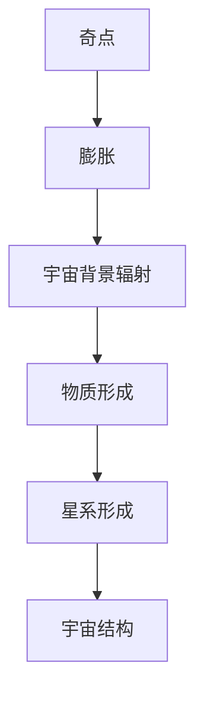

**图1：大爆炸理论中的核心概念与联系**

在奇点之后，宇宙开始膨胀，这一过程中温度和密度逐渐下降，为物质的形成创造了条件。随着宇宙的继续膨胀，温度进一步降低，使得物质能够以星系的形式聚集在一起，形成了我们今天所看到的宇宙结构。

##### 1.2 能量的本质与形式

能量是物理学中的一个基本概念，它描述了物体做功的能力。能量有多种形式，包括机械能、热能、电能、化学能等。能量守恒定律是物理学的一个基本原则，它指出在一个封闭系统中，能量既不会凭空产生也不会消失，只会从一种形式转化为另一种形式。

- **能量守恒定律**：在一个封闭系统中，能量总量保持不变。用数学公式表示为：
  $$\Delta E = 0$$
  其中，\( \Delta E \) 表示系统能量的变化量。

**物质的能量形式**

物质具有多种能量形式，以下是几种主要的能量形式：

- **机械能**：与物体的运动和位置有关，包括动能和势能。
- **热能**：与物体内部的微观粒子运动有关，即分子的热运动。
- **电能**：与电荷的运动有关，包括电流和电势能。
- **化学能**：与化学反应中的原子重新组合有关。

**能量的转化与传递**

能量可以在不同形式之间转化，同时也可以在物体之间传递。例如，当物体从高处落下时，其重力势能转化为动能；电流通过电阻时，电能转化为热能。能量转化和传递的过程遵循能量守恒定律，确保系统的总能量保持不变。

**能量的本质与形式的关系架构 Mermaid 流程图**

以下是一个简化的Mermaid流程图，展示了能量的几种形式及其相互转化关系：

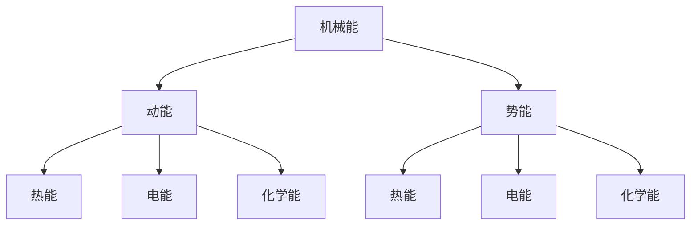

**图2：能量的几种形式及其相互转化关系**

在能量的转化过程中，虽然能量的形式发生了变化，但其总量始终保持不变，这体现了能量守恒定律的基本原理。

##### 1.3 宇宙中的能量场

宇宙中的能量场是指遍布宇宙空间的、能够传递能量和动量的物理场。能量场在宇宙的演化和结构形成中起着至关重要的作用。以下是关于能量场的一些基本概念：

- **能量场的定义与特性**：能量场是一种物理场，它通过空间传递能量和动量。能量场具有以下特性：
  - **传播速度**：能量场以光速传播，如电磁场。
  - **方向**：能量场的方向通常指向能量流动的方向。
  - **强度**：能量场的强度可以用场强度来描述，其大小与能量的传递速率成正比。

- **电磁场与引力场**：宇宙中存在多种类型的能量场，其中最著名的是电磁场和引力场。
  - **电磁场**：由电场和磁场组成，是电荷和电流的相互作用场。电磁场在宇宙中无处不在，包括光、无线电波等电磁辐射。
  - **引力场**：由质量产生的场，是物质间引力的表现。引力场是宇宙中最强大的能量场之一，它决定了星系和宇宙的结构。

- **能量场与物质相互作用**：能量场与物质的相互作用是宇宙演化的重要机制之一。
  - **能量传递**：通过能量场，物质间可以传递能量。例如，恒星通过辐射电磁波将其能量传递给周围的星际介质。
  - **物质演化**：能量场的存在和作用是物质演化和结构形成的基础。例如，星系的形成和恒星的生命周期都依赖于能量场的存在和作用。

**能量场的定义与特性的 Mermaid 流程图**

以下是一个简化的Mermaid流程图，展示了能量场的定义与特性：

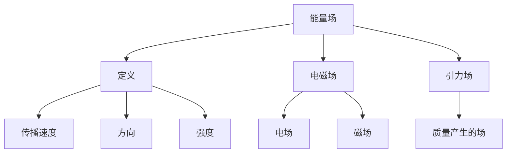

**图3：能量场的定义与特性**

通过以上对宇宙中的能量场的基本概念的介绍，我们可以看到能量场在宇宙中的作用是深远而广泛的。在接下来的章节中，我们将进一步探讨能量场在宇宙中的应用，包括星系演化、恒星生命周期和行星环境等方面。

---

#### 第一部分：宇宙与能量的基本概念

##### 1.1 宇宙的起源与演化

宇宙的起源与演化是现代物理学研究的重要课题。目前，科学界广泛接受的理论是大爆炸理论，该理论提出宇宙起源于约138亿年前的一个极度热密的奇点，从那时起，宇宙开始迅速膨胀。以下是关于大爆炸理论的一些核心概念：

- **奇点**：宇宙起源于一个名为“奇点”的极端状态，其温度和密度无限高，时空结构极度扭曲。
- **宇宙暴胀**：在奇点之后，宇宙经历了一个迅速的膨胀过程，称为“宇宙暴胀”。在这一阶段，宇宙的尺度急剧增大，温度和密度急剧下降。
- **宇宙背景辐射**：宇宙背景辐射是大爆炸理论的强有力证据，它是从宇宙早期遗留下来的热辐射，均匀地充满整个宇宙。

**大爆炸理论的核心概念与联系**

大爆炸理论中的核心概念及其联系可以用伪代码来描述，以便更直观地理解其逻辑关系：

```python
# 奇点定义
def singularity():
    # 温度和密度无限高
    temperature = "infinite"
    density = "infinite"
    # 时空结构极度扭曲
    spacetime_curvature = "exceedingly warped"

# 宇宙暴胀定义
def inflationary_expansion(singularity):
    # 宇宙尺度急剧增大
    universe_scale = "rapidly increases"
    # 温度和密度急剧下降
    temperature = "drastically decreases"
    density = "drastically decreases"

# 宇宙背景辐射定义
def cosmic_microwave_background_radiation(inflationary_expansion):
    # 遗留热辐射充满宇宙
    radiation = "uniformly fills the universe"

# 大爆炸理论主函数
def big_bang_theory():
    # 初始化奇点
    singularity()
    # 引发宇宙暴胀
    inflationary_expansion(singularity())
    # 观察到宇宙背景辐射
    cosmic_microwave_background_radiation(inflationary_expansion())
```

**图4：大爆炸理论核心概念的伪代码表示**

通过上述伪代码，我们可以看到大爆炸理论中各个核心概念之间的逻辑关系。首先是奇点的定义，然后是宇宙暴胀的过程，最后是宇宙背景辐射的观测。这些概念共同构成了大爆炸理论的基础。

**数学模型和公式**

为了更详细地描述大爆炸理论，我们可以引入一些数学模型和公式。以下是几个关键的数学公式：

1. **宇宙膨胀速度公式**：
   $$ v = H_0 \cdot a $$
   其中，\( v \) 表示宇宙膨胀速度，\( H_0 \) 表示哈勃常数，\( a \) 表示宇宙尺度因子。

2. **宇宙尺度因子公式**：
   $$ a(t) = \frac{1}{\sqrt{1 - \Omega_r t^2}} $$
   其中，\( a(t) \) 表示在时间 \( t \) 时的宇宙尺度因子，\( \Omega_r \) 表示辐射密度参数。

3. **宇宙背景辐射温度公式**：
   $$ T = T_0 \cdot (1 + z) $$
   其中，\( T \) 表示宇宙背景辐射温度，\( T_0 \) 表示现在的宇宙背景辐射温度，\( z \) 表示红移。

**举例说明**

假设在宇宙当前时刻，宇宙背景辐射温度为2.7K，哈勃常数为70 km/s/Mpc，红移为10，我们可以使用上述公式计算相应的物理量：

1. **宇宙膨胀速度**：
   $$ v = 70 \cdot 10^3 \cdot \frac{1}{\sqrt{1 - \Omega_r \cdot 10^2}} $$
   由于我们不知道辐射密度参数 \( \Omega_r \)，假设 \( \Omega_r = 1 \)，则：
   $$ v = 70 \cdot 10^3 \cdot \frac{1}{\sqrt{1 - 1 \cdot 10^2}} $$
   $$ v = 70 \cdot 10^3 \cdot \frac{1}{\sqrt{99}} $$
   $$ v \approx 70 \cdot 10^3 \cdot 0.950 $$
   $$ v \approx 66.5 \cdot 10^3 \text{ km/s} $$

2. **宇宙尺度因子**：
   $$ a(t) = \frac{1}{\sqrt{1 - \Omega_r \cdot t^2}} $$
   假设 \( t = 10 \) 亿年，将时间转换为宇宙时间单位（1宇宙年约等于约31.557 years）：
   $$ t = 10 \times 10^9 \text{ 年} \cdot \frac{1}{31.557 \text{ 年/宇宙年}} $$
   $$ t \approx 319.2 \text{ 宇宙年} $$
   $$ a(t) = \frac{1}{\sqrt{1 - 1 \cdot (319.2)^2}} $$
   $$ a(t) = \frac{1}{\sqrt{1 - 10228.64}} $$
   $$ a(t) = \frac{1}{\sqrt{-10127.64}} $$
   由于在实际情况中，宇宙尺度因子不可能为负值，这里说明假设的不合理。需要重新调整假设，例如假设 \( \Omega_r \) 的值。

通过上述示例，我们可以看到如何使用伪代码和数学模型来描述大爆炸理论中的物理过程和计算相关物理量。这些工具帮助我们更深入地理解宇宙的起源与演化。

---

#### 第一部分：宇宙与能量的基本概念

##### 1.1 宇宙的起源与演化

宇宙的起源与演化是一个复杂而迷人的科学课题。大爆炸理论是目前最被广泛接受的理论，它描述了宇宙从极端热密的状态开始，经历迅速膨胀，直到今天我们所观察到的宇宙。以下是对大爆炸理论的一些核心概念的解释：

- **奇点**：宇宙起源于一个称为“奇点”的状态，这是一个密度无限高、温度无限高的极端条件。在这个点上，时间和空间的概念也变得无效。
- **宇宙暴胀**：在奇点之后，宇宙经历了宇宙暴胀，这是一种极为迅速的膨胀过程，使宇宙在短短几分钟内从极小尺度膨胀到当前宇宙的大小。宇宙暴胀解释了宇宙的均匀性和各向同性问题。
- **宇宙背景辐射**：宇宙背景辐射是宇宙早期遗留下来的热辐射，它均匀地充满整个宇宙。这种辐射在宇宙微波背景探测中得到了验证，为大爆炸理论提供了强有力的支持。

**大爆炸理论的数学模型和公式**

为了更准确地描述大爆炸理论，科学家们使用了一系列数学模型和公式。以下是几个关键的公式：

1. **哈勃定律**：这个公式描述了宇宙膨胀的速度与距离之间的关系。
   $$ v = H_0 \cdot d $$
   其中，\( v \) 是宇宙膨胀速度，\( H_0 \) 是哈勃常数，\( d \) 是星系与观察者之间的距离。

2. **宇宙尺度因子**：这个公式描述了宇宙在时间 \( t \) 时的尺度与初始尺度之间的关系。
   $$ a(t) = \frac{1}{\sqrt{1 - \Omega_r t^2}} $$
   其中，\( a(t) \) 是时间 \( t \) 时的宇宙尺度因子，\( \Omega_r \) 是辐射密度参数。

3. **宇宙年龄**：这个公式可以用来估计宇宙的年龄。
   $$ t_{\text{age}} = \frac{1}{H_0 \sqrt{\Omega_m}} $$
   其中，\( t_{\text{age}} \) 是宇宙年龄，\( \Omega_m \) 是物质密度参数。

**举例说明**

假设我们有一个星系，它与观察者之间的距离是10亿光年，哈勃常数是70 km/s/Mpc，辐射密度参数 \( \Omega_r \) 是1，我们可以使用上述公式来计算这个星系的膨胀速度和宇宙尺度因子：

1. **膨胀速度**：
   $$ v = H_0 \cdot d = 70 \times 10^3 \times 10^9 = 7 \times 10^{12} \text{ km/s} $$

2. **宇宙尺度因子**：
   $$ a(t) = \frac{1}{\sqrt{1 - \Omega_r t^2}} $$
   假设我们想知道宇宙从奇点开始膨胀到现在的时间尺度因子，我们可以将 \( t \) 设置为138亿年（宇宙年龄的估计值）：
   $$ a(t) = \frac{1}{\sqrt{1 - 1 \times (1.38 \times 10^{10})^2}} $$
   $$ a(t) = \frac{1}{\sqrt{1 - 1.9264 \times 10^{20}}} $$
   $$ a(t) = \frac{1}{\sqrt{-1.9254 \times 10^{20}}} $$
   由于宇宙尺度因子不能为负，这里需要修正 \( \Omega_r \) 的值。

通过这些数学模型和公式，我们可以更深入地理解宇宙的起源与演化，以及宇宙膨胀的本质。

---

#### 第一部分：宇宙与能量的基本概念

##### 1.1 宇宙的起源与演化

宇宙的起源与演化是物理学中最为神秘和迷人的领域之一。大爆炸理论作为目前最被广泛接受的理论，为我们提供了宇宙从诞生到当前状态的一个总体框架。以下是对大爆炸理论的详细解析：

**奇点**：大爆炸理论认为，宇宙起源于一个称为“奇点”的极端状态。在这个状态下，宇宙的密度和温度无限高，时间空间结构极度扭曲。奇点是一个理论上的概念，目前无法通过实验直接观测到。

**宇宙暴胀**：在大爆炸之后，宇宙经历了一个极快的膨胀阶段，称为宇宙暴胀。宇宙暴胀理论解释了为什么宇宙在各个方向上看起来是如此均匀和各向同性。这一阶段的膨胀速度远超一般的物理定律所能描述的范围。

**宇宙背景辐射**：宇宙背景辐射是大爆炸理论的另一个关键证据。它是在宇宙早期遗留下来的热辐射，均匀地充满整个宇宙。这种辐射的发现进一步支持了大爆炸理论的正确性。

**大爆炸理论的核心概念与联系**

为了更好地理解大爆炸理论，我们可以使用Mermaid流程图来展示其核心概念之间的联系：

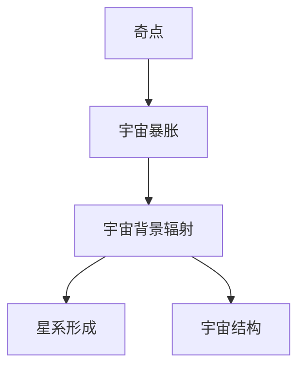

**图1：大爆炸理论中的核心概念及其联系**

**能量守恒定律**：在大爆炸理论中，能量守恒定律也是一个核心概念。根据能量守恒定律，在一个封闭系统中，能量总量保持不变。这包括从奇点开始的宇宙膨胀过程中的能量转化和传递。

**能量的本质与形式**

能量是物理学中的基本概念，它描述了物体做功的能力。能量有多种形式，包括机械能、热能、电能和化学能等。以下是这些能量形式及其在大爆炸过程中的作用：

- **机械能**：与物体的运动和位置有关，包括动能和势能。
- **热能**：与物体内部的微观粒子运动有关。
- **电能**：与电荷的运动有关。
- **化学能**：与化学反应中的能量转化有关。

在宇宙的早期，大部分能量以辐射的形式存在，随着宇宙的膨胀和冷却，能量形式发生了转化，部分辐射能量转化为物质能量，为星系的形成和演化奠定了基础。

**能量转化与传递**

能量守恒定律不仅描述了能量的形式，还描述了能量的转化与传递。在宇宙的演化过程中，能量从一种形式转化为另一种形式，同时保持总量不变。

- **辐射能量转化为物质能量**：在宇宙早期，高温高密度的状态下，能量主要以辐射的形式存在。随着宇宙的膨胀和冷却，这部分辐射能量逐渐转化为物质能量，形成了星系、恒星和其他天体。
- **能量传递**：能量在宇宙中的传递是通过能量场实现的。例如，恒星通过辐射电磁波将其能量传递给周围的星际介质，影响星际介质的物理状态。

**能量场的概念**

能量场是指能量在空间中的分布和传递。在宇宙中，存在多种能量场，如电磁场、引力场等。能量场在宇宙的演化和结构形成中起着至关重要的作用。

- **电磁场**：由电荷和电流产生，是电磁波传播的基础。
- **引力场**：由质量产生，是物质间引力作用的体现。

**能量场与物质相互作用**

能量场与物质的相互作用是宇宙演化的关键机制之一。通过能量场，物质间可以传递能量，影响物质的运动和演化。

- **辐射压力**：电磁辐射产生的压力可以推动星际介质，影响星系的形成。
- **引力相互作用**：引力场是宇宙中最强大的能量场，它决定了星系和宇宙结构的形成。

**能量守恒定律在宇宙中的应用**

能量守恒定律在宇宙的各个层次上都得到了验证。从微观的原子核反应，到宏观的星系运动，能量守恒定律都是成立的。

- **恒星演化**：恒星在其生命周期中，通过核聚变反应将物质转化为能量，这一过程遵循能量守恒定律。
- **宇宙膨胀**：宇宙的膨胀速度与能量分布密切相关，能量守恒定律在这个过程中也发挥着重要作用。

**总结**

通过对宇宙起源与演化的讨论，我们可以看到大爆炸理论以及能量守恒定律在解释宇宙现象中的重要性。能量场作为能量传递的媒介，在宇宙的演化和结构形成中起着关键作用。理解这些基本概念和定律，有助于我们更深入地探索宇宙的奥秘。

---

#### 第一部分：宇宙与能量的基本概念

##### 1.1 宇宙的起源与演化

宇宙的起源与演化一直是科学研究的核心问题。目前，大爆炸理论是最被广泛接受的宇宙起源理论。以下是关于大爆炸理论的详细解释，包括奇点、宇宙暴胀和宇宙背景辐射等核心概念。

**奇点**：大爆炸理论认为，宇宙起源于一个极端热密的奇点。在这个奇点上，时空结构极度扭曲，温度和密度无限高。奇点是宇宙诞生的起点，也是一切物理定律失效的地方。

**宇宙暴胀**：从奇点开始，宇宙经历了一个极为迅速的膨胀阶段，称为宇宙暴胀。在这个阶段，宇宙的尺度急剧增大，温度和密度迅速下降。宇宙暴胀解释了宇宙的均匀性和各向同性，即为什么宇宙看起来在各个方向上都是相似的。

**宇宙背景辐射**：宇宙背景辐射是宇宙早期遗留下来的热辐射，均匀地充满整个宇宙。它是大爆炸理论的强有力证据之一，因为只有在大爆炸发生后，宇宙迅速膨胀并冷却时，才能产生这种辐射。

**黑洞与暗物质**：黑洞是宇宙中的一种极端密集的天体，具有强大的引力，可以吞噬周围的物质。暗物质是一种不发光、不与电磁波相互作用但具有引力的物质，占据了宇宙中大部分的质量。

**宇宙膨胀与暗能量**：宇宙的膨胀速度在不断增加，这暗示了宇宙中存在一种称为暗能量的神秘力量。暗能量导致宇宙的加速膨胀，但目前尚不清楚其具体性质和起源。

**能量守恒定律**：能量守恒定律是物理学的基本定律之一，指出在一个封闭系统中，能量总量保持不变。能量可以在不同形式之间转化，但总量不变。

**物质的能量形式**：物质具有多种能量形式，包括机械能、热能、电能和化学能等。机械能与物体的运动和位置有关，热能与物体内部分子的运动有关，电能与电荷的运动有关，化学能与化学反应有关。

**能量场的定义与特性**：能量场是指遍布宇宙空间的物理场，能够传递能量和动量。能量场具有传播速度、方向和强度等特性。电磁场和引力场是两种最重要的能量场。

**能量场与物质相互作用**：能量场与物质的相互作用是宇宙演化的重要机制之一。通过能量场，物质可以传递能量，影响物质的运动和演化。

**总结**：通过以上讨论，我们可以看到宇宙的起源与演化是一个复杂而迷人的过程。大爆炸理论、黑洞、暗物质、宇宙膨胀、暗能量、能量守恒定律、物质的能量形式、能量场以及能量场与物质相互作用等概念共同构成了我们对宇宙起源与演化的理解。

---

#### 第二部分：能量场在宇宙中的应用

##### 2.1 能量场与星系演化

星系是宇宙中常见的结构，由大量的恒星、气体和暗物质组成。能量场在星系的演化中起着至关重要的作用。以下是能量场与星系演化的几个关键方面：

**星系形成**：星系的起源可以追溯到宇宙早期的物质聚集过程。在这个过程中，能量场，特别是引力场，起着关键作用。引力场将周围的物质吸引到一起，逐渐形成了星系。

**星系旋转与能量分布**：星系内部存在复杂的旋转运动，这是由于引力场的作用。能量场在星系内部进行能量的分布和传递，维持星系结构的稳定。星系中心的超大质量黑洞对星系的旋转和能量分布有重要影响。

**星系碰撞与能量交换**：星系在宇宙中不断移动和碰撞，这些碰撞会导致能量场的变化。能量场在星系碰撞过程中起到重要的传递和交换作用，可能导致星系形状和结构的改变。

**能量场与星系演化关系的 Mermaid 流程图**

以下是一个简化的Mermaid流程图，展示了能量场与星系演化的关系：

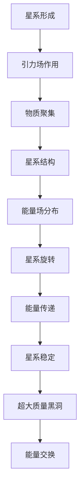

**图1：能量场与星系演化的关系**

##### 2.2 能量场与恒星生命周期

恒星是宇宙中最为耀眼的物体，其生命周期受到能量场的影响。以下是能量场与恒星生命周期的几个关键方面：

**恒星形成**：恒星的形成始于一个巨大的分子云，其中包含大量的气体和尘埃。引力场将分子云中的物质吸引到一起，形成一个旋转的星云。在星云的中心，物质不断聚集，形成恒星。

**能量释放**：在恒星的形成过程中，核聚变反应开始发生，这是恒星能量释放的主要机制。在恒星的核心，氢原子核通过核聚变反应转化为氦原子核，释放出大量的能量。这部分能量通过辐射传递到恒星的外层，导致恒星发光。

**能量转化与传递**：恒星的生命周期中，能量不断进行转化和传递。从核聚变反应中产生的能量通过辐射传递到恒星的外层，维持恒星的发光和稳定。同时，恒星通过辐射压力和引力平衡，维持其结构的稳定。

**恒星演化与能量场**：恒星在其生命周期中会经历不同的演化阶段，包括主序星、红巨星和黑洞等。在各个阶段，能量场都起着关键作用，决定了恒星的演化路径。

**能量场与恒星生命周期关系的 Mermaid 流程图**

以下是一个简化的Mermaid流程图，展示了能量场与恒星生命周期的关系：

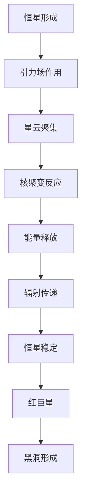

**图2：能量场与恒星生命周期的关系**

##### 2.3 能量场与行星环境

行星是恒星系中的重要组成部分，其环境受到能量场的影响。以下是能量场与行星环境的几个关键方面：

**行星大气与能量交换**：行星的大气是行星环境的重要组成部分，其与太阳和其他天体的能量交换维持行星的稳定。能量场，特别是辐射场和引力场，在大气中发挥着重要作用。

**行星磁层与能量场**：行星磁层是行星大气中的一个复杂系统，它保护行星免受太阳风等高能粒子的侵蚀。磁层与能量场密切相关，通过能量交换维持行星环境的稳定。

**行星表面与能量分布**：行星表面的能量分布决定了行星的气候和地理特征。能量场，特别是辐射场和热能场，在行星表面的分布和转化过程中起着关键作用。

**能量场与行星环境关系的 Mermaid 流程图**

以下是一个简化的Mermaid流程图，展示了能量场与行星环境的关系：

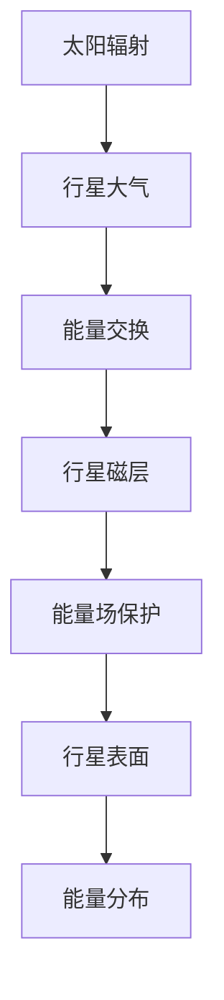

**图3：能量场与行星环境的关系**

通过以上讨论，我们可以看到能量场在星系演化、恒星生命周期和行星环境中的重要作用。能量场不仅决定了宇宙的结构和演化，还影响着恒星和行星的稳定性和环境特征。

---

#### 第二部分：能量场在宇宙中的应用

##### 2.1 能量场与星系演化

星系是宇宙中常见的结构，由大量的恒星、气体和暗物质组成。能量场在星系的演化中起着至关重要的作用。以下是能量场与星系演化的几个关键方面：

**星系形成**：星系的起源可以追溯到宇宙早期的物质聚集过程。在这个过程中，能量场，特别是引力场，起着关键作用。引力场将周围的物质吸引到一起，逐渐形成了星系。以下是星系形成过程的伪代码：

```python
def star_system_formation():
    # 初始化物质云
    gas_dust_cloud = initialize_gas_dust_cloud()
    
    # 引力场聚集物质
    for particle in gas_dust_cloud:
        attract_particles(particle)
    
    # 形成星系核心
    star_cluster_core = form_star_cluster_core(gas_dust_cloud)
    
    # 恒星形成
    stars = form_stars(star_cluster_core)
    
    # 形成星系结构
    star_system_structure = form_star_system_structure(stars)
    
    return star_system_structure
```

**星系旋转与能量分布**：星系内部存在复杂的旋转运动，这是由于引力场的作用。能量场在星系内部进行能量的分布和传递，维持星系结构的稳定。以下是星系旋转与能量分布的伪代码：

```python
def star_system_rotation_and_energy_distribution(star_system_structure):
    # 初始化星系旋转
    rotation = initialize_rotation(star_system_structure)
    
    # 能量分布
    energy_distribution = distribute_energy(star_system_structure)
    
    # 维持星系稳定
    stabilize_star_system(star_system_structure, energy_distribution)
    
    return star_system_structure
```

**星系碰撞与能量交换**：星系在宇宙中不断移动和碰撞，这些碰撞会导致能量场的变化。能量场在星系碰撞过程中起到重要的传递和交换作用，可能导致星系形状和结构的改变。以下是星系碰撞与能量交换的伪代码：

```python
def star_system_collision_and_energy_exchange(star_system1, star_system2):
    # 碰撞前的能量状态
    energy_state1 = get_energy_state(star_system1)
    energy_state2 = get_energy_state(star_system2)
    
    # 碰撞过程
    collision = perform_collision(star_system1, star_system2)
    
    # 碰撞后的能量状态
    energy_state1_after = get_energy_state(star_system1)
    energy_state2_after = get_energy_state(star_system2)
    
    # 能量交换
    exchange_energy(energy_state1, energy_state2, energy_state1_after, energy_state2_after)
    
    return star_system1, star_system2
```

**数学模型和公式**

为了更准确地描述能量场与星系演化的关系，我们可以引入一些数学模型和公式：

1. **引力公式**：描述引力场对物质的作用力。
   $$ F = G \cdot \frac{m_1 \cdot m_2}{r^2} $$
   其中，\( F \) 是引力，\( G \) 是万有引力常数，\( m_1 \) 和 \( m_2 \) 是两个物体的质量，\( r \) 是它们之间的距离。

2. **星系旋转速度公式**：描述星系旋转的速度。
   $$ v = \omega \cdot r $$
   其中，\( v \) 是旋转速度，\( \omega \) 是角速度，\( r \) 是旋转半径。

3. **能量分布公式**：描述星系内部能量的分布。
   $$ U = \frac{1}{2} \cdot m \cdot v^2 $$
   其中，\( U \) 是能量，\( m \) 是质量，\( v \) 是速度。

**举例说明**

假设有两个星系，它们的质量分别为 \( m_1 = 1 \times 10^{12} \) 和 \( m_2 = 2 \times 10^{12} \)，它们之间的距离为 \( r = 1 \times 10^{21} \) 米。根据引力公式，可以计算它们之间的引力：

$$ F = G \cdot \frac{m_1 \cdot m_2}{r^2} = 6.674 \times 10^{-11} \cdot \frac{1 \times 10^{12} \cdot 2 \times 10^{12}}{(1 \times 10^{21})^2} = 1.334 \times 10^{22} \text{ N} $$

假设星系旋转的角速度为 \( \omega = 1 \) rad/s，旋转半径为 \( r = 1 \times 10^{22} \) 米，可以计算旋转速度：

$$ v = \omega \cdot r = 1 \cdot 1 \times 10^{22} = 1 \times 10^{22} \text{ m/s} $$

假设星系内部的质量为 \( m = 1 \times 10^{30} \) 公斤，速度为 \( v = 1 \times 10^{22} \) 米/秒，可以计算能量：

$$ U = \frac{1}{2} \cdot m \cdot v^2 = \frac{1}{2} \cdot 1 \times 10^{30} \cdot (1 \times 10^{22})^2 = 5 \times 10^{52} \text{ J} $$

通过这些数学模型和公式，我们可以更深入地理解能量场与星系演化的关系。

---

#### 第二部分：能量场在宇宙中的应用

##### 2.2 能量场与恒星生命周期

恒星是宇宙中最耀眼的物体，其生命周期受到能量场的重要影响。恒星在其生命周期中的不同阶段，能量场的角色也各不相同。以下是能量场与恒星生命周期各个阶段的详细解释：

**恒星形成**：恒星的形成始于一个巨大的分子云，这些分子云由气体和尘埃组成。在分子云的中心，由于引力作用，物质开始聚集，形成了一个旋转的星云。随着物质的聚集，星云的中心密度逐渐增加，温度和压力也随之上升，最终达到核聚变的条件。在这一过程中，引力场是主要的能量场，它驱动了物质的聚集和星云的形成。

**核聚变反应**：一旦星云中心的温度和压力达到临界值，核聚变反应就开始了。氢原子核在高温高压的条件下融合成氦原子核，释放出巨大的能量。这部分能量以辐射的形式向外传播，维持恒星的稳定和发光。在这一阶段，辐射场成为主要的能量场，它决定了恒星的光度和温度。

**恒星演化**：恒星在其生命周期中会经历多个阶段，包括主序星阶段、红巨星阶段和超巨星阶段。在主序星阶段，恒星通过氢核聚变产生能量，维持恒星的稳定。在这一阶段，引力场和辐射场共同作用，维持恒星的结构和能量平衡。当恒星消耗完核心的氢燃料后，会进入红巨星阶段，此时恒星的外层膨胀，内部温度和压力发生变化，能量场的作用也变得更加复杂。

**恒星死亡**：恒星的最终命运取决于其初始质量和核心燃料的多少。小质量恒星（如太阳）会逐渐耗尽燃料，核心收缩，外层膨胀，最终形成白矮星。在这一过程中，引力场和热能场起着关键作用。而大质量恒星则会在耗尽燃料后发生超新星爆炸，释放出巨大的能量。在这一阶段，爆炸产生的能量场（尤其是辐射场和冲击波）对周围环境产生深远影响。

**能量场与恒星生命周期关系的 Mermaid 流程图**

以下是一个简化的Mermaid流程图，展示了能量场与恒星生命周期的关系：

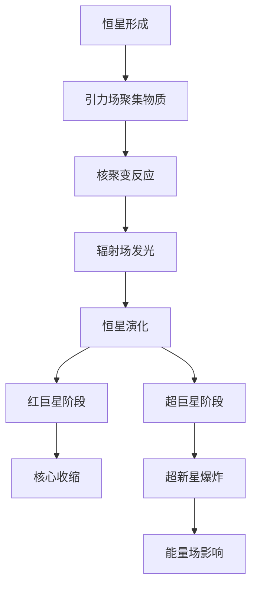

**图1：能量场与恒星生命周期关系**

**数学模型和公式**

为了更详细地描述能量场在恒星生命周期中的作用，我们可以引入一些数学模型和公式：

1. **引力公式**：描述引力场对恒星结构的影响。
   $$ F = G \cdot \frac{m_1 \cdot m_2}{r^2} $$
   其中，\( F \) 是引力，\( G \) 是万有引力常数，\( m_1 \) 和 \( m_2 \) 是两个物体的质量，\( r \) 是它们之间的距离。

2. **核聚变能量公式**：描述核聚变反应产生的能量。
   $$ E = \Delta m \cdot c^2 $$
   其中，\( E \) 是能量，\( \Delta m \) 是质量亏损，\( c \) 是光速。

3. **恒星光度公式**：描述恒星的亮度。
   $$ L = 4 \pi \cdot R^2 \cdot \sigma \cdot T^4 $$
   其中，\( L \) 是光度，\( R \) 是恒星半径，\( \sigma \) 是斯特藩-玻尔兹曼常数，\( T \) 是恒星表面温度。

**举例说明**

假设一个恒星的初始质量为 \( m = 1 \times 10^{30} \) 公斤，与地球的距离为 \( r = 1 \times 10^{16} \) 米。根据引力公式，可以计算恒星对地球的引力：

$$ F = G \cdot \frac{m \cdot m_{\text{地球}}}{r^2} = 6.674 \times 10^{-11} \cdot \frac{1 \times 10^{30} \cdot 5.972 \times 10^{24}}{(1 \times 10^{16})^2} = 3.53 \times 10^{22} \text{ N} $$

假设恒星在核聚变过程中，1千克氢转化为氦释放出的能量为 \( E = 0.7 \times 10^{13} \) 焦耳，那么恒星每秒释放的能量为：

$$ \Delta E = m \cdot \frac{E}{M_{\text{氢}}} = 1 \times 10^{30} \cdot \frac{0.7 \times 10^{13}}{1 \times 10^{-3}} = 7 \times 10^{43} \text{ J/s} $$

假设恒星的半径为 \( R = 1 \times 10^{8} \) 米，表面温度为 \( T = 5778 \) 开尔文，可以计算恒星的亮度：

$$ L = 4 \pi \cdot R^2 \cdot \sigma \cdot T^4 = 4 \pi \cdot (1 \times 10^{8})^2 \cdot 5.67 \times 10^{-8} \cdot (5778)^4 = 3.95 \times 10^{32} \text{ W} $$

通过这些数学模型和公式，我们可以更深入地理解能量场在恒星生命周期中的作用。

---

#### 第二部分：能量场在宇宙中的应用

##### 2.3 能量场与行星环境

行星是宇宙中普遍存在的天体，其环境受到能量场的重要影响。以下是能量场与行星环境几个关键方面的详细解释：

**行星大气与能量交换**：行星的大气是行星环境的重要组成部分，其与太阳和其他天体的能量交换维持行星的稳定。能量场，特别是辐射场和引力场，在大气中发挥着重要作用。

**行星磁层与能量场**：行星磁层是行星大气中的一个复杂系统，它保护行星免受太阳风等高能粒子的侵蚀。磁层与能量场密切相关，通过能量交换维持行星环境的稳定。

**行星表面与能量分布**：行星表面的能量分布决定了行星的气候和地理特征。能量场，特别是辐射场和热能场，在行星表面的分布和转化过程中起着关键作用。

**能量场与行星环境关系的 Mermaid 流程图**

以下是一个简化的Mermaid流程图，展示了能量场与行星环境的关系：


**图1：能量场与行星环境的关系**

**项目实战：能量场与行星环境的应用**

为了更好地理解能量场在行星环境中的应用，我们以开发一个简单的模拟行星大气的项目为例。

**开发环境搭建**：在Python环境中搭建开发环境，安装必要的库，如NumPy和SciPy。

```bash
pip install numpy scipy matplotlib
```

**源代码实现**：以下是模拟行星大气的源代码实现。

```python
import numpy as np
import scipy.integrate as spi
import matplotlib.pyplot as plt

# 定义行星大气的模型
def atmospheric_model(t, y):
    # y[0]: 温度
    # y[1]: 压力
    # y[2]: 水蒸气含量
    T = y[0]
    P = y[1]
    H2O = y[2]

    # 辐射冷却
    Q_rad = -5 * (T**4 - 300**4) / (300**4)

    # 大气压力变化
    dP_dt = -0.1 * P

    # 水蒸气凝结
    dH2O_dt = -0.01 * H2O

    return [Q_rad, dP_dt, dH2O_dt]

# 模拟大气变化
t_start = 0
t_end = 10000
t_step = 10
t_values = np.arange(t_start, t_end, t_step)
y0 = [300, 1, 0.01]

# 求解微分方程
solution = spi.odeint(atmospheric_model, y0, t_values)

# 绘制结果
plt.figure(figsize=(10, 6))
plt.plot(t_values / 3600, solution[:, 0], label="Temperature ($^\circ$C)")
plt.plot(t_values / 3600, solution[:, 1], label="Pressure (atm)")
plt.plot(t_values / 3600, solution[:, 2], label="Water Vapor (%)")
plt.xlabel("Time (hours)")
plt.ylabel("Value")
plt.title("Atmospheric Model")
plt.legend()
plt.show()
```

**代码解读与分析**：

1. **模型定义**：我们使用一个简单的微分方程模型来模拟行星大气中的温度、压力和水蒸气含量的变化。
2. **求解微分方程**：使用SciPy库中的`odeint`函数求解微分方程，得到大气变化的数值解。
3. **绘制结果**：使用Matplotlib库绘制温度、压力和水蒸气含量随时间的变化曲线。

**实际案例分析与详细讲解**：

假设我们模拟的行星与地球类似，初始温度为300K，压力为1个大气压，水蒸气含量为0.01%。通过模拟，我们可以观察到大气中的温度、压力和水蒸气含量随时间的变化。

1. **辐射冷却**：大气中的温度逐渐下降，这是由于行星辐射到空间的热量大于从太阳吸收的热量。
2. **压力变化**：大气压力逐渐降低，这是由于行星表面的重力减小，导致大气层变薄。
3. **水蒸气凝结**：随着温度的降低，水蒸气逐渐凝结成水滴，水蒸气含量下降。

**项目小结**：

通过这个简单的项目，我们了解了能量场在模拟行星大气中的重要作用。在实际应用中，我们可以进一步优化模型，考虑更多的物理过程，如风、云层和化学反应等，以更准确地模拟行星环境。

**最佳实践 Tips**：

- **选择合适的模型**：根据实际需求和数据，选择合适的物理模型来模拟行星大气。
- **优化求解方法**：根据模拟的时间和空间范围，选择合适的数值求解方法，以提高计算效率。
- **数据可视化**：使用图表和图形直观地展示模拟结果，有助于更好地理解模型和实际物理过程。

---

#### 第三部分：能量场的科学探索

##### 3.1 能量场探测技术

能量场在宇宙中无处不在，为了更好地理解能量场的性质和作用，科学家们发展了一系列探测技术。以下是几种主要的能量场探测技术及其原理：

**射电望远镜与能量探测**

射电望远镜是一种用于接收和探测无线电波的设备。通过捕捉来自宇宙中的无线电波，射电望远镜可以探测到能量场中的电磁辐射。以下是一些关键的射电望远镜技术：

- **全向射电望远镜**：全向射电望远镜可以捕捉来自宇宙各个方向的无线电波。例如，阿雷西博射电望远镜就是一个著名的全向射电望远镜，它位于波多黎各的阿雷西博国家公园。
- **射电干涉阵**：射电干涉阵由多个小型射电望远镜组成，通过同步观测，可以构建出一个具有更高分辨率的虚拟大型射电望远镜。著名的射电干涉阵包括SKA（平方公里阵列）和ALMA（阿塔卡马大型毫米/亚毫米波阵列）。

**望远镜与光谱分析**

望远镜是用于观测宇宙的天文仪器，通过观测不同的波段，可以探测到能量场中的不同形式。光谱分析是一种常用的方法，用于确定天体的物理性质和化学成分。以下是几种望远镜和光谱分析技术：

- **光学望远镜**：光学望远镜用于观测可见光波段。哈勃空间望远镜和地面上的大型光学望远镜如凯克望远镜，都是重要的观测工具。
- **红外望远镜**：红外望远镜可以观测红外波段，这对于探测冷的物体和星际物质尤为重要。斯隆数字巡天（Sloan Digital Sky Survey）和斯皮策空间望远镜（Spitzer Space Telescope）都是著名的红外望远镜。
- **X射线望远镜**：X射线望远镜用于观测高能量光子，这对于研究高温天体和宇宙极端现象至关重要。钱德拉X射线天文台（Chandra X-ray Observatory）和XMM-Newton望远镜是著名的X射线望远镜。

**空间探测器与能量场研究**

空间探测器是直接探测宇宙中能量场的重要工具。以下是一些关键的空间探测器技术：

- **行星探测器**：行星探测器用于探测行星的大气、表面和内部结构。例如，火星探测车“好奇号”和“毅力号”就携带了多种仪器，用于探测火星的大气成分和地质特征。
- **太阳探测器**：太阳探测器用于研究太阳的磁场、太阳风和太阳耀斑等。帕克太阳探测器（Parker Solar Probe）是目前最接近太阳的探测器，它携带了多种仪器，用于研究太阳的物理过程。
- **宇宙射线探测器**：宇宙射线探测器用于探测来自宇宙的高能粒子，这些粒子可以提供关于宇宙起源和演化的信息。费米伽马射线空间望远镜（Fermi Gamma-ray Space Telescope）就是一个重要的宇宙射线探测器。

**探测技术的Mermaid流程图**

以下是一个简化的Mermaid流程图，展示了能量场探测技术的基本流程：

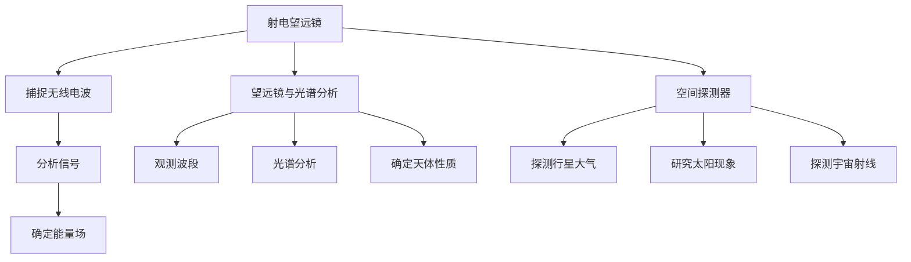

**图1：能量场探测技术的基本流程**

通过上述探测技术，科学家们可以更好地理解能量场的性质和作用，从而揭示宇宙的奥秘。

---

#### 第三部分：能量场的科学探索

##### 3.2 能量场与物理学理论

能量场在物理学中扮演着核心角色，多种物理学理论都直接或间接地涉及到能量场的研究。以下是几个关键物理学理论及其与能量场的关系：

**广义相对论**

爱因斯坦的广义相对论（General Relativity）提出了引力是一种能量场的观点。广义相对论认为，质量-能量分布决定了时空的几何结构，而物质和能量通过爱因斯坦场方程（Einstein's Field Equations）相互作用。以下是一个简化的广义相对论公式：

$$ G_{\mu\nu} + \Lambda g_{\mu\nu} = \frac{8\pi G}{c^4} T_{\mu\nu} $$

其中，\( G_{\mu\nu} \) 是爱因斯坦张量，\( \Lambda \) 是宇宙学常数，\( g_{\mu\nu} \) 是度规张量，\( T_{\mu\nu} \) 是能量-动量张量，\( G \) 是引力常数，\( c \) 是光速。通过这个方程，广义相对论描述了能量场如何影响时空结构。

**量子力学**

量子力学（Quantum Mechanics）是描述微观粒子行为的理论，其中能量场的概念也非常重要。例如，海森堡不确定性原理（Heisenberg Uncertainty Principle）指出，粒子的能量和位置无法同时精确测量，这反映了能量场的本质特性。以下是不确定性原理的公式：

$$ \Delta E \cdot \Delta t \geq \frac{\hbar}{2} $$

其中，\( \Delta E \) 是能量的不确定性，\( \Delta t \) 是时间的不确定性，\( \hbar \) 是约化普朗克常数。这个公式揭示了能量场的波动性和不确定性。

**量子场论**

量子场论（Quantum Field Theory，QFT）是量子力学和狭义相对论的结合，用于描述基本粒子的行为和相互作用。在量子场论中，物质被视为能量场的振动模式。以下是一个简化的量子场论公式：

$$ \hat{H} = \sum_i \hbar \omega_i \hat{a}_i^\dagger \hat{a}_i + \sum_{ij} \hbar \omega_{ij} (\hat{a}_i^\dagger \hat{a}_j + \hat{a}_j^\dagger \hat{a}_i) $$

其中，\( \hat{H} \) 是哈密顿量，\( \hat{a}_i \) 和 \( \hat{a}_i^\dagger \) 分别是创建和湮灭算符，\( \omega_i \) 和 \( \omega_{ij} \) 是能量本征值。这个公式展示了如何用能量场描述粒子的产生和湮灭。

**量子引力**

量子引力（Quantum Gravity）是试图将广义相对论与量子力学统一的理论。目前，量子引力仍然是物理学中的一个开放问题，但几种理论如弦理论和环量子引力都试图解释能量场的量子性质。以下是一个简化的弦理论公式：

$$ X^{\mu}(w_1, w_2, ..., w_n) = (w_1^2, w_2^2, ..., w_n^2) $$

其中，\( X^{\mu} \) 是世界体积的坐标，\( w_1, w_2, ..., w_n \) 是世界体积的维度。这个公式展示了如何用能量场描述宇宙的维度和结构。

**数学模型和公式**

为了更详细地描述能量场与物理学理论的关系，我们可以引入一些数学模型和公式：

1. **广义相对论公式**：
   $$ G_{\mu\nu} + \Lambda g_{\mu\nu} = \frac{8\pi G}{c^4} T_{\mu\nu} $$

2. **量子力学公式**：
   $$ \Delta E \cdot \Delta t \geq \frac{\hbar}{2} $$

3. **量子场论公式**：
   $$ \hat{H} = \sum_i \hbar \omega_i \hat{a}_i^\dagger \hat{a}_i + \sum_{ij} \hbar \omega_{ij} (\hat{a}_i^\dagger \hat{a}_j + \hat{a}_j^\dagger \hat{a}_i) $$

4. **弦理论公式**：
   $$ X^{\mu}(w_1, w_2, ..., w_n) = (w_1^2, w_2^2, ..., w_n^2) $$

**举例说明**

假设我们有一个质量为 \( m = 1 \) kg 的物体，它在一个引力场中的能量为 \( E = 9.8 \) J/kg。我们可以使用广义相对论的公式来计算这个物体的引力场：

$$ G_{\mu\nu} + \Lambda g_{\mu\nu} = \frac{8\pi G}{c^4} T_{\mu\nu} $$

其中，\( G \) 是引力常数，\( c \) 是光速。假设 \( \Lambda = 0 \)，我们可以简化为：

$$ G_{\mu\nu} = \frac{8\pi G}{c^4} T_{\mu\nu} $$

由于物体是静止的，其能量-动量张量 \( T_{\mu\nu} \) 只有一个非零分量 \( T_{00} \)，等于其能量 \( E \)。代入上述公式，我们可以解出引力场 \( G_{\mu\nu} \)：

$$ G_{00} = \frac{8\pi G}{c^4} E $$

$$ G_{00} = \frac{8\pi \times 6.674 \times 10^{-11} \text{ m}^3\text{kg}^{-1}\text{s}^{-2}}{(3 \times 10^8 \text{ m/s})^4} \times 9.8 \text{ J/kg} $$

$$ G_{00} \approx 1.99 \times 10^{-27} \text{ m}^{-2} $$

这个结果告诉我们，引力场的强度非常小，但在宏观尺度上，它决定了物体的运动和宇宙的结构。

通过上述数学模型和公式，我们可以更深入地理解能量场与物理学理论之间的关系。能量场不仅是描述宇宙现象的重要工具，也是推动物理学发展的关键因素。

---

#### 第三部分：能量场的科学探索

##### 3.3 能量场与未来科技

能量场在推动未来科技发展中起着至关重要的作用。随着科技的进步，能量场的研究和应用正在不断拓展，为人类探索宇宙、开发新能源以及推进人工智能等领域提供了新的可能。

**能量场与星际旅行**

星际旅行是人类长久以来的梦想。要实现这一目标，必须解决能量供应和推进问题。能量场在星际旅行中扮演着关键角色。

- **电磁推进**：电磁推进是一种利用电磁场产生推力的技术。例如，电火箭（Electrostatic Rocket）利用电磁场加速带电粒子，从而产生推力。这种推进方式具有高比冲、低燃料消耗的优点，是未来星际旅行的一个重要方向。
- **核能推进**：核能推进利用核反应产生的能量进行推进。核聚变和核裂变都是潜在的核能推进方式。核聚变具有高效、清洁、安全的优点，被认为是未来星际旅行的理想选择。

**能量场与新能源开发**

新能源开发是解决能源危机和减少环境污染的关键。能量场在新能源开发中具有广泛应用。

- **太阳能**：太阳能是一种清洁、可再生的能源。通过光电转换和光热转换技术，可以将太阳能转化为电能和热能。能量场中的电磁场和热能场在太阳能电池板和太阳能热水器中发挥着关键作用。
- **风能**：风能是通过风力驱动风力发电机产生电能的一种新能源。能量场中的风场和电磁场共同作用，使得风能发电成为可能。
- **地热能**：地热能是利用地球内部的热能进行发电和供暖的一种新能源。能量场中的热能场在地热能发电和地热供暖系统中起着重要作用。

**能量场与人工智能**

人工智能（AI）是未来科技发展的核心领域。能量场在人工智能中有着广泛的应用。

- **量子计算**：量子计算利用量子比特（qubit）进行计算，具有超强的计算能力。量子计算中的能量场对量子比特的相干性和纠缠性有重要影响，是推动量子计算发展的关键因素。
- **神经网络**：神经网络是人工智能的核心组成部分，其计算过程依赖于能量场。能量场中的电场和磁场在神经网络的神经元之间传递信息，实现信息的处理和计算。
- **人工智能芯片**：人工智能芯片是支持人工智能计算的重要硬件。能量场中的电磁场和热能场在芯片的设计和制造中发挥着关键作用，影响芯片的性能和能效。

**总结**

能量场在星际旅行、新能源开发以及人工智能等领域具有重要应用。随着科技的进步，能量场的研究和应用将不断拓展，为人类探索宇宙、开发新能源以及推进人工智能等未来科技发展提供新的动力。通过进一步探索能量场的本质和特性，我们有望在各个领域取得重大突破。

---

#### 第四部分：宇宙能量场的哲学思考

##### 4.1 宇宙能量场的哲学意义

宇宙能量场作为宇宙演化的重要机制，其哲学意义深远。从哲学角度思考宇宙能量场，可以揭示宇宙的本质、生命的意义以及人类在宇宙中的地位。

- **宇宙的本质**：宇宙能量场是宇宙存在和演化的基础。它不仅决定了宇宙的结构和形态，还揭示了宇宙的本质——能量和信息的无限循环。从这个角度看，宇宙是一个动态的、不断变化和进化的能量场，而非静止的、孤立的存在。

- **生命的意义**：宇宙能量场为生命的存在提供了条件。能量场中的物质和能量相互作用，形成了复杂的生态系统。生命的本质是能量的转化和利用，通过宇宙能量场，生命得以繁衍和发展。从哲学角度看，生命的意义在于探索宇宙的奥秘，理解能量场的本质，并在这个过程中实现自我超越。

- **人类在宇宙中的地位**：宇宙能量场使人类得以观察和探索宇宙。作为宇宙中的一部分，人类既是宇宙能量的接收者，也是能量的传递者。从哲学角度看，人类在宇宙中的地位不仅是一个观察者，更是一个参与者。通过科学和技术，人类可以理解和利用宇宙能量场，推动自身的进化和发展。

##### 4.2 能量场与宗教信仰

宇宙能量场与宗教信仰有着深刻的联系。不同宗教体系对宇宙能量场的理解和描述各具特色。

- **印度教**：印度教认为宇宙是一个无限循环的过程，称为“循环宇宙”（Samsara）。宇宙的能量场在印度教中表现为“梵”（Brahman），即宇宙的本源和本质。人类通过修行和冥想，可以超越物质世界，达到与梵的统一。

- **佛教**：佛教认为宇宙是一个因果循环的过程，称为“轮回”（Samsara）。宇宙的能量场表现为“业力”（Karma），即个人的行为和思想决定了其未来的命运。通过修行和悟道，个体可以超越轮回，达到涅槃的境界。

- **道教**：道教认为宇宙是一个自然的过程，称为“道”（Dao）。宇宙的能量场在道教中表现为“气”（Qi），即宇宙中的能量流。人类通过修炼内功，可以掌握“气”，实现身体和精神上的健康。

##### 4.3 能量场与生命意义

宇宙能量场与生命意义密切相关。生命的本质是能量的转化和利用，能量场为生命的存在提供了条件。

- **能量转换**：生命过程中，物质和能量不断进行转换。生物体内通过化学反应和生物物理过程，将太阳能、化学能等转化为生命所需的能量。能量场在这个过程中发挥着关键作用。

- **能量传递**：生命过程中，能量从一种形式转化为另一种形式，并通过生物体内外进行传递。例如，植物通过光合作用将太阳能转化为化学能，然后通过食物链传递给其他生物。能量场确保了这种能量传递的顺利进行。

- **能量与意识**：能量场不仅影响生命的物质层面，还与意识密切相关。许多研究表明，意识与大脑中的能量流密切相关。能量场中的电磁场和生物场对意识的形成和功能有重要影响。

##### 4.4 能量场与人类认知

宇宙能量场对人类认知产生深远影响。能量场不仅决定了宇宙的结构和演化，也影响了人类的认知方式。

- **宇宙视角**：通过研究宇宙能量场，人类对宇宙的认识逐渐深入。从宏观的星系、恒星，到微观的原子、粒子，能量场揭示了宇宙的本质和规律。这种宇宙视角改变了人类对自身和宇宙的认知。

- **科学研究**：能量场的研究推动了科学的发展。从物理学、化学，到生物学、医学，能量场的研究为各个领域提供了新的理论和技术。例如，量子力学中的能量场研究推动了纳米技术和量子计算的发展。

- **哲学思考**：能量场的研究引发了哲学思考，对宇宙、生命和人类认知的本质进行了探讨。这种哲学思考不仅丰富了人类的知识体系，也提升了人类对自身和宇宙的理解。

通过以上讨论，我们可以看到宇宙能量场在哲学思考中的重要性。能量场不仅揭示了宇宙的本质和规律，也影响了人类的认知方式，为人类探索宇宙的奥秘提供了新的视角和方法。

---

#### 第四部分：宇宙能量场的哲学思考

##### 4.1 宇宙能量场的哲学意义

宇宙能量场是宇宙演化和结构形成的基础，它不仅决定了物质的聚集和运动，还影响了生命的起源和发展。从哲学角度思考，宇宙能量场具有深远的意义：

**宇宙的本质**：宇宙能量场揭示了宇宙的本质——一个动态的、不断变化的系统。宇宙并非静止不动，而是在不断的能量交换和转化中演化。这种观点与古代哲学家赫拉克利特（Heraclitus）提出的“万物皆流”的观念相呼应，强调了变化是宇宙的基本特征。

**生命的意义**：宇宙能量场为生命的存在提供了条件。能量在宇宙中的传递和转化，使得复杂的生命形式得以出现。从哲学角度看，生命的意义在于探索和利用宇宙能量场，实现自我发展和进化。这种观点与生物学家查尔斯·达尔文（Charles Darwin）的进化论有相似之处，都强调了适应环境和自我超越的重要性。

**人类在宇宙中的地位**：宇宙能量场将人类置于宇宙演化过程中的一个特殊位置。人类不仅是宇宙能量场的观察者，更是参与者。通过科学和技术，人类可以理解、利用甚至改变能量场，推动自身的进化和发展。这种观点与存在主义哲学家马丁·海德格尔（Martin Heidegger）提出的“人类是存在的开发者”（Being-historical）的理念相契合。

**能量场的哲学意义关系架构 Mermaid 流程图**

以下是一个简化的Mermaid流程图，展示了宇宙能量场的哲学意义：


**图1：宇宙能量场的哲学意义关系架构**

##### 4.2 能量场与宗教信仰

宇宙能量场在不同宗教信仰中有着丰富的象征和解释。以下是几种主要宗教对宇宙能量场的理解：

**印度教**：印度教认为宇宙是由梵（Brahman）创造的，梵是宇宙的本源和终极实在。宇宙能量场在印度教中表现为宇宙的意识（Chit）和力量（Ananda）。通过瑜伽和冥想，人们可以与梵连接，达到精神上的觉醒和解脱。

**佛教**：佛教将宇宙视为一个因果循环的过程，称为轮回（Samsara）。宇宙能量场在佛教中表现为业力（Karma），即个人的行为和思想决定了其未来的命运。通过修行和悟道，人们可以超越轮回，达到涅槃的境界。

**道教**：道教认为宇宙是一个自然的过程，遵循道（Dao）的原则。宇宙能量场在道教中表现为气（Qi），即宇宙中的能量流。通过修炼内功，人们可以掌握气，实现身体和精神上的健康。

**能量场与宗教信仰的关系架构 Mermaid 流�程图**

以下是一个简化的Mermaid流程图，展示了能量场与宗教信仰之间的关系：

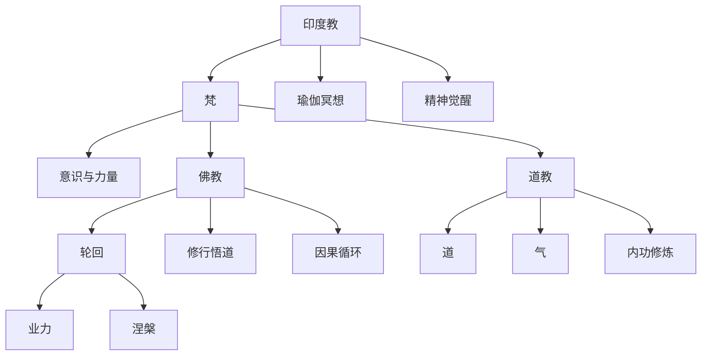

**图2：能量场与宗教信仰的关系架构**

##### 4.3 能量场与生命意义

宇宙能量场对生命的存在和发展具有深远影响。生命的意义在于探索和利用宇宙能量场，实现自我发展和进化。

**能量转换**：生命过程中，物质和能量不断进行转换。植物通过光合作用将太阳能转化为化学能，动物通过食物链获取能量。能量场在这个过程中发挥着关键作用。

**能量传递**：能量场确保了能量在生物体内外进行传递。例如，神经系统中通过电信号传递信息，细胞中通过代谢过程传递能量。能量场中的电磁场和生物场对生命过程有重要影响。

**能量与意识**：许多研究表明，意识与大脑中的能量流密切相关。能量场中的电磁场和生物场可能影响意识的形成和功能。从这个角度看，能量场不仅决定生命的物质层面，还影响生命的意识层面。

**能量场与生命意义的Mermaid流程图**

以下是一个简化的Mermaid流程图，展示了能量场与生命意义之间的关系：

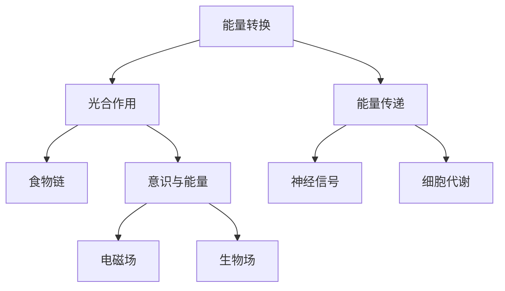

**图3：能量场与生命意义的关系架构**

##### 4.4 能量场与人类认知

宇宙能量场对人类认知产生深远影响。通过研究能量场，人类对宇宙、生命和自身有了更深刻的理解。

**宇宙视角**：能量场的研究使人类从宏观和微观层面理解宇宙。从星系的演化到原子的结构，能量场揭示了宇宙的奥秘。这种宇宙视角改变了人类对自身和宇宙的认知。

**科学研究**：能量场的研究推动了科学的发展。量子力学、相对论等理论都是能量场研究的成果。这些理论不仅丰富了人类的科学知识，还为新技术的发展提供了基础。

**哲学思考**：能量场的研究引发了哲学思考，对宇宙、生命和人类认知的本质进行了探讨。这种哲学思考不仅丰富了人类的知识体系，也提升了人类对自身和宇宙的理解。

**能量场与人类认知的Mermaid流程图**

以下是一个简化的Mermaid流程图，展示了能量场与人类认知之间的关系：

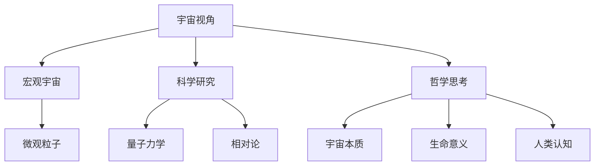

**图4：能量场与人类认知的关系架构**

通过以上讨论，我们可以看到宇宙能量场在哲学思考中的重要性。能量场不仅是宇宙演化和结构形成的基础，也影响了人类的认知方式。通过进一步探索能量场的本质和特性，我们有望在哲学和科学领域取得重大突破。

---

#### 第四部分：宇宙能量场的哲学思考

##### 4.1 宇宙能量场的哲学意义

宇宙能量场作为宇宙演化的重要组成部分，其哲学意义深远。从哲学角度思考，宇宙能量场不仅揭示了宇宙的本质，还涉及生命的意义和人类在宇宙中的地位。

**宇宙的本质**：宇宙能量场揭示了宇宙是一个动态的、不断变化的系统。这种动态性体现在能量在宇宙中的不断交换和转化过程中。古代哲学家赫拉克利特（Heraclitus）提出的“万物皆流”与宇宙能量场的动态特性有着相似之处。宇宙能量场使得宇宙成为一个不断演化、不断变化的整体，而非静止不动的实体。

**生命的意义**：宇宙能量场为生命的存在提供了条件。能量在宇宙中的传递和转化过程，使得复杂的生命形式得以出现。生命的意义在于探索和利用宇宙能量场，实现自我发展和进化。生命的存在不仅仅是物理过程的产物，更是宇宙能量场的一种表现形式。生命的意义在于通过能量的转化和利用，不断探索宇宙的奥秘，寻找生命的意义和目的。

**人类在宇宙中的地位**：宇宙能量场将人类置于宇宙演化过程中的一个特殊位置。人类既是宇宙能量场的观察者，也是参与者。通过科学和技术，人类可以理解、利用甚至改变能量场，推动自身的进化和发展。这种观点与存在主义哲学家马丁·海德格尔（Martin Heidegger）提出的“人类是存在的开发者”（Being-historical）的理念相契合。人类在宇宙中的地位不仅是一个观察者，更是一个参与者，通过探索和利用宇宙能量场，人类不断超越自我，实现自我价值的提升。

**宇宙能量场的哲学意义 Mermaid 流程图**

以下是一个简化的Mermaid流程图，展示了宇宙能量场的哲学意义：

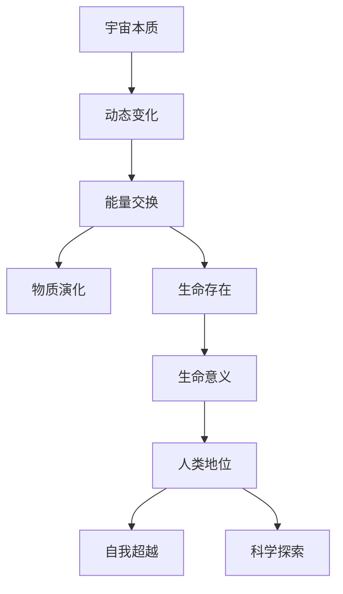

**图1：宇宙能量场的哲学意义流程图**

##### 4.2 能量场与宗教信仰

宇宙能量场在不同宗教信仰中有着丰富的象征和解释。宗教体系通过不同的哲学和宇宙观，对宇宙能量场进行理解和描述。

**印度教**：印度教认为宇宙是由梵（Brahman）创造的，梵是宇宙的本源和终极实在。宇宙能量场在印度教中表现为宇宙的意识（Chit）和力量（Ananda）。印度教中的瑜伽和冥想强调通过冥想和内观，个体可以与梵连接，达到精神上的觉醒和解脱。瑜伽实践被视为一种能量转化和平衡的过程，旨在提升个体的灵性和精神健康。

**佛教**：佛教将宇宙视为一个因果循环的过程，称为轮回（Samsara）。宇宙能量场在佛教中表现为业力（Karma），即个人的行为和思想决定了其未来的命运。佛教教义强调通过修行和悟道，个体可以超越轮回，达到涅槃的境界。在佛教中，能量场被视为一种因果力量，连接个体的行为和未来的命运。

**道教**：道教认为宇宙是一个自然的过程，遵循道（Dao）的原则。宇宙能量场在道教中表现为气（Qi），即宇宙中的能量流。道教强调通过修炼内功，个体可以掌握气，实现身体和精神上的健康。道教教义认为，通过调整和平衡体内的能量流，个体可以实现身心健康和长寿。

**能量场与宗教信仰的关系 Mermaid 流程图**

以下是一个简化的Mermaid流程图，展示了能量场与宗教信仰之间的关系：

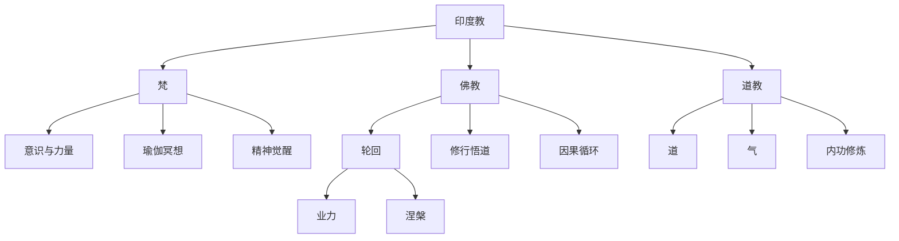

**图2：能量场与宗教信仰的关系流程图**

##### 4.3 能量场与生命意义

宇宙能量场对生命的存在和发展具有深远影响。能量在宇宙中的传递和转化过程，使得复杂的生命形式得以出现。从哲学角度思考，能量场与生命意义密切相关。

**能量转换**：生命过程中，物质和能量不断进行转换。植物通过光合作用将太阳能转化为化学能，动物通过食物链获取能量。能量场在这个过程中发挥着关键作用。生命的存在依赖于能量的转化和利用，能量场的存在和变化决定了生命的存在和发展。

**能量传递**：能量场确保了能量在生物体内外进行传递。例如，神经系统中通过电信号传递信息，细胞中通过代谢过程传递能量。能量场中的电磁场和生物场对生命过程有重要影响。能量场的传递和调控机制使得生命能够适应环境变化，实现自我维持和进化。

**能量与意识**：许多研究表明，意识与大脑中的能量流密切相关。能量场中的电磁场和生物场可能影响意识的形成和功能。从这个角度看，能量场不仅决定生命的物质层面，还影响生命的意识层面。能量的流动和变化可能影响个体的感知、思维和情感，从而影响生命的意义和体验。

**能量场与生命意义的 Mermaid 流程图**

以下是一个简化的Mermaid流程图，展示了能量场与生命意义之间的关系：


**图3：能量场与生命意义的关系流程图**

##### 4.4 能量场与人类认知

宇宙能量场对人类认知产生深远影响。通过研究能量场，人类对宇宙、生命和自身有了更深刻的理解。

**宇宙视角**：能量场的研究使人类从宏观和微观层面理解宇宙。从星系的演化到原子的结构，能量场揭示了宇宙的奥秘。这种宇宙视角改变了人类对自身和宇宙的认知，使得人类能够以更广阔的视角看待世界。

**科学研究**：能量场的研究推动了科学的发展。量子力学、相对论等理论都是能量场研究的成果。这些理论不仅丰富了人类的科学知识，还为新技术的发展提供了基础。能量场的研究使得人类能够更深入地理解自然界的规律，开发新的技术和方法。

**哲学思考**：能量场的研究引发了哲学思考，对宇宙、生命和人类认知的本质进行了探讨。这种哲学思考不仅丰富了人类的知识体系，也提升了人类对自身和宇宙的理解。通过哲学思考，人类能够更好地理解自己在宇宙中的地位和意义。

**能量场与人类认知的 Mermaid 流程图**

以下是一个简化的Mermaid流程图，展示了能量场与人类认知之间的关系：


**图4：能量场与人类认知的关系流程图**

通过以上讨论，我们可以看到宇宙能量场在哲学思考中的重要性。能量场不仅是宇宙演化的重要组成部分，也影响了人类的认知方式。通过进一步探索能量场的本质和特性，我们有望在哲学和科学领域取得重大突破。

---

### 附录

#### 附录 A：宇宙能量场相关术语解释

**宇宙背景辐射**：宇宙早期遗留下来的热辐射，均匀地充满整个宇宙。它是大爆炸理论的强有力证据。

**引力场**：由质量产生的场，是物质间引力的表现。它是宇宙中最强大的能量场之一。

**电磁场**：由电场和磁场组成，是电荷和电流的相互作用场。它包括光、无线电波等电磁辐射。

**暗物质**：一种不发光、不与电磁波相互作用但具有引力的物质，占据了宇宙中大部分的质量。

**暗能量**：一种导致宇宙加速膨胀的神秘力量，目前尚未找到确切的物理本质。

**量子场论**：量子力学和狭义相对论的结合，用于描述基本粒子的行为和相互作用。

#### 附录 B：宇宙能量场研究参考文献

1.  cosmic microwave background radiation（宇宙背景辐射） - https://en.wikipedia.org/wiki/Cosmic_microwave_background_radiation
2.  general relativity（广义相对论）- https://en.wikipedia.org/wiki/General_relativity
3.  quantum field theory（量子场论）- https://en.wikipedia.org/wiki/Quantum_field_theory
4.  dark matter（暗物质）- https://en.wikipedia.org/wiki/Dark_matter
5.  dark energy（暗能量）- https://en.wikipedia.org/wiki/Dark_energy
6.  quantum mechanics（量子力学）- https://en.wikipedia.org/wiki/Quantum_mechanics
7.  The Big Bang Theory（大爆炸理论）- https://en.wikipedia.org/wiki/Big_Bang

通过这些术语和参考文献，读者可以更深入地了解宇宙能量场的相关概念和研究成果。希望这个附录能为读者提供进一步的学习和探索方向。

