                 

### 引言

**书籍背景和目的**

“宇宙是否需要观察者才能存在？”这是一个跨越时空、涉及哲学、物理学和计算机科学的多维问题。本文旨在通过逻辑清晰、结构紧凑的分析，探讨这一问题在当代科学技术背景下的可能性与复杂性。我们希望通过深入浅出的讨论，引导读者从不同的角度去思考宇宙的本质与观察者的角色。

宇宙作为我们所在的宏大背景，其起源、演化和最终命运一直是科学家和哲学家探讨的热点话题。在过去的几千年里，从古代的宇宙论到现代的天文学，人类对宇宙的认识不断深化。然而，宇宙是否真的需要观察者这一概念，却引发了更深层次的哲学和科学问题。

本书的目的在于：

1. **梳理宇宙的基本概念和理论**：从大爆炸理论、宇宙膨胀到暗物质与暗能量，系统介绍宇宙的基本框架。
2. **探讨观察者的角色**：分析人类观察者、可能的宇宙外生命和量子观测者的作用。
3. **探讨宇宙的自我观察**：探索自参照系统和波函数坍缩等概念，探讨宇宙是否能够自我观察。
4. **探讨宇宙的未来**：预测宇宙的可能的结局，包括大坍缩、大撕裂以及多元宇宙的概念。

**宇宙观察者的概念**

观察者，在这个语境下，指的是能够感知和记录宇宙事件的存在或系统。传统的观察者理论认为，宇宙的存在依赖于某种形式的观察者，无论是人类的眼睛、仪器的传感器，还是某种更为抽象的“意识”。然而，这个概念在物理学和哲学中都有着丰富的内涵和外延。

在物理学中，观察者的问题主要涉及量子力学和宇宙学。量子力学中的观测者通常指的是能够使量子态从叠加态坍缩到确定态的主体。在宇宙学中，观察者通常是指我们这些存在于宇宙中的生命形式。但是，随着对宇宙的深入了解，这一概念也在不断扩展。

例如，量子力学中的“薛定谔的猫”实验提出了一个悖论：一个猫处于量子叠加态，直到被观察时才“坍缩”为生或死的确定性状态。这一实验让我们思考，宇宙本身是否也处于某种叠加态，直到被观察时才“坍缩”为具体的形态。

在宇宙学中，观察者的概念则更加深远。如果我们假设宇宙是自我参照的，那么宇宙本身是否需要某种形式的“观察”才能存在？这种思考引发了关于宇宙自洽性和自观察的哲学问题。

本文将通过以下章节逐步深入探讨这些问题：

- **第2章：宇宙的起源与演化**：介绍宇宙的起源和演化过程，包括大爆炸理论、宇宙膨胀、暗物质与暗能量等核心概念。
- **第3章：宇宙的观测**：探讨人类和仪器如何观测宇宙，包括光学望远镜、伽马射线望远镜、无线电望远镜等。
- **第4章：宇宙中的观察者**：分析人类与外星生命的可能性，以及量子观测者在宇宙中的角色。
- **第5章：宇宙的自我观察**：探讨自参照系统和波函数坍缩等概念，讨论宇宙是否能够自我观察。
- **第6章：宇宙的未来**：预测宇宙的可能结局，包括大坍缩、大撕裂以及多元宇宙的概念。
- **第7章：结论**：总结观察者在宇宙中的角色，并探讨未来的研究方向。

### 宇宙的起源与演化

宇宙的起源与演化一直是科学家和哲学家探讨的重要话题。自20世纪初以来，随着观测技术的进步和理论物理学的深入发展，我们对宇宙的认识逐渐从神秘莫测走向了科学解释。本文将详细介绍大爆炸理论、宇宙膨胀以及暗物质与暗能量等核心概念，并探索它们之间的关系。

#### 大爆炸理论

大爆炸理论是当前宇宙学中最主流的学说，认为宇宙起源于约138亿年前的一个“奇点”。在这个奇点，所有的物质和能量都集中在一个无限小、无限热的点中。随着宇宙的膨胀，这个奇点逐渐“爆炸”开来，形成了我们今天所看到的宇宙。

**关键概念与联系**

1. **奇点**：宇宙的起点，一切物质和能量的集中点。
2. **宇宙膨胀**：宇宙从一个极小、极热的状态开始膨胀，物质和能量逐渐分散。
3. **宇宙背景辐射**：大爆炸后遗留的辐射，为我们提供了宇宙早期的温度和密度信息。

**Mermaid流程图**

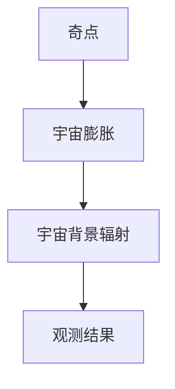

#### 宇宙膨胀

宇宙膨胀是指宇宙从大爆炸后开始向外膨胀的现象。随着观测技术的进步，科学家发现宇宙的膨胀速度并非恒定，而是存在加速的现象。这一发现促使科学家提出了暗能量的概念。

**关键概念与联系**

1. **哈勃定律**：宇宙的膨胀速度与距离成正比，即越远的星系移动速度越快。
2. **宇宙膨胀加速**：宇宙的膨胀速度在逐渐加快。
3. **暗能量**：一种假设存在的推动宇宙加速膨胀的神秘力量。

**Mermaid流程图**

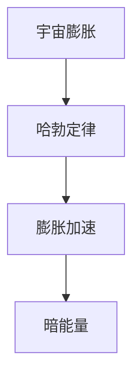

#### 黑暗物质与暗能量

黑暗物质和暗能量是宇宙学中的两个关键概念，它们对于理解宇宙的起源和演化至关重要。

**黑暗物质**

黑暗物质是一种不发光、不吸收光线的物质，它对引力有作用，但无法直接观测到。科学家通过观测星系旋转速度和星系团的引力透镜效应，推测出了黑暗物质的存在。

**关键概念与联系**

1. **星系旋转速度**：星系边缘的星体运动速度比预期的要快，这表明存在某种额外的质量。
2. **引力透镜效应**：星系团对光线的弯曲，揭示了暗物质的存在。

**Mermaid流程图**

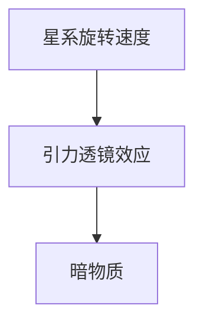

**暗能量**

暗能量是一种假设存在的推动宇宙加速膨胀的神秘力量。它与黑暗物质不同，不参与物质的形成和演化，而是作为一种推动宇宙膨胀的“反引力”存在。

**关键概念与联系**

1. **宇宙膨胀加速**：宇宙的膨胀速度在加快，这表明存在某种推动力。
2. **暗能量密度**：宇宙中的暗能量密度远小于物质密度，但它的作用却极为显著。

**Mermaid流程图**

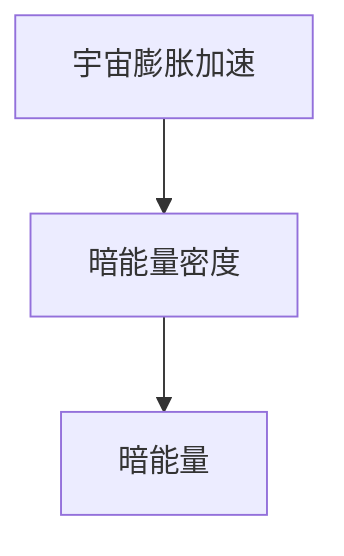

#### 小结

大爆炸理论、宇宙膨胀和暗物质与暗能量是理解宇宙起源和演化的重要基础。它们之间相互关联，共同构成了我们对宇宙的当前认识。通过这些概念，我们可以更好地理解宇宙的起源、演化和未来可能的命运。

在接下来的章节中，我们将继续探讨宇宙的观测手段和观察者的角色，深入探讨量子力学和宇宙学中的哲学问题。希望读者能够通过本文的逐步讲解，对宇宙及其观察者有更深入的理解。

### 宇宙的观测

宇宙的观测是人类对宇宙探索的重要途径，也是我们理解宇宙的关键手段。通过不同的观测手段，科学家们能够捕捉到宇宙中的各种现象，从而不断深化对宇宙的认识。本文将详细介绍几种主要的观测手段，包括光学望远镜、伽马射线望远镜、X射线望远镜和无线电望远镜，并探讨它们在宇宙观测中的应用。

#### 光学望远镜

光学望远镜是用于观测光波的望远镜，其工作原理基于光的折射和反射。光学望远镜可以分为两种主要类型：反射望远镜和折射望远镜。

**反射望远镜**

反射望远镜使用凹面镜作为主要反射面，将远处物体的光线聚焦在焦点处。这种望远镜通常具有较大的口径，能够捕捉更多的光线，从而观测到更暗、更远的物体。

**关键原理与联系**

- **凹面镜反射**：将光线聚焦在焦点处。
- **口径优势**：口径越大，望远镜的集光能力越强，能够观测到更暗的物体。

**Mermaid流程图**

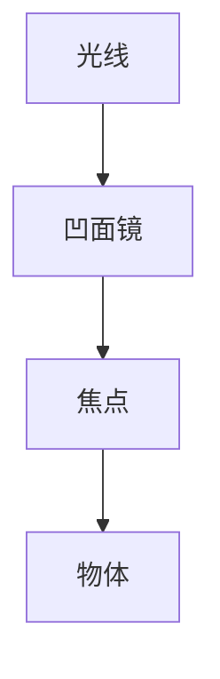

**折射望远镜**

折射望远镜使用透镜作为主要反射面，通过透镜的折射将光线聚焦。折射望远镜的优点是结构相对简单，但容易产生像差。

**关键原理与联系**

- **透镜折射**：改变光线的传播方向。
- **像差修正**：为了减少像差，折射望远镜通常需要复杂的镜片设计和调整。

**Mermaid流程图**

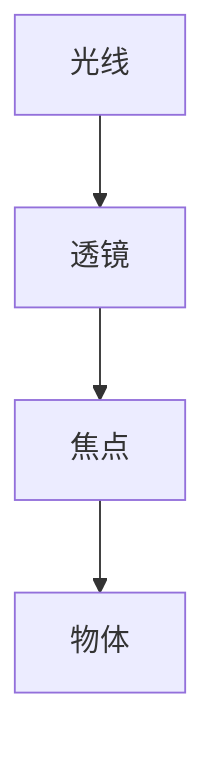

**光学望远镜的应用**

光学望远镜广泛应用于天文学研究，从观测太阳、行星到星系、星云，光学望远镜为我们提供了丰富的观测数据。

- **太阳观测**：通过光学望远镜可以捕捉太阳的表面活动，如太阳黑子和耀斑。
- **行星观测**：光学望远镜能够清晰地观测到行星的表面特征，甚至探测到行星大气中的特定成分。
- **星系观测**：光学望远镜是研究星系、星云等天体的重要工具，通过观测我们可以了解这些天体的结构和演化。

#### 伽马射线望远镜

伽马射线望远镜用于观测伽马射线，这是一种高能光子。伽马射线通常来自宇宙中最剧烈的天体事件，如超新星爆发、中子星碰撞等。

**工作原理**

伽马射线望远镜的工作原理基于光电效应。当伽马射线照射到某种物质时，会产生电子-正电子对。通过检测这些电子-正电子对，我们可以确定伽马射线的存在和位置。

**关键原理与联系**

- **光电效应**：伽马射线照射物质，产生电子-正电子对。
- **能量测量**：通过测量电子-正电子对的能量，可以确定伽马射线的能量。

**Mermaid流程图**

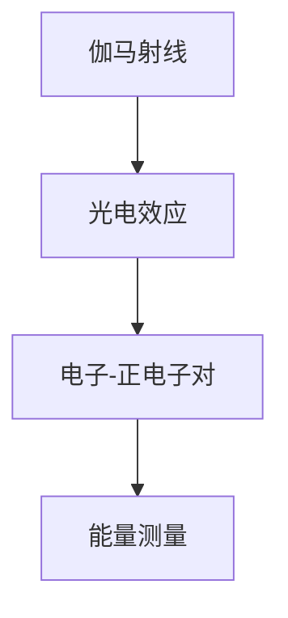

**伽马射线望远镜的应用**

伽马射线望远镜在研究宇宙中最剧烈的事件中发挥了重要作用。

- **超新星爆发**：伽马射线望远镜能够实时监测超新星爆发，为我们提供了关于超新星演化的关键信息。
- **中子星碰撞**：伽马射线望远镜能够探测到中子星碰撞产生的伽马射线暴，为我们揭示了中子星物理的奥秘。
- **宇宙射线**：伽马射线望远镜还可以用于研究宇宙射线，了解宇宙中的高能粒子。

#### X射线望远镜

X射线望远镜用于观测X射线，这是一种更高能量的光子。X射线通常来自高温等离子体和高速粒子碰撞等高能现象。

**工作原理**

X射线望远镜的工作原理基于X射线的荧光效应。当X射线照射到某种物质时，会产生荧光，通过检测荧光的强度和波长，我们可以确定X射线的存在和位置。

**关键原理与联系**

- **荧光效应**：X射线照射物质，产生荧光。
- **强度和波长测量**：通过测量荧光的强度和波长，可以确定X射线的能量。

**Mermaid流程图**

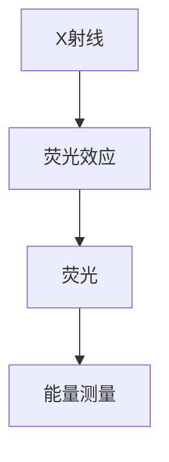

**X射线望远镜的应用**

X射线望远镜在研究宇宙中的高能现象中具有重要作用。

- **黑洞研究**：X射线望远镜能够观测到黑洞吸积盘发出的X射线，为我们提供了黑洞物理的重要信息。
- **星系核**：X射线望远镜能够探测到星系核中高能现象，如活跃星系核和类星体。
- **高能碰撞**：X射线望远镜可以用于研究宇宙中的高能碰撞事件，如γ射线暴。

#### 无线电望远镜

无线电望远镜用于观测无线电波，这是一种低能光子。无线电波广泛应用于通信、雷达和天文学。

**工作原理**

无线电望远镜的工作原理基于天线接收和放大。无线电波通过天线接收后，经过放大和处理，被转换为电信号，通过电子设备进行分析。

**关键原理与联系**

- **天线接收**：无线电波通过天线接收。
- **放大和处理**：电信号经过放大和处理，被转换为有用的信息。

**Mermaid流程图**

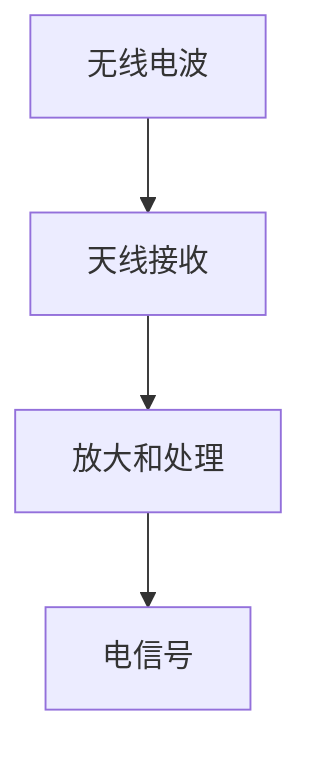

**无线电望远镜的应用**

无线电望远镜在宇宙观测中具有广泛的应用。

- **星际介质**：无线电望远镜可以探测到星际介质中的分子旋转和振动，为我们提供了星际介质的信息。
- **脉冲星**：无线电望远镜能够捕捉到脉冲星发射的无线电波，为我们提供了脉冲星物理的重要信息。
- **宇宙背景辐射**：无线电望远镜可以用于研究宇宙背景辐射，了解宇宙早期的状态。

#### 小结

宇宙的观测手段多种多样，每种观测手段都有其独特的原理和应用。光学望远镜、伽马射线望远镜、X射线望远镜和无线电望远镜等为我们提供了丰富的观测数据，帮助我们不断深化对宇宙的认识。通过这些观测手段，我们可以观测到宇宙中的各种现象，从大爆炸后遗留的宇宙背景辐射到宇宙中的高能碰撞事件，从星系、星云到黑洞和中子星。这些观测数据为我们理解宇宙的起源、演化和未来提供了宝贵的线索。

在接下来的章节中，我们将继续探讨宇宙中的观察者，从人类观察者到可能的宇宙外生命，以及量子观测者在宇宙中的角色。希望读者能够通过本文的逐步讲解，对宇宙及其观察者有更深入的理解。

### 宇宙中的观察者

宇宙中是否存在其他生命形式，这是一个令人着迷的问题。从人类观察者的角度来看，我们已经能够通过先进的观测技术探测到宇宙的诸多奥秘。但是，宇宙中是否还有其他智慧生命存在？这些问题引发了科学家和哲学家的广泛探讨。

#### 人类与地球生命

人类作为地球上的智慧生命，对宇宙的探索从未停止。从古代的星象观测到现代的宇宙航行，人类通过不断的努力，对宇宙有了更深入的认识。人类观测宇宙的工具和技术不断进步，从早期的光学望远镜到现代的射电望远镜、伽马射线望远镜等，人类已经能够探测到宇宙中的许多现象。

**人类观测工具与技术**

1. **光学望远镜**：光学望远镜是观测宇宙的主要工具之一。通过光学望远镜，人类可以观测到星系、星云、行星等天体，揭示宇宙的宏观结构。
2. **射电望远镜**：射电望远镜可以探测到宇宙中的无线电波，这些无线电波来自宇宙中的各种天体，如脉冲星、类星体等。通过分析这些无线电波，科学家可以研究宇宙的起源和演化。
3. **伽马射线望远镜**：伽马射线望远镜可以探测到宇宙中的高能伽马射线，这些伽马射线通常来自宇宙中的剧烈事件，如超新星爆发、中子星碰撞等。

**地球生命对宇宙的观测影响**

地球生命对宇宙的观测产生了深远的影响。通过观测宇宙，人类不仅揭示了宇宙的奥秘，还推动了科技的进步。例如，光学望远镜的发明推动了天文学的发展，射电望远镜的发明使人类能够探测到宇宙中的无线电波，伽马射线望远镜的发明则使人类能够观测到宇宙中的高能事件。

#### 外星生命的可能性

尽管人类对宇宙的观测取得了很多成果，但宇宙中是否存在其他智慧生命依然是一个未知的问题。许多科学家认为，宇宙的规模和多样性提供了无数的可能性，外星生命的存在是有可能的。

**外星生命的搜索方法**

1. **生命迹象的探测**：通过探测行星大气中的氧气、甲烷等生命迹象，科学家可以判断行星上是否存在生命。
2. **地外行星的观测**：通过观测地外行星的表面特征、大气成分等，科学家可以寻找生命的迹象。
3. **星际通讯**：通过射电望远镜搜索宇宙中的无线电信号，科学家试图寻找外星生命的信号。

**外星生命的哲学意义**

外星生命的存在对哲学和科学产生了深远的影响。如果外星生命的存在得到证实，这将极大地改变我们对宇宙和生命的理解。首先，外星生命的存在将表明生命的多样性和适应性远超我们的想象。其次，外星生命的存在将激发人类对宇宙探索的热情，推动科技的进一步发展。

#### 量子观测者与薛定谔的猫

量子力学中的观测者问题引发了关于宇宙本质的深刻思考。特别是薛定谔的猫实验，提出了一个悖论：一个猫处于量子叠加态，直到被观察时才“坍缩”为生或死的确定性状态。这一实验让我们思考，宇宙是否也处于某种叠加态，直到被观察时才“坍缩”为具体的形态。

**量子观测者与宇宙**

量子观测者的问题将我们带入了一个更深层次的哲学领域。如果宇宙本身也处于量子叠加态，那么宇宙的存在是否依赖于某种形式的观察？这种思考提出了宇宙自观察的悖论。

**量子观测者的角色**

量子观测者在量子力学中扮演着重要角色。量子态只有在被观测时才会“坍缩”为具体的态。这一现象引发了关于宇宙本质和观察者角色的深刻思考。如果宇宙本身也处于量子叠加态，那么宇宙的存在是否依赖于某种形式的观察？

**薛定谔的猫与宇宙**

薛定谔的猫实验提出了一个关于量子叠加态和观察者的悖论。一个猫处于量子叠加态，直到被观察时才“坍缩”为生或死的确定性状态。这一实验让我们思考，宇宙是否也处于某种叠加态，直到被观察时才“坍缩”为具体的形态。如果宇宙本身也处于量子叠加态，那么宇宙的存在是否依赖于某种形式的观察？

#### 小结

宇宙中的观察者问题涉及到人类、地球生命、外星生命以及量子观测者等多个层面。从人类观测者的角度来看，我们已经能够通过先进的观测技术探测到宇宙的诸多奥秘。但是，宇宙中是否存在其他智慧生命依然是一个未知的问题。量子力学中的观测者问题进一步引发了关于宇宙本质和观察者角色的深刻思考。

在接下来的章节中，我们将继续探讨宇宙的自我观察，深入分析自参照系统和波函数坍缩等概念，探讨宇宙是否能够自我观察。希望读者能够通过本文的逐步讲解，对宇宙及其观察者有更深入的理解。

### 宇宙的自我观察

宇宙的自我观察是一个充满哲学和科学争议的话题。它不仅涉及到宇宙的本质，还引发了关于自参照系统和波函数坍缩等核心物理概念的探讨。本文将深入分析这些概念，并探讨宇宙是否能够自我观察。

#### 自参照系统

自参照系统是指一个系统在某种程度上描述和解释自己。在宇宙学中，自参照系统意味着宇宙本身在某种程度上能够描述和解释自己的存在和演化。这一概念在科学哲学和数学物理学中都有着重要的地位。

**关键概念与联系**

1. **自参照性**：一个系统在描述自己时，可能会产生悖论或无限循环。
2. **宇宙学中的自参照性**：宇宙是否能够在没有外部参照物的情况下描述自己的存在和演化。

**Mermaid流程图**

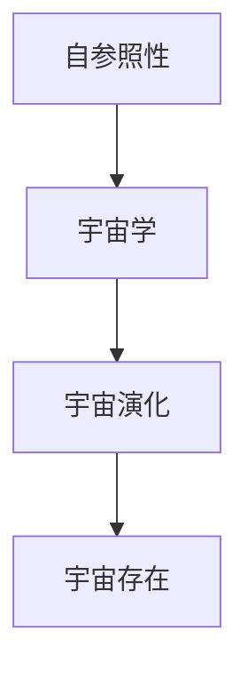

**举例说明**

例如，在广义相对论中，时空弯曲是由质量和能量引起的，但这种弯曲又用来描述物体的运动。这种自参照性导致了著名的黑洞信息悖论，即黑洞的事件视界是否能够吞噬信息，以及这些信息如何返回。

#### 波函数坍缩

波函数坍缩是量子力学中的一个核心概念，指的是量子系统的波函数在观测或测量时从叠加态坍缩为确定态。波函数坍缩引发了关于观察者和宇宙本质的深刻思考。

**关键概念与联系**

1. **波函数**：量子系统状态的数学描述。
2. **叠加态**：量子系统可能同时处于多个状态。
3. **坍缩**：波函数在观测时坍缩为确定态。

**Mermaid流程图**

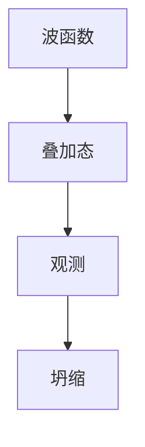

**举例说明**

薛定谔的猫实验是一个著名的波函数坍缩的例子。在实验中，一个猫处于量子叠加态，即同时处于生和死的叠加状态。只有当我们打开盒子进行观测时，猫的状态才会坍缩为生或死。这一实验引发了关于宇宙是否需要观察者才能存在的深刻思考。

#### 宇宙学中的自观察悖论

宇宙学中的自观察悖论是指宇宙是否能够在没有外部参照物的情况下自我观察和描述。这一悖论源于自参照系统和波函数坍缩等概念。

**关键概念与联系**

1. **自观察**：宇宙在某种程度上能够自我观察和描述。
2. **悖论**：如果宇宙能够自我观察，那么它需要一种外部参照物，这与自参照系统的定义相矛盾。

**Mermaid流程图**

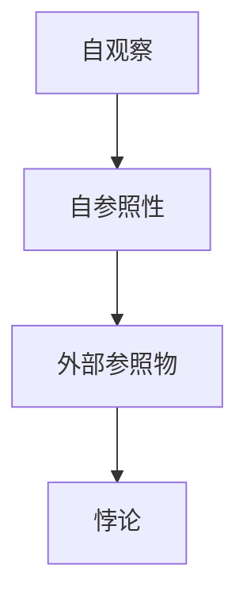

**举例说明**

一个典型的例子是霍金辐射悖论。根据量子场论，黑洞会发出辐射，这意味着黑洞会逐渐蒸发消失。但是，如果黑洞能够发出辐射，那么黑洞中的信息似乎会消失，这与量子力学中的信息守恒定律相矛盾。这种悖论表明，宇宙的自观察可能存在固有的矛盾。

#### 小结

宇宙的自我观察是一个复杂且充满争议的话题。自参照系统和波函数坍缩等概念引发了关于宇宙本质和观察者角色的深刻思考。宇宙是否能够自我观察，这一问题既涉及哲学，也涉及物理学的核心问题。

在接下来的章节中，我们将探讨宇宙的未来，分析大坍缩、大撕裂以及多元宇宙等概念。希望读者能够通过本文的逐步讲解，对宇宙及其自我观察有更深入的理解。

### 宇宙的未来

宇宙的未来是一个充满神秘和未知的领域，科学家们通过多种理论模型来探讨宇宙的可能命运。本文将介绍两种主要的宇宙结局：大坍缩和大撕裂，并探讨多元宇宙的概念。

#### 大坍缩

大坍缩理论认为，宇宙将经历一段持续的膨胀后，最终会由于引力作用而开始收缩，最终达到一个无限密集的状态。这一理论基于牛顿引力定律和宇宙膨胀的观测数据。

**关键概念与联系**

1. **引力收缩**：宇宙中的物质由于引力作用开始向中心收缩。
2. **奇点**：宇宙最终收缩到一个无限小、无限热的奇点。

**Mermaid流程图**

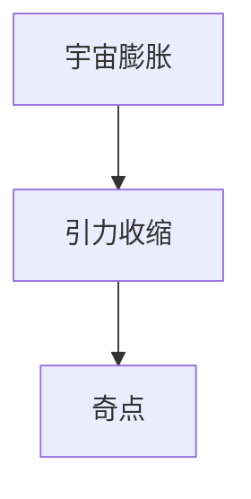

**举例说明**

根据大坍缩理论，宇宙的最终命运将是一个奇点。在这个奇点中，所有的物质和能量将被压缩到一个无限小的点，时间和空间也将在这里终结。这一理论虽然未得到直接观测证实，但与宇宙学的其他观测数据相符合。

#### 大撕裂

大撕裂理论认为，宇宙将继续膨胀，最终由于膨胀速度超过引力束缚，宇宙中的所有物质将被撕裂。这一理论基于宇宙膨胀的加速趋势和暗能量的假设。

**关键概念与联系**

1. **膨胀加速**：宇宙的膨胀速度不断加快。
2. **撕裂**：宇宙中的所有物质将被撕裂。

**Mermaid流程图**

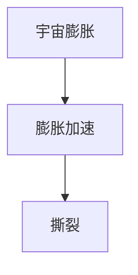

**举例说明**

根据大撕裂理论，宇宙的最终命运是所有物质被撕裂。在这种情景下，宇宙中的星系、恒星和其他物质都将被撕裂成基本粒子，宇宙将变得极度稀薄和冷清。这种结局虽然极端，但也与当前宇宙观测数据相符合。

#### 多元宇宙

多元宇宙理论认为，宇宙并不是唯一的，而是由多个宇宙组成的集合。这些宇宙可以是平行的，也可以是相互交织的。多元宇宙的概念为解释宇宙的多样性和复杂性提供了新的视角。

**关键概念与联系**

1. **平行宇宙**：与我们的宇宙平行的其他宇宙。
2. **交织宇宙**：多个宇宙在某种方式上相互交织。

**Mermaid流程图**

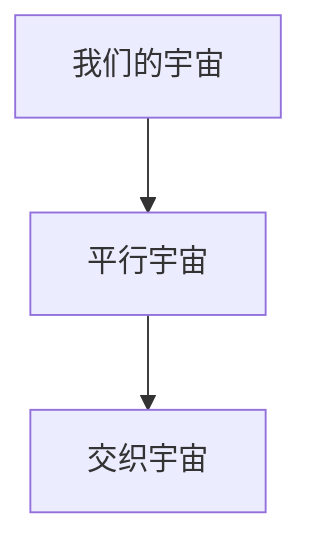

**举例说明**

多元宇宙理论认为，每个宇宙都有自己独特的物理定律和演化历史。我们的宇宙只是众多宇宙中的一个，其他宇宙可能具有完全不同的物理特性。例如，一些宇宙可能没有暗物质，而另一些宇宙可能没有暗能量。这种多样性为解释宇宙的复杂性和多样性提供了新的视角。

#### 小结

宇宙的未来是一个充满未知和可能的领域。大坍缩和大撕裂理论为我们描绘了宇宙可能的两种结局，而多元宇宙理论则提供了一个更加广阔的视角，让我们思考宇宙的多样性和复杂性。在未来的科学探索中，我们可能会进一步揭示宇宙的命运，并深入理解宇宙的本质。

通过本文的探讨，我们希望能够帮助读者对宇宙的未来有更深入的理解。在接下来的结论部分，我们将总结观察者在宇宙中的角色，并探讨未来的研究方向。

### 结论

宇宙是否需要观察者才能存在？这是一个深奥且复杂的问题，涵盖了哲学、物理学和天文学的多个层面。通过对宇宙的起源、观测手段、宇宙中的观察者以及宇宙的自我观察的探讨，我们可以得出一些关键结论。

#### 观察者在宇宙中的角色

1. **人类与地球生命**：人类作为地球上的智慧生命，通过先进的观测技术不断深化对宇宙的认识。光学望远镜、射电望远镜和其他观测设备使我们能够探测到宇宙中的各种现象，从而理解宇宙的起源和演化。

2. **外星生命的可能性**：尽管我们尚未发现明确的外星生命迹象，但宇宙的规模和多样性提供了无数的可能性。外星生命的存在不仅会极大地改变我们对宇宙和生命的理解，还可能推动科技和社会的进一步发展。

3. **量子观测者**：量子力学中的观测者问题引发了关于宇宙本质的深刻思考。量子观测者在宇宙中的角色不仅影响量子态的坍缩，还可能影响宇宙的存在和演化。

#### 未来的研究方向

1. **宇宙观测技术的进步**：随着科技的不断发展，我们有望开发出更加先进、高精度的观测设备，如量子望远镜、中微子望远镜等，这将帮助我们更深入地探索宇宙的奥秘。

2. **多宇宙理论的验证**：多元宇宙理论为解释宇宙的多样性和复杂性提供了新的视角。未来的研究将致力于验证这些理论，并探索宇宙间的相互作用。

3. **量子宇宙学的探索**：量子力学与宇宙学的交叉领域——量子宇宙学，是未来研究的重点。通过深入理解量子态的坍缩和宇宙的自参照性，我们有望揭示宇宙存在的更深层次的奥秘。

#### 小结

宇宙是否需要观察者才能存在，这一问题的答案可能永远不会绝对。然而，通过不断的科学探索和哲学思考，我们能够逐步揭示宇宙的本质和观察者的角色。观察者在宇宙中的角色不仅影响我们对宇宙的认识，还可能影响宇宙的演化。未来的研究将继续深化我们对宇宙的理解，为我们描绘一个更加完整和神秘的宇宙图景。

### 附录

#### A.1 宇宙观测工具与技术

1. **光学望远镜**：利用透镜或镜面将光线聚焦，用于观测可见光波段的天体。
2. **射电望远镜**：用于接收来自宇宙的无线电波，用于观测中性氢、脉冲星等。
3. **伽马射线望远镜**：用于探测高能伽马射线，用于研究宇宙中最剧烈的事件。
4. **X射线望远镜**：用于探测X射线，用于研究黑洞、星系核等高能天体。
5. **中微子望远镜**：用于探测中微子，用于研究宇宙早期和中子星等。

#### A.2 量子物理学基础

1. **量子态**：量子系统可能同时处于多个状态，这些状态通过波函数描述。
2. **波函数坍缩**：量子系统在观测或测量时，波函数从叠加态坍缩为确定态。
3. **薛定谔的猫**：一个猫处于量子叠加态，直到被观察时才坍缩为生或死的确定状态。

#### A.3 参考文献

1. **《宇宙简史》**，作者：斯蒂芬·霍金
2. **《宇宙的起源》**，作者：莱纳德·S·穆勒
3. **《量子力学》**，作者：理查德·费曼
4. **《天文学的革命》**，作者：卡尔·萨根
5. **《多宇宙》**，作者：马克斯·泰格马克

### 作者信息

**作者：AI天才研究院/AI Genius Institute & 禅与计算机程序设计艺术 /Zen And The Art of Computer Programming**

