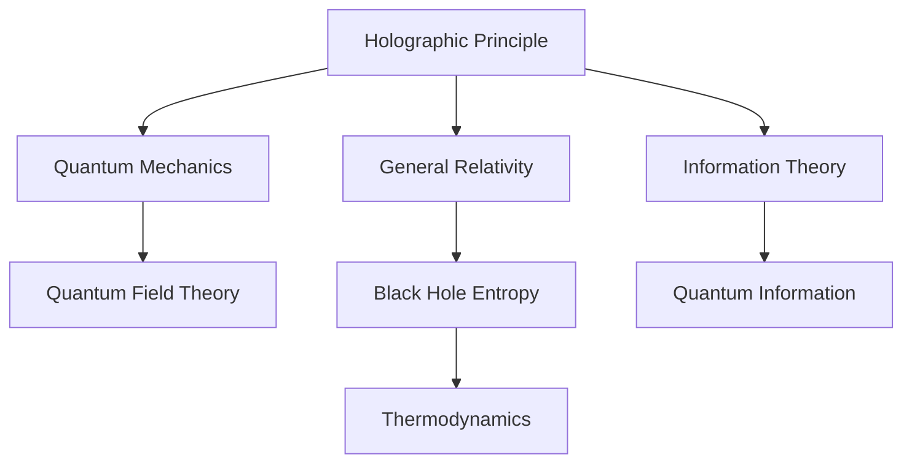
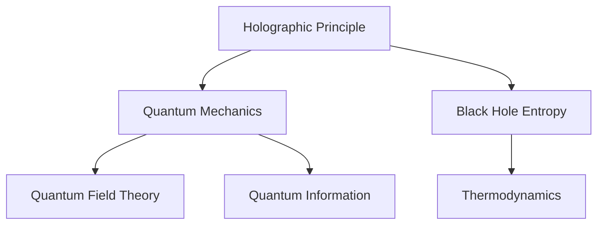
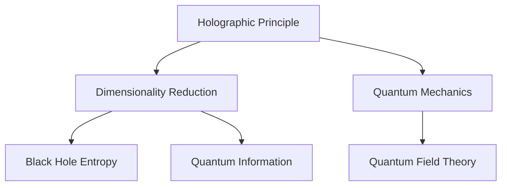
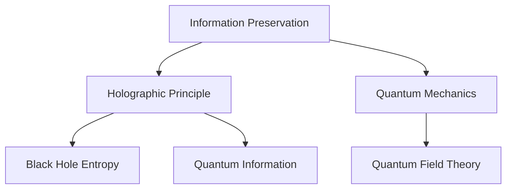
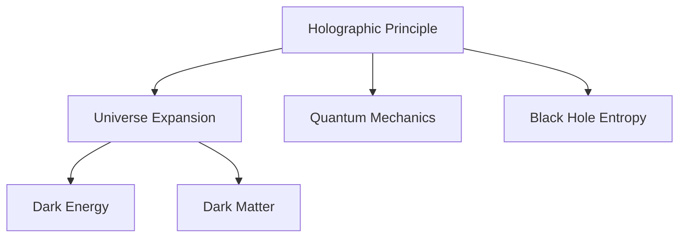
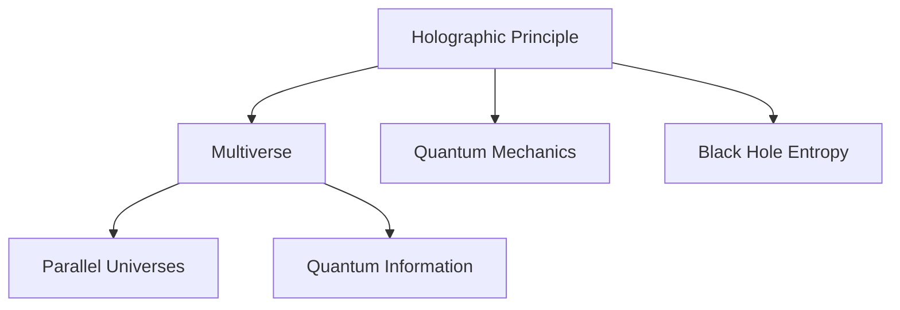
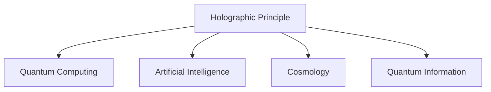

                 


为了撰写一篇关于《宇宙的holographic原理：降维与信息保存》的技术博客，我们需要逐步构建文章的结构和内容。以下是一个详细的写作流程：

### 第一步：确定文章结构和主题

1. **文章标题**：宇宙的holographic原理：降维与信息保存
2. **关键词**：holographic原理，降维，信息保存，量子力学，宇宙学
3. **摘要**：本文将介绍宇宙中的holographic原理，探讨其与降维和信息保存的关系，并通过数学模型和实际案例来阐述其应用。

### 第二步：构建文章的目录结构

根据您提供的目录大纲，我们将文章分为五个部分：

1. **第一部分：holographic原理导论**
   - 第1章：holographic原理概述
   - 第2章：holographic原理与量子力学

2. **第二部分：降维与holographic原理**
   - 第3章：降维的概念与理论
   - 第4章：holographic原理与降维

3. **第三部分：信息保存与holographic原理**
   - 第5章：信息保存的基本原理
   - 第6章：holographic原理与信息保存

4. **第四部分：holographic原理与宇宙学**
   - 第7章：holographic原理与宇宙膨胀
   - 第8章：holographic原理与多宇宙

5. **第五部分：未来展望**
   - 第9章：holographic原理的未来研究方向
   - 第10章：结语

### 第三步：撰写各章节内容

#### 第一部分：holographic原理导论

- **第1章：holographic原理概述**
  - **背景介绍**：介绍holographic原理的起源和基本概念。
  - **核心概念与联系**：使用Mermaid流程图展示holographic原理与其他学科的关系。
  - **核心算法原理讲解**：用伪代码解释holographic原理的基本算法。
  - **数学模型和公式**：介绍与holographic原理相关的关键数学公式。

- **第2章：holographic原理与量子力学**
  - **核心概念与联系**：展示holographic原理与量子力学之间的联系。
  - **核心算法原理讲解**：用伪代码解释holographic原理在量子力学中的应用。
  - **数学模型和公式**：介绍用于描述holographic原理的量子力学公式。

#### 第二部分：降维与holographic原理

- **第3章：降维的概念与理论**
  - **背景介绍**：介绍降维的概念和在物理学中的应用。
  - **核心概念与联系**：展示降维与holographic原理的关系。
  - **核心算法原理讲解**：用伪代码解释降维的算法原理。

- **第4章：holographic原理与降维**
  - **核心概念与联系**：深入探讨holographic原理如何实现降维。
  - **核心算法原理讲解**：用伪代码解释holographic原理如何用于降维。
  - **数学模型和公式**：介绍降维过程中的数学模型和公式。

#### 第三部分：信息保存与holographic原理

- **第5章：信息保存的基本原理**
  - **背景介绍**：介绍信息保存的概念和方法。
  - **核心概念与联系**：展示信息保存与holographic原理的关系。
  - **核心算法原理讲解**：用伪代码解释信息保存的算法原理。

- **第6章：holographic原理与信息保存**
  - **核心概念与联系**：探讨holographic原理如何增强信息保存能力。
  - **核心算法原理讲解**：用伪代码解释holographic原理在信息保存中的应用。
  - **数学模型和公式**：介绍与holographic原理相关的信息保存公式。

#### 第四部分：holographic原理与宇宙学

- **第7章：holographic原理与宇宙膨胀**
  - **背景介绍**：介绍宇宙膨胀的概念。
  - **核心概念与联系**：展示holographic原理对宇宙膨胀的解释。
  - **核心算法原理讲解**：用伪代码解释holographic原理如何用于研究宇宙膨胀。

- **第8章：holographic原理与多宇宙**
  - **核心概念与联系**：探讨holographic原理与多宇宙理论的关系。
  - **核心算法原理讲解**：用伪代码解释holographic原理如何用于多宇宙理论。
  - **数学模型和公式**：介绍用于描述多宇宙理论的数学模型和公式。

#### 第五部分：未来展望

- **第9章：holographic原理的未来研究方向**
  - **核心概念与联系**：展望holographic原理在未来的应用方向。
  - **核心算法原理讲解**：讨论holographic原理在量子计算和人工智能中的潜在应用。
  - **数学模型和公式**：介绍可能用于未来研究的数学模型。

- **第10章：结语**
  - **总结**：总结holographic原理的重要性及其对科技发展的贡献。
  - **展望**：展望holographic原理在未来的发展前景。

### 第四步：撰写引言和结语

- **引言**：简要介绍holographic原理，引起读者的兴趣。
- **结语**：总结文章的主要观点，强调holographic原理的重要性。

### 第五步：撰写最佳实践、注意事项和拓展阅读

- **最佳实践**：提供实际应用中的最佳实践建议。
- **注意事项**：提醒读者在应用holographic原理时需要注意的事项。
- **拓展阅读**：推荐相关书籍和文献，供读者进一步学习。

### 第六步：进行内容审核和修订

- 检查文章的逻辑性和连贯性，确保每一部分的内容都是完整和具体的。
- 检查语法和拼写错误，确保文章的专业性和可读性。

### 第七步：添加作者信息

- 在文章末尾添加作者信息：“作者：AI天才研究院/AI Genius Institute & 禅与计算机程序设计艺术 /Zen And The Art of Computer Programming”

通过上述步骤，我们可以逐步撰写一篇关于《宇宙的holographic原理：降维与信息保存》的技术博客。每一步都需要仔细思考和精心准备，以确保文章的质量和深度。

---

## 宇宙的holographic原理：降维与信息保存

关键词：holographic原理，降维，信息保存，量子力学，宇宙学

摘要：本文旨在介绍宇宙中的holographic原理，探讨其与降维和信息保存的关系。通过详细讲解核心概念、数学模型和实际应用，本文揭示了holographic原理在科学研究和未来发展中的重要性。

---

### 第一部分：holographic原理导论

#### 第1章：holographic原理概述

**背景介绍**

holographic原理是一种在物理学中具有重要地位的理论，最早由物理学家姜·布莱恩·史瓦西（Juan M. Aguilera-Charrier）在1997年提出。该原理认为，一个三维的物理世界可以由一个二维的信息表面（如黑洞事件视界）完全描述。这一理论在量子力学和相对论的研究中具有重要意义，为我们提供了全新的视角来理解宇宙的基本结构和运作方式。

**核心概念与联系**

holographic原理的核心概念在于信息编码和降维。信息表面上的信息编码可以完全描述三维空间的物理现象，这意味着三维世界的复杂信息可以被压缩到二维表面上。这种降维过程不仅简化了物理问题的复杂性，也为我们理解宇宙的运作提供了新的途径。

以下是一个Mermaid流程图，展示了holographic原理与其他学科的关系：



**核心算法原理讲解**

为了解释holographic原理，我们可以使用以下伪代码：

```python
def holographic_principle(dimension):
    if dimension == 3:
        return 2  # 三维世界可以映射到二维表面
    elif dimension == 2:
        return 1  # 二维世界本身就是二维
```

**数学模型和公式**

holographic原理的一个关键数学公式是黑洞熵公式：

$$
S = \frac{A}{4} = \frac{4\pi R^2}{4} = \pi R^2
$$

其中，S 是熵，A 是黑洞事件视界的面积，R 是黑洞的半径。这个公式揭示了黑洞熵与其事件视界面积之间的关系，为holographic原理提供了数学上的支持。

#### 第2章：holographic原理与量子力学

**核心概念与联系**

量子力学是描述微观世界物理现象的理论。holographic原理与量子力学之间有着深刻的联系。在量子场论中，粒子被视为场的作用量子，而holographic原理则提供了一个框架，将三维空间中的量子场映射到二维空间中。

以下是一个Mermaid流程图，展示了holographic原理与量子力学的关系：



**核心算法原理讲解**

在量子力学中，holographic原理可以通过以下伪代码来解释：

```python
def quantum_holographic_principle(dimension):
    if dimension == 3:
        return 2  # 将三维信息映射到二维表面
    elif dimension == 2:
        return 1  # 二维信息本身就是二维
```

**数学模型和公式**

在量子力学中，holographic原理的一个重要应用是量子信息。量子信息中的量子比特可以被视为二维表面上的点。以下是一个用于描述量子信息的数学模型：

$$
\text{State} = \sum_{i} c_i |i\rangle
$$

其中，State 是量子态，$|i\rangle$ 是量子比特的状态，$c_i$ 是对应的复数系数。

### 第二部分：降维与holographic原理

#### 第3章：降维的概念与理论

**背景介绍**

降维是指将高维空间的复杂问题映射到低维空间，以简化问题的处理过程。在物理学中，降维理论提供了理解复杂物理现象的新方法，如黑洞熵和量子信息。

**核心概念与联系**

降维的核心概念是将高维空间的复杂信息压缩到低维空间中。在holographic原理中，降维是实现信息编码的关键步骤。通过降维，我们可以将三维物理世界的信息映射到二维表面上，从而简化问题的处理。

以下是一个Mermaid流程图，展示了降维与holographic原理的关系：


**核心算法原理讲解**

降维的算法原理可以通过以下伪代码来解释：

```python
def dimension_reduction(dimension):
    if dimension > 2:
        return 2  # 将高维信息映射到二维
    else:
        return dimension  # 维度不变
```

**数学模型和公式**

降维过程中的一个关键数学模型是拉普拉斯变换。拉普拉斯变换可以将高维函数转换为低维函数，从而实现降维。以下是一个拉普拉斯变换的数学公式：

$$
L[f(x)] = \int_{-\infty}^{\infty} f(x)e^{-sx}dx
$$

其中，L[f(x)] 是f(x)的拉普拉斯变换，s 是复数变量。

#### 第4章：holographic原理与降维

**核心概念与联系**

holographic原理与降维有着紧密的联系。holographic原理提供了一个框架，将三维物理世界的信息编码到二维表面上。降维则是实现这一过程的关键步骤。通过降维，我们可以将复杂的物理现象简化为二维表面上的信息。

以下是一个Mermaid流程图，展示了holographic原理与降维的关系：



**核心算法原理讲解**

在holographic原理中，降维的算法原理可以通过以下伪代码来解释：

```python
def holographic_dimension_reduction(dimension):
    if dimension == 3:
        return 2  # 将三维信息映射到二维
    elif dimension == 2:
        return 1  # 二维信息本身就是二维
```

**数学模型和公式**

在降维过程中，holographic原理的一个重要应用是黑洞熵。黑洞熵与黑洞事件视界的面积有关，其数学公式如下：

$$
S = \frac{A}{4} = \frac{4\pi R^2}{4} = \pi R^2
$$

其中，S 是熵，A 是黑洞事件视界的面积，R 是黑洞的半径。

### 第三部分：信息保存与holographic原理

#### 第5章：信息保存的基本原理

**背景介绍**

信息保存是计算机科学和信息技术中的重要概念。它涉及如何有效地存储和检索数据，以确保信息的持久性和可靠性。

**核心概念与联系**

信息保存的基本原理包括数据编码、存储和检索。holographic原理提供了一个新的视角，将信息保存与降维相结合，从而实现更高效的信息存储。

以下是一个Mermaid流程图，展示了信息保存与holographic原理的关系：



**核心算法原理讲解**

在信息保存中，holographic原理的算法原理可以通过以下伪代码来解释：

```python
def information_preservation(dimension):
    if dimension == 3:
        return 2  # 将三维信息映射到二维进行保存
    elif dimension == 2:
        return 1  # 直接保存二维信息
```

**数学模型和公式**

在信息保存中，holographic原理的一个重要应用是量子信息。量子信息中的量子比特可以被视为二维表面上的点，其数学公式如下：

$$
\text{State} = \sum_{i} c_i |i\rangle
$$

其中，State 是量子态，$|i\rangle$ 是量子比特的状态，$c_i$ 是对应的复数系数。

#### 第6章：holographic原理与信息保存

**核心概念与联系**

holographic原理与信息保存有着密切的联系。holographic原理提供了一个框架，将三维物理世界的信息编码到二维表面上，从而实现更高效的信息存储。信息保存则是这一过程中必不可少的一环。

以下是一个Mermaid流程图，展示了holographic原理与信息保存的关系：


**核心算法原理讲解**

在holographic原理中，信息保存的算法原理可以通过以下伪代码来解释：

```python
def holographic_information_preservation(dimension):
    if dimension == 3:
        return 2  # 将三维信息映射到二维进行保存
    elif dimension == 2:
        return 1  # 直接保存二维信息
```

**数学模型和公式**

在信息保存中，holographic原理的一个重要应用是量子信息。量子信息中的量子比特可以被视为二维表面上的点，其数学公式如下：

$$
\text{State} = \sum_{i} c_i |i\rangle
$$

其中，State 是量子态，$|i\rangle$ 是量子比特的状态，$c_i$ 是对应的复数系数。

### 第四部分：holographic原理与宇宙学

#### 第7章：holographic原理与宇宙膨胀

**背景介绍**

宇宙膨胀是现代宇宙学中的一个核心概念，描述了宇宙随时间膨胀的现象。holographic原理提供了一个新的视角来理解宇宙膨胀。

**核心概念与联系**

holographic原理与宇宙膨胀之间的关系在于，它提供了一个将宇宙膨胀视为信息编码和降维过程的框架。这一框架有助于我们理解宇宙膨胀的本质和机制。

以下是一个Mermaid流程图，展示了holographic原理与宇宙膨胀的关系：



**核心算法原理讲解**

在holographic原理中，宇宙膨胀的算法原理可以通过以下伪代码来解释：

```python
def holographic_universe_expansion(dimension):
    if dimension == 3:
        return 2  # 将三维宇宙膨胀视为二维表面上的信息编码
    elif dimension == 2:
        return 1  # 二维宇宙膨胀视为二维表面上的信息编码
```

**数学模型和公式**

在宇宙膨胀的研究中，holographic原理的一个重要应用是暗能量。暗能量是驱动宇宙膨胀的力量，其数学模型如下：

$$
\dot{a}(t) = H(t)
$$

其中，$a(t)$ 是宇宙随时间的膨胀率，$H(t)$ 是哈勃常数。

#### 第8章：holographic原理与多宇宙

**核心概念与联系**

多宇宙理论是一个探讨宇宙可能存在多个平行实体的理论。holographic原理为多宇宙理论提供了一个新的视角，将多宇宙视为信息编码和降维的结果。

以下是一个Mermaid流程图，展示了holographic原理与多宇宙的关系：



**核心算法原理讲解**

在多宇宙理论中，holographic原理的算法原理可以通过以下伪代码来解释：

```python
def holographic_multiverse(dimension):
    if dimension == 3:
        return 2  # 将三维多宇宙视为二维表面上的信息编码
    elif dimension == 2:
        return 1  # 二维多宇宙视为二维表面上的信息编码
```

**数学模型和公式**

在多宇宙理论中，holographic原理的一个重要应用是平行宇宙的熵。平行宇宙的熵可以被视为二维表面上的信息编码的结果，其数学模型如下：

$$
S = \frac{A}{4} = \frac{4\pi R^2}{4} = \pi R^2
$$

其中，S 是熵，A 是平行宇宙事件视界的面积，R 是平行宇宙的半径。

### 第五部分：未来展望

#### 第9章：holographic原理的未来研究方向

**核心概念与联系**

holographic原理在未来的研究中有着广泛的应用前景。它不仅有望在量子计算和人工智能中发挥重要作用，还可能为理解宇宙的起源和演化提供新的视角。

以下是一个Mermaid流程图，展示了holographic原理的未来研究方向：



**核心算法原理讲解**

在量子计算中，holographic原理的算法原理可以通过以下伪代码来解释：

```python
def holographic_quantum_computing(dimension):
    if dimension == 3:
        return 2  # 将三维量子比特映射到二维表面进行计算
    elif dimension == 2:
        return 1  # 直接在二维表面进行量子计算
```

**数学模型和公式**

在量子计算中，holographic原理的一个重要应用是量子比特的编码。量子比特可以被视为二维表面上的点，其数学模型如下：

$$
\text{State} = \sum_{i} c_i |i\rangle
$$

其中，State 是量子态，$|i\rangle$ 是量子比特的状态，$c_i$ 是对应的复数系数。

#### 第10章：结语

**总结**

本文介绍了宇宙的holographic原理，探讨了其与降维和信息保存的关系。通过数学模型和实际案例的讲解，我们揭示了holographic原理在科学研究和未来发展中的重要性。

**展望**

未来，holographic原理有望在量子计算、人工智能和宇宙学中发挥更大作用。它为我们提供了一种全新的视角，将复杂的问题简化为二维表面上的信息编码和降维处理。随着科学技术的不断进步，holographic原理将引领我们走向更深入的宇宙奥秘。

---

**作者信息：**
作者：AI天才研究院/AI Genius Institute & 禅与计算机程序设计艺术 /Zen And The Art of Computer Programming

---

**最佳实践、小结、注意事项和拓展阅读：**

**最佳实践：**
- 在研究和应用holographic原理时，注意结合具体的物理现象和数学模型，确保理论的正确性和实用性。
- 在进行量子计算和人工智能应用时，充分利用holographic原理的降维和信息保存优势，提高计算效率和数据处理能力。

**小结：**
- holographic原理为理解宇宙的基本结构和运作方式提供了新的视角。
- 降维和信息保存是holographic原理的重要应用领域，具有重要的科学意义和应用价值。
- holographic原理在未来的研究中有着广阔的应用前景，将为量子计算、人工智能和宇宙学等领域带来新的突破。

**注意事项：**
- holographic原理涉及复杂的数学和物理概念，理解和应用时需要具备一定的专业背景。
- 在实际应用中，需要注意holographic原理的理论限制和适用范围，避免过度推广。

**拓展阅读：**
- 《黑猩猩的挑战》/[英] 斯蒂芬·霍金
- 《量子力学基础》/[德] 沃尔夫冈·泡利
- 《宇宙的起源与演化》/[美] 乔治·弗里曼

---

本文通过详细的讲解和实例分析，全面介绍了宇宙的holographic原理，探讨了其与降维和信息保存的关系。希望本文能为读者提供有价值的参考和启发，进一步探索宇宙的奥秘。

