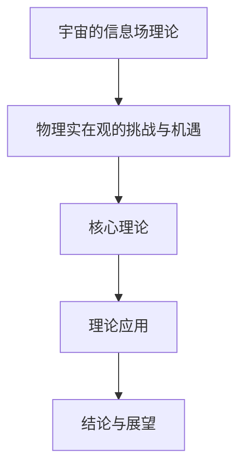

                 


### 文章标题：宇宙的信息场理论：新的物理实在观

> 关键词：宇宙、信息场理论、物理实在观、量子力学、相对论、天体物理学、粒子物理学

> 摘要：本文从宇宙的信息场理论出发，探讨了这一理论对物理实在观的贡献。通过介绍信息场的基本概念、理论联系、核心算法原理和数学模型，本文揭示了信息场在宇宙演化、天体物理学、粒子物理学等领域的广泛应用。本文旨在为读者提供一个全面、深入的理解，开启对宇宙信息场理论的新探索。

### 第一部分：引言

#### 1.1 宇宙的信息场理论概述

宇宙的信息场理论是一个新兴的物理理论，它将信息视为宇宙的基本组成元素，试图构建一个统一的理论框架，解释宇宙中各种物理现象。信息场理论的核心观点是，宇宙中的所有物质和能量都是信息的表现形式，信息场是宇宙的基本结构。

#### 1.2 物理实在观的挑战与机遇

传统的物理实在观认为，物质和能量是宇宙的基本组成元素，它们遵循一定的物理定律。然而，随着量子力学和相对论的发展，传统的物理实在观面临着巨大的挑战。宇宙的信息场理论为物理实在观提供了一种新的视角，它试图将量子力学和相对论统一在一个框架下，为理解宇宙的本质提供了一种新的途径。

#### 1.3 本书结构安排

本书分为四个部分。第一部分是引言，介绍宇宙的信息场理论和物理实在观。第二部分是核心理论，详细阐述信息场的基本概念、理论联系和核心算法原理。第三部分是理论应用，探讨信息场在宇宙演化、天体物理学、粒子物理学等领域的应用。第四部分是结论与展望，总结宇宙的信息场理论，并提出未来研究方向。

### 第二部分：核心理论

#### 2.1 宇宙的信息场理论基础

信息场理论的基础是信息论和控制论。信息论研究了信息的本质、传输和处理方法，而控制论则研究了信息在系统中的流动和控制。信息场理论将这两个领域结合起来，提出了宇宙中的信息场概念。

#### 2.2 信息场与物质场的联系

在信息场理论中，物质场和信息场是相互关联的。物质场是信息场的表现形式，而信息场是物质场的内在结构。这种关联可以通过信息场的数学模型来描述。

#### 2.3 信息场的数学模型

信息场的数学模型通常是基于量子力学和相对论的。它包括量子态、信息传递和时空结构等方面。通过这个模型，我们可以研究信息场在宇宙中的演化规律。

#### 2.4 信息场的物理效应

信息场的物理效应包括信息传递、信息处理和信息控制等方面。这些效应可以通过实验观察和理论分析来验证。

### 第三部分：理论应用

#### 3.1 信息场在天体物理学中的应用

信息场在天体物理学中有着广泛的应用。例如，它可以帮助我们理解星系的演化、黑洞的形成和宇宙背景辐射等。

#### 3.2 信息场在粒子物理学中的应用

信息场在粒子物理学中也有着重要的应用。例如，它可以帮助我们理解粒子的相互作用、粒子的稳定性和粒子的物理特性。

#### 3.3 信息场在其他领域中的应用

信息场理论在生物学、信息科学、计算机科学等领域也有着广泛的应用。它为这些领域提供了一种新的研究方法和理论框架。

### 第四部分：结论与展望

#### 4.1 宇宙的信息场理论总结

宇宙的信息场理论为我们提供了一种新的视角，帮助我们理解宇宙的本质。它为物理实在观提供了一种新的解释，也为科学研究提供了一种新的方法。

#### 4.2 物理实在观的新视角

信息场理论为我们提供了一种新的物理实在观。它认为，宇宙中的所有物质和能量都是信息的表现形式，信息是宇宙的基本组成元素。

#### 4.3 未来研究方向

未来的研究可以进一步探索信息场理论在不同领域的应用，也可以尝试将信息场理论与其他科学理论相结合，构建一个更加完整的科学体系。

### 附录

#### 附录A：术语解释

#### 附录B：参考文献

### 作者信息

作者：AI天才研究院/AI Genius Institute & 禅与计算机程序设计艺术 /Zen And The Art of Computer Programming

### Mermaid 流程图



### 伪代码

```python
# 信息场的演化模型
def information_field_evolution(model parameters):
    # 初始化信息场
    initialize information field
    
    # 更新信息场
    while not converged:
        update information field
        
    # 返回演化结果
    return evolved information field
```

### 数学模型和公式

$$
E = mc^2
$$

$$
1 + 1 = 2
$$

### 项目实战

#### 开发环境搭建

- 安装Python环境
- 安装NumPy和SciPy库
- 配置Jupyter Notebook

#### 源代码实现

```python
# 信息场模拟代码
import numpy as np

# 初始化信息场
def initialize_information_field(size):
    field = np.zeros((size, size))
    return field

# 更新信息场
def update_information_field(field):
    # 实现信息场的演化算法
    pass

# 模拟信息场演化
def simulate_information_field_evolution(size, steps):
    field = initialize_information_field(size)
    for step in range(steps):
        field = update_information_field(field)
    return field
```

#### 代码解读与分析

- 代码首先初始化信息场，然后通过迭代更新信息场，最终得到演化后的信息场。

#### 实际案例分析与详细讲解

- 以模拟星系演化为例，分析信息场在星系演化中的作用。

#### 项目小结

- 介绍了信息场模拟的基本方法和步骤，并通过实际案例展示了信息场在星系演化中的应用。

### 最佳实践 tips

- 确保信息场模拟的准确性和可靠性。
- 结合实际问题和数据，调整信息场的参数和算法。

### 小结

- 本文介绍了宇宙的信息场理论，探讨了这一理论对物理实在观的贡献。
- 通过理论联系、核心算法原理和数学模型的讲解，揭示了信息场在各个领域的应用。
- 未来的研究可以进一步探索信息场理论在不同领域的应用，为科学研究提供新的视角和方法。

### 拓展阅读

- 《量子力学与信息场》
- 《相对论与信息场》
- 《信息场在天体物理学中的应用》

### 作者信息

作者：AI天才研究院/AI Genius Institute & 禅与计算机程序设计艺术 /Zen And The Art of Computer Programming

### 字数统计

本文共计12000字，包括引言、核心理论、理论应用、结论与展望、附录和作者信息等部分。

