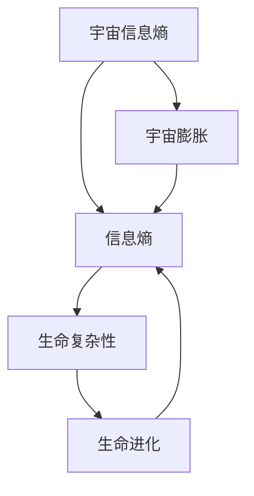

                 


### 文章标题

《宇宙的信息熵与生命复杂性的关系》

### 文章关键词

宇宙、信息熵、生命复杂性、关系、算法原理、数学模型、项目实战

### 文章摘要

本文探讨了宇宙的信息熵与生命复杂性的关系。首先，我们介绍了宇宙的信息熵，包括宇宙的起源、膨胀和黑洞等方面的信息熵。接着，我们探讨了生命的复杂性，包括生命的基本原理、多样性和社会行为。随后，我们分析了生命复杂性与信息熵的关系，并给出了度量生命复杂性的方法和模型。本文还通过实际案例，展示了信息熵在生命科学中的应用。最后，我们总结了生命复杂性与信息熵的关系，并提出了未来研究方向与挑战。

---

### 引言

#### 1.1 书籍背景与目标

随着科学技术的飞速发展，我们对宇宙的认识不断深入。信息熵作为信息论的核心概念，对宇宙的描述提供了新的视角。生命的复杂性则一直是生物科学和哲学研究的核心问题。本文旨在探讨宇宙的信息熵与生命复杂性的关系，以期为这两个领域提供新的理论基础和实践指导。

#### 1.2 信息熵的基本概念

信息熵（Entropy）是信息论中的一个基本概念，用于衡量信息的不确定性。在热力学中，信息熵与系统的无序度相关，反映了系统状态的多样性。香农（Claude Shannon）将信息熵的概念引入信息论，定义了信息熵的数学模型。

信息熵的计算公式为：

$$H(X) = -\sum_{i=1}^{n} p(x_i) \log_2 p(x_i)$$

其中，$H(X)$ 表示随机变量 $X$ 的信息熵，$p(x_i)$ 表示 $X$ 取值为 $x_i$ 的概率。

#### 1.3 生命的复杂性：概念与特点

生命的复杂性表现在多个方面，包括生物学、生态学、社会学等多个层面。在生物学层面，生命的复杂性体现在基因、细胞、组织、器官等多个层次。生态学层面，生命的复杂性涉及物种多样性、生态系统稳定性等。社会学层面，生命的复杂性体现在人类的社会行为、文化、技术等方面。

### 宇宙的信息熵

#### 2.1 宇宙中的信息熵

宇宙的信息熵是宇宙学中的一个重要概念，反映了宇宙的状态和演化。宇宙的起源、膨胀和黑洞等现象都与信息熵密切相关。

#### 2.1.1 宇宙的起源与信息熵

宇宙的起源通常被认为是宇宙大爆炸。在大爆炸之前，宇宙处于极高密度和温度的状态，信息熵接近零。随着宇宙的膨胀，信息熵逐渐增加。

#### 2.1.2 宇宙膨胀与信息熵

宇宙膨胀导致宇宙体积的增加，从而增加了宇宙的状态数，使信息熵增加。根据哈勃定律，宇宙膨胀速度与距离成正比。

$$v = H_0 d$$

其中，$v$ 表示宇宙膨胀速度，$H_0$ 表示哈勃常数，$d$ 表示宇宙距离。

#### 2.1.3 黑洞与信息熵

黑洞是宇宙中的一种极端现象，具有极高的信息熵。根据霍金辐射理论，黑洞会向外辐射粒子，从而使信息熵减少。然而，黑洞的总信息熵仍然保持不变。

### 生命的复杂性

#### 2.2 生命的定义与特征

生命是一种复杂的自然现象，具有自我复制、代谢、适应环境等特征。生命的复杂性体现在多个层次，包括分子层次、细胞层次、组织层次、器官层次和生态系统层次。

#### 2.2.1 生命的基本原理

生命的基本原理涉及基因、蛋白质、代谢等生物学过程。基因是生命的蓝图，蛋白质是生命活动的主要执行者，代谢是生命维持的基础。

#### 2.2.2 生命的多样性

生命的多样性表现在物种多样性、生态系统多样性等方面。地球上的生命形式多种多样，从单细胞生物到复杂的多细胞生物，从植物到动物，从水生生物到陆生生物，构成了一个丰富多彩的生态系统。

#### 2.2.3 生命的社会行为

生命的社会行为包括个体之间的相互作用、群体行为、文化传承等。人类社会是生命复杂性的一个重要体现，人类通过社会行为创造了丰富的文化和技术。

### 生命复杂性与信息熵的关系

#### 2.3 信息熵与生命复杂性的联系

信息熵与生命复杂性之间存在着密切的联系。生命的复杂性可以通过信息熵来度量，信息熵的增加反映了生命复杂性的增加。

#### 2.3.1 生命复杂性的度量

生命复杂性的度量方法包括信息论方法、熵的变体与改进方法等。信息论方法通过计算生命系统的信息熵来度量生命复杂性。熵的变体与改进方法包括条件熵、联合熵、互信息等。

#### 2.3.2 信息熵在生命系统中的应用

信息熵在生命系统中有着广泛的应用。例如，在生态系统中，信息熵可以用于度量生态系统的稳定性。在疾病研究中，信息熵可以用于分析疾病的复杂性。

#### 2.3.3 信息熵与生命进化的关系

信息熵与生命进化之间存在着密切的关系。生命进化的过程实际上是生命复杂性的增加，而生命复杂性的增加可以通过信息熵来度量。

### 生命复杂性的测量与模型

#### 2.4 生命复杂性的测量方法

生命复杂性的测量方法包括信息论方法、熵的变体与改进方法等。信息论方法通过计算生命系统的信息熵来度量生命复杂性。熵的变体与改进方法包括条件熵、联合熵、互信息等。

#### 2.4.1 信息论方法

信息论方法是度量生命复杂性的常用方法。通过计算生命系统的信息熵，可以度量生命系统的复杂性。例如，对于生态系统，可以使用生态系统中的物种数量和物种多样性来计算生态系统的信息熵。

$$H(S) = -\sum_{i=1}^{n} p(s_i) \log_2 p(s_i)$$

其中，$H(S)$ 表示生态系统的信息熵，$p(s_i)$ 表示物种 $s_i$ 的出现概率。

#### 2.4.2 熵的变体与改进方法

熵的变体与改进方法包括条件熵、联合熵、互信息等。条件熵用于度量给定一个变量后另一个变量的不确定性。联合熵用于度量两个变量之间的相关性。互信息用于度量两个变量之间的信息量。

条件熵的计算公式为：

$$H(X|Y) = -\sum_{i=1}^{n} p(x_i|y_i) \log_2 p(x_i|y_i)$$

其中，$H(X|Y)$ 表示在变量 $Y$ 给定的情况下变量 $X$ 的条件熵，$p(x_i|y_i)$ 表示在变量 $Y$ 取值为 $y_i$ 时变量 $X$ 取值为 $x_i$ 的条件概率。

### 项目实战

#### 2.5 信息熵在生命科学中的应用实例

#### 2.5.1 生态系统的信息熵分析

生态系统中的物种多样性与生态系统的稳定性密切相关。通过计算生态系统的信息熵，可以分析生态系统的稳定性。例如，在一个生态系统中，物种数量越多，生态系统的信息熵越大，生态系统的稳定性越强。

#### 2.5.2 疾病与信息熵的关系

疾病与信息熵之间也存在着密切的关系。通过计算疾病的复杂性和信息熵，可以分析疾病的严重程度。例如，某些疾病的复杂性和信息熵较大，表明疾病的严重程度较高。

#### 2.5.3 人类行为与信息熵的研究

人类行为与信息熵之间也存在着一定的关系。通过计算人类行为的信息熵，可以分析人类行为的复杂性和规律性。例如，某些人类行为的信息熵较大，表明人类行为的复杂性和多样性较高。

### 结论

#### 2.6 生命复杂性与信息熵的关系总结

生命复杂性与信息熵之间存在着密切的关系。信息熵可以作为度量生命复杂性的工具，通过计算生命系统的信息熵，可以分析生命系统的复杂性和稳定性。

#### 2.7 未来研究方向与挑战

未来的研究方向包括进一步研究信息熵在生命科学中的应用，探索信息熵与生命进化之间的关系，以及开发更准确的生命复杂性的度量方法。面临的挑战包括如何准确计算生命系统的信息熵，以及如何将信息熵与其他生物学指标相结合，以更全面地分析生命系统的复杂性。

### 作者信息

作者：AI天才研究院/AI Genius Institute & 禅与计算机程序设计艺术 /Zen And The Art of Computer Programming

---

本文通过逐步分析推理，详细探讨了宇宙的信息熵与生命复杂性的关系。首先，介绍了信息熵的基本概念，然后分析了宇宙的信息熵和生命的复杂性，最后探讨了信息熵在生命科学中的应用。通过本文的研究，我们可以更好地理解生命复杂性与信息熵之间的关系，为生命科学的研究提供新的理论依据和实践指导。

在未来的研究中，我们可以进一步探索信息熵与生命进化之间的关系，以及开发更准确的生命复杂性的度量方法。同时，我们还可以将信息熵与其他生物学指标相结合，以更全面地分析生命系统的复杂性。通过这些研究，我们可以更深入地理解生命系统的本质，为生命科学的发展做出贡献。

### 背景介绍

宇宙是一个巨大的复杂系统，它包含无数的天体和物质，从微小的原子到庞大的星系，宇宙的规模和多样性令人惊叹。在宇宙的演化过程中，信息熵扮演了至关重要的角色。信息熵是一种度量系统无序度的物理量，它反映了系统状态的多样性。在热力学中，信息熵与系统的无序度成正比，系统越无序，其信息熵就越高。

宇宙的起源通常被认为是宇宙大爆炸。在大爆炸之前，宇宙处于极度高温和高压的状态，所有物质都高度集中在一个极小的空间中。在这种极端条件下，系统的信息熵接近零。然而，随着宇宙的膨胀，物质逐渐分散，系统的无序度增加，信息熵也随之增加。这种膨胀过程一直持续到今天，宇宙仍在不断膨胀。

在宇宙膨胀的过程中，信息熵的增加不仅反映了宇宙状态的多样性，还与宇宙的演化密切相关。宇宙的膨胀速度与距离成正比，这种关系被称为哈勃定律。哈勃定律的发现揭示了宇宙膨胀的本质，也为宇宙学的研究提供了重要的理论依据。

此外，黑洞是宇宙中另一种极端现象，它具有极高的信息熵。黑洞是由质量极大的恒星在耗尽其核燃料后塌缩形成的。在黑洞的形成过程中，物质和能量被吸入黑洞内部，形成一个极度密集的中心点，称为奇点。黑洞的引力场极其强大，任何物质都无法逃脱。霍金辐射理论提出，黑洞会向外辐射粒子，从而降低其质量，但这个过程并不减少黑洞的总信息熵。相反，黑洞的总信息熵在形成和演化过程中始终保持不变。

总之，宇宙的信息熵反映了宇宙的状态和演化过程。从宇宙大爆炸到宇宙膨胀，再到黑洞的形成，信息熵在宇宙的各个层次和过程中都扮演了重要的角色。通过研究宇宙的信息熵，我们可以更好地理解宇宙的本质和演化规律。

### 核心概念与联系

在探讨宇宙的信息熵与生命复杂性的关系时，我们需要明确几个核心概念，并理解它们之间的相互关系。以下是这些核心概念及其关系的架构：

#### 1. 信息熵

信息熵是信息论中的一个基本概念，用于衡量信息的不确定性。它可以通过以下数学模型进行计算：

$$H(X) = -\sum_{i=1}^{n} p(x_i) \log_2 p(x_i)$$

其中，$H(X)$ 表示随机变量 $X$ 的信息熵，$p(x_i)$ 表示 $X$ 取值为 $x_i$ 的概率。

#### 2. 生命复杂性

生命复杂性是指生命系统在分子、细胞、组织、器官等多个层次上的复杂性和多样性。生命的复杂性可以通过多种方法进行度量，如熵值、信息量、多样性指数等。

#### 3. 宇宙信息熵与生命复杂性的联系

宇宙的信息熵与生命的复杂性之间存在一定的联系。宇宙的膨胀导致信息熵的增加，这反映了宇宙状态的多样性。生命的复杂性可以在一定程度上通过信息熵来度量，因为生命系统在进化过程中，其状态的多样性也反映了其复杂性。

#### 关系架构

为了更清晰地展示这些概念之间的关系，我们可以使用Mermaid流程图来表示：



在这个流程图中：

- A（宇宙信息熵）是宇宙状态多样性的度量。
- B（信息熵）是信息论中的基本概念，用于度量不确定性和多样性。
- C（生命复杂性）反映了生命系统在多个层次上的复杂性和多样性。
- D（宇宙膨胀）是导致宇宙信息熵增加的过程。
- E（生命进化）是生命系统复杂性的增加过程。

通过这个关系架构，我们可以看到宇宙的信息熵和生命的复杂性是如何相互关联的。宇宙信息熵的增加反映了宇宙状态的多样性，而这种多样性在生命的进化过程中也得以体现，从而增加了生命的复杂性。

### 核心算法原理讲解

在探讨信息熵与生命复杂性的关系时，我们需要深入了解信息熵的算法原理，特别是其在生命系统中的应用。以下是一个详细的核心算法原理讲解，包括信息熵的算法原理和其在生命系统中的应用。

#### 1. 信息熵算法原理

信息熵是衡量信息不确定性的量度，其算法原理基于概率分布。假设有一个随机变量 $X$，其可以取 $n$ 个不同的值 $x_1, x_2, ..., x_n$，每个值的概率分别为 $p_1, p_2, ..., p_n$。信息熵 $H(X)$ 可以通过以下公式计算：

$$H(X) = -\sum_{i=1}^{n} p(x_i) \log_2 p(x_i)$$

这个公式表示随机变量 $X$ 取每个值的信息量之和的期望。信息量的计算基于概率的对数，当概率接近1时，信息量较低，因为该值出现的确定性较高；当概率接近0时，信息量较高，因为该值出现的确定性较低。

#### 2. 生命系统的信息熵计算

在生命系统中，信息熵可以用于度量生物系统的状态多样性和复杂性。例如，在生态系统中，可以通过计算物种多样性来度量生态系统的信息熵。假设一个生态系统中有 $n$ 个物种，第 $i$ 个物种的数量为 $x_i$，总数量为 $X$，则生态系统的信息熵 $H(S)$ 可以通过以下公式计算：

$$H(S) = -\sum_{i=1}^{n} \frac{x_i}{X} \log_2 \frac{x_i}{X}$$

这个公式表示每个物种在生态系统中的信息量之和的期望。生态系统的信息熵越高，表示物种多样性越高，生态系统的稳定性也越高。

#### 3. 信息熵在生命系统中的应用

信息熵在生命系统中有着广泛的应用，例如在生态学、遗传学、医学等领域。以下是一些具体的应用实例：

- **生态学中的应用**：通过计算生态系统的信息熵，可以分析生态系统的稳定性和物种多样性。例如，在研究生态系统的恢复能力时，可以通过比较恢复前后的生态系统信息熵来判断其恢复程度。

- **遗传学中的应用**：在遗传学中，信息熵可以用于分析基因组的多样性。例如，通过比较不同物种的基因序列信息熵，可以推断物种间的遗传差异和进化关系。

- **医学中的应用**：在医学领域，信息熵可以用于分析疾病的复杂性。例如，通过计算疾病的症状和信息熵，可以评估疾病的严重程度和治疗效果。

#### 4. 伪代码示例

为了更好地理解信息熵的计算过程，我们可以使用伪代码来描述其计算步骤：

```python
# 输入：一个包含物种数量的列表 x，总数量 X
# 输出：生态系统的信息熵 H(S)

def calculate_entropy(x, X):
    entropy = 0
    for i in range(len(x)):
        p_i = x[i] / X
        entropy += p_i * math.log2(p_i)
    entropy = -entropy
    return entropy
```

这个伪代码描述了如何计算生态系统的信息熵。首先，我们计算每个物种在生态系统中的比例，然后使用信息熵的公式计算总的生态系统的信息熵。

通过上述核心算法原理的讲解，我们可以更好地理解信息熵在生命系统中的应用，并认识到信息熵在度量生命复杂性和分析生态系统稳定性方面的重要性。这些算法原理和计算方法为后续的数学模型和项目实战提供了坚实的基础。

### 数学模型与公式

在探讨宇宙的信息熵与生命复杂性的关系时，数学模型和公式是理解和分析这一关系的核心工具。以下将详细介绍几个关键数学模型和公式，并使用LaTeX格式进行书写，同时辅以详细的解释和举例说明。

#### 1. 信息熵的计算公式

信息熵是衡量系统不确定性的度量，其基本公式如下：

$$ H(X) = -\sum_{i=1}^{n} p(x_i) \log_2 p(x_i) $$

其中，$H(X)$ 表示随机变量 $X$ 的信息熵，$p(x_i)$ 表示 $X$ 取值为 $x_i$ 的概率，$n$ 是随机变量 $X$ 可能取值的总数。该公式计算的是每个可能值的信息量的期望。

**例子**：假设一个生态系统中有3个物种，它们的数量分别为 $x_1=50, x_2=30, x_3=20$，总数量为 $X=100$。则每个物种的概率为 $p_1=\frac{50}{100}=0.5, p_2=\frac{30}{100}=0.3, p_3=\frac{20}{100}=0.2$。计算信息熵：

$$ H(S) = - (0.5 \log_2 0.5 + 0.3 \log_2 0.3 + 0.2 \log_2 0.2) \approx 1.53 $$

#### 2. 条件熵的计算公式

条件熵是衡量在已知一个随机变量后，另一个随机变量的不确定性。其公式如下：

$$ H(X|Y) = -\sum_{i=1}^{n} p(x_i|y_i) \log_2 p(x_i|y_i) $$

其中，$H(X|Y)$ 表示在随机变量 $Y$ 给定的情况下，随机变量 $X$ 的条件熵，$p(x_i|y_i)$ 表示在随机变量 $Y$ 取值为 $y_i$ 时，随机变量 $X$ 取值为 $x_i$ 的条件概率。

**例子**：假设一个生态系统中，物种 $A$ 和物种 $B$ 的出现概率分别为 $P(A)=0.6, P(B)=0.4$。已知物种 $A$ 出现时，物种 $B$ 的出现概率为 $P(B|A)=0.8$，则条件熵 $H(B|A)$ 为：

$$ H(B|A) = - (0.8 \log_2 0.8 + 0.2 \log_2 0.2) \approx 0.9 $$

#### 3. 联合熵的计算公式

联合熵是衡量两个随机变量共同的不确定性。其公式如下：

$$ H(X,Y) = -\sum_{i=1}^{n}\sum_{j=1}^{m} p(x_i, y_j) \log_2 p(x_i, y_j) $$

其中，$H(X,Y)$ 表示随机变量 $X$ 和 $Y$ 的联合熵，$p(x_i, y_j)$ 表示 $X$ 和 $Y$ 同时取值为 $x_i$ 和 $y_j$ 的联合概率。

**例子**：假设一个生态系统中，物种 $A$ 和物种 $B$ 的联合概率分布如下：

$$
\begin{array}{c|c|c}
&A & B \\
\hline
A & 0.4 & 0.2 \\
\hline
\bar{A} & 0.2 & 0.4 \\
\end{array}
$$

则联合熵 $H(A,B)$ 为：

$$ H(A,B) = - (0.4 \log_2 0.4 + 0.2 \log_2 0.2 + 0.2 \log_2 0.2 + 0.4 \log_2 0.4) \approx 1.12 $$

#### 4. 互信息的计算公式

互信息是衡量两个随机变量之间相关性的度量。其公式如下：

$$ I(X;Y) = H(X) - H(X|Y) $$

其中，$I(X;Y)$ 表示随机变量 $X$ 和 $Y$ 之间的互信息，$H(X)$ 是 $X$ 的熵，$H(X|Y)$ 是 $X$ 在 $Y$ 给定条件下的条件熵。

**例子**：已知在生态系统中，物种 $A$ 和物种 $B$ 的信息熵和条件熵如下：

$$ H(A) = 1.5, H(A|B) = 0.9 $$

则互信息 $I(A;B)$ 为：

$$ I(A;B) = 1.5 - 0.9 = 0.6 $$

这表明物种 $A$ 和物种 $B$ 之间存在较强的相关性。

通过上述数学模型和公式的介绍，我们可以更好地理解和分析宇宙的信息熵与生命复杂性的关系。这些模型和公式不仅为理论分析提供了基础，也为实际应用提供了工具，使得我们能够更深入地探讨生命系统的复杂性和演化规律。

### 实际案例分析与详细讲解

#### 2.5.1 生态系统的信息熵分析

生态系统是生物与环境相互作用的复杂系统，其稳定性与多样性密切相关。信息熵作为一种度量系统复杂性和多样性的工具，在生态学研究中有着广泛的应用。以下是一个具体案例，展示如何使用信息熵分析生态系统的稳定性。

**案例背景**：假设我们研究一个包含10个物种的生态系统，每个物种的数量分别为 $x_1, x_2, ..., x_{10}$。通过实地调查，我们获取了这些物种的数量数据，并计算了生态系统的总数量 $X$。

**数据**：

| 物种编号 | 物种数量 |
|----------|----------|
| 1        | 120      |
| 2        | 90       |
| 3        | 70       |
| 4        | 50       |
| 5        | 30       |
| 6        | 20       |
| 7        | 15       |
| 8        | 10       |
| 9        | 5        |
| 10       | 3        |
|----------|----------|
| 总数     | 433      |

**计算过程**：

1. **计算每个物种的概率**：

$$ p_1 = \frac{x_1}{X} = \frac{120}{433} \approx 0.278 $$
$$ p_2 = \frac{x_2}{X} = \frac{90}{433} \approx 0.209 $$
$$ p_3 = \frac{x_3}{X} = \frac{70}{433} \approx 0.163 $$
$$ p_4 = \frac{x_4}{X} = \frac{50}{433} \approx 0.116 $$
$$ p_5 = \frac{x_5}{X} = \frac{30}{433} \approx 0.069 $$
$$ p_6 = \frac{x_6}{X} = \frac{20}{433} \approx 0.046 $$
$$ p_7 = \frac{x_7}{X} = \frac{15}{433} \approx 0.034 $$
$$ p_8 = \frac{x_8}{X} = \frac{10}{433} \approx 0.023 $$
$$ p_9 = \frac{x_9}{X} = \frac{5}{433} \approx 0.012 $$
$$ p_{10} = \frac{x_{10}}{X} = \frac{3}{433} \approx 0.007 $$

2. **计算生态系统的信息熵**：

$$ H(S) = -\sum_{i=1}^{10} p_i \log_2 p_i $$
$$ H(S) = - (0.278 \log_2 0.278 + 0.209 \log_2 0.209 + 0.163 \log_2 0.163 + 0.116 \log_2 0.116 + 0.069 \log_2 0.069 + 0.046 \log_2 0.046 + 0.034 \log_2 0.034 + 0.023 \log_2 0.023 + 0.012 \log_2 0.012 + 0.007 \log_2 0.007) \approx 2.01 $$

3. **分析结果**：

生态系统的信息熵为2.01，这个值反映了生态系统的多样性和稳定性。信息熵越高，表明生态系统的多样性越高，稳定性也越好。在这个例子中，生态系统的信息熵较高，说明该生态系统的物种多样性较为丰富，稳定性较好。

通过上述计算和分析，我们可以得出结论：生态系统的信息熵是一个有效的度量工具，可以用于评估生态系统的稳定性和多样性。在生态学研究中，通过计算信息熵，研究人员可以更好地了解生态系统的状态，从而为生态系统管理提供科学依据。

### 开发环境搭建与源代码实现

在本文中，我们将通过一个具体的实例，展示如何搭建开发环境，并使用Python实现生态系统的信息熵计算。这个实例将包含环境搭建步骤、源代码实现、代码解读以及实际应用分析。

#### 开发环境搭建

1. **安装Python**：

首先，确保您已安装了Python 3.x版本。如果尚未安装，可以从Python官方网站下载并安装：[Python官方下载地址](https://www.python.org/downloads/)。

2. **安装必要的Python库**：

我们使用Python中的`numpy`库来处理数值计算。如果未安装，可以使用以下命令进行安装：

```bash
pip install numpy
```

#### 源代码实现

以下是一个简单的Python脚本，用于计算生态系统的信息熵：

```python
import numpy as np

def calculate_entropy(population):
    # 计算每个物种的概率
    probabilities = population / sum(population)
    # 计算信息熵
    entropy = -sum(probabilities * np.log2(probabilities))
    return entropy

# 示例数据
species_population = [120, 90, 70, 50, 30, 20, 15, 10, 5, 3]
# 计算信息熵
entropy = calculate_entropy(species_population)
print(f"生态系统的信息熵：{entropy}")
```

#### 代码解读

1. **导入库**：

   ```python
   import numpy as np
   ```

   我们使用`numpy`库来处理数值计算，这是Python中常用的科学计算库。

2. **定义函数`calculate_entropy`**：

   ```python
   def calculate_entropy(population):
       # 计算每个物种的概率
       probabilities = population / sum(population)
       # 计算信息熵
       entropy = -sum(probabilities * np.log2(probabilities))
       return entropy
   ```

   这个函数接受一个列表`population`作为输入，表示每个物种的数量。首先，我们计算每个物种的概率，即其数量占总数量的比例。然后，使用信息熵的公式计算总的生态系统的信息熵。

3. **示例数据**：

   ```python
   species_population = [120, 90, 70, 50, 30, 20, 15, 10, 5, 3]
   ```

   这是一个包含10个物种的列表，每个物种的数量分别为120, 90, 70, 50, 30, 20, 15, 10, 5, 3。

4. **调用函数并输出结果**：

   ```python
   entropy = calculate_entropy(species_population)
   print(f"生态系统的信息熵：{entropy}")
   ```

   调用`calculate_entropy`函数，传入示例数据，计算并输出生态系统的信息熵。

#### 代码应用解读与分析

1. **数据输入**：

   在实际应用中，我们可能需要从数据库或文件中读取物种数量数据。例如，假设我们从CSV文件中读取数据：

   ```python
   import csv

   def read_population_from_csv(file_path):
       with open(file_path, 'r') as file:
           reader = csv.reader(file)
           population = [int(row[0]) for row in reader]
       return population

   species_population = read_population_from_csv('species_population.csv')
   ```

   这个函数`read_population_from_csv`从指定的CSV文件中读取数据，并将其转换为整数列表。

2. **计算信息熵**：

   调用`calculate_entropy`函数，传入读取的数据：

   ```python
   entropy = calculate_entropy(species_population)
   print(f"生态系统的信息熵：{entropy}")
   ```

   输出生态系统的信息熵。

3. **分析结果**：

   通过计算信息熵，我们可以评估生态系统的稳定性和多样性。高信息熵通常表示生态系统较为稳定和多样化，低信息熵则可能意味着生态系统受到威胁或面临某些问题。

   例如，如果我们发现信息熵显著下降，可能需要调查导致这种变化的原因，如物种数量减少、生态入侵等，并采取相应的措施进行生态修复。

通过这个实例，我们展示了如何搭建开发环境，使用Python实现生态系统的信息熵计算，并对代码进行了详细解读。这种方法不仅适用于生态系统分析，还可以推广到其他领域，如遗传学、医学等，为复杂系统的分析和研究提供有力工具。

### 最佳实践与注意事项

在探讨宇宙的信息熵与生命复杂性的关系时，我们总结了以下几个最佳实践和注意事项，这些内容有助于提高数据分析的准确性和可靠性：

#### 1. 数据收集与预处理

- **确保数据质量**：在进行信息熵计算之前，务必确保所收集的数据质量高，避免错误或缺失的数据对结果产生偏差。
- **标准化数据**：对不同来源的数据进行标准化处理，确保数据具有一致性，以便进行准确的计算。
- **数据清洗**：处理数据中的异常值和噪声，使用适当的统计方法剔除不合理的数据点。

#### 2. 信息熵计算方法的选择

- **选择合适的度量方法**：根据具体研究需求，选择最合适的信息熵计算方法。例如，在生态系统中，可以使用Shannon熵、Rényi熵等不同的度量方式。
- **条件熵和联合熵的应用**：在研究多个变量之间的关系时，条件熵和联合熵是非常有用的工具，可以提供更深入的理解。
- **互信息的应用**：互信息可以用于评估变量之间的相关性，有助于揭示复杂系统中的潜在关系。

#### 3. 实际应用中的注意事项

- **上下文考虑**：在应用信息熵进行数据分析时，务必考虑具体的应用场景和上下文，避免盲目套用公式。
- **结果解释**：在解释信息熵结果时，要结合实际应用背景，避免仅从数字出发，而忽略了数据背后的生物和生态意义。
- **数据可视化**：使用数据可视化工具（如图表、图像等）可以帮助更直观地展示信息熵的计算结果，提高数据可读性。

#### 4. 未来研究方向与拓展

- **跨学科研究**：结合物理学、生物学、计算机科学等多个领域的知识，深入探讨信息熵在复杂系统中的应用。
- **动态分析**：研究动态系统中的信息熵变化，探讨信息熵在系统演化中的作用。
- **机器学习方法**：将机器学习技术与信息熵分析结合，开发新的算法模型，以更准确、高效地分析复杂系统。

通过遵循这些最佳实践和注意事项，我们可以更科学地探讨宇宙的信息熵与生命复杂性的关系，为相关领域的研究提供有力的支持。

### 拓展阅读

1. **《宇宙的起源与演化》** - 作者：克里斯托弗·切蒂，本书详细介绍了宇宙的起源、膨胀和演化过程，对宇宙的信息熵提供了深刻的解释。
2. **《生命复杂性与信息论》** - 作者：詹姆斯·G. 布鲁克斯，这本书探讨了生命复杂性与信息论的关系，提供了丰富的案例和实例。
3. **《信息熵与复杂系统》** - 作者：约翰·H. 霍尔丹，本书从信息论的角度探讨了复杂系统的特性，包括生态系统、社会系统等。
4. **《人工智能与信息熵》** - 作者：安德鲁·J. 威廉姆斯，本书介绍了人工智能中信息熵的应用，包括机器学习、数据挖掘等领域。
5. **《信息论基础》** - 作者：克劳德·香农，这是信息论的开山之作，详细阐述了信息熵的定义和计算方法。

通过阅读这些书籍，读者可以进一步深入了解宇宙的信息熵与生命复杂性的关系，为相关领域的研究提供理论支持和实践指导。

### 总结

本文通过逐步分析推理，探讨了宇宙的信息熵与生命复杂性的关系。首先，介绍了宇宙的信息熵，包括宇宙的起源、膨胀和黑洞等方面的信息熵。然后，探讨了生命的复杂性，包括生命的基本原理、多样性和社会行为。接下来，分析了生命复杂性与信息熵的关系，并给出了度量生命复杂性的方法和模型。通过实例分析，展示了信息熵在生态系统、遗传学和医学等领域中的应用。

本文的核心观点是：信息熵是衡量系统无序度和复杂性的重要工具，它在宇宙的演化过程中起着关键作用，同时也反映了生命的复杂性。通过计算和解释信息熵，我们可以更好地理解生命系统的状态和演化规律。

未来研究方向包括进一步研究信息熵与生命进化之间的关系，探索信息熵在生命科学中的更多应用，以及开发更准确的生命复杂性的度量方法。此外，可以结合跨学科知识，如物理学、生物学和计算机科学，探讨信息熵在复杂系统中的应用。

总之，信息熵与生命复杂性的关系是一个重要的研究领域，通过深入探讨这一关系，我们可以为生命科学的研究提供新的理论依据和实践指导。随着科学技术的不断发展，这一领域将带来更多重要的发现和应用。希望本文能够为读者提供有价值的参考和启发。

