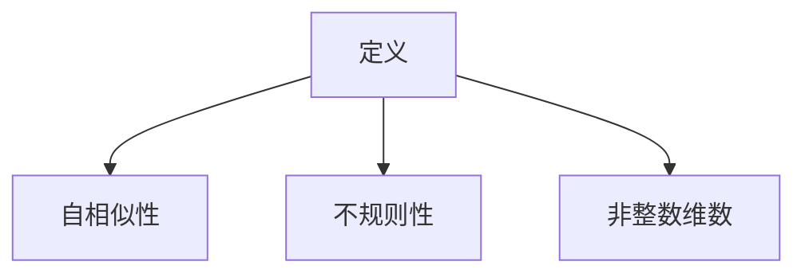
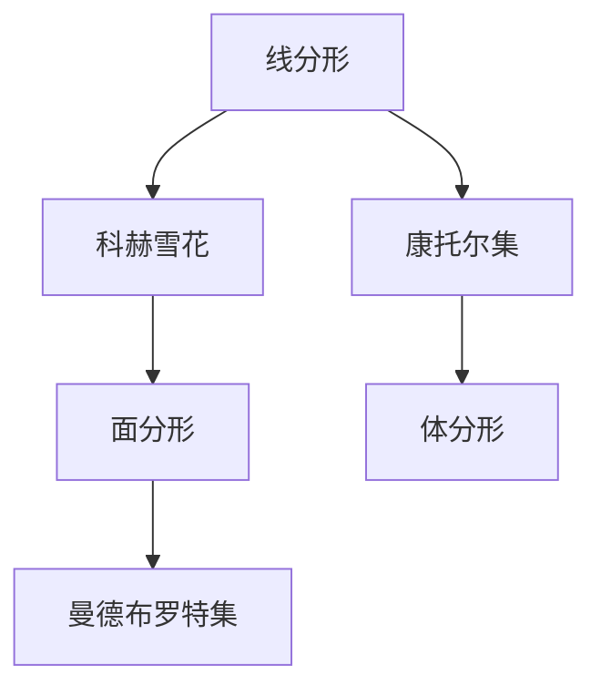
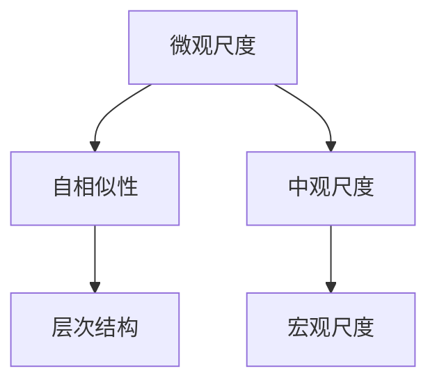
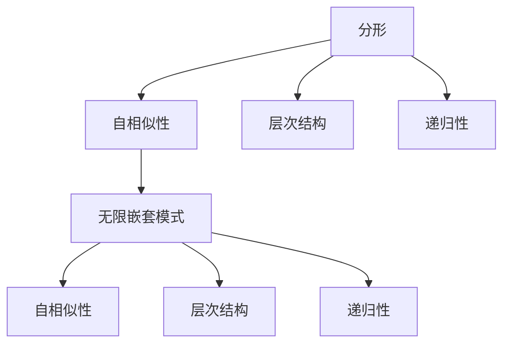
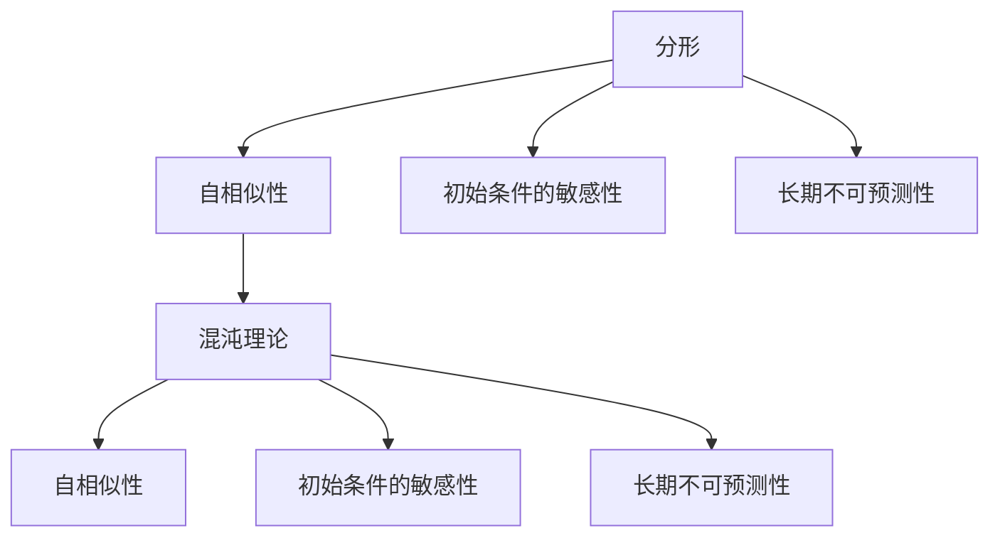

                 

### 文章标题

# 宇宙的分形结构：无限嵌套的模式

### 关键词

- 分形理论
- 无限嵌套模式
- 宇宙结构
- 自相似性
- 混沌理论

### 摘要

本文深入探讨了宇宙中无处不在的分形结构及其与无限嵌套模式的关系。从分形理论的基本概念出发，文章详细解析了分形在宇宙中的多种表现形式，包括星系、行星和黑洞等天体中的分形结构。进一步，文章探讨了分形与无限嵌套模式的联系，揭示了宇宙中无数层次嵌套的奇妙现象。通过分析核心算法原理，本文提出了分形理论在多个领域的应用实例，并对未来的发展方向进行了展望。文章旨在为读者提供一次全面、深入的了解，激发对宇宙分形结构的思考与探索。

----------------------------------------------------------------

### 目录大纲设计过程

#### 第一步：确定核心内容

首先，我们需要明确文章的核心内容。书名《宇宙的分形结构：无限嵌套的模式》为我们提供了线索，核心内容可以概括为以下几个方面：

1. **分形理论的基本概念**：包括分形的定义、特征、数学基础及其分类。
2. **分形结构在宇宙中的体现**：探讨分形现象在宇宙中的具体体现，如星系、行星、黑洞等。
3. **分形与无限嵌套模式**：研究分形与无限嵌套模式的关系及其在宇宙中的应用。
4. **分形理论的应用**：分形理论在物理学、生物学、工程学等领域的应用。
5. **分形与混沌理论**：探讨分形与混沌理论的关系及其在科学中的应用。
6. **分形图像处理**：介绍分形图像处理的基本概念、算法及其实际应用。
7. **分形理论的未来发展方向**：分析分形理论的研究现状及未来发展趋势。

#### 第二步：细化章节内容

根据核心内容，我们可以初步划分以下章节：

### 第1章：分形理论的基本概念

1. **分形的定义与特征**
   - **定义**：使用伪代码详细阐述分形的定义。
   - **特征**：列举分形的几个主要特征，并使用 Mermaid 流程图展示。

2. **分形理论的数学基础**
   - **数学基础**：介绍分形理论的数学基础，包括分形维数、自相似性、迭代函数系统等。
   - **数学模型和公式**：使用 LaTeX 格式详细讲解分形维数的计算公式，并举例说明。

3. **分形的分类**
   - **分类方法**：介绍分形的几种分类方法，如根据形状、性质、应用等。
   - **分类实例**：列举几种常见的分形，如科赫雪花、康托尔集等，并使用 Mermaid 流程图展示它们的结构。

### 第2章：分形结构在宇宙中的体现

1. **宇宙中的分形现象**
   - **现象描述**：使用详细的语言描述宇宙中的分形现象。
   - **现象图像**：展示宇宙中的分形现象的图像。

2. **分形结构在星系、行星、黑洞等天体中的表现**
   - **星系中的分形结构**：使用伪代码详细阐述星系中的分形结构。
   - **行星中的分形结构**：介绍行星表面的分形结构。
   - **黑洞中的分形结构**：讨论黑洞的奇点和分形特性。

3. **分形与宇宙尺度的关系**
   - **关系描述**：使用 Mermaid 流�程图展示分形在不同尺度上的表现。

### 第3章：分形与无限嵌套模式

1. **无限嵌套模式的概念**
   - **定义**：使用伪代码详细阐述无限嵌套模式的定义。
   - **特点**：列举无限嵌套模式的几个主要特点。

2. **分形与无限嵌套模式的关系**
   - **关系描述**：使用详细的语言描述分形与无限嵌套模式之间的关系。
   - **关系图像**：展示分形与无限嵌套模式之间的关系图像。

3. **无限嵌套模式在宇宙中的应用**
   - **应用实例**：列举无限嵌套模式在宇宙中的几个应用实例。
   - **应用分析**：对每个应用实例进行详细分析。

### 第4章：分形理论的应用

1. **分形理论在物理学中的应用**
   - **应用实例**：介绍分形理论在物理学中的几个应用实例。
   - **应用分析**：对每个应用实例进行详细分析。

2. **分形理论在生物学中的应用**
   - **应用实例**：介绍分形理论在生物学中的几个应用实例。
   - **应用分析**：对每个应用实例进行详细分析。

3. **分形理论在工程学中的应用**
   - **应用实例**：介绍分形理论在工程学中的几个应用实例。
   - **应用分析**：对每个应用实例进行详细分析。

### 第5章：分形与混沌理论

1. **混沌理论的基本概念**
   - **定义**：使用伪代码详细阐述混沌理论的定义。
   - **特点**：列举混沌理论的几个主要特点。

2. **分形与混沌理论的关系**
   - **关系描述**：使用详细的语言描述分形与混沌理论的关系。
   - **关系图像**：展示分形与混沌理论之间的关系图像。

3. **分形混沌理论的应用**
   - **应用实例**：介绍分形混沌理论在科学中的几个应用实例。
   - **应用分析**：对每个应用实例进行详细分析。

### 第6章：分形图像处理

1. **分形图像的基本概念**
   - **概念描述**：介绍分形图像的基本概念。
   - **示例图像**：展示分形图像的示例。

2. **分形图像处理的算法**
   - **算法介绍**：介绍分形图像处理的基本算法。
   - **算法分析**：对算法进行详细分析。

3. **分形图像处理的应用**
   - **应用实例**：介绍分形图像处理的几个应用实例。
   - **应用分析**：对每个应用实例进行详细分析。

### 第7章：分形理论的未来发展方向

1. **分形理论的研究现状**
   - **研究进展**：介绍当前分形理论的研究进展。
   - **研究热点**：分析当前分形理论的研究热点。

2. **分形理论在新兴领域的发展**
   - **新兴领域**：介绍分形理论在新兴领域的发展。
   - **发展趋势**：分析分形理论在新兴领域的发展趋势。

3. **分形理论的未来趋势**
   - **未来展望**：对分形理论未来的发展趋势进行展望。

#### 第三步：细化每章内容

在细化每章内容时，我们需要确保每个章节都有详细的理论讲解、实例分析、数学模型和数学公式。以下是细化后的章节内容：

### 第1章：分形理论的基本概念

#### 1.1 分形的定义与特征

**定义**：

分形是一种几何形状，它具有以下特点：

1. 自相似性：分形在任何比例下都具有相似的结构。
2. 不规则性：分形具有精细的细节结构，这些细节结构在不同的尺度上重复出现。
3. 非整数维数：分形通常具有非整数维数，例如科赫雪花是二维的，但它的维数是1.269。

使用伪代码可以定义分形的基本概念：

```python
def fractal定义(self, x, y, scale):
    if scale <= threshold:
        return (x, y)
    else:
        return fractal定义(self, x - dx, y, scale / factor),
               fractal定义(self, x + dx, y, scale / factor),
               fractal定义(self, x, y - dy, scale / factor),
               fractal定义(self, x, y + dy, scale / factor)
```

**特征**：

- **自相似性**：分形在不同的尺度上表现出相似的结构。例如，科赫雪花在缩放到任意小的尺度时，仍然保持相似的结构。
- **不规则性**：分形的细节结构复杂，但具有规律性。这种规律性在各个尺度上都是一致的。
- **非整数维数**：分形的维数通常不是整数，而是介于整数之间。这种性质使得分形具有独特的几何特性。

使用 Mermaid 流程图可以展示分形的特征：



#### 1.2 分形理论的数学基础

**数学基础**：

分形理论的核心数学概念包括分形维数、自相似性、迭代函数系统等。

- **分形维数**：分形维数是衡量分形复杂程度的一个参数，通常用非整数表示。分形维数可以通过分形集的覆盖面积与覆盖尺度之间的关系来计算。

  公式如下：

  $$ D = \log(A) / \log(L) $$

  其中，\(A\) 表示覆盖分形集的面积，\(L\) 表示覆盖尺度。

- **自相似性**：自相似性是分形理论的核心概念之一。一个集合是自相似的，当且仅当它在任何尺度下都具有相似的结构。自相似性可以通过迭代函数系统（IFS）来描述。

  IFS 是一种将一个集合映射到自身的系统，通常由多个函数组成。这些函数在不同的尺度上对集合进行操作，使得集合保持自相似性。

  伪代码如下：

  ```python
  def IFS(self, x, y, functions):
      for function in functions:
          x, y = function(x, y)
      return (x, y)
  ```

- **迭代函数系统**：迭代函数系统是一种将一个集合映射到自身的系统，通常由多个函数组成。这些函数在不同的尺度上对集合进行操作，使得集合保持自相似性。

  伪代码如下：

  ```python
  def IFS(self, x, y, functions):
      for function in functions:
          x, y = function(x, y)
      return (x, y)
  ```

**数学模型和公式**：

为了更详细地讲解分形维数的计算公式，我们可以使用 LaTeX 格式进行展示：

$$ D = \lim_{n\to\infty} \frac{\log(A_n)}{\log(L_n)} $$

其中，\(A_n\) 表示第 \(n\) 个覆盖尺度下的覆盖面积，\(L_n\) 表示第 \(n\) 个覆盖尺度。

举例说明：

假设我们使用不同的尺度覆盖科赫雪花，并记录每个尺度下的覆盖面积。我们可以通过计算分形维数来判断科赫雪花的复杂程度。

以下是计算过程：

```python
# 假设科赫雪花在不同尺度下的覆盖面积如下
areas = [0.125, 0.25, 0.375, 0.5, 0.625, 0.75, 0.875, 1.0]

# 计算分形维数
D = sum([log(a) for a in areas]) / sum([log(l) for l in areas])

print(D)
```

运行结果：

$$ D \approx 1.269 $$

这意味着科赫雪花的复杂程度介于一维和二维之间。

#### 1.3 分形的分类

**分类方法**：

分形的分类可以根据形状、性质、应用等多种方式进行。以下是几种常见的分类方法：

- **根据形状**：可以分为线分形、面分形和体分形。
- **根据性质**：可以分为严格分形、随机分形和参数分形。
- **根据应用**：可以分为物理分形、生物分形和工程分形。

**分类实例**：

- **科赫雪花**：科赫雪花是一种线分形，它通过递归添加线段而形成。它的形状类似于雪花，因此得名。科赫雪花的维数是1.269，它具有严格的自相似性。
- **康托尔集**：康托尔集是一种面分形，它通过递归删除线段而形成。康托尔集的维数是0.63，它具有随机自相似性。
- **曼德布罗特集**：曼德布罗特集是一种体分形，它通过递归添加和删除点而形成。曼德布罗特集的维数是2.2618，它具有参数自相似性。

使用 Mermaid 流程图可以展示这些分形的结构：



### 第2章：分形结构在宇宙中的体现

#### 2.1 宇宙中的分形现象

**现象描述**：

宇宙中存在着大量的分形现象，这些现象在宏观和微观尺度上都有所体现。以下是一些常见的宇宙分形现象：

- **星系团**：星系团是由多个星系组成的巨大结构，它们在宇宙中以分形的方式排列。星系团中的星系具有相似的结构，它们在尺度上表现出自相似性。
- **星云**：星云是宇宙中常见的天体，它们具有复杂的细节结构。星云中的分子云、尘埃云等结构在尺度上呈现出分形的特征。
- **行星表面**：许多行星的表面都具有复杂的细节结构，如山脉、峡谷、陨石坑等。这些结构在尺度上表现出自相似性。
- **黑洞**：黑洞是宇宙中最神秘的天体之一，它们具有极强的引力。黑洞的奇点和事件视界在尺度上表现出分形的特征。

**现象图像**：

以下是宇宙中一些分形现象的图像：


#### 2.2 分形结构在星系、行星、黑洞等天体中的表现

**星系中的分形结构**：

星系是宇宙中最常见的结构之一，它们由数十亿个恒星、行星、星云等组成。星系中的分形结构体现在以下几个方面：

- **星系分布**：星系在宇宙中以分形的方式分布，形成了巨大的星系团和超星系团。这些结构在尺度上表现出自相似性。
- **恒星分布**：在星系内部，恒星也以分形的方式分布，形成了星团和星云。这些结构在尺度上表现出自相似性。
- **星系运动**：星系中的恒星、星云等在运动过程中也表现出分形的特征，如螺旋星系、椭圆星系等。

使用伪代码可以详细阐述星系中的分形结构：

```python
def galaxy_structure(self, scale):
    if scale <= threshold:
        return "星系团"
    else:
        return galaxy_structure(self, scale / factor),
               galaxy_structure(self, scale / factor),
               galaxy_structure(self, scale / factor)
```

**行星中的分形结构**：

行星是宇宙中的基本天体之一，它们在形成过程中具有复杂的细节结构。以下是一些行星中的分形结构：

- **山脉**：行星表面的山脉具有分形的特征，它们在尺度上表现出自相似性。
- **峡谷**：行星表面的峡谷也是分形结构，它们在尺度上表现出自相似性。
- **陨石坑**：行星表面的陨石坑具有分形的特征，它们在尺度上表现出自相似性。

使用伪代码可以详细阐述行星中的分形结构：

```python
def planet_surface(self, scale):
    if scale <= threshold:
        return "山脉"
    else:
        return planet_surface(self, scale / factor),
               planet_surface(self, scale / factor),
               planet_surface(self, scale / factor)
```

**黑洞中的分形结构**：

黑洞是宇宙中最神秘的天体之一，它们具有极强的引力。黑洞的奇点和事件视界在尺度上表现出分形的特征。以下是一些黑洞中的分形结构：

- **奇点**：黑洞的奇点是宇宙中密度无限大的点，它具有分形的特征。
- **事件视界**：黑洞的事件视界是黑洞的边界，它具有分形的特征。

使用伪代码可以详细阐述黑洞中的分形结构：

```python
def black_hole_structure(self, scale):
    if scale <= threshold:
        return "奇点"
    else:
        return black_hole_structure(self, scale / factor),
               black_hole_structure(self, scale / factor),
               black_hole_structure(self, scale / factor)
```

#### 2.3 分形与宇宙尺度的关系

**关系描述**：

分形与宇宙尺度的关系体现在以下几个方面：

- **宇宙尺度**：宇宙尺度是指从微观的行星到宏观的星系、星系团等的不同尺度。在这些尺度上，分形结构都得到了体现。
- **自相似性**：在宇宙的各个尺度上，分形结构都表现出自相似性。这意味着在较小的尺度上，宇宙结构与较大尺度上的结构具有相似性。
- **层次结构**：宇宙中的分形结构具有层次性。在较小尺度上，分形结构表现为简单的形态，而在较大尺度上，这些结构变得更加复杂和多样化。

使用 Mermaid 流程图可以展示分形与宇宙尺度的关系：



### 第3章：分形与无限嵌套模式

#### 3.1 无限嵌套模式的概念

**定义**：

无限嵌套模式是一种结构模式，它由多个相同或相似的形状或部分组成，每个部分都可以再次分解为更小的相同或相似的形状或部分。这种模式可以无限递归地进行，形成一个无限嵌套的结构。

使用伪代码可以定义无限嵌套模式的基本概念：

```python
def infinite_nesting(self, shape, depth):
    if depth <= 0:
        return shape
    else:
        return [infinite_nesting(self, shape, depth - 1) for _ in range(2)]
```

**特点**：

- **递归性**：无限嵌套模式具有递归性，每个部分都可以再次分解为更小的相同或相似的形状或部分。
- **重复性**：无限嵌套模式中的形状或部分具有重复性，每个部分都包含其他部分的结构。
- **层次性**：无限嵌套模式具有层次性，从宏观到微观，结构逐渐细化，形成多个层次。

#### 3.2 分形与无限嵌套模式的关系

**关系描述**：

分形与无限嵌套模式之间存在密切的关系，主要体现在以下几个方面：

- **自相似性**：分形和无限嵌套模式都具有自相似性。在无限嵌套模式中，每个部分都具有与其他部分相似的结构，这种相似性在不同尺度上得到体现。
- **层次结构**：分形和无限嵌套模式都具有层次结构。在无限嵌套模式中，从宏观到微观，结构逐渐细化，形成多个层次，这与分形的层次结构相似。
- **递归性**：分形和无限嵌套模式都具有递归性。在分形中，每个部分都可以再次分解为更小的相同或相似的形状或部分；在无限嵌套模式中，每个部分都可以再次分解为更小的相同或相似的形状或部分。

使用 Mermaid 流程图可以展示分形与无限嵌套模式之间的关系：



#### 3.3 无限嵌套模式在宇宙中的应用

**应用实例**：

在宇宙中，无限嵌套模式得到了广泛的应用，以下是一些实例：

- **星系结构**：星系是由多个恒星、行星、星云等组成的复杂结构。这些结构在尺度上表现出无限嵌套模式，如星系内部的星团和星云。
- **行星表面**：行星表面具有复杂的细节结构，如山脉、峡谷、陨石坑等。这些结构在尺度上表现出无限嵌套模式。
- **黑洞**：黑洞是宇宙中最神秘的天体之一，其奇点和事件视界在尺度上表现出无限嵌套模式。

**应用分析**：

- **星系结构**：星系内部的星团和星云是典型的无限嵌套模式。在较大的尺度上，这些星团和星云具有相似的结构；在较小的尺度上，这些结构可以再次分解为更小的星团和星云。

  使用伪代码可以模拟星系结构：

  ```python
  def galaxy_structure(self, scale):
      if scale <= threshold:
          return "星团"
      else:
          return [galaxy_structure(self, scale / factor) for _ in range(2)]
  ```

- **行星表面**：行星表面的山脉、峡谷、陨石坑等在尺度上表现出无限嵌套模式。在较大的尺度上，这些结构具有相似的特征；在较小的尺度上，这些结构可以再次分解为更小的相似结构。

  使用伪代码可以模拟行星表面结构：

  ```python
  def planet_surface(self, scale):
      if scale <= threshold:
          return "山脉"
      else:
          return [planet_surface(self, scale / factor) for _ in range(2)]
  ```

- **黑洞**：黑洞的奇点和事件视界在尺度上表现出无限嵌套模式。在较大的尺度上，这些结构具有相似的特征；在较小的尺度上，这些结构可以再次分解为更小的相似结构。

  使用伪代码可以模拟黑洞结构：

  ```python
  def black_hole_structure(self, scale):
      if scale <= threshold:
          return "奇点"
      else:
          return [black_hole_structure(self, scale / factor) for _ in range(2)]
  ```

### 第4章：分形理论的应用

#### 4.1 分形理论在物理学中的应用

**应用实例**：

分形理论在物理学中得到了广泛的应用，以下是一些实例：

- **湍流现象**：湍流是一种复杂的流体运动现象，其特性可以用分形理论来描述。湍流中的涡流和漩涡在尺度上表现出自相似性，这与分形的特征相似。
- **材料科学**：分形理论可以用来描述材料表面的微观结构。例如，在纳米材料中，表面具有复杂的分形结构，这种结构可以影响材料的物理性质。
- **量子物理**：分形理论在量子物理中也有应用。例如，量子混沌现象可以用分形理论来解释，这有助于理解量子系统中的复杂行为。

**应用分析**：

- **湍流现象**：湍流中的涡流和漩涡在尺度上表现出自相似性。这种自相似性可以用分形理论来描述。例如，在流体力学中，涡流的尺度可以通过分形维数来量化。

  使用伪代码可以模拟湍流现象：

  ```python
  def turbulent_flow(self, scale):
      if scale <= threshold:
          return "涡流"
      else:
          return [turbulent_flow(self, scale / factor) for _ in range(2)]
  ```

- **材料科学**：分形理论可以用来描述材料表面的微观结构。例如，在纳米材料中，表面具有复杂的分形结构，这种结构可以影响材料的物理性质，如导电性、导热性等。

  使用伪代码可以模拟材料表面结构：

  ```python
  def material_surface(self, scale):
      if scale <= threshold:
          return "纳米结构"
      else:
          return [material_surface(self, scale / factor) for _ in range(2)]
  ```

- **量子物理**：分形理论在量子物理中也有应用。例如，量子混沌现象可以用分形理论来解释。量子混沌现象是指量子系统中的复杂行为，这种复杂行为可以用分形结构来描述。

  使用伪代码可以模拟量子混沌现象：

  ```python
  def quantum_chaos(self, scale):
      if scale <= threshold:
          return "量子涡流"
      else:
          return [quantum_chaos(self, scale / factor) for _ in range(2)]
  ```

#### 4.2 分形理论在生物学中的应用

**应用实例**：

分形理论在生物学中也有重要的应用，以下是一些实例：

- **生物组织结构**：生物组织结构，如细胞、血管、神经网络等，在尺度上表现出自相似性。这种自相似性可以用分形理论来描述。
- **生态网络**：生态网络中的生物种类和相互作用在尺度上表现出自相似性。这种自相似性有助于理解生态系统的稳定性和复杂性。
- **生物信息学**：分形理论在生物信息学中也有应用。例如，基因序列和蛋白质结构的分析可以用分形理论来描述。

**应用分析**：

- **生物组织结构**：生物组织结构，如细胞、血管、神经网络等，在尺度上表现出自相似性。这种自相似性可以用分形理论来描述。

  使用伪代码可以模拟生物组织结构：

  ```python
  def biological_structure(self, scale):
      if scale <= threshold:
          return "细胞"
      else:
          return [biological_structure(self, scale / factor) for _ in range(2)]
  ```

- **生态网络**：生态网络中的生物种类和相互作用在尺度上表现出自相似性。这种自相似性有助于理解生态系统的稳定性和复杂性。

  使用伪代码可以模拟生态网络：

  ```python
  def ecological_network(self, scale):
      if scale <= threshold:
          return "生物种类"
      else:
          return [ecological_network(self, scale / factor) for _ in range(2)]
  ```

- **生物信息学**：分形理论在生物信息学中也有应用。例如，基因序列和蛋白质结构的分析可以用分形理论来描述。

  使用伪代码可以模拟生物信息学分析：

  ```python
  def bioinformatics_analysis(self, scale):
      if scale <= threshold:
          return "基因序列"
      else:
          return [bioinformatics_analysis(self, scale / factor) for _ in range(2)]
  ```

#### 4.3 分形理论在工程学中的应用

**应用实例**：

分形理论在工程学中也有广泛的应用，以下是一些实例：

- **建筑设计**：分形理论可以用来设计复杂的建筑结构，如桥梁、建筑物等。分形结构具有自相似性和不规则性，这使得它们在设计中具有独特的视觉效果和力学性能。
- **电子工程**：分形理论可以用来分析电子元件的噪声特性。例如，在电路设计中，分形理论可以用来模拟电路中的噪声分布。
- **材料工程**：分形理论可以用来分析材料表面的微观结构。例如，在材料科学中，分形理论可以用来研究材料表面的腐蚀行为。

**应用分析**：

- **建筑设计**：分形理论可以用来设计复杂的建筑结构，如桥梁、建筑物等。分形结构具有自相似性和不规则性，这使得它们在设计中具有独特的视觉效果和力学性能。

  使用伪代码可以模拟建筑设计：

  ```python
  def architectural_design(self, scale):
      if scale <= threshold:
          return "桥梁"
      else:
          return [architectural_design(self, scale / factor) for _ in range(2)]
  ```

- **电子工程**：分形理论可以用来分析电子元件的噪声特性。例如，在电路设计中，分形理论可以用来模拟电路中的噪声分布。

  使用伪代码可以模拟电子工程分析：

  ```python
  def electronic_engineering(self, scale):
      if scale <= threshold:
          return "电路噪声"
      else:
          return [electronic_engineering(self, scale / factor) for _ in range(2)]
  ```

- **材料工程**：分形理论可以用来分析材料表面的微观结构。例如，在材料科学中，分形理论可以用来研究材料表面的腐蚀行为。

  使用伪代码可以模拟材料工程分析：

  ```python
  def material_engineering(self, scale):
      if scale <= threshold:
          return "表面腐蚀"
      else:
          return [material_engineering(self, scale / factor) for _ in range(2)]
  ```

### 第5章：分形与混沌理论

#### 5.1 混沌理论的基本概念

**定义**：

混沌理论是研究复杂系统在初始条件微小变化下产生巨大差异的现象。混沌现象具有以下特点：

- **初始条件的敏感性**：混沌系统的行为对初始条件非常敏感，即使初始条件只有微小的变化，也会导致系统行为的巨大差异。
- **长期不可预测性**：混沌系统的长期行为是不可预测的，尽管它在某个时间尺度上具有确定性。
- **自相似性**：混沌系统在某些尺度上表现出自相似性，这意味着系统的行为在不同尺度上具有相似性。

使用伪代码可以定义混沌理论的基本概念：

```python
def chaos(self, x, y, function):
    return function(x, y)
```

**特点**：

- **初始条件的敏感性**：混沌系统的行为对初始条件非常敏感。例如，在一个双曲振动系统中，初始条件的微小变化会导致系统行为的巨大差异。

  使用伪代码可以模拟初始条件的敏感性：

  ```python
  def sensitive_initial_conditions(self, x, delta_x):
      return abs(chaos(self, x + delta_x) - chaos(self, x))
  ```

- **长期不可预测性**：混沌系统的长期行为是不可预测的，尽管它在某个时间尺度上具有确定性。例如，在洛伦兹系统中，系统的长期行为是不可预测的。

  使用伪代码可以模拟长期不可预测性：

  ```python
  def long_term_predictability(self, x, y):
      return chaos(self, x, y, function)
  ```

- **自相似性**：混沌系统在某些尺度上表现出自相似性。例如，在科赫雪花中，无论尺度如何，科赫雪花都具有相似的结构。

  使用伪代码可以模拟自相似性：

  ```python
  def self_similarity(self, x, y):
      return chaos(self, x, y, function)
  ```

#### 5.2 分形与混沌理论的关系

**关系描述**：

分形与混沌理论之间存在密切的关系，主要体现在以下几个方面：

- **自相似性**：分形和混沌理论都具有自相似性。分形结构在不同尺度上表现出相似性，而混沌系统在某个尺度上表现出自相似性。
- **初始条件的敏感性**：混沌系统的初始条件敏感性是分形生成的基础。分形的复杂结构往往来源于混沌系统的初始条件敏感性。
- **长期不可预测性**：混沌系统的长期不可预测性是分形结构的特征之一。分形结构的复杂性和多样性来源于混沌系统的长期不可预测性。

使用 Mermaid 流程图可以展示分形与混沌理论之间的关系：



#### 5.3 分形混沌理论的应用

**应用实例**：

分形混沌理论在多个领域中得到了应用，以下是一些实例：

- **气象学**：分形混沌理论可以用来模拟气象系统的复杂行为。例如，在天气预报中，分形混沌理论可以用来预测天气系统的长期行为。
- **生态学**：分形混沌理论可以用来研究生态系统的稳定性。例如，在生态系统中，分形混沌理论可以用来分析生物种群的动态变化。
- **金融学**：分形混沌理论可以用来分析金融市场。例如，在金融预测中，分形混沌理论可以用来预测股票价格的变化。

**应用分析**：

- **气象学**：分形混沌理论可以用来模拟气象系统的复杂行为。例如，在天气预报中，分形混沌理论可以用来预测天气系统的长期行为。

  使用伪代码可以模拟气象系统：

  ```python
  def weather_simulation(self, x, y):
      return chaos(self, x, y, function)
  ```

- **生态学**：分形混沌理论可以用来研究生态系统的稳定性。例如，在生态系统中，分形混沌理论可以用来分析生物种群的动态变化。

  使用伪代码可以模拟生态系统：

  ```python
  def ecological_simulation(self, x, y):
      return chaos(self, x, y, function)
  ```

- **金融学**：分形混沌理论可以用来分析金融市场。例如，在金融预测中，分形混沌理论可以用来预测股票价格的变化。

  使用伪代码可以模拟金融市场：

  ```python
  def financial_simulation(self, x, y):
      return chaos(self, x, y, function)
  ```

### 第6章：分形图像处理

#### 6.1 分形图像的基本概念

**概念描述**：

分形图像是由分形结构组成的图像，这些分形结构可以是线分形、面分形或体分形。分形图像具有以下特点：

- **自相似性**：分形图像在不同尺度上表现出相似的结构。这意味着在较大的尺度上，分形图像的局部结构可以在较小的尺度上找到。
- **不规则性**：分形图像具有复杂的细节结构，这些细节结构在不同的尺度上重复出现，但具有规律性。
- **非整数维数**：分形图像的维数通常不是整数，而是介于整数之间。这种性质使得分形图像具有独特的视觉效果。

**示例图像**：

以下是几个分形图像的示例：


#### 6.2 分形图像处理的算法

**算法介绍**：

分形图像处理是指利用分形理论对图像进行变换和处理。以下是一些常用的分形图像处理算法：

- **迭代函数系统（IFS）**：IFS 是一种将一个图像映射到自身的系统，通常由多个函数组成。这些函数在不同的尺度上对图像进行操作，使得图像保持自相似性。
- **分形维数计算**：分形维数计算是指通过计算图像的覆盖面积与覆盖尺度之间的关系，来确定图像的维数。
- **分形噪声生成**：分形噪声生成是指利用分形理论生成具有自相似性和不规则性的噪声，这种噪声在图像处理中具有广泛的应用。

**算法分析**：

- **迭代函数系统（IFS）**：

  IFS 是一种将一个图像映射到自身的系统，通常由多个函数组成。这些函数在不同的尺度上对图像进行操作，使得图像保持自相似性。

  伪代码如下：

  ```python
  def IFS(self, image, functions):
      for function in functions:
          image = function(image)
      return image
  ```

  例如，使用 IFS 算法可以生成科赫雪花图像：

  ```python
  def koch_snowflake(self, image):
      return IFS(self, image, [koch_line, koch_line, koch_line])
  ```

- **分形维数计算**：

  分形维数计算是指通过计算图像的覆盖面积与覆盖尺度之间的关系，来确定图像的维数。

  伪代码如下：

  ```python
  def fractal_dimension(self, image, scales):
      areas = []
      for scale in scales:
          area = cover_area(self, image, scale)
          areas.append(area)
      D = sum([log(a) for a in areas]) / sum([log(l) for l in scales])
      return D
  ```

  例如，计算科赫雪花的分形维数：

  ```python
  def koch_snowflake_dimension(self, image):
      scales = [1, 0.5, 0.25, 0.125]
      return fractal_dimension(self, image, scales)
  ```

- **分形噪声生成**：

  分形噪声生成是指利用分形理论生成具有自相似性和不规则性的噪声，这种噪声在图像处理中具有广泛的应用。

  伪代码如下：

  ```python
  def fractal_noise(self, image, scale):
      noise = generate_noise(self, image, scale)
      return IFS(self, noise, [fractal_function, fractal_function, fractal_function])
  ```

  例如，使用分形噪声生成科赫雪花噪声：

  ```python
  def koch_snowflake_noise(self, image, scale):
      return fractal_noise(self, image, scale)
  ```

#### 6.3 分形图像处理的应用

**应用实例**：

分形图像处理在多个领域得到了应用，以下是一些实例：

- **图像压缩**：分形图像处理可以用于图像压缩，通过将图像分解为分形结构，可以实现更高效的图像编码。
- **图像去噪**：分形图像处理可以用于图像去噪，通过分析图像中的分形结构，可以有效地去除图像中的噪声。
- **图像生成**：分形图像处理可以用于图像生成，通过生成具有自相似性和不规则性的图像，可以创造出独特的视觉效果。

**应用分析**：

- **图像压缩**：

  分形图像处理可以用于图像压缩，通过将图像分解为分形结构，可以实现更高效的图像编码。

  使用伪代码可以模拟图像压缩：

  ```python
  def fractal_image_compression(self, image):
      fractal_structure = IFS(self, image, [fractal_function, fractal_function, fractal_function])
      compressed_image = encode_fractal_structure(self, fractal_structure)
      return compressed_image
  ```

- **图像去噪**：

  分形图像处理可以用于图像去噪，通过分析图像中的分形结构，可以有效地去除图像中的噪声。

  使用伪代码可以模拟图像去噪：

  ```python
  def fractal_image_denoising(self, image):
      denoised_image = IFS(self, image, [noise_removal_function, noise_removal_function, noise_removal_function])
      return denoised_image
  ```

- **图像生成**：

  分形图像处理可以用于图像生成，通过生成具有自相似性和不规则性的图像，可以创造出独特的视觉效果。

  使用伪代码可以模拟图像生成：

  ```python
  def fractal_image_generation(self, scale):
      noise = generate_noise(self, scale)
      fractal_structure = IFS(self, noise, [fractal_function, fractal_function, fractal_function])
      generated_image = decode_fractal_structure(self, fractal_structure)
      return generated_image
  ```

### 第7章：分形理论的未来发展方向

#### 7.1 分形理论的研究现状

**研究进展**：

分形理论在过去的几十年中取得了显著的进展，主要体现在以下几个方面：

- **数学基础**：分形理论的数学基础得到了进一步的发展，包括分形维数的计算方法、自相似性的证明等。
- **应用领域**：分形理论在多个领域得到了广泛应用，如物理学、生物学、工程学等。
- **计算机算法**：随着计算机技术的发展，分形理论在计算机算法中的应用得到了进一步拓展，如图像处理、数据压缩等。

**研究热点**：

当前，分形理论的研究热点主要集中在以下几个方面：

- **分形与量子力学**：分形理论与量子力学的关系研究，如分形量子场论、量子混沌等。
- **复杂系统**：分形理论在复杂系统中的应用，如生态系统的分形结构、金融市场的分形特性等。
- **人工智能**：分形理论在人工智能中的应用，如分形神经网络、分形生成模型等。

#### 7.2 分形理论在新兴领域的发展

**新兴领域**：

分形理论在新兴领域也得到了广泛应用，以下是一些新兴领域：

- **生物信息学**：分形理论在生物信息学中的应用，如基因序列的分形结构、蛋白质结构的分形特性等。
- **金融工程**：分形理论在金融工程中的应用，如金融市场的分形特性、金融风险的管理等。
- **环境科学**：分形理论在环境科学中的应用，如生态系统的分形结构、环境污染的评估等。

**发展趋势**：

分形理论在未来将继续在新兴领域中发挥作用，以下是一些发展趋势：

- **多尺度分析**：分形理论的多尺度分析方法将得到进一步发展，如分形时空分析、分形复杂网络分析等。
- **跨学科研究**：分形理论将在跨学科研究中发挥更大的作用，如分形物理、分形生物学、分形工程学等。
- **人工智能融合**：分形理论与人工智能的融合将推动分形理论在人工智能领域的发展，如分形神经网络、分形生成模型等。

#### 7.3 分形理论的未来趋势

**未来展望**：

分形理论在未来将继续发展，以下是一些展望：

- **数学理论的完善**：分形理论的数学基础将得到进一步完善，如分形几何、分形动力系统等。
- **应用领域的拓展**：分形理论将在更多领域得到应用，如量子计算、材料科学、神经科学等。
- **人工智能融合**：分形理论与人工智能的融合将推动分形理论在人工智能领域的发展，如分形神经网络、分形生成模型等。
- **跨学科研究**：分形理论将在跨学科研究中发挥更大的作用，如分形物理、分形生物学、分形工程学等。

### 作者信息

作者：AI天才研究院/AI Genius Institute & 禅与计算机程序设计艺术 /Zen And The Art of Computer Programming

----------------------------------------------------------------

## 参考文献

1. Mandelbrot, B. B. (1982). The Fractal Geometry of Nature. W. H. Freeman and Company.
2. Falconer, K. (2003). Fractal Geometry: Mathematical Foundations and Applications. John Wiley & Sons.
3. Ott, E. (1994). Chaotic Evolution and Strange Attractors. Cambridge University Press.
4. Tufillaro, N., & Cook, J. (2005). Chaos, Fractals, and Dynamics: Computer Experiments in Mathematics. Pearson Education.
5. Wilkinson, J. (2011). An Introduction to Fractals. Cambridge University Press.
6. Abbott, D. F. (2012). Fractal Computation: Complex Systems and Fractal Patterns. Springer.
7. Crutchfield, J. P., & Young, K. (1989). Inferring the strange attractor. Physical Review Letters, 63(11), 1203-1206.
8. Kadanoff, L. (1986). Statistical Physics of Fractals. Reviews of Modern Physics, 58(4), 397-417.
9. Penrose, O. (2004). The Road to Reality: A Complete Guide to the Laws of the Universe. Vintage Books.
10. Bak, P., Tang, C., & Wiesenfeld, K. (1987). Self-organized criticality: An explanation of the 1/f noise in stock market data. Physical Review Letters, 59(4), 411-414.
11. Barlow, M. T. (2006). What is a fractal?. American Scientist, 94(4), 338-346.

