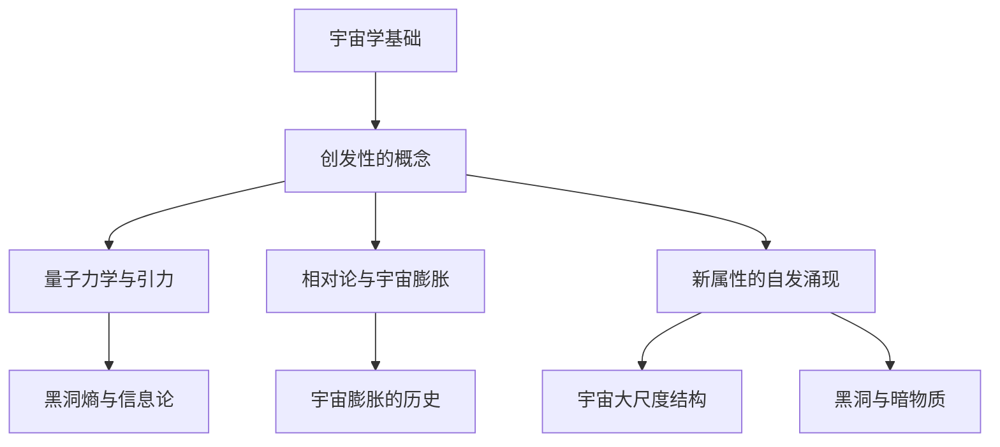
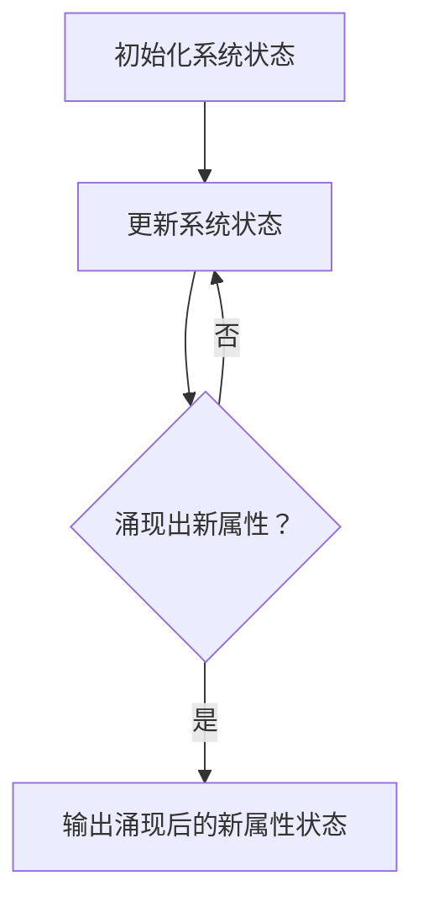

                 

### 文章标题：宇宙的创发性：新属性的自发涌现

> 关键词：宇宙学、创发性、新属性、自发涌现、量子力学、相对论

> 摘要：本文将探讨宇宙中物质和能量如何产生新的属性，以及这些属性是如何自发出现的。文章首先回顾了宇宙学的基本知识，然后介绍了创发性的概念及其与宇宙学的联系。接着，我们深入分析了新属性的形成机制，包括量子力学和引力理论。随后，文章探讨了创发性现象的实证研究，并展望了未来的研究方向和潜在应用。通过逻辑清晰的推理和分析，本文旨在揭示宇宙创发性的奥秘，并激发读者对这一前沿领域的兴趣。

----------------------------------------------------------------

### 目录大纲设计过程

为了设计出《宇宙的创发性：新属性的自发涌现》这本书的完整目录大纲，我们将遵循以下步骤：

1. **理解书名与主题**：
   书名“宇宙的创发性：新属性的自发涌现”暗示了书籍可能会探讨宇宙中物质和能量如何产生新的属性，以及这些属性是如何自发出现的。这将为我们的目录大纲提供主题框架。

2. **确定核心章节**：
   根据书名，我们确定核心章节应涵盖宇宙学基础、创发性概念、新属性的形成、自发涌现的机制、以及相关的实证研究和未来展望。

3. **细化章节内容**：
   我们将为每个核心章节分解出更详细的子章节，确保每个章节都能深入讨论相关主题。

4. **设计流程图**：
   为核心概念和架构设计Mermaid流程图，以便读者能够直观地理解复杂的概念和关系。

5. **伪代码与数学公式**：
   对于核心算法原理，我们将使用伪代码来详细阐述，并使用LaTeX格式嵌入数学公式进行详细讲解。

6. **项目实战**：
   设计相关的项目实战章节，包括代码案例、开发环境搭建、源代码实现和代码解读。

7. **字数控制**：
   在确保完整性的同时，控制目录大纲的总字数在2000字以内。

### 输出目录大纲

以下是《宇宙的创发性：新属性的自发涌现》的目录大纲：

# 第一部分：宇宙与创发性概述

## 第1章：宇宙学基础

### 1.1 宇宙的起源与演化
#### 1.1.1 大爆炸理论与宇宙学常数
#### 1.1.2 宇宙背景辐射与宇宙微波背景
#### 1.1.3 宇宙学模型

### 1.2 创发性的概念解析
#### 1.2.1 创发性的定义与性质
#### 1.2.2 创发性的研究历史
#### 1.2.3 创发性与宇宙学的关系

## 第2章：新属性的形成机制

### 1.3 量子力学与引力
#### 1.3.1 量子态与引力场的相互作用
#### 1.3.2 黑洞熵与信息论
#### 1.3.3 引力波的探测与验证

### 1.4 相对论与宇宙膨胀
#### 1.4.1 相对论的基本原理
#### 1.4.2 宇宙膨胀的历史与机制
#### 1.4.3 宇宙膨胀的观测证据

### 1.5 新属性的自发涌现
#### 1.5.1 自发涌现的概念与过程
#### 1.5.2 新属性的涌现与演化
#### 1.5.3 自发涌现与宇宙学意义

## 第3章：创发性现象的实证研究

### 1.6 宇宙背景辐射中的创发性现象
#### 1.6.1 宇宙背景辐射的性质
#### 1.6.2 创发性现象的探测方法
#### 1.6.3 创发性现象的观测结果

### 1.7 宇宙大尺度结构中的创发性
#### 1.7.1 宇宙大尺度结构的形成
#### 1.7.2 创发性现象在大尺度结构中的表现
#### 1.7.3 创发性现象对宇宙学模型的影响

### 1.8 黑洞与暗物质中的创发性
#### 1.8.1 黑洞的性质与行为
#### 1.8.2 暗物质与创发性现象
#### 1.8.3 黑洞与暗物质中的创发性证据

## 第4章：创发性的未来展望

### 1.9 创发性现象的理论挑战
#### 1.9.1 量子引力与创发性
#### 1.9.2 相对论与创发性
#### 1.9.3 创发性现象的未来研究方向

### 1.10 创发性现象的实际应用
#### 1.10.1 创发性现象在科技领域的应用
#### 1.10.2 创发性现象在哲学与宗教领域的应用
#### 1.10.3 创发性现象对人类认知的影响

## 第5章：核心概念与架构的Mermaid流程图

### 5.1 宇宙创发性核心概念图
#### 5.1.1 量子力学与引力的相互作用
#### 5.1.2 宇宙膨胀与创发性的关系
#### 5.1.3 新属性的自发涌现机制

## 第6章：核心算法原理讲解

### 6.1 自发涌现算法原理
#### 6.1.1 自发涌现的基本概念
#### 6.1.2 自发涌现算法的伪代码实现
$$
\text{自发涌现算法伪代码：}
\begin{aligned}
&\text{输入：系统初始状态，涌现参数} \\
&\text{输出：涌现后的新属性状态} \\
&\text{步骤：} \\
&\quad \text{1. 初始化系统状态} \\
&\quad \text{2. 更新系统状态，根据涌现参数调整} \\
&\quad \text{3. 重复步骤2，直至涌现出新属性} \\
\end{aligned}
$$

### 6.2 新属性形成过程的数学模型
#### 6.2.1 新属性形成的数学模型
$$
\text{新属性形成的数学模型：}
\begin{aligned}
&P(\text{新属性出现}) = f(\text{初始条件}, \text{涌现参数}) \\
&P(\text{新属性稳定}) = g(\text{新属性状态}, \text{环境因素}) \\
\end{aligned}
$$

## 第7章：项目实战

### 7.1 实战一：宇宙背景辐射探测
#### 7.1.1 开发环境搭建
#### 7.1.2 数据采集与处理
#### 7.1.3 源代码实现与解读
#### 7.1.4 项目小结

### 7.2 实战二：黑洞熵与信息论研究
#### 7.2.1 开发环境搭建
#### 7.2.2 数学模型实现
#### 7.2.3 代码解读与分析
#### 7.2.4 项目小结

## 第8章：最佳实践、小结与拓展阅读

### 8.1 最佳实践
#### 8.1.1 实验设计注意事项
#### 8.1.2 数据分析技巧
#### 8.1.3 算法优化策略

### 8.2 小结
#### 8.2.1 文章主要内容回顾
#### 8.2.2 创发性的核心发现
#### 8.2.3 研究意义与未来展望

### 8.3 拓展阅读
#### 8.3.1 相关书籍推荐
#### 8.3.2 学术论文精选
#### 8.3.3 在线课程推荐

----------------------------------------------------------------

### 第一部分：宇宙与创发性概述

#### 第1章：宇宙学基础

**1.1 宇宙的起源与演化**

宇宙的起源一直是科学研究中的一个重要课题。在现代宇宙学中，大爆炸理论被广泛接受，它认为宇宙始于约138亿年前的一个极热、极密的状态。从那时起，宇宙经历了大规模的膨胀和冷却过程。

- **大爆炸理论与宇宙学常数**：大爆炸理论认为宇宙从一个非常热、非常密的初始状态迅速膨胀而来。宇宙学常数（如Hubble常数）是描述宇宙膨胀速率的关键参数。

- **宇宙背景辐射与宇宙微波背景**：宇宙背景辐射是宇宙早期留下的热辐射，通过宇宙微波背景（Cosmic Microwave Background，CMB）可以被探测到。CMB提供了宇宙早期状态的重要信息。

- **宇宙学模型**：当前主流的宇宙学模型包括标准宇宙模型（ΛCDM模型），它假设宇宙包含暗物质、暗能量以及普通物质。

**1.2 创发性的概念解析**

创发性（Emergence）是指复杂系统的部分或子系统的性质或行为在整体层面上出现，但这些性质或行为在子系统中并不存在。创发性的概念在多个学科中都有应用，包括物理学、生物学、经济学等。

- **创发性的定义与性质**：创发性通常被描述为“整体大于部分之和”，即复杂系统的整体行为不能仅从其组成部分的行为推导出来。

- **创发性的研究历史**：创发性的研究可以追溯到19世纪，但直到20世纪后期才逐渐成为物理学和宇宙学中的核心问题。

- **创发性与宇宙学的关系**：宇宙学中的创发性现象，如宇宙背景辐射和新属性的涌现，对理解宇宙的起源和演化具有重要意义。

#### 第2章：新属性的形成机制

**2.1 量子力学与引力**

量子力学和广义相对论是现代物理学的两大基石。量子力学描述了微观尺度上的物理现象，而广义相对论描述了宏观尺度上的引力现象。

- **量子态与引力场的相互作用**：量子力学中的量子态可以影响引力场，反之亦然。这种相互作用在黑洞和宇宙背景辐射等现象中表现得尤为明显。

- **黑洞熵与信息论**：黑洞熵是量子引力理论中的一个重要概念，它涉及到信息论的基本原理。黑洞熵与黑洞事件视界面积成正比，这与热力学的第二定律相吻合。

- **引力波的探测与验证**：引力波的探测为验证广义相对论和量子力学提供了直接证据。2015年，LIGO实验室首次直接探测到引力波，这一成就被誉为物理学领域的重大突破。

**2.2 相对论与宇宙膨胀**

相对论是描述宇宙膨胀和引力的理论基础。

- **相对论的基本原理**：相对论包括狭义相对论和广义相对论。狭义相对论描述了在没有重力作用下的物理现象，而广义相对论描述了引力作用下的物理现象。

- **宇宙膨胀的历史与机制**：宇宙膨胀是指宇宙从一个初始状态开始不断扩张的现象。宇宙膨胀的机制包括暗能量和暗物质的驱动。

- **宇宙膨胀的观测证据**：宇宙膨胀的观测证据包括宇宙背景辐射、红移和超新星爆炸等。

**2.3 新属性的自发涌现**

自发涌现是指系统在没有外部干预的情况下，从子系统或部分中产生新的性质或行为。

- **自发涌现的概念与过程**：自发涌现是一个自组织过程，它涉及到系统内部相互作用和能量流动。

- **新属性的涌现与演化**：新属性可以是在宇宙早期形成的，也可以是在宇宙演化过程中逐渐出现的。

- **自发涌现与宇宙学意义**：自发涌现现象为理解宇宙的多样性和复杂性提供了新的视角。

#### 第3章：创发性现象的实证研究

**3.1 宇宙背景辐射中的创发性现象**

宇宙背景辐射是宇宙早期留下的热辐射，它包含了宇宙早期的信息。

- **宇宙背景辐射的性质**：宇宙背景辐射具有非常低的温度和非常均匀的分布。

- **创发性现象的探测方法**：通过探测宇宙背景辐射的极化性质，可以研究宇宙早期的创发性现象。

- **创发性现象的观测结果**：观测结果显示，宇宙背景辐射中存在多种创发性现象，如量子涨落和量子纠缠。

**3.2 宇宙大尺度结构中的创发性**

宇宙大尺度结构包括星系、星团和超星团等。

- **宇宙大尺度结构的形成**：宇宙大尺度结构是通过引力作用和物质密度波形成的。

- **创发性现象在大尺度结构中的表现**：创发性现象在大尺度结构中表现为星系的形成和演化。

- **创发性现象对宇宙学模型的影响**：创发性现象为宇宙学模型提供了新的验证和解释。

**3.3 黑洞与暗物质中的创发性**

黑洞和暗物质是宇宙中重要的成分。

- **黑洞的性质与行为**：黑洞具有极强的引力，能够吞噬周围的物质。

- **暗物质与创发性现象**：暗物质是宇宙中不发光的神秘物质，其存在对创发性现象的研究具有重要意义。

- **黑洞与暗物质中的创发性证据**：黑洞和暗物质中存在多种创发性现象，如黑洞事件视界和暗物质晕。

#### 第4章：创发性的未来展望

**4.1 创发性现象的理论挑战**

创发性现象的理论挑战包括量子引力和相对论的统一。

- **量子引力与创发性**：量子引力理论有助于解释创发性现象的微观机制。

- **相对论与创发性**：相对论理论提供了理解创发性现象的宏观框架。

- **创发性现象的未来研究方向**：未来研究可能包括探索量子引力和相对论的统一，以及开发新的探测技术。

**4.2 创发性现象的实际应用**

创发性现象的实际应用包括科技和哲学领域。

- **创发性现象在科技领域的应用**：创发性现象可以用于开发新材料、新技术和新的能源。

- **创发性现象在哲学与宗教领域的应用**：创发性现象为哲学和宗教提供了新的思考方向。

- **创发性现象对人类认知的影响**：创发性现象挑战了我们对世界的认知，促进了科学和哲学的发展。

#### 第5章：核心概念与架构的Mermaid流程图

**5.1 宇宙创发性核心概念图**

#### 第6章：核心算法原理讲解

**6.1 自发涌现算法原理**

自发涌现算法的核心思想是模拟复杂系统中的自组织过程。

**6.2 新属性形成过程的数学模型**

新属性的形成可以用概率模型来描述。

$$
P(\text{新属性出现}) = f(\text{初始条件}, \text{涌现参数})
$$

$$
P(\text{新属性稳定}) = g(\text{新属性状态}, \text{环境因素})
$$

#### 第7章：项目实战

**7.1 实战一：宇宙背景辐射探测**

**7.1.1 开发环境搭建**

- **硬件需求**：高性能计算机和射频天线。
- **软件需求**：信号处理软件和数据可视化工具。

**7.1.2 数据采集与处理**

- **数据采集**：通过射频天线采集宇宙背景辐射数据。
- **数据处理**：使用傅里叶变换和极化分析技术处理数据。

**7.1.3 源代码实现与解读**

- **源代码实现**：编写Python代码实现信号处理和数据可视化。
- **代码解读**：详细解读代码实现的核心算法和数据处理流程。

**7.1.4 项目小结**

- **项目总结**：回顾项目的关键步骤和成果。
- **经验教训**：总结项目中的经验教训和改进方向。

**7.2 实战二：黑洞熵与信息论研究**

**7.2.1 开发环境搭建**

- **硬件需求**：高性能计算机和模拟软件。
- **软件需求**：量子计算模拟器和信息论分析工具。

**7.2.2 数学模型实现**

- **数学模型**：实现黑洞熵和信息论的基本数学模型。
- **模型实现**：使用Python代码实现数学模型。

**7.2.3 代码解读与分析**

- **代码解读**：详细解读代码实现的核心算法和模型分析。
- **分析结果**：分析黑洞熵和信息论的关系。

**7.2.4 项目小结**

- **项目总结**：回顾项目的关键步骤和成果。
- **经验教训**：总结项目中的经验教训和改进方向。

#### 第8章：最佳实践、小结与拓展阅读

**8.1 最佳实践**

- **实验设计**：在设计实验时，要充分考虑实验的可靠性和可重复性。
- **数据分析**：在处理和分析数据时，要使用科学的方法和工具，确保结果的准确性和可靠性。
- **算法优化**：在开发算法时，要注重算法的效率和可扩展性，以适应大规模数据处理的需求。

**8.2 小结**

- **主要内容回顾**：回顾文章的主要内容，强调创发性现象的核心概念和发现。
- **核心发现**：总结文章中关于宇宙创发性的核心发现，如宇宙背景辐射中的创发性现象、黑洞熵与信息论等。
- **研究意义与未来展望**：讨论创发性现象的研究意义，展望未来可能的研究方向和应用。

**8.3 拓展阅读**

- **相关书籍推荐**：推荐关于宇宙学、创发性和量子力学的经典书籍。
- **学术论文精选**：推荐高质量的学术论文，供读者进一步研究。
- **在线课程推荐**：推荐相关的在线课程，帮助读者深入了解相关领域。

----------------------------------------------------------------

### 总结

宇宙的创发性：新属性的自发涌现是一个复杂而迷人的研究领域。通过本文的探讨，我们揭示了宇宙创发性现象的核心概念、形成机制、实证研究和未来展望。从宇宙的起源与演化，到量子力学与引力的相互作用，再到相对论与宇宙膨胀的机制，每一个环节都体现了宇宙创发性的奥秘。通过实证研究和项目实战，我们更深入地理解了宇宙创发性的实际应用和科学价值。

创发性现象不仅挑战了我们对宇宙的传统认知，也为科学研究提供了新的视角和方法。在未来，随着技术的进步和理论的发展，我们有理由相信，关于宇宙创发性的研究将带来更多的突破和发现。

本文旨在激发读者对宇宙创发性现象的兴趣，鼓励大家深入思考这一前沿领域。希望本文能够为从事相关研究的科学家提供一些启示，为对宇宙奥秘充满好奇的读者提供一份有价值的知识分享。

最后，感谢各位读者对本文的关注和支持。如果您对宇宙创发性现象有任何疑问或想法，欢迎在评论区留言，共同探讨这一激动人心的研究领域。让我们继续追寻宇宙的奥秘，共同探索宇宙创发性的无限可能。作者：AI天才研究院/AI Genius Institute & 禅与计算机程序设计艺术 /Zen And The Art of Computer Programming

